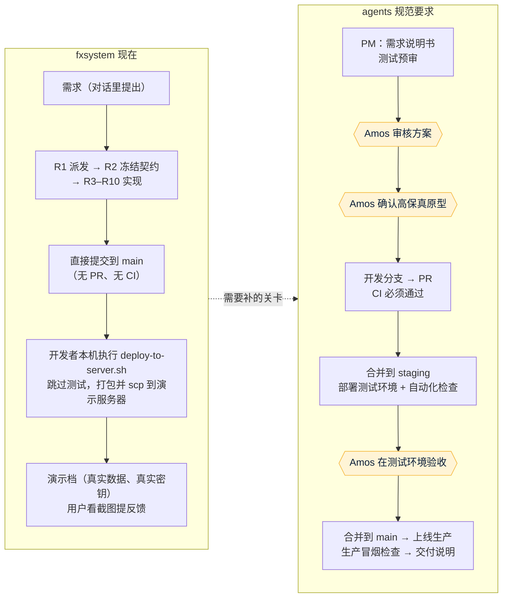
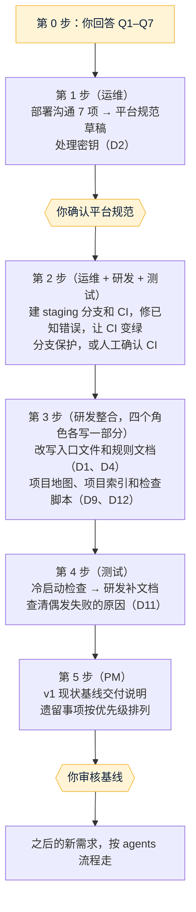

# fxsystem 对齐 agents 四角色规范：差异分析
- 版本：v1（2026-10-03）
- 变更历史：v1（2026-10-03）首次创建
- 依据：agents 仓库 main `073ed80`（协作总则 v0.8、四个角色文件 v0.8 / v0.7.2、`平台规范/Vercel.md` v0.8、模板和工具）；fxsystem 仓库 main `da65af9`。
- 性质：**只做分析和建议，没有改动 fxsystem 的任何代码和现有规范。**每一项调整都要等 Amos 审核通过后再执行。
- 读取范围：根目录的入口文件（`AGENTS.md`、`CLAUDE.md`、`README.md`、`SKILLS.md` 目录）、`.agents/session-bootstrap.md`、`.claude/settings.json`、`.github/`、`.gitignore`、`docs/setup/项目地图.md`、`docs/setup/当前开发计划.md`（§1 前几十条和 §2–§4）、`docs/setup/AWS演示档部署手册.md` §0–§1、`docs/process/AI工作模式.md` 目录，以及 GitHub 上的分支和 PR 列表。**没有逐个读业务代码和测试代码，没有运行任何构建或测试。**

## 一图看懂：现在怎么做 vs agents 规范要求怎么做

这张图想说明：fxsystem 的技术规范很完整，但从"需求"到"上线"之间，**缺少 agents 规范要求的 4 道关卡**：Amos 审核方案、原型确认、CI、测试环境验收。另外，"开发分支 → PR → staging → main"这条通道也不存在。

## 1. 项目现状速览（读到的事实）

| 方面 | 现状 | 出处 |
|---|---|---|
| 业务 | B-Book CFD 交易平台：客户端交易终端、5 个后端服务加网关、管理端（后端和前端） | `docs/setup/项目地图.md` §1 |
| 技术栈 | Java 25 / Spring Boot 4 / MyBatis + XML / MySQL 8.4 / Redis / Kafka / ClickHouse / Flyway；前端 Vite + React + TS | `AGENTS.md` §0 |
| 阶段 | 2026-06-05 宣布"一期开发封板"；最近一条记录 2026-06-08（K 线接口修复，已部署演示档） | `当前开发计划.md` §1 |
| 遗留事项 | PROD-OPS 环境阻断项（trust store 固化、Secret 治理、外部 LP 和 ETH 的 canary 真实演练、生产部署证据）、多实例高可用、R6 二轮测试、STAGE-14 遗留的细化项、账户币种统一为 USD、管理端挂单页补 userId、Flyway V28/V29 修复脚本待 DBA 执行 | `项目地图.md` §6、`当前开发计划.md` §1 |
| 协作规范 | 项目自带一整套规则：10 角色（R1–R10）、17 个 Skill、Karpathy 4 条编码准则、Superpowers 和 gstack 工具流程、完成定义。SessionStart hook 强制先读 `.agents/session-bootstrap.md` | `AGENTS.md`、`.claude/settings.json` |
| 分支 | GitHub 上只有 `main`，没有开分支保护；PR 数为 0；项目规定"日常开发在 `main` 上提交" | GitHub 分支和 PR 列表、`AGENTS.md` §3.12.2 |
| Git 历史 | **整个仓库只有 1 个提交**（`da65af9`），文档里引用的几百个提交号（例如 `0550cf56`、`9fe71750`、`c95ca5a8`）在本仓库都查不到 | `git log` |
| CI | 没有 `.github/workflows/`，测试只在开发者本机运行 | 仓库目录 |
| 环境 | 本地 + 一台"演示档"服务器（Docker Compose 单机，前面是 Cloudflare 和 nginx edge），域名 `app-falconx` / `admin-falconx.lifebyteapp.dev`。没有测试环境，也没有生产环境 | `AWS演示档部署手册.md` §0–§1 |
| 部署 | `scripts/deploy-to-server.sh`：在开发者本机打包（跳过测试）→ 构建镜像 → scp → 服务器上 `up -d --force-recreate` → 公网冒烟 4 项 | 部署手册 §0.1 |
| 文档 | 共 199 个 `.md`。`docs/` 下**没有一张 Mermaid 图**，也没有"一图看懂"；没有需求说明书、交付说明这一类按版本组织的文档，交付台账写在《当前开发计划》§1，一条记录往往有上千字 | 检索结果 |

## 2. 差异清单

优先级：**P0** = 违反底线或有安全风险，要先处理；**P1** = 规范要求的关卡或文件缺失；**P2** = 文档质量和一致性。

| 编号 | 优先级 | agents 规则 | fxsystem 现状 | 建议调整 | 负责角色 | 需要 Amos 决定 |
|---|---|---|---|---|---|---|
| D1 | P0 | 以 agents 规则为唯一依据（启动提示词）；四角色 | 项目自带 10 角色体系，并把它写成"唯一真源"；`CLAUDE.md` 和 SessionStart hook 都把智能体引向这套规则。两套规则在角色、关卡、分支上直接冲突（见 D2–D5） | **两层分工**：agents 管流程、关卡和底线；fxsystem 的技术专题规范（架构、数据库、REST/WS、Kafka、状态机、安全、事务和幂等、编码和日志）继续作为项目的"正式专题规范"。10 角色退役，按附录 B 映射到四角色；Superpowers 和 gstack 降为可选工具。需要改写 `AGENTS.md`、`CLAUDE.md`、`.agents/session-bootstrap.md`、`docs/process/AI工作模式*.md`、`完成定义.md`、`.agents/templates/` | 研发整合，PM 写业务部分 | ✅ Q1 |
| D2 | P0 | 密钥不经过 AI、不进仓库；不保存长期有效的生产凭据，需要时用临时账号（运维 v0.5） | ① 《项目地图》§4 和《当前开发计划》说"本私有仓库**已直接提交真实 `.env`** + truststore（`c95ca5a8`）"，但部署手册 §0.6 又写"`.env` **绝不入 git**"；当前仓库里没有 `.env`，也找不到这个提交。② 历史上智能体直接用 `ssh ubuntu@…`（免密 sudo）操作服务器，而服务器的 `.env` 里有热钱包私钥（`FALCONX_WALLET_*_PRIVATE_KEY_PEM`）。③ 文档里写了管理员初始密码（首次登录强制修改）。④ `tools/lp-truststore.p12` 已入库 | ① 确认原仓库或其他副本里是否还有真实 `.env`；有的话，把**热钱包私钥、LP 凭据、内部 Token、数据库密码**都当作已泄露，由 Amos 在服务器上轮换；修正两处矛盾的说法。② 今后不让智能体持有服务器 SSH，改为运维分步指导 Amos 操作，或者用临时账号、用完即删。③ 文档删掉初始密码，只写"见服务器启动日志或由 Amos 设置"。④ 运维确认 truststore 只含公开证书 | 运维 | ✅ Q3、Q6 |
| D3 | P0 | 回滚点和版本可以追溯（版本化；Git 回滚点） | 仓库只有 1 个提交，文档引用的提交号全部查不到，旧的回滚点等于失效 | 确认原始仓库在哪里。两个选项：迁回完整历史；或者以 `da65af9` 为新基线，在《项目地图》里注明"文档中的旧提交号属于原仓库 ×××" | 运维 | ✅ Q5 |
| D4 | P1 | 开发分支 → PR → `staging`（测试环境）→ `main`（生产）；合并节点 ② 需要 Amos 同意（总则第二节，C34） | 规定"日常开发一律在 `main` 上提交"，没有 PR，没有 `staging` | 新建 `staging` 分支；每个任务一个开发分支（例如 `claude/<任务>`），用 PR 交付；改写 `AGENTS.md` §3.12、§8 里"是否在 `main` 分支"的检查项 | 运维定流程，研发改文档 | 随 Q1 |
| D5 | P1 | 每个项目都要有 CI，每个 PR 跑全部单元测试和索引检查，不通过不合并；用分支保护强制，并勾选"不允许绕过"（C54） | 没有 CI。另外几个阻碍：trading-core 全量测试因 Redis 端口配置不一致（6379 和 6380）有约 141 个错误；集成测试依赖本机的 MySQL、Redis、Kafka、ClickHouse；管理端前端 lint 有 19 个已知错误 | 按 `agents/模板/ci.yml` 建 CI：JDK 25 + Maven；用 GitHub 的服务容器提供 MySQL 8.4、Redis、Kafka、ClickHouse；两个前端跑 `npm run test/lint/build`；外加索引检查。**先修已知错误，让第一次运行变绿**，不许跳过测试。分支保护能不能开，取决于仓库是否公开和 GitHub 套餐 | 运维建 CI，研发修错误，测试核对覆盖面 | ✅ Q4 |
| D6 | P1 | 部署平台先确认：Vercel 以外的"其他服务器"，要先和 Amos 单独沟通 7 项，整理成 `平台规范/<平台>.md`，确认后才能执行（总则第五节） | 自建的 Docker Compose 单机（AWS 服务器 + Cloudflare + nginx edge）；从开发者本机构建、跳过测试；部署的内容不一定是已合并的代码 | 运维按 7 项沟通清单逐项和 Amos 确认（访问方式、凭据、发布、回滚、测试环境、数据、监控），写成 `agents/平台规范/Docker-Compose自建服务器.md`（名称待定）。在此之前，现有的部署脚本不作为规范流程 | 运维 | ✅ Q2、Q3 |
| D7 | P1 | 上生产前必须在测试环境通过 Amos 验收；测试环境的数据和密钥与生产隔离（C34） | 只有一个演示档，用真实数据和真实密钥，部署完直接给人用 | 先定演示档是什么：默认把它当**测试环境（staging）**，生产环境以后单独建；或者反过来，另建测试环境。环境标识（页面上显示当前环境、健康检查返回 `env`）要按研发 C34 补 | 运维、研发 | ✅ Q2 |
| D8 | P1 | 方案先行；有界面的需求先经 Amos 确认高保真原型；交 Amos 审核的方案要配图（C13，总则第 4.5 步） | R2 冻结契约后直接实现；界面走 Figma 或直接写代码，部署后用户看截图再提反馈（当前开发计划里很多"用户截图反馈"）；`docs/` 下一张 Mermaid 图都没有 | 从下一个需求开始按 agents 流程走：需求说明书 → 测试预审 → 方案（配图）→ Amos 审核 → 原型（部署到预览环境，标注"这是原型"）→ Amos 确认 → 开发。原型放在哪个环境，随 D6 一起定 | PM、研发 | 否（照规则执行） |
| D9 | P1 | 项目根目录要有 `项目地图.md`、`项目索引.md`、`CLAUDE.md`、`AGENTS.md`，加上 `项目索引.config.json` 和 `scripts/check-project-index.mjs`；冷启动检查（C53） | 有 `docs/setup/项目地图.md`，但不在根目录，章节和模板不同（缺"不能破坏的约定""常见改动的检查清单""冷启动问题清单""一图看懂"）；没有项目索引和检查脚本；`CLAUDE.md` 没有指向项目地图 | 按模板在根目录重写《项目地图》（把现有的导航内容、运维红线、工程经验教训 L1–L8 收进去），新建《项目索引》，接入检查脚本，完成后做一次冷启动检查。**索引的粒度要先定**（见 Q7）：项目有约 4200 个文件，其中大量是 Java 文件 | 研发整合，四个角色各写自己的部分 | ✅ Q7 |
| D10 | P1 | 每份产出有版本号；目录按 `需求文档/`、`技术方案/`、`测试报告/`、`部署方案/`、`交付记录/` 组织；交付说明分"测试环境验收前"和"上线后"两版（总则第三节） | 交付台账写在《当前开发计划》§1，按阶段编号散在 `docs/design`、`docs/process`、`docs/test` 里；没有交付说明 | **历史文档不迁移**，只在《项目索引》的文档索引里登记。从下一个需求开始用 agents 的目录结构。另外补一份 `交付记录/v1-现状基线交付说明.md`，把当前状态和遗留事项按 agents 格式汇总一次，作为接手的起点 | PM | 否 |
| D11 | P1 | 偶发失败也要找到原因，不能只写"偶发"（C57）；测试写明"实际执行"还是"代码走查"（底线） | 《项目地图》写着"已知 flaky：`TierConfigListPage.test.tsx`，每轮失败的用例不同，不是回归"；有几条记录写着"集成测试本地未起栈、没有跑（编译通过）"；浏览器截图因 WSL 的限制缺了几轮 | 测试找出这个偶发失败的原因并修复；没有跑过的集成测试，在 CI 建好后补跑，结果写进测试报告；缺的截图在 CI 或容器环境里补 | 测试，研发配合 | 否 |
| D12 | P2 | 项目地图只写当前状态，几份入口文档之间不能互相矛盾（C53） | `README.md` 还写着"Stage 7A 未完成、CROSS 不在范围"，和"一期封板"矛盾；《当前开发计划》§3 写"8 角色"，`AGENTS.md` 写"10 角色"；`.env` 的说法也前后矛盾（见 D2） | 重写地图时一起修正；`README.md` 改成只做简介，指向地图和索引 | PM、研发 | 否 |
| D13 | P2 | 改动数据结构时，已有数据怎么办要写清楚（C55） | Flyway V28/V29 的历史漂移是"部署前阻断项"：修复脚本和 runbook 已经写好，但演示库还没有执行 | 列入遗留事项；DBA（或 Amos）执行时，运维分步指导，并先备份 | 运维 | 执行时间由 Amos 定 |

## 3. 需要你先决定的问题（附默认值，可以一句"全部按默认"）

| 编号 | 问题 | 默认值 |
|---|---|---|
| Q1 | 规则怎么分层？ | agents 管流程、关卡和底线；fxsystem 的技术专题规范保留；10 角色体系退役，按附录 B 映射到四角色 |
| Q2 | 演示档服务器算什么环境？生产环境有没有计划？ | 演示档作为**测试环境（staging）**。生产环境暂时不存在，上线时另建，部署方式到时再沟通 |
| Q3 | 服务器谁来操作？ | 智能体不再持有 SSH。运维写好步骤，在对话里一步一步指导你执行；确实需要智能体执行时，你开临时账号，用完即删 |
| Q4 | fxsystem 仓库是公开还是私有？GitHub 用什么套餐？ | 私有 + 免费版：分支保护开不了，合并前人工确认 CI 是绿的，并附上运行链接（C54） |
| Q5 | 原始 Git 历史在哪里？要不要迁回来？ | 不迁回。以 `da65af9` 为新基线，在《项目地图》里注明旧提交号的出处 |
| Q6 | 原仓库或其他副本里，是否还有提交过的真实 `.env`？ | 按"可能已泄露"处理：由你在服务器上轮换热钱包私钥、LP 凭据、内部 Token、数据库密码，然后把相关说法从文档里删掉 |
| Q7 | 项目索引要列到多细？ | 文档、配置、迁移脚本、部署和脚本文件逐个列出；Java 代码按模块和包列出，接口、表、Kafka 主题、环境变量用"名单检查"保证不漏。这和 C53"列出每一个文件"的字面要求不一致，需要你同意（同时记进流程磨合观察） |

## 4. 建议的调整顺序

这张图想说明：先定规则层级和平台，处理掉密钥这类风险，再建 CI 和通道，最后整理文档。第 2、3 步各交一个 PR，都要先过 CI，合并前征得你同意。

## 5. 不需要调整、建议保留的内容
- 技术专题规范：架构和服务边界、数据库设计和 SQL 蓝图、REST / WebSocket / Kafka / 状态机 / 安全 / 事务和幂等、编码和日志。这些和 agents 规则没有冲突，正是 agents 要求"研发写清楚的不能破坏的约定"。
- 现有的运维经验：部署手册 §0.2–§0.3 的守则和验收标准（例如"容器 running 不算数，要看 `Started` 日志 + 带认证走公网全链"），`工程经验教训` L1–L8。这些和 agents 的 C39、C57 方向一致，写进新的地图和平台规范。
- 已有的测试资产：测试用例文档、`scripts/phase4-e2e-*`、`falconx-canary`、`tools/cold-start-check.sh`。
- 全部使用中文。

## 6. 未验证事项
- 没有运行任何构建和测试，"约 141 个错误""lint 19 个错误"都来自项目文档的记录，**未验证**。
- 原仓库或其他副本里是否还有真实 `.env`：本仓库查不到，**未验证**。
- `tools/lp-truststore.p12` 的内容：**未验证**。
- 演示档服务器的当前状态、在线数据：没有访问，**未验证**。
- 本文的 Mermaid 图在 GitHub 上的渲染效果：**未验证**，请打开 PR 里的文件确认。

## 跨角色反馈 / 分歧记录

| 编号 | 提出方 → 接收方 | 内容 | 状态 |
|---|---|---|---|
| F1 | 测试 → 研发 | `TierConfigListPage.test.tsx` 标为"已知 flaky"，按 C57 需要找到原因 | 转 Amos（随第 4 步排期） |
| F2 | 运维 → Amos | 密钥曾经入库的说法和智能体直连服务器，见 D2 | 转 Amos（Q3、Q6） |

## 附录 A：流程磨合观察（本轮结束后整理进 agents 的修改建议）
1. **接手已有的大型项目，规则里没有写怎么做。**总则第一节只写了"首次创建"和"后续迭代"。fxsystem 这种有自己整套规则、已经上线演示的项目，需要一个"接入"流程：先做差异分析，再定规则层级，然后补关卡，最后出基线交付说明。
2. **项目自带协作规则时，以谁为准没有写。**建议在总则里明确："agents 管流程、关卡和底线；项目的技术专题规范保留；项目里和 agents 冲突的协作规则，接入时改写"。
3. **C53"列出每一个文件"不适合几千个代码文件的项目。**建议允许按模块和包列出代码，同时用名单检查保证接口、表、主题、变量不漏。
4. **CI 模板只有 Node 的写法。**Java、Maven 加多种中间件（MySQL、Redis、Kafka、ClickHouse）的项目，需要补一个参考写法。
5. **"演示环境"在规则里没有位置。**现在规则只有原型（预览）、测试环境、生产三种。演示档用真实数据给人看，要明确它属于哪一种。

## 附录 B：10 角色到四角色的映射（Q1 选默认时使用）

| fxsystem 角色 | 归入 agents 角色 | 说明 |
|---|---|---|
| R1 Commander | PM | 需求拆解、任务清单、汇总交付说明。派发由一个智能体依次扮演，不再另开会话 |
| R2 Contract Designer | 研发（技术方案） | 接口、数据库、事件契约写进技术方案，随方案交 Amos 审核；业务口径由 PM 定 |
| R3 UI/UX Designer | PM（线框、品牌方向）+ 研发（效果图、原型） | 按总则的"视觉设计归属" |
| R4 业务后端、R5 客户端、R9 管理端后端、R10 管理端前端 | 研发 | "三端一体化"作为研发的完成标准保留 |
| R6 Test Designer、R7 QA Verifier | 测试 | 预审、测试用例、测试环境检查、页面走查、冒烟检查 |
| R8 Doc Synchronizer | 不单设 | 每个角色在同一个 PR 里更新自己负责的那部分项目地图和索引（C53） |
| （缺） | 运维 | fxsystem 现在没有运维角色，部署脚本、CI、环境、密钥都要由运维接管 |
