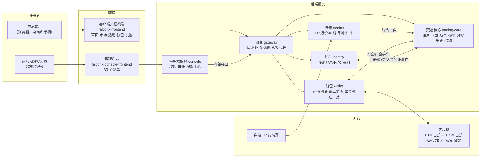
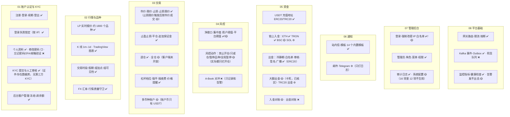
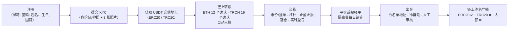

# FalconX 功能地图 · 总览
- 版本：v1（2026-10-07）
- 变更历史：v1（2026-10-07）首次创建
- 依据：fxsystem main `da65af9`；agents main `4025297`（v0.9）。8 个分册逐项对照代码核实，**没有运行构建和测试，没有访问演示服务器**。
- 用途：让 Amos 了解这个项目现在有什么功能、做到什么程度、有哪些问题，据此决定是否在它的基础上继续迭代。
- 编写：PM 整合；8 个分册由研发视角对照代码编写，测试视角标注实现状态和未验证事项，运维视角负责平台和部署部分。

## 一图看懂

这张图想说明：FalconX 是一个**完整的 B-Book 差价合约（CFD）交易平台**，客户端、管理后台、6 个后端服务和链上钱包都已经搭起来并在演示服务器上跑着。大部分功能已经实现，但安全和资金方面有几个必须先修的问题（见第 5 节）。

## 1. 这个项目是什么
- **业务**：平台自己做客户的交易对手（B-Book），客户用 USDT 入金，交易外汇、贵金属、指数、能源、股票、ETF、加密货币等约 1800 个品种的差价合约，可以加杠杆，盈亏在平台账户里结算，再用 USDT 出金。**不做** A-Book（把单子抛给上游对冲）。
- **规模**：
  - 6 个后端服务、2 个前端、5 个 MySQL 库，另外用到 Redis、Kafka、ClickHouse。
  - 数据库迁移脚本：账户 6 个、行情 20 个、交易 36 个、钱包 6 个、管理端 15 个。
  - 后端测试类约 220 个。**没有 CI**，这些测试平时只在开发者本机运行。
- **现状**：
  - 2026-06-05 宣布"一期封板"，最后一次记录的修改是 2026-06-08。
  - 部署在一台演示服务器上，使用真实数据和真实密钥。按规则 C61，这台服务器应当视为生产环境。

## 2. 功能全景：235 项功能，七成已实现

| 分册 | 功能数 | 已实现 | 部分实现 | stub/骨架 | 占位 | 不做 | 文档与代码不一致 |
|---|---|---|---|---|---|---|---|
| [01 账户认证与 KYC](01-账户认证与KYC.md) | 28 | 22 | 5 | 0 | 0 | 1 | 18 |
| [02 行情与品种](02-行情与品种.md) | 34 | 31 | 2 | 0 | 0 | 1 | 13 |
| [03 交易](03-交易.md) | 31 | 22 | 6 | 1 | 1 | 1 | 18 |
| [04 风控](04-风控.md) | 26 | 17 | 9 | 0 | 0 | 0 | 18 |
| [05 资金：入金、出金和钱包](05-资金-入金出金与钱包.md) | 30 | 16 | 12 | 2 | 0 | 0 | 26 |
| [06 通知与消息](06-通知与消息.md) | 35 | 26 | 5 | 2 | 1 | 1 | 15 |
| [07 管理后台：权限、审计和平台配置](07-管理后台-权限审计与平台配置.md) | 23 | 15 | 8 | 0 | 0 | 0 | 22 |
| [08 平台基础：网关、事件和运维](08-平台基础-网关事件与运维.md) | 28 | 19 | 9 | 0 | 0 | 0 | 22 |
| **合计** | **235** | **168（71%）** | **56（24%）** | **5** | **2** | **4** | **152** |

每个分册都写到了字段级：接口的请求和响应字段、数据表的全部字段、枚举取值、计算公式、状态机、错误码、事件和定时任务，每条都附了代码位置。

图例：✅ 已实现 · 🟡 部分实现 · ⚙️ stub/骨架 · ⬜ 占位 · ❌ 没有或不做。这张图想说明每个业务域主要有什么、做到什么程度；完整的 235 项见各分册的"功能清单"。

## 3. 客户和运营能做什么

### 3.1 客户的完整旅程

这张图想说明：从注册到出金的主流程已经打通；出金这一段还有缺口，TRC20 出金和 3000 及以上的大额出金都走不完。

客户端界面：
- 共 5 个视图：首页、市场、活动、钱包、设置。
- 桌面和手机都已适配。
- 深浅两种主题。
- **只有简体中文**。

### 3.2 运营能做什么
管理后台有 33 个菜单，另有 9 个页面只有路由、没有菜单（其中 5 个是 KYC、出金、通知、通知模板、钱包死信队列，要手动输入网址才能进）。能做的事情：
- **客户**：客户管理（查看、编辑、冻结、调余额）、KYC 审核。
- **资金**：入金记录、出金审核（通过、拒绝、紧急取消）、充值地址预分配失败后的重试、入金对账。
- **交易**：订单、持仓、挂单、价格提醒的监控；手动强平；平台收入和用户盈亏看板。
- **风控**：净敞口看板、自动强平开关、风控动作、品种和市场的阈值、用户级阈值、平台总敞口阈值。
- **行情和品种**：品种主表、报价映射、交易时段、假期、隔夜费率、组加点、组可见性、跑马灯、FX 汇率。
- **交易参数**：杠杆和维持保证金档位、保证金模式切换的冷静期、追保线和强平线、FX 暂停时的行为。
- **系统**：通知模板、手动发通知、管理员、角色、菜单、权限、审计日志、系统配置。

## 4. 没有的功能
| 类别 | 没有的功能 |
|---|---|
| 账户安全 | 修改密码（占位按钮）、忘记密码、邮箱验证、两步验证（2FA） |
| 客户体验 | 多语言（界面全部写死中文）、通知偏好（占位）、充值地址二维码、自选收藏 |
| 资金 | 法币出入金、TRC20 出金、SOL 链、BSC 链（基本不工作）、出金对账、真实的 KMS/HSM 签名（现在用环境变量里的私钥） |
| 交易 | 部分平仓、净持仓、多币种账户、客户端全仓模式 |
| 风控 | A-Book 对冲出口、相关性组的管理界面、全仓开关的管理入口 |
| 第三方服务 | KYC 供应商、邮件、短信、Telegram（通知渠道只打日志） |
| 工程 | CI、测试环境、多实例高可用、死信队列、告警通知渠道 |

## 5. 必须先处理的问题

"核实方式"一列：**本人核实** = 我亲自读代码确认过；**分册推断** = 分册作者读代码得出，我没有复核；都没有实际运行。

### 5.1 安全（最高优先级）
| 编号 | 问题 | 后果 | 核实方式 | 出处 |
|---|---|---|---|---|
| S1 | 网关对 `/internal/v1/**` 不做登录校验，还会自动带上内部 Token；生产配置把网关 18080 等端口映射到服务器的对外端口 | 如果云安全组没挡住 18080，任何人都能直接调内部接口：调余额、批准出金、改 KYC 等级、冻结用户 | 本人核实（代码）；安全组**未验证** | 08 分册、01 分册 |
| S2 | `docker-compose.prod.yml` 里有 18 行凭证类配置直接写着值（私钥、LP 凭证、Alchemy Key 等） | 有仓库访问权的人都能拿到；应当视为已泄露 | 本人核实（只统计行数，没有读取值） | 08 分册 |
| S3 | 各服务的 Actuator 没有鉴权，heapdump 对外开放 | 内存快照里可能有密钥 | 分册推断 | 08 分册 |
| S4 | 有 `admin-user:update` 权限的人，可以通过编辑接口给任何人加上超级管理员角色 | 权限提升 | 分册推断 | 07 分册 C-10 |
| S5 | 手动设置的初始密码和重置后的密码，以明文写进审计表 | 密码泄露 | 分册推断 | 07 分册 C-14 |
| S6 | 7 个敏感权限码在注释里标着"高危"，但没有登记进高危权限表，审计里记成低风险 | 审计漏判 | 分册推断 | 07 分册 |

### 5.2 资金正确性
| 编号 | 问题 | 后果 | 核实方式 | 出处 |
|---|---|---|---|---|
| F1 | 3000 及以上的大额出金：审核时发出的事件结果是 `APPROVED_DELAYED`，钱包只处理 `APPROVED`；6 小时后调度器把订单推进到 `APPROVED`，但不再发事件 | 大额出金永远不会上链，客户资金一直冻结 | **本人核实**：`WithdrawDelayedScheduler.java`、`TradingWithdrawReviewedEventConsumer.java:68` | 05 分册 |
| F2 | TRC20 出金：客户可以提交，后台可以审批，钱包直接跳过，不写库也不发失败事件 | 资金一直冻结 | 分册推断 | 05 分册 F-22 |
| F3 | ERC20 合约地址没有配置时，扫块不按合约过滤；遇到不认识的合约，就读链上代币自报的 `symbol()` | 任何自称 USDT 的假币都会被当成真入金 | **本人核实**代码逻辑（`Web3jChainDepositListener.java:448-548`）；生产环境有没有配置合约地址**未验证** | 05 分册 |
| F4 | 入金被冲正时可能把余额扣成负数 | 账务错误 | 分册推断 | 05 分册 |
| F5 | 入金对账"标记已处理"的判断写反了 | 对账不可用 | 分册推断 | 05 分册 |
| F6 | 出金的 nonce 不回收，广播后没有超时处理 | 出金卡住 | 分册推断 | 05 分册 |

### 5.3 交易和风控正确性
| 编号 | 问题 | 后果 | 核实方式 | 出处 |
|---|---|---|---|---|
| T1 | 持仓列表、`position.update` 推送、强平判定这几处，组加点被叠加了两次 | 盈亏和强平判定偏差 | 分册推断 | 03 分册 |
| T2 | 删除组加点后，交易服务的增量同步收不到 | 客户看到的价格和实际成交价不一致 | 分册推断 | 02 分册 |
| T3 | 四级风控动作实际都只拦开仓，"只减仓"和"禁止开仓"效果相同 | 风控不按设计生效 | 分册推断 | 04 分册 |
| T4 | 持仓上限比较的是笔数，不是数量；用户级阈值和方向集中度没有换算成 USD | 风控阈值失真 | 分册推断 | 04 分册 |
| T5 | 风控告警推给该品种的所有持仓客户，内容带平台总净敞口和对冲阈值 | 平台敏感数据泄露给客户 | 分册推断 | 04、06 分册 |
| T6 | 前端监听 `liquidation.created`，后端发的是 `liquidation.update` | 客户收不到强平的实时提示 | 分册推断 | 03 分册 |
| T7 | 全仓强平不受自动强平开关和停盘配置约束，也没有保证金预警 | 风控开关对全仓无效 | 分册推断 | 03 分册 |

### 5.4 运维
| 编号 | 问题 | 出处 |
|---|---|---|
| O1 | Alertmanager 的 4 个接收方都是空的，告警发不出去 | 08 分册 |
| O2 | 系统配置 16 项里只有 4 项生效，页面却提示"秒级生效" | 07 分册 |
| O3 | Outbox 卡在"发送中"的消息没有回收，没有死信队列；8 个 Kafka 主题只发不收 | 02、08 分册 |
| O4 | 没有 CI、没有测试环境，部署从开发者本机打包、跳过测试 | 差异分析 D5–D7 |
| O5 | 内置通知模板可以被禁用；按代码推断，禁用后出金结算、保证金模式切换等会失败 | 06 分册 |
| O6 | 客户端通知分页参数名和后端不一致，通知列表永远只显示前 20 条 | 06 分册 |

## 6. 给决策的参考
**能直接复用的**：
- 业务覆盖面很广：235 项功能里 71% 已实现，客户端、管理后台、6 个服务和链上钱包都有。
- 技术规范完整：服务边界、数据库、接口、事件、状态机、事务和幂等都有文档。
- 关键链路有测试：后端约 220 个测试类。
- 已经在演示服务器上跑着真实数据。

**要付出的代价**：
- 第 5 节的安全和资金问题必须先修。大部分是局部逻辑缺陷，不是架构问题。
- 152 处文档和代码不一致，说明文档不能直接当依据，后续要以代码为准，重写项目地图和项目索引（C53）。
- 按 agents 规则还要补关卡：CI、测试环境、分支和 PR 流程（见差异分析 D1–D13）。

**建议**：**在这个项目的基础上继续迭代**，第一轮只做"止血"，不加新功能：
1. 你先做两件不用改代码的事：确认云安全组（S1），轮换已入库的凭证（S2）。
2. 按 agents 的"接入已有项目"流程（C59）补齐 CI 和测试环境。
3. 第一个迭代修第 5 节里的安全和资金问题（S1–S6、F1–F6），每一项都先写复现测试，再修复。
4. 然后再根据业务优先级，从第 4 节"没有的功能"里挑新需求。

决定权在你。如果你倾向于重写或者另起项目，这份地图也可以作为新项目的需求底稿。

## 7. 阅读指南
- 只看结论：读本文的第 2、5、6 节。
- 想了解某个业务的细节：打开对应分册。分册开头有"一图看懂"和"功能清单"，每项功能都写到了字段、公式、状态机和代码位置。
- 每个分册末尾有"文档与代码不一致"和"未验证事项"。

## 未验证事项
- 全部结论都来自读代码，**没有运行构建、测试，没有连 LP、区块链和数据库**。
- 演示服务器的云安全组规则、生产实际使用的配置（例如 ERC20 合约地址有没有配置）、服务器上线上数据的状态：都没有访问，**未验证**。
- 第 5 节标"分册推断"的问题，我没有逐条复核，进入修复迭代时由测试先写复现用例确认。
- `docker-compose.prod.yml` 里那 18 个写死值的变量具体是哪些：我列出变量名的操作被环境的安全策略拦了下来，需要你或运维在本地确认。
- 本文和各分册里的 Mermaid 图在 GitHub 上的渲染效果：**未验证**。

## 跨角色反馈 / 分歧记录
| 编号 | 提出方 → 接收方 | 内容 | 状态 |
|---|---|---|---|
| F1 | 运维 → Amos | S1 安全组需要你在 AWS 控制台确认；S2 凭证需要你在服务器上轮换 | 转 Amos |
| F2 | 测试 → 研发 | 第 5 节标"分册推断"的问题，进入修复迭代前先写复现测试 | 转 Amos（随迭代排期） |
| F3 | PM → 研发 | 152 处文档和代码不一致，重写项目地图和项目索引时以代码为准 | 转 Amos（随接入流程） |
