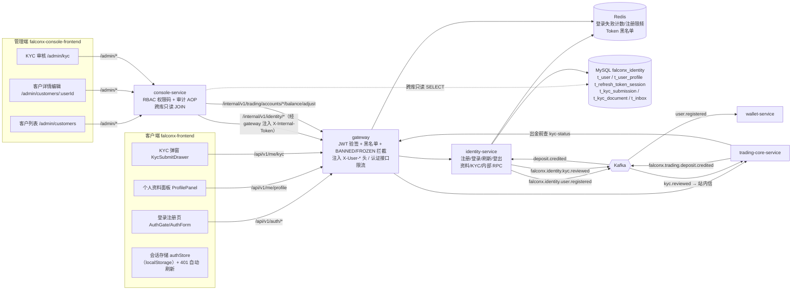

# FalconX 功能地图 · 账户认证与 KYC

- 版本：v1（2026-10-07）
- 变更历史：v1（2026-10-07）首次创建
- 依据：fxsystem main `da65af9`；对照代码逐项核实（未运行构建和测试）
- 范围：覆盖用户注册、登录、刷新、登出、Access Token 黑名单、登录失败锁定与注册限频、RSA JWT、邮箱可信度、用户状态 `UserStatus` 及状态机、用户产品组 `groupCode`、用户基础资料（`/api/v1/me/profile`）、入金后激活（消费 `deposit.credited`）、注册后发布 `user.registered`；KYC 提交、查询、`kyc_level`、管理端审核与 `kyc.reviewed` 事件；网关认证部分（JWT 校验、公开路由、透传头、`BANNED`/`FROZEN` 处理、认证接口限流）；客户端登录注册页、个人资料面板、KYC 弹窗；管理端客户管理（列表、详情、编辑、冻结/解冻、调余额）与 KYC 审核。不覆盖：交易下单与持仓、入金出金资金链路（含出金对 `kyc_level` 的门禁细节）、钱包地址分配、站内信模板和通知推送，这些在其他分册。

## 一图看懂



这张图想让读者看懂：用户身份数据只由 identity-service 写；客户端所有请求先经 gateway 验 JWT 再透传用户头；管理端的写操作全部由 console-service 经 gateway 的内部路由调用 identity 或 trading-core，读操作则由 console-service 直接跨库只读查询；identity 与其他服务之间只通过三个 Kafka 主题和一个内部查询接口联系。

## 功能清单

| 编号 | 功能 | 使用者 | 状态 |
| --- | --- | --- | --- |
| A-01 | 用户注册（含 5 项基础资料） | 客户端用户 | 已实现 |
| A-02 | 邮箱密码登录（含 IP 级失败锁定） | 客户端用户 | 已实现 |
| A-03 | Refresh Token 刷新与轮换 | 客户端用户 | 已实现 |
| A-04 | 登出与 Access Token 黑名单 | 客户端用户 | 已实现 |
| A-05 | RSA JWT 签发与 claim 结构 | identity / gateway | 已实现 |
| A-06 | 网关认证（验签、公开路由、透传头、状态拦截、认证限流） | gateway | 已实现 |
| A-07 | 用户状态 `UserStatus` 与状态机 | identity / 管理端 | 部分实现 |
| A-08 | 入金后激活（消费 `deposit.credited`）与 inbox 清理 | identity | 已实现 |
| A-09 | 注册后发布 `user.registered` | identity → wallet | 已实现 |
| A-10 | 邮箱可信度 `email_verified` | identity / 管理端 | 部分实现 |
| A-11 | 用户产品组 `groupCode` | identity / gateway / 管理端 | 已实现 |
| A-12 | 用户基础资料查询与修改（`/api/v1/me/profile`） | 客户端用户 | 部分实现 |
| A-13 | KYC 提交 | 客户端用户 | 已实现 |
| A-14 | KYC 状态查询 | 客户端用户 | 已实现 |
| A-15 | 管理端 KYC 审核（列表、详情、通过、驳回） | 运营 | 已实现 |
| A-16 | `kyc.reviewed` 事件发布 | identity → trading-core | 已实现 |
| A-17 | 内部 KYC 等级查询（供出金门禁） | trading-core | 已实现 |
| A-18 | 管理端客户列表 | 运营 | 已实现 |
| A-19 | 管理端客户详情 | 运营 | 部分实现 |
| A-20 | 管理端编辑客户（账户元数据 + 基础资料） | 运营 | 已实现 |
| A-21 | 管理端冻结 / 解冻客户 | 运营 | 部分实现 |
| A-22 | 管理端调余额 | 运营 | 已实现 |
| A-23 | identity 内部 RPC 鉴权（`X-Internal-Token`） | console / trading-core | 已实现 |
| A-24 | 客户端登录注册页 | 客户端用户 | 已实现 |
| A-25 | 客户端个人资料面板 | 客户端用户 | 已实现 |
| A-26 | 客户端 KYC 弹窗 | 客户端用户 | 已实现 |
| A-27 | 客户端会话管理（存储、自动刷新、登出） | 客户端用户 | 已实现 |
| A-28 | 邮箱验证流程（发验证邮件、验证端点） | — | 不做 |

代码中没有找到入口的常见账户能力（未列入编号，供迭代决策参考）：用户自助修改密码、忘记密码/重置密码、两步验证（2FA）、手机号验证、登录设备/会话列表、账户注销。管理端也没有独立的"封禁"按钮（封禁只能通过 A-20 把状态改为 `BANNED`）。

---

## A-01 用户注册

- **状态**：已实现。后端 `AuthController.register` → `IdentityRegistrationApplicationService.register`，前端 `AuthForm` 注册模式调用 `authApi.register`。
- **使用者与入口**：
  - 客户端：未登录时渲染 `AuthGate`，URL hash `#register` 进入注册表单（`AuthForm mode="register"`）。
  - 接口：`POST /api/v1/auth/register`，identity-service；网关公开路由，无需认证。
- **业务逻辑**：
  1. 邮箱归一化：`trim().toLowerCase(Locale.ROOT)`；格式校验正则 `^[^@\s]+@[^@\s]+\.[^@\s]+$`，不通过返回 `10009`。
  2. 密码只校验长度 8–64（不校验复杂度），不通过返回 `10010`。
  3. 姓名校验：`firstName`、`lastName` 必须匹配 `^[\p{L}\p{M} '\-]{1,64}$`（只允许字母、组合符号、空格、撇号、连字符，不允许数字），`middleName` 非空时同样校验，不通过返回 `10025`。
  4. 出生日期：为空或晚于今天返回 `10024`；按 `Period.between(birthDate, today).getYears()` 计算周岁，小于 18 返回 `10020`。
  5. 国籍：必须在 `IsoCountryCodes.ALPHA3`（249 个 ISO 3166-1 alpha-3 代码，硬编码）中，否则 `10023`。
  6. 注册限频：在上述校验全部通过后、查重之前，按客户端 IP 消耗注册额度（Redis key `falconx:auth:register:limit:{ip}`，管道化 `INCR` + `EXPIRE`，窗口 `register-window` 默认 1h，上限 `register-limit` 默认 5）。计数 > 5 返回 `10004`。注意：每次请求都会重置窗口 TTL；重复邮箱的失败请求同样消耗额度。客户端 IP 取请求头 `X-Client-Ip`，缺失时取 `remoteAddr`。
  7. 邮箱查重：`t_user.email` 已存在返回 `10008`（因此可用于探测邮箱是否注册）。
  8. 写库（同一事务）：`t_user` 一行（`id` 雪花 ID；`uid` = `"U"` + id 的大写 base36；`status=ACTIVE`；`group_code='default'`；`email_verified=0`；`activated_at=created_at=updated_at=now`；密码 bcrypt 哈希，强度 `bcrypt-strength` 默认 12）；`t_user_profile` 一行（5 项基础资料，`language_preference` 默认 `zh-CN`，`timezone` 默认 `Asia/Shanghai`）。
  9. 事务提交后（`afterCommit`）发布 `falconx.identity.user.registered`（见 A-09），发布失败不回滚注册。
  10. 注册不自动登录，不签发 Token；前端提示"账户已创建，请登录"并切到登录表单。
  11. `register_ip`、`nickname` 两列存在但注册时不写入（见 A-07 字段表）。
- **字段**：
  - 请求字段（`RegisterRequest`）：

    | 字段 | 类型 | 必填 | 含义 | 约束/取值 |
    | --- | --- | --- | --- | --- |
    | `email` | string | 是 | 注册邮箱 | `@NotBlank`；服务端正则校验；归一化为小写 |
    | `password` | string | 是 | 明文密码 | `@NotBlank`；长度 8–64 |
    | `firstName` | string | 是 | 名 | `@NotBlank @Size(max=64)`；姓名正则 |
    | `middleName` | string | 否 | 中间名 | `@Size(max=64)`；非空时姓名正则；空白存 NULL |
    | `lastName` | string | 是 | 姓 | `@NotBlank @Size(max=64)`；姓名正则 |
    | `birthDate` | date（`yyyy-MM-dd`） | 是 | 出生日期 | `@NotNull`；不得晚于今天；满 18 周岁 |
    | `nationality` | string | 是 | 国籍 | `@Pattern(^[A-Z]{3}$)`；必须在 ISO alpha-3 字典内 |

  - 响应字段（`RegisterResponse`）：

    | 字段 | 类型 | 含义 |
    | --- | --- | --- |
    | `userId` | number（Long） | 用户主键雪花 ID（以 JSON 数字返回，未转字符串，前端类型声明为 `number`，有精度丢失风险） |
    | `uid` | string | 对外 UID，`U` + base36 |
    | `email` | string | 归一化后邮箱 |
    | `status` | string | 固定 `ACTIVE` |
    | `emailVerified` | boolean | 固定 `false` |

  - 涉及的数据表：`t_user`（全部字段见 A-07）、`t_user_profile`（全部字段见 A-12）。
- **错误码**：

  | 错误码 | 含义 | 触发条件 |
  | --- | --- | --- |
  | `10004` | Register Rate Limited | identity：同 IP 1h 内第 6 次；或网关：同 IP 每分钟 > 20 次（HTTP 429） |
  | `10008` | User Already Exists | 邮箱已注册 |
  | `10009` | Email Format Invalid | 邮箱正则不通过 |
  | `10010` | Password Too Weak | 密码长度不在 8–64 |
  | `10020` | User Age Below Minimum | 未满 18 周岁 |
  | `10023` | User Profile Country Code Invalid | 国籍不在字典 |
  | `10024` | User Profile Birth Date Invalid | 出生日期为空或在未来 |
  | `10025` | User Profile Name Invalid | 姓名不符合正则 |
  | `99004` | invalid request payload | Bean Validation 失败（HTTP 400） |
  | `99001` | internal error | 未预期异常（HTTP 500），例如 JSON 日期格式错误（按代码推断，见未验证事项） |

  identity 业务错误统一以 HTTP 200 + 非 `0` 的 `code` 返回（`IdentityGlobalExceptionHandler`）。
- **相关事件和定时任务**：发布 `falconx.identity.user.registered`（A-09）。
- **证据**：`falconx-identity-service/src/main/java/com/falconx/identity/controller/AuthController.java`、`.../application/IdentityRegistrationApplicationService.java`、`.../service/impl/RedisIdentitySecurityPolicyService.java`、`.../service/IsoCountryCodes.java`、`.../repository/MybatisIdentityUserRepository.java`、`falconx-infrastructure/.../id/PublicIdentifierFormatter.java`、`falconx-identity-contract/.../auth/RegisterRequest.java`、`RegisterResponse.java`、`falconx-frontend/src/features/auth/AuthForm.tsx`、`authApi.ts`。

## A-02 邮箱密码登录（含 IP 级失败锁定）

- **状态**：已实现。`AuthController.login` → `IdentityAuthenticationApplicationService.login`。
- **使用者与入口**：客户端 `AuthGate` → `#login` → `AuthForm mode="login"`；接口 `POST /api/v1/auth/login`，identity-service，公开路由。
- **业务逻辑**：
  1. 邮箱归一化为小写。
  2. 先检查 IP 是否被锁：Redis key `falconx:auth:login:fail:{ip}` 的计数 ≥ `login-failure-limit`（默认 5）时直接返回 `10003`（被锁期间的尝试不再累加计数）。
  3. 查用户；用户不存在或 bcrypt 比对失败，统一记一次失败（管道化 `INCR` + `EXPIRE login-lock-duration`，默认 15 分钟；每次失败都会重置 TTL），返回 `10005`。用户不存在与密码错误返回同一错误码。
  4. 锁定维度是客户端 IP，不是账户；IP 取 `X-Client-Ip` 头，缺失时取 `remoteAddr`。
  5. 历史 `PENDING_DEPOSIT` 用户：登录时先归一化为 `ACTIVE`（`activated_at` 为空则补 now）。
  6. `FROZEN` 返回 `10007`；`BANNED` 返回 `10002`（这两种情况密码已正确，不累加失败计数，也不清零计数）。
  7. 登录成功清除该 IP 的失败计数。
  8. 若 bcrypt 哈希强度低于当前配置（`needsRehash`），用本次明文重新哈希并保存。
  9. 更新 `last_login_at=now`（不记录登录 IP）。
  10. 签发 Token 对（见 A-05），在 `t_refresh_token_session` 写一行。
  11. 记录 Micrometer 指标 `falconx.identity.login.total`（counter）和 `falconx.identity.login.duration`（timer），标签 `outcome=success|failure`。
  12. 网关另有按 IP 每分钟限流（A-06）。
- **字段**：
  - 请求字段（`LoginRequest`）：

    | 字段 | 类型 | 必填 | 含义 | 约束/取值 |
    | --- | --- | --- | --- | --- |
    | `email` | string | 是 | 登录邮箱 | `@NotBlank` |
    | `password` | string | 是 | 明文密码 | `@NotBlank` |

  - 响应字段（`AuthTokenResponse`，登录和刷新共用）：

    | 字段 | 类型 | 含义 |
    | --- | --- | --- |
    | `accessToken` | string | RS256 JWT，`typ=access` |
    | `refreshToken` | string | RS256 JWT，`typ=refresh` |
    | `accessTokenExpiresIn` | number | Access Token 有效秒数（配置 TTL，默认 900） |
    | `refreshTokenExpiresIn` | number | Refresh Token 有效秒数（默认 259200） |
    | `userStatus` | string | 当前用户状态名 |
    | `emailVerified` | boolean | 邮箱可信度事实 |

  - 涉及的数据表：`t_user`（读 `email/password_hash/status`，写 `password_hash/status/activated_at/last_login_at/updated_at`）、`t_refresh_token_session`（见 A-03）。
- **错误码**：

  | 错误码 | 含义 | 触发条件 |
  | --- | --- | --- |
  | `10002` | User Banned | 用户 `BANNED` |
  | `10003` | Login Rate Limited | identity：IP 失败计数 ≥ 5；网关：同 IP 每分钟登录请求 > 20（HTTP 429） |
  | `10005` | Invalid Credentials | 用户不存在或密码错误 |
  | `10007` | User Frozen | 用户 `FROZEN` |
  | `99004` | invalid request payload | 字段为空（HTTP 400） |

- **相关事件和定时任务**：无。
- **证据**：`falconx-identity-service/.../application/IdentityAuthenticationApplicationService.java`、`.../service/impl/RedisIdentitySecurityPolicyService.java`、`.../service/impl/BCryptPasswordHashService.java`、`.../config/IdentityServiceProperties.java`、`src/main/resources/application.yml`（`falconx.identity.security.*`、`falconx.identity.password.bcrypt-strength`）。

## A-03 Refresh Token 刷新与轮换

- **状态**：已实现。`AuthController.refresh` → `RsaIdentityTokenService.refresh`。
- **使用者与入口**：客户端由 `authStore` 注册的刷新处理器在任意请求遇到 401 或 `10001` 时自动调用（A-27）；接口 `POST /api/v1/auth/refresh`，公开路由。
- **业务逻辑**：
  1. 解析并验签 Refresh Token：三段结构、RS256 签名、`exp` 未过期、`iss` 等于配置 issuer（默认 `falconx-identity-service`）、`typ=refresh`；任一失败返回 `10006`。
  2. 取 `jti`、`sub`、`exp`，缺失返回 `10006`。
  3. `SELECT ... FOR UPDATE` 锁定 `t_refresh_token_session` 中该 `jti` 行；不存在、`used=1` 或已过期返回 `10006`。
  4. 查用户；不存在返回 `10006`；`BANNED` 返回 `10002`。`FROZEN` 用户不拦截（但冻结时其 refresh 会话已被撤销，见 A-21）。
  5. CAS 标记旧会话已使用：`UPDATE ... SET used=1 WHERE jti=? AND used=0`，影响行数不为 1 返回 `10006`（并发重复刷新只有一个成功）。
  6. 签发新 Token 对，新 Refresh Token 获得完整 72h 有效期（滑动续期，无绝对会话上限）。
  7. 不做"旧 Token 重放即撤销全部会话"的检测。
  8. 前端单飞：同一时刻多个 401 共享同一个刷新请求（`refreshInFlight`）。
- **字段**：
  - 请求字段（`RefreshTokenRequest`）：

    | 字段 | 类型 | 必填 | 含义 | 约束/取值 |
    | --- | --- | --- | --- | --- |
    | `refreshToken` | string | 是 | 上次登录或刷新得到的 Refresh Token | `@NotBlank` |

  - 响应字段：同 A-02 `AuthTokenResponse`。
  - 涉及的数据表 `t_refresh_token_session`（identity owner，全部字段）：

    | 表.字段 | 类型 | 含义 | 约束/取值 |
    | --- | --- | --- | --- |
    | `t_refresh_token_session.jti` | VARCHAR(64) | Refresh Token 唯一 ID（UUID 去横线） | 主键 |
    | `t_refresh_token_session.user_id` | BIGINT | 用户 ID | NOT NULL |
    | `t_refresh_token_session.expires_at` | DATETIME(3) | 过期时间（UTC） | NOT NULL |
    | `t_refresh_token_session.used` | TINYINT | 是否已使用 | 0=未使用，1=已使用；默认 0 |
    | `t_refresh_token_session.issued_at` | DATETIME(3) | 签发时间 | NOT NULL |
    | `t_refresh_token_session.used_at` | DATETIME(3) | 标记已使用时间 | 可空 |
    | `t_refresh_token_session.created_at` | DATETIME(3) | 创建时间 | 默认当前时间 |
    | `t_refresh_token_session.updated_at` | DATETIME(3) | 更新时间 | ON UPDATE |

    索引：`idx_user_created(user_id, created_at)`、`idx_expires_used(expires_at, used)`。没有清理过期会话的定时任务（代码中未找到）。
- **错误码**：

  | 错误码 | 含义 | 触发条件 |
  | --- | --- | --- |
  | `10006` | Refresh Token Invalid | 验签/过期/类型/issuer 不符；会话不存在、已用、已过期；用户不存在；CAS 失败 |
  | `10002` | User Banned | 用户 `BANNED` |
  | `99004` | invalid request payload | 字段为空 |

- **相关事件和定时任务**：无。
- **证据**：`falconx-identity-service/.../service/impl/RsaIdentityTokenService.java`、`.../repository/MybatisRefreshTokenSessionRepository.java`、`src/main/resources/mapper/identity/RefreshTokenSessionMapper.xml`、`db/migration/V1__init_identity_schema.sql`、`falconx-frontend/src/features/auth/authApi.ts`。

## A-04 登出与 Access Token 黑名单

- **状态**：已实现。`AuthController.logout` → `IdentityAuthenticationApplicationService.logout`；网关在 `GatewayJwtVerifier.verifyAccessToken` 中查黑名单。
- **使用者与入口**：客户端账户菜单 `AccountMenu.handleLogout`、设置页 `SettingsPage`；接口 `POST /api/v1/auth/logout`，需要 Bearer Access Token（经网关校验）。
- **业务逻辑**：
  1. 请求头必须是 `Authorization: Bearer <token>`，否则 `10001`。
  2. identity 再次验签并校验 `typ=access`、`iss`、`exp`，取 `sub`、`jti`，计算剩余 TTL；TTL ≤ 0 返回 `10001`。
  3. 把 `jti` 写入 Redis：key `falconx:auth:token:blacklist:{jti}`，value `"1"`，TTL = 剩余有效期。
  4. 同时撤销该用户所有未使用的 refresh 会话（`UPDATE t_refresh_token_session SET used=1 WHERE user_id=? AND used=0`），即"所有设备同时登出"。
  5. 网关每次校验 Access Token 时 `hasKey` 黑名单，命中返回 `10001`（HTTP 401）。
  6. 黑名单只在主动登出时写入；冻结、封禁、管理端改状态都不写黑名单（见 A-07、A-21）。
  7. `FROZEN` 用户调用登出会被网关按"写请求"拦截返回 `10007`；前端忽略登出错误，直接清本地会话。
- **字段**：请求无 body；响应 `data=null`。Redis key 见上。
- **错误码**：

  | 错误码 | 含义 | 触发条件 |
  | --- | --- | --- |
  | `10001` | Unauthorized | 缺失或非法 Bearer、验签失败、过期、已在黑名单（网关 HTTP 401；identity HTTP 200） |
  | `10007` | User Frozen | 网关：`FROZEN` 用户的 POST 请求（HTTP 403） |
  | `10002` | User Banned | 网关：`BANNED` 用户（HTTP 403） |

- **相关事件和定时任务**：无。
- **证据**：`falconx-identity-service/.../controller/AuthController.java`、`.../application/IdentityAuthenticationApplicationService.java`、`.../service/impl/RedisIdentityTokenBlacklistService.java`、`falconx-gateway/.../security/GatewayJwtVerifier.java`、`falconx-frontend/src/features/terminal/AccountMenu.tsx`。

## A-05 RSA JWT 签发与 claim 结构

- **状态**：已实现。`RsaIdentityTokenService`（自写 JWT 编解码，不依赖 JWT 库）。
- **使用者与入口**：identity 签发；gateway 用公钥验签；客户端 `ProfilePanel` 用 `decodeJwtPayload` 读 claim 显示 UID、邮箱、状态。
- **业务逻辑**：
  1. 算法 RS256（`SHA256withRSA`），Header 固定 `{"alg":"RS256","typ":"JWT"}`，没有 `kid`。
  2. 私钥、公钥来自环境变量 `FALCONX_IDENTITY_PRIVATE_KEY_PEM`、`FALCONX_IDENTITY_PUBLIC_KEY_PEM`；gateway 公钥来自 `FALCONX_GATEWAY_PUBLIC_KEY_PEM`。代码类注释仍写"进程内临时 RSA 密钥对"，实际已从配置读取。
  3. Access Token TTL `falconx.identity.token.access-token-ttl` 默认 15m；Refresh Token TTL `refresh-token-ttl` 默认 72h。
  4. `jti` 为 `UUID` 去掉横线。
  5. Access Token claim：

     | claim | 含义 |
     | --- | --- |
     | `iss` | 签发方，默认 `falconx-identity-service` |
     | `typ` | 固定 `access` |
     | `sub` | 用户主键（字符串） |
     | `uid` | 对外 UID |
     | `email` | 脱敏邮箱：首字符 + `***` + `@域名`（`@` 位置 ≤ 1 时为 `***@域名`） |
     | `status` | 签发时的用户状态名 |
     | `groupCode` | 用户产品组，空则 `default` |
     | `jti` | Token 唯一 ID |
     | `iat` / `exp` | 签发 / 过期时间（Unix 秒） |

  6. Refresh Token claim：`iss`、`typ=refresh`、`sub`、`jti`、`iat`、`exp`。
  7. `emailVerified` 不进 JWT，只在接口响应中返回。
  8. claim 里的 `status`、`groupCode` 是签发时快照：管理端改状态或改组后，在用户拿到新 Access Token 之前（最长 15 分钟）网关仍按旧值处理。
- **字段**：见上表。
- **错误码**：无独立错误码（验签失败在 A-03/A-04/A-06 中体现）。
- **相关事件和定时任务**：无。
- **证据**：`falconx-identity-service/.../service/impl/RsaIdentityTokenService.java`、`.../config/IdentityServiceConfiguration.java`、`application.yml`（`falconx.identity.token.*`、`key-pair.*`）、`falconx-frontend/src/features/profile/ProfilePanel.tsx`。

## A-06 网关认证（验签、公开路由、透传头、状态拦截、认证限流）

- **状态**：已实现。`GatewayAuthenticationFilter`（order `HIGHEST_PRECEDENCE+10`）、`GatewayJwtVerifier`、`GatewayRateLimitFilter`（order `+15`）、`GatewayConfiguration` 路由表。
- **使用者与入口**：所有经网关（端口 18080）的请求。
- **业务逻辑**：
  1. 只对 `/api/v1/` 前缀做认证；以下情况直接放行：路径不以 `/api/v1/` 开头（包括 `/admin/**`、`/internal/**`）、公开路径 `/api/v1/auth/register`、`/api/v1/auth/login`、`/api/v1/auth/refresh`、`OPTIONS` 请求。`/api/v1/auth/logout` 需要认证。
  2. 缺失或不是 `Bearer ` 开头返回 HTTP 401 + `10001`。
  3. 验签（gateway 公钥）、`typ=access`、`exp` 未过期、`sub/uid/status/jti` 必须存在；不校验 `iss`。随后查 Redis 黑名单 `falconx:auth:token:blacklist:{jti}`。任一失败返回 401 + `10001`。
  4. 状态拦截：claim `status=BANNED` → HTTP 403 + `10002`；`status=FROZEN` 且方法为 POST/PUT/PATCH/DELETE → HTTP 403 + `10007`；FROZEN 的 GET 放行。
  5. 向下游注入（覆盖客户端同名头）：`X-User-Id`（=`sub`）、`X-User-Uid`、`X-User-Status`、`X-User-Group-Code`（空则 `default`）、`X-User-Jti`。下游 identity 的 `/api/v1/me/**` 直接信任 `X-User-Id`。
  6. 路由（按声明顺序首个匹配）：`/api/v1/auth/**` → identity；`/api/v1/me/withdraw/**`、`/api/v1/me/margin-mode/**`、`/api/v1/me/positions/**` → trading-core；其余 `/api/v1/me/**` → identity；`/internal/v1/identity/**` → identity 并由网关注入 `X-Internal-Token`（见 A-23）。每条路由有熔断器（identity-route：滑窗 20、最少 10 次、失败率或慢调用率 50%、慢调用阈值 1s、打开 10s）与超时（连接 1000ms、响应 5000ms）。
  7. 认证接口限流：`/api/v1/auth/login` 与 `/api/v1/auth/register` 按 IP、按分钟桶计数（key `falconx:gateway:rate:auth:{path}:{ip}:{minute}`，TTL 2 分钟），上限取动态配置 `gateway.ratelimit.auth-per-minute`，默认 `auth-request-rate-limit-per-minute=20`；超限 HTTP 429，注册返回 `10004`，登录返回 `10003`。`/api/v1/auth/refresh` 不在该限流内。网关取 IP 时只有当 `remoteAddress` 在可信代理列表 `gateway.security.trusted-proxy-ips` 中才采信 `X-Client-Ip`。
  8. 全局限流：同 IP 每分钟所有请求默认上限 200（`global-request-rate-limit-per-minute`），超限 `10013`（属于全局网关能力，此处只列出）。
  9. WebSocket 握手（`/ws/v1/**`）使用查询参数 `token`，同样验签并拒绝 `BANNED`（细节在实时推送分册）。
- **字段**：注入头见第 5 条。
- **错误码**：

  | 错误码 | 含义 | 触发条件 |
  | --- | --- | --- |
  | `10001` | Unauthorized | 缺 Token、验签/过期/类型错误、黑名单命中（HTTP 401） |
  | `10002` | User Banned | claim `status=BANNED`（HTTP 403） |
  | `10007` | User Frozen | claim `status=FROZEN` 且写请求（HTTP 403） |
  | `10003` | Login Rate Limited | 登录每分钟超限（HTTP 429） |
  | `10004` | Register Rate Limited | 注册每分钟超限（HTTP 429） |
  | `10013` | Global IP Rate Limited | 全局 IP 限流（与 identity 的 `10013` 号码冲突，见不一致一节） |

- **相关事件和定时任务**：无。
- **证据**：`falconx-gateway/src/main/java/com/falconx/gateway/filter/GatewayAuthenticationFilter.java`、`.../security/GatewayJwtVerifier.java`、`.../filter/GatewayRateLimitFilter.java`、`.../config/GatewayConfiguration.java`、`.../config/GatewaySecurityProperties.java`、`.../error/GatewayErrorCode.java`、`falconx-gateway/src/main/resources/application.yml`。

## A-07 用户状态 `UserStatus` 与状态机

- **状态**：部分实现。枚举、登录拦截、网关拦截、冻结/解冻状态机已接通；缺：没有专门的封禁接口（只能经 A-20 通用 PATCH 改 `BANNED`），PATCH 改状态不走状态机校验（可把 `BANNED` 改回 `ACTIVE`、可写入 `PENDING_DEPOSIT`），封禁或冻结不吊销已签发的 Access Token。
- **使用者与入口**：identity 内部；管理端 A-20、A-21。
- **业务逻辑**：
  1. 枚举 `com.falconx.domain.enums.UserStatus`：

     | 枚举 | 库值 | 含义 |
     | --- | --- | --- |
     | `PENDING_DEPOSIT` | 0 | 历史兼容状态（"待入金"）。V2 迁移已把存量 0 全部改为 1；新注册不再进入。登录或收到入金事件时归一化为 `ACTIVE` |
     | `ACTIVE` | 1 | 正常可用。注册即为该状态 |
     | `FROZEN` | 2 | 冻结：不能登录（`10007`）；已有 Access Token 在网关只读放行、写请求拒绝 |
     | `BANNED` | 3 | 封禁（文档定义为终态）：不能登录、不能刷新（`10002`）；网关拒绝所有请求 |

  2. 映射代码：identity `IdentityMybatisSupport.toUserStatusCode/toUserStatus` 显式 switch；管理端 PATCH 使用 `UserStatus.valueOf(name).ordinal()`，依赖枚举声明顺序与库值一致（当前一致）；console 读库使用数组 `STATUS_NAMES`，超界显示 `UNKNOWN`。库中出现 0–3 以外的值时 identity 抛 `IllegalStateException`。
  3. 迁移实现情况：
     - `PENDING_DEPOSIT → ACTIVE`：登录（A-02）、消费 `deposit.credited`（A-08）。
     - `ACTIVE/PENDING_DEPOSIT → FROZEN`：冻结接口（A-21），校验 `BANNED` 拒绝、已 `FROZEN` 拒绝，同时撤销全部 refresh 会话。
     - `FROZEN → ACTIVE`：解冻接口（A-21），不撤销任何会话。
     - 任意 → 任意：管理端 PATCH（A-20），无迁移规则校验；仅当"改前为 `ACTIVE` 且新值不是 `ACTIVE`"时撤销 refresh 会话（因此 `FROZEN → BANNED` 不撤销会话）。
  4. 已签发 Access Token 的 `status` claim 不随库值变化，最长 15 分钟内网关按旧 claim 放行。
- **字段**：涉及的数据表 `t_user`（identity owner，全部字段，V1–V6 叠加后）：

  | 表.字段 | 类型 | 含义 | 约束/取值 |
  | --- | --- | --- | --- |
  | `t_user.id` | BIGINT | 主键，雪花 ID | PK |
  | `t_user.uid` | VARCHAR(16) | 对外 UID | UNIQUE；`U`+base36(id) |
  | `t_user.email` | VARCHAR(128) | 登录邮箱 | UNIQUE；注册时小写；管理端改邮箱不做归一化 |
  | `t_user.password_hash` | VARCHAR(256) | bcrypt 哈希 | NOT NULL |
  | `t_user.nickname` | VARCHAR(64) | 昵称 | 可空；代码从不读写（占位列） |
  | `t_user.status` | TINYINT | 账户状态 | 0/1/2/3 见上；默认 1（V2 起） |
  | `t_user.group_code` | VARCHAR(64) | 用户产品组 | NOT NULL 默认 `default`（V4） |
  | `t_user.kyc_level` | TINYINT | KYC 等级（权限源） | NOT NULL 默认 0；0=未认证，1=已通过简单 KYC（V6） |
  | `t_user.email_verified` | TINYINT | 邮箱可信度 | NOT NULL 默认 0；0=未验证，1=已验证（V3） |
  | `t_user.register_ip` | VARCHAR(64) | 注册 IP | 可空；代码不写入（占位列） |
  | `t_user.last_login_at` | DATETIME(3) | 最近登录时间 | 可空；登录成功写入 |
  | `t_user.activated_at` | DATETIME(3) | 账户可用时间 | 注册时写入 |
  | `t_user.created_at` | DATETIME(3) | 创建时间 | 默认当前时间 |
  | `t_user.updated_at` | DATETIME(3) | 更新时间 | ON UPDATE |

  索引：`idx_status_created(status, created_at)`、`idx_group_status(group_code, status, created_at)`。时间统一以 UTC 无时区值落库。
- **状态机**：

  ```mermaid
  stateDiagram-v2
    [*] --> ACTIVE: 注册
    PENDING_DEPOSIT --> ACTIVE: 登录归一化 / 消费 deposit.credited
    ACTIVE --> FROZEN: 冻结接口（撤销 refresh 会话）
    PENDING_DEPOSIT --> FROZEN: 冻结接口
    FROZEN --> ACTIVE: 解冻接口
    ACTIVE --> BANNED: 仅管理端 PATCH status
    FROZEN --> BANNED: 仅管理端 PATCH status（不撤销会话）
    BANNED --> ACTIVE: 管理端 PATCH 可执行（违反终态约定）
    note right of BANNED: 冻结/解冻接口对 BANNED 返回 10014
  ```

- **错误码**：见 A-02（`10002`、`10007`）、A-21（`10012`–`10015`）。`10011 USER_NOT_ACTIVATED` 已 `@Deprecated`，代码不再抛出。
- **相关事件和定时任务**：无。
- **证据**：`falconx-domain/.../enums/UserStatus.java`、`falconx-identity-service/.../repository/IdentityMybatisSupport.java`、`.../application/IdentityUserAdminApplicationService.java`、`db/migration/V1__init_identity_schema.sql`、`V2__active_user_status_semantics.sql`、`V3__add_email_verified_to_user.sql`、`V4__add_user_group_code.sql`、`V6__kyc.sql`。

## A-08 入金后激活（消费 `deposit.credited`）与 inbox 清理

- **状态**：已实现（仅剩历史数据归一化职责）。
- **使用者与入口**：Kafka 主题 `falconx.trading.deposit.credited`，消费组 `falconx.identity-service.deposit-credited-consumer-group`。
- **业务逻辑**：
  1. `IdentityKafkaEventListener.onDepositCredited` 读取消息头 `eventId`（必需）与 `traceId`（可选），把处理切到单线程平台线程池 `identityKafkaExecutor` 同步执行。
  2. `DepositCreditedEventConsumer.handle`（事务）：若 `t_inbox` 已有该 `event_id` 且 `status=1`，跳过；否则调用激活服务，成功后写 `t_inbox`（`status=1`，`event_type=trading.deposit.credited`，`source=falconx-trading-core-service`）。
  3. 激活服务：用户不存在抛 `IllegalStateException`（让 Kafka 重试，不写 inbox）；`PENDING_DEPOSIT` 改为 `ACTIVE`，`activated_at` 取事件 `creditedAt`（空则 now）；其他状态只记日志。
  4. `t_inbox.event_id` 有 UNIQUE 约束兜底。
  5. 未配置自定义 Kafka 错误处理器与死信主题，重试次数按 Spring Kafka 默认（未验证）。
  6. 清理任务 `IdentityInboxCleanupScheduler.cleanupProcessedInbox`：`@Scheduled(fixedDelay = 1 小时)`，删除 `status=1` 且 `consumed_at` 早于 3 天的行，每批 `LIMIT 5000`，每次最多 100 批。
- **字段**：
  - 事件 payload（`DepositCreditedEventPayload`，trading 契约）：`depositId`、`userId`、`accountId`、`chain`、`token`、`txHash`、`amount`、`creditedAt`；identity 只用 `userId`、`depositId`（日志）、`creditedAt`。
  - 涉及的数据表 `t_inbox`（identity owner，全部字段）：

    | 表.字段 | 类型 | 含义 | 约束/取值 |
    | --- | --- | --- | --- |
    | `t_inbox.id` | BIGINT | 主键雪花 ID | PK |
    | `t_inbox.event_id` | VARCHAR(64) | 事件唯一 ID | UNIQUE |
    | `t_inbox.event_type` | VARCHAR(128) | 事件类型 | 当前只写 `trading.deposit.credited` |
    | `t_inbox.source` | VARCHAR(128) | 来源服务 | 当前只写 `falconx-trading-core-service` |
    | `t_inbox.payload` | JSON | 事件 payload | NOT NULL |
    | `t_inbox.status` | TINYINT | 处理状态 | 0=processing、1=done、2=failed；代码只写 1 |
    | `t_inbox.last_error` | VARCHAR(512) | 最近失败原因 | 代码不写 |
    | `t_inbox.consumed_at` | DATETIME(3) | 消费完成时间 | |
    | `t_inbox.created_at` / `updated_at` | DATETIME(3) | 时间戳 | |

    索引 `idx_status_created(status, created_at)`。
- **错误码**：无对外错误码。
- **相关事件和定时任务**：消费 `falconx.trading.deposit.credited`；`@Scheduled` 每小时清理 inbox。
- **证据**：`falconx-identity-service/.../consumer/IdentityKafkaEventListener.java`、`DepositCreditedEventConsumer.java`、`IdentityInboxCleanupScheduler.java`、`IdentityManagedKafkaExecutionSupport.java`、`.../config/IdentityKafkaExecutionConfiguration.java`、`.../application/IdentityActivationApplicationService.java`、`src/main/resources/mapper/identity/IdentityInboxMapper.xml`。

## A-09 注册后发布 `user.registered`

- **状态**：已实现（消费方 wallet-service 分配入金地址，见钱包分册）。
- **使用者与入口**：注册事务 `afterCommit` 触发 `IdentityKafkaEventPublisher.publishUserRegistered`。
- **业务逻辑**：
  1. 主题 `falconx.identity.user.registered`（配置 `user-registered-topic`），Kafka key = `userId`。
  2. 直接 `kafkaTemplate.send(topic, key, json)`，不带标准消息头（`eventId` 只在 payload 里），不走 outbox；生产者 `acks=all`、`retries=5`、幂等生产者开启。
  3. 发送失败只记错误日志，不重试、不补偿；若进程在提交后、发送前崩溃，事件会丢失。
  4. 单测或无 Kafka 时发布器可为空（`@Autowired(required=false)`），此时不发布。
- **字段**：payload（`LinkedHashMap`，无契约类）：

  | 字段 | 类型 | 含义 |
  | --- | --- | --- |
  | `eventId` | string | `user-registered-{userId}` |
  | `eventType` | string | `identity.user.registered` |
  | `userId` | number | 用户 ID |
  | `uid` | string | 对外 UID |
  | `email` | string | 归一化邮箱（明文） |
  | `registeredAt` | datetime | 发布时刻 |

- **错误码**：无。
- **相关事件和定时任务**：发布 `falconx.identity.user.registered`。
- **证据**：`falconx-identity-service/.../producer/IdentityKafkaEventPublisher.java`、`.../application/IdentityRegistrationApplicationService.java`、`application.yml`（`spring.kafka.producer.*`）。

## A-10 邮箱可信度 `email_verified`

- **状态**：部分实现。只有事实字段：注册写 0，登录/刷新/注册响应返回，管理端可手动切换，客户端显示"已验证/未验证"徽章；没有任何发送验证邮件或验证端点（按文档一期不做，见 A-28），也不参与任何授权。
- **使用者与入口**：客户端 `ProfilePanel` 读 `session.emailVerified`；管理端客户详情"邮箱已验证"开关（A-20）。
- **业务逻辑**：
  1. 注册固定 `email_verified=0`。
  2. 不进入 JWT；`AuthTokenResponse.emailVerified` 返回当前值。
  3. 管理端 PATCH `emailVerified=true/false` → 写 1/0；改邮箱不会重置该标志。
- **字段**：`t_user.email_verified`（见 A-07）。
- **错误码**：无。
- **相关事件和定时任务**：无。
- **证据**：`db/migration/V3__add_email_verified_to_user.sql`、`IdentityRegistrationApplicationService.java`、`IdentityUserAdminApplicationService.updateUserByAdmin`、`falconx-frontend/src/features/profile/ProfilePanel.tsx`。

## A-11 用户产品组 `groupCode`

- **状态**：已实现。
- **使用者与入口**：identity 写入；JWT claim `groupCode`；gateway 透传 `X-User-Group-Code`（下游 market、trading 用于品种可见性、加点、杠杆档位，见行情与交易分册）；管理端客户详情可编辑。
- **业务逻辑**：
  1. 注册写 `default`；读写时空白值统一归一为 `default`，并 `trim`。
  2. 管理端 PATCH `groupCode`（`@Size(max=64)`），不校验该组是否在任何配置表中存在。
  3. 修改后要等用户拿到新 Access Token（最长 15 分钟，或刷新后）才在网关生效。
- **字段**：`t_user.group_code`（见 A-07）。
- **错误码**：无。
- **相关事件和定时任务**：无。
- **证据**：`db/migration/V4__add_user_group_code.sql`、`RsaIdentityTokenService.accessClaims`、`GatewayJwtVerifier.verifyAccessToken`、`GatewayAuthenticationFilter`、`IdentityMybatisSupport.normalizeGroupCode`。

## A-12 用户基础资料查询与修改（`/api/v1/me/profile`）

- **状态**：部分实现。查询与修改已接通；缺：`profile_verified` 字段从不被置为 1（`markVerified` 方法存在但无调用方，KYC 通过后不写），"KYC 后锁定"实际依靠 `t_user.kyc_level ≥ 1` 判断；可选字段传 `null` 表示不改，因此用户无法把已填的可选字段清空为 NULL（只能改成空字符串）；`languagePreference`、`timezone` 无合法性校验，客户端也只读展示。
- **使用者与入口**：客户端个人资料面板（A-25）；接口 `GET /api/v1/me/profile`、`PUT /api/v1/me/profile`，identity-service，需 Bearer（网关注入 `X-User-Id`）。
- **业务逻辑**：
  1. GET：按 `X-User-Id` 查 `t_user_profile`，不存在返回 `10021`。
  2. PUT：只要请求含任一强制字段（`firstName/middleName/lastName/birthDate/nationality` 任一非 null）即视为修改强制字段：
     - `profile_verified=1` 或 `t_user.kyc_level ≥ 1` → `10022`；
     - 合并后 `nationality` 不在字典 → `10023`；
     - `UPDATE ... WHERE user_id=? AND profile_verified=0`，影响 0 行 → `10022`（并发保护）。
     - 注意：PUT 修改强制字段时不再执行注册时的姓名正则、18 岁、未来日期校验（只有 `@Size` 和 nationality 的 `@Pattern`）。
  3. `residenceCountry` 非 null 时必须在字典，否则 `10023`。
  4. 可选字段：null 保留原值，其余覆盖；`languagePreference`、`timezone` 用 `COALESCE`。
  5. 返回更新后的资料。
- **字段**：
  - 请求字段（`UpdateProfileRequest`，全部可选）：

    | 字段 | 类型 | 必填 | 含义 | 约束/取值 |
    | --- | --- | --- | --- | --- |
    | `firstName` | string | 否 | 名 | `@Size(max=64)`；KYC 后锁定 |
    | `middleName` | string | 否 | 中间名 | `@Size(max=64)`；KYC 后锁定 |
    | `lastName` | string | 否 | 姓 | `@Size(max=64)`；KYC 后锁定 |
    | `birthDate` | date | 否 | 出生日期 | KYC 后锁定 |
    | `nationality` | string | 否 | 国籍 | `^[A-Z]{3}$` + 字典；KYC 后锁定 |
    | `gender` | int | 否 | 性别 | 1=男、2=女、9=其他/不愿透露（服务端不校验取值） |
    | `residenceCountry` | string | 否 | 居住国 | `^[A-Z]{3}$` + 字典 |
    | `residenceState` | string | 否 | 省/州 | `@Size(max=64)` |
    | `residenceCity` | string | 否 | 城市 | `@Size(max=64)` |
    | `residenceAddress` | string | 否 | 详细地址 | `@Size(max=255)` |
    | `residencePostalCode` | string | 否 | 邮编 | `@Size(max=32)` |
    | `phoneCountryCode` | string | 否 | 手机国家码（不带 +） | `@Size(max=8)` |
    | `phoneNumber` | string | 否 | 手机号 | `@Size(max=32)` |
    | `languagePreference` | string | 否 | 语言 BCP 47 | `@Size(max=16)` |
    | `timezone` | string | 否 | IANA 时区 | `@Size(max=64)` |

  - 响应字段（`UserProfileResponse`）：`userId`（string）+ 上表 15 个字段 + `profileVerified`（boolean）。
  - 涉及的数据表 `t_user_profile`（identity owner，全部字段，V5）：

    | 表.字段 | 类型 | 含义 | 约束/取值 |
    | --- | --- | --- | --- |
    | `t_user_profile.user_id` | BIGINT | 关联 `t_user.id`（1:1） | PK |
    | `t_user_profile.first_name` | VARCHAR(64) | 名 | NOT NULL |
    | `t_user_profile.middle_name` | VARCHAR(64) | 中间名 | 可空 |
    | `t_user_profile.last_name` | VARCHAR(64) | 姓 | NOT NULL |
    | `t_user_profile.birth_date` | DATE | 出生日期 | NOT NULL |
    | `t_user_profile.nationality` | CHAR(3) | 国籍 alpha-3 | NOT NULL |
    | `t_user_profile.gender` | TINYINT | 性别 | 1=MALE、2=FEMALE、9=OTHER_OR_UNDISCLOSED |
    | `t_user_profile.residence_country` | CHAR(3) | 居住国 | 可空 |
    | `t_user_profile.residence_state` | VARCHAR(64) | 省/州 | 可空 |
    | `t_user_profile.residence_city` | VARCHAR(64) | 城市 | 可空 |
    | `t_user_profile.residence_address` | VARCHAR(255) | 街道地址 | 可空 |
    | `t_user_profile.residence_postal_code` | VARCHAR(32) | 邮编 | 可空 |
    | `t_user_profile.phone_country_code` | VARCHAR(8) | 国家码 | 可空 |
    | `t_user_profile.phone_number` | VARCHAR(32) | 手机号 | 可空 |
    | `t_user_profile.language_preference` | VARCHAR(16) | 语言 | NOT NULL 默认 `zh-CN` |
    | `t_user_profile.timezone` | VARCHAR(64) | 时区 | NOT NULL 默认 `Asia/Shanghai` |
    | `t_user_profile.profile_verified` | TINYINT | KYC 锁定标志 | 0=自填、1=锁定；当前代码永远是 0（stub） |
    | `t_user_profile.created_at` / `updated_at` | DATETIME(3) | 时间戳 | |

    索引：`idx_nationality`、`idx_residence_country`、`idx_profile_verified`。
- **错误码**：

  | 错误码 | 含义 | 触发条件 |
  | --- | --- | --- |
  | `10021` | User Profile Not Found | 无资料行（历史用户） |
  | `10022` | User Profile Verified Locked | 已 KYC（`kyc_level≥1` 或 `profile_verified=1`）仍改强制字段，或并发锁定 |
  | `10023` | User Profile Country Code Invalid | 国籍/居住国不在字典 |
  | `99004` | invalid request payload | Bean Validation 失败 |

- **相关事件和定时任务**：无。
- **证据**：`falconx-identity-service/.../controller/UserProfileController.java`、`.../application/IdentityProfileApplicationService.java`、`src/main/resources/mapper/IdentityUserProfileMapper.xml`、`.../repository/MybatisIdentityUserProfileRepository.java`、`db/migration/V5__user_profile_table.sql`、`falconx-identity-contract/.../profile/*.java`。

## A-13 KYC 提交

- **状态**：已实现。`UserKycController.submit` → `IdentityKycApplicationService.submit`；前端 `KycSubmitDrawer`。
- **使用者与入口**：客户端 KYC 弹窗（A-26）；接口 `POST /api/v1/me/kyc`，identity，需 Bearer。
- **业务逻辑**：
  1. 三张图片字段（正面、反面、手持自拍）在 Bean Validation 层都 `@NotBlank`；服务层再校验三类文档齐全（`10041`）、`idNumber` 非空白（`10040`）。
  2. 用户已有 `PENDING` 申请 → `10042`。
  3. 最新一条申请为 `APPROVED` → `10043`（不支持升级等级）。`REJECTED` 后可重新提交。
  4. `idType` 用 `KycIdType.valueOf` 转换，取值以外的字符串会抛 `IllegalArgumentException` → HTTP 500 + `99001`（未做友好校验）。
  5. 写 `t_kyc_submission`（`level=1`、`status=0 PENDING`、`id_number` 去首尾空格、`submitted_at=now UTC`），再写 3 行 `t_kyc_document`：`data_base64` 原样存入数据库 LONGTEXT（不接对象存储），`sha256` 为 base64 字符串（不是解码后的图片字节）的 SHA-256 十六进制，`mime_type` 为空时默认 `image/jpeg`。
  6. 服务端不校验图片大小、MIME 白名单、base64 合法性、`idNumber` 长度（库列 64，超长会导致数据库错误）；客户端限制单张 ≤ 2MB、`image/jpeg,image/png,image/webp`；边缘 nginx `client_max_body_size 10m`。
  7. 没有基于"证件号是否被其他账户使用"的查重。
  8. 唯一性只靠应用层 `hasPending` 判断，没有数据库唯一约束；并发提交可能产生两条 `PENDING`（按代码推断）。
  9. 返回体与 A-14 相同，`currentKycLevel` 取 `t_user.kyc_level`。
- **字段**：
  - 请求字段（`SubmitKycRequest`）：

    | 字段 | 类型 | 必填 | 含义 | 约束/取值 |
    | --- | --- | --- | --- | --- |
    | `idType` | string | 是 | 证件类型 | `ID_CARD` / `PASSPORT` / `DRIVER_LICENSE` |
    | `idNumber` | string | 是 | 证件号 | `@NotBlank` |
    | `idFrontBase64` | string | 是 | 证件正面 base64（不含 `data:` 前缀） | `@NotBlank` |
    | `idFrontMimeType` | string | 否 | 正面 MIME | 默认 `image/jpeg` |
    | `idBackBase64` | string | 是 | 证件反面 base64 | `@NotBlank` |
    | `idBackMimeType` | string | 否 | 反面 MIME | 默认 `image/jpeg` |
    | `selfieBase64` | string | 是 | 手持证件自拍 base64 | `@NotBlank` |
    | `selfieMimeType` | string | 否 | 自拍 MIME | 默认 `image/jpeg` |

  - 响应字段：见 A-14 `KycSubmissionResponse`。
  - 涉及的数据表 `t_kyc_submission`（identity owner，全部字段，V6）：

    | 表.字段 | 类型 | 含义 | 约束/取值 |
    | --- | --- | --- | --- |
    | `t_kyc_submission.id` | BIGINT | 申请 ID（雪花） | PK |
    | `t_kyc_submission.user_id` | BIGINT | 用户 ID | NOT NULL |
    | `t_kyc_submission.level` | TINYINT | 申请等级 | 默认 1，一期只用 1 |
    | `t_kyc_submission.status` | TINYINT | 审核状态 | 0=PENDING、1=APPROVED、2=REJECTED |
    | `t_kyc_submission.id_type` | TINYINT | 证件类型 | 1=身份证、2=护照、3=驾照 |
    | `t_kyc_submission.id_number` | VARCHAR(64) | 证件号（明文） | NOT NULL |
    | `t_kyc_submission.submitted_at` | DATETIME(3) | 提交时间 | NOT NULL |
    | `t_kyc_submission.reviewer_id` | BIGINT | 审核管理员 ID | 可空 |
    | `t_kyc_submission.review_at` | DATETIME(3) | 审核时间 | 可空 |
    | `t_kyc_submission.reject_reason` | VARCHAR(512) | 驳回原因 | 可空 |
    | `t_kyc_submission.created_at` / `updated_at` | DATETIME(3) | 时间戳 | |

    索引：`idx_user_status(user_id, status, submitted_at DESC)`、`idx_status_submitted(status, submitted_at DESC)`。

    `t_kyc_document`（identity owner，全部字段，V6）：

    | 表.字段 | 类型 | 含义 | 约束/取值 |
    | --- | --- | --- | --- |
    | `t_kyc_document.id` | BIGINT | 文档 ID | PK |
    | `t_kyc_document.submission_id` | BIGINT | 所属申请 | NOT NULL（无外键） |
    | `t_kyc_document.doc_type` | TINYINT | 文档类型 | 1=证件正面 `ID_FRONT`、2=证件反面 `ID_BACK`、3=手持自拍 `HOLDING_SELFIE` |
    | `t_kyc_document.data_base64` | LONGTEXT | 图片 base64 | NOT NULL |
    | `t_kyc_document.sha256` | VARCHAR(64) | base64 文本的 SHA-256 | NOT NULL |
    | `t_kyc_document.mime_type` | VARCHAR(32) | MIME | 默认 `image/jpeg` |
    | `t_kyc_document.created_at` | DATETIME(3) | 创建时间 | |

    索引：`idx_submission(submission_id, doc_type)`。
  - 枚举：`KycIdType`（`ID_CARD`=1、`PASSPORT`=2、`DRIVER_LICENSE`=3）；`KycDocumentType`（`ID_FRONT`=1、`ID_BACK`=2、`HOLDING_SELFIE`=3）；`KycSubmissionStatus`（`PENDING`=0、`APPROVED`=1、`REJECTED`=2）。库中出现未知代码时 `fromCode` 静默回落到第一个枚举值。
- **状态机**：见 A-15。
- **错误码**：

  | 错误码 | 含义 | 触发条件 |
  | --- | --- | --- |
  | `10040` | KYC ID Number Invalid | `idNumber` 空白 |
  | `10041` | KYC Documents Incomplete | 三类图片不齐 |
  | `10042` | KYC Pending Submission Already Exists | 已有 PENDING |
  | `10043` | KYC Already Approved | 最新申请已 APPROVED |
  | `99004` | invalid request payload | Bean Validation 失败（HTTP 400） |
  | `99001` | internal error | `idType` 非法、`idNumber` 超长等（HTTP 500） |

- **相关事件和定时任务**：无（提交不发事件）。
- **证据**：`falconx-identity-service/.../controller/UserKycController.java`、`.../application/IdentityKycApplicationService.java`、`.../repository/MybatisKycRepository.java`、`src/main/resources/mapper/identity/KycSubmissionMapper.xml`、`.../entity/Kyc*.java`、`db/migration/V6__kyc.sql`、`deploy/docker/nginx-edge.conf`。

## A-14 KYC 状态查询

- **状态**：已实现。
- **使用者与入口**：客户端顶栏 KYC 徽章（`TradingTerminal` 的 `kycLatestQuery`，`staleTime` 60s）、KYC 弹窗（`staleTime` 5s）、个人资料面板（传入 `currentKycLevel`）；接口 `GET /api/v1/me/kyc`，需 Bearer。
- **业务逻辑**：
  1. `currentKycLevel` = `t_user.kyc_level`（不存在则 0），这是权限源。
  2. 最新申请按 `submitted_at DESC, id DESC LIMIT 1`。
  3. 从未提交时仍返回对象：`submissionId=null`、`status=null`、`level=0`，只带 `currentKycLevel` 和 `userId`。
  4. 两者可能不一致（管理员直接改 `kyc_level`），前端以 `currentKycLevel ≥ 1` 判定"已认证"。
  5. 客户端收到 WebSocket 站内信事件 `falconx:notification:created` 时失效 `["identity","kyc"]` 查询以刷新。
- **字段**：响应（`KycSubmissionResponse`）：

  | 字段 | 类型 | 含义 |
  | --- | --- | --- |
  | `currentKycLevel` | int | `t_user.kyc_level` |
  | `submissionId` | string/null | 最新申请 ID |
  | `userId` | string | 用户 ID |
  | `level` | int | 申请等级（无申请时 0） |
  | `status` | string/null | `PENDING`/`APPROVED`/`REJECTED` |
  | `idType` | string/null | 证件类型 |
  | `idNumber` | string/null | 证件号明文（前端展示时掩码为 `****`+后 4 位） |
  | `submittedAt` | datetime/null | 提交时间 |
  | `reviewAt` | datetime/null | 审核时间 |
  | `rejectReason` | string/null | 驳回原因 |

- **错误码**：`10001`（网关未授权）。
- **相关事件和定时任务**：无。
- **证据**：`UserKycController.getLatest`、`falconx-frontend/src/features/kyc/kycApi.ts`、`types.ts`、`falconx-frontend/src/features/terminal/TradingTerminal.tsx`。

## A-15 管理端 KYC 审核（列表、详情、通过、驳回）

- **状态**：已实现。console-frontend `KycReviewListPage` → console-service `AdminKycController` → identity `AdminInternalKycController`。
- **使用者与入口**：
  - 管理端页面：路由 `/admin/kyc`（列表 + 详情弹窗）。
  - console 接口：`GET /admin/kyc`、`GET /admin/kyc/{submissionId}`（权限码 `kyc:view`）；`POST /admin/kyc/{submissionId}/approve`、`POST /admin/kyc/{submissionId}/reject`（权限码 `kyc:review`）。认证方式为管理端 Bearer Admin JWT（console 签发，详见管理端分册）。
  - identity 内部接口：`GET /internal/v1/identity/kyc`、`GET /internal/v1/identity/kyc/{submissionId}`、`POST .../{submissionId}/approve`、`POST .../{submissionId}/reject`（A-23 鉴权）。
- **业务逻辑**：
  1. 列表：筛选 `status`（枚举名）、`userId`；`page` 从 1 开始，`size` 夹在 1–100；按 `submitted_at DESC, id DESC`。`status` 传非法枚举名会抛异常，console 收到后返回 HTTP 500 + `99001`。console 对每条结果批量补充 `userUid/userEmail/userFullName`（跨库 JOIN，失败容错）。
  2. 详情：返回申请 + 全部文档（含完整 base64）；前端以 `data:{mime};base64,...` 直接渲染 3 张图片，并显示 `sha256` 前 24 位。
  3. 通过（事务）：申请必须为 `PENDING`，否则 `10045`；条件更新 `WHERE id=? AND status=0`（CAS）写 `status=1`、`reviewer_id`=请求头 `X-Admin-User-Id`、`review_at=now UTC`；然后 `t_user.kyc_level=1`；事务提交后发布 `kyc.reviewed`（A-16）。不校验用户状态（冻结/封禁用户也可通过），不写 `profile_verified`。
  4. 驳回（事务）：原因空白返回 `10046`（console 侧先校验，返回 `90872`）；同样 CAS；写 `status=2`、`reject_reason`（trim）；不改 `t_user.kyc_level`；提交后发布 `kyc.reviewed`（`kycLevel=0`）。
  5. console 审计：通过/驳回成功后由 `OperationAuditAspect` 写 `t_admin_operation_log`，before=`{status:PENDING, submissionId}`，after 含新状态、等级、动作、驳回原因。`kyc:review` 不在 `HighRiskPermissionRegistry` 中，因此审计 `risk_level` 不是高危（尽管注解描述写"高危"）。
  6. 前端：仅 `PENDING` 显示"通过/驳回"按钮；驳回原因必填（无长度下限）；User ID 筛选用 `InputNumber`（数字类型，雪花 ID 可能丢精度）。
- **状态机**：

  ```mermaid
  stateDiagram-v2
    [*] --> PENDING: 用户提交（无 PENDING 且最新非 APPROVED）
    PENDING --> APPROVED: 管理端通过（kyc_level=1，发 kyc.reviewed）
    PENDING --> REJECTED: 管理端驳回（必填原因，发 kyc.reviewed）
    PENDING --> APPROVED: 管理端在客户编辑中把 kycLevel 改为 1（自动通过最新 PENDING，不发事件）
    REJECTED --> [*]: 用户可再提交新申请（新行）
    APPROVED --> [*]: 不可再提交（10043）
  ```

- **字段**：
  - 列表查询参数：`status`（可选）、`userId`（可选 Long）、`page`（默认 1）、`size`（默认 20，最大 100）。
  - 驳回请求体：`{ "reason": string }`（console `@NotBlank`）。通过请求体：空对象。
  - 列表响应 `AdminKycListResponse`：`page`、`pageSize`、`total`、`items[]`。
  - 条目 `AdminKycItem`：

    | 字段 | 类型 | 含义 |
    | --- | --- | --- |
    | `submissionId` | string | 申请 ID |
    | `userId` | string | 用户 ID |
    | `level` | int | 申请等级 |
    | `status` | string | 审核状态 |
    | `idType` | string | 证件类型 |
    | `idNumber` | string | 证件号明文（管理端不掩码） |
    | `submittedAt` | datetime | 提交时间 |
    | `reviewerId` | string/null | 审核人 |
    | `reviewAt` | datetime/null | 审核时间 |
    | `rejectReason` | string/null | 驳回原因 |
    | `userUid` / `userEmail` / `userFullName` | string/null | console 补充的用户信息（列表才补，详情、通过、驳回响应不补） |

  - 详情响应 `AdminKycDetailResponse`：`submission`（同上）+ `documents[]`（`id`、`docType`、`mimeType`、`dataBase64`、`sha256`）。
- **错误码**：

  | 错误码 | 含义 | 触发条件 |
  | --- | --- | --- |
  | `10044` → `90870` | KYC 申请不存在 | 详情/通过/驳回的 ID 不存在（console HTTP 404） |
  | `10045` → `90871` | 申请不是 PENDING | 重复审核或并发审核 |
  | `10046` → `90872` | 驳回原因必填 | 原因为空 |
  | `99001` | internal error | 非法 `status` 等未翻译的下游错误 |

- **相关事件和定时任务**：发布 `falconx.identity.kyc.reviewed`（A-16）。
- **证据**：`falconx-identity-service/.../controller/AdminInternalKycController.java`、`IdentityKycApplicationService.approve/reject/listForAdmin`、`falconx-console-service/.../controller/AdminKycController.java`、`.../kyc/AdminKycApplicationService.java`、`.../api/AdminKyc*.java`、`.../security/HighRiskPermissionRegistry.java`、`falconx-console-frontend/src/features/kyc/KycReviewListPage.tsx`、`kycApi.ts`。

## A-16 `kyc.reviewed` 事件发布

- **状态**：已实现（消费方 trading-core `KycReviewedEventConsumer` 写站内信并推 WebSocket，见通知分册）。
- **使用者与入口**：A-15 通过/驳回事务 `afterCommit`。
- **业务逻辑**：
  1. 主题 `falconx.identity.kyc.reviewed`（`kycReviewedTopic` 默认值，`application.yml` 未显式配置），key=`userId`。
  2. 使用 `KafkaEventMessageSupport.buildJsonMessage` 带标准头：`eventId=kyc-reviewed-{submissionId}`、事件类型 `identity.kyc.reviewed`、来源 `falconx-identity-service`。
  3. 至少一次语义；发送失败只记日志，不重试、不走 outbox。
  4. 管理端经 A-20 把 `kycLevel` 改为 1 而自动通过的申请不会发布此事件（用户收不到通过通知）。
- **字段**：payload（`KycReviewedEventPayload`）：

  | 字段 | 类型 | 含义 |
  | --- | --- | --- |
  | `submissionId` | Long | 申请 ID（消费方幂等键） |
  | `userId` | Long | 用户 ID |
  | `result` | string | `APPROVED` / `REJECTED` |
  | `kycLevel` | Integer | 通过为 1，驳回为 0 |
  | `reviewerId` | Long | 审核管理员 ID |
  | `reviewAt` | datetime | 审核时间 UTC |
  | `rejectReason` | string | 驳回原因，通过时 null |

- **错误码**：无。
- **相关事件和定时任务**：发布 `falconx.identity.kyc.reviewed`。
- **证据**：`falconx-identity-service/.../producer/IdentityKafkaEventPublisher.java`、`IdentityKycApplicationService.publishReviewedAfterCommit`、`falconx-identity-contract/.../event/KycReviewedEventPayload.java`、`.../config/IdentityServiceProperties.java`。

## A-17 内部 KYC 等级查询（供出金门禁）

- **状态**：已实现。
- **使用者与入口**：trading-core `HttpWithdrawKycLevelQueryClient` 在出金提交前调用；接口 `GET /internal/v1/identity/users/{userId}/kyc-status`（A-23 鉴权，`X-Admin-User-Id` 由调用方填服务标识）。
- **业务逻辑**：读 `t_user.kyc_level`，用户不存在返回 `10012`。出金侧如何使用该值见资金分册。
- **字段**：响应 `KycStatusResponse`：`userId`（long，JSON 数字）、`kycLevel`（int，0/1）。
- **错误码**：`10012` Identity User Not Found；`90701/90702/90703`（A-23）。
- **相关事件和定时任务**：无。
- **证据**：`AdminInternalUserController.kycStatus`、`IdentityUserAdminApplicationService.getKycStatus`、`falconx-identity-service/.../api/KycStatusResponse.java`、`falconx-trading-core-service/.../client/HttpWithdrawKycLevelQueryClient.java`。

## A-18 管理端客户列表

- **状态**：已实现（后端支持的注册时间区间筛选 `from/to` 在前端没有输入控件）。
- **使用者与入口**：管理端 `/admin/customers`（`CustomerListPage`）；接口 `GET /admin/customers`，console-service，权限码 `customer:view`。
- **业务逻辑**：
  1. console 直接跨库只读 SQL：`falconx_identity.t_user u LEFT JOIN falconx_trading.t_account a ON a.user_id=u.id AND a.currency='USDT' LEFT JOIN falconx_identity.t_user_profile p`。
  2. 筛选：`email` 模糊（`%片段%`，未转义 `%`/`_`）；`status` 逗号分隔多选，名称不区分大小写映射为库值，全部非法时等同不筛选；`from`（含）/`to`（不含）按 `created_at`。
  3. 分页：`page` 从 0 开始；`size` 夹在 1–100；排序 `created_at DESC, id DESC`。
  4. `fullName` = `first_name + " " + last_name`（任一为空则只取非空部分）。
  5. 余额为 `t_account.balance`（无账户为 0）。
- **字段**：
  - 查询参数：`email`、`status`、`from`、`to`（ISO 8601 date-time）、`page`（默认 0）、`size`（默认 20）。
  - 响应 `AdminCustomerListResponse`：`items[]`、`total`、`page`、`size`；条目：

    | 字段 | 类型 | 含义 |
    | --- | --- | --- |
    | `userId` | string | 用户 ID（ToString 序列化） |
    | `uid` | string | UID |
    | `email` | string | 邮箱 |
    | `status` | string | 状态名或 `UNKNOWN` |
    | `emailVerified` | boolean | 邮箱可信度 |
    | `groupCode` | string | 产品组 |
    | `balanceUSD` | decimal | `t_account.balance`（USDT 账户） |
    | `lastLoginAt` | datetime/null | 最近登录 |
    | `createdAt` | datetime | 注册时间 |
    | `fullName` | string/null | 姓名 |
    | `kycLevel` | int | KYC 等级 |

- **错误码**：权限不足等通用管理端错误码（见管理端分册）。
- **相关事件和定时任务**：无。
- **证据**：`falconx-console-service/.../controller/AdminCustomerController.java`、`.../customer/AdminCustomerApplicationService.java`、`.../repository/MybatisAdminCustomerRepository.java`、`src/main/resources/mapper/AdminCustomerMapper.xml`、`falconx-console-frontend/src/features/customer/CustomerListPage.tsx`、`customerApi.ts`、`types.ts`。

## A-19 管理端客户详情

- **状态**：部分实现。缺：`lastLoginIp` 在 SQL 中固定为 `NULL`（库里没有该列，页面永远显示 "-"，占位）；接口规范中的 `depositSummary`（累计入金、最近入金时间）未实现。
- **使用者与入口**：管理端 `/admin/customers/:userId`（`CustomerDetailPage`，同页兼做编辑）；接口 `GET /admin/customers/{userId}`，权限码 `customer:view`。
- **业务逻辑**：同 A-18 的跨库 JOIN 按 ID 查询；另查 `t_user_profile` 一行；`availableUSD = balance − frozen − margin_used`；用户不存在返回 `90303`（前端显示 404 页）。
- **字段**：响应 `AdminCustomerDetailResponse`：

  | 字段 | 类型 | 含义 |
  | --- | --- | --- |
  | `userId` | string | 用户 ID |
  | `uid` / `email` / `status` / `emailVerified` / `groupCode` | — | 同 A-18 |
  | `activatedAt` | datetime | 账户可用时间 |
  | `lastLoginAt` | datetime/null | 最近登录 |
  | `lastLoginIp` | string/null | 永远 null（占位） |
  | `balance.totalUSD` | decimal | `t_account.balance` |
  | `balance.availableUSD` | decimal | balance − frozen − margin_used |
  | `balance.marginUsedUSD` | decimal | `t_account.margin_used` |
  | `createdAt` | datetime | 注册时间 |
  | `kycLevel` | int | KYC 等级 |
  | `profile` | object/null | A-12 的 15 个资料字段 + `profileVerified`；无资料行时 null |

- **错误码**：`90303` ADMIN_CUSTOMER_NOT_FOUND（HTTP 404）。
- **相关事件和定时任务**：无。
- **证据**：`AdminCustomerApplicationService.getCustomerDetail`、`AdminCustomerMapper.xml`（`NULL AS last_login_ip`）、`.../api/AdminCustomerDetailResponse.java`、`.../entity/AdminCustomer.java`、`CustomerDetailPage.tsx`。

## A-20 管理端编辑客户（账户元数据 + 基础资料）

- **状态**：已实现（但绕过用户状态机和 KYC 工作流，属于高风险后门，见业务逻辑）。
- **使用者与入口**：管理端客户详情页"保存所有改动"按钮（`RequiresPermission code="customer:edit"`），弹出 `HighRiskConfirmModal` 填原因；console 接口 `PATCH /admin/customers/{userId}`，权限码 `customer:edit`（高危）；identity 内部接口 `PATCH /internal/v1/identity/users/{userId}` 与 `PATCH /internal/v1/identity/users/{userId}/profile`。
- **业务逻辑**：
  1. console 校验 `reason` 长度 ≥ 10（`@Size(min=10,max=500)`，服务层再校验返回 `90304`）。
  2. `identity` 块非空字段组装 body 调用 identity PATCH 用户；`profile` 块非空字段调用 identity PATCH 资料。两次调用各自独立事务，资料失败不会回滚已写入的账户字段。
  3. identity PATCH 用户（`updateUserByAdmin`）：
     - 先查用户，不存在 `10012`；
     - 单条 `UPDATE t_user SET col=COALESCE(#{v}, col)`；`email` 不做小写归一化、不检查重复（与已有邮箱冲突时触发唯一键异常 → 500）、不重置 `email_verified`；
     - `status` 允许 `ACTIVE|FROZEN|BANNED|PENDING_DEPOSIT` 任意值，不校验迁移规则；
     - `kycLevel` 为 0 或 1；改为 1 时若最新申请是 `PENDING`，自动 CAS 改为 `APPROVED`（`reviewer_id`=操作管理员，不发 `kyc.reviewed`）；改为 0 时不处理申请记录（如果最新申请是 `APPROVED`，用户将无法再提交 KYC，按代码推断）；
     - 若原状态为 `ACTIVE` 且新状态非 `ACTIVE`，撤销全部 refresh 会话；不写 Access Token 黑名单。
  4. identity PATCH 资料（`updateProfileByAdmin`）：`nationality`、`residenceCountry` 非 null 时字典校验（`10023`）；全部字段 `COALESCE` 更新，绕过 `profile_verified` 锁，不改 `profile_verified`；不执行姓名正则和年龄校验；资料行不存在返回 `10021`（页面提示"历史注册数据无资料行"）。
  5. 前端只提交变化的字段；表单清空的字段不会被发送（无法通过此页清空）；`BANNED` 用户整张表单禁用。
  6. 审计：`customer:edit` 在高危注册表中，审计 `risk_level` 为高危；但该方法没有设置 before/after 快照，审计记录的 before/after 为空。
  7. 下游 `10012` 翻译为 `90303`；`10013/10014/10015` 分支对 PATCH 不会出现；其他下游错误（如 `10021`、`10023`、`99004`）未翻译，console 返回 HTTP 500 + `99001`。
- **字段**：
  - 请求 `AdminCustomerPatchRequest`：

    | 字段 | 类型 | 必填 | 含义 | 约束/取值 |
    | --- | --- | --- | --- | --- |
    | `identity.email` | string | 否 | 新邮箱 | `@Email @Size(max=128)` |
    | `identity.emailVerified` | boolean | 否 | 邮箱可信度 | |
    | `identity.groupCode` | string | 否 | 产品组 | `@Size(max=64)` |
    | `identity.kycLevel` | int | 否 | KYC 等级 | 0–1 |
    | `identity.status` | string | 否 | 账户状态 | `ACTIVE|FROZEN|BANNED|PENDING_DEPOSIT` |
    | `profile.*` | — | 否 | A-12 中 15 个资料字段 | 约束同 A-12 |
    | `reason` | string | 是 | 操作原因 | 10–500 字符 |

  - 响应：`data=null`。
- **错误码**：

  | 错误码 | 含义 | 触发条件 |
  | --- | --- | --- |
  | `90304` | ADMIN_REASON_TOO_SHORT | 原因 < 10 字符 |
  | `90303` | ADMIN_CUSTOMER_NOT_FOUND | identity 返回 `10012` |
  | `99004` | invalid request payload | console 侧 Bean Validation 失败 |
  | `99001` | internal error | 未翻译的下游错误（如国家代码非法、资料不存在、邮箱重复） |

- **相关事件和定时任务**：无（不发任何事件）。
- **证据**：`AdminCustomerController.edit`、`AdminCustomerApplicationService.editCustomer`、`.../api/AdminCustomerPatchRequest.java`、`AdminInternalUserController.updateUser/updateProfile`、`IdentityUserAdminApplicationService.updateUserByAdmin/updateProfileByAdmin`、`IdentityUserMapper.xml`（`updateAdminFields`）、`IdentityUserProfileMapper.xml`（`updateProfileByAdmin`）、`falconx-console-service/.../config/AdminGlobalExceptionHandler.java`、`CustomerDetailPage.tsx`。

## A-21 管理端冻结 / 解冻客户

- **状态**：部分实现。console 与 identity 后端已接通；管理端前端没有冻结/解冻按钮（`customerApi.freeze/unfreeze` 已定义但无页面调用），运营实际通过 A-20 修改状态。
- **使用者与入口**：console 接口 `POST /admin/customers/{userId}/freeze`（权限码 `customer:freeze`）、`POST /admin/customers/{userId}/unfreeze`（权限码 `customer:unfreeze`）；identity 内部接口 `POST /internal/v1/identity/users/{userId}/freeze|unfreeze`。
- **业务逻辑**：
  1. 原因长度 ≥ 10（console 与 identity 两端都校验）。
  2. 冻结：`BANNED` → `10014`；已 `FROZEN` → `10013`；`ACTIVE`/`PENDING_DEPOSIT` → `FROZEN`，并撤销该用户全部 refresh 会话；不写 Access Token 黑名单（代码注释承认"已签发 Access Token 在有效期内仍可用"）。
  3. 解冻：`BANNED` → `10014`；非 `FROZEN` → `10015`；`FROZEN` → `ACTIVE`；不恢复任何会话，用户需重新登录。
  4. 两步都是"先读后整行写"，没有基于原状态的 CAS（并发操作可能互相覆盖，按代码推断）。
  5. 审计快照：before=`{userId, status}`，after=`{status, action, reason}`。`customer:freeze` 是高危；`customer:unfreeze` 不在高危注册表。
  6. 原因只写审计日志，identity 只记录原因长度，不落库。
- **字段**：请求 `{ "reason": string }`（≥ 10）；响应 `AdminCustomerFreezeResponse`：`userId`（string）、`previousStatus`、`newStatus`。
- **状态机**：见 A-07。
- **错误码**：

  | 错误码 | 含义 | 触发条件 |
  | --- | --- | --- |
  | `10012` → `90303` | 用户不存在 | |
  | `10013` → `90305` | 已冻结 | 冻结已冻结用户（HTTP 409） |
  | `10014` → `90306` | 终态 BANNED | 冻结/解冻封禁用户 |
  | `10015` → `90306` | 当前不是 FROZEN | 解冻非冻结用户（借用终态错误码） |
  | `90304` | 原因过短 | |

- **相关事件和定时任务**：无。
- **证据**：`AdminCustomerController.freeze/unfreeze`、`AdminCustomerApplicationService.freezeCustomer/unfreezeCustomer/translateFreezeUnfreezeError`、`AdminInternalUserController.freeze/unfreeze`、`IdentityUserAdminApplicationService.freeze/unfreeze`、`falconx-identity-service/.../api/AdminFreeze*.java`、`falconx-console-frontend/src/features/customer/customerApi.ts`。

## A-22 管理端调余额

- **状态**：已实现。
- **使用者与入口**：客户详情页"调余额（独立 ledger 流程）"按钮（`customer:balance:adjust`），`HighRiskConfirmModal` 要求勾选确认、输入本人用户名、原因 ≥ 10；console 接口 `POST /admin/customers/{userId}/balance/adjust`（高危）；trading-core 内部接口 `POST /internal/v1/trading/accounts/{userId}/balance/adjust`。
- **业务逻辑**：
  1. 前端：选择"增加/扣减"，金额 ≥ 0.01、2 位小数；本地预览扣减后余额不得为负；提交 `deltaUSD` 字符串（如 `-100.00`）。
  2. console：原因 ≥ 10（`90304`）；需要登录管理员上下文。
  3. 限额：单笔 `|delta| ≤ single-limit-usd`（配置默认 100000，超限 `90301`）；按管理员、按 UTC 自然日累计 `|delta|`（Redis key `falconx:admin:balance-adjust:daily:{adminUserId}:{yyyyMMdd}`，以分为单位 `INCRBY`，首次写入设 TTL 25h），超过 `daily-limit-usd`（默认 1000000）时回退计数并返回 `90302`。Redis 异常时拒绝（fail-closed，HTTP 500）。注意：计数在调用 trading-core 之前累加，下游失败不回退。
  4. trading-core（事务）：按结算币种 `settlement-token`（默认 `USDT`）对账户 `SELECT ... FOR UPDATE`；不存在 `30030`；`delta` 截断到 8 位小数（`RoundingMode.DOWN`）；新余额 < 0 返回 `30031`（只检查总余额，不检查可用余额）；更新 `t_account.balance`；写 `t_ledger`（`biz_type=ADMIN_BALANCE_ADJUST`，`idempotency_key="admin-adjust:"+traceId`，`reference_no=traceId`，记录前后余额、冻结、占用保证金）。调整原因不写入 trading 库，只在 console 审计日志中。
  5. 审计快照：before=`{balance, userId}`，after=`{balance, delta, ledgerEntryId, reason}`。
  6. 下游 `30030` → `90303`，`30031` → `90307`。
- **字段**：
  - 请求 `AdminCustomerBalanceAdjustRequest`：`deltaUSD`（decimal，`@NotNull`，可正可负）、`reason`（`@NotBlank @Size(min=10)`）。
  - 响应 `AdminCustomerBalanceAdjustResponse`：`userId`（string）、`deltaUSD`、`balanceBefore`、`balanceAfter`、`ledgerEntryId`（string）。
  - 涉及的数据表：`falconx_trading.t_account.balance`、`falconx_trading.t_ledger`（trading 所有，字段见资金分册）。
- **错误码**：

  | 错误码 | 含义 | 触发条件 |
  | --- | --- | --- |
  | `90301` | 单笔超限 | `|delta|` > 单笔上限 |
  | `90302` | 单日超限 | 当日累计 > 日上限 |
  | `90303` | 客户不存在 | trading `30030` 账户不存在 |
  | `90304` | 原因过短 | |
  | `90307` | 扣减后余额为负 | trading `30031` |

- **相关事件和定时任务**：无（是否推送账户变更由 trading 侧决定，未在本分册核实）。
- **证据**：`AdminCustomerApplicationService.adjustBalance`、`falconx-console-service/.../customer/BalanceAdjustQuotaService.java`、`.../config/ConsoleServiceProperties.java`、`falconx-console-service/src/main/resources/application.yml`（`balance-adjust`）、`falconx-trading-core-service/.../controller/AdminInternalAccountController.java`、`.../application/TradingAccountAdminApplicationService.java`、`CustomerDetailPage.tsx`、`HighRiskConfirmModal.tsx`。

## A-23 identity 内部 RPC 鉴权（`X-Internal-Token`）

- **状态**：已实现。
- **使用者与入口**：所有 `/internal/v1/identity/**`；调用方 console-service（`InternalRpcClient`，经 `FALCONX_GATEWAY_BASE_URL` 指向网关）与 trading-core。
- **业务逻辑**：
  1. 网关路由 `/internal/v1/identity/**` 时用 `setRequestHeader` 注入 `X-Internal-Token`（值来自 `FALCONX_INTERNAL_API_TOKEN`，代码带 dev 默认值，此处不写出）。网关认证过滤器不检查 `/internal/**`，因此任何能直接访问网关端口的请求都会被自动加上内部 token（见未验证事项）。
  2. identity `IdentityInternalApiTokenFilter`：缺 `X-Internal-Token` → HTTP 401 + `90702`；与配置不等 → 401 + `90701`；缺 `X-Admin-User-Id` → 400 + `90703`。`X-Admin-User-Id` 只校验存在，不校验是否为真实管理员。
  3. console 的 `InternalRpcClient` 从当前管理员上下文填 `X-Admin-User-Id`、`X-Trace-Id`。
- **字段**：请求头 `X-Internal-Token`、`X-Admin-User-Id`、`X-Trace-Id`。
- **错误码**：`90701`、`90702`、`90703`。
- **相关事件和定时任务**：无。
- **证据**：`falconx-identity-service/.../security/IdentityInternalApiTokenFilter.java`、`falconx-gateway/.../config/GatewayConfiguration.java`、`falconx-console-service/.../internal/InternalRpcClient.java`、`deploy/docker/nginx-edge.conf`、`docker-compose.prod.yml`。

## A-24 客户端登录注册页

- **状态**：已实现。
- **使用者与入口**：`App.tsx` 在无会话时渲染 `AuthGate`；三种模式 `idle`（登录/创建账户两个按钮）、`login`、`register`，通过 URL hash 和 `history.pushState` 同步，支持浏览器后退。右上角有语言选择与主题切换。
- **业务逻辑**：
  1. 登录表单：邮箱（`type=email`）、密码（`minLength=8`）；成功后 `setSession(toAuthSession(response))` 进入交易终端。
  2. 注册表单分三段："账户凭证"（邮箱、密码）、"实名信息"（姓、名、中间名可选、出生日期 `max=今天`）、"监管国籍"（下拉，默认 `CHN`）。国籍下拉只有 30 个国家（`ISO_COUNTRIES`），均在后端字典内；后端支持 249 个。
  3. 注册成功提示"账户已创建，请登录进入交易终端。"并切到登录模式（不自动登录）。
  4. 错误显示为 `message (code)`；网络错误显示通用提示。
  5. 未成年、姓名格式等只在后端校验，前端无预校验。
- **字段**：同 A-01、A-02 请求字段。
- **错误码**：直接展示后端错误码。
- **相关事件和定时任务**：无。
- **证据**：`falconx-frontend/src/App.tsx`、`src/features/auth/AuthGate.tsx`、`AuthForm.tsx`、`authApi.ts`、`src/lib/isoCountries.ts`。

## A-25 客户端个人资料面板

- **状态**：已实现。
- **使用者与入口**：交易终端顶栏/移动端抽屉"个人资料"入口打开 `ProfilePanel`（模态框）。
- **业务逻辑**：
  1. 打开时 `GET /api/v1/me/profile`；顶部摘要从 Access Token claim 读取 UID、User ID、账户状态、脱敏邮箱（因此显示的是 `a***@domain` 形式），邮箱验证徽章来自会话 `emailVerified`，KYC 显示依据 `currentKycLevel ≥ 1 || profileVerified`。
  2. "身份信息"字段组（姓、名、中间名、出生日期、国籍）在已 KYC 时整组禁用并显示锁定横幅；提交时已 KYC 则不发送这些字段。
  3. "联系方式"组：性别（1/2/9）、居住国（30 国下拉）、省/州、城市、地址、邮编、手机国家码（仅数字、最多 4 位）、手机号（仅数字）。
  4. "偏好"组（语言、时区）只读。
  5. 只提交与原值不同的字段；成功后 toast "个人资料已保存"。
- **字段**：同 A-12。
- **错误码**：展示后端错误码（`10022`、`10023` 等）。
- **相关事件和定时任务**：无。
- **证据**：`falconx-frontend/src/features/profile/ProfilePanel.tsx`、`profileApi.ts`、`types.ts`、`src/features/terminal/TradingTerminal.tsx`。

## A-26 客户端 KYC 弹窗

- **状态**：已实现（组件名为 Drawer，实际以模态框呈现）。
- **使用者与入口**：顶栏 KYC 按钮与状态徽章（`NONE/PENDING/APPROVED/REJECTED`，`currentKycLevel ≥ 1` 优先判为 `APPROVED`）、移动端抽屉、出金弹窗中"去做 KYC"跳转。
- **业务逻辑**：
  1. 打开时查询 A-14。
  2. 显示规则：`currentKycLevel ≥ 1` → "KYC 已通过"只读摘要；`PENDING` → "审核中"只读摘要（证件号掩码 `****`+后 4 位）；`REJECTED` → 红色横幅显示驳回原因并显示表单；从未提交 → 显示表单。
  3. 表单：证件类型（身份证/护照/驾照）、证件号（最多 64）、3 个文件输入（`image/jpeg,image/png,image/webp`，单张 ≤ 2MB），`FileReader` 读为 data URL 后去掉前缀取 base64，带缩略图预览。
  4. 提交成功清空表单、toast "KYC 已提交，等待审核"、失效 KYC 查询。
  5. 收到 `falconx:notification:created` 窗口事件时刷新 KYC 状态。
  6. 提交中禁用关闭和 Esc。
- **字段**：同 A-13。
- **错误码**：展示后端错误码（`10042`、`10043` 等）。
- **相关事件和定时任务**：监听前端事件 `falconx:notification:created`（来源为 trading-core WebSocket 推送）。
- **证据**：`falconx-frontend/src/features/kyc/KycSubmitDrawer.tsx`、`kycApi.ts`、`types.ts`、`src/features/terminal/TradingTerminal.tsx`。

## A-27 客户端会话管理（存储、自动刷新、登出）

- **状态**：已实现。
- **使用者与入口**：`useAuthStore`（zustand）、`lib/api.ts` 的 `requestJson` 与 `withAccessTokenRetry`、`lib/authRefresh.ts`。
- **业务逻辑**：
  1. 会话（含 Access/Refresh Token、两者绝对过期时间、`userStatus`、`emailVerified`）以 JSON 存在 `localStorage` 的 `falconx.auth.session`。
  2. 任何请求返回 HTTP 401 或 `code=10001` 时，调用刷新处理器：Refresh Token 缺失或本地判断已过期则不刷新；否则单飞刷新、写回会话、用新 Token 重试一次；仍未授权则派发 `AUTH_EXPIRED_EVENT`，`App` 清空会话并在登录页显示提示。
  3. 登出：调用 A-04（忽略错误），然后清空本地会话；`App` 在会话为空时清理行情查询缓存与行情 store。
  4. 前端 `UserStatus` 类型只声明 `ACTIVE|FROZEN|BANNED`；没有针对 `FROZEN` 的专门界面，写操作被网关拒绝时只显示错误。
- **字段**：无新增。
- **错误码**：`10001` 触发刷新。
- **相关事件和定时任务**：前端事件 `AUTH_EXPIRED_EVENT`。
- **证据**：`falconx-frontend/src/features/auth/authStore.ts`、`src/lib/api.ts`、`src/lib/authRefresh.ts`、`src/lib/authEvents.ts`、`src/App.tsx`、`src/features/terminal/AccountMenu.tsx`、`src/features/settings/SettingsPage.tsx`。

## A-28 邮箱验证流程

- **状态**：不做。`docs/database/falconx一期数据库设计.md` §5.1 与 `docs/security/安全规范.md` 明确"一期不发送验证邮件，不生成验证 token，不提供验证端点"；代码中也没有相关接口。`email_verified` 只能由管理员手动改（A-10、A-20）。
- **使用者与入口**：无。
- **业务逻辑**：无。
- **字段**：无。
- **错误码**：无。
- **相关事件和定时任务**：无。
- **证据**：上述文档；`falconx-identity-service/.../controller/` 下无验证端点。

---

## 文档与代码不一致

| 文档位置 | 文档写法 | 代码实际 | 代码位置 |
| --- | --- | --- | --- |
| `docs/api/FalconX统一接口文档.md` §3.1 用户注册 | 请求体只有 `email`、`password`；失败码只列 `10004`、`10008`、`99004` | 还必须提交 `firstName`、`lastName`、`birthDate`、`nationality`（`middleName` 可选），并可能返回 `10009`、`10010`、`10020`、`10023`、`10024`、`10025` | `RegisterRequest.java`、`IdentityRegistrationApplicationService.java` |
| 同上 §3.1 / §3.2 / §3.3 示例 | `uid` 示例 `U00000001`；`refreshToken` 为 UUID；Access Token 头含 `kid` | `uid` 为 `U`+雪花 ID 的 base36；Refresh Token 是 RS256 JWT；JWT 头只有 `alg`、`typ` | `PublicIdentifierFormatter.userUid`、`RsaIdentityTokenService.buildToken` |
| 同上 §3.3 刷新 | 失败码只有 `10006`、`99004` | 用户 `BANNED` 时返回 `10002` | `RsaIdentityTokenService.refresh` |
| 同上 §3.11 登出 | 只把当前 Access Token 的 `jti` 写黑名单，"不引入新的 Refresh Token 主动撤销语义" | 同时撤销该用户所有未使用的 refresh 会话 | `IdentityAuthenticationApplicationService.logout` |
| 同上 §3.18 提交 KYC | `idNumber` "最大 64 字符" | 服务端没有长度校验，超长在写库时报错（HTTP 500 + `99001`）；仅前端 `maxLength=64` | `UserKycController.SubmitKycRequest` |
| 同上 §3.19 查询 KYC | 从未提交时 `data=null`；响应无 `currentKycLevel` | 始终返回对象，包含 `currentKycLevel`；无申请时 `submissionId/status` 为 null、`level=0` | `UserKycController.toResponse` |
| `docs/api/管理端接口规范.md` §3.5、§3.6 调余额 | 单笔上限 $5000、单日 $20000 | 配置默认单笔 100000、单日 1000000 | `falconx-console-service/src/main/resources/application.yml`、`ConsoleServiceProperties.BalanceAdjust` |
| 同上 §3.5、§4.3 | trading 写 `t_ledger` 时 `memo=reason`、`ref_id=traceId` | 原因不落 trading 库；`idempotency_key="admin-adjust:"+traceId`、`reference_no=traceId` | `TradingAccountAdminApplicationService.adjustBalance` |
| 同上 §3.2 客户详情 | 含 `depositSummary`；`lastLoginIp` 有值 | 无 `depositSummary`；`lastLoginIp` 固定 null；多返回 `kycLevel`、`profile` | `AdminCustomerMapper.xml`、`AdminCustomerDetailResponse.java` |
| 同上 §4.1 冻结 | 冻结时把该用户所有 Access Token `jti` 加入黑名单，并撤销 refresh | 只撤销 refresh 会话，不写黑名单 | `IdentityUserAdminApplicationService.freeze` |
| 同上 §3.4 解冻 | `customer:unfreeze` 为高风险权限 | 不在 `HighRiskPermissionRegistry`，审计不按高危记录；`kyc:review` 同样不在 | `HighRiskPermissionRegistry.java` |
| 同上 §1.5 错误码空间、§16 | KYC 管理端错误码段 `90400-90499`；`/admin/kyc/*` 列为"占位"；§3 称客户管理为 5 个接口 | KYC 使用 `90870-90872`；`/admin/kyc/*` 4 个接口已实现；客户管理有第 6 个接口 `PATCH /admin/customers/{userId}`，规范未收录 | `AdminErrorCode.java`、`AdminKycController.java`、`AdminCustomerController.edit` |
| `docs/security/安全规范.md` §2.6 | 管理员封禁用户（变 `BANNED`）时将 `jti` 加入黑名单 | 改为 `BANNED` 只能走 PATCH，且只撤销 refresh（仅当原状态为 `ACTIVE`），不写黑名单 | `IdentityUserAdminApplicationService.updateUserByAdmin` |
| `docs/security/安全规范.md` §3.2 | 下游头为 `X-User-Id/Uid/Status/Group-Code` | 还注入 `X-User-Jti` | `GatewayAuthenticationFilter` |
| `docs/domain/状态机规范.md` §2 | 允许迁移仅 5 条；`BANNED` 为终止态；新用户不得进入 `PENDING_DEPOSIT` | 管理端 PATCH 可写任意状态，包括 `BANNED → ACTIVE`、任意 → `PENDING_DEPOSIT` | `AdminUserPatchRequest`、`updateUserByAdmin` |
| `docs/database/falconx一期数据库设计.md` §4.1 | `falconx_identity` 核心表为 `t_user`、`t_refresh_token_session`、`t_inbox` | 另有 `t_user_profile`、`t_kyc_submission`、`t_kyc_document`，`t_user` 另有 `group_code`、`kyc_level` | `db/migration/V4`、`V5`、`V6` |
| 错误码空间（gateway 与 identity） | identity `10012`=用户不存在、`10013`=已冻结 | gateway `10012`=Trading Rate Limited、`10013`=Global IP Rate Limited，同号不同义 | `GatewayErrorCode.java`、`IdentityErrorCode.java` |
| 代码注释（`IdentityUserAdminApplicationService` 类注释、`RsaIdentityTokenService` 类注释、`AdminCustomerApplicationService` 注释、`kycApi.ts` 注释、`TradingAccountAdminApplicationService` 注释） | 分别写"access token 30 分钟内仍可用"、"使用进程内临时 RSA 密钥对"、"其他错误透传"、"未提交时 data=null"、"单次 ≤ $5000，单日 ≤ $20000" | 实际 Access TTL 15 分钟；密钥来自环境变量；未翻译的下游错误变成 `99001`；未提交时返回对象；限额为 100000/1000000 | 各对应文件 |

## 未验证事项

1. 依据提交 `da65af9` 未经 git 核对（按要求未运行 git 命令），内容以当前工作区代码为准。
2. 未运行任何构建与测试；文中"按代码推断"的结论（JSON 日期格式错误返回 500、并发提交可能产生两条 PENDING、`kycLevel` 改回 0 后用户无法再提交 KYC、冻结并发覆盖）未经运行验证。
3. 生产环境网关端口 18080 在 `docker-compose.prod.yml` 中映射到宿主机。网关对 `/internal/v1/identity/**` 不做认证且自动注入内部 token；如果该端口对公网可达，外部可直接调用内部接口（改状态、改 KYC 等级、查证件图片），且可伪造 `X-Client-Ip` 绕过 identity 的登录失败锁定。防火墙/安全组配置未核实，建议优先确认。边缘 nginx 对 `CF-Connecting-IP` 的信任方式在非 Cloudflare 直连时是否可伪造，也未核实。
4. `deposit.credited` 消费失败时的重试次数与是否丢弃（未配置自定义错误处理器与死信主题），未核实 Spring Kafka 实际默认行为。
5. `t_ledger.idempotency_key` 是否有唯一约束（决定调余额重放是否被拦截），未在本分册核实。
6. wallet-service 对 `user.registered` 的消费、trading-core 对 `kyc.reviewed` 的消费与站内信模板、出金对 `kyc_level` 的具体门禁，只确认了调用/订阅存在，细节属其他分册。
7. 管理端各权限码（`customer:view/edit/freeze/unfreeze/balance:adjust`、`kyc:view/review`）由启动扫描注解写入权限字典，但哪些角色被授予这些权限、菜单是否配置了"客户管理""KYC 审核"入口，未核实。
8. RSA 密钥对、内部 token 在生产环境是否已覆盖默认值，未核实（只确认了变量名）。
9. 没有找到过期 `t_refresh_token_session` 记录的清理任务；是否由运维脚本处理未核实。
