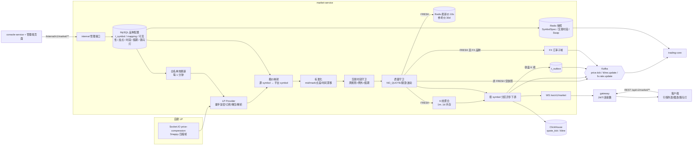
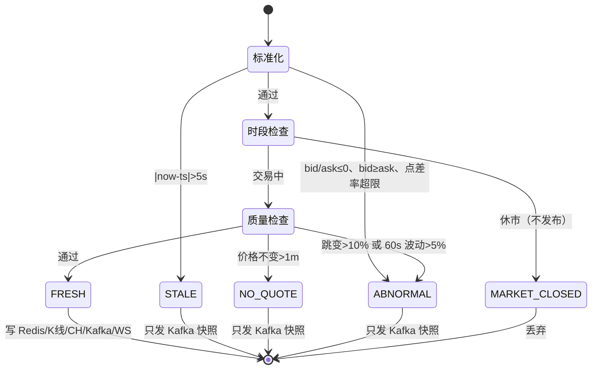
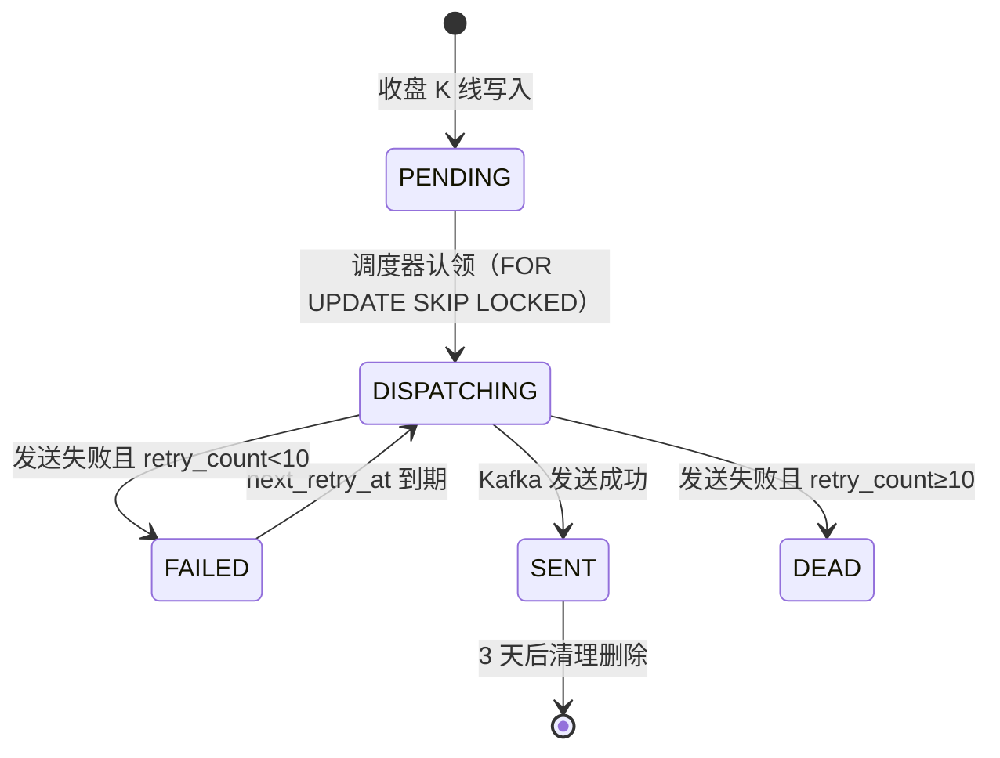
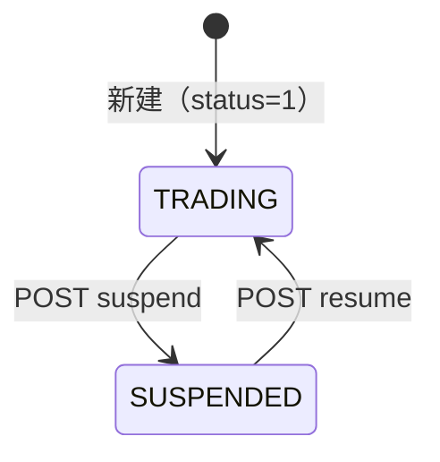

# FalconX 功能地图 · 行情与品种

- 版本：v1（2026-10-07）
- 变更历史：v1（2026-10-07）首次创建
- 依据：fxsystem main `da65af9`；对照代码逐项核实（未运行构建和测试）
- 范围：本分册覆盖行情链路（自建 LP 接入、报价映射与标准化、行情质量守卫、交易时段守卫、Redis 最新价、ClickHouse `quote_tick` / `kline`、K 线聚合与查询、Kafka 行情事件、行情 WebSocket `/ws/v1/market`）、品种配置（`t_symbol`、`t_symbol_quote_mapping`、`SymbolSpec`、组可见性、组加点、跑马灯、交易时间 / 例外 / 市场假期、隔夜费率配置表）、FX 汇率子域，以及客户端行情 / 图表 / 跑马灯页面和管理端行情品种相关页面。**不覆盖**：下单、保证金、手续费、隔夜利息结算、杠杆档位计算口径（见 03 分册）；风控动作（行情质量状态如何影响拒单 / TP/SL / 强平、FX 暂停行为，见 04 分册）。

## 一图看懂

这张图想让读者看懂：LP 报价从 Socket.IO 进入后，先映射成平台 symbol，再依次过“标准化 → 交易时段 → 质量守卫”三道闸，只有 `FRESH` 报价才写 Redis、推进 K 线、写 ClickHouse、推 WebSocket；品种配置都在 market-service 的 MySQL 里，通过 Redis 快照和 internal RPC 提供给 trading-core 与管理端。

## 功能清单

| 编号 | 功能 | 使用者 | 状态 |
| --- | --- | --- | --- |
| M-01 | LP Socket.IO 行情源接入（握手加密、订阅、Snappy 解析、重连） | 系统 | 已实现 |
| M-02 | LP 订阅白名单热刷新 | 系统 | 已实现 |
| M-03 | 行情接入主链路编排与按 symbol 分区异步下游 | 系统 | 已实现 |
| M-04 | 报价映射（源 symbol → 平台 symbol，乘数与绝对加点） | 系统 / 运营 | 已实现 |
| M-05 | 报价标准化与报价口径（bid/ask/mid/mark） | 系统 | 已实现 |
| M-06 | 行情质量守卫（5 态） | 系统 | 已实现 |
| M-07 | 交易时段守卫与交易日历判断 | 系统 | 已实现 |
| M-08 | Redis 最新价 / 参考价缓存 | 系统 | 已实现 |
| M-09 | ClickHouse `quote_tick` 批量写入与历史 Tick 查询 | 系统 / 客户 | 已实现 |
| M-10 | K 线聚合（周期与聚合规则） | 系统 | 已实现 |
| M-11 | ClickHouse `kline` 存储、去重与历史 K 线查询 | 系统 / 客户 | 已实现 |
| M-12 | Kafka 行情事件（`market.price.tick` / `market.kline.update`）与 Outbox | 系统 | 已实现 |
| M-13 | 行情 WebSocket `/ws/v1/market` | 客户 | 已实现 |
| M-14 | 品种列表与最新报价北向接口 | 客户 | 已实现 |
| M-15 | LP 源 Symbol 主表 `t_symbol` 管理 | 运营 | 部分实现 |
| M-16 | 报价映射管理（系统 Symbol 配置真源） | 运营 | 已实现 |
| M-17 | `SymbolSpec` 共享快照 | 系统（trading-core） | 已实现 |
| M-18 | 用户组品种可见性 | 运营 / 客户 | 已实现 |
| M-19 | 用户组加点（group markup） | 运营 / 客户 / 系统 | 已实现 |
| M-20 | 交易时间（周规则 + 特殊交易日例外）管理与快照 | 运营 / 系统 | 已实现 |
| M-21 | 市场假期管理 | 运营 / 系统 | 已实现 |
| M-22 | 跑马灯热门产品配置与读取 | 运营 / 客户 | 已实现 |
| M-23 | FX 汇率子域（多币种换算汇率） | 系统（trading-core） | 已实现 |
| M-24 | 管理端 FX 汇率监控 | 运营 | 已实现 |
| M-25 | 隔夜费率配置表 `t_swap_rate`（配置侧） | 运营 / 系统 | 已实现 |
| M-26 | 品种最近 Tick 时间（last-tick） | 运营 | 部分实现 |
| M-27 | 客户端行情列表（Watchlist） | 客户 | 已实现 |
| M-28 | 客户端经典图表（K 线 / Tick / Bid/Ask 叠加 / 指标 / 周期） | 客户 | 已实现 |
| M-29 | 客户端 TradingView 高级图表 | 客户 | 已实现 |
| M-30 | 客户端跑马灯 | 客户 | 已实现 |
| M-31 | 客户端行情 WebSocket 连接管理 | 客户 | 已实现 |
| M-32 | 行情健康检查与可观测指标 | 运维 | 已实现 |
| M-33 | LP 历史 K 线 API 补数 | 系统 | 不做 |
| M-34 | 杠杆档位 tier（边界说明） | 运营 | 已实现（owner 为 trading-core，细节见 03） |

---

## M-01 LP Socket.IO 行情源接入

- **状态**：已实现。`SocketIoLpMarketQuoteProvider`（`@Profile("!stub")`）真实连接、订阅、解压、解析并分发；`stub` profile 下由 `StubMarketQuoteProvider` 替代（只在启动时为每个 symbol 推 1 条模拟报价，用于测试 / 本地）。
- **使用者与入口**：无用户入口；服务启动时由 `MarketFeedBootstrapRunner.run()`（`ApplicationRunner`）调用 `provider.start(sourceSymbols, ingest)`。
- **业务逻辑**：
  1. 启动前置条件（任一不满足只打 WARN 日志并放弃连接，不会抛错）：`falconx.market.lp.enabled=true`；`domain / appId / token / secretKey` 非空且 `serverId>0`；订阅 symbol 列表非空。
  2. 连接地址：`domain` 规范化为 `wss://`（`https://`→`wss://`，`http://`→`ws://`，无协议补 `wss://`）+ `socket-path`（默认 `/safe/socket.io/`），query 为 `APP-ID={appId}&signature={signature}&encrypt={encrypt}&EIO=4&socketSource=1&socketVersion=1.1&nonce={nonce}&timestamp={毫秒}`。
  3. 握手加密：`encrypt = Base64(AES/CBC/PKCS5Padding(random16 + 4 字节大端消息长度 + token + appId))`，AES key 为 `secretKey` 补齐 `=` 后 Base64 解码，必须 32 字节；IV 取 key 前 16 字节。`signature = SHA1(按字典序排序后拼接 token, timestamp, nonce, encrypt)` 小写 hex。`nonce` 为 8 位随机 hex。
  4. Socket.IO 客户端参数：只用 `websocket` 传输、不升级、`reconnection=false`（自管重连）、超时 `connect-timeout`（默认 10s）。URI 只保留 `scheme://host:port/`，path 和 query 通过 `IO.Options` 传入。
  5. 订阅：连接成功后 emit `external-sub-symbol`，payload 以 **JSON 字符串**发送：`{"serverId":17,"symbolList":[...]}`（`serverId>0` 才带）。
  6. 行情事件 `price-compression`：Socket.IO 回调线程只把原始帧提交到单线程 `market-lp-dispatch-*` 执行器；执行器里：若首字节为 `0x04`（Socket.IO binary header）先去掉 → **Snappy** 解压为 UTF-8 JSON → 递归遍历数组以及 `data / prices / priceList / quotes` 字段收集报价 → 去重（key = `ticker|ts|bid|ask|source`）→ 只保留当前订阅集合内的 ticker。
  7. 字段兼容：symbol 取 `symbol/ticker/instrument/Symbol/Ticker`；bid 取 `bid/bidPrice/Bid/BidPrice`；ask 取 `ask/askPrice/Ask/AskPrice`；时间取 `receivingTime/datetimeUtc/datetime/ts/timestamp/time/quoteTimestamp/ctm/ctmUtc/Time`（10 位数字按秒、≥11 位按毫秒、否则按 ISO-8601）。任一缺失则丢弃该条。symbol 只做 trim，保留 `.` 和大小写（如 `AAPL.NAS`）。
  8. **时间口径**：分发前用 market-service 当前 UTC 时间覆盖 `ts`（`withPlatformTimestamp`），LP 源时间只用于解析校验。因此后续 stale 判断实际衡量的是“接入排队延迟”。
  9. `source` 固定 `TM_QUOTE`。
  10. 背压：dispatch 队列 `ArrayBlockingQueue` 容量 10000，满时丢弃最老任务（drop-oldest），每 1000 次丢弃打一次 WARN；计数 `droppedDispatchTaskCount` 可读。
  11. 重连：`connect_error` 或 `disconnect` 时，若未已排队重连，则在 `reconnect-interval`（默认 5s）后关闭旧 socket 并重新握手（重新生成 nonce/timestamp/encrypt）。
  12. 日志脱敏：连接失败原因里的 `APP-ID / Authorization / signature / encrypt / nonce / timestamp` 值替换为 `[REDACTED]`。
- **字段**：
  - 配置项（`falconx.market.lp.*`，环境变量名见括号）：

    | 配置 | 类型 | 默认 | 含义 |
    | --- | --- | --- | --- |
    | `enabled` | boolean | Java 默认 `true`；`application-stage5.yml` 为 `false` | 是否启用 |
    | `code` | String | `GODSA`（`FALCONX_MARKET_LP_CODE`） | 当前 LP 代码，用于筛 mapping 的 `source_lp_code` |
    | `domain` | String | 空（`FALCONX_MARKET_LP_DOMAIN`，兼容 `.env` 的 `domain`） | LP 地址 |
    | `socket-path` | String | `/safe/socket.io/` | Engine.IO path |
    | `app-id` | String | 空（`FALCONX_MARKET_LP_APP_ID` / `APP-ID`） | 应用 ID |
    | `token` | String | 空（`FALCONX_MARKET_LP_TOKEN` / `token`） | 参与加密与签名 |
    | `secret-key` | String | 空（`FALCONX_MARKET_LP_SECRET_KEY` / `secretKey`） | AES key |
    | `server-id` | int | Java 默认 0；yml 默认 `17`（`FALCONX_MARKET_LP_SERVER_ID`） | 订阅 serverId |
    | `meta-trade-version` / `meta-trader-id` | int | 4 / 0 | 预留给 LP K 线 API，代码未使用（见 M-33） |
    | `connect-timeout` | Duration | 10s | 连接超时 |
    | `reconnect-interval` | Duration | 5s | 重连间隔 |
    | `symbol-whitelist-refresh-cron` / `-zone` | String | `0 */1 * * * *` / `UTC` | 见 M-02 |

  - 内部对象 `ExternalRawQuote`：`ticker` String、`bid` BigDecimal、`ask` BigDecimal、`ts` OffsetDateTime、`source` String。
- **错误码**：无对外错误码。
- **相关事件和定时任务**：无 Kafka；重连用 `CompletableFuture.delayedExecutor`。
- **证据**：`falconx-market-service/src/main/java/com/falconx/market/provider/SocketIoLpMarketQuoteProvider.java`、`provider/LpWebSocketProtocolSupport.java`、`provider/StubMarketQuoteProvider.java`、`config/MarketServiceProperties.java`、`src/main/resources/application.yml`。另：`provider/LpCryptoSupport.java` 是另一套签名 / AES 加解密实现（要求 secretKey 恰好 43 字符），全仓无引用，属死代码。

## M-02 LP 订阅白名单热刷新

- **状态**：已实现。
- **使用者与入口**：定时任务 `MarketFeedBootstrapRunner.refreshQuoteSymbolWhitelist()`；管理端写报价映射 / 新建源 symbol 后也会在事务提交后立即触发（见 M-15、M-16）。
- **业务逻辑**：
  1. 白名单来源（`MarketSymbolQuoteMappingMapper.selectAllLpSubscribedMappings`）：`t_symbol_quote_mapping m JOIN t_symbol s ON s.lp_code=m.source_lp_code AND s.symbol=m.source_symbol AND s.status=1 WHERE m.enabled=1 AND m.lp_subscribe_enabled=1`，再在内存里过滤 `source_lp_code == falconx.market.lp.code`（大小写不敏感，空值视为 `GODSA`）。
  2. 订阅列表 = 上述 mapping 的 `source_symbol` 去重、排序。
  3. 刷新时先刷新映射快照，再调用 `provider.refreshSymbols`：新旧集合相同则不动；不同则替换本地过滤集合，若 socket 已连接则重新 emit `external-sub-symbol`（全量列表，不发退订）。
  4. 数据库异常时只打 ERROR 日志，保留上一轮白名单，不清空。
  5. 多个平台 symbol 映射到同一源 symbol 时，只要任一满足条件，源 symbol 就保留在订阅集合内。
- **字段**：见 M-16 的 `t_symbol_quote_mapping` 与 M-15 的 `t_symbol`。
- **错误码**：无。
- **相关事件和定时任务**：`@Scheduled(cron = falconx.market.lp.symbol-whitelist-refresh-cron, 默认每分钟第 0 秒, zone=UTC)`。
- **证据**：`application/MarketFeedBootstrapRunner.java`、`service/impl/DefaultMarketQuoteMappingService.java`、`resources/mapper/market/metadata/MarketSymbolQuoteMappingMapper.xml`。

## M-03 行情接入主链路编排与按 symbol 分区异步下游

- **状态**：已实现。
- **使用者与入口**：`MarketDataIngestionApplicationService.ingest(ExternalRawQuote)`，由 LP dispatch 线程调用。
- **业务逻辑**（对每条源报价）：
  1. 映射成 0..N 条平台报价（M-04）。映射为空时打 WARN `market.quote.mapping.dropped`，只做标准化返回，不进入任何下游。
  2. 对每条平台报价：标准化（M-05）→ 交易时段守卫（M-07），休市则标记 `MARKET_CLOSED` 后直接返回，**不写 Redis / ClickHouse / Kafka / WebSocket / K 线**。
  3. 质量守卫（M-06）。若结果不可成交（`quoteStatus≠FRESH` 或 `stale=true`），**只同步发布一条 `market.price.tick` Kafka 快照**（带 `quoteStatus / qualityReason`），不写 Redis / ClickHouse / WS / K 线。
  4. 可成交报价的同步部分：写 Redis 最新价（M-08）→ 推进 K 线内存状态（M-10）→ 若是 FX 品种则转发 FX 子域（M-23）。
  5. 异步部分（`falconx.market.ingestion.async-downstream.enabled`，生产 yml 为 `true`，`application-stage5.yml` 为 `false`）：交给 `MarketQuoteDownstreamDispatcher`，按 `floorMod(symbol.hashCode(), partitionCount)` 选分区；每分区一个单线程执行器，队列 `LinkedBlockingQueue(queue-capacity)`，满时 `CallerRunsPolicy`（退化为调用线程同步执行，不丢）。同一 symbol 严格 FIFO。异步任务依次执行：写 ClickHouse tick 缓冲 → 发 Kafka `price.tick` → WS 推 `price.tick` → WS 推所有活动 K 线 → 对每根收盘 K 线：写 Outbox `kline.update`、写 ClickHouse kline 缓冲、WS 推收盘 K 线。每一步独立 try-catch，失败只打 WARN。
  6. 同步回退路径（开关为 false）：同样的下游按顺序在当前线程执行。
- **字段**：配置 `falconx.market.ingestion.downstream-dispatcher.partition-count`（默认 16）、`queue-capacity`（默认 10000）。
- **错误码**：无。
- **相关事件和定时任务**：Kafka `falconx.market.price.tick`（直发）、Outbox `market.kline.update`；WebSocket 推送；Micrometer Gauge `market.ingestion.dispatcher.queue.size{partition}`。
- **证据**：`application/MarketDataIngestionApplicationService.java`、`application/MarketQuoteDownstreamDispatcher.java`、`resources/application.yml`、`resources/application-stage5.yml`。

## M-04 报价映射（源 symbol → 平台 symbol）

- **状态**：已实现。
- **使用者与入口**：系统内部（`DefaultMarketQuoteMappingService.mapToPlatformQuotes`）；配置入口见 M-16。
- **业务逻辑**：
  1. 内存快照 `Map<"LPCODE|SOURCESYMBOL"(大写), List<mapping>>`，在 M-02 刷新时整体替换，tick 热路径不查库。
  2. 计算公式：`platformBid = sourceBid × price_multiplier + bid_adjustment`；`platformAsk = sourceAsk × price_multiplier + ask_adjustment`。`ts / source` 原样继承，`ticker` 换成 `platform_symbol`。
  3. 一条源报价可派生多条平台报价（如 `XAUUSD` → `XAUUSD` 与 `XAU100`）。
  4. 快照尚未初始化时（启动瞬间）直接按源 symbol 透传；初始化后查不到映射则丢弃。
  5. `t_symbol_quote_mapping.spread` 字段**不参与** market 侧报价计算，只进入 `SymbolSpec` 下发给 trading-core（trading-core 用法见 03 分册）。
- **字段**：见 M-16。
- **错误码**：无。
- **相关事件和定时任务**：随 M-02 每分钟刷新。
- **证据**：`service/impl/DefaultMarketQuoteMappingService.java`。

## M-05 报价标准化与报价口径

- **状态**：已实现。
- **使用者与入口**：系统内部 `DefaultQuoteStandardizationService.standardize`。
- **业务逻辑**：
  1. `mid = (bid + ask) / 2`，保留 8 位小数，`RoundingMode.DOWN`；`mark = mid`（兼容字段，交易侧不直接使用，见 03/04）。
  2. 依次判定（命中即返回）：`bid≤0` 或 `ask≤0` → `ABNORMAL / NON_POSITIVE_PRICE`；`bid≥ask` → `ABNORMAL / BID_ASK_CROSSED`；`(ask−bid)/mid > max-spread-rate`（yml `0.05`，Java 默认 null=关闭）→ `ABNORMAL / SPREAD_TOO_LARGE`；`|now − ts| > stale.max-age`（默认 5s）→ `STALE / QUOTE_TIME_DRIFT_EXCEEDED`；否则 `FRESH`。
  3. 用户组加点后的口径（出口统一应用，`StandardQuote.withExtraMarkup`）：`bid' = bid + bidExtra`，`ask' = ask + askExtra`，`mid' = mark' = (bid'+ask')/2`（8 位，DOWN）。两个加点都为 0 时返回原对象。加点在 REST 报价、REST 历史 Tick、品种列表、WS `price.tick` 出口应用；**K 线不加点**（基准 mid 聚合）；Kafka `price.tick` 发出的是基准价（不含组加点），trading-core 自行按组叠加（见 03）。
- **字段**：内部 `StandardQuote`：`symbol` String、`bid / ask / mid / mark` BigDecimal、`ts` OffsetDateTime、`source` String、`stale` boolean、`qualityStatus` 枚举、`qualityReason` String。`executable()` = `qualityStatus==FRESH && !stale`。
- **错误码**：无。
- **相关事件和定时任务**：无。
- **证据**：`service/impl/DefaultQuoteStandardizationService.java`、`entity/StandardQuote.java`。

## M-06 行情质量守卫（5 态）

- **状态**：已实现。
- **使用者与入口**：系统内部，标准化之后、写 Redis 之前执行 `DefaultMarketQuoteQualityGuardService.evaluate`。
- **业务逻辑**：
  1. 已是 `stale` 或 `ABNORMAL` 的报价不再评估。
  2. 每个 symbol 维护内存状态 `(bid, ask, mid, lastChangedAt)`，用 `ConcurrentHashMap.compute` 原子更新；bid 或 ask 变化才刷新 `lastChangedAt`。
  3. 检测顺序（命中即返回）：
     - `NO_QUOTE / UNCHANGED_TOO_LONG`：bid、ask 都未变且距 `lastChangedAt` 超过 `unchanged-max-age`（默认 1m）。
     - `ABNORMAL / TICK_JUMP_TOO_LARGE`：`|mid − 上一 mid| / 上一 mid > max-tick-jump-rate`（yml `0.10`，Java 默认 null=关闭）。
     - `ABNORMAL / SHORT_TERM_VOLATILITY_EXCEEDED`：每 symbol 维护滑动窗口 `volatility-window`（默认 60s）内 mid 序列，`(max−min)/min > max-volatility-rate`（yml `0.05`，Java 默认 null=关闭）；窗口内少于 2 条不判定。
     - 否则 `FRESH`。
  4. 每小时清理 24 小时未变价的 symbol 状态（防内存增长）。
  5. 与风控的关系（简述）：market 只负责打标；`FRESH` 是唯一可成交状态。非 FRESH 报价只以 Kafka 快照形式到达 trading-core，trading-core 必须按自身 stale 阈值和交易时段快照二次校验，用于拒单 / 禁止 TP/SL / 强平（细节见 04 分册）。
  6. 注意：由于 M-01 用平台接收时间覆盖 `ts`，标准化阶段的 `STALE` 只在内部排队超过 5s 时出现；读 Redis 时还会按时间二次判 stale（见 M-08）。
- **字段**：
  - 配置 `falconx.market.quote-quality.*`：`unchanged-max-age`（1m）、`max-spread-rate`（yml 0.05）、`max-tick-jump-rate`（yml 0.10）、`max-volatility-rate`（yml 0.05）、`volatility-window`（60s）；`falconx.market.stale.max-age`（5s）。
  - 枚举 `MarketQuoteQualityStatus`：

    | 值 | 是否可成交 | 含义 |
    | --- | --- | --- |
    | `FRESH` | 是 | 通过全部检查 |
    | `STALE` | 否 | 报价时间与当前时间偏差超过 `stale.max-age` |
    | `NO_QUOTE` | 否 | bid/ask 长时间不变 |
    | `MARKET_CLOSED` | 否 | 交易时段守卫判定休市（只在内部返回对象中出现，不对外发布） |
    | `ABNORMAL` | 否 | 价格非正、买卖倒挂、点差过大、跳变过大、短时波动过大 |

  - `qualityReason` 取值：`QUOTE_TIME_DRIFT_EXCEEDED`、`UNCHANGED_TOO_LONG`、`MARKET_CLOSED`、`NON_POSITIVE_PRICE`、`BID_ASK_CROSSED`、`SPREAD_TOO_LARGE`、`TICK_JUMP_TOO_LARGE`、`SHORT_TERM_VOLATILITY_EXCEEDED`。
- **状态机**（单条报价在链路中的判定）：

- **错误码**：无。
- **相关事件和定时任务**：`@Scheduled(fixedDelay=1h) cleanupStaleSymbols`。
- **证据**：`service/impl/DefaultMarketQuoteQualityGuardService.java`、`entity/MarketQuoteQualityStatus.java`、`resources/application.yml`。

## M-07 交易时段守卫与交易日历判断

- **状态**：已实现。
- **使用者与入口**：系统内部 `DefaultMarketTradingScheduleGuardService.isQuoteProcessingAllowed(symbol, now)`，每条平台报价调用一次；同一份 Redis 快照也供 trading-core 下单前读取（见 03）。
- **业务逻辑**：
  1. 从 Redis `falconx:market:trading:schedule:{symbol}` 读快照（每条报价一次 GET + JSON 反序列化）。
  2. 快照缺失 → 放行（fail-open，WARN）；快照存在但 `sessions` 与 `exceptions` 都为空 → 放行（fail-open）。闭市必须显式配置。
  3. 例外优先：取“日期匹配”的例外（按例外自身时区算当前日期；跨夜特殊时段的次日也算匹配）。任一 `FULL_CLOSE(1)` → 休市；存在 `SPECIAL_SESSION(2)` → 只要任一特殊时段覆盖当前时刻即交易，否则休市（周规则不再生效）。
  4. 无例外时：取 `enabled` 的周规则；若当天（按假期时区）命中市场假期：`FULL_CLOSE(1)` → 休市；`EARLY_CLOSE(2)` → 把同时区周规则的收盘时间截到 `close_time`；`LATE_OPEN(3)` → 把同时区周规则开盘时间推迟到 `open_time`；**时区不同的周规则不调整**。
  5. 周规则匹配：按规则时区换算当前时间；`open<close` 为普通时段，要求星期相同且 `open ≤ t < close`；`open>close` 为跨夜时段，当天 `t≥open` 或次日 `t<close` 均算该规则的交易日（锚定日按开盘日算）；`open==close` 视为无效时段。锚定日必须落在 `[effective_from, effective_to]`（`effective_to` 为空表示长期）。
  6. 每次判定打 INFO 日志 `market.quote.processing.evaluated`（每条报价一行）。
  7. 快照内容由 M-20 的预热服务生成（每日 UTC 0 点刷新 + 管理端变更后刷新），Redis TTL 25h。
- **字段**：快照 `MarketTradingScheduleSnapshot`：`symbol`、`marketCode`、`sessions[]`（`id, symbol, dayOfWeek, sessionNo, openTime, closeTime, timezone, enabled, effectiveFrom, effectiveTo`）、`exceptions[]`（`id, symbol, tradeDate, exceptionType, sessionNo, openTime, closeTime, timezone, reason`）、`holidays[]`（`id, marketCode, holidayDate, holidayType, openTime, closeTime, timezone, holidayName, countryCode`）、`refreshedAt`。表结构见 M-20、M-21。
- **错误码**：无。
- **相关事件和定时任务**：无（刷新见 M-20）。
- **证据**：`service/impl/DefaultMarketTradingScheduleGuardService.java`、`repository/RedisMarketTradingScheduleSnapshotRepository.java`、`entity/MarketTradingScheduleSnapshot.java`。

## M-08 Redis 最新价 / 参考价缓存

- **状态**：已实现（非 `stub` profile）。
- **使用者与入口**：写入在 M-03 同步部分；读取方为 REST 报价 / 品种列表 / WS 订阅快照 / WS stale 扫描（market 内部），以及 trading-core（是否直接读这些 key 见 03，本册未核实）。
- **业务逻辑**：
  1. 最新价：key `falconx:market:price:{symbol}`，Hash，`HMSET` 后 `EXPIRE quote-ttl`（默认 10s）；`qualityReason` 为空时 `HDEL`。只有可成交报价才写入（M-03）。
  2. 参考价（最后有效价）：key `falconx:market:last-valid-price:{symbol}`，Hash，TTL `reference-quote-ttl`（默认 30d），在写最新价且 `stale=false` 时同步刷新。读出时一律标记 `stale=true / STALE`。单 symbol 读取 Redis 未命中时回查 ClickHouse `quote_tick` 最新一条并回填；批量读取（品种列表）不回查 ClickHouse。
  3. 读最新价时再按 `|now − ts| > stale.max-age` 判定：存储状态为 `FRESH` 但时间超限则视为 `STALE`；状态字段无法解析视为 `STALE`。
  4. 批量读取用 Redis pipeline `HGETALL`。
- **字段**：
  - 最新价 Hash 字段：

    | 字段 | 类型 | 含义 |
    | --- | --- | --- |
    | `bid` / `ask` / `mid` / `mark` | 字符串化十进制 | 基准价（不含组加点） |
    | `ts` | epoch 毫秒 | 报价时间（平台接收时间） |
    | `source` | String | `TM_QUOTE` |
    | `stale` | `true/false` | 写入时 stale |
    | `quoteStatus` | String | 质量状态 |
    | `qualityReason` | String，可缺省 | 原因 |

  - 参考价 Hash：同上但无 `stale` 字段。
  - 其他 market 写入的 Redis key（详见对应条目）：`falconx:market:symbol-spec:{platformSymbol}`（M-17，无 TTL）、`falconx:market:trading:schedule:{symbol}`（M-20，25h）、`falconx:market:swap-rate:{symbol}`（M-25，25h）、`falconx:fx:rate:{base}:{quote}`（M-23，5s）。
- **错误码**：无。
- **相关事件和定时任务**：无。
- **证据**：`cache/RedisMarketQuoteCacheWriter.java`、`repository/RedisMarketLatestQuoteRepository.java`、`repository/RedisMarketReferenceQuoteRepository.java`、`config/MarketServiceProperties.java`（`Redis` 内部类）。

## M-09 ClickHouse `quote_tick` 批量写入与历史 Tick 查询

- **状态**：已实现。
- **使用者与入口**：
  - 写：M-03 异步下游。
  - 读：客户端 Tick 图首屏 `GET /api/v1/market/quotes/{symbol}/history?limit=`（market-service，经 gateway，需登录 JWT，gateway 注入 `X-User-Group-Code`）；参考价回填（M-08）；`last-tick`（M-26）。
- **业务逻辑**：
  1. 写入：每条可成交报价进进程内 `ConcurrentLinkedQueue`；`quote-queue-max-size`（默认 500000，且不小于 `batch×10`）满时丢弃最老一条（drop-oldest），每 1000 次丢弃打 WARN。
  2. 定时 flush：`fixedDelay = quote-flush-interval`（yml 10000ms），每批 `quote-batch-size`（默认 200，上限 10000），多行 `INSERT`。失败时把整批放回队尾并结束本轮（批量失败不丢数，但可能打乱少量顺序）。队列 ≥80% 打 WARN、≥50% 打 INFO。停机 `@PreDestroy` 尽量 flush。
  3. 表无去重（`MergeTree`），失败重试可能导致重复行（未见去重逻辑）。
  4. 历史 Tick 查询：先按 `(symbol, groupCode)` 校验可见且可交易（M-18），否则 `30001`；`limit` 默认 600，范围夹到 `[1,1000]`；取最近 N 条再按时间升序返回；每条同时返回加点后价与 `baseBid/baseAsk/baseMid`。
  5. ClickHouse 建表：服务启动时 `ApplicationRunner` 按文件名顺序执行 classpath `db/clickhouse/CH_V*.sql`（每次启动都重跑，脚本需幂等）。
- **字段**：
  - 请求：| 字段 | 类型 | 必填 | 含义 | 约束 |
    | --- | --- | --- | --- | --- |
    | `symbol`（path） | String | 是 | 平台 symbol，大小写不敏感 | 必须对当前组可见 |
    | `limit`（query） | Integer | 否 | 条数 | 默认 600，夹到 1..1000 |
    | `X-User-Group-Code`（header） | String | 否 | gateway 注入 | 缺省按 `default` |
  - 响应 `MarketQuoteHistoryResponse.quotes[]`：每项同 M-14 `MarketQuoteResponse`。
  - 表 `falconx_market_analytics.quote_tick`（运行时以 `src/main/resources/db/clickhouse/` 为准）：

    | 表.字段 | 类型 | 含义 | 约束/取值 |
    | --- | --- | --- | --- |
    | `quote_tick.symbol` | LowCardinality(String) | 平台 symbol | |
    | `quote_tick.source` | LowCardinality(String) | 来源 | `TM_QUOTE` |
    | `quote_tick.bid_price` | Decimal(24,8) | 基准 bid | |
    | `quote_tick.ask_price` | Decimal(24,8) | 基准 ask | |
    | `quote_tick.mid_price` | Decimal(24,8) | mid | |
    | `quote_tick.mark_price` | Decimal(24,8) | mark | |
    | `quote_tick.event_time` | DateTime64(3,'UTC') | 报价时间 | |
    | `quote_tick.ingest_time` | DateTime64(3,'UTC') | 写入时间 | 默认 `now64(3)` |
    | 引擎 / 分区 / 排序 | | `MergeTree` / `toYYYYMM(event_time)` / `(symbol, event_time, source)` | TTL `event_time + 7 DAY`（CH_V2 以 `materialize_ttl_after_modify=0` 修改） |

- **错误码**：| 错误码 | 含义 | 触发条件 |
  | --- | --- | --- |
  | `30001` | Symbol Not Found | symbol 不存在 / 不可见 / mapping 停用 / 源停牌 |
- **相关事件和定时任务**：`flushQuoteTicksOnSchedule`（10s）；Gauge `falconx.market.quote.pending.size`、`falconx.market.quote.dropped.total`、`falconx.market.quote.queue.max`。
- **证据**：`analytics/MybatisClickHouseMarketAnalyticsWriter.java`、`resources/mapper/market/analytics/MarketQuoteTickMapper.xml`、`resources/db/clickhouse/CH_V1__market_analytics.sql`、`CH_V2__shorten_ttl.sql`、`config/MarketPersistenceConfiguration.java`、`service/impl/DefaultMarketQuoteQueryService.java`、`controller/MarketQueryController.java`。

## M-10 K 线聚合

- **状态**：已实现。
- **使用者与入口**：系统内部 `DefaultKlineAggregationService.onQuote`，在 M-03 同步部分对每条可成交报价调用。
- **业务逻辑**：
  1. 周期：`falconx.market.kline.intervals`，默认 `1m / 5m / 15m / 1h / 4h / 1d`，只支持这 6 个（配置其他值启动即报错）；时区 `falconx.market.kline.timezone` 默认 `UTC`。
  2. 取价：OHLC 统一用基准 `mid`（mid 为空时用 bid），**不含组加点**。
  3. 桶起点：`1m` 截到分钟；`5m/15m` 分钟向下取整到 5/15 的倍数；`1h` 截到小时；`4h` 小时向下取整到 4 的倍数（UTC 0/4/8/12/16/20 点）；`1d` 为该时区当日 0 点。`closeTime = 起点 + 周期 − 1 秒`（闭区间写法）。
  4. 推进：同桶内更新 high/low/close，`volume += 1`（**volume 是该周期收到的报价条数，不是成交量**）；报价落入更晚的桶时，上一桶生成 `isFinal=true` 的收盘快照并开新桶；落入更早的桶（乱序）则丢弃并打 WARN。
  5. 收盘只在“下一条报价到来时”发生；没有新报价就不会收盘，也不会补空桶（无成交的周期不产生 K 线）。
  6. 状态只在内存（`ConcurrentHashMap<(symbol, interval), bucket>`）；服务重启会丢失当前未收盘的 K 线，多实例部署会各自聚合。
  7. 每条报价返回所有周期的活动快照（`isFinal=false`，用于 WS 实时推送）和本次收盘快照列表（用于 Outbox / ClickHouse / WS）。
  8. stale 报价不参与聚合。
- **字段**：`KlineSnapshot`：`symbol`、`interval`、`open/high/low/close/volume` BigDecimal、`openTime/closeTime` OffsetDateTime、`isFinal` boolean。
- **错误码**：无。
- **相关事件和定时任务**：收盘时写 Outbox `market.kline.update`（M-12）。
- **证据**：`service/impl/DefaultKlineAggregationService.java`、`entity/KlineSnapshot.java`、`entity/KlineAggregationResult.java`。

## M-11 ClickHouse `kline` 存储、去重与历史 K 线查询

- **状态**：已实现。
- **使用者与入口**：
  - 写：M-03 异步下游（只写收盘 K 线）。
  - 读：`GET /api/v1/market/klines/{symbol}?interval=&limit=`（market-service，经 gateway，需登录）；客户端经典图表与 TradingView datafeed 调用。
- **业务逻辑**：
  1. 写入：只接受 `isFinal=true`；入进程内队列，`kline-queue-max-size` 默认 100000（不小于 batch×10），满时 drop-oldest（丢一根即永久缺口，WARN）；定时 `kline-flush-interval` 默认 1000ms，每批 `kline-batch-size` 默认 1000，多行 INSERT，失败整批放回队尾。
  2. 去重：表引擎 `ReplacingMergeTree(ingest_time)`，排序键 `(symbol, interval_type, open_time)`；查询不用 `FINAL`，改为 `ORDER BY open_time DESC, ingest_time DESC LIMIT 1 BY open_time` 取每桶最新一行，再 `LIMIT n`，外层按 `open_time` 升序返回。
  3. 查询校验：symbol 必须对当前组可见可交易，否则 `30001`；`interval` 缺省 `1m`，小写化后必须在配置列表中，否则 `99004`；`limit` 默认 200，夹到 `[1,500]`。
  4. 返回的只有已收盘 K 线；当前未收盘那根只能从 WS `kline.{interval}` 获得。K 线不应用组加点（客户端自行平移，见 M-28）。
  5. kline 表无 TTL（CH_V3 每次启动先把 TTL 设为 3650 天再 `REMOVE TTL`，保证幂等）。
- **字段**：
  - 请求：| 字段 | 类型 | 必填 | 含义 | 约束 |
    | --- | --- | --- | --- | --- |
    | `symbol`（path） | String | 是 | 平台 symbol | 大小写不敏感，需可见 |
    | `interval` | String | 否 | 周期 | 默认 `1m`；`1m/5m/15m/1h/4h/1d` |
    | `limit` | Integer | 否 | 根数 | 默认 200，1..500 |
  - 响应 `MarketKlinesResponse.klines[]`（`MarketKlineItemResponse`）：

    | 字段 | 类型 | 含义 |
    | --- | --- | --- |
    | `symbol` | String | 平台 symbol |
    | `interval` | String | 周期 |
    | `open/high/low/close` | BigDecimal | 基准 mid 口径 OHLC |
    | `volume` | BigDecimal | 周期内报价条数 |
    | `openTime/closeTime` | OffsetDateTime | 起止（close 为闭区间最后一秒） |
    | `isFinal` | boolean | 恒为 true（历史只存收盘） |

  - 表 `falconx_market_analytics.kline`：

    | 表.字段 | 类型 | 含义 | 约束/取值 |
    | --- | --- | --- | --- |
    | `kline.symbol` | LowCardinality(String) | 平台 symbol | |
    | `kline.interval_type` | LowCardinality(String) | 周期 | `1m..1d` |
    | `kline.open_price/high_price/low_price/close_price` | Decimal(24,8) | OHLC | |
    | `kline.volume` | Decimal(24,8) | 平台定义量 | 默认 0 |
    | `kline.open_time` / `close_time` | DateTime64(3,'UTC') | 起止 | |
    | `kline.source` | LowCardinality(String) | 生成来源 | 默认 `market-service`；写入值未在 `MarketAnalyticsMybatisSupport` 中细查（未验证） |
    | `kline.ingest_time` | DateTime64(3,'UTC') | 写入时间 | 默认 `now64(3)`，ReplacingMergeTree 版本列 |
    | 分区 / 排序 / TTL | | `(interval_type, toYYYYMM(open_time))` / `(symbol, interval_type, open_time)` | 无 TTL |

- **错误码**：`30001`（symbol 不可见）、`99004`（`INVALID_REQUEST_PAYLOAD`，interval 不合法）。
- **相关事件和定时任务**：`flushKlinesOnSchedule`（1s）；Gauge `falconx.market.kline.pending.size`、`falconx.market.kline.dropped.total`。
- **证据**：`analytics/MybatisClickHouseMarketAnalyticsWriter.java`、`resources/mapper/market/analytics/MarketKlineMapper.xml`、`resources/db/clickhouse/CH_V1/CH_V3*.sql`、`service/impl/DefaultMarketKlineQueryService.java`、`dto/MarketKlineItemResponse.java`。

## M-12 Kafka 行情事件与 Outbox

- **状态**：已实现。`kline.update` 的消费方 trading-core 目前只把事件写入自己的 `t_inbox` 做审计，无业务处理。
- **使用者与入口**：生产者 market-service；消费者 trading-core（`price.tick` 驱动成交 / TP/SL / 强平，见 03/04；`kline.update` 仅留痕）。
- **业务逻辑**：
  1. `market.price.tick`：高频直发（不走 Outbox），topic `falconx.market.price.tick`，key = `symbol`；`KafkaTemplate.send(...).get(5s)` 同步等待，失败抛异常（异步链路里被捕获只打 WARN，即该 tick 丢失）。payload 的 `ts` 序列化为 epoch 秒小数（如 `1776676530.123`）。可成交与不可成交（STALE/NO_QUOTE/ABNORMAL）报价都会发布；MARKET_CLOSED 不发布。
  2. `market.kline.update`：收盘 K 线先写 `t_outbox`（status=PENDING），`event_id = "market-kline:" + UUIDv3(symbol:interval:closeTime)`，同一根 K 线重复写入走 `ON DUPLICATE KEY UPDATE`（会重置为 PENDING 再发一次，消费方需按 eventId 幂等）。topic `falconx.market.kline.update`，key = `symbol:interval`。
  3. Outbox 调度：每 1s（启动延迟 1s）在事务内 `SELECT ... WHERE status IN (0,3) AND (next_retry_at IS NULL OR next_retry_at<=now) ORDER BY created_at LIMIT 200 FOR UPDATE SKIP LOCKED`，逐条置 `DISPATCHING(1)`；发送成功置 `SENT(2)` 并写 `sent_at`；失败 `retry_count+1`，`next_retry_at = now + 退避`（第 1 次 5s、第 2 次 30s、第 3 次 120s、之后 1800s，均 ±20% 抖动），`retry_count ≥ 10` 置 `DEAD(4)`，否则 `FAILED(3)`。
  4. 已认领但进程崩溃的 `DISPATCHING` 行不会被重新选取（查询只取 0/3），没有找到回收逻辑。
  5. 清理：每小时删除 `status=2 AND sent_at < now−3 天` 的行，每批 `LIMIT 5000`，每轮最多 100 批。
  6. Kafka 头：`X-Event-Id`（`evt-{雪花}` 或 outbox eventId）、`X-Event-Type`、`X-Event-Source=falconx-market-service`、traceId（由 `KafkaEventMessageSupport` 写入）。Producer 配置 `acks=all`、`linger.ms=10`、`compression.type=lz4`。
- **字段**：
  - `market.price.tick` payload（实际 Kafka JSON）：

    | 字段 | 类型 | 含义 |
    | --- | --- | --- |
    | `symbol` | String | 平台 symbol |
    | `bid` / `ask` / `mid` / `mark` | Decimal | 基准价（不含组加点） |
    | `ts` | Decimal | epoch 秒，可带小数 |
    | `source` | String | `TM_QUOTE` |
    | `stale` | boolean | 是否 stale |
    | `quoteStatus` | String | `FRESH/STALE/NO_QUOTE/ABNORMAL` |
    | `qualityReason` | String/null | 见 M-06 |

  - `market.kline.update` payload（`MarketKlineUpdateEventPayload`）：`symbol`、`interval`、`open`、`high`、`low`、`close`、`volume`、`openTime`、`closeTime`、`isFinal`（恒 true）。
  - 表 `t_outbox`（market 库，本域 owner）：

    | 表.字段 | 类型 | 含义 | 约束/取值 |
    | --- | --- | --- | --- |
    | `id` | BIGINT PK | 雪花 ID | |
    | `event_id` | VARCHAR(64) | 事件唯一 ID | UNIQUE |
    | `event_type` | VARCHAR(128) | 事件类型 | 目前只有 `market.kline.update` |
    | `topic` | VARCHAR(128) | 目标 topic | |
    | `partition_key` | VARCHAR(128) | 分区键 | `symbol:interval` |
    | `payload` | JSON | 事件体 | |
    | `status` | TINYINT | 状态 | 0=PENDING,1=DISPATCHING,2=SENT,3=FAILED,4=DEAD |
    | `retry_count` | INT | 重试次数 | 默认 0 |
    | `next_retry_at` | DATETIME(3) | 下次重试 | |
    | `last_error` | VARCHAR(512) | 最近错误 | |
    | `created_at` / `sent_at` / `updated_at` | DATETIME(3) | 时间 | 索引 `idx_status_retry(status,next_retry_at,created_at)` |

- **状态机**（`t_outbox.status`）：

- **错误码**：无。
- **相关事件和定时任务**：`MarketOutboxDispatcher.scheduledDispatchPendingMessages`（1s）、`MarketOutboxCleanupScheduler.cleanupSentOutbox`（1h）；Timer `falconx.market.kafka.publish.duration`、Counter `falconx.market.kafka.publish.failures`。
- **证据**：`producer/KafkaMarketEventPublisher.java`、`producer/OutboxAwareMarketEventPublisher.java`、`producer/MarketOutboxDispatcher.java`、`producer/MarketOutboxCleanupScheduler.java`、`repository/MybatisMarketOutboxRepository.java`、`resources/mapper/market/metadata/MarketOutboxMapper.xml`、`falconx-infrastructure/.../outbox/OutboxRetryDelayPolicy.java`、`falconx-market-contract/.../event/*.java`、`falconx-trading-core-service/.../consumer/MarketKlineUpdateEventConsumer.java`。

## M-13 行情 WebSocket `/ws/v1/market`

- **状态**：已实现。
- **使用者与入口**：客户端 `wss://{host}/ws/v1/market?token={accessToken}`；gateway 握手鉴权后代理到 market-service 同路径。
- **业务逻辑**：
  1. gateway 握手（`GatewayMarketWebSocketHandshakeFilter`）：query 参数 `token` 缺失或校验失败 → HTTP 401；用户状态 `BANNED` → 403；同一 userId 在**当前 gateway 实例**内已有 `market-web-socket-connection-limit`（默认 5）个连接 → 429。通过后注入 `X-User-Id / X-User-Uid / X-User-Status / X-User-Group-Code / X-User-Jti / X-Trace-Id / 客户端 IP` 头，连接关闭时释放计数。代理层若拿不到 `X-User-Id` 以 1008 关闭；上游失败以 1011 关闭。文本帧和 Ping/Pong 帧双向转发。
  2. market 侧握手拦截器把上述头存为会话属性；`groupCode` 缺省为 `default`。连接建立后**不再校验 token**。
  3. 订阅：`{"type":"subscribe","requestId":"...","channels":[...],"symbols":[...]}`。channel 只接受 `price.tick` 与 `kline.{配置周期}`（小写化、去重，无效 channel 被静默剔除；剔除后为空返回 `99004`）。symbols 按当前组可见可交易 symbol 大小写不敏感解析为规范名；**任一 symbol 不可见即整体失败**返回 `30001 "symbol not found: X"`；`symbols` 为空数组表示订阅该组全部可见品种。成功后回 `subscribed` 帧，若含 `price.tick` 则对每个 symbol 立即补发一帧当前价（Redis 最新价，缺失时用参考价，按会话组加点）。
  4. 退订：`{"type":"unsubscribe",...}`，channels 为空或 symbol 不可见返回 `99004`；成功回 `unsubscribed`。
  5. 应用层心跳：客户端发 `{"type":"ping","ts":"..."}`，服务端回 `{"type":"pong","ts":原样}`。未知 `type` 或 JSON 解析失败返回 `99004`。
  6. 协议层心跳：服务端每 `ping-interval`（默认 30s）发 WebSocket Ping；每 1s 检查，若最近 Ping 之后未收到 Pong 且超过 `pong-timeout`（默认 10s）则以 `1001 GOING_AWAY` 关闭。
  7. 推送索引：`(channel, symbol) → sessionId 集合`，按索引取候选会话，不全量扫描。
  8. `price.tick` 推送：每条可成交报价按会话组应用加点后推送（同时带基准价）。
  9. `kline.{interval}` 推送：每条可成交报价推送所有周期活动 K 线（`isFinal=false`），收盘时再推一次 `isFinal=true`。
  10. stale 通知：每 1s（`stale-scan-interval`）批量读已订阅 symbol 的 Redis 最新价，`stale=true` 的推一帧 stale 通知；同一 symbol 同一报价时间只通知一次，收到新报价时清除记录。注意 Redis 最新价 10s 后过期，过期后不会再有 stale 通知。
  11. 发送：会话包装为 `ConcurrentWebSocketSessionDecorator`（发送超时 10s，缓冲上限 512KB）；发送 IO 失败即注销会话。
  12. 服务端不保存断线前订阅，重连须重新订阅。
- **字段**：
  - 客户端请求帧：| 字段 | 类型 | 必填 | 含义 | 约束 |
    | --- | --- | --- | --- | --- |
    | `type` | String | 是 | `subscribe/unsubscribe/ping` | |
    | `requestId` | String | 否 | 回显用 | |
    | `channels` | String[] | 订阅/退订必填 | 频道 | `price.tick`、`kline.1m/5m/15m/1h/4h/1d` |
    | `symbols` | String[] | 否 | 平台 symbol | 空数组 = 该组全部 |
    | `ts` | String | 否 | ping 时间 | 原样回显 |
  - 服务端帧：

    | 帧 | 字段 |
    | --- | --- |
    | `subscribed` / `unsubscribed` | `type, requestId, channels[], symbols[]` |
    | `error` | `type="error", requestId, code, message` |
    | `pong` | `type="pong", ts` |
    | `price.tick` | `type, symbol, bid, ask, mid, mark`（含组加点，字符串）, `baseBid, baseAsk, baseMid`（基准价）, `hasMarkup`, `ts`（ISO-8601）, `source, stale, quoteStatus, qualityReason` |
    | stale 通知（type 仍为 `price.tick`） | `type, symbol, stale=true, quoteStatus, qualityReason`（缺省 `QUOTE_TIME_DRIFT_EXCEEDED`）, `ts` |
    | `kline.{interval}` | `type, symbol, interval, open, high, low, close, volume`（字符串）, `openTime, closeTime`（ISO-8601）, `isFinal` |

  - 配置：`falconx.market.web-socket.ping-interval`（30s）、`pong-timeout`（10s）、`stale-scan-interval`（1s）；gateway `market-web-socket-connection-limit`（5）。
- **错误码**：| 错误码 | 含义 | 触发条件 |
  | --- | --- | --- |
  | `99004` | invalid request payload | 非法 JSON、未知 type、无有效 channel、退订 symbol 不可见 |
  | `30001` | symbol not found | 订阅中有不可见 symbol |
  | HTTP 401/403/429 | 握手拒绝 | token 无效 / 用户封禁 / 连接数超限 |
- **相关事件和定时任务**：`MarketWebSocketPushService.scanAndPublishStaleQuotes`（1s）；每会话 2 个心跳定时任务（平台线程池 2 线程）；Gauge `falconx.market.websocket.sessions.active`、`falconx.market.websocket.subscriptions.indexed`、`falconx.market.websocket.buffer.bytes`。
- **证据**：`websocket/MarketWebSocketConfiguration.java`、`MarketWebSocketHandler.java`、`MarketWebSocketHandshakeInterceptor.java`、`MarketWebSocketSessionRegistry.java`、`MarketWebSocketPushService.java`；`falconx-gateway/.../websocket/GatewayMarketWebSocketHandshakeFilter.java`、`GatewayMarketWebSocketProxyHandler.java`、`GatewayMarketWebSocketSessionRegistry.java`、`config/GatewaySecurityProperties.java`。

## M-14 品种列表与最新报价北向接口

- **状态**：已实现。
- **使用者与入口**：客户端终端（`TradingTerminal` 调 `getSymbols` / `getQuote`）；接口 `GET /api/v1/market/symbols`、`GET /api/v1/market/quotes/{symbol}`（market-service，经 gateway，需登录 JWT；gateway 对所有 `/api/v1/**` 除注册/登录/刷新外都要求 Bearer Token）。
- **业务逻辑**：
  1. 品种列表：按 `X-User-Group-Code`（缺省 `default`）查 `mapping.enabled=1 ∧ 源 t_symbol.status=1 ∧ t_symbol_group_visibility(group, platform_symbol).visible=1`，按 `platform_symbol` 升序。category / market_code / 精度 / 6 个交易参数取 mapping，base/quote 币种取源 `t_symbol`。
  2. 价格拼装：pipeline 批量读最新价；最新价存在且非 stale → `priceStatus=LIVE, tradable=true`；最新价存在但 stale，或只有参考价 → `REFERENCE, tradable=false`；都没有 → `MISSING`，价格字段为 null。所有价格都按组加点。
  3. 最新报价：先校验可见（否则 `30001`），读 Redis 最新价（缺失 `30003`），返回组加点后价 + 基准价 + `hasMarkup`。注意：此接口不回退参考价。
  4. 业务异常统一由 `MarketGlobalExceptionHandler` 转为 HTTP 200 + 业务码。
- **字段**：
  - 请求：`symbol`（path，大小写不敏感）；`X-User-Group-Code`（gateway 注入）。
  - 品种列表项 `MarketSymbolListItemResponse`：

    | 字段 | 类型 | 含义 |
    | --- | --- | --- |
    | `symbol` | String | 平台 symbol |
    | `category` | int | 1..8，见 M-16 |
    | `marketCode` | String | 系统市场代码 |
    | `baseCurrency` / `quoteCurrency` | String | 源 `t_symbol` |
    | `pricePrecision` / `qtyPrecision` | int | mapping 系统级精度 |
    | `minQty` / `maxQty` / `minNotional` | BigDecimal | mapping |
    | `maxLeverage` | int | mapping |
    | `takerFeeRate` / `spread` | BigDecimal | mapping |
    | `bid` / `ask` / `mid` / `mark` | BigDecimal/null | 含组加点 |
    | `quoteTs` | OffsetDateTime/null | 报价时间 |
    | `quoteSource` | String/null | 来源 |
    | `priceStatus` | `LIVE/REFERENCE/MISSING` | 展示价格状态 |
    | `tradable` | boolean | 仅 `LIVE` 为 true |

  - 最新报价 `MarketQuoteResponse`：`symbol`、`bid/ask/mid/mark`（含加点）、`baseBid/baseAsk/baseMid`（基准）、`hasMarkup`（Boolean）、`ts`、`source`、`stale`、`quoteStatus`、`qualityReason`。
  - 枚举 `MarketPriceStatus`：`LIVE`（Redis 短 TTL 最新价且新鲜，可作交易候选价）、`REFERENCE`（最后有效参考价，不可成交）、`MISSING`（无价格）。
  - 品种不含“合约规模 / 每手数量”字段：全仓未找到 `contractSize / lot_size` 之类字段，数量即基础币数量。
- **错误码**：| 错误码 | 含义 | 触发条件 |
  | --- | --- | --- |
  | `30001` | Symbol Not Found | 不可见 / 不存在 |
  | `30003` | Quote Not Available | Redis 最新价缺失（10s 内无可成交报价） |
- **相关事件和定时任务**：无。
- **证据**：`controller/MarketQueryController.java`、`service/impl/DefaultMarketSymbolQueryService.java`、`service/impl/DefaultMarketQuoteQueryService.java`、`resources/mapper/market/metadata/MarketSymbolMapper.xml`、`dto/*.java`、`entity/MarketPriceStatus.java`、`falconx-gateway/.../filter/GatewayAuthenticationFilter.java`。

## M-15 LP 源 Symbol 主表 `t_symbol` 管理

- **状态**：部分实现。列表 / 新建 / 编辑 / 停牌 / 恢复已接通；缺：详情接口 `currentSwapRate` 恒为 null、`sessions` 恒为空列表（`getSymbolDetail` 写死）；列表 `lastTickAt` 恒为 null（见 M-26）。
- **使用者与入口**：
  - 管理端页面：`/symbols`（`SymbolListPage`，Tab「Symbol 主表」）。
  - console 接口（`/admin/symbols`，管理端 JWT + RBAC，所有带 `@RequiresPermission` 的调用都由 `OperationAuditAspect` 写 `t_admin_operation_log`）：

    | 方法 路径 | 权限码 | 高风险 |
    | --- | --- | --- |
    | `GET /admin/symbols?category&marketCode&status&lpCode&symbolLike&page&size` | `symbol:view` | 否 |
    | `GET /admin/symbols/{id}` | `symbol:view` | 否 |
    | `POST /admin/symbols`（新建源） | `symbol:source:create` | 是 |
    | `PUT /admin/symbols/{id}`（编辑源元数据） | `symbol:source:update` | 是 |
    | `POST /admin/symbols/{id}/suspend` / `resume` | `symbol:suspend` | 是 |

  - market internal 接口（经 gateway `internal-market-route` 注入 `X-Internal-Token`；market 过滤器要求 `X-Internal-Token` 与 `X-Admin-User-Id`）：`GET/POST /internal/v1/market/symbols`、`GET/PUT /internal/v1/market/symbols/{id}`、`POST /internal/v1/market/symbols/{id}/status`（body `{status: TRADING|SUSPENDED}`）。
- **业务逻辑**：
  1. `t_symbol` 自 V11 起只保存 LP 源元数据；交易参数在 mapping（M-16）。V17 起唯一键为 `(lp_code, symbol)`，同名 symbol 可来自不同 LP。
  2. 新建：`lpCode` 空则 `GODSA`，大写，≤32；`symbol` 非空 ≤32；`(lpCode, symbol)` 已存在 → `90619`；`category` 1..8；`marketCode` 非空 ≤32；base/quote 非空 ≤16；两个精度 0..10；否则 `90620`。写入 `status=1`，事务提交后刷新映射快照、LP 订阅、`SymbolSpec(symbol)`、Swap 快照、交易时段快照。
  3. 编辑：只改 `category / market_code / price_precision / qty_precision`（null 不改，`COALESCE`）；精度不在 0..10 → `90620`。编辑后**不触发**任何快照刷新。注意：`SymbolSpec.category` 取自这里的 `t_symbol.category`（见 M-17）。
  4. 停牌 / 恢复：`TRADING→1`、`SUSPENDED→2`；重复停牌 `90605`、重复恢复 `90606`。不触发即时刷新；LP 订阅在下一次每分钟白名单刷新时剔除，北向列表 / 可见性查询立即生效（实时 JOIN `s.status=1`）。
  5. 列表分页：`size` 夹到 1..100，按 `created_at DESC, id DESC`。
  6. console 侧所有写操作要求 `reason`（10..500 字），只写进 console 日志和审计，不下传 market。
- **字段**：
  - 新建请求（console `AdminSymbolSourceCreateRequest`）：| 字段 | 类型 | 必填 | 含义 | 约束 |
    | --- | --- | --- | --- | --- |
    | `lpCode` | String | 否 | LP 代码 | ≤32，缺省 GODSA |
    | `symbol` | String | 是 | 源 symbol | ≤32 |
    | `category` | Integer | 是 | 品类 | 1..8 |
    | `marketCode` | String | 是 | 市场代码 | ≤32 |
    | `baseCurrency` / `quoteCurrency` | String | 是 | 币种 | ≤16 |
    | `pricePrecision` / `qtyPrecision` | Integer | 是 | 精度 | 0..10 |
    | `reason` | String | 是 | 操作原因 | 10..500 |
  - 编辑请求 `AdminSymbolUpdateRequest`：`category`、`marketCode`(≤32)、`pricePrecision`、`qtyPrecision`（均可选）、`reason`（必填）。停牌 / 恢复请求 `AdminSymbolStatusRequest`：`reason`。
  - 响应项（market `MarketSymbolAdminRecord`）：`id, lpCode, symbol, category, marketCode, baseCurrency, quoteCurrency, pricePrecision, qtyPrecision, status, createdAt`；列表 `{items, total, page, size}`；详情 `{symbol, currentSwapRate(null), sessions([])}`。
  - 表 `t_symbol`（当前结构，经 V1/V5/V11/V17）：

    | 表.字段 | 类型 | 含义 | 约束/取值 |
    | --- | --- | --- | --- |
    | `id` | BIGINT PK | 雪花 ID | |
    | `lp_code` | VARCHAR(32) | LP 代码 | 默认 `GODSA`，非空字符串 CHECK |
    | `symbol` | VARCHAR(32) | LP 源 symbol | `UNIQUE(lp_code, symbol)` |
    | `category` | TINYINT | 品类 | 1..8 |
    | `market_code` | VARCHAR(32) | 市场代码 | 如 CRYPTO/FX/METAL/INDEX/ENERGY/US_STOCK/HK_STOCK/JP_STOCK/ETF/OTHER |
    | `base_currency` / `quote_currency` | VARCHAR(16) | 基础 / 计价币 | |
    | `price_precision` / `qty_precision` | INT | 源精度 | |
    | `status` | TINYINT | 状态 | 1=trading，2=suspended，默认 1 |
    | `created_at` / `updated_at` | DATETIME(3) | 时间 | 索引 `idx_category_status`、`idx_symbol_lp_status(lp_code,status,symbol)` |

  - 枚举 `category`：1=CRYPTO，2=FX，3=METAL，4=INDEX，5=ENERGY，6=STOCK，7=ETF，8=OTHER。
  - 种子数据：V5 导入 LP MT5 快照 1839 条，V10 删除 `.p/.c/.f` 后缀变体，V18 补 8 个核心 FX 对（`EURUSD/AUDUSD/USDJPY/GBPUSD/USDCAD/USDCHF/NZDUSD/USDCNH`）；V4 的 Tiingo 加密币种子写入后被 V5 `DELETE FROM t_symbol` 清空。
- **状态机**（`t_symbol.status`）：

- **错误码**：| 错误码 | 含义 | 触发条件 |
  | --- | --- | --- |
  | `90600` | Admin Symbol Not Found | id 不存在 |
  | `90605` | Already Suspended | 重复停牌 |
  | `90606` | Already Trading | 重复恢复 |
  | `90619` | Source Duplicate | `(lpCode,symbol)` 已存在 |
  | `90620` | Source Invalid | 字段校验失败 |
  | `90701` / `90702` / `90703` | internal token 无效 / 缺失 / 缺 `X-Admin-User-Id` | internal 过滤器 |
- **相关事件和定时任务**：新建后 afterCommit 刷新（见 M-16 的刷新列表）。
- **证据**：`controller/MarketSymbolAdminInternalController.java`、`application/MarketSymbolAdminApplicationService.java`、`resources/mapper/market/admin/MarketSymbolAdminMapper.xml`、`security/MarketInternalApiTokenFilter.java`、`db/migration/V1/V5/V10/V11/V17/V18*.sql`；`falconx-console-service/.../controller/AdminSymbolsController.java`、`symbol/AdminSymbolApplicationService.java`、`api/AdminSymbol*Request.java`、`security/HighRiskPermissionRegistry.java`、`security/OperationAuditAspect.java`；`falconx-console-frontend/src/features/symbol/SymbolListPage.tsx`、`symbolApi.ts`。

## M-16 报价映射管理（系统 Symbol 配置真源）

- **状态**：已实现。
- **使用者与入口**：
  - 管理端页面 `/symbols` Tab「报价映射」（新建 / 编辑抽屉；从映射行进入 Swap 与交易时段配置）。
  - console：`GET /admin/symbols/quote-mappings`（`symbol:view`）、`POST /admin/symbols/quote-mappings`、`PUT /admin/symbols/quote-mappings/{platformSymbol}`（`symbol:quote-mapping:update`，高风险）。
  - market internal：`GET/POST /internal/v1/market/symbols/quote-mappings`、`PUT /internal/v1/market/symbols/quote-mappings/{platformSymbol}`。
- **业务逻辑**：
  1. `platform_symbol` 是 FalconX 系统 symbol（主键），创建后不可改名；改名需新建并停用旧映射。
  2. 新建校验：`platformSymbol` 非空 ≤32 且不存在（`90614`）；`sourceLpCode` 空则 `GODSA`；`(sourceLpCode, sourceSymbol)` 必须存在于 `t_symbol`（`90615`）；`sourceProvider` 空则 `LP`；`category` 1..8、`marketCode` 非空 ≤32、精度 0..10（`90620`）；`priceMultiplier > 0`（`90616`）；`enabled / lpSubscribeEnabled` ∈ {0,1}（`90616`）；`maxLeverage` 1..500（`90601`）；`takerFeeRate` 0..0.05（`90602`）；`spread ≥ 0`（`90603`）；`minQty ≥ 0`、`maxQty > minQty`、`minNotional ≥ 0`（`90604`）；bid/ask 加点缺省 0。
  3. 编辑：所有字段可选，null 表示不改（SQL `COALESCE`）；但 `price_precision / qty_precision` 总是写入（null 时用旧值）；改 `sourceLpCode` 或 `sourceSymbol` 时重新校验源存在；`minQty/maxQty` 任一给出时按“新值或旧值”校验区间。
  4. 事务提交后（`afterCommit`）：刷新映射快照 → 推新订阅列表给 LP provider → 刷新该 `SymbolSpec` → 全量刷新 Swap 快照 → 全量刷新交易时段快照。
  5. 数据库 CHECK 兜底：杠杆 1..500、费率 0..0.05、`min_qty≥0 AND max_qty>min_qty`、`spread≥0`、`min_notional≥0`、精度 0..10、`category` 1..8、`source_lp_code<>''`。
  6. V19 把部分 mapping 的 `max_leverage` 下调到 trading-core `t_symbol_leverage_tier` 第 1 档上限（只降不升）；杠杆档位本身见 M-34 / 03 分册。
  7. 列表分页 1..100，`LEFT JOIN t_symbol` 带出 `sourceStatus`，按 `updated_at DESC`。
- **字段**：
  - 请求（console `AdminSymbolQuoteMappingCreateRequest`；Update 同字段全部可选且无 `platformSymbol`）：| 字段 | 类型 | 必填 | 含义 | 约束 |
    | --- | --- | --- | --- | --- |
    | `platformSymbol` | String | 是 | 系统 symbol | ≤32，唯一 |
    | `sourceProvider` | String | 否 | 报价源类型 | 缺省 `LP` |
    | `sourceLpCode` | String | 否 | 源 LP | 缺省 GODSA |
    | `sourceSymbol` | String | 是 | 源 symbol | 须存在 |
    | `category` | Integer | 是 | 系统品类 | 1..8 |
    | `marketCode` | String | 是 | 系统市场代码 | ≤32 |
    | `priceMultiplier` | Decimal | 是 | 价格乘数 | >0 |
    | `bidAdjustment` / `askAdjustment` | Decimal | 否 | 绝对加点 | 缺省 0 |
    | `enabled` | Integer | 是 | 启用 | 0/1 |
    | `lpSubscribeEnabled` | Integer | 是 | 订阅 LP | 0/1 |
    | `maxLeverage` | Integer | 是 | 杠杆上限 | 1..500 |
    | `takerFeeRate` | Decimal | 是 | 手续费率 | 0..0.05 |
    | `spread` | Decimal | 是 | 点差参数 | ≥0 |
    | `minQty` / `maxQty` | Decimal | 是 | 下单量区间 | min≥0，max>min |
    | `minNotional` | Decimal | 是 | 最小名义价值 | ≥0 |
    | `pricePrecision` / `qtyPrecision` | Integer | 是 | 系统精度 | 0..10 |
    | `reason` | String | 是 | 操作原因 | 10..500，仅 console |
  - 响应项 `MarketSymbolQuoteMappingAdminRecord`：上表全部业务字段 + `sourceStatus`（源 `t_symbol.status`）+ `createdAt / updatedAt`。
  - 表 `t_symbol_quote_mapping`（当前结构，V7/V8/V11/V15/V17）：

    | 表.字段 | 类型 | 含义 | 约束/取值 |
    | --- | --- | --- | --- |
    | `platform_symbol` | VARCHAR(32) PK | 系统 symbol | |
    | `source_provider` | VARCHAR(32) | 报价源类型 | 默认 `LP` |
    | `source_lp_code` | VARCHAR(32) | 源 LP | 默认 `GODSA`，非空 CHECK |
    | `source_symbol` | VARCHAR(32) | 源 symbol | |
    | `category` | TINYINT | 系统品类 | NOT NULL，CHECK 1..8 |
    | `market_code` | VARCHAR(32) | 系统市场代码 | NOT NULL |
    | `price_multiplier` | DECIMAL(24,8) | 乘数 | 默认 1 |
    | `bid_adjustment` / `ask_adjustment` | DECIMAL(24,8) | 绝对加点 | 默认 0 |
    | `enabled` | TINYINT | 启用 | 1/0，默认 1 |
    | `lp_subscribe_enabled` | TINYINT | 订阅 LP | 1/0，默认 1 |
    | `max_leverage` | INT | 杠杆上限 | 默认 100，CHECK 1..500 |
    | `taker_fee_rate` | DECIMAL(10,6) | 费率 | CHECK 0..0.05 |
    | `spread` | DECIMAL(24,8) | 点差 | CHECK ≥0 |
    | `min_qty` / `max_qty` | DECIMAL(24,8) | 数量区间 | CHECK |
    | `min_notional` | DECIMAL(24,8) | 最小名义价值 | CHECK ≥0 |
    | `price_precision` / `qty_precision` | INT | 精度 | NOT NULL，CHECK 0..10 |
    | `created_at` / `updated_at` | DATETIME(3) | 时间 | 索引 `idx_source_enabled`、`idx_source_subscription_enabled`、`idx_enabled_platform`、`idx_mapping_category_market_enabled` |

- **错误码**：`90601`（杠杆）、`90602`（费率）、`90603`（点差）、`90604`（数量 / 名义价值）、`90613`（映射不存在）、`90614`（映射重复）、`90615`（源不存在）、`90616`（乘数 / 开关非法）、`90620`（品类 / 市场 / 精度非法）。console 1:1 翻译为同号 `AdminErrorCode`。
- **相关事件和定时任务**：afterCommit 刷新五项快照（见上）。
- **证据**：`application/MarketSymbolAdminApplicationService.java`（`createQuoteMapping / updateQuoteMapping / refreshQuoteMappingsNow`）、`MarketSymbolAdminMapper.xml`、`db/migration/V7/V8/V11/V13/V15/V17/V19*.sql`；console `AdminSymbolsController.java`、`AdminSymbolApplicationService.java`；`falconx-console-frontend/src/features/symbol/SymbolListPage.tsx`。

## M-17 `SymbolSpec` 共享快照

- **状态**：已实现。
- **使用者与入口**：trading-core（下单前读 Redis，缺失时拒单 `SYMBOL_SPEC_NOT_FOUND`，见 03）；market internal `GET /internal/v1/market/symbols/spec/{platformSymbol}`（Redis 无数据返回 `data=null`）。
- **业务逻辑**：
  1. Key `falconx:market:symbol-spec:{platformSymbol}`，String（JSON），**无 TTL**。
  2. 启动时（`MarketSymbolSpecBootstrapRunner`，`@Order(10)`）分页（每页 200）遍历**全部** mapping（含停用）全量写入；mapping 创建 / 编辑及源新建 afterCommit 单条刷新；mapping 不存在则删除 key。
  3. 字段来源：交易参数和精度取 mapping；`baseCurrency / quoteCurrency / category` 取源 `t_symbol`（源缺失时这三项为 null 并打 WARN）。
  4. 停用的 mapping 仍保留 SymbolSpec（是否拒单由 trading-core 判断，见 03）。
- **字段**：`SymbolSpec`：

  | 字段 | 类型 | 含义 |
  | --- | --- | --- |
  | `platformSymbol` | String | 系统 symbol |
  | `maxLeverage` | Integer | 杠杆上限 |
  | `takerFeeRate` | BigDecimal | 手续费率 |
  | `spread` | BigDecimal | 点差参数 |
  | `minQty` / `maxQty` | BigDecimal | 数量区间 |
  | `minNotional` | BigDecimal | 最小名义价值 |
  | `pricePrecision` / `qtyPrecision` | Integer | 精度 |
  | `baseCurrency` / `quoteCurrency` | String | 源币种 |
  | `category` | Integer | **源** `t_symbol.category`（不是 mapping.category） |

- **错误码**：无（internal 鉴权错误见 M-15）。
- **相关事件和定时任务**：启动全量预热。
- **证据**：`falconx-market-contract/.../SymbolSpec.java`、`repository/RedisMarketSymbolSpecRepository.java`、`service/impl/DefaultMarketSymbolSpecWarmupService.java`、`application/MarketSymbolSpecBootstrapRunner.java`。

## M-18 用户组品种可见性

- **状态**：已实现。
- **使用者与入口**：
  - 客户：所有北向接口与 WS 订阅都按 `X-User-Group-Code` 过滤（M-09/M-11/M-13/M-14）。
  - 管理端 `/symbols` Tab「组可见性」（按组聚合视图 + Transfer 穿梭框批量编辑）。
  - console：`GET /admin/symbols/group-visibility`、`GET /admin/symbols/group-visibility/grouped`（`symbol:view`）；`PUT /admin/symbols/group-visibility/{groupCode}/{symbol}`、`PUT /admin/symbols/group-visibility/{groupCode}/bulk`（`symbol:group-visibility:update`，高风险）。
  - market internal：同路径前缀 `/internal/v1/market/symbols/group-visibility...`。
- **业务逻辑**：
  1. 可见 = `t_symbol_group_visibility(group_code, platform_symbol).visible=1`，没有行即不可见；V7 为 `default` 组写入了当时全部启用品种。
  2. 单条 upsert：`groupCode` 非空 ≤64（`90618`）；symbol 必须存在 mapping（`90613`）；`visible` ∈ {0,1}（`90618`）；`INSERT ... ON DUPLICATE KEY UPDATE`。
  3. 批量：symbols 1..500 条（`90618`），去重后逐条校验 mapping 存在（任一不存在整体 `90613`，事务回滚），再逐条 upsert。
  4. 生效：北向查询实时 JOIN，无缓存，立即生效；WS 已建立的订阅不会因可见性取消而被移除（只在新订阅时校验）。
  5. 按组聚合视图：`SET SESSION group_concat_max_len` 调大后 `GROUP_CONCAT` 可见 symbol，返回 `{groupCode, visibleCount, visibleSymbols[], lastModifiedAt}`。
  6. 不校验 `groupCode` 是否是 identity 中真实存在的用户组（未见校验）。
- **字段**：
  - 请求：单条 `{visible: 0|1, reason}`；批量 `{symbols: String[1..500], visible, reason}`（`reason` 10..500，console 必填）。
  - 响应项：`groupCode, symbol, visible, createdAt, updatedAt`。
  - 表 `t_symbol_group_visibility`：

    | 表.字段 | 类型 | 含义 | 约束/取值 |
    | --- | --- | --- | --- |
    | `group_code` | VARCHAR(64) | 用户组 | PK 之一 |
    | `symbol` | VARCHAR(32) | 平台 symbol | PK 之一 |
    | `visible` | TINYINT | 是否可见 | 1/0，默认 1 |
    | `created_at` / `updated_at` | DATETIME | 时间 | 索引 `idx_symbol_visible`、`idx_group_visible` |

- **错误码**：`90613`、`90618`。
- **相关事件和定时任务**：无。
- **证据**：`MarketSymbolAdminApplicationService.java`（`upsertGroupVisibility / bulkUpsertGroupVisibility / listGroupVisibilityGrouped`）、`MarketSymbolAdminMapper.xml`、`MarketSymbolMapper.xml`（`selectTradingSymbolsByGroupCode / selectVisibleTradingSymbol`）、`db/migration/V7*.sql`。

## M-19 用户组加点（group markup）

- **状态**：已实现。
- **使用者与入口**：
  - 管理端页面 `/symbols/group-markup`（`GroupMarkupListPage`）。
  - console：`GET /admin/symbols/group-markup`、`GET .../grouped`、`GET .../{groupCode}/{platformSymbol}`（`symbol:view`）；`POST /admin/symbols/group-markup`、`PUT .../{groupCode}/{platformSymbol}`、`PUT .../{groupCode}/bulk`、`DELETE .../{groupCode}/{platformSymbol}`（`symbol:group-markup:update`，高风险，DELETE 也要 body `reason`）。
  - market internal：`/internal/v1/market/symbols/group-markup`（同上 + `GET /all-enabled`、`GET /changes?since={epochMs}` 供 trading-core）。
- **业务逻辑**：
  1. 口径：在平台基准价（Layer 1，含 mapping 乘数和绝对加点）之上，按组叠加 `bid + bidExtra`、`ask + askExtra`（允许负值）；mid / mark 重算（见 M-05）。
  2. market 内存快照：`ApplicationReadyEvent` 全量加载 `enabled=1` 行（失败则启动失败）；每 30s（`falconx.market.group-markup.refresh-interval-ms`）按 `updated_at > lastRefreshAt` 增量刷新（`enabled=0` 的行从快照移除）；管理端写操作后立即全量刷新本实例快照。key 为 `(groupCode, UPPER(platformSymbol))`。
  3. 校验：`groupCode` 非空 ≤64、`platformSymbol` 非空 ≤32（`90641`）；`platformSymbol` 必须存在 mapping（`90613`）；`|bidExtra|`、`|askExtra|` < 1,000,000（`90641`）。新建已存在 → `90642`；更新 / 删除不存在 → `90640`；批量 1..500 条（`90641`）。
  4. 写入使用 upsert（`ON DUPLICATE KEY UPDATE`）；删除为物理删除。
  5. trading-core 侧：启动调 `/all-enabled` 全量，之后每 30s 调 `/changes?since=` 增量。**物理删除的行不会出现在增量结果里**，trading-core 在重启或重新全量前会继续使用已删除的加点，导致与 market 展示价不一致（market 本实例写后全量刷新无此问题）。
  6. V14 为 `default` 组和当时所有启用 mapping 写入 0 加点行。
  7. 应用位置：REST 报价 / 历史 Tick / 品种列表 / WS `price.tick` 出口；K 线与 Kafka `price.tick` 不含组加点。
- **字段**：
  - 请求（console）：Create `{groupCode(≤64), platformSymbol(≤32), bidExtra, askExtra（开区间 ±1,000,000）, enabled: Boolean, reason}`；Update `{bidExtra, askExtra, enabled, reason}`；Bulk `{items[1..500]{platformSymbol, bidExtra, askExtra, enabled}, reason}`；Delete `{reason}`。console 把 `enabled` 布尔转为 0/1 下传。
  - 响应项 `MarketGroupMarkupItem`：`groupCode, platformSymbol, bidExtra, askExtra, enabled(boolean), updatedAt`；列表 `{items,total,page,size}`；聚合 `{groups[{groupCode, configuredCount, items[]}]}`（只含 enabled 行）；trading-core 用 `MarketGroupMarkupListResponse{items, serverTime}`。
  - 表 `t_symbol_group_markup`：

    | 表.字段 | 类型 | 含义 | 约束/取值 |
    | --- | --- | --- | --- |
    | `group_code` | VARCHAR(64) | 用户组 | PK 之一 |
    | `platform_symbol` | VARCHAR(32) | 平台 symbol | PK 之一 |
    | `bid_extra` / `ask_extra` | DECIMAL(24,8) | 组级加点 | 可负；CHECK 开区间 ±1,000,000 |
    | `enabled` | TINYINT | 启用 | 1/0；0 等价于无加点 |
    | `created_at` / `updated_at` | DATETIME(3) | 时间 | 索引 `idx_group_enabled`、`idx_platform`、`idx_updated_at` |

- **错误码**：| 错误码 | 含义 | 触发条件 |
  | --- | --- | --- |
  | `90640` | Group Markup Not Found | 更新 / 删除 / 详情不存在 |
  | `90641` | Invalid Range | 参数非法 / 越界 / 批量条数 |
  | `90642` | Duplicate | 新建已存在 |
  | `90613` | Mapping Not Found | 平台 symbol 无映射 |
- **相关事件和定时任务**：`DefaultMarketGroupMarkupService.scheduledRefresh`（30s）；trading-core `DefaultTradingGroupMarkupService.scheduledRefresh`（30s）。
- **证据**：`controller/MarketGroupMarkupInternalController.java`、`application/MarketGroupMarkupAdminApplicationService.java`、`service/impl/DefaultMarketGroupMarkupService.java`、`resources/mapper/market/metadata/MarketSymbolGroupMarkupMapper.xml`、`db/migration/V14*.sql`、`falconx-market-contract/.../event/MarketGroupMarkup*.java`；console `symbol/AdminGroupMarkupApplicationService.java`、`api/AdminSymbolGroupMarkup*Request.java`；`falconx-console-frontend/src/features/symbol-group-markup/`；`falconx-trading-core-service/.../service/impl/DefaultTradingGroupMarkupService.java`、`client/MarketGroupMarkupClient.java`。

## M-20 交易时间（周规则 + 特殊交易日例外）管理与快照

- **状态**：已实现。
- **使用者与入口**：
  - 管理端 `/symbols` 报价映射行的“交易时段”入口（抽屉内维护周规则 / 例外）。
  - console：`GET /admin/symbols/{platformSymbol}/trading-hours`（`symbol:view`）；`POST .../trading-hours/sessions`、`PUT .../sessions/{sessionId}`、`DELETE .../sessions/{sessionId}`、`POST .../trading-hours/exceptions`、`PUT .../exceptions/{exceptionId}`、`DELETE .../exceptions/{exceptionId}`（`symbol:trading-hours:update`，高风险，DELETE 需 body `reason`）。
  - market internal：`/internal/v1/market/symbols/{platformSymbol}/trading-hours/...`。
- **业务逻辑**：
  1. 维度：自 V16 起 `symbol` 为 `platform_symbol`，有外键指向 mapping；路径中的 platformSymbol 必须存在 mapping（`90613`）。
  2. 周规则校验（`90621`）：`dayOfWeek` 1..7（1=周一…7=周日）；`sessionNo` 1..99；开收盘非空且不相等（`open>close` 视为跨夜）；时区为合法 `ZoneId` 且 ≤32；`enabled` 0/1；`effectiveFrom` 必填；`effectiveTo` 不得早于 `effectiveFrom`；`(symbol, dayOfWeek, sessionNo, effectiveFrom)` 不得与其他行冲突。更新 / 删除指定 id 不属于该 symbol → `90622`。
  3. 例外校验：`tradeDate` 必填；`exceptionType` 1（全天休市，`sessionNo` 可空）或 2（特殊时段，`sessionNo` 1..99、开收盘必填且不等）；时区合法；`reason` ≤128；`(symbol, tradeDate, sessionNo)` 冲突（`sessionNo` 为空时按 `IS NULL` 比较）→ `90621`。
  4. 查询返回该 symbol 的周规则、例外，以及其 mapping `market_code` 下**今天及以后**的市场假期。
  5. 每次写入 afterCommit 全量重建交易时段快照。
  6. 快照预热（`DefaultMarketTradingScheduleWarmupService.refreshAll`）：取 `enabled=1` 且源 `status=1` 的 mapping；周规则只取 `enabled=1`；例外与假期全量；按 platform_symbol 写 Redis `falconx:market:trading:schedule:{symbol}`，TTL 25h。启动时执行一次（`MarketTradingScheduleBootstrapRunner`），每日 UTC 00:00 执行一次（`trading-schedule-refresh-cron`）。停用 mapping 的旧快照不会被删除，等 TTL 过期。
  7. 种子：V6 为 CRYPTO 7×24、FX/METAL 周一至五 00:00–23:59:59 UTC；V12 为 ENERGY/INDEX（America/New_York 周日 18:00 至周五 17:00，每日 17–18 点维护）、HK_STOCK（09:30–12:00、13:00–16:00 Asia/Hong_Kong）、JP_STOCK（09:00–11:30、12:30–15:00 Asia/Tokyo）、US_STOCK/ETF（09:30–16:00 America/New_York）。注意 FX/METAL 种子 23:59:59 收盘，每天最后 1 秒视为休市。
- **字段**：
  - 周规则请求（console `AdminTradingSessionUpsertRequest`）：`dayOfWeek`(必填)、`sessionNo`(必填)、`openTime`/`closeTime`(必填 `HH:mm:ss`)、`timezone`(必填 ≤32)、`enabled`(必填 0/1)、`effectiveFrom`(必填)、`effectiveTo`(可选)、`reason`(10..500)。
  - 例外请求（`AdminTradingExceptionUpsertRequest`）：`tradeDate`(必填)、`exceptionType`(必填 1/2)、`sessionNo`、`openTime`、`closeTime`、`timezone`(必填)、`ruleReason`(≤128，下传为 market 的 `reason`)、`reason`(审计原因 10..500)。
  - 查询响应 `TradingHoursResult`：`symbol, marketCode, sessions[], exceptions[], holidays[]`（字段见 M-07）。
  - 表 `t_trading_hours`：

    | 表.字段 | 类型 | 含义 | 约束/取值 |
    | --- | --- | --- | --- |
    | `id` | BIGINT PK | 雪花 ID | |
    | `symbol` | VARCHAR(32) | 平台 symbol | FK → mapping |
    | `day_of_week` | TINYINT | 星期 | 1=周一…7=周日 |
    | `session_no` | TINYINT | 当日第几段 | 从 1 开始 |
    | `open_time` / `close_time` | TIME | 开 / 收盘 | open>close 为跨夜 |
    | `timezone` | VARCHAR(32) | 时区 | |
    | `enabled` | TINYINT | 启用 | 1/0 |
    | `effective_from` | DATE | 生效日 | |
    | `effective_to` | DATE | 失效日 | NULL=长期 |
    | `created_at` / `updated_at` | DATETIME(3) | 时间 | UNIQUE `(symbol, day_of_week, session_no, effective_from)` |

  - 表 `t_trading_hours_exception`：

    | 表.字段 | 类型 | 含义 | 约束/取值 |
    | --- | --- | --- | --- |
    | `id` | BIGINT PK | 雪花 ID | |
    | `symbol` | VARCHAR(32) | 平台 symbol | FK → mapping |
    | `trade_date` | DATE | 特殊交易日 | |
    | `exception_type` | TINYINT | 类型 | 1=FULL_CLOSE，2=SPECIAL_SESSION |
    | `session_no` | TINYINT | 特殊时段序号 | FULL_CLOSE 可空 |
    | `open_time` / `close_time` | TIME | 特殊开收盘 | |
    | `timezone` | VARCHAR(32) | 时区 | |
    | `reason` | VARCHAR(128) | 原因 | |
    | `created_at` / `updated_at` | DATETIME(3) | 时间 | UNIQUE `(symbol, trade_date, session_no)` |

- **错误码**：`90613`、`90621`（Trading Schedule Invalid）、`90622`（Trading Schedule Not Found）。
- **相关事件和定时任务**：`refreshAllOnSchedule`（每日 UTC 0 点）。
- **证据**：`MarketSymbolAdminApplicationService.java`、`service/impl/DefaultMarketTradingScheduleWarmupService.java`、`application/MarketTradingScheduleBootstrapRunner.java`、`MarketSymbolAdminMapper.xml`、`db/migration/V1/V6/V12/V16*.sql`；console `AdminSymbolsController.java`；前端 `SymbolListPage.tsx`。

## M-21 市场假期管理

- **状态**：已实现。
- **使用者与入口**：管理端 `/symbols` Tab「市场假期」；console `GET /admin/symbols/market-holidays?marketCode&page&size`（`symbol:view`）、`POST /admin/symbols/market-holidays`、`PUT .../{holidayId}`、`DELETE .../{holidayId}`（`symbol:holiday:update`，高风险）；market internal `/internal/v1/market/symbols/market-holidays...`。
- **业务逻辑**：
  1. 维度是 `market_code`，对该市场代码下所有 mapping 生效（以 mapping 的 `market_code` 关联）。
  2. 校验（`90623`）：`marketCode` 非空 ≤32；`holidayDate` 必填；`holidayType` 1..3，`EARLY_CLOSE(2)` 必须给 `closeTime`，`LATE_OPEN(3)` 必须给 `openTime`；时区合法；`holidayName` 非空 ≤128；`countryCode` ≤16；同一 `(marketCode, holidayDate)` 不得重复。更新 / 删除 id 不存在 → `90624`。
  3. 写入后 afterCommit 全量重建交易时段快照（M-20）。
  4. 判定规则见 M-07：全天休市直接闭市；提前收盘 / 推迟开盘只调整**时区相同**的周规则时段。
  5. 未见任何假期种子数据。
- **字段**：
  - 请求（`AdminMarketHolidayUpsertRequest`）：`marketCode`(必填 ≤32)、`holidayDate`(必填)、`holidayType`(必填 1/2/3)、`openTime`、`closeTime`、`timezone`(必填 ≤32)、`holidayName`(必填 ≤128)、`countryCode`(≤16)、`reason`(10..500)。
  - 响应项：`id, marketCode, holidayDate, holidayType, openTime, closeTime, timezone, holidayName, countryCode`；列表 `{items,total,page,size}`。
  - 表 `t_trading_holiday`：

    | 表.字段 | 类型 | 含义 | 约束/取值 |
    | --- | --- | --- | --- |
    | `id` | BIGINT PK | 雪花 ID | |
    | `market_code` | VARCHAR(32) | 市场代码 | |
    | `holiday_date` | DATE | 日期 | UNIQUE `(market_code, holiday_date)` |
    | `holiday_type` | TINYINT | 类型 | 1=FULL_CLOSE，2=EARLY_CLOSE，3=LATE_OPEN |
    | `open_time` | TIME | 晚开盘时间 | 仅 LATE_OPEN |
    | `close_time` | TIME | 提前收盘时间 | 仅 EARLY_CLOSE |
    | `timezone` | VARCHAR(32) | 时区 | |
    | `holiday_name` | VARCHAR(128) | 名称 | |
    | `country_code` | VARCHAR(16) | 国家/地区 | 可空 |
    | `created_at` / `updated_at` | DATETIME(3) | 时间 | 索引 `idx_market_date` |

- **错误码**：`90623`（Holiday Invalid）、`90624`（Holiday Not Found）。
- **相关事件和定时任务**：同 M-20。
- **证据**：`MarketSymbolAdminApplicationService.java`（`upsertMarketHoliday / deleteMarketHoliday`）、`MarketSymbolAdminMapper.xml`、`db/migration/V1*.sql`；console 与前端同 M-20。

## M-22 跑马灯热门产品配置与读取

- **状态**：已实现。
- **使用者与入口**：
  - 客户端：`GET /api/v1/market/symbols/featured`（经 gateway，**需登录**；controller 注释写“公开读”，实际 gateway 对 `/api/v1/**` 统一要求 JWT）。
  - 管理端页面 `/symbols/featured`（`FeaturedTickerPage`）。
  - console：`GET /admin/symbols/featured`（`symbol:view`）、`PUT /admin/symbols/featured`（`symbol:featured:update`；未列入 `HighRiskPermissionRegistry`，审计 risk_level 为 LOW）。
  - market internal：`GET/PUT /internal/v1/market/symbols/featured`。
- **业务逻辑**：
  1. 单一全局有序列表（无组维度）。客户端读取 `enabled=1` 行，按 `sort_order ASC, platform_symbol ASC` 返回 symbol 列表。
  2. 写为全量替换：`DELETE FROM t_featured_symbol` 后批量 INSERT；`sort_order` = 请求列表下标；`enabled` 缺省为 true；symbol 去首尾空格，空串被过滤。**不校验 symbol 是否存在**（注释说明由管理端 UI 保证）；请求内重复 symbol 会触发主键冲突（未见去重）。`replaceAll` 是否在同一事务内执行未核实（`MybatisMarketFeaturedSymbolRepository` 未细读）。
  3. 管理端页面的可选品种来自 `GET /admin/symbols`（**源 `t_symbol` 列表**），而客户端按平台 symbol 匹配；平台 symbol 与源 symbol 不同名时，配置项会被客户端过滤掉。
  4. 客户端取交集：只保留真实存在于 `/symbols` 的项；交集为空时回退前端默认偏好（M-30）。
- **字段**：
  - 客户端响应：`{symbols: String[]}`。
  - console/internal PUT 请求：`{items: [{symbol: String, enabled: Boolean}]}`（`items` 必填）；响应 `{items: [{symbol, sortOrder, enabled}]}`。
  - 表 `t_featured_symbol`：

    | 表.字段 | 类型 | 含义 | 约束/取值 |
    | --- | --- | --- | --- |
    | `platform_symbol` | VARCHAR(32) PK | 平台 symbol | 无外键 |
    | `sort_order` | INT | 展示顺序 | 小→大，默认 0 |
    | `enabled` | TINYINT | 启用 | 1/0，默认 1 |
    | `created_at` / `updated_at` | DATETIME(3) | 时间 | 索引 `idx_enabled_sort` |

- **错误码**：无业务错误码（internal 鉴权见 M-15）。
- **相关事件和定时任务**：无。
- **证据**：`controller/MarketFeaturedPublicController.java`、`controller/MarketFeaturedSymbolInternalController.java`、`service/MarketFeaturedSymbolService.java`、`resources/mapper/market/metadata/MarketFeaturedSymbolMapper.xml`、`db/migration/V20__featured_symbol.sql`；console `symbol/AdminFeaturedSymbolApplicationService.java`、`db/migration/V15__seed_featured_ticker_permission_and_menu.sql`；`falconx-console-frontend/src/features/symbol-featured/`；`falconx-frontend/src/features/market/marketApi.ts`、`features/terminal/TradingTerminal.tsx`。

## M-23 FX 汇率子域（多币种换算汇率）

- **状态**：已实现。其中 stale 检测器只打 WARN 日志（注释所称“Prometheus metric”未实现）；配置项 `fx.pause-threshold-seconds` 在 market 内未被使用（FX 暂停行为在 trading-core，见 04）。
- **使用者与入口**：trading-core（启动调 `GET /internal/v1/market/fx/rates` 全量 + 消费 Kafka `falconx.market.fx.rate.update` 增量，见 03）；console FX 监控（M-24）。internal 接口：`GET /internal/v1/market/fx/rates`、`GET /internal/v1/market/fx/rates/{base}/{quote}`（大小写不敏感，未找到返回 `60010`）。
- **业务逻辑**：
  1. 来源：主链路中每条**可成交**平台报价，若其 symbol 在 `t_symbol` 中 `category=2(FX)`，转发到 `FxRateService.acceptTick`。symbol 元数据懒加载缓存在内存（永久，不刷新；改品类需重启），查询语句写死 `lp_code='GODSA' AND symbol=平台 symbol`，即只有“平台 symbol 与 GODSA 源 symbol 同名”的 FX 品种才进入 FX 子域。DB 异常时本次跳过、下次重试。
  2. 汇率 = 该报价的基准 `mid`；`eventTimeMillis` = 报价 ts（平台接收时间）；`sourceLpCode` = `t_symbol.lp_code`；`sourceSymbol` = 平台 symbol。
  3. 存储：内存 `ConcurrentHashMap<"BASE/QUOTE", payload>` + Redis `falconx:fx:rate:{base}:{quote}`（值为汇率字符串，TTL `redis-ttl-seconds` 默认 5s）。
  4. 换算（`FxRateConverter`，8 位 HALF_UP）：同币种 → 1；直接对 → 直接值；反向对 → 1/值；否则以 USD 为枢纽：`from→USD × USD→to`（中间值 12 位）；`USDT` 视同 `USD`（1:1）。找不到返回空。
  5. stale：从未收到或 `now − eventTimeMillis > stale-threshold-seconds`（默认 30s）为 stale；检测器每 10s 扫描，stale 对打 `market.fx.rate.stale [60011]` WARN。
  6. Kafka 发布：每 `kafka-throttle-interval-ms`（默认 1000ms，`fixedRate`）把**全部**内存快照逐条发到 `falconx.market.fx.rate.update`（即使汇率未变也每秒重发），key = `BASE:QUOTE`，eventId = `evt-{雪花}`，eventType `market.fx.rate.update`，同步等待 5s，单条失败只打 WARN。
  7. 种子：V18 保证 8 个 FX 对存在于 `t_symbol`（`status=1`）。
- **字段**：`FxRateSnapshotPayload`：`baseCurrency` String、`quoteCurrency` String、`rate` BigDecimal（1 base = rate × quote）、`eventTimeMillis` long、`sourceLpCode` String、`sourceSymbol` String。配置 `falconx.market.fx.*`：`stale-threshold-seconds`(30)、`pause-threshold-seconds`(300，未用)、`kafka-throttle-interval-ms`(1000)、`redis-ttl-seconds`(5)、`stale-check-interval-ms`(10000)。
- **错误码**：| 错误码 | 含义 | 触发条件 |
  | --- | --- | --- |
  | `60010` | FX symbol 未配置 | 单对查询找不到 |
  | `60011` | FX rate stale | 仅出现在日志 |
- **相关事件和定时任务**：Kafka `falconx.market.fx.rate.update`；`FxRateKafkaPublisher.publish`（1s）；`FxRateStaleDetector.scan`（10s）。
- **证据**：`application/MarketDataIngestionApplicationService.java`（`maybeForwardToFxRateService`）、`service/impl/DefaultFxRateService.java`、`service/FxRateConverter.java`、`service/impl/DefaultFxRateRedisCache.java`、`producer/FxRateKafkaPublisher.java`、`scheduler/FxRateStaleDetector.java`、`controller/internal/MarketFxRateInternalController.java`、`error/MarketFxErrorCode.java`、`falconx-market-contract/.../FxRateSnapshotPayload.java`、`db/migration/V18*.sql`。

## M-24 管理端 FX 汇率监控

- **状态**：已实现。
- **使用者与入口**：管理端页面 `/market/fx-rates`（`FxRateMonitorPage`）；console `GET /admin/market/fx/rates`（权限 `fx:view`，非高风险）。
- **业务逻辑**：
  1. console 透传 market `GET /internal/v1/market/fx/rates`，下游任何错误翻译为 `90940`（`ADMIN_FX_RATE_NOT_FOUND`）。
  2. 页面每 5s 轮询；页面自行判 stale：`now − eventTimeMillis > 60s` 显示红色“过期”，否则绿色“实时”（阈值 60s，与 market 的 30s 不同）。
  3. 未消费 Kafka，也没有 WebSocket 推送。
- **字段**：响应 `FxRateView[]`，字段同 `FxRateSnapshotPayload`（M-23）。
- **错误码**：`90940`。
- **相关事件和定时任务**：前端 5s 轮询。
- **证据**：`falconx-console-service/.../market/AdminMarketFxController.java`、`AdminMarketFxApplicationService.java`、`FxRateView.java`、`db/migration/V14__seed_fx_monitor_permissions_and_menu.sql`；`falconx-console-frontend/src/features/market/FxRateMonitorPage.tsx`、`fxRateApi.ts`。

## M-25 隔夜费率配置表 `t_swap_rate`（配置侧）

- **状态**：已实现（配置与快照下发）。按费率结算隔夜利息属 trading-core，见 03 分册。
- **使用者与入口**：管理端 `/symbols` 报价映射行的“Swap”入口；console `GET /admin/symbols/{platformSymbol}/swap-rate`（`symbol:view`）、`PUT /admin/symbols/{platformSymbol}/swap-rate`（`symbol:swap-rate:update`，高风险）；market internal 同路径。
- **业务逻辑**：
  1. 只能追加新生效日的记录：`effectiveFrom` 必填且不早于今天（`90611`）；`|longRate|`、`|shortRate|` ≤ 0.01（`90612`）；同一 `(symbol, effectiveFrom)` 已存在 → `90610`；mapping 必须存在（`90613`）；`rolloverTime` 缺省 22:00。
  2. 查询返回当前生效（`effective_from ≤ 今天` 的最新一条）与最近 5 条历史。
  3. 写入后 afterCommit 全量刷新 Swap 快照到 Redis `falconx:market:swap-rate:{symbol}`（TTL 25h；启动预热 + 每日 UTC 0 点刷新，`MarketSwapRateBootstrapRunner` / `DefaultMarketSwapRateWarmupService`，细节未逐行核实）。
- **字段**：
  - 请求：`longRate`(必填)、`shortRate`(必填)、`rolloverTime`(可选 TIME)、`effectiveFrom`(必填 DATE)、`reason`(console 10..500)。
  - 响应：`{symbol, current, history[]}`，记录字段 `id, symbol, longRate, shortRate, rolloverTime, effectiveFrom, createdAt, updatedAt`。
  - 表 `t_swap_rate`：

    | 表.字段 | 类型 | 含义 | 约束/取值 |
    | --- | --- | --- | --- |
    | `id` | BIGINT PK | 雪花 ID | |
    | `symbol` | VARCHAR(32) | 平台 symbol | FK → mapping（V16） |
    | `long_rate` / `short_rate` | DECIMAL(12,8) | 多 / 空隔夜费率 | 应用层 |x|≤0.01 |
    | `rollover_time` | TIME | 每日结算时间（UTC） | 默认 22:00:00 |
    | `effective_from` | DATE | 生效日期 | UNIQUE `(symbol, effective_from)` |
    | `created_at` / `updated_at` | DATETIME(3) | 时间 | |

- **错误码**：`90610`、`90611`、`90612`、`90613`。
- **相关事件和定时任务**：Swap 快照每日刷新（cron `falconx.market.redis.swap-rate-refresh-cron`，默认 `0 0 0 * * *`）。
- **证据**：`MarketSymbolAdminApplicationService.java`（`getSwapRate / upsertSwapRate`）、`repository/RedisMarketSwapRateSnapshotRepository.java`、`application/MarketSwapRateBootstrapRunner.java`、`db/migration/V1/V16*.sql`。

## M-26 品种最近 Tick 时间（last-tick）

- **状态**：部分实现。market internal 接口已实现，但 console 不调用它，`AdminSymbolListResponse.lastTickAt` 始终为 null；管理端前端也未展示该字段。
- **使用者与入口**：market internal `GET /internal/v1/market/symbols/last-tick?symbols=A,B,...`。
- **业务逻辑**：最多 100 个 symbol（超出返回 `99004`）；ClickHouse `SELECT symbol, max(event_time) FROM quote_tick WHERE symbol IN (...) GROUP BY symbol`；没有 tick 的 symbol 不出现在结果中。由于 `quote_tick` TTL 7 天，7 天以上无报价也视为“从未收到”。
- **字段**：响应 `Map<symbol, OffsetDateTime>`。
- **错误码**：`99004`（symbols 超过 100）。
- **相关事件和定时任务**：无。
- **证据**：`MarketSymbolAdminInternalController.java`（`getLastTick`）、`MarketSymbolAdminApplicationService.getLastTickBySymbols`、`MarketQuoteTickMapper.xml`（`selectLastTickBySymbols`）、console `api/AdminSymbolListResponse.java`、`symbol/AdminSymbolApplicationService.listSymbols`。

## M-27 客户端行情列表（Watchlist）

- **状态**：已实现。
- **使用者与入口**：客户端交易终端市场页（`TradingTerminal` → `MarketWatchlist`）。
- **业务逻辑**：
  1. 数据：`GET /api/v1/market/symbols`（React Query，`staleTime` 30s）+ WS `price.tick` 实时覆盖。
  2. 分组：按 `marketCode` 分 Tab（无 marketCode 时按 category 映射），Tab 顺序 `FX, METAL, ENERGY, INDEX, STOCK, CRYPTO, CFD`，其他代码（如 `US_STOCK`、`HK_STOCK`、`ETF`）排在最后；组内按“可交易/LIVE → REFERENCE → MISSING”再按字母排序。
  3. 搜索：按 symbol / base / quote 模糊过滤（大写比较）。
  4. 虚拟滚动 + IntersectionObserver：只把可见行上报给终端，终端把“可见行 + 跑马灯品种 + 当前选中品种”作为 `price.tick` 订阅集合（M-31）。
  5. 每行展示 symbol、币种对、Bid、Ask（按 `pricePrecision`）、状态标签（LIVE/REFERENCE/MISSING/是否可交易）、报价或接收时间；顶部显示连接状态（等待 / 连接中 / 已连接 / 重连中 / 已关闭 / 登录已过期 / 异常）。
  6. 切换分组时若当前品种不在该组，自动选该组第一个非 MISSING 品种。
- **字段**：前端类型 `MarketSymbol`、`Quote`（字段对应 M-14、M-13）。
- **错误码**：无。
- **相关事件和定时任务**：无。
- **证据**：`falconx-frontend/src/features/market/MarketWatchlist.tsx`、`marketSymbolGroups.ts`、`marketFormat.ts`、`marketApi.ts`、`features/terminal/TradingTerminal.tsx`。

## M-28 客户端经典图表（K 线 / Tick / Bid/Ask 叠加 / 指标 / 周期）

- **状态**：已实现。
- **使用者与入口**：客户端交易终端（`MarketChart`，引擎 Tab「K线」，基于 `lightweight-charts`）。
- **业务逻辑**：
  1. 周期：`Tick / 1m / 5m / 15m / 1h / 4h / 1d`，默认 `1m`。
  2. K 线模式：历史 `GET /api/v1/market/klines/{symbol}?interval=&limit=200`（React Query 30s），实时由 WS `kline.{interval}` 按 `openTime` upsert（每 symbol 每周期最多保留 500 根）。
  3. 组加点平移：蜡烛 OHLC 统一加常数偏移 `markupOffset = 当前 quote.mid − quote.baseMid`（无加点时为 0），把基准价 K 线平移到本组价格口径。
  4. Tick 模式：首屏 `GET /api/v1/market/quotes/{symbol}/history?limit=600`（10s 缓存，接口只返 `quoteStatus`，前端补 `priceStatus`）拼接 WS `price.tick` 实时序列（每 symbol 最多 600 条）；画 mid 折线，可叠加 bid/ask 线。
  5. Bid/Ask 叠加开关（仅 K 线模式显示）：默认只画 mid 横线，开启后加 Bid/Ask 横线（含组加点）；选择存 `localStorage` `falconx.chart.showBidAsk`；通过自定义 `autoscaleInfoProvider` 把横线纳入纵轴范围。
  6. 指标（仅 K 线模式）：主图 `MA(5/10/30)`、`EMA(12/26)`、`BOLL(20, 2σ)`、`SAR(0.02/0.2)`、`ZIG(5%)`；副图 `VOL`（报价条数代理）、`MACD(12/26/9)`、`RSI(14)`、`KDJ(9/3/3)`、`WR(14)`；默认开 MA + VOL；选择用 zustand persist 存 `localStorage` `falconx-chart-indicators`。
  7. 底部指标：Bid / Ask / Mid / 报价时间 / 收到时间；支持左右拖动缩放、主题切换重绘。
- **字段**：前端类型 `Kline`（`symbol, interval, open, high, low, close, volume, openTime, closeTime, isFinal`）。
- **错误码**：无。
- **相关事件和定时任务**：无。
- **证据**：`falconx-frontend/src/features/market/MarketChart.tsx`、`marketChartData.ts`、`chartTimeframes.ts`、`marketSocket.ts`、`indicators/indicatorsStore.ts`、`indicators/math.ts`、`indicators/IndicatorMenu.tsx`、`features/terminal/TradingTerminal.tsx`。

## M-29 客户端 TradingView 高级图表

- **状态**：已实现。
- **使用者与入口**：`MarketChart` 引擎 Tab「TradingView」，选择存 `localStorage`（`CHART_ENGINE_STORAGE_KEY`）；Tick 周期下切 TV 时回退 `1m`。
- **业务逻辑**：
  1. 静态资源：`falconx-frontend/public/charting_library/`（TradingView 商业授权包，按需注入 `charting_library.standalone.js`，加载失败显示错误）。
  2. Datafeed：周期映射 `1m→"1"、5m→"5"、15m→"15"、1h→"60"、4h→"240"、1d→"1D"`；历史调 `GET /api/v1/market/klines`（每次最多 500 根，更早无数据）；实时订阅本地 marketStore 中的 `kline.{interval}`（不另开连接），只向前推进；蜡烛同样按 `mid − baseMid` 平移；`pricescale` 按品种 `pricePrecision`。
- **字段**：同 M-28。
- **错误码**：无。
- **相关事件和定时任务**：无。
- **证据**：`falconx-frontend/src/features/market/tv/TvAdvancedChart.tsx`、`tv/tvDatafeed.ts`、`tv/tvResolution.ts`、`public/charting_library/`。

## M-30 客户端跑马灯

- **状态**：已实现。
- **使用者与入口**：客户端顶栏 `MarketTicker`（宽屏显示，≤1240px 隐藏，样式未逐行核实）。
- **业务逻辑**：
  1. 列表 = `GET /api/v1/market/symbols/featured`（60s 缓存）∩ `/symbols`；为空时回退 `resolveTickerSymbols`：按前端偏好 `BTCUSD, ETHUSD, XAUUSD, EURUSD, GBPUSD, USDJPY, BTCUSDT, ETHUSDT, XAGUSD, AUDUSD` 中真实存在且可交易的取，不足按列表顺序补齐，最多 8 个。
  2. 这些 symbol 并入 WS `price.tick` 订阅；展示 mid（含组加点），按 `pricePrecision` 格式化，无价显示“—”；两份内容拼接实现无缝横向滚动。
- **字段**：无新增。
- **错误码**：无。
- **相关事件和定时任务**：无。
- **证据**：`falconx-frontend/src/features/market/MarketTicker.tsx`、`marketTicker.ts`、`features/terminal/TradingTerminal.tsx`。

## M-31 客户端行情 WebSocket 连接管理

- **状态**：已实现。
- **使用者与入口**：`useMarketSocket`（终端挂载时启用）。
- **业务逻辑**：
  1. 连接 `${wsBaseUrl}/ws/v1/market?token=...`；连接生命周期只依赖“是否登录”，access token 轮换不重建连接，握手 / 重连时读取最新 token。
  2. 订阅差量：`price.tick` 按集合差发退订 / 订阅，每批最多 100 个 symbol；`kline.{interval}` 只订阅当前选中品种当前周期，切换时先退订旧的。
  3. 重连：非 1000 关闭时指数退避 `1s×2^n`，上限 30s；收到 1008 置 `auth_expired` 并清会话，不再重连。
  4. 心跳：每 30s 发应用层 `ping`；75s 内未收到任何帧主动 `close(4000)` 走重连。
  5. 消息批处理：消息入队，`requestAnimationFrame` 批量 reduce；队列 ≥1000 条立即同步 flush；标签页恢复可见时立即 flush。
  6. stale 通知帧只更新已有报价的 `stale / priceStatus / quoteStatus`，不写入 Tick 历史。
- **字段**：连接状态枚举 `idle / connecting / open / reconnecting / closed / auth_expired / error`。
- **错误码**：无。
- **相关事件和定时任务**：前端定时器（30s 心跳）。
- **证据**：`falconx-frontend/src/features/market/useMarketSocket.ts`、`marketSocket.ts`、`marketStore.ts`、`marketTypes.ts`。

## M-32 行情健康检查与可观测指标

- **状态**：已实现。
- **使用者与入口**：运维；`/actuator/health`、`/actuator/prometheus` 等（`management.endpoints.web.exposure.include = health,info,metrics,loggers,prometheus,threaddump,heapdump`，`show-details: when-authorized`）。
- **业务逻辑**：
  1. `LpSocketIoHealthIndicator`：socket 未连接 → DOWN(`disconnected`)；已连接但从未分发或最近一次成功分发超过 60s → DOWN(`no-recent-quote`)；否则 UP（带 `lastQuoteAgeMillis`）。注意休市时段（如周末 FX）也会因无报价变 DOWN。
  2. `ClickHouseHealthIndicator`：ClickHouse 连通性（实现细节未逐行核实）。
  3. 指标：见 M-03、M-09、M-11、M-12、M-13 各条。
- **字段**：无。
- **错误码**：无。
- **相关事件和定时任务**：无。
- **证据**：`health/LpSocketIoHealthIndicator.java`、`health/ClickHouseHealthIndicator.java`、`resources/application.yml`。

## M-33 LP 历史 K 线 API 补数

- **状态**：不做（当前未实现）。`docs/market/LP自建行情源接入契约.md` §7 明确 LP `POST /safe/external/kline/getKLine/page` 只作为后续补数 / 对账入口；代码中 `meta-trade-version / meta-trader-id` 配置项存在但无任何引用。
- **使用者与入口**：无。
- **业务逻辑**：无。后果：服务重启、断线或休市造成的 K 线缺口不会回补。
- **证据**：`config/MarketServiceProperties.java`（`Lp.metaTradeVersion / metaTraderId` 无引用）、`docs/market/LP自建行情源接入契约.md`。

## M-34 杠杆档位 tier（边界说明）

- **状态**：已实现（owner 为 trading-core，表 `t_symbol_leverage_tier`，计算口径见 03 分册）。
- **使用者与入口**：管理端页面 `/trading/tier-configs`（`TierConfigListPage`）；console `GET /admin/trading/tiers`（`tier:view`）、`POST /admin/trading/tiers`、`PUT /admin/trading/tiers/{id}`、`DELETE /admin/trading/tiers/{id}`（`tier:edit`，高风险）；console 透传 trading-core `/internal/v1/trading/console/tier*`。
- **与本域的关系**：tier 不属于 market 品种配置。唯一交集是 V19 迁移把 `t_symbol_quote_mapping.max_leverage` 一次性下调到 tier 第 1 档上限；之后两边各自维护，无自动同步（未见同步代码）。
- **错误码**：`90930`（档位不存在）、`90931`（校验失败）、`90932`（档位重叠），由 console 翻译 trading-core 错误。
- **证据**：`falconx-console-service/.../controller/AdminTierController.java`、`tier/AdminTierApplicationService.java`、`falconx-trading-core-service/src/main/resources/db/migration/V30__symbol_leverage_tier.sql`、`falconx-market-service/.../db/migration/V19*.sql`。

---

## 文档与代码不一致

| 文档位置 | 文档写法 | 代码实际 | 代码位置 |
| --- | --- | --- | --- |
| `docs/market/LP自建行情源接入契约.md` §6 质量状态表 | `ABNORMAL` 只由 `bid≤0`、`ask≤0`、`bid≥ask` 触发 | 另有点差率 >5%（`SPREAD_TOO_LARGE`）、单 tick 跳变 >10%（`TICK_JUMP_TOO_LARGE`）、60s 波动 >5%（`SHORT_TERM_VOLATILITY_EXCEEDED`），yml 已启用 | `DefaultQuoteStandardizationService.java`、`DefaultMarketQuoteQualityGuardService.java`、`application.yml` |
| `docs/event/Kafka事件规范.md` §12.6 `qualityReason` | 取值只列 5 个 | 实际还有 `SPREAD_TOO_LARGE / TICK_JUMP_TOO_LARGE / SHORT_TERM_VOLATILITY_EXCEEDED` | 同上 |
| `docs/event/Kafka事件规范.md` §12.14 FX 事件 key | `baseCurrency/quoteCurrency`（如 `USD/JPY`） | `base + ":" + quote`（如 `USD:JPY`） | `producer/FxRateKafkaPublisher.java` |
| `docs/event/Kafka事件规范.md` §12.14 FX `X-Event-Id` | 建议 `fx-rate-{base}-{quote}-{eventTimeMillis}`，消费方按 base+quote+时间幂等 | `evt-{雪花ID}`，且每秒重发全部快照（汇率未变也重发） | `producer/FxRateKafkaPublisher.java` |
| `docs/event/Kafka事件规范.md` §12.14 语义 | 从“当前 Redis 快照”取数发布 | 从进程内存 `ConcurrentHashMap` 取数，Redis 只写不读 | `service/impl/DefaultFxRateService.java` |
| `docs/api/WebSocket接口规范.md` §6.4 错误推送 | 服务端会主动推 `30002 price source disconnected` | 代码中不存在 `30002`，从不推送 | `websocket/MarketWebSocketSessionRegistry.java` |
| `docs/api/WebSocket接口规范.md` §8 关闭码 | `1008` 表示 token 失效或被踢下线 | token 只在握手时校验（失败为 HTTP 401），连接期间不会因 token 失效 / 踢下线关闭；1008 只在代理拿不到 `X-User-Id` 时出现 | `GatewayMarketWebSocketHandshakeFilter.java`、`GatewayMarketWebSocketProxyHandler.java` |
| `docs/api/WebSocket接口规范.md` §6.1 | “客户端 K 线统一用基准 `baseMid` 聚合” | 客户端用 `mid − baseMid` 常数偏移把基准 K 线平移到本组价格口径 | `falconx-frontend/src/features/market/marketChartData.ts`（`resolveMarkupOffset`）、`tv/tvDatafeed.ts` |
| `docs/api/管理端接口规范.md`（约第 1291 行） | `GET /admin/symbols` 的 `lastTickAt` 由 console 调 market `last-tick` 合并 | console 不调用 last-tick，`lastTickAt` 恒为 null | `console/symbol/AdminSymbolApplicationService.java` |
| `docs/api/管理端接口规范.md`（约第 1581 行） | trading-core 启动用 `GET /internal/v1/market/symbols/group-markup` 全量加载 | trading-core 调 `GET .../group-markup/all-enabled` | `trading/client/MarketGroupMarkupClient.java` |
| `docs/api/FalconX统一接口文档.md` §3.4 查询最新报价 | 失败业务码只有 `10001`、`30003` | symbol 不可见时还会返回 `30001` | `service/impl/DefaultMarketQuoteQueryService.java` |
| `docs/sql/CH_V1__market_analytics.sql` | `quote_tick` TTL 30 天、`kline` TTL 365 天 | 运行时脚本 `quote_tick` TTL 7 天、`kline` 无 TTL | `falconx-market-service/src/main/resources/db/clickhouse/CH_V1/V2/V3*.sql` |
| `db/migration/V15__quote_mapping_system_symbol_config.sql` 注释 | `category / market_code` 由 mapping 配置，`t_symbol` 只保留 LP 源元数据 | `SymbolSpec.category`（trading-core 据此控制 FX 暂停行为）取自源 `t_symbol.category`；FX 分流也按 `t_symbol.category=2` 判断；北向 `/symbols` 却用 mapping.category，两处口径可能不一致 | `repository/RedisMarketSymbolSpecRepository.java`（`toSpec`）、`MarketDataIngestionApplicationService.java` |

## 未验证事项

1. 未连接真实 LP、Redis、ClickHouse、Kafka 运行，所有链路结论来自静态阅读；LP 握手 / Snappy 帧格式是否与当前 LP 服务端一致未实测。
2. gateway（Reactor Netty WebSocket 客户端）是否会自行应答 market-service 的协议层 Ping、导致浏览器 Pong 不被需要或心跳判定失真，未验证。
3. 多实例部署：market 的 K 线聚合、质量守卫、组加点快照、WS 会话均在进程内存，多实例时的行为（重复 K 线、重复 Kafka 事件）未验证；gateway 连接数限制为单实例计数。
4. Outbox 中卡在 `DISPATCHING(1)` 的行是否有其他回收机制（例如运维脚本），未找到。
5. `MybatisMarketFeaturedSymbolRepository.replaceAll` 是否在事务内（删除与插入原子性）未核实。
6. `MarketSwapRateWarmupService` / `MarketSwapRateBootstrapRunner` 与 `ClickHouseHealthIndicator` 实现细节未逐行核实。
7. ClickHouse `kline.source` 实际写入值（`MarketAnalyticsMybatisSupport.toKlineRecord`）未核实。
8. console 侧除 `symbol:featured:update` 与 `fx:view` 外，其余 `symbol:*` 权限码在 console 库中的 seed 与角色授权情况未逐个核实（`RequiresPermission` 是否启动自动入库仅见注释描述）。
9. trading-core 如何消费 `SymbolSpec`、交易时段快照、Swap 快照、`price.tick`、FX 汇率及组加点（含物理删除未同步问题的实际影响）属 03/04 分册，本册未核实。
10. 管理端 `SymbolListPage` 中交易时段 / Swap / 组可见性抽屉的完整交互（例如表单默认值、二次确认弹窗）只核对了 API 调用，未逐项核对 UI。
11. 客户端跑马灯在 ≤1240px 隐藏等样式规则未在 CSS 中核实。
