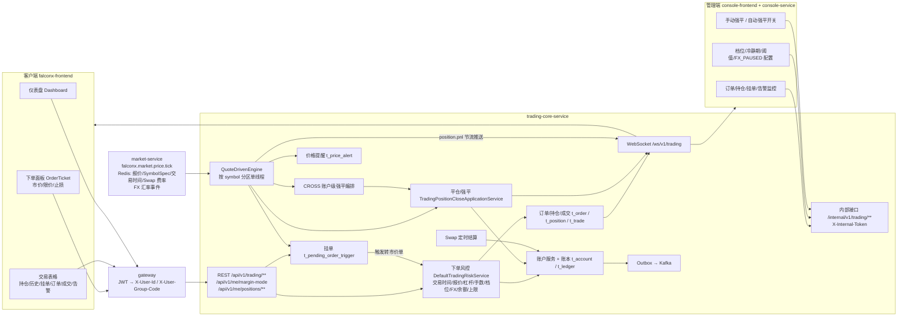

# FalconX 功能地图 · 交易

- 版本：v1（2026-10-07）
- 变更历史：v1（2026-10-07）首次创建
- 依据：fxsystem main `da65af9`；对照代码逐项核实（未运行构建和测试）
- 范围：`falconx-trading-core-service` 的交易账户、账本、市价单、挂单（LIMIT/STOP/STOP_LIMIT/SL_TP）、订单与成交、持仓、TP/SL、逐仓/全仓保证金、杠杆档位、保证金水平、强平（ISOLATED/CROSS/管理员手动）、Swap 隔夜利息、价格提醒、行情驱动引擎 `QuoteDrivenEngine`、交易 WebSocket `/ws/v1/trading`、交易领域事件；客户端（`falconx-frontend`）下单面板、交易表格、仪表盘；管理端（`falconx-console-frontend` + `falconx-console-service`）订单/持仓/挂单/告警监控、手动强平、自动强平开关、档位/冷静期/阈值/FX_PAUSED 类目配置。
  不覆盖：入金、出金、余额调整的业务流程（见 05，本册只列账本 `biz_type`）；风控动作 `t_risk_control_action`、敞口 `t_risk_exposure`、对冲日志、`t_risk_config` 的敞口类字段、用户风控阈值（见 04，本册只写它们在下单路径上的拦截效果）；站内信模板与发送（见 06，本册只列触发的模板 code）。

> 路径约定：下文 `TC/` = `falconx-trading-core-service/src/main/java/com/falconx/trading/`，`TCR/` = `falconx-trading-core-service/src/main/resources/`，`FE/` = `falconx-frontend/src/features/`，`CFE/` = `falconx-console-frontend/src/features/`，`CS/` = `falconx-console-service/src/main/java/com/falconx/console/`。
> 金额精度：所有金额/价格 `DECIMAL(24,8)`；原币（QC）金额 8 位 `DOWN` 截断，账户币（AC）换算金额 8 位 `HALF_UP`（`TC/support/TradingPricingSupport.java`）。
> 统一响应：HTTP 业务异常一律 HTTP 200 + `ApiResponse.code`（非 `"0"`）；请求校验失败 HTTP 400 + `99004`；未捕获异常 HTTP 500（`TC/config/TradingGlobalExceptionHandler.java`）。

## 一图看懂



这张图说明：所有资金变动都收敛到账户服务并写账本；行情 tick 进入按品种分区的引擎，由引擎驱动强平、TP/SL、挂单触发、价格提醒和实时 PnL 推送；管理端只经 console-service 转发到 trading-core 的内部接口。

## 功能清单

| 编号 | 功能 | 使用者 | 状态 |
| --- | --- | --- | --- |
| T-01 | 交易账户与账户快照（余额/冻结/占用/可用/净值/保证金水平） | 客户 | 已实现 |
| T-02 | 账本流水 `t_ledger`（biz_type 18 种）与查询 | 客户 | 已实现 |
| T-03 | 多币种计价与 FX 换算（QC→AC） | 系统 | 部分实现 |
| T-04 | 市价开仓（下单前校验、取价、保证金、手续费、落库） | 客户 | 已实现 |
| T-05 | 杠杆/MM 双重档位 `t_symbol_leverage_tier` 解析与查询 | 客户/系统 | 已实现 |
| T-06 | 挂单 LIMIT / STOP / STOP_LIMIT（创建、修改、撤单、触发） | 客户 | 部分实现 |
| T-07 | 订单 `t_order` 与成交 `t_trade` 查询 | 客户 | 已实现 |
| T-08 | 持仓 `t_position`、未实现盈亏、持仓汇总 | 客户 | 已实现 |
| T-09 | 手动平仓（全额） | 客户 | 已实现 |
| T-10 | 止盈止损 TP/SL（持仓字段 + SL_TP 挂单双轨） | 客户 | 部分实现 |
| T-11 | 追加逐仓保证金与强平价重算 | 客户 | 部分实现 |
| T-12 | 账户保证金模式切换（STAGE-14D1） | 客户 | 已实现 |
| T-13 | 保证金水平分级与 MarginCall 告警（STAGE-14C1） | 系统 | 已实现 |
| T-14 | ISOLATED 自动强平（强平价 + 单仓 StopOut 双触发） | 系统 | 已实现 |
| T-15 | CROSS 账户级强平（STAGE-14D2） | 系统 | 部分实现 |
| T-16 | 强平日志 `t_liquidation_log` 与强平查询 | 客户 | 已实现 |
| T-17 | Swap 隔夜利息结算与查询 | 系统/客户 | 已实现 |
| T-18 | 价格提醒（10 条上限、3 次 × 5 分钟节流） | 客户 | 已实现 |
| T-19 | 行情驱动引擎 `QuoteDrivenEngine` | 系统 | 已实现 |
| T-20 | 交易 WebSocket `/ws/v1/trading`（用户 + 管理端频道） | 客户/管理员 | 已实现 |
| T-21 | 交易领域事件（Outbox → Kafka） | 系统 | 已实现 |
| T-22 | 客户端下单面板 OrderTicket | 客户 | 已实现 |
| T-23 | 客户端交易表格（持仓/历史/挂单/订单/成交/告警）与活动页 | 客户 | 已实现 |
| T-24 | 客户端仪表盘看板 | 客户 | 已实现 |
| T-25 | 管理端订单/持仓监控、平台持仓汇总、运营指标 | 管理员 | 已实现 |
| T-26 | 管理端挂单监控/强制撤单、价格告警监控/强制删除 | 管理员 | 已实现 |
| T-27 | 管理端手动强平、自动强平开关 | 管理员 | 已实现 |
| T-28 | 管理端交易配置（档位、冷静期、StopOut/MarginCall、FX_PAUSED 类目、全仓开关） | 管理员 | 部分实现 |
| T-29 | 部分平仓 / 净持仓模型 | — | 不做 |
| T-30 | 下单面板预览组件 `OrderTicketPreview` | — | 占位 |
| T-31 | K 线收盘事件消费 | 系统 | stub/骨架 |

---

## T-01 交易账户与账户快照

- **状态**：已实现。`GET /api/v1/trading/accounts/me` → `TradingAccountSnapshotApplicationService.getCurrentAccountSnapshot`，实时计算净值与保证金水平。
- **使用者与入口**：
  - 客户端：仪表盘余额卡、下单面板可用余额（`FE/trading/tradingApi.ts#getAccount`）、WS `account.snapshot / account.update`。
  - 接口：`GET /api/v1/trading/accounts/me`（trading-core，gateway JWT 鉴权后注入 `X-User-Id`）。
- **业务逻辑**：
  1. 账户唯一性：`t_account.user_id UNIQUE`，**每个用户只有一个交易账户**；所有路径都用配置 `falconx.trading.settlement-token`（默认 `USDT`）作为账户币调用 `getOrCreateAccount(userId, settlementToken)`，`t_account.currency` 实际恒为 `USDT`（见 T-03）。
  2. 首次访问自动开户：`GET /accounts/me` 走 `getOrCreateAccount`，账户不存在时 INSERT 一行（`balance/frozen/margin_used=0`，`margin_mode=ISOLATED`）；并发首建靠唯一键冲突 `DuplicateKeyException` 回退重查（`TC/service/impl/DefaultTradingAccountService.java#getOrCreateAccountInternal`）。
  3. 公式（`TC/entity/TradingAccount.java`、`TC/service/impl/DefaultAccountEquityCalculator.java`）：
     - `available = balance − frozen − marginUsed`（8 位 DOWN）
     - `uPnL_i(AC) = uPnL_i(QC) × fx(QC→AC)`（见 T-08）
     - `MM_i(AC) = quantity × entryPrice × mm_rate_at_open × fx实时(QC→AC)`；实时 FX 不可用时用 `entry_fx_rate`，再缺失用 1
     - 账户级 `equity = balance + frozen + Σ uPnL_i(AC)`；任一持仓 uPnL 无法换算时 `equity = null`
     - 账户级 `marginLevel = equity / Σ MM_i × 100`（百分比，2 位 HALF_UP）；`Σ MM_i ≤ 0`（无持仓）或 equity 为 null 时 `marginLevel = null`
     - `marginLevelStatus` 由 `MarginLevelMonitor.evaluate` 判定（见 T-13）；`marginLevel=null` 时为 `HEALTHY`
  4. 账户行写并发控制：所有资金变动先 `SELECT ... FOR UPDATE` 锁账户行（`selectByUserIdAndCurrencyForUpdate`），UPDATE 不带版本条件；`t_account.version` 列存在但代码未使用（无乐观锁）。
  5. 账户所有状态变化通过不可变方法生成新快照（`credit / reverseCredit / reserveMargin / releaseFrozen / chargeFee / confirmMarginUsed / chargeSwap / creditSwap / supplementIsolatedMargin / settlePositionExit / settleConfirmedWithdraw`），每次变化写一条账本（T-02）。
  6. 副作用提醒：`toResponse` 内调用 `MarginLevelMonitor.evaluate`，当账户处于 MARGIN_CALL 区间时，**查询账户接口本身会触发 MARGIN_CALL 站内信**（受 5 分钟节流）。
- **字段**：
  - 响应 `TradingAccountResponse`：

    | 字段 | 类型 | 含义 |
    | --- | --- | --- |
    | `accountId` | Long | 账户 ID |
    | `userId` | Long | 用户 ID |
    | `currency` | String | 账户币（恒为 `USDT`） |
    | `balance` | BigDecimal | 现金余额 |
    | `frozen` | BigDecimal | 冻结（挂单冻结、出金冻结） |
    | `marginUsed` | BigDecimal | 已占用保证金（AC） |
    | `available` | BigDecimal | `balance − frozen − marginUsed` |
    | `marginMode` | String | 账户默认保证金模式 `CROSS/ISOLATED` |
    | `equity` | BigDecimal | 账户净值，FX 不可用时 null |
    | `marginLevel` | BigDecimal | 保证金水平（百分比数值），无持仓/降级 null |
    | `marginLevelStatus` | String | `HEALTHY / MARGIN_CALL / STOP_OUT` |
    | `openPositions` | List | `TradingAccountPositionResponse`：`positionId, symbol, side, quantity, entryPrice, markPrice, quoteCurrency, fxRate, unrealizedPnlInQuote, unrealizedPnlInAccount, isolatedMargin, marginMode, liquidationPrice, takeProfitPrice, stopLossPrice, quoteStale, quoteTs, priceSource` |
  - 数据表 `t_account`（本域 owner，全部字段）：

    | 表.字段 | 类型 | 含义 | 约束/取值 |
    | --- | --- | --- | --- |
    | `t_account.id` | BIGINT | 主键（雪花） | PK |
    | `t_account.user_id` | BIGINT | 用户 ID | NOT NULL UNIQUE |
    | `t_account.currency` | VARCHAR(16) | 账户币 | 默认 `USDT` |
    | `t_account.balance` | DECIMAL(24,8) | 现金余额 | 默认 0 |
    | `t_account.frozen` | DECIMAL(24,8) | 冻结金额 | 默认 0 |
    | `t_account.margin_used` | DECIMAL(24,8) | 已占用保证金 | 默认 0 |
    | `t_account.margin_mode` | TINYINT | 账户默认保证金模式 | `1=cross,2=isolated`，默认 2（V11） |
    | `t_account.mode_changed_at` | DATETIME(3) | 上次模式切换时间 | 可空（V33） |
    | `t_account.mode_cooling_until` | DATETIME(3) | 模式冷静期截止 | 可空（V33） |
    | `t_account.version` | INT | 乐观锁版本号 | 默认 0，**代码未使用** |
    | `t_account.created_at` | DATETIME(3) | 创建时间 | |
    | `t_account.updated_at` | DATETIME(3) | 更新时间 | ON UPDATE |
- **错误码**：无专属业务码（读接口）。
- **相关事件和定时任务**：WS `account.snapshot`（连接建立时）、`account.update`（下单成交/拒单、平仓、追加保证金后推送，**不按 tick 推送**）。
- **证据**：`TC/controller/TradingAccountController.java`、`TC/application/TradingAccountSnapshotApplicationService.java`、`TC/entity/TradingAccount.java`、`TC/service/impl/DefaultTradingAccountService.java`、`TC/service/impl/DefaultAccountEquityCalculator.java`、`TCR/mapper/trading/TradingAccountMapper.xml`、`TCR/db/migration/V1__init_trading_schema.sql`、`V11__account_margin_mode.sql`、`V33__account_mode_switch_columns.sql`。

## T-02 账本流水 `t_ledger`

- **状态**：已实现。每次账户变动同事务写账本，含变动前后三维快照；用户可分页、按类型/时间筛选查询。
- **使用者与入口**：客户端钱包流水（`FE/wallet/walletApi.ts` 调 `/api/v1/trading/ledger`，归 05 展示）；接口 `GET /api/v1/trading/ledger`（trading-core，JWT）。
- **业务逻辑**：
  1. 幂等：唯一键 `uk_ledger_user_idempotency (user_id, idempotency_key)`；重复写会抛唯一键异常使整个事务回滚（下单/挂单重复 `clientOrderId` 的最终兜底）。Swap 写前还会先 `countByUserIdAndIdempotencyKey` 预查。
  2. 每条记录保存 `balance/frozen/margin_used` 的 before/after。
  3. 三列原币留痕（V28）：`original_amount / original_currency / fx_rate_at_settlement`。开仓保证金/手续费、平仓盈亏、Swap 写真值；入金、出金、挂单冻结释放、追加保证金等写占位（`original_amount=amount`、`original_currency=账户币`、`fx=1`）。负净值保护封顶时 `amount ≠ original_amount × fx` 为预期（见 T-14）。
  4. 下单三笔账本批量 INSERT（`batchInsert`），其余逐条 INSERT。
  5. 查询：`page≥1`，`1≤pageSize≤100`；`bizType` 为枚举名（非法 → 400）；`from/to` 支持带偏移 ISO 或本地时间（按 UTC）；有筛选走 `idx_perf_ledger_user_biz_time`。
- **字段**：
  - 请求：

    | 字段 | 类型 | 必填 | 含义 | 约束/取值 |
    | --- | --- | --- | --- | --- |
    | `page` | int | 否 | 页码 | 默认 1，≥1 |
    | `pageSize` | int | 否 | 每页 | 默认 20，1–100 |
    | `bizType` | String | 否 | 账本类型 | `TradingLedgerBizType` 枚举名 |
    | `from` / `to` | String | 否 | 时间窗 | ISO-8601 |
  - 响应 `TradingLedgerListResponse{page,pageSize,total,items[]}`，item `TradingLedgerItemResponse`：`ledgerId, bizType, amount, idempotencyKey, referenceNo, balanceBefore, balanceAfter, frozenBefore, frozenAfter, marginUsedBefore, marginUsedAfter, createdAt`。**响应未包含 `original_amount / original_currency / fx_rate_at_settlement`**。
  - 数据表 `t_ledger`（本域 owner，全部字段）：

    | 表.字段 | 类型 | 含义 | 约束/取值 |
    | --- | --- | --- | --- |
    | `id` | BIGINT | 主键 | PK |
    | `user_id` | BIGINT | 用户 | |
    | `account_id` | BIGINT | 账户 | |
    | `biz_type` | TINYINT | 业务类型 | 见下表 |
    | `idempotency_key` | VARCHAR(64) | 幂等键 | `uk(user_id, idempotency_key)` |
    | `reference_no` | VARCHAR(128) | 业务参考号 | 前缀索引 `idx_perf_ledger_reference_no(64)` |
    | `amount` | DECIMAL(24,8) | 账户币金额 | 盈亏可负 |
    | `original_amount` | DECIMAL(24,8) | 原币金额 | NOT NULL（V28 回填） |
    | `original_currency` | VARCHAR(16) | 原币种 | NOT NULL |
    | `fx_rate_at_settlement` | DECIMAL(24,8) | 结算时汇率 original→account | NOT NULL |
    | `balance_before/after` | DECIMAL(24,8) | 余额快照 | |
    | `frozen_before/after` | DECIMAL(24,8) | 冻结快照 | |
    | `margin_used_before/after` | DECIMAL(24,8) | 占用快照 | |
    | `created_at` | DATETIME(3) | 记账时间 | 索引 `idx_user_created / idx_biz_type_created / idx_perf_ledger_user_biz_time` |
  - 枚举 `biz_type`（编码映射在 `TC/repository/TradingMybatisSupport.java`）：

    | 码 | 枚举名 | 账户字段变化 | 来源 / idempotency_key / reference_no |
    | --- | --- | --- | --- |
    | 1 | `DEPOSIT_CREDIT` | balance + | 入金入账（05） |
    | 2 | `DEPOSIT_REVERSAL` | balance − | 入金回滚（05） |
    | 3 | `ORDER_MARGIN_RESERVED` | frozen + | 市价单首步 `order-margin-reserve:{clientOrderId}`，ref=clientOrderId；挂单冻结也用本类型 `pending-order-reserve:{clientOrderId}` |
    | 4 | `ORDER_FEE_CHARGED` | balance − fee | `order-fee-charge:{clientOrderId}` |
    | 5 | `ORDER_MARGIN_CONFIRMED` | frozen −，margin_used + | `order-margin-confirm:{clientOrderId}` |
    | 6 | `SWAP_CHARGE` | balance − | `swap:{positionId}:{rolloverAt}`（key 与 ref 相同） |
    | 7 | `SWAP_INCOME` | balance + | 同上 |
    | 8 | `REALIZED_PNL` | balance ± appliedPnl，margin_used − position.margin | 平仓/TP/SL，`position-exit:{positionId}:{closeReason}`，ref=positionId |
    | 9 | `LIQUIDATION_PNL` | 同 8，带负净值保护 | 强平（含 CROSS_STOP_OUT、管理员手动强平） |
    | 10 | `ISOLATED_MARGIN_SUPPLEMENT` | margin_used + | 追加保证金，`ims:{positionId}:{随机UUID}`，ref=`isolated-margin-supplement:{positionId}` |
    | 11 | `ADMIN_BALANCE_ADJUST` | balance ± | 管理员调余额（属客户管理，ref=traceId） |
    | 12 | `PENDING_ORDER_RELEASED` | frozen − | 挂单撤销 `pending-order-release:{orderNo}`、触发 `pending-order-trigger-release:{orderNo}`、管理员撤单 `admin-pending-order-release:{orderNo}` |
    | 13 | `WITHDRAW_FREEZE` | frozen + | 出金（05） |
    | 14 | `WITHDRAW_REFUND_CANCEL` | frozen − | 出金（05） |
    | 15 | `WITHDRAW_REFUND_REJECT` | frozen − | 出金（05） |
    | 16 | `WITHDRAW_REFUND_EMERGENCY` | frozen − | 出金（05） |
    | 17 | `WITHDRAW_SETTLE` | balance −，frozen − | 出金（05） |
    | 18 | `WITHDRAW_REFUND_CHAIN_FAILED` | frozen − | 出金（05） |
- **错误码**：`99004`（分页/`bizType`/时间格式非法，HTTP 400）。
- **相关事件和定时任务**：WS `ledger.created`（推最新一条，见 T-20）。
- **证据**：`TC/entity/TradingLedgerBizType.java`、`TC/entity/TradingLedgerEntry.java`、`TC/repository/TradingMybatisSupport.java`、`TC/controller/TradingUserQueryController.java#listLedgerEntries`、`TCR/mapper/trading/TradingLedgerMapper.xml`、`V1`、`V3`、`V7`、`V12`、`V26`、`V28` 迁移。

## T-03 多币种计价与 FX 换算

- **状态**：部分实现。品种计价币（QC）与账户币（AC）之间的换算已贯穿开仓、平仓、Swap、净值、MM；但**账户币固定为配置 `settlement-token=USDT`，不存在“多币种账户”**（每用户一个账户、`t_account.currency` 不被业务读取作为结算币）。
- **使用者与入口**：系统内部；`GET /api/v1/trading/symbols/{symbol}/leverage-tiers` 响应附 `fxRate` 供客户端估算。
- **业务逻辑**：
  1. 汇率源 `DefaultFxRateService`：启动时 RPC 拉 market-service 全量 FX（`falconx.trading.fx.market-rpc-url`），失败仅告警（`bootstrap-failure-policy=warn`）；运行期消费 Kafka `falconx.market.fx.rate.update`（组 `falconx-trading-fx-rate`）更新内存 `ConcurrentHashMap`，**无 TTL、无过期判断**。
  2. 换算 `FxRateConverterHelper.compute(from,to)`：同币种 → 1；直接对 `FROM/TO`；反向对 `1/(TO/FROM)`；否则经 USD 中转。`USDT` 视同 `USD`（1:1 锚定）。8 位 HALF_UP。
  3. 计价币来源：Redis `falconx:market:symbol-spec:{symbol}` 的 `SymbolSpec.quoteCurrency`（本地缓存 10s）。
  4. 失败策略：开仓（保证金/手续费）FX 不可用 → 拒单 `FX_RATE_UNAVAILABLE`；`quoteCurrency` 为空 → 拒单 `SYMBOL_SPEC_NOT_FOUND`。平仓/强平/Swap FX 不可用 → 不阻断，**把原币金额直接当账户币记账**（`fx=1`，`original_currency` 记真实 QC；QC 缺失时记账户币）并告警。净值/MM：FX 不可用时 MM 用 `entry_fx_rate`，uPnL 无法换算则 equity/marginLevel 为 null（不强平）；WS/查询的 uPnL(AC) 降级用 `entry_fx_rate`。
  5. 开仓冻结 `t_position.entry_fx_rate`（仅审计 + 降级用）。
- **字段**：`t_position.entry_fx_rate DECIMAL(24,8) NOT NULL DEFAULT 1`（V29）；`t_ledger` 三列（见 T-02）。
- **错误码**：开仓拒单原因 `FX_RATE_UNAVAILABLE`（HTTP 业务码实际为 `40002`，见“文档与代码不一致”）。
- **相关事件和定时任务**：消费 `falconx.market.fx.rate.update`（`TC/consumer/FxRateUpdateEventConsumer.java`）。
- **证据**：`TC/service/impl/DefaultFxRateService.java`、`TC/service/FxRateConverterHelper.java`、`TC/calculator/MarginCalculator.java`、`TC/support/TradingPricingSupport.java#calculatePositionPnlInAccount`、`TC/application/TradingPositionCloseApplicationService.java#convertRealizedPnl`、`TC/config/TradingCoreServiceProperties.java`（`settlementToken`）。

## T-04 市价开仓

- **状态**：已实现。`POST /api/v1/trading/orders/market` 同步风控 → 资金三步 → 订单/持仓/成交/敞口/Outbox 同事务。
- **使用者与入口**：客户端下单面板“市价”tab（T-22）；挂单触发时内部复用（T-06）；接口 `POST /api/v1/trading/orders/market`（trading-core，JWT；读 `X-User-Id`、`X-User-Group-Code`，组缺省 `default`）。
- **业务逻辑**（`TradingOrderPlacementApplicationService.placeMarketOrder`，`@Transactional`）：
  1. 幂等：先按 `(userId, clientOrderId)` 查 `t_order`，存在则返回原订单/持仓/成交，`duplicate=true`（含原拒单原因）。查重在加锁前，真正并发重复由账本唯一键兜底（第二笔回滚、返回 500）。
  2. 锁账户：`getOrCreateAccountForUpdate`（FOR UPDATE）。读 Redis 报价快照 `falconx:trading:quote:snapshot:{symbol}`。
  3. 保证金模式：请求 `marginMode` 优先，缺省继承 `t_account.margin_mode`，再缺省 `ISOLATED`。**请求可显式指定与账户模式不同的模式**（无一致性校验）。
  4. 风控顺序（`DefaultTradingRiskService.evaluateMarketOrder`，任一命中即拒）：

     | 序 | 条件 | 拒单原因 |
     | --- | --- | --- |
     | 1 | Redis 无该品种交易时间快照 `falconx:market:trading:schedule:{symbol}` | `SYMBOL_NOT_SUPPORTED` |
     | 2 | `TradingScheduleService.isOpenAllowed` 为假（周交易时段、节假日、例外停盘） | `SYMBOL_TRADING_SUSPENDED` |
     | 3 | 报价不存在 / `NO_QUOTE` / bid、ask、mark 任一为空 | `MARKET_QUOTE_NOT_FOUND` |
     | 4 | 报价不可执行（非 `FRESH`，或报价时间与当前偏差 > `falconx.trading.stale.max-age` 默认 5s） | `MARKET_QUOTE_STALE` |
     | 5 | 数量 ≤ 0 / 杠杆 ≤ 0 | `INVALID_QUANTITY` / `INVALID_LEVERAGE` |
     | 6 | CROSS 且 Redis 开关 `falconx:trading:risk:cross_mode.enabled` 非 `1`（缺省 false） | `CROSS_MODE_NOT_ENABLED` |
     | 7 | 非 CROSS/ISOLATED | `MARGIN_MODE_NOT_SUPPORTED` |
     | 8 | 无 `SymbolSpec` | `SYMBOL_SPEC_NOT_FOUND` |
     | 9 | `leverage > min(SymbolSpec.maxLeverage（缺省配置 100）, t_risk_config.max_leverage)` | `LEVERAGE_EXCEEDED` |
     | 10 | `quantity < minQty` / `> maxQty` / 小数位 > `qtyPrecision` | `QTY_BELOW_MIN` / `QTY_ABOVE_MAX` / `QTY_PRECISION_EXCEEDED` |
     | 11 | 存在活跃 `GLOBAL_PAUSE`：按 `SymbolSpec.category` 查 `t_fx_pause_behavior.allow_open`；false → 拒；category 或配置缺失 → 保守全拒 | `GLOBAL_PAUSE_ACTIVE` / `BBOOK_RISK_GLOBAL_PAUSE` |
     | 12 | 品种最严重的活跃风控动作（04）：`REJECT_OPEN` / `REDUCE_ONLY` / `SUSPEND_SYMBOL` / 品种级 `GLOBAL_PAUSE` | `BBOOK_RISK_OPEN_REJECTED` / `BBOOK_RISK_REDUCE_ONLY` / `SYMBOL_TRADING_SUSPENDED` / `BBOOK_RISK_GLOBAL_PAUSE` |
     | 13 | 用户级敞口阈值（04，`t_user_risk_threshold`）：Σ\|qty×有效标记价\| + 本单 qty×对手价 > 阈值 | `BBOOK_RISK_USER_EXPOSURE_LIMIT` |
     | 14 | 名义价值 `fillPrice × quantity < SymbolSpec.minNotional` | `NOTIONAL_BELOW_MIN` |
     | 15 | `SymbolSpec.quoteCurrency` 为空 | `SYMBOL_SPEC_NOT_FOUND` |
     | 16 | 保证金或手续费 FX 不可用 | `FX_RATE_UNAVAILABLE` |
     | 17 | `available < IM(AC) + Fee(AC)` | `INSUFFICIENT_AVAILABLE_BALANCE` |
     | 18 | 该用户该品种 OPEN 持仓**笔数** ≥ `t_risk_config.max_position_per_user`（>0 才生效） | `POSITION_LIMIT_REACHED` |
     | 19 | 全平台该品种 OPEN 持仓**笔数** ≥ `t_risk_config.max_position_total` | `PLATFORM_POSITION_LIMIT_REACHED` |
     | 20 | 档位解析失败（无配置或落不进档） | `TIER_CONFIG_NOT_FOUND` |
     | 21 | `leverage > tier.maxLeverage` | `LEVERAGE_EXCEEDS_TIER` |
     | 22 | ISOLATED：`|fillPrice − liquidationPrice| ≤ 2 × |ask − bid|` | `LIQUIDATION_DISTANCE_TOO_CLOSE` |
  5. 取价与计算公式：
     - 组加点：`TradingGroupMarkupService.find(groupCode, symbol)` → `bidExtra / askExtra`（内存快照，启动全量 + 每 30s 增量，源 market `/internal/v1/market/symbols/group-markup/*`；无配置视为 0）。
     - `fillPrice = BUY ? ask + askExtra : bid + bidExtra`；`requestedPrice`（订单参考价）= `BUY ? ask : bid`（不含加点）。
     - `notional(QC) = fillPrice × quantity`（**无合约乘数/手数概念**）。
     - `IM(QC) = notional / leverage`（8 位 DOWN）；`IM(AC) = IM(QC) × fx`（8 位 HALF_UP）。
     - `feeRate = SymbolSpec.takerFeeRate`，缺省 `falconx.trading.default-fee-rate=0.0005`；`Fee(QC) = notional × feeRate`（8 位 DOWN）；`Fee(AC) = Fee(QC) × fx`。
     - 档位落档用 `notional(AC) = IM(AC) × leverage`（T-05）。
     - 强平价（ISOLATED，`LiquidationPriceCalculator`，均为 QC）：`marginPerUnit = IM(QC)/qty`；BUY `liq = fillPrice − marginPerUnit + fillPrice × mmRate`；SELL `liq = fillPrice + marginPerUnit − fillPrice × mmRate`（8 位 DOWN）；CROSS 写 NULL。
  6. 拒单：落一条 `t_order`（`status=REJECTED`、`reject_reason`、`margin=fee=0`），提交后推 WS `order.update`+`account.update`+`ledger.created`；HTTP 200，业务码按下表映射。
  7. 成交：`applyOrderPlacementAccountChange` 一次 UPDATE 完成 `frozen+IM → balance−Fee → frozen−IM, margin_used+IM`，批量写 3 条账本（biz 3/4/5）。然后写 `t_order(FILLED)`、`t_position(OPEN)`（冻结 `group_code_at_open / bid_extra_at_open / ask_extra_at_open / entry_fx_rate / mm_rate_at_open / tier_no_at_open / open_fee_rate`）、`t_trade(OPEN)`、更新净敞口（04），写 Outbox `trading.order.created`、`trading.order.filled`。
  8. 事务提交后：持仓写入内存快照 `OpenPositionSnapshotStore`；推 WS `order.update / position.update / trade.created / account.update / ledger.created`。
  9. 请求里的 TP/SL 只写入 `t_position.take_profit_price / stop_loss_price`，**不生成 SL_TP 挂单行**（重启时由回填任务补，见 T-10）。
- **字段**：
  - 请求 `PlaceMarketOrderRequest`：

    | 字段 | 类型 | 必填 | 含义 | 约束/取值 |
    | --- | --- | --- | --- | --- |
    | `symbol` | String | 是 | 品种 | 非空 |
    | `side` | enum | 是 | 方向 | `BUY / SELL` |
    | `quantity` | BigDecimal | 是 | 数量 | ≥ 0.00000001 |
    | `leverage` | BigDecimal | 是 | 杠杆 | ≥ 0.00000001 |
    | `marginMode` | enum | 否 | 保证金模式 | `CROSS / ISOLATED`，缺省继承账户 |
    | `takeProfitPrice` | BigDecimal | 否 | 止盈价 | ≥ 0.00000001 |
    | `stopLossPrice` | BigDecimal | 否 | 止损价 | ≥ 0.00000001 |
    | `clientOrderId` | String | 是 | 幂等键 | 非空，≤64（表列长度） |
  - 响应 `PlaceMarketOrderResponse`：

    | 字段 | 类型 | 含义 |
    | --- | --- | --- |
    | `orderNo` | String | 订单号（`O` + 雪花 ID 36 进制大写） |
    | `orderStatus` | String | `FILLED / REJECTED` |
    | `rejectionReason` | String | 拒单原因（上表） |
    | `duplicate` | boolean | 是否幂等命中 |
    | `symbol, side, quantity` | | 回显 |
    | `requestPrice` | BigDecimal | 下单参考价（不含加点） |
    | `filledPrice` | BigDecimal | 成交价（含组加点） |
    | `leverage, marginMode` | | |
    | `margin` | BigDecimal | IM(AC) |
    | `fee` | BigDecimal | Fee(AC) |
    | `positionId, positionStatus, takeProfitPrice, stopLossPrice` | | 新持仓 |
    | `tradeId` | Long | 开仓成交 |
    | `account` | TradingAccountResponse | 下单后账户快照 |
- **错误码**（拒单原因 → HTTP 业务码，`TC/controller/TradingOrderController.java`）：

  | 错误码 | 含义 | 触发条件 |
  | --- | --- | --- |
  | `40008` | Symbol Trading Suspended | `SYMBOL_TRADING_SUSPENDED` |
  | `40010` | Margin Mode Not Supported | `MARGIN_MODE_NOT_SUPPORTED` |
  | `30088` | Cross Mode Not Enabled | `CROSS_MODE_NOT_ENABLED` |
  | `40001` | Insufficient Margin | `INSUFFICIENT_AVAILABLE_BALANCE` |
  | `30003` | Quote Not Available | `MARKET_QUOTE_NOT_FOUND` |
  | `30002` | Price Source Stale Or Disconnected | `MARKET_QUOTE_STALE` |
  | `30005` | Position Limit Reached | `POSITION_LIMIT_REACHED` |
  | `30006` | Platform Position Limit Reached | `PLATFORM_POSITION_LIMIT_REACHED` |
  | `30070` | Leverage Exceeds Tier | `LEVERAGE_EXCEEDS_TIER` |
  | `30071` | Liquidation Distance Too Close | `LIQUIDATION_DISTANCE_TOO_CLOSE` |
  | `30072` | Tier Config Not Found | `TIER_CONFIG_NOT_FOUND` |
  | `30087` | Global Pause Active | `GLOBAL_PAUSE_ACTIVE` |
  | `40002` | Order Rejected | 其余全部原因：`SYMBOL_NOT_SUPPORTED`、`INVALID_*`、`SYMBOL_SPEC_NOT_FOUND`、`LEVERAGE_EXCEEDED`、`QTY_*`、`NOTIONAL_BELOW_MIN`、`FX_RATE_UNAVAILABLE`、`BBOOK_RISK_*` |
  | `99004` | 请求校验失败 | Bean Validation 不通过（HTTP 400） |
- **相关事件和定时任务**：Outbox `falconx.trading.order.created`（payload `orderNo,userId,symbol,status`）、`falconx.trading.order.filled`（`orderNo,positionId,tradeId,filledPrice,quantity`），partitionKey=userId；WS 见 T-20。
- **证据**：`TC/controller/TradingOrderController.java`、`TC/application/TradingOrderPlacementApplicationService.java`、`TC/service/impl/DefaultTradingRiskService.java`、`TC/calculator/MarginCalculator.java`、`TC/calculator/LiquidationPriceCalculator.java`、`TC/service/impl/DefaultTradingAccountService.java#applyOrderPlacementAccountChange`、`TC/dto/PlaceMarketOrderRequest.java`、`TC/dto/PlaceMarketOrderResponse.java`。

## T-05 杠杆/MM 双重档位 `t_symbol_leverage_tier`

- **状态**：已实现。开仓按账户币名义价值落档取最大杠杆与维持保证金率；客户端可查询档位表做动态降档；管理端可增改软删（T-28）。
- **使用者与入口**：`GET /api/v1/trading/symbols/{symbol}/leverage-tiers`（trading-core，JWT，读 `X-User-Group-Code`）；客户端 `FE/trading/leverageTiers.ts`。
- **业务逻辑**：
  1. 档位读取：`SymbolLeverageTierRepository.findTiers(symbol, groupCode)` 只取 `enabled=1`，按 `notional_lower` 升序；请求组无配置时回退 `default` 组。
  2. 落档：`notional(AC) ∈ [notional_lower, notional_upper)`，`notional_upper=NULL` 表示无上限；无命中返回空 → `TIER_CONFIG_NOT_FOUND`。
  3. 缓存：本地 `ConcurrentHashMap`，key=`symbol|groupCode`，TTL `falconx.trading.tier.cache-refresh-seconds` 默认 30s，惰性过期；8000 条开始清扫过期、10000 条强制清最老 1/4；管理端增改删后仅失效本机缓存（多实例依赖 30s 过期）。
  4. 冻结：开仓把 `mm_rate` 写入 `t_position.mm_rate_at_open`、`tier_no` 写入 `tier_no_at_open`，后续档位变化不影响存量持仓。
  5. 规则：DB CHECK `max_leverage × mm_rate ≤ 1.0`；设计准则 `≤ 0.5`（V38 把 seed 中 `> 0.5` 的行 `mm_rate` 减半，开仓守卫 30071 兜底）。管理端校验同样只到 `≤ 1.0`。
  6. 种子（V30）：由脚本按 market `t_symbol(status=1)` 快照生成，1572 个品种、6311 行，均为 `default` 组；类目 6（股票）/7（ETF）复用股指能源模板，例如港股 4 档：`[0,100000)` 100x/1%、`[100000,500000)` 50x/2%、`[500000,2000000)` 20x/5%、`[2000000,∞)` 10x/10%。
  7. 查询接口附 `quoteCurrency` 与 `fxRate`（QC→USDT；同币种 1；FX 不可用 null），只返回 enabled 档。
- **字段**：
  - 响应 `TradingLeverageTierListResponse`：`symbol, groupCode（实际生效组）, quoteCurrency, fxRate, tiers[]{tierNo, notionalLower, notionalUpper, maxLeverage, mmRate}`。
  - 数据表 `t_symbol_leverage_tier`（本域 owner）：

    | 表.字段 | 类型 | 含义 | 约束/取值 |
    | --- | --- | --- | --- |
    | `id` | BIGINT | 主键 | seed 自 30000001 |
    | `symbol` | VARCHAR(32) | 品种 | |
    | `group_code` | VARCHAR(32) | 客户组 | 默认 `default` |
    | `tier_no` | TINYINT | 档位序号 | `uk_symbol_group_tier(symbol, group_code, tier_no)` |
    | `notional_lower` | DECIMAL(24,8) | 下界（含，AC） | `idx_symbol_group_lower` |
    | `notional_upper` | DECIMAL(24,8) | 上界（不含） | NULL=无上限 |
    | `max_leverage` | INT | 最大杠杆 | |
    | `mm_rate` | DECIMAL(8,6) | 维持保证金率 | `CHECK max_leverage*mm_rate ≤ 1.0` |
    | `enabled` | TINYINT | 启用 | 默认 1；软删置 0 |
    | `created_at / updated_at` | DATETIME | | |
- **错误码**：开仓侧 `30070 / 30072`（T-04）。
- **证据**：`TC/service/impl/DefaultLeverageTierResolver.java`、`TC/repository/MybatisSymbolLeverageTierRepository.java`、`TCR/mapper/trading/SymbolLeverageTierMapper.xml`、`TC/application/TradingUserQueryApplicationService.java#getLeverageTiers`、`V30__symbol_leverage_tier.sql`（仅看结构）、`V32__position_tier_freeze.sql`、`V38__tier_mm_rate_half_buffer_fix.sql`。

## T-06 挂单 LIMIT / STOP / STOP_LIMIT

- **状态**：部分实现。创建、冻结、撤单、修改、按价格触发转市价单已接通。缺口：① STOP_LIMIT 触发后**直接按市价开仓，不挂限价单**，`limit_price` 只存不用；② 修改数量**不重算冻结金额**；③ `EXPIRED` 状态无任何代码写入（无有效期）；④ 挂单只支持 ISOLATED（CROSS 被拒 `40010`）；⑤ 冻结金额按触发价、默认费率、**不做 FX 换算**；⑥ 触发转市价单时不传用户组（按 `default` 组取价），挂单冻结的组加点只用于触发判定。
- **使用者与入口**：客户端下单面板“限价/止损”tab、挂单表；接口（trading-core，JWT）：
  - `POST /api/v1/trading/orders/limit`
  - `POST /api/v1/trading/orders/stop`（带 `limitPrice` 即 STOP_LIMIT）
  - `PATCH /api/v1/trading/orders/{id}` 修改
  - `DELETE /api/v1/trading/orders/{id}` 撤单
  - `GET /api/v1/trading/orders/pending` 查询（只返回开仓挂单，排除 SL_TP；不传 status 时只查 PENDING）
- **业务逻辑**（`TradingPendingOrderApplicationService`）：
  1. 创建：
     - 精度：`quantity` 小数位 ≤ `qtyPrecision` 否则 `30017`；`triggerPrice/limitPrice` 小数位 ≤ `pricePrecision` 否则 `30018`（SymbolSpec 缺失跳过）。
     - 距离：`|triggerPrice − mark| / mark ≥ t_risk_config.pending_order_min_distance_ratio`（V16 默认 0.003，NULL 或无报价不校验）否则 `30013`。
     - 冻结：`notional = quantity × triggerPrice`；`frozen_margin = notional / leverage`（8 位 HALF_UP）；`frozen_fee = notional × default-fee-rate(0.0005)`。
     - 可用校验：锁账户，`available ≥ frozen_margin + frozen_fee`；有效模式非 ISOLATED → `40010`；不足 → `30016`。
     - 资金：`frozen += frozen_margin + frozen_fee`（账本 biz 3，key `pending-order-reserve:{clientOrderId}`）。
     - 落库：`order_no = O+base36(id)`；冻结 `group_code_at_create / bid_extra_at_create / ask_extra_at_create`；`status=PENDING`；登记活跃品种索引。
     - 创建时**不做**下单风控（交易时间、杠杆上限、档位、风控动作等），这些在触发转市价单时才校验。
  2. 触发判定（`PendingOrderTriggerEvaluator`，`effectiveAsk = ask + ask_extra_at_create`，`effectiveBid = bid + bid_extra_at_create`）：
     - LIMIT BUY：`effectiveAsk ≤ trigger_price`；LIMIT SELL：`effectiveBid ≥ trigger_price`
     - STOP / STOP_LIMIT BUY：`effectiveAsk ≥ trigger_price`；SELL：`effectiveBid ≤ trigger_price`
  3. 触发执行 `triggerOpening`（每条单独事务）：FOR UPDATE 锁挂单且须 PENDING → 释放冻结（biz 12，`pending-order-trigger-release:{orderNo}`）→ 以 `clientOrderId = trigger-{orderNo}`、原数量/杠杆/模式、无 TP/SL 调 `placeMarketOrder`（完整走 T-04 风控，以**当时**报价成交）→ 标记 `TRIGGERED` 并写 `triggered_order_id`。市价单被风控拒绝时挂单仍标 `TRIGGERED`（对应 t_order 为 REJECTED）；市价单抛异常时标 `REJECTED` 并记 `cancel_reason=TRIGGER_MARKET_ORDER_FAILED: ...`。
  4. 撤单：校验本人（否则按不存在 `30014`）、须 PENDING（否则 `30015`）；CAS `status 1→3` 写 `cancel_reason=USER_CANCELLED`；释放冻结（biz 12，`pending-order-release:{orderNo}`）。用户也能撤 SL_TP 行（冻结为 0）。
  5. 修改：本人 + PENDING；未传字段沿用原值；重做距离校验；CAS 更新 `trigger_price/limit_price/quantity`（`WHERE status=1`）。**不重算冻结、不做精度校验**；也可用于修改 SL_TP 行（不会同步持仓 TP/SL 字段）。
  6. 并发：挂单行 `SELECT ... FOR UPDATE` + `updateStatusAtomic WHERE status=fromStatus` CAS；账户行 FOR UPDATE。
- **状态机**（`t_pending_order_trigger.status`）：

  ```mermaid
  stateDiagram-v2
    [*] --> PENDING: 创建（冻结资金）
    PENDING --> TRIGGERED: 价格命中，转市价单（成交或被风控拒）
    PENDING --> REJECTED: 触发时市价单抛异常 / SL_TP 平仓抛异常
    PENDING --> CANCELLED: 用户撤单 / 管理员强制撤单 / SL_TP 被替换或父持仓平仓级联
    PENDING --> EXPIRED: 预留，代码未使用
    TRIGGERED --> [*]
    REJECTED --> [*]
    CANCELLED --> [*]
  ```
- **字段**：
  - 请求 `PlaceLimitOrderRequest`：`symbol`(必填)、`side`(必填，`BUY/SELL` 字符串，非法值抛 500)、`quantity`(必填 >0)、`limitPrice`(必填 >0，存为 `trigger_price`)、`leverage`(必填 >0)、`marginMode`(可选)、`clientOrderId`(必填)。
  - 请求 `PlaceStopOrderRequest`：同上，`stopPrice`(必填 >0，存为 `trigger_price`)、`limitPrice`(可选 >0，有值即 STOP_LIMIT)。
  - 请求 `ModifyPendingOrderRequest`：`triggerPrice`、`limitPrice`、`quantity`（均可选，>0）。
  - 查询参数：`symbol`、`status`(码 1-5)、`page`(默认1)、`pageSize`(默认20，上限100)。
  - 响应 `TradingPendingOrderItemResponse`：`id, orderNo, symbol, orderType, side, quantity, triggerPrice, limitPrice, leverage, marginMode, frozenMargin, frozenFee, status, parentPositionId, triggerKind, clientOrderId, triggeredOrderId, triggeredAt, cancelledAt, cancelReason, createdAt, updatedAt, pricePrecision`（用户路径 `pricePrecision=null`）。
  - 数据表 `t_pending_order_trigger`（本域 owner，全部字段）：

    | 表.字段 | 类型 | 含义 | 约束/取值 |
    | --- | --- | --- | --- |
    | `id` | BIGINT | 主键 | PK |
    | `order_no` | VARCHAR(32) | 订单号 | UNIQUE |
    | `user_id` | BIGINT | 用户 | `idx_user_status` |
    | `group_code_at_create` | VARCHAR(64) | 创建时用户组 | 默认 `default`（V27） |
    | `bid_extra_at_create` / `ask_extra_at_create` | DECIMAL(24,8) | 创建时组加点 | 默认 0 |
    | `symbol` | VARCHAR(32) | 品种 | `idx_symbol_status` |
    | `order_type` | TINYINT | 类型 | `2=LIMIT,3=STOP,4=STOP_LIMIT,5=SL_TP` |
    | `side` | TINYINT | 方向 | `1=BUY,2=SELL`；SL_TP 存平仓方向（持仓反向） |
    | `quantity` | DECIMAL(24,8) | 数量 | |
    | `trigger_price` | DECIMAL(24,8) | 触发价 | `idx_status_trigger` |
    | `limit_price` | DECIMAL(24,8) | STOP_LIMIT 限价 | 仅存储 |
    | `leverage` | DECIMAL(8,2) | 杠杆 | |
    | `margin_mode` | TINYINT | 模式快照 | `1=CROSS,2=ISOLATED` |
    | `frozen_margin` / `frozen_fee` | DECIMAL(24,8) | 冻结保证金/手续费 | SL_TP 为 0 |
    | `status` | TINYINT | 状态 | `1=PENDING,2=TRIGGERED,3=CANCELLED,4=EXPIRED,5=REJECTED` |
    | `parent_position_id` | BIGINT | 父持仓 | SL_TP 有值，`idx_position_id` |
    | `trigger_kind` | TINYINT | SL_TP 细分 | `1=TAKE_PROFIT,2=STOP_LOSS` |
    | `client_order_id` | VARCHAR(64) | 幂等键 | **无唯一约束**，重复靠账本键回滚 |
    | `triggered_order_id` | BIGINT | 触发后 `t_order.id` | SL_TP 为 NULL |
    | `triggered_at` / `cancelled_at` | DATETIME(3) | 时间 | |
    | `cancel_reason` | VARCHAR(200) | 撤单/拒绝原因 | |
    | `created_at` / `updated_at` | DATETIME(3) | | |
- **错误码**：

  | 错误码 | 含义 | 触发条件 |
  | --- | --- | --- |
  | `30013` | Pending Order Too Close To Market | 距离比例小于阈值 |
  | `30014` | Pending Order Not Found | 不存在或非本人 |
  | `30015` | Pending Order Not In PENDING State | 非 PENDING 或并发变更 |
  | `30016` | Insufficient Available For Pending Order | 可用不足 |
  | `30017` / `30018` | 数量/价格精度超限 | 小数位超出 SymbolSpec |
  | `40010` | Margin Mode Not Supported | 有效模式为 CROSS |
- **相关事件和定时任务**：无独立 Kafka 事件（触发后由市价单发 `trading.order.*`）；由 T-19 引擎每 tick 扫描；启动时 `SymbolTriggerActivityBootstrapRunner` 从库加载有 PENDING 挂单的品种集合。
- **证据**：`TC/controller/TradingPendingOrderController.java`、`TC/application/TradingPendingOrderApplicationService.java`、`TC/engine/PendingOrderTriggerEvaluator.java`、`TC/entity/TradingPendingOrder*.java`、`TCR/mapper/trading/TradingPendingOrderTriggerMapper.xml`、`V16__pending_order_full.sql`、`V27__position_pending_order_group_markup_freeze.sql`。

## T-07 订单 `t_order` 与成交 `t_trade` 查询

- **状态**：已实现。
- **使用者与入口**：客户端“订单”“成交”tab；`GET /api/v1/trading/orders`、`GET /api/v1/trading/trades`（trading-core，JWT，`page≥1`，`pageSize 1–100`，非法 400）。
- **业务逻辑**：
  1. `t_order` 只记录市价单（含挂单触发生成的市价单）；`order_type` 代码只支持 `1=MARKET`；状态实际只出现 `FILLED`、`REJECTED`。平仓不生成订单。
  2. `t_trade`：开仓一条 `trade_type=OPEN`（fee=开仓手续费）；平仓/TP/SL 一条 `CLOSE`、强平一条 `LIQUIDATION`（`fee=0`，`order_id` 填开仓订单 ID，`realized_pnl` 为 AC）。异步模式下平仓/强平成交行由 post-process 消费者落库（T-21），会有秒级延迟。
  3. 排序按创建/成交时间倒序（mapper），总数单独 count。
- **字段**：
  - 订单响应 `TradingOrderItemResponse`：`orderId, orderNo, symbol, side, orderType, quantity, requestedPrice, filledPrice, leverage, margin, fee, clientOrderId, status, rejectReason, createdAt, updatedAt`。
  - 成交响应 `TradingTradeItemResponse`：`tradeId, orderId, positionId, symbol, side, tradeType, quantity, price, fee, realizedPnl, tradedAt`。
  - 数据表 `t_order`（本域 owner，全部字段）：

    | 表.字段 | 类型 | 含义 | 约束/取值 |
    | --- | --- | --- | --- |
    | `id` | BIGINT | 主键 | |
    | `order_no` | VARCHAR(32) | 订单号 | UNIQUE |
    | `user_id` | BIGINT | 用户 | |
    | `symbol` | VARCHAR(32) | 品种 | |
    | `side` | TINYINT | 方向 | `1=buy,2=sell` |
    | `order_type` | TINYINT | 类型 | `1=market`（仅此一种） |
    | `quantity` | DECIMAL(24,8) | 数量 | |
    | `requested_price` | DECIMAL(24,8) | 下单参考价（BUY=ask/SELL=bid，不含加点） | |
    | `filled_price` | DECIMAL(24,8) | 成交价（含加点） | 拒单为空 |
    | `leverage` | DECIMAL(24,8) | 杠杆 | |
    | `margin` | DECIMAL(24,8) | IM(AC) | 拒单为 0 |
    | `fee` | DECIMAL(24,8) | Fee(AC) | 拒单为 0 |
    | `open_fee_rate` | DECIMAL(10,6) | 开仓费率快照 | V13 |
    | `client_order_id` | VARCHAR(64) | 幂等键 | `uk_user_client_order(user_id, client_order_id)` |
    | `status` | TINYINT | 状态 | `0=pending,1=triggered,2=filled,3=cancelled,4=rejected` |
    | `reject_reason` | VARCHAR(256) | 拒单原因 | |
    | `created_at / updated_at` | DATETIME(3) | | `idx_user_status_created`、`idx_perf_order_status_created` |
  - 数据表 `t_trade`（全部字段）：`id, order_id, position_id, user_id, symbol, side(1/2), trade_type(1=open,2=close,3=liquidation, V5), quantity, price, fee, realized_pnl, traded_at`；索引 `idx_user_created / idx_order_id / idx_position_id`。
- **状态机**（`t_order.status`，代码实际）：

  ```mermaid
  stateDiagram-v2
    [*] --> FILLED: 风控通过，同事务成交
    [*] --> REJECTED: 风控拒单（落拒单记录）
    FILLED --> [*]
    REJECTED --> [*]
  ```
  `PENDING / TRIGGERED / CANCELLED` 枚举保留但不写入 `t_order`。
- **错误码**：`99004`（分页非法）。
- **证据**：`TC/controller/TradingUserQueryController.java`、`TC/application/TradingUserQueryApplicationService.java`、`TC/entity/TradingOrder*.java`、`TC/entity/TradingTrade*.java`、`TCR/mapper/trading/TradingOrderMapper.xml`、`TradingTradeMapper.xml`。

## T-08 持仓 `t_position`、未实现盈亏、持仓汇总

- **状态**：已实现。一笔市价开仓生成一条持仓（同品种可多笔并存，非净持仓）；提供分页、汇总、Swap 汇总查询。已知缺陷：见第 6 条“组加点重复叠加”。
- **使用者与入口**：客户端持仓/历史 tab、仪表盘；接口（trading-core，JWT）：
  - `GET /api/v1/trading/positions?status=OPEN|CLOSED,LIQUIDATED&page&pageSize`
  - `GET /api/v1/trading/positions/summary`
  - `GET /api/v1/trading/positions/{positionId}/swap-summary`（见 T-17）
- **业务逻辑**：
  1. 有效标记价：`BUY → bid`、`SELL → ask`（`resolvePositionMarkPrice(quote, side)`，不含加点）；含冻结加点的有效价 `BUY → bid + bid_extra_at_open`、`SELL → ask + ask_extra_at_open`（`resolvePositionMarkPrice(quote, position)`）。行情 `mark` 字段不用于估值。
  2. 未实现盈亏（QC）：`calculatePositionPnl(position, 基准价)` 内部叠加冻结加点：BUY `(bid + bidExtra − entryPrice) × qty`，SELL `(entryPrice − (ask + askExtra)) × qty`，8 位 DOWN。
  3. 账户币：`uPnL(AC) = uPnL(QC) × fx实时`；FX 不可用时用 `entry_fx_rate`（`TradingRealtimeDualPnlSupport.computeDualPnl`）。
  4. `openFee = open_fee_rate × entryPrice × quantity`（QC 口径，展示用）；`isolatedMargin` = ISOLATED 时 `margin`，CROSS 为 null。
  5. 汇总：取最多 1000 条 OPEN；`totalMarginUsed = Σ margin`；`totalUnrealizedPnl = Σ uPnL(AC)`（无法换算的剔除）；`positionsWithoutQuote` 计无报价笔数。
  6. **已知缺陷（组加点重复叠加）**：`toPositionPayload` / `toAccountPositionResponse` 先用含加点的有效价，再传入会再次叠加加点的 `calculatePositionPnl`，导致 REST 持仓列表、WS `position.update`、账户内嵌持仓的 `unrealizedPnl*` 在加点非零时多算一次加点；同类问题出现在单仓 StopOut 判定（`AccountMarginEvaluator`）与 CROSS 账户级 ML（`CrossLiquidationOrchestrator`）。tick 推送 `position.pnl` 与账户快照净值使用基准价，口径正确。
  7. 内存快照：OPEN 持仓同时存在 `InMemoryOpenPositionSnapshotStore`（symbol→positionId 双层索引），启动时全量加载、开平仓事务提交后增删；**单实例内存，多实例间不同步**。
- **字段**：
  - 查询参数 `status`：单值或逗号分隔 `OPEN/CLOSED/LIQUIDATED`，非法 → 400。
  - 响应 `TradingPositionItemResponse`：

    | 字段 | 类型 | 含义 |
    | --- | --- | --- |
    | `positionId, openingOrderId, symbol, side, quantity, entryPrice, leverage` | | 基本信息（entryPrice 含开仓加点） |
    | `margin` | BigDecimal | 占用保证金（AC，含追加） |
    | `marginMode` | String | `CROSS/ISOLATED` |
    | `liquidationPrice` | BigDecimal | 强平价（CROSS 为 null） |
    | `takeProfitPrice, stopLossPrice` | BigDecimal | 持仓字段 TP/SL |
    | `markPrice` | BigDecimal | 基准有效标记价（BUY=bid/SELL=ask） |
    | `quoteCurrency, fxRate` | | 计价币与 QC→AC 汇率 |
    | `unrealizedPnlInQuote, unrealizedPnlInAccount` | BigDecimal | 浮盈亏（QC / AC） |
    | `isolatedMargin` | BigDecimal | ISOLATED 才有 |
    | `closePrice, closeReason, realizedPnl` | | 终态字段（realizedPnl 为 AC） |
    | `status` | String | `OPEN/CLOSED/LIQUIDATED` |
    | `quoteStale, quoteTs, quoteSource` | | 报价状态 |
    | `openedAt, closedAt, updatedAt` | | |
    | `openFee, openFeeRate` | BigDecimal | 开仓手续费（展示口径）与费率 |
    | `groupCodeAtOpen, bidExtraAtOpen, askExtraAtOpen` | | 冻结组加点 |
    | `effectiveMarkPrice` | BigDecimal | 含加点有效价 |
  - 汇总响应 `TradingPositionSummaryResponse`：`openPositionCount, totalMarginUsed, totalUnrealizedPnl, positionsWithoutQuote, computedAt`。
  - 数据表 `t_position`（本域 owner，全部字段）：

    | 表.字段 | 类型 | 含义 | 约束/取值 |
    | --- | --- | --- | --- |
    | `id` | BIGINT | 主键 | |
    | `opening_order_id` | BIGINT | 开仓订单 | UNIQUE |
    | `user_id` | BIGINT | 用户 | `idx_user_status`、`idx_user_symbol_status` |
    | `group_code_at_open` | VARCHAR(64) | 开仓时用户组 | 默认 `default`（V27） |
    | `bid_extra_at_open` / `ask_extra_at_open` | DECIMAL(24,8) | 开仓时组加点 | 默认 0 |
    | `symbol` | VARCHAR(32) | 品种 | |
    | `side` | TINYINT | 方向 | `1=buy,2=sell` |
    | `quantity` | DECIMAL(24,8) | 数量 | 开仓后不变 |
    | `entry_price` | DECIMAL(24,8) | 开仓价（含加点） | |
    | `entry_fx_rate` | DECIMAL(24,8) | 开仓 QC→AC 汇率 | NOT NULL 默认 1（V29） |
    | `mm_rate_at_open` | DECIMAL(8,6) | 开仓档位 MM 率 | 默认 0.005（V32） |
    | `tier_no_at_open` | TINYINT | 开仓档位号 | 默认 1（V32） |
    | `leverage` | DECIMAL(24,8) | 杠杆 | |
    | `margin` | DECIMAL(24,8) | 占用保证金（AC） | 追加后累加 |
    | `margin_mode` | TINYINT | 模式 | `1=cross,2=isolated`，默认 2（V5） |
    | `liquidation_price` | DECIMAL(24,8) | 强平价 | CROSS 为 NULL；`idx_symbol_status_liq` |
    | `take_profit_price` / `stop_loss_price` | DECIMAL(24,8) | TP/SL | NULL=未设（V3） |
    | `close_price` | DECIMAL(24,8) | 平仓价 | 终态有值（V5） |
    | `close_reason` | TINYINT | 终态原因 | `1=manual,2=tp,3=sl,4=liquidation,5=cross_stop_out` |
    | `realized_pnl` | DECIMAL(24,8) | 已实现盈亏（AC） | `idx_perf_position_status_pnl` |
    | `closed_at` | DATETIME(3) | 平仓时间 | |
    | `status` | TINYINT | 状态 | `1=open,2=closed,3=liquidated` |
    | `open_fee_rate` | DECIMAL(10,6) | 开仓费率快照 | V13 |
    | `opened_at` / `updated_at` | DATETIME(3) | | |
- **状态机**：

  ```mermaid
  stateDiagram-v2
    [*] --> OPEN: 市价开仓成交
    OPEN --> OPEN: 改 TP/SL / 追加逐仓保证金
    OPEN --> CLOSED: 手动平仓(1) / 止盈(2) / 止损(3)
    OPEN --> LIQUIDATED: 自动强平(4) / 管理员手动强平(4) / CROSS 账户级强平(5)
    CLOSED --> [*]
    LIQUIDATED --> [*]
  ```
- **错误码**：`99004`（分页/status 非法）。
- **证据**：`TC/entity/TradingPosition.java`、`TC/websocket/TradingUserRealtimePayloadFactory.java`、`TC/websocket/TradingRealtimeDualPnlSupport.java`、`TC/support/TradingPricingSupport.java`、`TC/engine/InMemoryOpenPositionSnapshotStore.java`、`TC/application/TradingUserQueryApplicationService.java#getPositionSummary`、`TCR/mapper/trading/TradingPositionMapper.xml`。

## T-09 手动平仓

- **状态**：已实现（仅全额平仓，无部分平仓）。
- **使用者与入口**：客户端持仓表“平仓”→ `ClosePositionModal`；`POST /api/v1/trading/positions/{positionId}/close`（trading-core，JWT，body 可为空 `{}`）。
- **业务逻辑**（`TradingPositionCloseApplicationService.closePosition` + `settlePositionExit`）：
  1. `findByIdAndUserIdForUpdate` 锁持仓（非本人等同不存在 `40004`）；终态 `40007`。
  2. `isCloseAllowed`（等同 `isOpenAllowed`，休市拒）→ `40008`。**未接 FX_PAUSED 闸门**（allow_close 默认全 1，本就不拦）。
  3. 报价：不存在/`NO_QUOTE`/bid 或 ask 为空 → `30003`；不可执行 → `30002`。
  4. 平仓价 `exitPrice = BUY ? bid + bid_extra_at_open : ask + ask_extra_at_open`。
  5. `realizedPnl(QC) = (exitPrice − entryPrice) × qty`（SELL 取反，8 位 DOWN）；换算 AC（FX 失败降级，T-03）。
  6. 账户：锁账户（必须已存在）；校验 `margin_used ≥ position.margin` 否则抛异常；`margin_used −= position.margin`，`balance += realizedPnl(AC)`（**手动平仓不做负净值保护，余额可变负**）；写账本 biz 8。
  7. **平仓不收手续费**（成交 fee=0）。
  8. 持仓置 `CLOSED`、`close_reason=MANUAL`、`close_price=exitPrice`、`realized_pnl=AC 值`；更新净敞口（04）。
  9. 异步模式（`falconx.trading.position-close.async-post-process.enabled=true`，默认）：主事务只写 Outbox `trading.position.closed` + post-process（成交写入、SL_TP 级联撤销）；同步模式则同事务写 `t_trade` 并撤销 SL_TP。
  10. 提交后：移除内存快照；推 WS `position.update / trade.created / account.update / ledger.created`；手动平仓不发站内信。
- **字段**：响应 `CloseTradingPositionResponse`：`positionId, positionStatus, closePrice, closeReason, realizedPnl, closedAt, tradeId, account`。
- **错误码**：

  | 错误码 | 含义 | 触发条件 |
  | --- | --- | --- |
  | `40004` | Position Not Found | 不存在或非本人 |
  | `40007` | Position Already Closed | 已终态 |
  | `40008` | Symbol Trading Suspended | 休市 |
  | `30003` | Quote Not Available | 无报价 |
  | `30002` | Price Source Stale | 报价不可执行 |
- **相关事件和定时任务**：Outbox `falconx.trading.position.closed`（`positionId,userId,symbol,side,tradeId,closePrice,closeReason,realizedPnl,closedAt`）、`falconx.trading.position.close.post-process`（T-21）。
- **证据**：`TC/controller/TradingPositionController.java#closePosition`、`TC/application/TradingPositionCloseApplicationService.java`、`TC/service/impl/DefaultTradingAccountService.java#settlePositionExit`、`FE/trading/ClosePositionModal.tsx`。

## T-10 止盈止损 TP/SL（双轨）

- **状态**：部分实现。两条触发链并行：旧轨 `t_position.take_profit_price/stop_loss_price`（引擎 `PositionTriggerRuleEvaluator`），新轨 `t_pending_order_trigger` 的 `SL_TP` 行（`PendingOrderTriggerEvaluator`）。迁移计划中的“V17 切换为只写挂单表、删除持仓字段”未执行。两轨取价口径不同（见下）。
- **使用者与入口**：下单面板（仅市价单可带 TP/SL）、持仓表 `EditRiskControlsModal`；`PATCH /api/v1/trading/positions/{positionId}`（trading-core，JWT）。
- **业务逻辑**：
  1. PATCH 请求体为 JSON 对象，`takeProfitPrice` / `stopLossPrice` 至少给一个；字段存在且为 null = 清除；值必须为数字且 > 0（否则 400）。
  2. 锁持仓（本人）、须 OPEN；新旧值相同直接返回（no-op）。**不校验 TP/SL 相对现价或开仓价的方向合理性**。
  3. 写 `t_position` 两字段；同事务调 `upsertSlTpForPosition`：对提供的字段，先撤销同类 SL_TP（`cancel_reason=REPLACED_BY_USER`），值非空再插新行（`side`=持仓反向，`quantity`=持仓数量，`client_order_id=sl-tp-{positionId}-{kind}`，冻结 0，继承持仓的组加点）。此步异常只告警不回滚。
  4. 提交后更新内存快照，推 WS `position.update` + `risk-controls.update`。
  5. 开仓时带的 TP/SL 只写持仓字段，SL_TP 行由启动任务 `PendingOrderMigrationBackfill`（`@Order(100)`，每次启动扫描全部 OPEN 持仓，已有同类 PENDING 行则跳过）补建。
  6. 触发口径：
     - 旧轨（`PositionTriggerRuleEvaluator`，用含加点有效价 BUY=bid+extra / SELL=ask+extra）：BUY `价 ≤ 强平价 → 强平`、`价 ≤ SL → 止损`、`价 ≥ TP → 止盈`；SELL 反向；优先级 强平 > 止损 > 止盈。
     - 新轨（SL_TP 行，用行情 `mark` + 冻结加点）：多仓 TP `mark ≥ trigger`、SL `mark ≤ trigger`；空仓反之。
  7. 执行：`closePositionByTrigger(positionId, reason, quote)` 内用 FOR UPDATE 锁持仓并**按旧轨规则二次校验**；若新轨命中但旧轨字段未满足（例如两轨价格不一致，或 mark 与 bid/ask 有差），返回 null 不平仓。新轨成功后标记 `TRIGGERED` 并撤销同持仓其余 SL_TP。
  8. 平仓落账同 T-09（biz 8），`close_reason=2/3`；站内信 `POSITION_TP_HIT` / `POSITION_SL_HIT`。
  9. 持仓平仓时级联撤销其 SL_TP（`PARENT_POSITION_CLOSED_BY_{reason}`）。
- **字段**：请求 `{takeProfitPrice?: number|null, stopLossPrice?: number|null}`；响应 `UpdateTradingPositionRiskControlsResponse{positionId, symbol, status, takeProfitPrice, stopLossPrice}`。
- **错误码**：`40004`、`40007`、`99004`（body 缺失/非数字/≤0）。
- **相关事件和定时任务**：启动回填 `PendingOrderMigrationBackfill`；引擎每 tick 评估（T-19）。
- **证据**：`TC/controller/TradingPositionController.java#updatePositionRiskControls`、`TC/application/TradingPositionRiskControlsApplicationService.java`、`TC/application/TradingPendingOrderApplicationService.java#upsertSlTpForPosition/triggerSlTp`、`TC/application/PendingOrderMigrationBackfill.java`、`TC/engine/PositionTriggerRuleEvaluator.java`、`TC/engine/PendingOrderTriggerEvaluator.java`、`FE/trading/EditRiskControlsModal.tsx`。

## T-11 追加逐仓保证金与强平价重算

- **状态**：部分实现。接口、资金、强平价重算已接通；缺口：重算强平价使用配置 `maintenance-margin-rate=0.005` 而非持仓冻结的 `mm_rate_at_open`，并把账户币追加额与原币口径混用（非 USDT 计价品种的新强平价不准确）；幂等键含随机 UUID，重复提交会重复追加。
- **使用者与入口**：持仓表 `AddMarginModal`（调旧端点）；接口（trading-core，JWT，两者共用同一服务）：
  - `POST /api/v1/trading/positions/{positionId}/margin`（旧）
  - `POST /api/v1/me/positions/{positionId}/supplement-margin`（STAGE-14D1 新）
- **业务逻辑**（`TradingPositionMarginApplicationService.addIsolatedMargin`）：
  1. 金额截 8 位后须 > 0，否则 `30086`。
  2. 锁持仓（本人）；终态 `40007`；非 ISOLATED `30085`。
  3. 活跃 `GLOBAL_PAUSE` 时按类目 `allow_open` 判断，类目/配置缺失也拒 → `30087`。
  4. 锁账户；`available < amount` → `40001`。
  5. `nextMargin = margin + amount`；`liq = calculate(side, entryPrice, qty, nextMargin, 0.005)`（公式同 T-04）。
  6. 账户 `margin_used += amount`（balance、frozen 不变，可用自然减少）；账本 biz 10。
  7. 持仓 `margin`、`liquidation_price` 更新；提交后更新内存快照；推 WS `position.update / margin.update / account.update / ledger.created`。
  8. 不发 Kafka 事件。
- **字段**：请求 `AddIsolatedMarginRequest{amount: BigDecimal 必填 ≥0.00000001}`；响应 `AddIsolatedMarginResponse{positionId, symbol, status, marginMode, margin, liquidationPrice, account}`。
- **错误码**：

  | 错误码 | 含义 | 触发条件 |
  | --- | --- | --- |
  | `30086` | Supplement Amount Invalid | 金额 ≤ 0 |
  | `40004` | Position Not Found | 不存在/越权 |
  | `40007` | Position Already Closed | 终态 |
  | `30085` | Position Not Isolated | CROSS 仓 |
  | `30087` | Global Pause Active | 停盘期间类目不允许开仓 |
  | `40001` | Insufficient Margin | 可用不足 |
- **证据**：`TC/controller/TradingPositionController.java#addIsolatedMargin`、`TC/controller/UserPositionMarginController.java`、`TC/application/TradingPositionMarginApplicationService.java`、`FE/trading/AddMarginModal.tsx`。

## T-12 账户保证金模式切换（STAGE-14D1）

- **状态**：已实现。可查询/切换账户默认模式；CROSS 受全局开关控制（默认关）。
- **使用者与入口**：下单面板顶部 `MarginModeToggle`；接口（trading-core，JWT）：`GET /api/v1/me/margin-mode`、`POST /api/v1/me/margin-mode`。
- **业务逻辑**：
  1. 查询：读账户（使用 FOR UPDATE 方法但无事务）；`blockers` 取以下子集：`OPEN_POSITIONS`（有 OPEN 持仓）、`ACTIVE_PENDING`（有 PENDING 开仓挂单）、`COOLING`（`mode_cooling_until > now`）；`canSwitch = blockers 为空`；`crossModeEnabled` 读 Redis 开关 `cross_mode.enabled`（本地 5s 缓存，缺省 false）。账户不存在时抛异常（HTTP 500）。
  2. 切换（`@Transactional`，锁账户），闸门顺序：同模式 → `30083`；目标 CROSS 且开关关 → `30088`；有 OPEN 持仓 → `30080`；有开仓挂单 → `30081`；冷静期内 → `30082`。
  3. 冷静期秒数：`t_risk_config` 平台行 `cooling_period_seconds`（默认 300，管理端可配 60–604800），缺失回退 `falconx.trading.margin-mode.cooling-duration=5m`。
  4. 落库 `margin_mode`、`mode_changed_at=now`、`mode_cooling_until=now+冷静期`；同事务写 Outbox 与站内信 `ACCOUNT_MODE_CHANGED`。
  5. 模式只影响此后下单的默认值；已有持仓按自身 `t_position.margin_mode` 运行。请求显式 `marginMode` 可覆盖账户默认（T-04 第 3 条）。
- **字段**：
  - 请求 `MarginModeSwitchRequest{targetMode: String 必填}`（大小写不敏感，非法值 → `40010`）。
  - 查询响应 `MarginModeQueryResult{currentMode, modeChangedAt, coolingUntil, canSwitch, blockers[], crossModeEnabled}`。
  - 切换响应 `MarginModeSwitchResult{oldMode, newMode, modeChangedAt, coolingUntil}`。
- **状态机**：

  ```mermaid
  stateDiagram-v2
    ISOLATED --> CROSS: POST targetMode=CROSS 且 cross_mode.enabled=1、无持仓、无开仓挂单、不在冷静期
    CROSS --> ISOLATED: POST targetMode=ISOLATED 且 无持仓、无开仓挂单、不在冷静期
  ```
  每次切换后进入冷静期（`mode_cooling_until`），期间再切换被拒 `30082`。
- **错误码**：`30080` 有持仓；`30081` 有开仓挂单；`30082` 冷静期；`30083` 同模式；`30088` 全仓未开放；`40010` 目标值非法。
- **相关事件和定时任务**：Outbox `falconx.trading.account.mode.changed`，payload `AccountMarginModeChangedEventPayload{userId, oldMode, newMode, changedAtMillis, coolingUntilMillis}`，eventId `account-mode-changed:{userId}:{millis}`，partitionKey=userId；站内信模板 `ACCOUNT_MODE_CHANGED`（V34）。
- **证据**：`TC/controller/UserMarginModeController.java`、`TC/application/MarginModeSwitchApplicationService.java`、`TC/repository/RedisTradingRiskSwitchCache.java`、`falconx-trading-contract/.../AccountMarginModeChangedEventPayload.java`、`FE/trading/MarginModeToggle.tsx`、`V33`、`V34`、`V37`。

## T-13 保证金水平分级与 MarginCall 告警（STAGE-14C1）

- **状态**：已实现。
- **使用者与入口**：系统内部；结果出现在账户响应 `marginLevel / marginLevelStatus`、仪表盘“保证金水平”卡（`FE/trading/MarginLevelIndicator.tsx`）。
- **业务逻辑**（`DefaultMarginLevelMonitor`）：
  1. 阈值：`t_risk_config` 平台行（`symbol IS NULL`，id=0）的 `stop_out_level`（默认 0.30）、`margin_call_level`（默认 1.00），均为小数；本地缓存 30s，缺失兜底默认值。
  2. 判定（`ratio = marginLevel / 100`）：`ratio > margin_call_level → HEALTHY`；`ratio ≤ stop_out_level → STOP_OUT`；其余 `MARGIN_CALL`；`marginLevel=null → HEALTHY`。
  3. MARGIN_CALL 时发站内信 `MARGIN_CALL_TRIGGERED`（参数 `marginLevel` 百分比），同用户 5 分钟内存节流（`ConcurrentHashMap<userId, lastNotify>`，重启清空、多实例各自节流）。
  4. 调用点：ISOLATED 单仓每 tick（T-14）、账户快照组装（T-01）。**CROSS 账户级强平路径只取阈值不调用 evaluate，CROSS 账户不会因 tick 收到 MarginCall 告警**（只有在查询账户/收到 account.update 时才可能触发）。
- **状态机**：

  ```mermaid
  stateDiagram-v2
    HEALTHY --> MARGIN_CALL: stopOut < ML/100 ≤ marginCall（发告警，5 分钟节流）
    MARGIN_CALL --> HEALTHY: ML/100 > marginCall
    MARGIN_CALL --> STOP_OUT: ML/100 ≤ stopOut
    HEALTHY --> STOP_OUT: ML/100 ≤ stopOut
    STOP_OUT --> HEALTHY: 强平后 / 无持仓（ML=null）
  ```
  状态不落库，每次实时计算。
- **字段**：`t_risk_config.stop_out_level DECIMAL(8,6) NOT NULL DEFAULT 0.30`、`margin_call_level DECIMAL(8,6) NOT NULL DEFAULT 1.00`（V31）。
- **相关事件和定时任务**：站内信 `MARGIN_CALL_TRIGGERED`（V31）。
- **证据**：`TC/service/impl/DefaultMarginLevelMonitor.java`、`TC/entity/MarginLevelStatus.java`、`TC/service/model/MarginThresholds.java`、`V31__risk_config_thresholds_fx_pause_behavior.sql`。

## T-14 ISOLATED 自动强平（双触发）

- **状态**：已实现。
- **使用者与入口**：系统（`QuoteDrivenEngine` 每 tick）。
- **业务逻辑**：
  1. 触发（任一）：① 价格：BUY `有效价 ≤ liquidation_price`、SELL `有效价 ≥ liquidation_price`（有效价含冻结加点）；② 单仓 StopOut：`Equity_i = margin_i(AC) + uPnL_i(AC)`，`MM_i = qty × entryPrice × mm_rate_at_open × fx`，`ML_i = Equity_i / MM_i × 100`，`ML_i/100 ≤ stop_out_level`。账户读取经 `AccountMarginStateCache`（每用户 1s TTL，平仓后失效）。
  2. 跳过条件：活跃 `GLOBAL_PAUSE` 且该类目 `t_fx_pause_behavior.allow_liquidation=0`（forex、metal 默认）→ 跳过；类目/配置缺失则继续强平。Redis 开关 `auto_liquidate.enabled` 为 `0` → 跳过（缺省 true）。
  3. 执行 `closePositionByTrigger(positionId, LIQUIDATION, quote)`：FOR UPDATE 锁持仓；终态返回 null；`isOpenAllowed` 为假（休市）返回 null；报价须可执行；按 `PositionTriggerRuleEvaluator` 二次校验（只校验价格条件），若二次结果不是强平则按实际结果（止损/止盈）处理或放弃。注意：**仅由 StopOut 触发、价格未达强平价时，二次校验会返回 null，本次不强平**（未验证此情形的实际出现频率）。
  4. 落账：平仓价 = 有效价；`realizedPnl(AC)` 同 T-09；**负净值保护**：若 `realizedPnl(AC) < −balance`，记账金额封顶为 `−balance`，`platformCoveredLoss = |realizedPnl| − |appliedPnl|`；账本 biz 9；持仓 `LIQUIDATED`、`close_reason=4`。
  5. 强平日志：异步模式由 post-process 写 `t_liquidation_log`（`loss=max(−realizedPnl,0)`、`fee=0`、`margin_released=position.margin`、`platform_covered_loss`、`mark_price=平仓价`、`price_ts/price_source`、`margin_mode`）。
  6. 通知：站内信 `POSITION_LIQUIDATED`；若由 StopOut 触发再发 `STOP_OUT_TRIGGERED`（参数 `marginLevel, symbol`）。
  7. 失败处理：单仓异常记日志、继续处理其他持仓，tick 结束后重新抛出首个异常（Kafka 监听器重试 2 次、间隔 1s）。
- **相关事件和定时任务**：Outbox `falconx.trading.liquidation.executed`（`positionId,userId,symbol,side,tradeId,[liquidationLogId],closePrice,closeReason,realizedPnl,appliedPnl,platformCoveredLoss,closedAt`）；post-process `LIQUIDATION_LOG_WRITE`、`TRADE_WRITE`；WS `position.update / trade.created / account.update / ledger.created`（同步模式另推 `liquidation.update`）。
- **证据**：`TC/engine/QuoteDrivenEngine.java`、`TC/engine/AccountMarginEvaluator.java`、`TC/engine/AccountMarginStateCache.java`、`TC/engine/PositionTriggerRuleEvaluator.java`、`TC/application/TradingPositionCloseApplicationService.java#closePositionByTrigger/settlePositionExit`、`TC/service/impl/DefaultTradingAccountService.java#settlePositionExit`。

## T-15 CROSS 账户级强平（STAGE-14D2）

- **状态**：部分实现。开仓（T-04）、账户级 ML、浮盈亏绝对值排序逐仓强平、汇总通知均已接通；缺口：① `cross_mode.enabled` 没有任何管理接口或页面可开启（只能直接改库/Redis），默认关闭，CROSS 实际不可用；② CROSS 强平**不受** `auto_liquidate.enabled` 开关与 FX_PAUSED `allow_liquidation` 约束；③ CROSS 账户不走 MarginCall 告警；④ 挂单不支持 CROSS。
- **使用者与入口**：系统（引擎每 tick 收集本 tick 涉及的 CROSS 持仓用户，tick 末尾逐用户调用）。
- **业务逻辑**（`CrossLiquidationOrchestrator.evaluateAndLiquidate`）：
  1. Redisson 锁 `cross-liq:{userId}`，`tryLock(0)` 不等待，拿不到直接跳过本次。
  2. 取该用户内存中全部 OPEN 持仓（含 ISOLATED 仓，若账户混有两种模式会一并计入）+ 账户缓存快照。
  3. 账户级：`Equity = balance + frozen + Σ uPnL_i(AC)`，`ML = Equity / Σ MM_i × 100`；`ML=null` 或 `ML/100 > stop_out_level` 不处理。
  4. 跌穿时按 `|uPnL_i(AC)|` 降序排序（无报价/FX 不可用视为 0 排后），逐仓 `closePositionByTrigger(id, CROSS_STOP_OUT, quote)`（跳过价格二次校验，仍检查休市与报价可执行）；无可执行报价的仓跳过。排序按绝对值，**浮盈最大的仓也可能被优先平掉**。
  5. 每平一仓失效账户缓存、重算剩余持仓 ML，恢复到 `> stop_out_level` 即停止。
  6. 落账同 ISOLATED 强平（`LIQUIDATED`、`close_reason=5`、biz 9、负净值保护、`t_liquidation_log.liquidation_price=NULL`，V35 放开 NULL）。
  7. 逐仓不发 `POSITION_LIQUIDATED`；结束后发一条 `CROSS_STOP_OUT_TRIGGERED`（`marginLevel`=触发时 ML、`count`、`symbols`，V36）。
- **证据**：`TC/application/CrossLiquidationOrchestrator.java`、`TC/engine/QuoteDrivenEngine.java`（CROSS 分流）、`TC/entity/TradingPositionCloseReason.java`、`TC/application/TradingRiskSwitchApplicationService.java`（白名单含 `cross_mode.enabled`）、`TC/controller/AdminInternalTradingConsoleController.java`（仅 auto-liquidate 写接口）、`V35`、`V36`。

## T-16 强平日志 `t_liquidation_log` 与强平查询

- **状态**：已实现。
- **使用者与入口**：`GET /api/v1/trading/liquidations?page&pageSize`（trading-core，JWT）；客户端未调用此接口（历史 tab 从持仓列表 `LIQUIDATED` 状态展示）。
- **业务逻辑**：分页（1–100）；ISOLATED 记录单仓强平价，CROSS 为 NULL；`marginMode` 为审计字段（V8）。异步模式下记录稍后由 post-process 写入。
- **字段**：
  - 响应 `TradingLiquidationItemResponse`：`liquidationLogId, positionId, symbol, side, marginMode, quantity, entryPrice, liquidationPrice, markPrice, priceTs, priceSource, loss, fee, marginReleased, platformCoveredLoss, createdAt`。
  - 数据表 `t_liquidation_log`（本域 owner，全部字段）：`id, user_id, position_id, symbol, side, margin_mode(1=cross,2=isolated, V8), quantity, entry_price, liquidation_price(可空, V35), mark_price(实际平仓有效价), price_ts, price_source, loss(净亏损绝对值), fee(当前恒 0), margin_released, platform_covered_loss(V3), created_at`；索引 `idx_user_id / idx_position_id / idx_symbol_created`。
- **错误码**：`99004`。
- **证据**：`TC/controller/TradingUserQueryController.java#listLiquidations`、`TC/entity/TradingLiquidationLog.java`、`TC/consumer/TradingPositionClosePostProcessConsumer.java`、`TCR/mapper/trading/TradingLiquidationLogMapper.xml`。

## T-17 Swap 隔夜利息

- **状态**：已实现（每日一次、无三倍日/节假日顺延，属设计冻结）。**不存在独立的 `t_swap` 表**，Swap 落在 `t_ledger`（biz 6/7）。
- **使用者与入口**：系统定时任务；客户端持仓详情 Swap 汇总、仪表盘“Swap 净影响（近 30 天）”；接口（trading-core，JWT）：
  - `GET /api/v1/trading/swap-settlements?page&pageSize`
  - `GET /api/v1/trading/positions/{positionId}/swap-summary`
  - `GET /api/v1/trading/account/swap-summary?days=30`（1–365）
- **业务逻辑**：
  1. 费率来源：Redis `falconx:market:swap-rate:{symbol}`（market-service 写），规则 `{effectiveFrom, rolloverTime, longRate, shortRate}`；按结算日取 `effectiveFrom ≤ 日期` 的最新一条。
  2. 调度：`TradingSwapSettlementScheduler`，cron `falconx.trading.swap.settlement-cron`（application.yml `*/10 * * * * *` 每 10 秒；代码默认值 `*/1 * * * * *`），时区 UTC，`falconx.trading.swap.enabled=true`。
  3. 每次扫描全部 OPEN 持仓：今日 `rolloverAt = 今日日期 + rolloverTime（UTC）`；`openedAt < rolloverAt ≤ now`、且今日尚未结算（按该持仓最近一条 Swap 账本日期判断）才进入结算。
  4. 单笔结算（每条独立事务，锁持仓）：持仓须 OPEN；幂等键 `swap:{positionId}:{rolloverAt}` 已存在跳过；报价须存在、非 stale，且 **`quote.ts` 在 `rolloverAt ± 5s`（`stale.max-age`）内**，否则跳过（当天不再补结）。
  5. 公式：`rate = BUY ? longRate : shortRate`；`有效价 = BUY ? bid : ask`（不含加点）；`Swap(QC) = quantity × 有效价 × |rate|`（8 位 DOWN）；`rate < 0 → SWAP_CHARGE（扣）`，`rate > 0 → SWAP_INCOME（入）`，`rate = 0` 跳过；`Swap(AC) = Swap(QC) × fx`（FX 失败降级 fx=1）；AC 为 0 跳过。
  6. 记账：`balance ∓ Swap(AC)`，账本 `created_at = rolloverAt`，三列写原币。不检查余额是否足够。
  7. 查询：明细由账本 `reference_no` 解析 `positionId / rolloverAt` 并关联持仓取 `symbol/side`；汇总 `net = totalIncome − totalCharge`。
- **字段**：
  - 明细 `TradingSwapSettlementItemResponse`：`ledgerId, positionId, symbol, side, settlementType(SWAP_CHARGE/SWAP_INCOME), amount, balanceAfter, rolloverAt, settledAt, referenceNo`。
  - 汇总 `TradingSwapSummaryResponse`：`totalCharge, totalIncome, net, chargeCount, incomeCount, firstAt, lastAt`。
- **错误码**：`99004`（分页、days 越界）。
- **相关事件和定时任务**：Outbox `falconx.trading.swap.settled`，payload `TradingSwapSettledEventPayload{ledgerId, userId, positionId, symbol, side, settlementType, amount(AC), rate, effectivePrice, rolloverAt, quoteTs, settledAt}`，eventId `swap-settled:{ledgerId}`；定时任务见上。
- **证据**：`TC/application/TradingSwapSettlementScheduler.java`、`TC/service/impl/DefaultTradingSwapSettlementService.java`、`TC/application/TradingSwapSettlementApplicationService.java`、`TC/repository/RedisTradingSwapRateSnapshotRepository.java`、`TC/service/model/TradingSwapRate*.java`、`TC/controller/TradingSwapSettlementController.java`、`TCR/mapper/trading/TradingLedgerMapper.xml`、`falconx-trading-contract/.../TradingSwapSettledEventPayload.java`。

## T-18 价格提醒 `t_price_alert`

- **状态**：已实现。
- **使用者与入口**：客户端“告警”tab `PriceAlertsTable`（创建/撤销）；接口（trading-core，JWT）：`POST /api/v1/trading/price-alerts`、`GET /api/v1/trading/price-alerts?status&symbol&page&pageSize`、`DELETE /api/v1/trading/price-alerts/{id}`。
- **业务逻辑**：
  1. 创建：用户 ACTIVE 数 ≥ 10 → `30021`（计数无锁，并发可能略超）。读当前 `mark` 作 `base_price`；`direction` 为空时按 `targetPrice` 与 `mark` 比较推导（大于=ABOVE，小于=BELOW，相等或无报价 → `30022`）；显式方向与当前价矛盾只告警不拦。**不校验品种是否存在**。
  2. 触发（引擎每 tick）：SQL 预筛 `status=1 AND (last_triggered_at IS NULL OR last_triggered_at ≤ now(UTC)−5min)`；判定用行情 `mark`：ABOVE `mark ≥ target`、BELOW `mark ≤ target`。
  3. 执行（每条独立事务）：FOR UPDATE + 价格二次校验 + CAS（`status=1 AND trigger_count=期望值`）递增；第 3 次置 `EXHAUSTED`。推 WS `price.alert.triggered`，发站内信 `PRICE_ALERT_TRIGGERED`。
  4. 撤销：非本人按不存在 `30020`；已终态幂等返回；置 `CANCELLED`、`cancel_source=USER`。
  5. 活跃品种索引：无 ACTIVE 告警的品种跳过扫描。
- **状态机**：

  ```mermaid
  stateDiagram-v2
    [*] --> ACTIVE: 创建
    ACTIVE --> ACTIVE: 触发第 1、2 次（间隔 ≥ 5 分钟）
    ACTIVE --> EXHAUSTED: 第 3 次触发
    ACTIVE --> CANCELLED: 用户撤销
    ACTIVE --> ADMIN_DELETED: 管理员删除
  ```
- **字段**：
  - 请求 `CreatePriceAlertRequest`：`symbol`(必填)、`direction`(`ABOVE/BELOW`/空，非法值 500)、`targetPrice`(必填 >0)、`note`(≤200)。
  - 响应 `PriceAlertItemResponse`：`id(字符串), userId(用户路径 null), symbol, direction, targetPrice, status, note, basePrice, triggerCount, remainingTriggers(=3−triggerCount), lastTriggeredAt, lastTriggeredPrice, cancelledAt, cancelSource, createdAt, updatedAt, pricePrecision`。
  - 数据表 `t_price_alert`（本域 owner，全部字段）：`id, user_id, symbol, direction(1=ABOVE,2=BELOW), target_price, status(1=ACTIVE,2=EXHAUSTED,3=CANCELLED,4=ADMIN_DELETED), note(200), base_price, trigger_count(0..3), last_triggered_at, last_triggered_price, cancelled_at, cancel_source(VARCHAR(50)，USER / ADMIN:{adminId}:{reason}), created_at, updated_at`；索引 `idx_user_status / idx_symbol_status / idx_status_target / idx_last_triggered_at`。
- **错误码**：`30020` 不存在；`30021` 超 10 条；`30022` 方向无法推导。
- **证据**：`TC/controller/TradingPriceAlertController.java`、`TC/application/TradingPriceAlertApplicationService.java`、`TC/engine/PriceAlertEvaluator.java`、`TCR/mapper/trading/TradingPriceAlertMapper.xml`、`V18__price_alert.sql`、`FE/trading/PriceAlertsTable.tsx`。

## T-19 行情驱动引擎 `QuoteDrivenEngine`

- **状态**：已实现。
- **使用者与入口**：Kafka `falconx.market.price.tick`（监听容器并发 = worker 数）。
- **业务逻辑**：
  1. 线程模型：Kafka 监听线程把 tick 提交到 `SymbolPartitionedPriceTickExecutor`（`falconx.trading.kafka.market-price-tick-worker-count` 默认 4 个单线程 worker，`floorMod(symbol.toUpperCase().hashCode(), N)` 选 worker，无界队列），并 `get()` 阻塞等待完成；同品种严格串行，不同品种可并行。失败重试 2 次、间隔 1s。高频 tick 不写 `t_inbox`。
  2. `processTick` 顺序：
     1. 解析质量状态并写 Redis 报价快照（hash，TTL `cache.quote-ttl` 10s）。不可执行（非 FRESH/超时）→ 只存快照返回。
     2. `isOpenAllowed` 为假（休市）→ 只存快照返回。
     3. 从内存取该品种 OPEN 持仓；ISOLATED 仓逐仓：价格触发（强平/止损/止盈）+ 单仓 StopOut → 强平前检查 FX_PAUSED 类目与 `auto_liquidate.enabled` → `closePositionByTrigger`；CROSS 仓只收集 userId。
     4. 逐 CROSS 用户执行账户级强平编排（T-15）。
     5. 挂单：品种在活跃索引中才查库 `status=1` 的全部挂单（按创建时间升序），命中则开仓挂单 `triggerOpening`、SL_TP `triggerSlTp`；查空则移出索引。
     6. 价格提醒（T-18）。
     7. 刷新净敞口（04）。
     8. 推送：管理端敞口（每品种 200ms）、用户 `position.pnl` + `user.position.summary`（每品种 100ms；汇总每用户 500ms）、管理端持仓 PnL（每品种 200ms）、管理端平台汇总（全局 500ms）。推送失败不影响主流程。
  3. 内存数据：OPEN 持仓快照、活跃品种索引（挂单/告警）仅本实例内存，启动时由 `OpenPositionSnapshotBootstrapRunner`、`SymbolTriggerActivityBootstrapRunner` 从库加载。
  4. 指标：`falconx.trading.tick.*`（接收、完成、耗时、排队延迟、引擎耗时、触发次数、失败）、`falconx.trading.tick.worker.queue.*`。
- **证据**：`TC/consumer/TradingKafkaEventListener.java`、`TC/consumer/MarketPriceTickEventConsumer.java`、`TC/application/SymbolPartitionedPriceTickExecutor.java`、`TC/application/TradingPriceTickExecutionConfiguration.java`、`TC/config/TradingCoreServiceConfiguration.java`、`TC/engine/QuoteDrivenEngine.java`、`TC/engine/SymbolTriggerActivityRegistry.java`、`TC/repository/RedisTradingQuoteSnapshotRepository.java`。

## T-20 交易 WebSocket `/ws/v1/trading`

- **状态**：已实现。
- **使用者与入口**：客户端 `FE/trading/useTradingSocket.ts`；管理端 `CFE/trading/useAdminTradingSocket.ts`（同一端点，gateway 注入 `X-Admin-User-Id` 区分）。
- **业务逻辑**：
  1. 握手：必须有 `X-User-Id` 或 `X-Admin-User-Id`（gateway 鉴权后注入，前端以 `?token=` 连接），否则 401；用户会话连接后立即推 `account.snapshot`。
  2. 客户端消息：`{type:"subscribe"|"unsubscribe", requestId, channels:[...]}`、`{type:"ping", requestId, ts}`；其他 → `error`（`99004`）。
  3. 用户频道：`account, orders, positions, trades, margin, ledger, liquidations, price-alerts, notifications`；管理端频道：`admin.exposure, admin.risk-actions, admin.risk-switches, admin.withdraws, admin.positions`。按 `userId+channel` / admin channel 建索引广播。
  4. 发送：单线程推送队列 `trading-user-ws-push`（无界），会话装饰器发送超时 10s、缓冲 512KB；发送失败关闭会话。
  5. 信封：`{type, channel, requestId, data, ts}`。
- **字段**（消息类型）：

  | type | channel | data | 触发与频率 |
  | --- | --- | --- | --- |
  | `account.snapshot` | account | `TradingAccountResponse` | 连接建立 |
  | `account.update` | account | `TradingAccountResponse` | 成交/拒单/平仓/追加保证金 |
  | `order.update` | orders | `TradingOrderItemResponse` | 成交/拒单 |
  | `position.update` | positions | `TradingPositionItemResponse` | 开仓、平仓、改 TP/SL、追加保证金 |
  | `risk-controls.update` | positions | `TradingPositionItemResponse` | 改 TP/SL |
  | `position.pnl` | positions | `TradingPositionPnlUpdatePayload{positionId, symbol, side, markPrice, quoteCurrency, fxRate, unrealizedPnlInQuote, unrealizedPnlInAccount, isolatedMargin, liquidationDistance, quoteTs}`；`liquidationDistance = BUY ? mark−liq : liq−mark` | 每品种 100ms 节流 |
  | `user.position.summary` | positions | `{totalUnrealizedPnl(AC 跨品种求和), computedAt}` | 每用户 500ms 节流 |
  | `trade.created` | trades | `TradingTradeItemResponse` | 开/平仓 |
  | `margin.update` | margin | `{position, account}` | 追加保证金 |
  | `ledger.created` | ledger | 最新一条账本 | 资金变动后 |
  | `liquidation.update` | liquidations | `TradingLiquidationItemResponse` | 仅同步模式强平（默认异步模式不推） |
  | `price.alert.triggered` | price-alerts | `PriceAlertTriggeredPayload{alertId, symbol, direction, targetPrice, triggeredPrice, triggerCount, remainingTriggers, exhausted, note, triggeredAt}` | 告警触发 |
  | `notification.created` | notifications | 站内信（06） | |
  | `risk.warning` | positions | `{symbol, actionType, netExposureUsd, hedgeThresholdUsd}` | 敞口告警（04） |
  | `admin.position.update` / `admin.position.summary` / `admin.exposure.update` / `admin.risk-switch.changed` 等 | admin.* | 管理端 | 200ms/500ms 节流或事件型 |
  | `subscribed / unsubscribed / pong / error` | null | 控制帧 | |
- **前后端对齐问题**：客户端处理 `liquidation.created`，服务端发 `liquidation.update`；客户端读 `margin.update` 的 `d.positionId`，服务端结构是 `{position, account}`；客户端读 `order.update` 的 `avgPrice ?? price`，服务端字段为 `filledPrice`（这些只影响 toast 文案/刷新触发，列表靠 refetch 兜底）。客户端不处理 `risk-controls.update` 与 `risk.warning`。
- **证据**：`TC/websocket/TradingUserWebSocketConfiguration.java`、`TradingUserWebSocketHandshakeInterceptor.java`、`TradingUserWebSocketSessionRegistry.java`、`TradingUserRealtimePushService.java`、`TradingUserRealtimePayloadFactory.java`、`*PushThrottler.java`、`TradingAdminRealtimePushService.java`、`FE/trading/useTradingSocket.ts`。

## T-21 交易领域事件（Outbox → Kafka）

- **状态**：已实现。
- **业务逻辑**：业务事务内写 `t_outbox`；`TradingOutboxDispatcher` 每 1s 扫描发送（最多重试 10 次后 DEAD），`acks=all`，发送等待 5s；topic = `falconx.` + eventType；`TradingOutboxCleanupScheduler` 每小时清理。
- **事件清单**（本域发布）：

  | Topic | 触发 | 关键 payload |
  | --- | --- | --- |
  | `falconx.trading.order.created` | 市价单成交 | `orderNo,userId,symbol,status` |
  | `falconx.trading.order.filled` | 市价单成交 | `orderNo,positionId,tradeId,filledPrice,quantity` |
  | `falconx.trading.position.closed` | 手动平仓/TP/SL | 见 T-09 |
  | `falconx.trading.liquidation.executed` | 自动/手动/CROSS 强平 | 见 T-14 |
  | `falconx.trading.swap.settled` | Swap 记账 | 见 T-17 |
  | `falconx.trading.account.mode.changed` | 模式切换 | 见 T-12 |
  | `falconx.trading.position.close.post-process` | 平仓/强平（异步模式，本服务自消费） | `eventType=TRADE_WRITE / LIQUIDATION_LOG_WRITE / PENDING_ORDER_CASCADE_CANCEL` |
- **消费**：`falconx.market.price.tick`（T-19）、`falconx.market.fx.rate.update`（T-03）、`falconx.market.kline.update`（T-31）、post-process topic（组 `falconx.trading-core-service.position-close-post-process-consumer-group`，失败抛出由容器重试）。
- **证据**：`TC/producer/TradingOutboxDispatcher.java`、`TC/producer/KafkaTradingOutboxEventPublisher.java`、`TC/consumer/TradingPositionClosePostProcessConsumer.java`、`TCR/application.yml`。

## T-22 客户端下单面板 OrderTicket

- **状态**：已实现。
- **使用者与入口**：客户端交易终端（`#terminal/market` 视图）右侧面板；移动端经 `OrderTicketFab` 打开（`FE/terminal/TradingTerminal.tsx`）。
- **业务逻辑**：
  1. 三个 tab：`市价`（MARKET）、`限价`（LIMIT，提交 `/orders/limit`）、`止损`（STOP，填“止损限价”则后端存为 STOP_LIMIT）。
  2. 顶部嵌 `MarginModeToggle`（T-12）；默认杠杆、默认保证金模式取设置页偏好；偏好为 CROSS 但 `crossModeEnabled=false` 时提交 ISOLATED。**提交总是显式带 `marginMode`**。
  3. 数量步长：类目 4/6/7（指数/股票/ETF）为 100，其余 0.01；默认数量 `max(minQty, 步长)`；`clientOrderId` 每次提交新生成。
  4. 参考价：MARKET 用 BUY=ask / SELL=bid（前端报价已含组加点）；LIMIT 用限价；STOP 用止损限价，否则触发价。
  5. 杠杆上限：调 `/symbols/{symbol}/leverage-tiers`（30s staleTime），按 `数量 × 参考价 × fxRate` 落档，`有效上限 = min(SymbolSpec.maxLeverage, 档位上限)`；fxRate 缺失按第 1 档。
  6. 前端预检：数量 >0、≥最小手数、≤最大手数、步长整数倍；杠杆 >0 且 ≤ 有效上限；`名义价值 ≥ minNotional`；`估算保证金 = 名义价值 / 杠杆 ≤ 可用余额`；挂单价 > 0。
  7. TP/SL 只在市价单可勾选。
  8. “下单计算明细”悬浮窗（ⓘ 图标 hover/focus，portal 到 body）字段：`成交价`（价格来源：买入价 Ask / 卖出价 Bid / 按限价 / 按止损限价 / 按触发价 + 价格）、`名义价值`（公式“数量 × 价格”+ 值，单位固定显示 USDT）、`所需保证金`（公式“名义价值 ÷ 杠杆”+ 值，USDT）、说明文字“杠杆不参与名义价值计算”、`名义价值需 ≥ minNotional（当前不足）`。**明细不含手续费、不做 FX 换算**（非 USDT 计价品种显示的“USDT”实际是计价币金额）。
  9. 结果：拒单原因经 `REJECTION_LABEL` 中文化（覆盖 22 个原因码）；成功 toast 并刷新 `["trading"]` 查询。
- **证据**：`FE/trading/OrderTicket.tsx`、`FE/trading/leverageTiers.ts`、`FE/trading/MarginModeToggle.tsx`、`FE/trading/tradingApi.ts`。

## T-23 客户端交易表格与活动页

- **状态**：已实现。
- **使用者与入口**：交易终端底部 `TradingTabs`：持仓 / 历史 / 挂单 / 订单 / 成交 / 告警；活动页 `#terminal/activity`（`ActivityPage` tab：持仓历史、挂单、订单、成交、价格告警、通知）。
- **业务逻辑**：
  - 持仓表 `PositionsTable`：列 持仓 ID、品种、方向、数量、开仓价、标记价、未实现盈亏、净盈亏（未实现 − 开仓手续费）、杠杆、保证金、强平价、TP、SL、操作（平仓 / 改 TP/SL / 追加保证金）；详情含 Swap 汇总；WS `position.pnl` 实时 patch。表头提示写“标记价 = (bid+ask)/2”，与后端按方向取 bid/ask 不一致。
  - 历史 `ClosedPositionsTable`：品种、方向、数量、开仓价、平仓价、杠杆、开仓手续费、已实现盈亏等。
  - 挂单 `PendingOrdersTable`：订单号、品种、类型、方向、数量、触发价、限价、杠杆、冻结保证金、冻结手续费、状态、创建时间；操作 撤单 / 修改（触发价、限价、数量）。
  - 订单 `OrdersTable`：订单号、品种、方向、类型、数量、成交价、杠杆、保证金、手续费、状态、原因、创建时间。
  - 成交 `TradesTable`：成交 ID、品种、方向、类型、数量、价格、手续费、已实现盈亏、时间。
  - 告警 `PriceAlertsTable`：品种、方向、触发价、创建时基准价、触发次数、剩余、最近触发、状态、备注、创建时间；可创建/撤销。
- **证据**：`FE/trading/TradingTabs.tsx`、`PositionsTable.tsx`、`ClosedPositionsTable.tsx`、`PendingOrdersTable.tsx`、`OrdersTable.tsx`、`TradesTable.tsx`、`PriceAlertsTable.tsx`、`FE/activity/ActivityPage.tsx`。

## T-24 客户端仪表盘看板

- **状态**：已实现。
- **使用者与入口**：`#terminal/dashboard`（`FE/dashboard/DashboardPage.tsx`）。
- **业务逻辑**：
  - 数据源：`accounts/me`、`account/swap-summary?days=30`、OPEN 持仓（100）、CLOSED/LIQUIDATED 持仓（50）、挂单（50）、ACTIVE 告警（50）、通知（5）、成交（5）、`positions/summary`；WS `account.update`、`position.pnl`、`user.position.summary` 实时刷新。
  - 卡片：总余额、可用、占用保证金、已实现盈亏（近 N 笔平仓合计）、Swap 净影响（近 30 天）、保证金水平（三态 + 实际生效模式）、活跃持仓、挂单、价格告警、未读通知；汇总行：未实现盈亏（标注来源“实时 WS / REST 初值”）、累计手续费（近 N 笔成交）；列表：活跃持仓前 5、挂单最近 5、最近成交、最近通知。
  - 保证金水平只在 fill/close 等事件随 `account.update` 刷新，非逐 tick。
- **证据**：`FE/dashboard/DashboardPage.tsx`、`FE/trading/MarginLevelIndicator.tsx`。

## T-25 管理端订单/持仓监控、平台汇总、运营指标

- **状态**：已实现。
- **使用者与入口**：管理端路由 `trading/orders`、`trading/positions`（`CFE/trading/TradingOrderListPage.tsx`、`TradingPositionListPage.tsx`）；console-service → trading-core 内部接口（`X-Internal-Token`，配置变量 `FALCONX_INTERNAL_API_TOKEN`）：

  | console-service 接口 | 权限码 | trading-core 内部接口 |
  | --- | --- | --- |
  | `GET /admin/trading/orders` | `trading-monitor:order:view` | `GET /internal/v1/trading/console/orders` |
  | `GET /admin/trading/positions` | `trading-monitor:position:view` | `GET /internal/v1/trading/console/positions` |
  | `GET /admin/trading/positions/summary` | `trading-monitor:position:view` | `.../positions/summary` |
  | `GET /admin/trading/positions/{id}/swap-summary` | `trading-monitor:position:view` | `.../positions/{id}/swap-summary` |
  | `GET /admin/trading/platform/metrics-overview` | `trading-monitor:position:view` | `.../platform/metrics-overview` |
- **业务逻辑**：
  1. 订单筛选：`userId, symbol, status(码), fromCreatedAt, toCreatedAt, page, size(≤100)`；返回码值（side/orderType/status 为整数）+ `openFeeRate`、`pricePrecision`。
  2. 持仓筛选：`userId, symbol, status, fromOpenedAt, toOpenedAt`；OPEN 行附 `markPrice`（BUY=bid/SELL=ask）与 `unrealizedPnl = (markPrice − entryPrice) × qty`（**QC 口径、不含加点**）；页面再用 WS `admin.position.update`（AC 口径）覆盖。
  3. 平台持仓汇总：全部 OPEN 持仓 `Σ margin`、`Σ uPnL`（QC 口径跨币种直接相加）、无报价笔数。
  4. 运营指标 `TradingPlatformMetricsResponse`：持仓块（open/long/short/closed/liquidated 计数、用户累计已实现盈亏）、收入块（手续费全期/30 天、Swap 收/付/净、平台费用净收入）、用户盈亏块（盈/亏/平用户数、最大盈利/亏损持仓）、资金流块（入金/出金/净流入全期与 30 天）、订单块（成交单总数/今日）。
  5. 手动强平见 T-27。
- **证据**：`CS/controller/AdminTradingMonitorController.java`、`CS/trading/AdminTradingMonitorApplicationService.java`、`TC/controller/AdminInternalTradingConsoleController.java`、`TC/application/TradingMonitorAdminApplicationService.java`、`TC/application/TradingPlatformMetricsApplicationService.java`、`TC/api/AdminTrading*Response.java`。

## T-26 管理端挂单监控/强制撤单、价格告警监控/强制删除

- **状态**：已实现。
- **使用者与入口**：管理端路由 `trading/pending-orders`、`trading/price-alerts`：

  | console-service 接口 | 权限码 | 说明 |
  | --- | --- | --- |
  | `GET /admin/trading/pending-orders` | `trading-monitor:order:view` | 筛选 `userId, symbol, status, includeSlTp(默认 false), page, size` |
  | `POST /admin/trading/pending-orders/{id}/cancel` | `trading-monitor:manual-liquidate` | body `{reason}` |
  | `GET /admin/trading/price-alerts` | `trading-monitor:order:view` | 筛选 `userId, symbol, status` |
  | `POST /admin/trading/price-alerts/{id}/delete` | `trading-monitor:manual-liquidate` | body `{reason}` |
- **业务逻辑**：强制撤单：须 PENDING，CAS 置 CANCELLED，`cancel_reason = ADMIN_FORCE_CANCEL:{adminUserId}[:reason]`，释放冻结（biz 12，`admin-pending-order-release:{orderNo}`）。强制删除：已终态幂等返回；置 `ADMIN_DELETED`，`cancel_source = ADMIN:{adminUserId}[:reason]`（列长 50，长原因可能超长写入失败，未验证）。高危写操作由 console-service `OperationAuditAspect` 审计。
- **错误码**：`30014`、`30015`、`30020`。
- **证据**：`CS/controller/AdminTradingMonitorController.java`、`TC/application/TradingPendingOrderAdminApplicationService.java`、`TC/application/TradingPriceAlertAdminApplicationService.java`、`CFE/trading/TradingPendingOrderListPage.tsx`、`CFE/trading/TradingPriceAlertListPage.tsx`。

## T-27 管理端手动强平、自动强平开关

- **状态**：已实现。
- **使用者与入口**：持仓监控页 `ManualLiquidateModal`；路由 `trading/risk-switches`（`TradingRiskSwitchPage` 只展示并切换 `auto_liquidate.enabled`）：

  | console-service 接口 | 权限码 | trading-core 内部接口 |
  | --- | --- | --- |
  | `POST /admin/trading/positions/{positionId}/manual-liquidate` body `{reason ≤256 必填}` | `trading-monitor:manual-liquidate` | `POST /internal/v1/trading/console/positions/{id}/manual-liquidate` |
  | `GET /admin/trading/risk-switches` | `trading-monitor:exposure:view` | `GET .../risk-switches` |
  | `POST /admin/trading/risk-switches/auto-liquidate` body `{enabled, reason ≤256}` | `trading-monitor:auto-liquidate:pause` | `POST .../risk-switches/auto-liquidate` |
- **业务逻辑**：
  1. 手动强平 `forceLiquidatePositionByAdmin`：锁持仓；不存在 `90650`、终态 `90651`；报价规则同手动平仓；**不检查价格条件、不检查休市、不检查 FX_PAUSED**；按 `LIQUIDATION` 落账（负净值保护、biz 9）。`reason` 只记日志（及 console 审计），不落交易库。异步模式下响应 `liquidationLogId` 为 null。
  2. 风控开关：白名单 `auto_liquidate.enabled`、`cross_mode.enabled`；值未变 → `90655`；非白名单 → `90654`；写 `t_trading_risk_switch` 后（事务提交后）写 Redis `falconx:trading:risk:{key}`=`1/0`；读侧本地缓存 5s；启动时把 DB 全量同步到 Redis；推 `admin.risk-switch.changed`。HTTP 只暴露 auto-liquidate 写入口。
- **字段**：`AdminManualLiquidateResponse{positionId, liquidationLogId, closedAt, realizedPnl}`；`AdminRiskSwitchUpdateResponse{switchKey, enabled, updatedAt, updatedBy}`；表 `t_trading_risk_switch(switch_key PK, enabled CHECK 0/1, reason, updated_by, created_at, updated_at)`，V14 种子 `auto_liquidate.enabled=1`（`cross_mode.enabled` 无种子行）。
- **错误码**：`90650`、`90651`、`90654`、`90655`。
- **证据**：`TC/application/TradingMonitorAdminApplicationService.java#manualLiquidate/updateRiskSwitch`、`TC/application/TradingRiskSwitchApplicationService.java`、`TC/application/TradingRiskSwitchBootstrapRunner.java`、`TC/repository/RedisTradingRiskSwitchCache.java`、`V14__add_trading_risk_switch.sql`、`CFE/trading/ManualLiquidateModal.tsx`、`CFE/trading/TradingRiskSwitchPage.tsx`。

## T-28 管理端交易配置

- **状态**：部分实现。档位、冷静期、StopOut/MarginCall 阈值、FX_PAUSED 类目行为均可配置；`cross_mode.enabled`（全仓开关）没有配置入口。
- **使用者与入口**：

  | 管理端路由 | console-service 接口 | 权限码 | trading-core 内部接口 |
  | --- | --- | --- | --- |
  | `trading/tier-configs` | `GET /admin/trading/tiers?symbol&groupCode&page&size` | `tier:view` | `GET /internal/v1/trading/console/tier` |
  | 同上 | `POST /admin/trading/tiers` | `tier:edit` | `POST .../tier` |
  | 同上 | `PUT /admin/trading/tiers/{id}` | `tier:edit` | `PUT .../tier/{id}` |
  | 同上 | `DELETE /admin/trading/tiers/{id}`（软删） | `tier:edit` | `DELETE .../tier/{id}` |
  | `trading/margin-mode-config` | `GET/PUT /admin/trading/margin-mode-config` | `margin-mode-config:view` / `:edit` | `GET .../config/platform-risk`、`PUT .../config/cooling-period` |
  | `trading/risk-thresholds` | `GET/PUT /admin/trading/risk-thresholds` | `risk-threshold:view` / `:edit` | `GET .../config/platform-risk`、`PUT .../config/risk-thresholds` |
  | `trading/fx-pause-behavior` | `GET /admin/trading/fx-pause-behavior`、`PUT /admin/trading/fx-pause-behavior/{category}` | `fx:pause-behavior:view` / `:edit` | `GET/PUT .../config/fx-pause-behavior[/{category 1-8}]` |
- **业务逻辑**：
  1. 档位新增/编辑：`notionalLower ≥ 0`、`upper` 为空或 `> lower`、`maxLeverage ≥ 1`、`mmRate > 0`、`maxLeverage × mmRate ≤ 1.0`（`90931`）；同 `(symbol, groupCode)` 已启用档内 `tierNo` 唯一、区间不重叠（`90932`）；编辑不可改 symbol/group；删除为软删 `enabled=0`（不释放唯一键，同号重建会撞 DB 唯一约束，未验证报错形态）；变更后失效本机缓存。
  2. 冷静期：`coolingPeriodSeconds` 60–604800，写 `t_risk_config` 平台行 `cooling_period_seconds`（V37，默认 300）。
  3. 阈值：`stopOutLevel` 0.05–0.95、`marginCallLevel` 0.50–2.00，写平台行；**未校验 stopOut < marginCall**；交易侧 30s 缓存后生效。
  4. FX_PAUSED 类目：`allowOpen / allowClose / allowLiquidation` 必填，按类目整体覆盖，记 `updated_by_admin_id`；交易侧缓存 60s（`falconx.trading.fx-pause.cache-refresh-seconds`）。`allow_close` 目前交易代码未读取（平仓从不受 pause 限制）。
  5. console-service 对高危修改做 reason 校验与审计快照，再透传（不含 reason）。
- **字段**：
  - `t_fx_pause_behavior`（本域 owner）：`category TINYINT PK(1 crypto,2 forex,3 metal,4 index,5 energy,6 stock,7 etf,8 other)`、`category_name`、`allow_open`、`allow_close`、`allow_liquidation`、`updated_at`、`updated_by_admin_id`；V31 种子：forex/metal `allow_open=0, allow_close=1, allow_liquidation=0`，其余全 1。
  - `t_risk_config`（与 04 共用，本册相关字段）：`id`、`symbol`（NULL=平台行，id=0）、`max_position_per_user`、`max_position_total`、`max_leverage`、`maintenance_margin_rate`（**交易计算未使用**）、`pending_order_min_distance_ratio`、`stop_out_level`、`margin_call_level`、`cooling_period_seconds`；V2 种子 BTCUSDT/ETHUSDT/EURUSD/XAUUSD。
- **错误码**：`90930` 档位不存在；`90931` 校验失败；`90932` 重叠/重号；`99004` 参数越界。
- **证据**：`TC/controller/AdminInternalTradingTierController.java`、`TC/application/TradingTierAdminApplicationService.java`、`TC/controller/AdminInternalTradingConfigController.java`、`TC/application/TradingPlatformConfigApplicationService.java`、`TC/command/Update*Command.java`、`CS/controller/AdminTierController.java`、`CS/controller/AdminPlatformConfigController.java`、`CS/controller/AdminFxPauseBehaviorController.java`、`CFE/tier/*`、`CFE/platform-config/*`、`CFE/fx-pause/*`。

## T-29 部分平仓 / 净持仓模型

- **状态**：不做（当前版本）。平仓接口无数量参数，`t_position.quantity` 开仓后不变；每次市价开仓新建一条持仓，同品种可并存多笔多空持仓。《状态机规范》§6.1 冻结的净持仓模型（加仓/减仓/穿零翻仓同一 positionId）文档自述“不代表已实现”。
- **证据**：`TC/controller/TradingPositionController.java#closePosition`、`TC/application/TradingOrderPlacementApplicationService.java`、`docs/domain/状态机规范.md` §6.1。

## T-30 下单面板预览组件 `OrderTicketPreview`

- **状态**：占位。静态组件，按钮禁用并显示“交易接入未启用”，全仓库无引用（实际使用 `FE/trading/OrderTicket.tsx`）。
- **证据**：`FE/order-ticket/OrderTicketPreview.tsx`。

## T-31 K 线收盘事件消费

- **状态**：stub/骨架。消费 `falconx.market.kline.update` 只写 `t_inbox` 幂等留痕和日志，不产生任何交易业务状态。
- **证据**：`TC/consumer/MarketKlineUpdateEventConsumer.java`、`TC/application/TradingMarketKlineUpdateApplicationService.java`。

---

## 文档与代码不一致

| 文档位置 | 文档写法 | 代码实际 | 代码位置 |
| --- | --- | --- | --- |
| `docs/api/FalconX统一接口文档.md` L1078、L1082 | FX 不可用拒单返回业务码 `30073` | 无 `30073` 枚举与映射，`FX_RATE_UNAVAILABLE` 落入默认 `40002` | `TC/controller/TradingOrderController.java`、`TC/error/TradingErrorCode.java` |
| `docs/api/FalconX统一接口文档.md` L1093 | `30071 INSUFFICIENT_MARGIN_FOR_OPEN` 未接入 | `30071` 已用作 `LIQUIDATION_DISTANCE_TOO_CLOSE`（同文档 L3571 也这么写，文档自相矛盾） | `TC/controller/TradingOrderController.java` |
| `docs/api/FalconX统一接口文档.md` L3369 | 查询响应字段 `modeCoolingUntil` | 字段名为 `coolingUntil` | `TC/dto/MarginModeQueryResult.java` |
| `docs/domain/状态机规范.md` §6.6、统一接口文档 L3400 | `cross_mode.enabled` 由 admin 经 risk-switch 接口开启 | 只有 `auto-liquidate` 写接口，无开启全仓的接口或页面；V14 也无该 key 种子 | `TC/controller/AdminInternalTradingConsoleController.java`、`CS/controller/AdminTradingMonitorController.java` |
| `docs/api/WebSocket接口规范.md` L265 | 管理端推送走 `/ws/v1/admin` | 管理端与用户共用 `/ws/v1/trading`，以 `X-Admin-User-Id` 区分 | `TC/websocket/TradingUserWebSocketConfiguration.java`、`CFE/trading/useAdminTradingSocket.ts` |
| `docs/api/WebSocket接口规范.md` L228 | 首版不推送 `risk.warning` | 敞口告警时向持仓用户推 `risk.warning`（positions 频道） | `TC/consumer/TradingHedgeAlertEventListener.java`、`TC/websocket/TradingUserRealtimePushService.java#publishRiskWarning` |
| `docs/api/WebSocket接口规范.md` §5.3 推送类型表 | 列 12 种 type | 另有 `user.position.summary`、`price.alert.triggered`、`notification.created` 未列入 | `TC/websocket/TradingUserRealtimePushService.java` |
| `docs/domain/状态机规范.md` §5 订单状态 | `PENDING→TRIGGERED→FILLED` 等迁移，`TRIGGERED` 为限价/止损预留 | 挂单另用 `t_pending_order_trigger`；`t_order` 只写 `FILLED/REJECTED`，`order_type` 只有 MARKET | `TC/repository/TradingMybatisSupport.java`、`TC/application/TradingOrderPlacementApplicationService.java` |
| `docs/design/STAGE-14-MULTICURRENCY-AND-CROSS-MARGIN-MASTER-design.md` §3.2 强平价 | `isolatedMargin(QC)=IM+supplement，全部 QC`，强平价用档位 mmRate | 追加保证金后用账户币 `margin` 与配置 `0.005` 重算强平价 | `TC/application/TradingPositionMarginApplicationService.java` |
| 同上 §3.2 Swap | `Swap(QC) = qty × dailySwapRate × days` | `Swap(QC) = qty × 有效价 × |rate|`，每日一次，无 days 因子 | `TC/application/TradingSwapSettlementApplicationService.java` |
| 同上 §3.3 算例 | `0.1 lot = 10,000 EUR` 合约规模 | 无合约规模/手数概念，`notional = price × quantity` | `TC/service/impl/DefaultTradingRiskService.java` |
| 同上 L1066 | `settlementToken` 硬编码在 B 阶段废弃，改读 `t_account.currency` | 全部路径仍用 `settlementToken=USDT` | `TC/config/TradingCoreServiceProperties.java` 及各应用服务 |
| `V1__init_trading_schema.sql` `t_risk_config.max_position_per_user/max_position_total` 注释“单用户最大持仓/平台总持仓上限”，V2 种子按数量（如 EURUSD 1000000） | 数量上限 | 与 OPEN 持仓**笔数**比较 | `TC/service/impl/DefaultTradingRiskService.java#evaluatePositionLimitRejectionReason` |
| `V12__admin_balance_adjust_biz_type.sql` `t_ledger.biz_type` 列注释 | 只列 1–11 | 代码已用 12–18 | `TC/repository/TradingMybatisSupport.java` |
| `V16` `limit_price` 注释、`PendingOrderTriggerEvaluator` 注释 | STOP_LIMIT 触发后挂 LIMIT 单 | 触发后直接市价开仓，`limit_price` 不参与 | `TC/application/TradingPendingOrderApplicationService.java#triggerOpening` |
| `TradingPendingOrderApplicationService` 注释 | 冻结 = `notional × maintenanceMarginRate × (1/leverage) + estFee` | 冻结 = `notional / leverage + notional × defaultFeeRate` | 同文件 `createOpening` |
| 客户端持仓表表头提示 | 标记价 = (bid+ask)/2，用于强平判定 | 后端按方向取 BUY=bid / SELL=ask（含加点）判定 | `FE/trading/PositionsTable.tsx`、`TC/support/TradingPricingSupport.java` |
| `CFE/trading/TradingPositionListPage.tsx` 注释 | REST 列表 `unrealizedPnl` 为 AC 口径 | 管理端 REST 列表与汇总为 QC 口径且不含加点 | `TC/application/TradingMonitorAdminApplicationService.java#toPositionItem/getPositionSummary` |

## 未验证事项

1. 未运行任何构建、单元测试或集成测试；所有结论来自静态阅读。
2. 多实例部署：OPEN 持仓内存快照、活跃品种索引、MarginCall 节流、档位/阈值/开关本地缓存均为单实例内存，多实例下 tick 分区与快照是否一致未验证（代码只按单实例设计）。
3. 挂单触发 `triggerOpening` 与内部 `placeMarketOrder` 处于同一事务，内层抛异常后外层标记 REJECTED 再提交，是否会因事务被标记 rollback-only 而整体回滚未验证。
4. 组加点重复叠加（T-08 第 6 条）对 StopOut 判定与 CROSS 排序的实际数值影响取决于线上加点配置，未验证。
5. 账户级净值公式 `balance + frozen + ΣuPnL` 中 `frozen` 已包含在 `balance` 内（`available = balance − frozen − marginUsed`），存在挂单/出金冻结时净值可能被高估；设计文档同样如此写，业务意图未确认。
6. ISOLATED 仅由 StopOut 触发而价格未达强平价时，`closePositionByTrigger` 的价格二次校验会放弃强平，这一路径的实际效果未验证。
7. Swap 结算要求报价时间落在 `rolloverAt ± 5s`，冷门品种在该窗口无 tick 时当天会漏结，实际漏结率未验证。
8. `t_price_alert.cancel_source`（50 字符）与 `t_pending_order_trigger.cancel_reason`（200 字符）在管理员填写长原因时的截断/报错行为未验证。
9. 档位软删后以相同 `tierNo` 重建会触发唯一约束，返回的错误形态未验证。
10. gateway 对 `/api/v1/trading/**`、`/ws/v1/trading` 的鉴权细节与限流，以及 console-service 权限拦截器的实现细节未逐行核对（只核对了 `@RequiresPermission` 注解值）。
11. 管理端各页面（订单/持仓/挂单/告警/档位/配置）的列与表单字段未逐一核对。
12. `V30` 种子数据仅抽查头尾结构，未逐行核对 6311 行档位值。
13. FX 启动 RPC 的具体路径与失败后恢复时长未验证。
