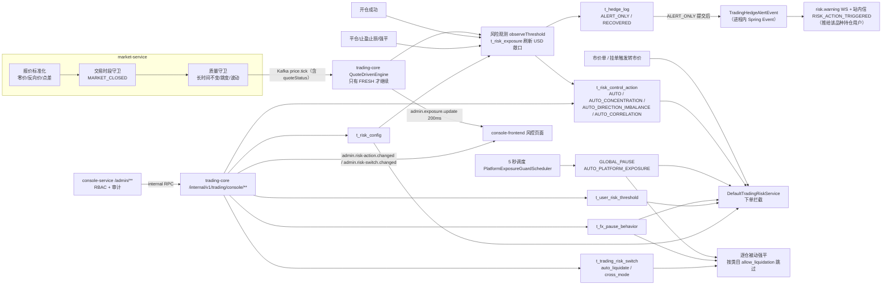
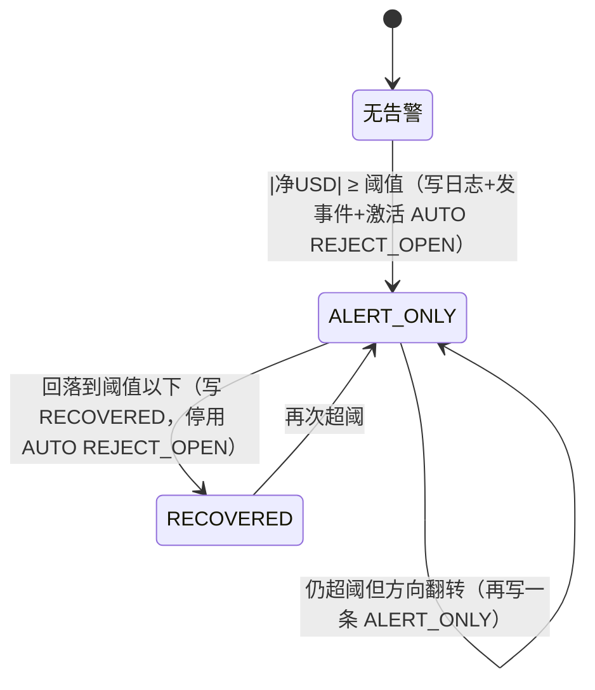
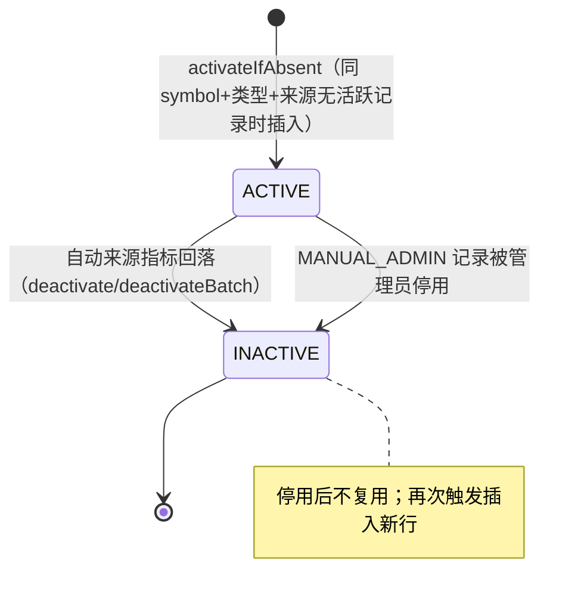

# FalconX 功能地图 · 风控（B-Book 风险观测、风控动作、行情质量守卫）

- 版本：v1（2026-10-07）
- 变更历史：v1（2026-10-07）首次创建
- 依据：fxsystem main `da65af9`；对照代码逐项核实（未运行构建和测试）
- 范围：
  - 覆盖：B-Book 净敞口观测（按 symbol、USD 归一化）、单品种对冲阈值、市场大类集中度、方向集中度、跨品种相关性组、用户级 USD 敞口阈值、平台总净敞口阈值与 `GLOBAL_PAUSE` 调度；四级风控动作模型与下单拦截点；风控开关；`t_risk_config` / `t_risk_market_config` / `t_fx_pause_behavior` 等配置；market-service 行情质量守卫；对冲观测日志与 `TradingHedgeAlertEvent`；管理端实时推送；管理端风控相关页面、接口、权限码和高危操作；`risk.warning` 与风控站内信的触发点。
  - 不覆盖：下单 / 平仓 / 挂单 / 强平主流程本身（见 03 分册，本册只写风控在其中的拦截点）；MarginLevel、StopOut、MarginCall 的计算和强平执行（见 03 分册，本册只写阈值配置）；通知模板内容和站内信投递（见 06 分册，本册只写触发）；杠杆档位 tier 配置（见 03 分册）。

## 一图看懂

这张图想说明：风控分两条线——"观测线"由开平仓和每个可成交行情 tick 驱动，算净敞口、写对冲观测日志、自动激活/停用风控动作；"拦截线"在下单时读风控动作、FX 暂停行为、用户阈值和 `t_risk_config` 决定是否拒单；管理端只通过 console-service 透传到 trading-core 修改这些表。

## 功能清单

| 编号 | 功能 | 使用者 | 状态 |
| --- | --- | --- | --- |
| R-01 | 品种净敞口计算与 USD 归一化（`t_risk_exposure`） | 系统 | 已实现 |
| R-02 | 单品种对冲阈值观测（`t_hedge_log`）与自动 `REJECT_OPEN` | 系统 | 已实现 |
| R-03 | 市场大类集中度（`t_risk_market_config`，`AUTO_CONCENTRATION`） | 系统 / 运营 | 已实现 |
| R-04 | 方向集中度（多/空 USD 失衡比，`AUTO_DIRECTION_IMBALANCE`） | 系统 / 运营 | 部分实现 |
| R-05 | 跨品种相关性组（`AUTO_CORRELATION`） | 系统 | 部分实现 |
| R-06 | 用户级 USD 敞口阈值（含盈利用户独立阈值） | 系统 / 运营 | 部分实现 |
| R-07 | 平台总净敞口阈值与 `GLOBAL_PAUSE` 5 秒调度 | 系统 / 运营 | 已实现（有推送缺陷） |
| R-08 | 四级风控动作模型（`t_risk_control_action`）与手工激活/停用 | 系统 / 运营 | 部分实现 |
| R-09 | 下单时的风控拦截点 | 客户 / 系统 | 已实现 |
| R-10 | FX 暂停行为（`t_fx_pause_behavior`） | 系统 / 运营 | 部分实现 |
| R-11 | 风控开关（`t_trading_risk_switch`） | 运营 | 部分实现 |
| R-12 | 品种风控参数 `t_risk_config` 与管理端 CRUD | 运营 | 已实现（语义需注意） |
| R-13 | 平台行：StopOut / MarginCall 阈值与冷静期配置 | 运营 | 已实现 |
| R-14 | 行情质量守卫（5 种状态、点差/跳变/波动规则） | 系统 | 已实现 |
| R-15 | 对冲观测事件 `TradingHedgeAlertEvent` 与 A-Book 对冲出口 | 系统 | 进程内事件已实现；A-Book 对冲 不做 |
| R-16 | `risk.warning` 推送与风控站内信触发 | 客户 | 部分实现 |
| R-17 | 管理端实时推送（`admin.exposure.update` / `admin.risk-action.changed` / `admin.risk-switch.changed`） | 运营 | 部分实现 |
| R-18 | 管理端：净敞口看板 | 运营 | 已实现 |
| R-19 | 管理端：风控开关页 | 运营 | 已实现 |
| R-20 | 管理端：风控动作页 | 运营 | 已实现 |
| R-21 | 管理端：风控配置页与市场集中度页 | 运营 | 已实现 |
| R-22 | 管理端：平台总敞口阈值页 | 运营 | 部分实现 |
| R-23 | 管理端：用户级阈值页 | 运营 | 已实现 |
| R-24 | 管理端：StopOut / MarginCall 阈值页 | 运营 | 已实现 |
| R-25 | 管理端：FX 暂停行为页 | 运营 | 已实现 |
| R-26 | 风控权限码、高危操作与审计 | 运营 / 安全 | 已实现 |

---

## R-01 品种净敞口计算与 USD 归一化

- **状态**：已实现。开仓、平仓、每个可成交行情 tick 都会更新 `t_risk_exposure`；`NETEXPOSURE-USD-NORMALIZATION`（2026-06-03）后 `net_exposure_usd` 乘以计价币到 USD 汇率。证据：`RiskExposureCalculator`、`MybatisTradingRiskExposureRepository`、`TradingRiskExposureMapper.xml`、`DefaultTradingRiskObservabilityService#resolveQcToUsdFxRate`。
- **使用者与入口**：无用户入口。触发方：
  - 开仓：`TradingOrderPlacementApplicationService` 成交后调 `TradingRiskObservabilityService.applyOpenPosition`。
  - 平仓（手动 / 止盈 / 止损 / 强平 / CROSS 账户级强平）：`TradingPositionCloseApplicationService` 调 `applyClosePosition`。
  - 行情：`QuoteDrivenEngine.processTick` 对每条可成交（`FRESH` 且交易时段开放）tick 调 `refreshExposureFromQuote`。
  - 查询：管理端净敞口看板（R-18）。
- **业务逻辑**：
  1. 数量口径：`net_exposure = total_long_qty - total_short_qty`（`RiskExposureCalculator.calculateNetExposure`，8 位小数 `RoundingMode.DOWN`）。平台视角：客户多头越多，平台作为对手方越"空"，这里记录的是客户侧净头寸。
  2. 开仓：BUY 走 `applyLongDelta`（`INSERT ... ON DUPLICATE KEY UPDATE total_long_qty += qty`），SELL 走 `applyShortDelta`；平仓：`reduceLongDelta` / `reduceShortDelta`，`WHERE total_xxx_qty >= qty`，影响行数不为 1 时抛 `IllegalStateException("Risk exposure not found or inconsistent")`。
  3. USD 口径（真值由 `refreshNetExposureUsd` 覆写）：`net_exposure_usd = net_exposure × 取价 × fx(QC→USD)`；取价规则：`net_exposure < 0` 用 `ask`，否则用 `bid`（`TradingPricingSupport.resolveExposureMarkPrice` 同口径）。
  4. fx 解析：QC 取 Redis `SymbolSpec.quoteCurrency`；QC=`USD` 时 fx=1；否则 `FxRateService.queryRate(QC, "USD")`。QC 缺失或汇率不可用时降级 fx=1，并打 `trading.risk.exposure.fx.degraded` 告警日志（即退回"计价币金额"口径，风控不停止判定）。
  5. 观测前置校验：`requireFreshQuote` 要求 quote 非空、bid/ask 非空且非 stale，否则抛 `IllegalStateException`。行情 tick 链路的异常只记日志 `trading.quote.tick.exposure-refresh.failed`，不影响 tick 其他处理。
  6. 并发：依赖单条 SQL 的原子累加；无显式锁。表无缓存，每次读写直达 MySQL。
  7. 写完敞口后继续进入 R-02 观测判定。
- **字段**：
  - 涉及的数据表（`t_risk_exposure`，trading-core owner，V3 建表 + V6 加列）：

    | 表.字段 | 类型 | 含义 | 约束/取值 |
    | --- | --- | --- | --- |
    | `t_risk_exposure.symbol` | VARCHAR(32) | 交易品种 | 主键 |
    | `t_risk_exposure.total_long_qty` | DECIMAL(24,8) | 全平台客户多头持仓量 | 默认 0 |
    | `t_risk_exposure.total_short_qty` | DECIMAL(24,8) | 全平台客户空头持仓量 | 默认 0 |
    | `t_risk_exposure.net_exposure` | DECIMAL(24,8) | 净敞口数量 = 多 - 空 | 默认 0 |
    | `t_risk_exposure.net_exposure_usd` | DECIMAL(24,8) | 净敞口 USD 值 | 默认 0；表注释仍写"= net_exposure * mark_price"，实际已乘 fx |
    | `t_risk_exposure.updated_at` | DATETIME(3) | 更新时间 | `ON UPDATE CURRENT_TIMESTAMP(3)` |
- **相关事件和定时任务**：消费 Kafka 行情 tick（经 `MarketPriceTickEventConsumer` → `QuoteDrivenEngine`）；写完后按 symbol 200ms 节流推 `admin.exposure.update`（见 R-17）。
- **证据**：`falconx-trading-core-service/src/main/java/com/falconx/trading/calculator/RiskExposureCalculator.java`、`.../service/impl/DefaultTradingRiskObservabilityService.java`、`.../repository/MybatisTradingRiskExposureRepository.java`、`.../resources/mapper/trading/TradingRiskExposureMapper.xml`、`.../engine/QuoteDrivenEngine.java`（约 316-341 行）、迁移 `V3__cfd_schema_enhancements.sql`、`V6__bbook_risk_observability.sql`。

## R-02 单品种对冲阈值观测与自动 REJECT_OPEN

- **状态**：已实现。证据：`TradingRiskObservabilityDecider`、`DefaultTradingRiskObservabilityService#observeThreshold`。
- **使用者与入口**：系统自动；阈值由管理端风控配置页（R-21）维护 `t_risk_config.hedge_threshold_usd`。
- **业务逻辑**：
  1. 前置条件（任一不满足直接返回，后续 R-03/R-04/R-05 也不会执行）：`t_risk_exposure` 有该 symbol 行；`t_risk_config` 有该 symbol 行且 `hedge_threshold_usd > 0`；能取到敞口取价。
  2. 计算 `netExposureUsd`（同 R-01 公式，含 fx）。
  3. 超阈判定：`net_exposure != 0` 且 `|netExposureUsd| >= hedge_threshold_usd`。
  4. 写 `t_hedge_log` 的时机（以该 symbol 最近一条日志为准，`ORDER BY created_at DESC, id DESC`）：
     - 超阈且（最近一条不是 `ALERT_ONLY`，或敞口方向与最近一条相反）→ 写 `ALERT_ONLY`，并在事务提交后发布 `TradingHedgeAlertEvent`（R-15）。
     - 超阈且最近一条已是同方向 `ALERT_ONLY` → 不写日志（去重）。
     - 未超阈且最近一条是 `ALERT_ONLY` → 写 `RECOVERED`。
     - 其他 → 不写。
  5. 风控动作（与日志去重无关，每次都评估）：超阈 → `activateIfAbsent(symbol, REJECT_OPEN, "AUTO", "HEDGE_THRESHOLD_EXCEEDED netExposureUsd=...", hedgeLogId)`；未超阈 → `deactivate(symbol, REJECT_OPEN, "AUTO")`。
  6. 依次调用 R-03 集中度、R-04 方向集中度、R-05 相关性组检查。
  7. 默认阈值（V6 seed）：BTCUSDT 100,000；ETHUSDT 50,000；EURUSD 1,000,000；XAUUSD 200,000（USD）。V2/V15 之外没有其他 `t_risk_config` seed，因此全新库只有这 4 个品种会被观测（其余品种只累计 `t_risk_exposure`，不触发阈值）。
- **字段**：
  - 涉及的数据表（`t_hedge_log`，V6）：

    | 表.字段 | 类型 | 含义 | 约束/取值 |
    | --- | --- | --- | --- |
    | `t_hedge_log.id` | BIGINT | 主键（雪花 ID） | PK |
    | `t_hedge_log.symbol` | VARCHAR(32) | 品种 | NOT NULL |
    | `t_hedge_log.position_id` | BIGINT | 触发本次观测的持仓 ID | 行情刷新时为 NULL |
    | `t_hedge_log.trigger_source` | TINYINT | 触发来源 | 1=OPEN_POSITION，2=MANUAL_CLOSE，3=TAKE_PROFIT，4=STOP_LOSS，5=LIQUIDATION（含 CROSS_STOP_OUT），6=PRICE_TICK |
    | `t_hedge_log.action_status` | TINYINT | 状态 | 1=ALERT_ONLY，2=RECOVERED |
    | `t_hedge_log.net_exposure` | DECIMAL(24,8) | 当时净敞口数量 | |
    | `t_hedge_log.net_exposure_usd` | DECIMAL(24,8) | 当时净 USD 敞口（已含 fx；2026-06-03 前历史行未回溯） | |
    | `t_hedge_log.hedge_threshold_usd` | DECIMAL(24,8) | 当时阈值 | |
    | `t_hedge_log.mark_price` | DECIMAL(24,8) | 估值取价 | |
    | `t_hedge_log.price_ts` | DATETIME(3) | 行情时间 | 可空 |
    | `t_hedge_log.price_source` | VARCHAR(32) | 行情来源 | 可空 |
    | `t_hedge_log.created_at` | DATETIME(3) | 创建时间 | 索引 `idx_symbol_created`、`idx_symbol_status_created`、`idx_position_id` |
  - 枚举 `TradingHedgeLogStatus`：`ALERT_ONLY`（超阈，仅告警，未做任何真实对冲）、`RECOVERED`（回落到阈值内）。
- **状态机**：

- **错误码**：无对外错误码；内部异常仅记日志。
- **相关事件和定时任务**：Spring Event `TradingHedgeAlertEvent`（afterCommit 发布）；日志键 `trading.risk.hedge.alert`、`trading.risk.hedge.recovered`、`trading.risk.control.activated`。
- **证据**：`.../service/impl/TradingRiskObservabilityDecider.java`、`.../service/impl/DefaultTradingRiskObservabilityService.java`（176-266 行）、`.../resources/mapper/trading/TradingHedgeLogMapper.xml`、`.../repository/TradingMybatisSupport.java`（枚举编码）、`V6__bbook_risk_observability.sql`。

## R-03 市场大类集中度

- **状态**：已实现。证据：`DefaultTradingRiskObservabilityService#checkConcentration`、`TradingRiskExposureMapper.xml#sumAbsNetExposureUsdByMarketCode`。
- **使用者与入口**：系统自动；阈值由管理端"市场集中度"页（R-21）维护。
- **业务逻辑**：
  1. 只在 R-02 前置条件满足后执行，取当前 symbol 的 `t_risk_config.market_code`；为空则跳过。
  2. 读 `t_risk_market_config`，不存在或 `is_enabled=0` 则跳过。
  3. `totalUsd = Σ |t_risk_exposure.net_exposure_usd|`，范围是 `t_risk_config.market_code = 该 marketCode` 的所有 symbol（INNER JOIN，没有 `t_risk_config` 行的品种不计入）。
  4. `totalUsd >= concentration_threshold_usd` → 对该大类下所有 symbol 逐个 `activateIfAbsent(sym, REJECT_OPEN, "AUTO_CONCENTRATION", "MARKET_CONCENTRATION_EXCEEDED ...")`；否则批量 `deactivateBatch`。
  5. 默认阈值（V9 seed）：CRYPTO 500,000；FX 5,000,000；COMMODITY 1,000,000（USD），均启用。`market_code` seed 只有 BTCUSDT/ETHUSDT=CRYPTO、EURUSD=FX、XAUUSD=COMMODITY。
- **字段**：
  - 涉及的数据表（`t_risk_market_config`，V9）：

    | 表.字段 | 类型 | 含义 | 约束/取值 |
    | --- | --- | --- | --- |
    | `t_risk_market_config.market_code` | VARCHAR(20) | 品种大类 | PK；FX / CRYPTO / COMMODITY |
    | `t_risk_market_config.concentration_threshold_usd` | DECIMAL(24,8) | 同大类净敞口绝对值合计阈值（USD） | NOT NULL；管理端写入要求 ≥ 0 |
    | `t_risk_market_config.is_enabled` | TINYINT(1) | 是否启用 | 默认 1 |
    | `t_risk_market_config.created_at` / `updated_at` | DATETIME(3) | 时间戳 | |
  - 管理端接口字段见 R-21。
- **证据**：`.../service/impl/DefaultTradingRiskObservabilityService.java`（401-435 行）、`V9__bbook_risk_control.sql`。

## R-04 方向集中度（多/空 USD 失衡比）

- **状态**：部分实现。判定逻辑与写接口已接通；缺：(1) 管理端没有页面（`riskApi.updateDirectionImbalance` 无调用方）；(2) 读接口 `AdminRiskConfigListResponse.Item` 不返回两个方向集中度字段，运营无法查看当前值；(3) 计算未乘 fx，非 USD 计价品种比较的是计价币金额（比例本身不受影响，但 `direction_imbalance_min_total_usd` 门槛受影响）；(4) 无 seed，默认两列为 NULL，即默认关闭。
- **使用者与入口**：接口 `POST /admin/risk-config/{symbol}/direction-imbalance`（console-service，权限 `risk-config:update`，高危）→ trading-core `POST /internal/v1/trading/console/risk-config/{symbol}/direction-imbalance`。
- **业务逻辑**：
  1. `ratioThreshold = t_risk_config.direction_imbalance_ratio_threshold`；为 NULL 或 ≤0 则跳过。
  2. `longUsd = |total_long_qty| × 取价`，`shortUsd = |total_short_qty| × 取价`（取价同 R-01，未乘 fx），`totalUsd = longUsd + shortUsd`。
  3. 若 `direction_imbalance_min_total_usd` 非空且 `totalUsd < minTotalUsd` → 停用本来源动作后返回（小盘不触发）。
  4. `maxRatio = max(longUsd/totalUsd, shortUsd/totalUsd)`（6 位小数 HALF_UP）；`maxRatio >= ratioThreshold` → `activateIfAbsent(symbol, REJECT_OPEN, "AUTO_DIRECTION_IMBALANCE", "DIRECTION_IMBALANCE longUsd=... shortUsd=... ratio=...")`；否则停用。
  5. 写接口：trading-core 直接 `UPDATE t_risk_config SET direction_imbalance_ratio_threshold, direction_imbalance_min_total_usd WHERE symbol=?`；symbol 不存在时影响 0 行但仍返回成功（只记日志）。
- **字段**：
  - 请求字段：

    | 字段 | 类型 | 必填 | 含义 | 约束/取值 |
    | --- | --- | --- | --- | --- |
    | `ratioThreshold` | BigDecimal | 否 | 任一侧占比阈值 | `@DecimalMin(0.0) @DecimalMax(1.0)`；null = 停用 |
    | `minTotalUsd` | BigDecimal | 否 | 最小触发总额（USD） | 无校验 |
    | `reason` | String | console 必填 | 审计原因 | console `verifyReason` 非空，否则 `90810` |
  - 响应：`data = null`。
  - 涉及字段：`t_risk_config.direction_imbalance_ratio_threshold DECIMAL(8,4)`、`t_risk_config.direction_imbalance_min_total_usd DECIMAL(24,8)`（见 R-12 全表）。
- **错误码**：`90810` reason 为空；Bean Validation 越界由 trading-core 返回通用参数错误（console 未做专门翻译，未验证具体码）。
- **证据**：`.../service/impl/DefaultTradingRiskObservabilityService.java`（354-395 行）、`.../application/TradingBBookRiskControlAdminApplicationService.java`、`.../controller/AdminInternalTradingRiskController.java`、`falconx-console-service/.../controller/AdminRiskController.java`、`falconx-console-frontend/src/features/risk/riskApi.ts`、`V15__bbook_risk_control_full.sql`。

## R-05 跨品种相关性组

- **状态**：部分实现。评估器已接入（每次 R-02 观测后执行）；缺：管理端 CRUD 接口和页面（文档明确"V2 一期不做"），阈值和成员只能改库；超阈只激活风控动作，不写 `t_hedge_log`、不发 `TradingHedgeAlertEvent`、不发通知。
- **使用者与入口**：无管理入口；数据来自 V20 seed。
- **业务逻辑**：
  1. 查当前 symbol 所属的所有 `enabled=1` 组（一个 symbol 可属多组，如 EURJPY 同属 EUR_GROUP、JPY_GROUP）。
  2. 每组：`totalWeightedUsd = Σ |成员.net_exposure_usd| × weight`（成员没有 `t_risk_exposure` 行则跳过；weight 为 null 视为 1）。
  3. `threshold_usd` ≤0 跳过；`totalWeightedUsd >= threshold_usd` → 对组内全部成员 `activateIfAbsent(member, REJECT_OPEN, "AUTO_CORRELATION", "CORRELATION_GROUP_EXCEEDED groupCode=...")`；否则对全部成员 `deactivateBatch(..., "AUTO_CORRELATION")`。
  4. 注意：同一 symbol 属多组时，各组按顺序激活/停用同一个 `(symbol, REJECT_OPEN, AUTO_CORRELATION)` 记录，后评估的组未超阈会把前一组刚激活的记录停用（代码按组顺序逐个处理，未合并判断）。
  5. 只有被 R-02 观测到的 symbol（有 `t_risk_config` 且阈值 > 0）的事件才会触发本检查；组内其他成员的行情 tick 不触发。
  6. Seed（V20）：

     | group_code | group_name | threshold_usd | 成员（weight） |
     | --- | --- | --- | --- |
     | `EUR_GROUP` | 欧元组合 | 3,000,000 | EURUSD/EURGBP/EURJPY/EURAUD/EURCHF/EURCAD/EURNZD（各 1.0） |
     | `JPY_GROUP` | 日元组合 | 3,000,000 | USDJPY/EURJPY/GBPJPY/AUDJPY/CHFJPY/CADJPY/NZDJPY（各 1.0） |
     | `METAL_GROUP` | 贵金属组合 | 1,000,000 | XAUUSD/XAGUSD/XPTUSD/XPDUSD/GAUUSD（1.0），IAU.NYS（0.5） |
     | `CRYPTO_MAJOR_GROUP` | 主流加密货币组合 | 500,000 | BTCUSD/BTCUSDT/ETHUSD/ETHUSDT（1.0），SOLUSD（0.8），XRPUSD（0.6） |
- **字段**：
  - 涉及的数据表：

    | 表.字段 | 类型 | 含义 | 约束/取值 |
    | --- | --- | --- | --- |
    | `t_symbol_correlation_group.group_code` | VARCHAR(32) | 组编码 | PK |
    | `t_symbol_correlation_group.group_name` | VARCHAR(64) | 组中文名 | NOT NULL |
    | `t_symbol_correlation_group.threshold_usd` | DECIMAL(24,8) | 加权组合敞口阈值（USD） | NOT NULL |
    | `t_symbol_correlation_group.enabled` | TINYINT(1) | 是否启用 | 默认 1 |
    | `t_symbol_correlation_group.created_at` / `updated_at` | DATETIME(3) | 时间戳 | |
    | `t_symbol_correlation_member.group_code` | VARCHAR(32) | 组编码 | 联合 PK |
    | `t_symbol_correlation_member.symbol` | VARCHAR(32) | 成员品种 | 联合 PK；索引 `idx_symbol` |
    | `t_symbol_correlation_member.weight` | DECIMAL(6,4) | 权重 | 默认 1.0000 |
    | `t_symbol_correlation_member.created_at` | DATETIME(3) | 创建时间 | |
- **证据**：`.../service/impl/DefaultTradingRiskObservabilityService.java`（284-345 行）、`.../repository/MybatisTradingSymbolCorrelationGroupRepository.java`、`.../resources/mapper/trading/TradingSymbolCorrelationGroupMapper.xml`、`V20__symbol_correlation_group.sql`、`docs/api/管理端接口规范.md` §13.5。

## R-06 用户级 USD 敞口阈值（含盈利用户独立阈值）

- **状态**：部分实现。下单拦截、管理端增删改查均已接通；缺/偏差：(1) 计算未乘 fx（`|qty| × 取价` 是计价币金额），非 USD 计价品种（如 JPY 系）会按汇率倍数高估；(2) 实际计算的是该用户全部持仓的**总名义金额**（绝对值相加），不是"净"敞口，与字段名 `net_exposure_threshold_usd` 不符；(3) "盈利用户"只能由管理员手工勾选，没有自动识别逻辑；(4) 只在开仓时拦截，已有持仓超阈不会触发任何动作。
- **使用者与入口**：
  - 拦截：客户下市价单 / 挂单触发转市价时（R-09）。
  - 管理端页面 `/admin/risk/user-thresholds`（R-23）。
  - 接口（console-service → trading-core）：
    - `GET /admin/user-risk-thresholds?userId=&page=&size=`，权限 `risk-config:view` → `GET /internal/v1/trading/console/user-risk-thresholds`
    - `POST /admin/user-risk-thresholds`，权限 `risk-config:update`（高危）→ `POST /internal/v1/trading/console/user-risk-thresholds`（UPSERT）
    - `DELETE /admin/user-risk-thresholds/{userId}`，权限 `risk-config:update`（高危）→ `DELETE /internal/v1/trading/console/user-risk-thresholds/{userId}`
- **业务逻辑**：
  1. 无 `t_user_risk_threshold` 行 → 不限。
  2. `effectiveThreshold = is_profitable_user ? profitable_net_exposure_threshold_usd : net_exposure_threshold_usd`；为 NULL 或 ≤0 → 不限。
  3. `current = Σ |position.quantity| × 取价`，范围为该用户全部 OPEN 持仓；取价：BUY 仓用 bid、SELL 仓用 ask（`resolvePositionMarkPrice(quote, side)`，不含组加点）；本单 symbol 用本次 quote，其他 symbol 一次 pipeline 批量读 Redis 快照（`findBySymbols`），取不到行情的持仓跳过不计。
  4. `incoming = 本单 quantity × (BUY ? ask : bid)`（不含组加点）。
  5. `current + incoming > effectiveThreshold` → 拒单 `BBOOK_RISK_USER_EXPOSURE_LIMIT`。
  6. 管理端 UPSERT：`INSERT ... ON DUPLICATE KEY UPDATE` 全字段覆盖；`updated_by` = 管理员 ID 字符串，`updated_reason` = reason。删除直接 `DELETE`，不存在也返回成功。
  7. 无缓存，每次下单读库。
- **字段**：
  - 请求字段（POST）：

    | 字段 | 类型 | 必填 | 含义 | 约束/取值 |
    | --- | --- | --- | --- | --- |
    | `userId` | Long | 是 | 客户 ID | `@NotNull` |
    | `netExposureThresholdUsd` | BigDecimal | 否 | 普通阈值（USD） | null = 不限；无范围校验 |
    | `profitableNetExposureThresholdUsd` | BigDecimal | 否 | 盈利用户阈值（USD） | null = 不限；仅 `profitableUser=true` 时生效 |
    | `profitableUser` | boolean | 否 | 是否标记为盈利用户 | 默认 false |
    | `reason` | String | console 必填 | 审计原因 | 空 → `90810` |
  - 响应字段（`AdminUserRiskThresholdItem`，列表为 `items/total/page/size`）：

    | 字段 | 类型 | 含义 |
    | --- | --- | --- |
    | `userId` | Long | 客户 ID |
    | `netExposureThresholdUsd` | BigDecimal | 普通阈值 |
    | `profitableNetExposureThresholdUsd` | BigDecimal | 盈利用户阈值 |
    | `profitableUser` | boolean | 盈利用户标记 |
    | `updatedBy` | String | 最近修改的管理员 ID |
    | `updatedReason` | String | 修改原因 |
    | `updatedAt` | LocalDateTime | 更新时间 |
  - 涉及的数据表（`t_user_risk_threshold`，V15）：

    | 表.字段 | 类型 | 含义 | 约束/取值 |
    | --- | --- | --- | --- |
    | `t_user_risk_threshold.user_id` | BIGINT | 客户 ID（identity `t_user.id`） | PK |
    | `t_user_risk_threshold.net_exposure_threshold_usd` | DECIMAL(24,8) | 普通阈值 | 可空 |
    | `t_user_risk_threshold.profitable_net_exposure_threshold_usd` | DECIMAL(24,8) | 盈利用户阈值 | 可空 |
    | `t_user_risk_threshold.is_profitable_user` | TINYINT(1) | 盈利用户标记 | 默认 0 |
    | `t_user_risk_threshold.updated_by` | VARCHAR(64) | 最近修改管理员 | 可空 |
    | `t_user_risk_threshold.updated_reason` | VARCHAR(200) | 修改原因 | 可空 |
    | `t_user_risk_threshold.created_at` / `updated_at` | DATETIME(3) | 时间戳 | |
- **错误码**：拒单时 HTTP 业务码为 `40002`（"Order Rejected"），`rejectionReason=BBOOK_RISK_USER_EXPOSURE_LIMIT`；`TradingErrorCode` 定义的 `30010` 未被下单接口使用。管理端 `90810`。
- **证据**：`.../service/impl/DefaultTradingRiskService.java`（355-402 行）、`.../application/TradingBBookRiskControlAdminApplicationService.java`、`.../resources/mapper/trading/TradingUserRiskThresholdMapper.xml`、`.../controller/TradingOrderController.java`（82-140 行）、`V15__bbook_risk_control_full.sql`。

## R-07 平台总净敞口阈值与 GLOBAL_PAUSE 5 秒调度

- **状态**：已实现，有一处推送缺陷（见业务逻辑 5）。证据：`PlatformExposureGuardScheduler`。
- **使用者与入口**：系统定时任务；阈值由管理端"平台总敞口"页（R-22）写入：`POST /admin/risk-config/platform`（权限 `risk-config:update`，高危）→ `POST /internal/v1/trading/console/risk-config/platform`。
- **业务逻辑**：
  1. 调度：`@Scheduled(fixedDelayString = "${falconx.trading.platform-exposure-guard.interval-ms:5000}")`，默认每 5 秒（上次结束后延迟）；开关 `falconx.trading.platform-exposure-guard.enabled`（缺省 true）。每次生成新 traceId。
  2. 读平台行：`t_risk_config WHERE symbol IS NULL LIMIT 1`（V15 插入 `id=0`，默认 `hedge_threshold_usd = 10,000,000`）；无行或阈值 ≤0 跳过。
  3. `totalUsd = Σ |t_risk_exposure.net_exposure_usd|`（全部 symbol，含无 `t_risk_config` 的品种）。
  4. `totalUsd >= 阈值` → `activateIfAbsent(null, GLOBAL_PAUSE, "AUTO_PLATFORM_EXPOSURE", "PLATFORM_EXPOSURE_EXCEEDED totalUsd=... threshold=...")`；新插入成功时推 `admin.risk-action.changed`（active=true，actionId=null 的合成对象）。
  5. 未超阈 → 先读 `wasActive = hasActiveGlobalPause()`（只看"是否存在任一来源的活跃全局暂停"），再停用 `AUTO_PLATFORM_EXPOSURE` 来源的记录；`wasActive` 为真则推 `admin.risk-action.changed`（active=false）。缺陷：若管理员手工激活了 `GLOBAL_PAUSE`（`MANUAL_ADMIN`）且平台敞口未超阈，`wasActive` 每次都为真，调度器每 5 秒都会推一条"已恢复"的假事件，并打 `trading.risk.platform-exposure.deactivated` 日志。
  6. 写阈值：`UPDATE t_risk_config SET hedge_threshold_usd=? WHERE symbol IS NULL`，下一个调度周期生效。
  7. 激活后的效果见 R-08（`GLOBAL_PAUSE`）和 R-10（按类目放行）：不是"拒所有开仓"。
- **字段**：
  - 请求字段：

    | 字段 | 类型 | 必填 | 含义 | 约束/取值 |
    | --- | --- | --- | --- | --- |
    | `hedgeThresholdUsd` | BigDecimal | 是 | 平台总净敞口阈值（USD） | `@NotNull @Positive` |
    | `reason` | String | console 必填 | 审计原因 | 空 → `90810` |
  - 响应：`data = null`。没有读接口：平台行不在任何读接口里单独返回（会混在 `GET /admin/risk-configs` 列表中，symbol 为 null，见"未验证事项"）。
- **相关事件和定时任务**：`@Scheduled` 5s；WS `admin.risk-action.changed`。
- **证据**：`.../application/PlatformExposureGuardScheduler.java`、`.../resources/mapper/trading/TradingRiskConfigMapper.xml`（`selectPlatformRow`、`updatePlatformHedgeThreshold`）、`TradingRiskExposureMapper.xml#sumAbsNetExposureUsdAllSymbols`、`V15__bbook_risk_control_full.sql`。

## R-08 四级风控动作模型与手工激活/停用

- **状态**：部分实现。动作表、自动/手工激活、停用、查询都已接通；缺：四级动作在执行效果上只区分"开仓是否被拒"——`REDUCE_ONLY` 与 `REJECT_OPEN` 实际效果完全相同；`SUSPEND_SYMBOL` 只拒开仓、不拒平仓；`GLOBAL_PAUSE` 不是"禁止所有交易"，而是按类目决定是否拒开仓（R-10）。平仓、止盈止损、挂单创建均不读风控动作。
- **使用者与入口**：
  - 自动：R-02 / R-03 / R-04 / R-05 / R-07。
  - 管理端页面 `/admin/risk/actions`（R-20）。
  - 接口（console → trading-core 前缀 `/internal/v1/trading/console`）：
    - `GET /admin/risk-actions?symbol=&actionType=&triggerSource=&isActive=&page=&size=`，权限 `risk-action:view`
    - `POST /admin/risk-actions`，权限 `risk-action:activate`（高危）
    - `POST /admin/risk-actions/{id}/deactivate`，权限 `risk-action:activate`（高危）
- **业务逻辑**：
  1. 四级动作（`TradingRiskControlActionType`，`action_type` 1-4，数值越大越严重）及**代码实际效果**：

     | 级别 | 名称 | 设计含义（代码注释） | 实际效果（下单时） | 拒单原因 → HTTP 业务码 |
     | --- | --- | --- | --- | --- |
     | 1 | `REJECT_OPEN` | 禁止该品种新开仓 | 拒该品种开仓 | `BBOOK_RISK_OPEN_REJECTED` → `40002` |
     | 2 | `REDUCE_ONLY` | 只允许减仓 | 拒该品种开仓（与 1 相同） | `BBOOK_RISK_REDUCE_ONLY` → `40002` |
     | 3 | `SUSPEND_SYMBOL` | 品种全停，开平都拒 | 只拒该品种开仓；平仓不拦 | `SYMBOL_TRADING_SUSPENDED` → `40008` |
     | 4 | `GLOBAL_PAUSE` | 全局暂停所有交易 | `symbol IS NULL` 时：按 `t_fx_pause_behavior` 类目决定是否拒开仓、是否跳过逐仓被动强平、是否拒逐仓追加保证金（R-10）；若有人给具体 symbol 挂了 `GLOBAL_PAUSE`（手工接口会强制置 null，正常不会发生），按品种级拒开仓 | 类目禁开仓 `GLOBAL_PAUSE_ACTIVE` → `30087`；降级一刀切 `BBOOK_RISK_GLOBAL_PAUSE` → `40002` |
  2. 判定顺序：先查 `countActiveGlobalPause`（`symbol IS NULL AND action_type=4 AND is_active=1`）；若因类目拒绝则返回；否则查该 symbol 的最高级活跃动作（`ORDER BY action_type DESC LIMIT 1`）。
  3. 触发来源 `trigger_source`（字符串）：

     | 取值 | 含义 | 产生方 |
     | --- | --- | --- |
     | `AUTO` | 单品种对冲阈值超标 | R-02 |
     | `AUTO_CONCENTRATION` | 市场大类集中度超标 | R-03 |
     | `AUTO_DIRECTION_IMBALANCE` | 方向失衡超标 | R-04 |
     | `AUTO_CORRELATION` | 相关性组超标 | R-05 |
     | `AUTO_PLATFORM_EXPOSURE` | 平台总敞口超标（GLOBAL_PAUSE） | R-07 |
     | `MANUAL_ADMIN` | 管理员手工激活 | R-08 管理接口 |
     | `MANUAL` | 迁移注释里的历史取值，当前代码不会写入 | 无 |
  4. 幂等：`INSERT ... SELECT ... WHERE NOT EXISTS (symbol <=> ? AND action_type=? AND trigger_source=? AND is_active=1)`，NULL 安全比较。同一 symbol 可同时存在多条不同来源的活跃 `REJECT_OPEN`，各来源独立激活/停用、互不覆盖。没有唯一索引兜底（并发下是否可能插入重复活跃行未验证）。
  5. 自动停用：各自动来源在判定"未超阈"时按 `(symbol, action_type, trigger_source)` 批量置 `is_active=0`。自动来源的记录**不能**手工停用，只能等指标回落。
  6. 手工激活：`actionType=GLOBAL_PAUSE` 时 trading-core 强制 `symbol=null`；console 在 symbol 非空时先调 market-service `GET /internal/v1/market/symbols/quote-mappings?platformSymbolLike=` 校验平台品种存在（不存在 → `ADMIN_SYMBOL_MAPPING_NOT_FOUND`）；console 把 null symbol 转成空串传给 trading-core。已存在同 symbol+类型+`MANUAL_ADMIN` 活跃记录 → `90800`。返回体是内存构造对象，`id`、`createdAt`、`updatedAt` 均为 null。
  7. 手工停用：记录不存在 → `90801`；`trigger_source != MANUAL_ADMIN` → `90802`；`UPDATE ... WHERE id=? AND is_active=1 AND trigger_source='MANUAL_ADMIN'` 影响 0 行（已停用）→ `90801`。
  8. 实时推送：只有手工激活/停用和平台调度（R-07）会推 `admin.risk-action.changed`；R-02~R-05 的自动激活/停用不推送（管理端风控动作页不会自动刷新）。
  9. 查询：trading-core 支持 `fromCreatedAt` / `toCreatedAt` 时间窗，console 未透传这两个参数；分页 `page≥1`，`size` 限制在 1-100；排序 `created_at DESC, id DESC`。无缓存，下单每次读库。
- **字段**：
  - 请求字段（激活）：

    | 字段 | 类型 | 必填 | 含义 | 约束/取值 |
    | --- | --- | --- | --- | --- |
    | `symbol` | String | 否 | 品种；空 = 全局 | `GLOBAL_PAUSE` 时被置空 |
    | `actionType` | String | 是 | 动作类型 | `REJECT_OPEN` / `REDUCE_ONLY` / `SUSPEND_SYMBOL` / `GLOBAL_PAUSE`；非法值走 `valueOf` 异常（具体错误码未验证） |
    | `reason` | String | 是 | 原因 | `@NotBlank @Size(max=200)`；写入 `trigger_reason` |
  - 请求字段（停用）：`reason`（String，必填，`@NotBlank @Size(max=200)`，只用于审计，不落 `t_risk_control_action`）。
  - 响应字段（列表 `items/total/page/size`，单条同 Item）：

    | 字段 | 类型 | 含义 |
    | --- | --- | --- |
    | `id` | Long | 主键 |
    | `symbol` | String | 品种；null = 全局 |
    | `actionType` | String | 动作类型 |
    | `triggerSource` | String | 触发来源 |
    | `triggerReason` | String | 触发原因 |
    | `hedgeLogId` | Long | 关联 `t_hedge_log.id`（仅 `AUTO` 来源填写） |
    | `isActive` | boolean | 是否生效 |
    | `createdAt` / `updatedAt` | LocalDateTime | 时间 |
  - 涉及的数据表（`t_risk_control_action`，V9）：

    | 表.字段 | 类型 | 含义 | 约束/取值 |
    | --- | --- | --- | --- |
    | `t_risk_control_action.id` | BIGINT | 主键（雪花 ID） | PK |
    | `t_risk_control_action.symbol` | VARCHAR(32) | 品种；NULL = 全局 | 可空 |
    | `t_risk_control_action.action_type` | TINYINT | 动作 | 1=REJECT_OPEN，2=REDUCE_ONLY，3=SUSPEND_SYMBOL，4=GLOBAL_PAUSE |
    | `t_risk_control_action.is_active` | TINYINT(1) | 是否生效 | 默认 1 |
    | `t_risk_control_action.trigger_source` | VARCHAR(50) | 触发来源 | 见上表 |
    | `t_risk_control_action.trigger_reason` | VARCHAR(200) | 原因 | 可空 |
    | `t_risk_control_action.hedge_log_id` | BIGINT | 关联对冲日志 | 可空 |
    | `t_risk_control_action.created_at` / `updated_at` | DATETIME(3) | 时间戳 | 索引 `idx_symbol_active(symbol,is_active)`、`idx_active(is_active)` |
- **状态机**：

- **错误码**：

  | 错误码 | 含义 | 触发条件 |
  | --- | --- | --- |
  | `90800` | ADMIN_RISK_ACTION_ALREADY_ACTIVE | 同 symbol+类型+`MANUAL_ADMIN` 已有活跃记录 |
  | `90801` | ADMIN_RISK_ACTION_NOT_FOUND | 停用时 id 不存在或已停用 |
  | `90802` | ADMIN_RISK_ACTION_NOT_DEACTIVATABLE | 停用非 `MANUAL_ADMIN` 记录 |
  | `90810` | ADMIN_RISK_REASON_REQUIRED | console 侧 reason 为空 |
- **相关事件和定时任务**：WS `admin.risk-action.changed`（R-17）。
- **证据**：`.../entity/TradingRiskControlActionType.java`、`.../repository/MybatisTradingRiskControlActionRepository.java`、`.../resources/mapper/trading/TradingRiskControlActionMapper.xml`、`.../application/TradingRiskAdminApplicationService.java`、`.../controller/AdminInternalTradingRiskController.java`、`falconx-console-service/.../risk/AdminRiskApplicationService.java`、`.../controller/AdminRiskController.java`、`V9__bbook_risk_control.sql`。

## R-09 下单时的风控拦截点

- **状态**：已实现。下单主流程见 03 分册；这里只列 `DefaultTradingRiskService.evaluateMarketOrder` 中与风控相关的检查，按执行顺序（命中即返回）。
- **使用者与入口**：客户市价单 `POST`（见 03 分册，`TradingOrderController`）；挂单触发时 `TradingPendingOrderApplicationService.triggerOpening` 也调用同一 `placeMarketOrder`，被拒则挂单标记 `REJECTED` 并释放冻结。挂单**创建**时不检查风控动作（只检查 `pending_order_min_distance_ratio`，见 03 分册）。
- **业务逻辑**（风控相关项，按顺序）：
  1. 品种是否受支持（Redis 交易时间快照）→ `SYMBOL_NOT_SUPPORTED`；是否在可开仓时段 → `SYMBOL_TRADING_SUSPENDED`（40008）。
  2. 行情质量：quote 为空或 `NO_QUOTE` → `MARKET_QUOTE_NOT_FOUND`；非 `FRESH`（STALE/MARKET_CLOSED/ABNORMAL）→ `MARKET_QUOTE_STALE`；bid/ask/mark 任一为空 → `MARKET_QUOTE_NOT_FOUND`（R-14）。
  3. CROSS 模式需 `cross_mode.enabled` 开关为真，否则 `CROSS_MODE_NOT_ENABLED`（30088）（R-11）。
  4. 杠杆上限 `min(SymbolSpec.maxLeverage, t_risk_config.max_leverage)` → `LEVERAGE_EXCEEDED`。
  5. 风控动作 + FX 暂停类目（R-08、R-10）。
  6. 用户级 USD 敞口阈值（R-06）→ `BBOOK_RISK_USER_EXPOSURE_LIMIT`。
  7. （保证金、手续费、余额校验，见 03 分册）
  8. 持仓数量上限（R-12）：该用户该品种 OPEN 持仓**笔数** ≥ `max_position_per_user` → `POSITION_LIMIT_REACHED`（30005）；平台该品种 OPEN 持仓**笔数** ≥ `max_position_total` → `PLATFORM_POSITION_LIMIT_REACHED`（30006）；限额为 NULL 或 ≤0 不限。
  9. 杠杆档位与强平距离守卫（`LEVERAGE_EXCEEDS_TIER` 30070、`LIQUIDATION_DISTANCE_TOO_CLOSE` 30071：强平价距离 ≤ 点差×2 拒单），见 03 分册。
- **错误码**（拒单原因 → 下单接口返回的业务码；未单独映射的原因统一返回 `40002 Order Rejected`，具体原因在响应体 `rejectionReason`）：

  | rejectionReason | 业务码 | 触发条件 |
  | --- | --- | --- |
  | `BBOOK_RISK_OPEN_REJECTED` | `40002`（`TradingErrorCode` 定义 30007 但未使用） | 品种最高级动作为 `REJECT_OPEN` |
  | `BBOOK_RISK_REDUCE_ONLY` | `40002`（定义 30008 未使用） | 最高级为 `REDUCE_ONLY` |
  | `SYMBOL_TRADING_SUSPENDED` | `40008` | 最高级为 `SUSPEND_SYMBOL`，或非交易时段 |
  | `BBOOK_RISK_GLOBAL_PAUSE` | `40002`（定义 30009 未使用） | 全局暂停下类目信息缺失降级一刀切，或品种挂了 GLOBAL_PAUSE |
  | `GLOBAL_PAUSE_ACTIVE` | `30087` | 全局暂停且类目 `allow_open=0` |
  | `BBOOK_RISK_USER_EXPOSURE_LIMIT` | `40002`（定义 30010 未使用） | 用户阈值超限 |
  | `POSITION_LIMIT_REACHED` | `30005` | 用户该品种持仓笔数达上限 |
  | `PLATFORM_POSITION_LIMIT_REACHED` | `30006` | 平台该品种持仓笔数达上限 |
  | `MARKET_QUOTE_STALE` | `PRICE_SOURCE_STALE_OR_DISCONNECTED` 对应码（未逐一核对数值） | 行情非 FRESH |
  | `MARKET_QUOTE_NOT_FOUND` | `QUOTE_NOT_AVAILABLE` 对应码（未逐一核对数值） | 无行情 / NO_QUOTE |
  | `CROSS_MODE_NOT_ENABLED` | `30088` | CROSS 开关关闭 |
- **证据**：`.../service/impl/DefaultTradingRiskService.java`（124-346、404-489 行）、`.../controller/TradingOrderController.java`、`.../error/TradingErrorCode.java`、`.../application/TradingPendingOrderApplicationService.java`（约 335-380 行）。

## R-10 FX 暂停行为（t_fx_pause_behavior）

- **状态**：部分实现。按类目控制"全局暂停期间能否开仓 / 能否被动强平 / 能否追加保证金"已接通；缺：(1) 没有独立的 `FX_PAUSED` 状态或自动触发——行为表只在存在活跃 `GLOBAL_PAUSE`（平台总敞口超阈或管理员手工）时生效；market-service 的 `falconx.market.fx.pause-threshold-seconds`（默认 300）只有配置项、代码未使用（占位）；(2) `allow_close` 可配置但没有任何代码读取，修改无效果；(3) CROSS 账户级强平不受 `allow_liquidation` 约束（只有逐仓强平路径检查）。
- **使用者与入口**：管理端页面 `/admin/trading/fx-pause-behavior`（R-25）；接口：
  - `GET /admin/trading/fx-pause-behavior`，权限 `fx:pause-behavior:view` → `GET /internal/v1/trading/console/config/fx-pause-behavior`
  - `PUT /admin/trading/fx-pause-behavior/{category}`，权限 `fx:pause-behavior:edit`（高危）→ `PUT /internal/v1/trading/console/config/fx-pause-behavior/{category}`（`@Min(1) @Max(8)`）
- **业务逻辑**：
  1. 开仓（`DefaultTradingRiskService#evaluatePauseOpenRejection`）：存在活跃全局 `GLOBAL_PAUSE` 时，取 `SymbolSpec.category`：
     - category 为 null（旧快照）或行为表无该类目 → 保守一刀切拒单 `BBOOK_RISK_GLOBAL_PAUSE`，打 `trading.fxpause.open.degrade.*` 日志；
     - `allow_open=0` → 拒单 `GLOBAL_PAUSE_ACTIVE`（30087）；
     - `allow_open=1` → 不因暂停拒，继续检查该品种自身的风控动作。
  2. 被动强平（`QuoteDrivenEngine#shouldSkipLiquidationDuringPause`，仅逐仓）：存在活跃全局暂停且类目 `allow_liquidation=0` → 跳过本次强平（`trading.liquidation.skip.fx-paused`）；category 或行为缺失 → 不跳过（防穿仓，方向与开仓相反）。
  3. 逐仓追加保证金（`TradingPositionMarginApplicationService`）：全局暂停且类目缺失或 `allow_open=0` → 抛 `GLOBAL_PAUSE_ACTIVE`（30087）。
  4. 手动平仓：不检查本表（`allow_close` 无效）。
  5. 缓存：trading-core 进程内整表快照，TTL `falconx.trading.fx-pause.cache-refresh-seconds`（默认 60s）惰性过期；本实例写入后立即清空快照；多实例部署时其他实例最长 60s 生效。
  6. 写入：按 category 绝对覆盖三个开关，`updated_by_admin_id` 记录管理员 ID；console 要求 reason（只进 console 审计，不进 RPC）。
  7. 8 条 seed（V31）含义：

     | category | category_name | allow_open | allow_close | allow_liquidation | 含义 |
     | --- | --- | --- | --- | --- | --- |
     | 1 | crypto | 1 | 1 | 1 | 加密货币：暂停期间照常开仓、强平 |
     | 2 | forex | 0 | 1 | 0 | 外汇：暂停期间禁开仓、暂停被动强平（只允许手动平仓） |
     | 3 | metal | 0 | 1 | 0 | 贵金属：同外汇 |
     | 4 | index | 1 | 1 | 1 | 指数：全允许 |
     | 5 | energy | 1 | 1 | 1 | 能源：全允许 |
     | 6 | stock | 1 | 1 | 1 | 股票：全允许 |
     | 7 | etf | 1 | 1 | 1 | ETF：全允许 |
     | 8 | other | 1 | 1 | 1 | 其他兜底：全允许 |
- **字段**：
  - 请求字段（PUT，console）：

    | 字段 | 类型 | 必填 | 含义 | 约束/取值 |
    | --- | --- | --- | --- | --- |
    | `allowOpen` | Boolean | 是 | 暂停期间是否允许开仓 | `@NotNull` |
    | `allowClose` | Boolean | 是 | 暂停期间是否允许平仓 | `@NotNull`；当前无效果 |
    | `allowLiquidation` | Boolean | 是 | 暂停期间是否允许被动强平 | `@NotNull` |
    | `reason` | String | console 必填 | 审计原因 | 空 → `ADMIN_TRADING_REASON_REQUIRED`（90656） |
  - 响应字段（GET，数组 `FxPauseBehaviorView`）：`category`(int)、`categoryName`(String)、`allowOpen`、`allowClose`、`allowLiquidation`(boolean)。
  - 涉及的数据表（`t_fx_pause_behavior`，V31）：

    | 表.字段 | 类型 | 含义 | 约束/取值 |
    | --- | --- | --- | --- |
    | `t_fx_pause_behavior.category` | TINYINT | 品种类目（对应 `t_symbol.category`） | PK，1-8 |
    | `t_fx_pause_behavior.category_name` | VARCHAR(32) | 类目名 | NOT NULL |
    | `t_fx_pause_behavior.allow_open` | TINYINT | 允许开仓 | 默认 1；非 1 视为 false |
    | `t_fx_pause_behavior.allow_close` | TINYINT | 允许平仓 | 默认 1 |
    | `t_fx_pause_behavior.allow_liquidation` | TINYINT | 允许被动强平 | 默认 1 |
    | `t_fx_pause_behavior.updated_at` | DATETIME | 更新时间 | `ON UPDATE CURRENT_TIMESTAMP` |
    | `t_fx_pause_behavior.updated_by_admin_id` | BIGINT | 最近修改管理员 | 可空 |
- **错误码**：`30087` GLOBAL_PAUSE_ACTIVE；`90951` ADMIN_FX_PAUSE_BEHAVIOR_INVALID（trading-core 返回 `99004` 参数校验失败时 console 翻译）；`90656` reason 为空。
- **证据**：`.../service/impl/DefaultTradingRiskService.java`（404-463 行）、`.../engine/QuoteDrivenEngine.java`（216-235、434-455 行）、`.../application/TradingPositionMarginApplicationService.java`（约 130-158 行）、`.../repository/MybatisFxPauseBehaviorRepository.java`、`.../controller/AdminInternalTradingConfigController.java`、`falconx-console-service/.../controller/AdminFxPauseBehaviorController.java`、`.../platformconfig/AdminFxPauseBehaviorApplicationService.java`、`falconx-market-service/.../config/MarketServiceProperties.java`（`Fx.pauseThresholdSeconds`）、`V31__risk_config_thresholds_fx_pause_behavior.sql`。

## R-11 风控开关（t_trading_risk_switch）

- **状态**：部分实现。白名单两个开关：`auto_liquidate.enabled` 有完整管理入口；`cross_mode.enabled` 只有后端读取，**没有任何管理端接口和页面**，也没有 seed 行（读取默认 false），只能直接改库并写 Redis。另外 `auto_liquidate.enabled` 只作用于逐仓强平路径（CROSS 账户级强平是否受控未发现读取点）。
- **使用者与入口**：页面 `/admin/trading/risk-switches`（R-19）；接口：
  - `GET /admin/trading/risk-switches`，权限 `trading-monitor:exposure:view` → `GET /internal/v1/trading/console/risk-switches`
  - `POST /admin/trading/risk-switches/auto-liquidate`，权限 `trading-monitor:auto-liquidate:pause`（高危）→ `POST /internal/v1/trading/console/risk-switches/auto-liquidate`
- **业务逻辑**：
  1. 白名单：`auto_liquidate.enabled`、`cross_mode.enabled`，其他 key → `90654`。新值与当前值相同 → `90655`。
  2. 写入：`t_trading_risk_switch` UPSERT；事务提交后写 Redis `falconx:trading:risk:<switch_key>`（值 `"1"`/`"0"`）并清本地缓存；推 `admin.risk-switch.changed`。
  3. 读取：`RedisTradingRiskSwitchCache.isEnabled(key, default)` 先查进程内缓存（TTL 5 秒），再查 Redis，Redis 无值返回默认值（`auto_liquidate.enabled` 默认 true，`cross_mode.enabled` 默认 false）。多实例下最长 5 秒生效。
  4. 启动预热：`TradingRiskSwitchBootstrapRunner` 把全表写入 Redis。
  5. 效果：`auto_liquidate.enabled=false` → `QuoteDrivenEngine` 逐仓强平分支跳过（`trading.liquidation.skip.auto-paused`），止盈止损不受影响；`cross_mode.enabled=false` → CROSS 开仓拒 30088、模式切换被拒（见 03 分册）。
  6. Seed（V14）：`auto_liquidate.enabled=1`，`updated_by='system'`。
- **字段**：
  - 请求字段：`enabled`（Boolean，`@NotNull`）、`reason`（String，`@NotBlank @Size(max=256)`）。
  - 响应字段（更新）：`key`、`enabled`、`updatedAt`、`updatedBy`；（列表）`items[]`：`key`、`enabled`、`reason`、`updatedBy`、`updatedAt`。
  - 涉及的数据表（`t_trading_risk_switch`，V14）：

    | 表.字段 | 类型 | 含义 | 约束/取值 |
    | --- | --- | --- | --- |
    | `t_trading_risk_switch.switch_key` | VARCHAR(64) | 开关键 | PK |
    | `t_trading_risk_switch.enabled` | TINYINT(1) | 是否启用 | CHECK in (0,1) |
    | `t_trading_risk_switch.reason` | VARCHAR(256) | 原因 | 可空 |
    | `t_trading_risk_switch.updated_by` | VARCHAR(64) | 更新人 | 可空 |
    | `t_trading_risk_switch.created_at` / `updated_at` | DATETIME(3) | 时间戳 | |
- **错误码**：`90654` key 不在白名单；`90655` 值未变化；`90656` reason 为空（console）。
- **证据**：`.../application/TradingRiskSwitchApplicationService.java`、`.../repository/RedisTradingRiskSwitchCache.java`、`.../application/TradingRiskSwitchBootstrapRunner.java`、`.../controller/AdminInternalTradingConsoleController.java`（115-118、235-247 行）、`.../application/TradingMonitorAdminApplicationService.java`（186-231 行）、`falconx-console-service/.../controller/AdminTradingMonitorController.java`、`V14__add_trading_risk_switch.sql`。

## R-12 品种风控参数 t_risk_config 与管理端 CRUD

- **状态**：已实现，但字段语义需注意：`max_position_per_user` / `max_position_total` 在代码里比较的是 OPEN 持仓**笔数**，而列注释"单用户最大持仓 / 平台总持仓上限"和 seed 值（如 EURUSD 1,000,000 / 100,000,000）看起来是按数量设计；`maintenance_margin_rate` 只存储和展示，强平实际用杠杆档位 tier 的 `mmRate`（见 03 分册）。
- **使用者与入口**：页面 `/admin/risk/configs`（R-21）；接口（console → `/internal/v1/trading/console`）：
  - `GET /admin/risk-configs?symbol=&marketCode=&page=&size=`，权限 `risk-config:view`
  - `GET /admin/risk-configs/{symbol}`，权限 `risk-config:view`
  - `POST /admin/risk-configs`，权限 `risk-config:update`（高危）
  - `PUT /admin/risk-configs/{symbol}`，权限 `risk-config:update`（高危）
  - `DELETE /admin/risk-configs/{symbol}`（带 body `reason`），权限 `risk-config:update`（高危）
- **业务逻辑**：
  1. 新建：symbol 已存在 → `90804`；`maxLeverage` 不在 [1,500] → `90805`；限额为空/负或 `perUser > total` → `90806`；`hedgeThresholdUsd` 为空或负 → `90807`。新行的方向集中度、挂单距离字段写 NULL，`stop_out_level`/`margin_call_level`/`cooling_period_seconds` 取列默认值（对品种行无意义）。
  2. 编辑：只改 `max_position_per_user`、`max_position_total`、`max_leverage`、`hedge_threshold_usd` 四列，校验同上；不存在 → `90803`。
  3. 删除：不存在 → `90803`；删除后该品种开仓不再有持仓笔数限额，杠杆只受 `SymbolSpec` 限制，不再做对冲阈值观测，也不参与集中度统计。
  4. 平台行（`symbol IS NULL`，`id=0`）共用本表，承载平台总敞口阈值（R-07）和 MarginLevel 阈值、冷静期（R-13）。
  5. 无缓存，开仓和观测每次读库。
  6. 默认 seed（V2）：

     | symbol | max_position_per_user | max_position_total | maintenance_margin_rate | max_leverage |
     | --- | --- | --- | --- | --- |
     | BTCUSDT | 10 | 1,000 | 0.005 | 100 |
     | ETHUSDT | 100 | 10,000 | 0.005 | 100 |
     | EURUSD | 1,000,000 | 100,000,000 | 0.002 | 500 |
     | XAUUSD | 100 | 10,000 | 0.005 | 200 |
- **字段**：
  - 请求字段（新建；编辑只含其中 `maxPositionPerUser`/`maxPositionTotal`/`maxLeverage`/`hedgeThresholdUsd`/`reason`）：

    | 字段 | 类型 | 必填 | 含义 | 约束/取值 |
    | --- | --- | --- | --- | --- |
    | `symbol` | String | 是 | 品种 | `@NotBlank` |
    | `marketCode` | String | 否 | 大类 | FX / CRYPTO / COMMODITY 等，无枚举校验 |
    | `maxPositionPerUser` | BigDecimal | 是 | 单用户单品种 OPEN 持仓笔数上限 | ≥0，≤ total；0 = 不限 |
    | `maxPositionTotal` | BigDecimal | 是 | 平台单品种 OPEN 持仓笔数上限 | ≥0；0 = 不限 |
    | `maintenanceMarginRate` | BigDecimal | 是 | 维持保证金率（仅存储） | 无校验；创建后不可改 |
    | `maxLeverage` | Integer | 是 | 风控兜底最大杠杆 | 1-500 |
    | `hedgeThresholdUsd` | BigDecimal | 是 | 单品种对冲告警阈值 | ≥0；0 = 不观测 |
    | `reason` | String | 是 | 审计原因 | `@NotBlank @Size(max=200)` |
  - 响应字段：`id`、`symbol`、`marketCode`、`maxPositionPerUser`、`maxPositionTotal`、`maintenanceMarginRate`、`maxLeverage`、`hedgeThresholdUsd`、`createdAt`、`updatedAt`（不含方向集中度、挂单距离、平台行阈值列）。
  - 涉及的数据表（`t_risk_config` 全部字段，V1 建表，V6/V9/V15/V16/V31/V37 加列）：

    | 表.字段 | 类型 | 含义 | 约束/取值 |
    | --- | --- | --- | --- |
    | `t_risk_config.id` | BIGINT | 主键 | PK；平台行固定 0 |
    | `t_risk_config.symbol` | VARCHAR(32) | 品种；NULL = 平台行 | 唯一索引 `uk_risk_config_symbol`（MySQL 允许多个 NULL，平台行唯一靠约定） |
    | `t_risk_config.market_code` | VARCHAR(20) | 大类 | 可空；用于 R-03 |
    | `t_risk_config.max_position_per_user` | DECIMAL(24,8) | 单用户 OPEN 笔数上限 | 可空（V15 起） |
    | `t_risk_config.max_position_total` | DECIMAL(24,8) | 平台 OPEN 笔数上限 | 可空 |
    | `t_risk_config.hedge_threshold_usd` | DECIMAL(24,8) | 品种行：对冲阈值；平台行：平台总敞口阈值 | NOT NULL 默认 0 |
    | `t_risk_config.direction_imbalance_ratio_threshold` | DECIMAL(8,4) | 方向失衡比阈值 | 可空（R-04） |
    | `t_risk_config.direction_imbalance_min_total_usd` | DECIMAL(24,8) | 方向集中度最小触发额 | 可空（R-04） |
    | `t_risk_config.pending_order_min_distance_ratio` | DECIMAL(8,6) | 挂单价与市价最小距离比例 | 可空；V16 对已有品种行置 0.003（见 03 分册） |
    | `t_risk_config.maintenance_margin_rate` | DECIMAL(10,6) | 维持保证金率（未参与计算） | 可空 |
    | `t_risk_config.max_leverage` | INT | 最大杠杆兜底 | 可空 |
    | `t_risk_config.stop_out_level` | DECIMAL(8,6) | 平台行：StopOut 阈值（小数） | NOT NULL 默认 0.30（R-13） |
    | `t_risk_config.margin_call_level` | DECIMAL(8,6) | 平台行：MarginCall 阈值（小数） | NOT NULL 默认 1.00（R-13） |
    | `t_risk_config.cooling_period_seconds` | INT | 平台行：保证金模式切换冷静期 | NOT NULL 默认 300（R-13） |
    | `t_risk_config.created_at` / `updated_at` | DATETIME(3) | 时间戳 | |
- **错误码**：`90803`~`90807`、`90810`（见上）。
- **证据**：`.../application/TradingRiskAdminApplicationService.java`、`.../resources/mapper/trading/TradingRiskConfigMapper.xml`、`.../entity/TradingRiskConfig.java`、`.../service/impl/DefaultTradingRiskService.java`（465-489 行）、`falconx-console-service/.../risk/AdminRiskApplicationService.java`、迁移 V1/V2/V6/V9/V15/V16/V31/V37。

## R-13 平台行：StopOut / MarginCall 阈值与冷静期配置

- **状态**：已实现。阈值如何参与强平判定见 03 分册。
- **使用者与入口**：页面 `/admin/trading/risk-thresholds`（R-24）；冷静期页面见 03 分册。接口：
  - `GET /admin/trading/risk-thresholds`，权限 `risk-threshold:view` → `GET /internal/v1/trading/console/config/platform-risk`
  - `PUT /admin/trading/risk-thresholds`，权限 `risk-threshold:edit`（高危）→ `PUT /internal/v1/trading/console/config/risk-thresholds`
  - `GET|PUT /admin/trading/margin-mode-config`（冷静期，`margin-mode-config:view|edit`）→ `.../config/platform-risk`、`.../config/cooling-period`
- **业务逻辑**：
  1. 校验（trading-core Bean Validation）：`stopOutLevel` 0.05-0.95，`marginCallLevel` 0.50-2.00，`coolingPeriodSeconds` 60-604800；越界返回 `99004`，console 翻译为 `90952` / `90950`。**未校验** `stopOutLevel < marginCallLevel`（console、trading-core、前端都没有交叉校验）。
  2. 写平台行对应列；读取时平台行缺失回退默认 0.30 / 1.00 / 300。
  3. 生效：`DefaultMarginLevelMonitor` 本地缓存阈值 30 秒；MarginCall 通知同用户 5 分钟节流（见 03 / 06 分册）。
- **字段**：
  - 请求字段（console）：`stopOutLevel`（BigDecimal，`@NotNull`）、`marginCallLevel`（BigDecimal，`@NotNull`）、`reason`（String，console 必填，空 → `90656`）。
  - 响应字段：`stopOutLevel`、`marginCallLevel`（`RiskThresholdView`）。
  - 涉及表字段见 R-12（`stop_out_level`、`margin_call_level`、`cooling_period_seconds`）。
- **错误码**：`90952` ADMIN_RISK_THRESHOLD_INVALID；`90950` ADMIN_MARGIN_MODE_CONFIG_INVALID；`90656` reason 为空。
- **证据**：`.../controller/AdminInternalTradingConfigController.java`、`.../application/TradingPlatformConfigApplicationService.java`、`.../command/UpdateRiskThresholdsCommand.java`、`.../command/UpdateCoolingPeriodCommand.java`、`.../service/impl/DefaultMarginLevelMonitor.java`、`falconx-console-service/.../controller/AdminPlatformConfigController.java`、`.../platformconfig/AdminPlatformConfigApplicationService.java`。

## R-14 行情质量守卫

- **状态**：已实现（market-service 标记 + trading-core 消费）。证据：`DefaultQuoteStandardizationService`、`DefaultMarketQuoteQualityGuardService`、`MarketDataIngestionApplicationService`、`QuoteDrivenEngine.processTick`。
- **使用者与入口**：系统；无管理入口（阈值只能改 `application.yml` / 环境变量）。
- **业务逻辑**：
  1. 5 种状态（market `MarketQuoteQualityStatus` 与 trading-core `TradingQuoteQualityStatus` 同名）：

     | 状态 | stale | 可成交 | 产生条件 |
     | --- | --- | --- | --- |
     | `FRESH` | 否 | 是 | 通过全部检查 |
     | `STALE` | 是 | 否 | 行情时间与当前时间差绝对值 > `falconx.market.stale.max-age`（默认 5s），原因 `QUOTE_TIME_DRIFT_EXCEEDED`；trading-core 解析未知状态也归为 STALE |
     | `NO_QUOTE` | 是 | 否 | 同一品种 bid/ask 连续不变超过 `unchanged-max-age`（默认 1m），原因 `UNCHANGED_TOO_LONG` |
     | `MARKET_CLOSED` | 是 | 否 | 交易时段守卫不允许处理该品种报价 |
     | `ABNORMAL` | 是 | 否 | 零/负价 `NON_POSITIVE_PRICE`、bid≥ask `BID_ASK_CROSSED`、点差/跳变/波动超阈（见下） |
  2. 三条规则（`falconx.market.quote-quality.*`，代码默认 null=禁用，`application.yml` 配置值如下）：

     | 规则 | 公式 | 阈值（yml） | 结果 | 执行位置 |
     | --- | --- | --- | --- | --- |
     | 点差 | `(ask - bid) / mid > max-spread-rate` | 0.05（5%） | `ABNORMAL / SPREAD_TOO_LARGE` | 标准化阶段 |
     | 单 tick 跳变 | `|mid - 上一 mid| / 上一 mid > max-tick-jump-rate` | 0.10（10%） | `ABNORMAL / TICK_JUMP_TOO_LARGE` | 质量守卫 |
     | 短时波动 | 滑动窗口内 `(max(mid) - min(mid)) / min(mid) > max-volatility-rate` | 0.05（5%），窗口 `volatility-window` 60s | `ABNORMAL / SHORT_TERM_VOLATILITY_EXCEEDED` | 质量守卫 |
  3. 处理顺序：标准化（零价、反向价、点差、时间漂移）→ 交易时段（MARKET_CLOSED 直接返回，不发 Kafka）→ 质量守卫（已 stale 或已 ABNORMAL 的不再评估；依次 NO_QUOTE、跳变、波动）。跳变规则中"上一 mid"取上一次记录状态的 mid（状态在价格变化时才更新）。
  4. 非可成交报价：只发 Kafka `price.tick` 快照（带 `quoteStatus`、`qualityReason`），不写 Redis 最新价、不推 K 线、不推客户端行情 WS。
  5. trading-core 收到非 FRESH tick：保存快照后直接返回，不触发止盈止损、强平、挂单、价格告警、敞口刷新；非交易时段同样只存快照。下单时读快照，非 FRESH 即拒（R-09）。
  6. 内存状态：每个 symbol 一份最近报价状态和波动窗口队列；每小时清理 24 小时未刷新的 symbol。多实例时各实例独立维护（未验证是否多实例部署）。
- **字段**：Kafka `price.tick` 负载中的 `stale`、`quoteStatus`、`qualityReason`（契约细节见行情分册）。配置项：`falconx.market.stale.max-age`、`falconx.market.quote-quality.unchanged-max-age`、`max-spread-rate`、`max-tick-jump-rate`、`max-volatility-rate`、`volatility-window`。
- **相关事件和定时任务**：`@Scheduled(fixedDelay = 1h)` `cleanupStaleSymbols`；Kafka `price.tick`。
- **证据**：`falconx-market-service/src/main/java/com/falconx/market/service/impl/DefaultQuoteStandardizationService.java`、`.../service/impl/DefaultMarketQuoteQualityGuardService.java`、`.../application/MarketDataIngestionApplicationService.java`（136-200 行）、`.../entity/MarketQuoteQualityStatus.java`、`.../config/MarketServiceProperties.java`（`QuoteQuality`）、`falconx-market-service/src/main/resources/application.yml`（106-114 行）、`falconx-trading-core-service/.../entity/TradingQuoteQualityStatus.java`、`.../engine/QuoteDrivenEngine.java`（143-178 行）。

## R-15 对冲观测事件 TradingHedgeAlertEvent 与 A-Book 对冲出口

- **状态**：
  - `TradingHedgeAlertEvent`：已实现为**进程内 Spring Event**（类注释仍称"告警桩"，但已有监听器做真实推送，见 R-16），不是 Kafka 契约，不跨服务。
  - A-Book 对冲执行出口：不做（`当前开发计划` 明确"不接入、不模拟、不规划 A-book 对冲执行出口"；`TradingHedgeLogStatus` 只有 `ALERT_ONLY` / `RECOVERED`，没有请求/成交状态）。
  - `t_hedge_log` 查询：没有任何管理端接口或页面读取，只能查库。
- **使用者与入口**：无。
- **业务逻辑**：
  1. 仅在 R-02 写入 `ALERT_ONLY` 时发布；`SpringTradingHedgeAlertEventPublisher.publishAfterCommit` 在事务同步激活时注册 afterCommit，否则立即发布；发布异常只记日志。
  2. 监听器 `TradingHedgeAlertEventListener` 同步执行（`@EventListener`，非异步），见 R-16。
- **字段**（`TradingHedgeAlertEvent`）：

  | 字段 | 类型 | 含义 |
  | --- | --- | --- |
  | `occurredAt` | OffsetDateTime | 发生时间 |
  | `symbol` | String | 品种 |
  | `netExposureUsd` | BigDecimal | 净 USD 敞口 |
  | `hedgeThresholdUsd` | BigDecimal | 阈值 |
  | `positionId` | Long | 触发持仓（行情触发为 null） |
  | `triggerSource` | TradingHedgeTriggerSource | OPEN_POSITION / MANUAL_CLOSE / TAKE_PROFIT / STOP_LOSS / LIQUIDATION / PRICE_TICK |
  | `markPrice` | BigDecimal | 估值价 |
  | `quoteTs` | OffsetDateTime | 行情时间 |
  | `priceSource` | String | 行情来源 |
  | `hedgeLogId` | Long | 对应 `t_hedge_log.id` |
- **证据**：`.../event/TradingHedgeAlertEvent.java`、`.../producer/SpringTradingHedgeAlertEventPublisher.java`、`.../consumer/TradingHedgeAlertEventListener.java`、`.../entity/TradingHedgeLogStatus.java`、`docs/setup/当前开发计划.md`（BBOOK-RISK-CONTROL-01 最低验收结论）。

## R-16 risk.warning 推送与风控站内信触发

- **状态**：部分实现。后端推送和站内信写入已接通；缺：客户端前端 `falconx-frontend` 没有任何代码消费 `risk.warning`（全仓搜索无匹配），客户实际只能在站内信列表看到。另外推送内容包含平台整体净敞口金额和阈值（`reason` 文案也包含），会把平台敞口信息暴露给客户。模板内容见 06 分册。
- **使用者与入口**：客户（该品种有 OPEN 持仓的全部用户）。
- **业务逻辑**（触发）：
  1. 仅由 R-02 单品种对冲阈值 `ALERT_ONLY` 触发；R-03 集中度、R-04 方向、R-05 相关性组、R-06 用户阈值、R-07 平台 `GLOBAL_PAUSE`、手工风控动作都**不**触发客户通知。
  2. 查 `findDistinctUserIdsBySymbolOpen(symbol)`，对每个用户：
     - WS：`type=risk.warning`，频道 `positions`，data = `{symbol, actionType:"REJECT_OPEN"(固定), netExposureUsd, hedgeThresholdUsd}`；
     - 站内信：`notificationService.send("RISK_ACTION_TRIGGERED", userId, ..., params{actionType=触发来源名如 PRICE_TICK, reason="<symbol> 净敞口 <x> USD 超过阈值 <y> USD"}, "RISK", hedgeLogId)`；单用户失败只记日志。
  3. 其他风险类通知（只列触发，详见 03 / 06 分册）：`MARGIN_CALL_TRIGGERED`（MarginLevel 落入 MarginCall 区间，同用户 5 分钟节流）、`STOP_OUT_TRIGGERED`（StopOut 强平）。
- **字段**：`risk.warning` data：`symbol`(String)、`actionType`(String，恒为 `REJECT_OPEN`)、`netExposureUsd`(BigDecimal)、`hedgeThresholdUsd`(BigDecimal)。
- **相关事件和定时任务**：WS `risk.warning`；`t_notification` 写入（模板 `RISK_ACTION_TRIGGERED`，V22 seed，标题 `风控告警：${actionType}`，正文 `${reason}`）。
- **证据**：`.../consumer/TradingHedgeAlertEventListener.java`、`.../websocket/TradingUserRealtimePushService.java`（167-180 行）、`V22__notification_template.sql`（60-62 行）。

## R-17 管理端实时推送

- **状态**：部分实现。三类事件已推送并被管理端页面消费；缺：R-02~R-05 自动激活/停用风控动作时不推 `admin.risk-action.changed`；R-07 有重复推送缺陷（见 R-07）。
- **使用者与入口**：管理端通过与客户端共用的 WebSocket `/ws/v1/trading?token=<管理端 token>` 连接（gateway 按 token 签发方分流，握手注入 `X-Admin-User-Id`），订阅频道 `admin.exposure`、`admin.risk-actions`、`admin.risk-switches`（另有 `admin.withdraws`、`admin.positions` 不属本册）。广播给所有已订阅该频道的管理员会话，不按权限码过滤。
- **业务逻辑与频率**：

  | 事件 type | 频道 | 触发 | 频率 |
  | --- | --- | --- | --- |
  | `admin.exposure.update` | `admin.exposure` | `QuoteDrivenEngine` 处理完一条可成交 tick 后读 `t_risk_exposure` 推送 | 按 symbol 200ms 节流（`AdminExposurePushThrottler`，进程内 CAS）；开平仓本身不推，非 FRESH tick 和闭市 tick 不推 |
  | `admin.risk-action.changed` | `admin.risk-actions` | 手工激活/停用（R-08）；平台调度激活/恢复（R-07） | 事件驱动，无节流 |
  | `admin.risk-switch.changed` | `admin.risk-switches` | `auto_liquidate.enabled` 切换（R-11） | 事件驱动 |

  推送 best-effort，异常只记日志。信封：`{type, channel, requestId:null, data, ts}`。
- **字段**：
  - `admin.exposure.update` data（`AdminExposureUpdatePayload`）：`symbol`、`quoteCurrency`（可为 null）、`totalLongQty`、`totalShortQty`、`netExposure`、`netExposureUsd`、`quoteTs`（触发 tick 的行情时间，不是 `updatedAt`）。
  - `admin.risk-action.changed` data：`actionId`（手工激活与调度事件为 null）、`symbol`、`actionType`、`triggerSource`、`triggerReason`、`active`、`occurredAt`。
  - `admin.risk-switch.changed` data：`switchKey`、`enabled`、`updatedBy`、`updatedAt`。
- **证据**：`.../websocket/TradingAdminRealtimePushService.java`、`.../websocket/AdminExposurePushThrottler.java`、`.../websocket/AdminExposureUpdatePayload.java`、`.../websocket/AdminRiskActionChangedPayload.java`、`.../websocket/AdminRiskSwitchChangedPayload.java`、`.../websocket/TradingUserWebSocketSessionRegistry.java`（57-82、234-260 行）、`.../websocket/TradingUserWebSocketHandshakeInterceptor.java`、`falconx-console-frontend/src/features/trading/useAdminTradingSocket.ts`。

## R-18 管理端：净敞口看板

- **状态**：已实现。
- **使用者与入口**：管理端路由 `/admin/trading/exposures`（菜单"交易监控 → 净敞口看板"）；接口 `GET /admin/trading/exposures?symbol=`，权限 `trading-monitor:exposure:view` → `GET /internal/v1/trading/console/exposures`。
- **业务逻辑**：
  1. 后端：`SELECT * FROM t_risk_exposure [WHERE symbol=?] ORDER BY ABS(net_exposure_usd) DESC, symbol ASC`，不分页；每行补 `quoteCurrency`（`SymbolSpec`，缺失为 null）。
  2. 前端两个视图：按 symbol 明细（多头、空头、净敞口基础币、净敞口 USD、更新时间）；按报价币聚合（`aggregateByQuoteCurrency`：Σ`netExposureUsd`、多头分量 Σmax(net,0)、空头分量 Σ-min(net,0)、占比 = 组 |净| / 全部组 |净| 之和；quoteCurrency 缺失归"未知"）。
  3. 实时：订阅 `admin.exposure.update` 按 symbol patch 行，`updatedAt` 用推送的 `quoteTs`；标题旁显示连接状态。
- **字段**：响应 `items[]`：`symbol`、`quoteCurrency`、`totalLongQty`、`totalShortQty`、`netExposure`、`netExposureUsd`、`updatedAt`（表字段见 R-01）。
- **证据**：`falconx-console-frontend/src/features/trading/TradingExposureBoardPage.tsx`、`.../trading/exposureAggregate.ts`、`falconx-console-service/.../controller/AdminTradingMonitorController.java`（97-102 行）、`falconx-trading-core-service/.../application/TradingMonitorAdminApplicationService.java`（167-184 行）、`TradingRiskExposureMapper.xml#selectAdminAll`。

## R-19 管理端：风控开关页

- **状态**：已实现（只展示和切换 `auto_liquidate.enabled`；`cross_mode.enabled` 无入口，见 R-11）。
- **使用者与入口**：路由 `/admin/trading/risk-switches`（菜单"交易监控 → 风控开关"）；接口见 R-11。
- **业务逻辑**：页面加载列表，只取 `auto_liquidate.enabled` 渲染开关卡片（更新人、更新时间、备注）；切换时弹 `AutoLiquidateSwitchModal`（基于 `HighRiskConfirmModal`：原因 ≥10 字符 + 用户名挑战 + 确认勾选）；订阅 `admin.risk-switch.changed` 收到即重新拉取列表。
- **字段**：见 R-11。
- **证据**：`falconx-console-frontend/src/features/trading/TradingRiskSwitchPage.tsx`、`.../trading/AutoLiquidateSwitchModal.tsx`、`.../customer/HighRiskConfirmModal.tsx`。

## R-20 管理端：风控动作页

- **状态**：已实现。
- **使用者与入口**：路由 `/admin/risk/actions`（菜单"风控 → 风控动作"）；接口见 R-08。
- **业务逻辑**：
  1. 筛选：symbol、类型（4 种）、触发源（前端只列 `AUTO` / `AUTO_CONCENTRATION` / `MANUAL` / `MANUAL_ADMIN`，缺 `AUTO_DIRECTION_IMBALANCE` / `AUTO_PLATFORM_EXPOSURE` / `AUTO_CORRELATION`，这三种只能不筛选时看到，且无配色）、仅激活中。
  2. 列表：ID、Symbol（null 显示 `*global*`）、类型、触发源、原因、激活、创建时间；仅 `isActive && triggerSource=MANUAL_ADMIN` 的行显示"停用"按钮。
  3. 激活：`RiskActionActivateModal`（`HighRiskConfirmModal` 三重确认：原因 ≥10 字符、输入用户名、勾选确认）；symbol 从行情映射下拉选择，`GLOBAL_PAUSE` 时禁用 symbol；前端文案"GLOBAL_PAUSE（全局暂停所有交易）""SUSPEND_SYMBOL（品种全停）"与实际效果不符（见 R-08）。
  4. 停用：`RiskActionDeactivateModal`（同样三重确认）。
  5. 实时：订阅 `admin.risk-action.changed` 收到即按当前筛选条件重新拉取（自动来源的变化不会推送，需手动刷新）。
- **字段**：见 R-08。
- **证据**：`falconx-console-frontend/src/features/risk/RiskActionListPage.tsx`、`.../risk/RiskActionActivateModal.tsx`、`.../risk/RiskActionDeactivateModal.tsx`、`.../risk/types.ts`、`.../risk/riskApi.ts`。

## R-21 管理端：风控配置页与市场集中度页

- **状态**：已实现。
- **使用者与入口**：
  - `/admin/risk/configs`（菜单"风控 → 风控配置"）：列表 + 新建 + 编辑 + 删除，接口见 R-12。
  - `/admin/risk/market-configs`（菜单"风控 → 市场集中度"）：列表 + 编辑，接口：`GET /admin/risk-market-configs`（`risk-config:view`）、`PUT /admin/risk-market-configs/{marketCode}`（`risk-market-config:update`，高危）→ trading-core 同名 internal 路径。
- **业务逻辑**：
  1. 风控配置列表列：Symbol、Market、用户最大持仓、平台最大持仓、维持保证金率、最大杠杆、对冲阈值 USD、更新时间。前端标签"用户最大持仓/平台最大持仓"未说明是笔数。
  2. 新建弹窗：symbol 从行情映射下拉选择并自动带出 marketCode；维持保证金率"创建后不可改"；提交前需勾选确认；错误码映射 90804/90805/90806 等中文提示。
  3. 删除弹窗：填写原因 + 确认。
  4. 市场集中度编辑：阈值（USD）、启用开关、原因、确认勾选；trading-core 校验阈值 ≥0（`90809`），marketCode 不存在 `90808`（只能编辑已有 3 行，没有新建接口）。
- **字段**：市场集中度请求：`concentrationThresholdUsd`（BigDecimal，`@NotNull`）、`isEnabled`（Boolean，`@NotNull`）、`reason`（`@NotBlank @Size(max=200)`）；响应：`marketCode`、`concentrationThresholdUsd`、`enabled`、`createdAt`、`updatedAt`。风控配置字段见 R-12。
- **错误码**：`90803`~`90810`。
- **证据**：`falconx-console-frontend/src/features/risk/RiskConfigListPage.tsx`、`RiskConfigFormModal.tsx`、`RiskConfigDeleteModal.tsx`、`RiskMarketConfigListPage.tsx`、`RiskMarketConfigModal.tsx`；`falconx-console-service/.../controller/AdminRiskController.java`。

## R-22 管理端：平台总敞口阈值页

- **状态**：部分实现。只能写，不能看当前值（页面注释自述"写入是单向的"）；页面文案"超过阈值时自动激活 GLOBAL_PAUSE（拒所有开仓）"与实际按类目放行不符（R-10）。
- **使用者与入口**：路由 `/admin/risk/platform`（菜单"风控 → 平台总敞口"）；接口见 R-07。
- **业务逻辑**：表单输入 `hedgeThresholdUsd`（前端 `min=1`，提示推荐 1,000,000-50,000,000）+ 原因（必填），提交后提示"下一次 5s scheduler 周期生效"。无二次确认弹窗。
- **字段**：见 R-07。
- **证据**：`falconx-console-frontend/src/features/risk/PlatformRiskConfigPage.tsx`。

## R-23 管理端：用户级阈值页

- **状态**：已实现。
- **使用者与入口**：路由 `/admin/risk/user-thresholds`（菜单"风控 → 用户级阈值"）；接口见 R-06。
- **业务逻辑**：列表（用户、普通阈值、盈利用户阈值、盈利用户标记、修改人、修改原因、更新时间），按 userId 筛选；新增/编辑弹窗（留空 = 不限；原因必填）；删除用 `Modal.confirm`，删除请求不带原因（console 删除接口也不要求 reason）。列表会通过 `AdminUserInfoEnricher` 补充用户信息（未逐字段核实）。
- **字段**：见 R-06。
- **证据**：`falconx-console-frontend/src/features/risk/UserRiskThresholdListPage.tsx`、`falconx-console-service/.../risk/AdminRiskApplicationService.java`（约 266-305 行）。

## R-24 管理端：StopOut / MarginCall 阈值页

- **状态**：已实现。
- **使用者与入口**：路由 `/admin/trading/risk-thresholds`（菜单"交易监控 → StopOut 阈值配置"，权限 `risk-threshold:view`）；接口见 R-13。
- **业务逻辑**：展示当前值（小数 + 百分比）；表单 `InputNumber` 前端限制 stopOut 0.05-0.95、marginCall 0.50-2.00；提交时二次确认 + 原因；未校验 stopOut < marginCall。
- **字段**：见 R-13。
- **证据**：`falconx-console-frontend/src/features/platform-config/RiskThresholdConfigPage.tsx`、`.../platform-config/riskThresholdApi.ts`。

## R-25 管理端：FX 暂停行为页

- **状态**：已实现（页面本身）；所配置的行为有效性见 R-10（`allow_close` 无效、无 FX_PAUSED 自动触发）。
- **使用者与入口**：路由 `/admin/trading/fx-pause-behavior`（菜单"交易监控 → FX 暂停行为配置"，权限 `fx:pause-behavior:view`）；接口见 R-10。
- **业务逻辑**：表格展示 8 个类目三个开关；"编辑"按钮按 `fx:pause-behavior:edit` 权限渲染（无权限隐藏）；编辑弹窗含 3 个开关 + 高危提示 + 原因必填 + 确认勾选；页面文案称"当某标的类目 FX 报价暂停（FX_PAUSED）时"生效，"修改即时生效"（多实例时最长 60s，见 R-10）。
- **字段**：见 R-10。
- **证据**：`falconx-console-frontend/src/features/fx-pause/FxPauseBehaviorConfigPage.tsx`、`.../fx-pause/fxPauseApi.ts`。

## R-26 风控权限码、高危操作与审计

- **状态**：已实现。
- **使用者与入口**：console-service 每个接口用 `@RequiresPermission` 校验；成功返回后 `OperationAuditAspect` 写 `t_admin_operation_log`（`risk_level` 由 `HighRiskPermissionRegistry` 决定，高危码记 `HIGH_RISK`，否则 `LOW`；失败请求不写审计）。业务方法通过 `AuditSnapshotHolder` 提供 before/after（风控动作激活/停用有，其他写操作以请求体为准，未逐一核实）。
- **业务逻辑**（本册相关权限码，来源：console V3 / V4 / V13 迁移与 `HighRiskPermissionRegistry`）：

  | 权限码 | 高危 | 用途 |
  | --- | --- | --- |
  | `trading-monitor:exposure:view` | 否 | 净敞口看板、风控开关列表 |
  | `trading-monitor:auto-liquidate:pause` | 是 | 暂停/恢复自动强平 |
  | `risk-action:view` | 否 | 风控动作列表 |
  | `risk-action:activate` | 是 | 激活、停用风控动作（同一权限码） |
  | `risk-config:view` | 否 | 风控配置、市场集中度、用户级阈值列表 |
  | `risk-config:update` | 是 | 风控配置增删改、平台总敞口阈值、方向集中度、用户级阈值增删改 |
  | `risk-market-config:update` | 是 | 市场集中度编辑 |
  | `risk-threshold:view` / `risk-threshold:edit` | 否 / 是 | StopOut/MarginCall 阈值 |
  | `fx:pause-behavior:view` / `fx:pause-behavior:edit` | 否 / 是 | FX 暂停行为 |
  | `margin-mode-config:view` / `margin-mode-config:edit` | 否 / 是 | 冷静期（见 03 分册） |

  V13 迁移把 view 类码自动授予已持有 `risk-config:view` 的角色、edit 类码授予已持有 `risk-config:update` 的角色。菜单项（V9 / V13）`permission_code` 多为 NULL（风控菜单不按权限隐藏，接口层仍拦截）。
- **错误码**：权限不足的通用错误码见管理端/安全分册。
- **证据**：`falconx-console-service/src/main/java/com/falconx/console/security/HighRiskPermissionRegistry.java`、`.../security/OperationAuditAspect.java`、`falconx-console-service/src/main/resources/db/migration/V3__seed_trading_monitor_permissions.sql`、`V4__seed_risk_admin_permissions.sql`、`V9__seed_admin_menus_backfill.sql`、`V13__seed_platform_config_permissions_and_menu.sql`。

---

## 文档与代码不一致

| 文档位置 | 文档写法 | 代码实际 | 代码位置 |
| --- | --- | --- | --- |
| `docs/setup/当前开发计划.md` BBOOK-RISK-CONTROL-01"已完成内容" | "管理员入口：一期不提供 REST 管理端；`t_risk_control_action` 支持 MANUAL 触发来源，可通过 SQL 手动激活/停用" | 已有完整 REST 管理端（console + trading-core internal），手工来源为 `MANUAL_ADMIN`，`MANUAL` 不再写入 | `AdminRiskController.java`、`TradingRiskAdminApplicationService.java` |
| `docs/setup/当前开发计划.md` BBOOK-RISK-P0-CLOSURE | "`NETEXPOSURE-USD-NORMALIZATION` 使全部 USD 阈值比较单位正确" | 用户级阈值（R-06）和方向集中度（R-04）仍按计价币金额计算，未乘 fx | `DefaultTradingRiskService#evaluateUserExposureLimit`、`DefaultTradingRiskObservabilityService#checkDirectionImbalance` |
| `docs/api/管理端接口规范.md` §8.1 | `triggerSource` 取值 `AUTO\|AUTO_CONCENTRATION\|MANUAL\|MANUAL_ADMIN` | 实际还有 `AUTO_DIRECTION_IMBALANCE`、`AUTO_PLATFORM_EXPOSURE`、`AUTO_CORRELATION`；`MANUAL` 不产生（前端 `types.ts` 同样缺 3 个） | `DefaultTradingRiskObservabilityService.java`、`PlatformExposureGuardScheduler.java`、`features/risk/types.ts` |
| `docs/api/管理端接口规范.md` §8.2 | "console 校验 GLOBAL_PAUSE 必须 symbol=null"；响应含 `id`、`createdAt` | console 不校验，由 trading-core 静默把 symbol 置空；响应 `id`/`createdAt`/`updatedAt` 恒为 null | `TradingRiskAdminApplicationService#activateRiskAction`、`AdminInternalTradingRiskController` |
| `docs/api/管理端接口规范.md` §7.5 | 刷新 Redis `falconx:trading:risk:auto-liquidate-enabled` | 实际键为 `falconx:trading:risk:auto_liquidate.enabled` | `RedisTradingRiskSwitchCache` |
| `docs/api/管理端接口规范.md` §8.8 | "DELETE 后 trading-core 开仓校验时该 symbol 走默认值" | 删除后没有默认值：不做持仓笔数限额、杠杆只受 SymbolSpec 限制、不做对冲阈值观测和集中度统计 | `DefaultTradingRiskService`、`DefaultTradingRiskObservabilityService#observeThreshold` |
| `docs/api/管理端接口规范.md` §13.5 | 相关性组"超阈值发布 `TradingHedgeAlertEvent` Spring Event"，并推站内信 + WS | 相关性组超阈只激活 `REJECT_OPEN`（`AUTO_CORRELATION`），不写 hedge log、不发事件、不发通知 | `DefaultTradingRiskObservabilityService#checkCorrelationGroups` |
| `docs/api/管理端接口规范.md`（全文） | 未收录 BBOOK-RISK-CONTROL-01 的 `/admin/risk-config/platform`、`/admin/risk-config/{symbol}/direction-imbalance`、`/admin/user-risk-thresholds` 三组接口 | 三组接口均已实现 | `AdminRiskController.java` |
| `docs/api/WebSocket接口规范.md` §5.3 | "当前首版不推送 `risk.warning`" | 已推送（`TradingHedgeAlertEventListener` → `publishRiskWarning`）；`统一问题清单` FX-062 也已记为落地 | `TradingUserRealtimePushService#publishRiskWarning` |
| `docs/api/WebSocket接口规范.md` §5.5 | 管理端推送走 `/ws/v1/admin`；`admin.exposure.update` 含 `updatedAt` | 实际共用 `/ws/v1/trading`；payload 字段为 `quoteTs`；`admin.risk-action.changed` / `admin.risk-switch.changed` 未在规范中定义字段 | `useAdminTradingSocket.ts`、`AdminExposureUpdatePayload.java` |
| `docs/api/管理端接口规范.md` §19.1 / §19.2、`UpdateFxPauseBehaviorCommand` 注释 | `allow_close` "业务上恒 1（手动平仓不限制）" | 接口允许写 0，且全代码无读取 `allowClose()` 的地方，写入无任何效果 | `FxPauseBehavior`、`DefaultTradingRiskService`、`QuoteDrivenEngine` |
| FX 暂停页文案、`管理端接口规范` §19、`SymbolSpec` 注释 | 行为在"FX 报价暂停（FX_PAUSED）"时生效 | 不存在独立 `FX_PAUSED` 状态或自动触发；只在活跃 `GLOBAL_PAUSE` 时生效；market `fx.pause-threshold-seconds` 未被使用 | `DefaultTradingRiskService#evaluateRiskControlRejection`、`MarketServiceProperties.Fx` |
| `TradingRiskControlActionType` 注释、管理端激活弹窗文案 | `REDUCE_ONLY` 只允许减仓；`SUSPEND_SYMBOL` 开平均拒；`GLOBAL_PAUSE` 禁止所有品种所有交易 | 三者都只拦开仓；`REDUCE_ONLY` 与 `REJECT_OPEN` 效果相同；`GLOBAL_PAUSE` 按类目放行 | `DefaultTradingRiskService#evaluateRiskControlRejection` |
| 平台总敞口页文案 | "超过阈值时自动激活 GLOBAL_PAUSE（拒所有开仓）" | 按类目：默认 crypto/index/energy/stock/etf/other 仍可开仓，仅 forex/metal 禁开仓 | `PlatformRiskConfigPage.tsx`、`V31` seed |
| `MybatisFxPauseBehaviorRepository` / `TradingCoreServiceProperties.FxPause` / `SymbolSpec` 注释 | 类目或行为缺失时"降级 allow_all" | 开仓路径是一刀切拒单（`BBOOK_RISK_GLOBAL_PAUSE`），追加保证金也拒；只有强平路径是"继续执行" | `DefaultTradingRiskService#evaluatePauseOpenRejection` |
| `V1` / `V2` `t_risk_config` 列注释与 seed | `max_position_per_user`"单用户最大持仓"、`max_position_total`"平台总持仓上限"，seed 按数量量级（EURUSD 1,000,000） | 代码按 OPEN 持仓**笔数**比较 | `DefaultTradingRiskService#evaluatePositionLimitRejectionReason` |
| `V20__symbol_correlation_group.sql` 注释 | "当前 risk evaluator 还未读相关性组" | 已接入 `checkCorrelationGroups` | `DefaultTradingRiskObservabilityService` |
| `TradingErrorCode` 30007-30010 | 定义了 BBOOK_RISK_* 专用错误码 | 下单接口对这些原因统一返回 `40002`，专用码未被使用 | `TradingOrderController` |

## 未验证事项

1. 风控配置列表会返回平台行（`symbol=NULL`，`id=0`），前端对该行点"编辑/删除"时会请求 `/admin/risk-configs/null` 之类路径——实际页面表现和后果未验证。
2. `activateIfAbsent` 用 `INSERT ... WHERE NOT EXISTS` 且无唯一约束，高并发下（多个 tick / 多实例）是否会插入重复的活跃行未验证。
3. 同一 symbol 属多个相关性组时，一组超阈、另一组未超阈会互相覆盖 `AUTO_CORRELATION` 记录——按代码顺序推断如此，未用测试或数据验证。
4. 相关性组 seed 成员（如 `BTCUSD`、`GAUUSD`、`IAU.NYS`、`SOLUSD`）是否都是平台实际存在的 platform symbol 未核对。
5. 手工激活非 `GLOBAL_PAUSE` 动作但 symbol 为空时，console 传空串给 trading-core，会落一条 `symbol=''` 的动作（永远不会命中任何品种）——未实测。
6. 非法 `actionType`（`valueOf` 抛异常）返回的具体错误码未验证；方向集中度越界时 console 返回的错误码未验证。
7. 平仓链路 `applyClosePosition` 在 `t_risk_exposure` 数量不一致时抛异常，是否会回滚整个平仓事务未验证（属 03 分册主流程）。
8. 多实例部署时：FX 暂停行为本地缓存（60s）、风控开关本地缓存（5s）、行情质量守卫内存状态、`admin.exposure.update` 节流器都是进程内的，实际部署实例数和一致性影响未验证。
9. CROSS 账户级强平（`CrossLiquidationOrchestrator`）是否受 `auto_liquidate.enabled` 或 `allow_liquidation` 约束：本册只确认逐仓路径有检查，CROSS 路径未发现读取点，未逐行核实。
10. 管理端请求经 gateway 还是直连 console-service、管理端 WS 的签名校验细节未核实（只看到 gateway 有 console 公钥配置和握手注入 `X-Admin-User-Id`）。
11. `MARKET_QUOTE_STALE` / `MARKET_QUOTE_NOT_FOUND` 对应的具体数值业务码未逐一核对。
12. demo / 生产环境中 `t_risk_config` 是否已补充 seed 以外的品种配置未知（仓库内只有 4 个品种 + 平台行）。
13. 未运行任何构建和测试；文档中引用的测试通过记录未复核。
