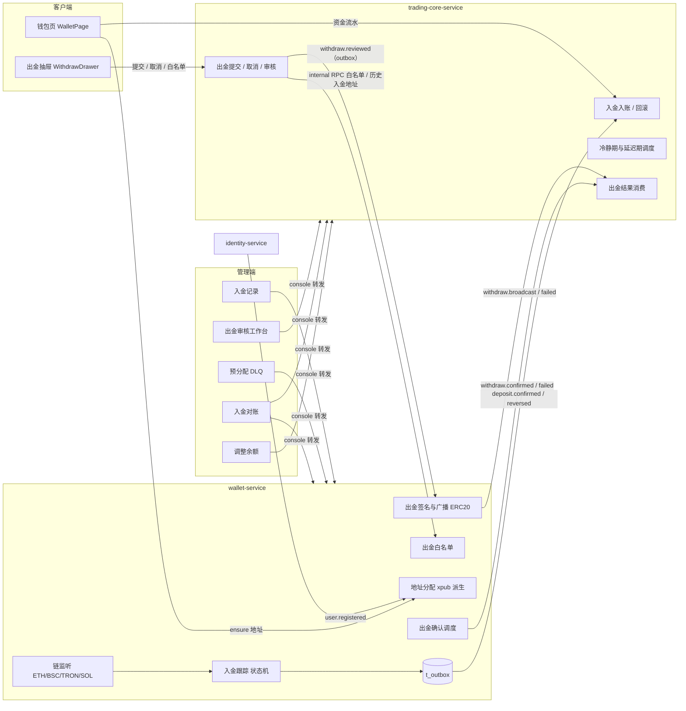

# FalconX 功能地图 · 资金：入金、出金与钱包
- 版本：v1（2026-10-07）
- 变更历史：v1（2026-10-07）首次创建
- 依据：fxsystem main `da65af9`；对照代码逐项核实（未运行构建和测试）
- 范围：入金地址派生与预分配、链上入金监听（ETH/BSC/TRON/SOL）、入金入账与回滚、出金全链路（提交、冷静期、白名单、审核、延迟、紧急取消、签名、nonce、广播、确认、失败退款）、入金对账、客户端钱包页与出金抽屉、管理端入金记录 / 出金审核 / 预分配 DLQ / 对账页、管理端调整余额，以及外部 RPC 依赖。
  不覆盖：交易账户的保证金、可用余额计算口径和持仓（见 03 分册）；KYC 审核流程本身（只写出金对 KYC 等级的依赖）；网关鉴权、RBAC 框架和审计切面的通用机制（只写本域用到的权限码和高危标记）。

## 一图看懂



这张图想让读者看懂：wallet-service 只负责"链上事实"（地址、扫块、签名广播、确认），trading-core-service 负责"账务事实"（入账、冻结、退款、出金状态机），两者只通过 Kafka 事件和 internal RPC 交互；管理端所有页面都经 console-service 转发到这两个服务。

## 功能清单

| 编号 | 功能 | 使用者 | 状态 |
| --- | --- | --- | --- |
| F-01 | 入金地址 xpub 派生（ERC20 / TRC20 / 其他链） | 系统 | 部分实现 |
| F-02 | 注册后自动预分配入金地址（消费 `identity.user.registered`） | 系统 | 已实现 |
| F-03 | 入金页幂等申请地址（`POST /api/v1/wallet/deposit-addresses/ensure`） | 客户 | 已实现 |
| F-04 | 地址预分配失败 DLQ 与管理端重试 | 运营 | 已实现 |
| F-05 | 链上监听：ETH（原生 ETH + ERC20 USDT/USDC） | 系统 | 已实现 |
| F-06 | 链上监听：BSC | 系统 | 部分实现 |
| F-07 | 链上监听：TRON（TRC20） | 系统 | 部分实现 |
| F-08 | 链上监听：SOL | 系统 | stub/骨架 |
| F-09 | 原始入金状态机与 detected / confirmed / reversed 事件发布 | 系统 | 已实现 |
| F-10 | 入金入账（trading-core）与 `deposit.credited` | 系统 | 已实现 |
| F-11 | 入金撤回（reversal）处理 | 系统 | 部分实现 |
| F-12 | 出金地址白名单（增 / 查 / 软删，10 条上限） | 客户 | 部分实现 |
| F-13 | 白名单 24 小时冷却推进调度 | 系统 | 已实现 |
| F-14 | 出金提交（限额、KYC、陌生地址、冻结） | 客户 | 已实现 |
| F-15 | 出金冷静期推进与用户取消 | 客户 / 系统 | 已实现 |
| F-16 | 管理端审核：通过 / 拒绝 | 运营 | 已实现 |
| F-17 | 大额延迟期（APPROVED_DELAYED）推进与紧急取消 | 运营 / 系统 | 部分实现 |
| F-18 | 出金签名（LocalKmsSigner / KmsSignerStub） | 系统 | 部分实现 |
| F-19 | nonce 管理与 ERC20 广播 | 系统 | 部分实现 |
| F-20 | 出金链上确认（12 confirmations）与完成结算 | 系统 | 部分实现 |
| F-21 | 出金失败退款 | 系统 | 已实现 |
| F-22 | TRC20 出金 | 系统 | stub/骨架 |
| F-23 | 入金对账（4 类差异、标记 resolved） | 运营 | 部分实现 |
| F-24 | 客户端钱包页（余额、入金地址、资金流水） | 客户 | 已实现 |
| F-25 | 客户端出金抽屉（提交、记录、白名单） | 客户 | 部分实现 |
| F-26 | 管理端入金记录（列表 / 详情 / 入账状态拼接） | 运营 | 已实现 |
| F-27 | 管理端出金审核工作台（列表 / 详情 / 三种操作） | 运营 | 部分实现 |
| F-28 | 管理端调整客户余额（限额计数 + 账本） | 运营 | 已实现 |
| F-29 | 资金域 Kafka 事件与 wallet 发件箱 | 系统 | 已实现 |
| F-30 | 外部 RPC 依赖与 ETH RPC 健康检查 | 运维 | 已实现 |

---

## F-01 入金地址 xpub 派生

- **状态**：部分实现。ERC20（ETH 链）和 TRC20（TRON 链）的 BIP32 非硬化派生已真实实现；BSC、SOL 调用即抛 `UNSUPPORTED_CHAIN (20004)`，没有地址可分配（证据：`XpubWalletAddressDerivationService.deriveAddress` 的 `switch` 只有 `ETH`、`TRON` 两支）。
- **使用者与入口**：无直接入口；被 F-02、F-03、F-04 调用。
- **业务逻辑**：
  1. 输入 account 级 xpub（`falconx.wallet.derivation.eth-account-xpub` / `tron-account-xpub`，分别来自环境变量 `FALCONX_WALLET_ETH_ACCOUNT_XPUB` / `FALCONX_WALLET_TRON_ACCOUNT_XPUB`，默认空）。服务端只持有公钥，不持有入金私钥。
  2. xpub 校验：Base58Check 解码后长度必须 78 字节、版本前 4 字节必须为 `0x0488B21E`（标准 mainnet xpub），公钥必须是 33 字节压缩点（前缀 `02/03`）。失败抛 `WALLET_ADDRESS_ALLOCATION_FAILED (20006)`，`reason` 为 `missing_account_xpub` / `invalid_account_xpub` / `invalid_account_xpub_public_key`。
  3. 派生：先派生 `change=0`，再派生 `addressIndex`，两步都是非硬化（HMAC-SHA512，tweak 落在曲线阶内，否则 `invalid_child_key`）。`addressIndex < 0` 拒绝。
  4. ETH 地址：未压缩公钥去前缀后 Keccak-256 取后 20 字节，输出 EIP-55 校验和地址；派生路径记为 `m/44'/60'/0'/0/{index}`；`network=ERC20`。
  5. TRON 地址：同样的 20 字节前加 `0x41` 再 Base58Check；路径 `m/44'/195'/0'/0/{index}`；`network=TRC20`。
  6. 两条链派生结果的 `token` 都固定写 `USDT`。同一个 ETH 地址也会收到 USDC（监听按合约识别，见 F-05），但地址记录上只标 USDT。
  7. 索引分配（`SequentialWalletAddressAllocationService`）：按链取 `t_wallet_address` 当前最大 `address_index`（`SELECT ... ORDER BY address_index DESC LIMIT 1 FOR UPDATE`），+1；表为空时从 `falconx.wallet.allocation.start-index`（默认 `1`）开始。插入遇唯一键冲突时最多重试 3 次；冲突后若发现该用户已有地址则直接返回。
  8. 已有地址校验：若用户已有地址但 `derivation_path` 为空或以 `legacy:` 开头（V3 迁移回填的历史数据），抛 20006 `legacy_address_not_returnable`，不会返回给用户。
- **字段**：
  - 涉及的数据表（wallet-service owner，全部字段）：

    | 表.字段 | 类型 | 含义 | 约束/取值 |
    | --- | --- | --- | --- |
    | `t_wallet_address.id` | BIGINT | 主键（雪花 ID） | PK |
    | `t_wallet_address.user_id` | BIGINT | 用户 ID | NOT NULL；`uk_user_chain(user_id, chain)` |
    | `t_wallet_address.chain` | VARCHAR(16) | 链标识 | `ETH` / `TRON`（实际只会写这两个） |
    | `t_wallet_address.token` | VARCHAR(16) | 入金代币符号 | 默认 `USDT`（V3 新增） |
    | `t_wallet_address.network` | VARCHAR(16) | 网络展示名 | `ERC20` / `TRC20`，NOT NULL（V3 新增，历史行回填） |
    | `t_wallet_address.address` | VARCHAR(128) | 钱包地址 | `uk_chain_address(chain, address)` |
    | `t_wallet_address.address_index` | INT | HD 派生索引 | NOT NULL |
    | `t_wallet_address.derivation_path` | VARCHAR(128) | HD 派生路径 | NOT NULL（V3 新增；历史行回填 `legacy:{chain}:{index}`） |
    | `t_wallet_address.status` | TINYINT | 地址状态 | `1=ASSIGNED`，`2=DISABLED`，默认 1 |
    | `t_wallet_address.assigned_at` | DATETIME(3) | 分配时间 | NOT NULL |
    | `t_wallet_address.created_at` | DATETIME(3) | 创建时间 | 默认当前时间 |
    | `t_wallet_address.updated_at` | DATETIME(3) | 更新时间 | ON UPDATE |
  - 枚举 `WalletAddressStatus`：`ASSIGNED`（已分配，可用于监听）、`DISABLED`（停用；代码中没有任何写入 DISABLED 的入口）。
- **错误码**：

  | 错误码 | 含义 | 触发条件 |
  | --- | --- | --- |
  | `20004` | UNSUPPORTED_CHAIN | 对 BSC / SOL 派生 |
  | `20006` | WALLET_ADDRESS_ALLOCATION_FAILED | xpub 缺失或非法、子密钥非法、历史 legacy 地址不可返回 |
- **相关事件和定时任务**：无。
- **证据**：`falconx-wallet-service/src/main/java/com/falconx/wallet/service/impl/XpubWalletAddressDerivationService.java`、`.../service/impl/SequentialWalletAddressAllocationService.java`、`.../repository/MybatisWalletAddressRepository.java`、`src/main/resources/mapper/wallet/WalletAddressMapper.xml`、`db/migration/V1__init_wallet_schema.sql`、`V3__wallet_address_derivation_metadata.sql`。

## F-02 注册后自动预分配入金地址

- **状态**：已实现。`IdentityUserRegisteredEventConsumer` 带 `@KafkaListener`，identity-service 在注册时发布事件（`IdentityKafkaEventPublisher.publishUserRegistered`）。
- **使用者与入口**：系统；Kafka 主题 `falconx.identity.user.registered`，消费组 `falconx.wallet-service.user-registered-consumer`。
- **业务逻辑**：
  1. 从 payload JSON 读 `userId`、`eventId`、`uid`、`email`（identity 端 payload 还含 `eventType`、`registeredAt`；`eventId` 形如 `user-registered-{userId}`，放在 payload 里而不是只放 header）。
  2. `userId <= 0` 或 JSON 解析失败：只打日志，直接返回（不重试，不阻塞分区）。
  3. 调 `ensureDefaultUsdtDepositAddresses(userId)`：同一事务内先分配 TRON，再分配 ETH（顺序固定），见 F-01。幂等依赖 `uk_user_chain`，因此没有单独的 inbox 表。
  4. 捕获 `WalletBusinessException` 且错误码为 `20006`：写 DLQ（见 F-04）后吞掉异常，offset 正常提交。DLQ 写库失败也只打日志。
  5. 其他业务异常或运行时异常：重新抛出，交给 Spring Kafka 默认错误处理（代码没有配置 `DeadLetterPublishingRecoverer`，注释里提到的 `falconx.identity.user.registered-dlt` 实际不存在，重试次数未验证）。
- **字段**：消费 payload：

  | 字段 | 类型 | 含义 |
  | --- | --- | --- |
  | `eventId` | string | 事件 ID，用作 DLQ 去重键；为空时 DLQ 用 `user-registered-{userId}` |
  | `eventType` | string | `identity.user.registered`（wallet 不读） |
  | `userId` | long | 用户 ID |
  | `uid` | string | 用户对外短号（写入 DLQ 便于运营定位） |
  | `email` | string | 邮箱（写入 DLQ） |
  | `registeredAt` | datetime | 注册时间（wallet 不读） |
- **相关事件和定时任务**：消费 `falconx.identity.user.registered`。
- **证据**：`falconx-wallet-service/src/main/java/com/falconx/wallet/consumer/IdentityUserRegisteredEventConsumer.java`、`.../application/WalletAddressAllocationApplicationService.java`、`falconx-identity-service/src/main/java/com/falconx/identity/producer/IdentityKafkaEventPublisher.java`、`falconx-wallet-service/src/main/resources/application.yml`。

## F-03 入金页幂等申请地址

- **状态**：已实现（后端 + 客户端钱包页调用）。
- **使用者与入口**：客户端钱包页（`falconx-frontend/src/features/wallet/WalletPage.tsx`，React Query key `["wallet","deposit-addresses"]`，`staleTime` 1 小时）；接口 `POST /api/v1/wallet/deposit-addresses/ensure`（wallet-service，经 gateway `wallet-route`，Bearer JWT，gateway 注入 `X-User-Id`）。
- **业务逻辑**：
  1. 请求体为空（前端发 `{}`），用户来自 `X-User-Id`。
  2. 调 `ensureDefaultUsdtDepositAddresses`：已有则直接返回（加 `FOR UPDATE` 行锁），没有则派生（见 F-01）。返回顺序固定 TRC20 在前、ERC20 在后。
  3. xpub 未配置时返回 `20006`；前端显示"尚未派生入金地址。请联系运营或管理员。"。
- **字段**：
  - 响应字段表（`EnsureWalletDepositAddressesResponse.addresses[]`）：

    | 字段 | 类型 | 含义 |
    | --- | --- | --- |
    | `network` | string | `TRC20` / `ERC20` |
    | `chain` | string | `TRON` / `ETH` |
    | `token` | string | 固定 `USDT` |
    | `address` | string | 入金地址 |
    | `addressIndex` | int | 派生索引 |
    | `derivationPath` | string | 派生路径 |
- **错误码**：`20006`（见 F-01）；`X-User-Id` 缺失时为通用参数错误（`WalletGlobalExceptionHandler`，HTTP 400）。
- **证据**：`falconx-wallet-service/src/main/java/com/falconx/wallet/controller/WalletDepositAddressController.java`、`.../dto/WalletDepositAddressItemResponse.java`、`falconx-frontend/src/features/wallet/walletApi.ts`、`falconx-gateway/src/main/java/com/falconx/gateway/config/GatewayConfiguration.java`。

## F-04 地址预分配失败 DLQ 与管理端重试

- **状态**：已实现（wallet 表 + internal RPC + console 接口 + 管理端页面）。
- **使用者与入口**：
  - 管理端页面 `/admin/wallet/provision-dlq`（`falconx-console-frontend/src/features/wallet/WalletProvisionDlqListPage.tsx`）。注意：console 菜单种子（`V9__seed_admin_menus_backfill.sql`）里没有这一项，只能通过 URL 进入。
  - console 接口：`GET /admin/wallet/provision-dlq`（权限 `wallet-provision:view`）、`POST /admin/wallet/provision-dlq/{id}/retry`（权限 `wallet-provision:retry`，注解描述写"高危"，但 `HighRiskPermissionRegistry` 未登记，审计 `risk_level` 实际为 LOW）。
  - wallet internal：`GET /internal/v1/wallet/console/provision-dlq`、`POST /internal/v1/wallet/console/provision-dlq/{id}/retry`；鉴权 `X-Internal-Token` + `X-Admin-User-Id`（`WalletInternalApiTokenFilter`）。
- **业务逻辑**：
  1. 入队（F-02 第 4 步）：先按 `event_id` 执行 `UPDATE ... SET attempt_count = attempt_count + 1, last_error_* WHERE event_id = ? AND status = 0`；影响 0 行时插入新行（`attempt_count=1`，`status=0`）。`last_error_message` 截断到 500 字符。
  2. 列表：`status`（0/1）、`userId` 可选过滤；`page` 最小 1，`size` 限制在 1–100；按 `created_at DESC, id DESC`。
  3. 重试：console 先校验 `reason` 非空（否则 `90862`）；wallet 端查行（不存在 `90860`）、已 RESOLVED 拒绝（`90861`）；调用 `ensureDefaultUsdtDepositAddresses(userId)`，成功后 `UPDATE ... SET status=1, resolved_at=? WHERE id=? AND status=0`。`reason` 只写日志，不入表。重试失败（如 xpub 仍缺）时异常直接返回，DLQ 行不变（不会增加 `attempt_count`）。
  4. 前端：重试弹窗要求填写原因（前端只校验非空），成功后刷新列表。
- **字段**：
  - 涉及的数据表（全部字段）：

    | 表.字段 | 类型 | 含义 | 约束/取值 |
    | --- | --- | --- | --- |
    | `t_wallet_address_provision_dlq.id` | BIGINT | 主键（雪花） | PK |
    | `.event_id` | VARCHAR(64) | 来源事件 ID | UNIQUE |
    | `.user_id` | BIGINT | 用户 ID | NOT NULL，索引 `idx_user` |
    | `.uid` | VARCHAR(32) | 用户短号 | 可空 |
    | `.email` | VARCHAR(255) | 邮箱 | 可空 |
    | `.attempt_count` | INT | 失败次数 | 默认 1 |
    | `.status` | TINYINT | 状态 | `0=PENDING`，`1=RESOLVED` |
    | `.last_error_code` | VARCHAR(32) | 最近错误码 | 如 `20006` |
    | `.last_error_message` | VARCHAR(512) | 最近错误信息 | 代码截断 500 |
    | `.last_attempt_at` | DATETIME(3) | 最近失败时间 | NOT NULL |
    | `.resolved_at` | DATETIME(3) | 解决时间 | 可空 |
    | `.created_at` | DATETIME(3) | 创建时间 | 默认当前 |
  - 列表响应：`page`、`pageSize`、`total`、`items[]`；item 字段：`id`、`eventId`、`userId`（均为字符串）、`uid`、`email`、`attemptCount`、`status`（`PENDING`/`RESOLVED`）、`lastErrorCode`、`lastErrorMessage`、`lastAttemptAt`、`resolvedAt`、`createdAt`。
  - 重试请求：`reason`（string，必填，console `@NotBlank`）。
- **状态机**：

  ```mermaid
  stateDiagram-v2
    [*] --> PENDING: user.registered 分配失败 20006
    PENDING --> PENDING: 同 eventId 再次失败 attempt_count+1
    PENDING --> RESOLVED: 管理端重试成功
  ```
- **错误码**：

  | 错误码 | 含义 | 触发条件 |
  | --- | --- | --- |
  | `90860` | DLQ 条目不存在 | wallet 查不到 id（console 翻译为同码） |
  | `90861` | 已 RESOLVED | 重复重试 |
  | `90862` | 重试原因必填 | console 前置校验 |
  | `90701/90702/90703` | internal token 无效 / 缺失 / 缺 `X-Admin-User-Id` | wallet internal 过滤器 |
- **证据**：`falconx-wallet-service/.../application/WalletAddressProvisionAdminApplicationService.java`、`.../controller/AdminInternalWalletProvisionController.java`、`.../repository/MybatisWalletAddressProvisionDlqRepository.java`、`mapper/wallet/WalletAddressProvisionDlqMapper.xml`、`V4__provision_dlq.sql`、`falconx-console-service/.../controller/AdminWalletProvisionController.java`、`.../wallet/AdminWalletProvisionApplicationService.java`、`.../security/HighRiskPermissionRegistry.java`、`falconx-console-frontend/src/features/wallet/*`。

## F-05 链上监听：ETH

- **状态**：已实现（原生 ETH 与 ERC20 Transfer 均会识别并落库；只有 USDT/USDC 会被 trading-core 入账，见 F-10）。
- **使用者与入口**：系统；`WalletListenerBootstrapRunner`（`CommandLineRunner`）启动时为每条链 `initializeIfAbsent` 游标后调用 `listener.start(...)`。
- **业务逻辑**：
  1. 客户端：Web3j，RPC 来自 `falconx.wallet.chains.eth.rpc-url`（环境变量 `Alchemy_Ethereum_Sepolia_HTTPS`，缺省本地节点）；支持 http/https/ws/wss。
  2. 轮询：每条链一个单线程 `ScheduledExecutorService`，`scheduleWithFixedDelay`，间隔 `scan-interval`（yml 默认 `5m`，环境变量 `FALCONX_WALLET_ETH_SCAN_INTERVAL`；Java 默认 5s；下限 1s）。启动时先同步执行一次。
  3. 游标（`t_wallet_chain_cursor`，`cursor_type=block`）：游标值等于初始值 `"0"` 时只把游标对齐到当前链头，不回扫历史（首次上线前的入金不会被识别）。
  4. 扫描窗口：`scanStart = min(链头, 上次处理到的块) - requiredConfirmations + 2`（下限 1）；`scanEnd = scanStart + maxScanBlocksPerSync - 1`，不超过链头（`maxScanBlocksPerSync` 默认 500，追赶时分批）。每轮都回扫一个确认窗口，用于推进确认数和发现回滚。
  5. 原生 ETH：逐块 `eth_getBlockByNumber(full tx)`；`value > 0` 且 `to` 在本链已分配地址集合（`status=1`）中，再取回执，回执失败或未就绪则跳过；`token=ETH`，`logIndex=0`，金额按 18 位小数换算。
  6. ERC20：`eth_getLogs`，topic0 为 Transfer，topic2 为平台地址（每批最多 100 个地址），块窗口固定 10 块（兼容 Alchemy 免费档限制）。若配置了 USDT/USDC 合约（`FALCONX_WALLET_ERC20_USDT_CONTRACT` / `FALCONX_WALLET_ERC20_USDC_CONTRACT`，小数位默认 6）则按合约地址过滤并用配置的符号和小数位；**若两个合约都没配，过滤器不限合约，任何 ERC20 都会被记录，符号和小数位来自链上 `symbol()` / `decimals()`**（小数位 0–30，读不到则跳过）。`removed=true` 的日志跳过。
  7. 金额统一换算为业务金额，保留 8 位小数，`RoundingMode.DOWN`。
  8. 确认数 = 链头 − 交易块 + 1；所需确认数 `required-confirmations` = 12。
  9. 回滚（reversal）识别：本轮窗口内库里状态为 `CONFIRMED` 的记录，如果本轮没有再被观察到（按 `txHash#logIndex`），就以 `reversed=true` 回调应用层。窗口与本轮实际扫描范围一致，避免分批时误判。
  10. 任一 RPC 或下游异常：本轮不推进游标，下一轮从原位置重试；应用层按 `(chain, tx_hash, log_index)` 幂等。
  11. 指标：`falconx.wallet.chain.scan.duration`（Timer）、`falconx.wallet.deposit.detected.total`（Counter），tag 只有 `chain`。
- **字段**：
  - 游标表（全部字段）：

    | 表.字段 | 类型 | 含义 | 约束/取值 |
    | --- | --- | --- | --- |
    | `t_wallet_chain_cursor.id` | BIGINT | 主键 | PK |
    | `.chain` | VARCHAR(16) | 链标识 | UNIQUE：`ETH`/`BSC`/`TRON`/`SOL` |
    | `.cursor_type` | VARCHAR(32) | 游标类型 | `block`（ETH/BSC/TRON）、`slot`（SOL） |
    | `.cursor_value` | VARCHAR(128) | 已处理到的块号 | 初始 `"0"` |
    | `.updated_at` | DATETIME(3) | 更新时间 | |
  - 原始入金表见 F-09。
- **相关事件和定时任务**：每链轮询线程 `wallet-eth-head-poller`；产出由 F-09 发布事件。
- **证据**：`falconx-wallet-service/.../listener/Web3jChainDepositListener.java`、`.../application/WalletListenerBootstrapRunner.java`、`.../config/WalletServiceConfiguration.java`、`.../config/WalletServiceProperties.java`、`application.yml`、`V1__init_wallet_schema.sql`。

## F-06 链上监听：BSC

- **状态**：部分实现。与 ETH 共用 `Web3jChainDepositListener`，代码路径完整（原生币符号 `BNB`），但：RPC 在 yml 中写死本地地址、没有环境变量；没有配置任何 BSC 合约；F-01 不能为 BSC 派生地址，因此本链已分配地址集合永远为空，实际不会识别任何入金。所需确认数 15。
- **使用者与入口**：系统，同 F-05。
- **业务逻辑**：同 F-05；`scan-interval` 环境变量 `FALCONX_WALLET_BSC_SCAN_INTERVAL`（默认 5m）。连不上本地节点时每轮记 `syncFailed` 警告日志。
- **证据**：`WalletServiceConfiguration.chainDepositListeners`、`application.yml` 中 `falconx.wallet.chains.bsc`。

## F-07 链上监听：TRON（TRC20）

- **状态**：部分实现。TRC20 Transfer 识别已实现；不识别原生 TRX；yml 只提供 USDT 合约环境变量（`FALCONX_WALLET_TRC20_USDT_CONTRACT`），USDC 没有对应环境变量；没有单轮扫块上限（ETH 有 500 块分批，TRON 一次扫到链头）。
- **使用者与入口**：系统，同 F-05。
- **业务逻辑**：
  1. 客户端：自写 HTTP（`HttpTronChainClient`），链头用 `wallet/getnowblock`；交易回执用 `walletsolidity/gettransactioninfobyblocknum`（配置了 `solidity-rpc-url` 时）或 `wallet/gettransactioninfobyblocknum`。配置了 `apiKey` 时带 `TRON-PRO-API-KEY` 头（yml 没有为它提供环境变量）。
  2. RPC：`rpc-url` 与 `solidity-rpc-url` 都优先取 `ALCHEMY_ETHEREUM_NILETEST_HTTPS`，否则分别取 `FALCONX_WALLET_TRC20_RPC_URL` / `FALCONX_WALLET_TRC20_SOLIDITY_RPC_URL`。
  3. 未配置任何合约时整轮跳过（`no_configured_contract`），与 ETH 不同，不会接收任意代币。
  4. 只处理 topic 数 ≥ 3 且 topic0 为 Transfer 的日志；`result=FAILED` 的交易丢弃；`logIndex` 用交易内日志序号；地址统一转 20 字节十六进制比对，落库转 Base58。
  5. 所需确认数 19；游标、回扫窗口、首次对齐链头、reversal 识别规则同 F-05。
- **证据**：`falconx-wallet-service/.../listener/TronApiChainDepositListener.java`、`.../client/HttpTronChainClient.java`、`.../client/WalletBlockchainClientFactory.java`、`application.yml`。

## F-08 链上监听：SOL

- **状态**：stub/骨架。`SolanaRpcChainDepositListener.start` 只创建 Solanaj 客户端并打一条启动日志，没有轮询、没有解析、没有回调（证据：方法体只有 `createSolanaClient` 和 `log.info`）。RPC 写死本地地址，所需确认数 32，游标类型 `slot`（游标行会被初始化但不会更新）。
- **证据**：`falconx-wallet-service/.../listener/SolanaRpcChainDepositListener.java`。

## F-09 原始入金状态机与事件发布

- **状态**：已实现。
- **使用者与入口**：系统；`WalletDepositTrackingApplicationService.trackObservedDeposit`（`@Transactional`），由各链监听器回调。
- **业务逻辑**：
  1. 按 `(chain, toAddress)` 查地址归属；按 `(chain, txHash, logIndex)` 查已有记录。
  2. 状态判定（`DefaultWalletDepositStatusService`）：地址不归平台 → `IGNORED`；已有记录是 `REVERSED` 或 `IGNORED` → 保持；观察为回滚：已有 `CONFIRMED` → `REVERSED`，已有其他状态 → 保持原状态，首次观察即回滚 → `IGNORED`；确认数 ≥ 所需 → `CONFIRMED`；确认数 > 0 → `CONFIRMING`；否则 `DETECTED`。
  3. 幂等：已有记录状态相同且确认数不增加 → 跳过，不写库、不发事件。
  4. 写库：同一行覆盖为最新链事实；`detected_at` 首次写入后不变；`confirmed_at` 只在首次进入 `CONFIRMED` 时写；`required_confirms` 取当时配置。
  5. **walletTxId 主键规则**：`walletTxId` 就是 `t_wallet_deposit_tx.id`，首次插入时由 `IdGenerator` 生成雪花 ID，之后同一 `(chain, tx_hash, log_index)` 永远复用这一行，因此跨服务幂等统一用它。
  6. 发布（只对 `userId` 非空且非 `IGNORED`）：首次出现（无旧记录）且为 `DETECTED/CONFIRMING` → `deposit.detected`；从非 CONFIRMED 进入 `CONFIRMED` → `deposit.confirmed`；首次进入 `REVERSED` → `deposit.reversed`。注意：若首次被观察时确认数已达标（例如服务停机后追赶），直接发 `confirmed`，不会发 `detected`。
  7. 发布方式：写 wallet `t_outbox`（与业务写库同事务），由调度器投递，见 F-29。事件 ID 稳定：`wallet-detected:` / `wallet-confirmed:` / `wallet-reversed:` + 基于 walletTxId 的 UUIDv3；分区键 `chain:txHash`。
- **字段**：
  - 涉及的数据表（全部字段）：

    | 表.字段 | 类型 | 含义 | 约束/取值 |
    | --- | --- | --- | --- |
    | `t_wallet_deposit_tx.id` | BIGINT | 主键 = walletTxId | PK |
    | `.user_id` | BIGINT | 归属用户 | 地址不归平台时为空 |
    | `.chain` | VARCHAR(16) | 链 | `ETH`/`BSC`/`TRON`/`SOL` |
    | `.token` | VARCHAR(16) | 代币符号 | `USDT`/`USDC`/`ETH`/`BNB`/链上读到的符号 |
    | `.token_contract_address` | VARCHAR(128) | 合约地址 | 原生币为空（V2） |
    | `.tx_hash` | VARCHAR(128) | 交易哈希 | |
    | `.log_index` | INT | 日志序号 | 原生币固定 0（V2）；`uk_chain_tx_log_index(chain, tx_hash, log_index)` |
    | `.from_address` | VARCHAR(128) | 来源地址 | |
    | `.to_address` | VARCHAR(128) | 目标地址 | 索引 `idx_to_address_detected` |
    | `.amount` | DECIMAL(24,8) | 业务金额 | 已按小数位换算 |
    | `.block_number` | BIGINT | 块高 | |
    | `.confirmations` | INT | 当前确认数 | 默认 0 |
    | `.required_confirms` | INT | 所需确认数 | ETH 12 / BSC 15 / TRON 19 |
    | `.status` | TINYINT | 状态 | `0=DETECTED 1=CONFIRMING 2=CONFIRMED 3=REVERSED 4=IGNORED` |
    | `.detected_at` | DATETIME(3) | 首次检测 | |
    | `.confirmed_at` | DATETIME(3) | 首次确认 | |
    | `.updated_at` | DATETIME(3) | 最近观察 | 索引 `idx_chain_status_updated` |
  - 事件 payload（`deposit.detected` / `deposit.confirmed` / `deposit.reversed` 字段相同，仅最后的时间字段名不同）：

    | 字段 | 类型 | 含义 |
    | --- | --- | --- |
    | `walletTxId` | long | 原始交易主键 |
    | `userId` | long | 用户 |
    | `chain` | enum | 链 |
    | `token` | string | 代币符号 |
    | `txHash` | string | 交易哈希（不含 logIndex） |
    | `fromAddress` / `toAddress` | string | 来源 / 目标 |
    | `amount` | decimal | 业务金额，8 位小数 |
    | `confirmations` / `requiredConfirmations` | int | 当前 / 所需确认数（reversed 时为 0） |
    | `detectedAt` / `confirmedAt` / `reversedAt` | datetime | 对应时间（reversed 用 `updated_at`） |
- **状态机**：

  ```mermaid
  stateDiagram-v2
    [*] --> IGNORED: 目标地址不归平台 / 首次观察即回滚
    [*] --> DETECTED: 确认数 0
    [*] --> CONFIRMING: 0 < 确认数 < 所需
    [*] --> CONFIRMED: 确认数 >= 所需
    DETECTED --> CONFIRMING: 确认数增长
    DETECTED --> CONFIRMED
    CONFIRMING --> CONFIRMED: 确认数 >= 所需
    CONFIRMED --> REVERSED: 回扫窗口内消失
  ```
- **相关事件和定时任务**：发布 `falconx.wallet.deposit.detected` / `.confirmed` / `.reversed`。`deposit.detected` 目前没有任何服务消费（trading-core、console 均无监听）。
- **证据**：`falconx-wallet-service/.../application/WalletDepositTrackingApplicationService.java`、`.../service/impl/DefaultWalletDepositStatusService.java`、`.../producer/OutboxBackedWalletEventPublisher.java`、`.../repository/MybatisWalletDepositTransactionRepository.java`、`.../repository/WalletMybatisSupport.java`、`falconx-wallet-contract/.../event/WalletDeposit*EventPayload.java`、`V1`、`V2` 迁移。

## F-10 入金入账与 `deposit.credited`

- **状态**：已实现。
- **使用者与入口**：系统；trading-core `TradingKafkaEventListener.onWalletDepositConfirmed` 消费 `falconx.wallet.deposit.confirmed`（消费组 `falconx-trading-core-service`），在低频 Kafka 线程池中执行 `TradingDepositCreditApplicationService.creditConfirmedDeposit`（`@Transactional`）。
- **业务逻辑**：
  1. 代币白名单：`falconx.trading.deposit-token-whitelist`（默认 `USDT`、`USDC`，按大写符号比较）。不在白名单（如原生 `ETH`/`BNB` 或其他代币）→ 标记 inbox 已处理；若同 walletTxId 已有行则返回；否则写一行 `status=REJECTED`、`account_id=NULL`、`rejection_reason=token_not_whitelisted`，不动账户、不发事件。**白名单只比符号，不比合约地址**（结合 F-05 第 6 步，ETH 合约未配置时任何自称 USDT 的代币都会入账）。
  2. 幂等：按 `wallet_tx_id` 查 `t_deposit`，已存在则标记 inbox 后直接返回（`uk_wallet_tx_id`）。
  3. 入账：按结算币种 `falconx.trading.settlement-token`（默认 `USDT`）加行锁取账户（不存在则建），`balance += amount`，1:1（USDC 也按 1:1 计入 USDT 账户）。写账本 `biz_type=1 DEPOSIT_CREDIT`，幂等键 `deposit-credit:{walletTxId}`，`reference_no=txHash`，`original_amount=amount`、`original_currency=账户币种`、`fx_rate_at_settlement=1`。
  4. 写 `t_deposit`（`status=CREDITED`）；写 trading `t_outbox`：`trading.deposit.credited`，事件 ID `deposit-credited:{walletTxId}`，分区键 `userId`。
  5. 标记 inbox（`eventId`，类型 `wallet.deposit.confirmed`）。
  6. 站内信 `DEPOSIT_CREDITED`（参数 amount、currency、chain、txHash），失败只记日志。
- **字段**：
  - 涉及的数据表（trading-core 本域相关字段，全部）：

    | 表.字段 | 类型 | 含义 | 约束/取值 |
    | --- | --- | --- | --- |
    | `t_deposit.id` | BIGINT | 业务入金 ID | PK |
    | `.user_id` | BIGINT | 用户 | 索引 `idx_user_created` |
    | `.account_id` | BIGINT | 入账账户 | REJECTED 时为 NULL（V23） |
    | `.wallet_tx_id` | BIGINT | walletTxId | `uk_wallet_tx_id`（V4） |
    | `.chain` | VARCHAR(16) | 链 | 索引 `idx_chain_tx_hash`（V4，原 `uk_chain_tx` 已删除） |
    | `.token` | VARCHAR(16) | 代币 | |
    | `.tx_hash` | VARCHAR(128) | 交易哈希 | |
    | `.amount` | DECIMAL(24,8) | 金额 | |
    | `.status` | TINYINT | 状态 | `1=CREDITED 2=REVERSED 3=REJECTED` |
    | `.credited_at` | DATETIME(3) | 入账时间 | REJECTED 时为 NULL（V24） |
    | `.reversed_at` | DATETIME(3) | 回滚时间 | |
    | `.rejection_reason` | VARCHAR(64) | 拒收原因 | 当前只有 `token_not_whitelisted`（V23） |
    | `.rejected_at` | DATETIME(3) | 拒收时间 | （V23） |
    | `.created_at` | DATETIME(3) | 创建时间 | |
  - `t_ledger` 本域用到的列：`biz_type`、`idempotency_key`（`uk_ledger_user_idempotency(user_id, idempotency_key)`）、`reference_no`、`amount`、`original_amount`、`original_currency`、`fx_rate_at_settlement`、`balance_before/after`、`frozen_before/after`、`margin_used_before/after`。表的完整说明见 03 分册。
  - 本域账本 `biz_type` 代码取值（`TradingMybatisSupport`）：`1 DEPOSIT_CREDIT`、`2 DEPOSIT_REVERSAL`、`11 ADMIN_BALANCE_ADJUST`、`13 WITHDRAW_FREEZE`、`14 WITHDRAW_REFUND_CANCEL`、`15 WITHDRAW_REFUND_REJECT`、`16 WITHDRAW_REFUND_EMERGENCY`、`17 WITHDRAW_SETTLE`、`18 WITHDRAW_REFUND_CHAIN_FAILED`。
  - `trading.deposit.credited` payload：`depositId`、`userId`、`accountId`、`chain`、`token`、`txHash`、`amount`、`creditedAt`。
- **状态机**（`t_deposit`）：

  ```mermaid
  stateDiagram-v2
    [*] --> CREDITED: confirmed 且 token 在白名单
    [*] --> REJECTED: confirmed 但 token 不在白名单
    CREDITED --> REVERSED: wallet deposit.reversed
  ```
- **相关事件和定时任务**：消费 `falconx.wallet.deposit.confirmed`；发布 `falconx.trading.deposit.credited`（identity-service 的 `DepositCreditedEventConsumer` 消费，用于用户激活，属 identity 分册）。
- **证据**：`falconx-trading-core-service/.../application/TradingDepositCreditApplicationService.java`、`.../consumer/WalletDepositConfirmedEventConsumer.java`、`.../consumer/TradingKafkaEventListener.java`、`.../service/impl/DefaultTradingAccountService.java`、`.../repository/TradingMybatisSupport.java`、`.../config/TradingCoreServiceProperties.java`、迁移 `V1`、`V4`、`V23`、`V24`、`V25`、`V28`。

## F-11 入金撤回（reversal）处理

- **状态**：部分实现。主路径已实现；缺：余额不足时没有任何保护（`reverseCredit` 直接 `balance - amount`，可变负，也不考虑冻结和占用保证金）；找不到对应 `t_deposit` 时抛异常靠 Kafka 重试，没有 DLT 和人工队列；`REJECTED` 行收到 reversed 事件时也会走扣款分支（代码只判断 `REVERSED`）。
- **使用者与入口**：系统；消费 `falconx.wallet.deposit.reversed`（消费组 `falconx-trading-core-service`）。
- **业务逻辑**：
  1. wallet 侧只有 `CONFIRMED → REVERSED` 会发事件（见 F-09）。
  2. trading-core：按 walletTxId 查 `t_deposit`；不存在 → 抛 `IllegalStateException`（等待重试）；已是 `REVERSED` → 标记 inbox 返回；否则 `balance -= 原入账金额`，账本 `biz_type=2 DEPOSIT_REVERSAL`，幂等键 `deposit-reversal:{walletTxId}`；`t_deposit.status=REVERSED`、写 `reversed_at`；标记 inbox。
  3. 不发任何下游事件、不发站内信。
- **证据**：`falconx-trading-core-service/.../application/TradingDepositReversalApplicationService.java`、`.../entity/TradingAccount.java`（`reverseCredit`）。

## F-12 出金地址白名单

- **状态**：部分实现。后端（trading-core 透传 + wallet owner）已实现；客户端白名单列表、删除、提交时所选白名单都读取字段 `id`，但 trading-core 响应字段名是 `whitelistId`（`WithdrawWhitelistResponse` 无 Jackson 改名注解），按代码推断客户端删除和提交会拿不到 ID（未运行验证）。
- **使用者与入口**：
  - 客户端出金抽屉第 03 页签"白名单"（F-25）。
  - 用户接口（trading-core，Bearer）：`GET /api/v1/me/withdraw/whitelist`、`POST /api/v1/me/withdraw/whitelist`、`DELETE /api/v1/me/withdraw/whitelist/{id}`。
  - wallet internal（`X-Internal-Token` + `X-Admin-User-Id`；trading-core 调用时传 `service-caller-id`，默认 0）：`GET /internal/v1/wallet/withdraw/whitelists?userId=`、`GET /internal/v1/wallet/withdraw/whitelists/{id}`、`POST /internal/v1/wallet/withdraw/whitelists?userId=`、`DELETE /internal/v1/wallet/withdraw/whitelists/{id}?userId=`。
- **业务逻辑**：
  1. trading-core 本地校验：`network` 只能是 `ERC20` / `TRC20`（区分大小写）；地址正则 ERC20 `^0x[0-9a-fA-F]{40}$`，TRC20 `^T[1-9A-HJ-NP-Za-km-z]{33}$`（只做字符集校验，不做校验和）。
  2. wallet 新增：`PENDING + ACTIVE` 合计已 ≥ 10 条 → `20021`；同用户同网络同地址已有 PENDING/ACTIVE → `20022`；`label` 去空格、空串置空、超 64 截断；写 `status=PENDING`。
  3. 列表：返回非 REMOVED（PENDING + ACTIVE），按 `created_at DESC, id DESC`。
  4. 删除（软删）：必须属于该用户且非 REMOVED，否则 `20020`；`UPDATE status=2, removed_at=now WHERE status IN (0,1)`。
  5. trading-core 把 wallet 错误码翻译为 `30053/30051/30052`；其他下游错误透传。
  6. 唯一约束 `uk_user_network_address_status(user_id, network, address, status)` 含 `status`：同一地址第二次被删除时，会与第一次删除留下的 REMOVED 行冲突，按约束推断 `markRemoved` 会报唯一键错误（未运行验证）。
- **字段**：
  - 请求字段表（POST）：

    | 字段 | 类型 | 必填 | 含义 | 约束/取值 |
    | --- | --- | --- | --- | --- |
    | `network` | string | 是 | 网络 | `ERC20`/`TRC20`，≤16 |
    | `address` | string | 是 | 地址 | ≤128，正则见上 |
    | `label` | string | 否 | 备注 | ≤64 |
  - 响应字段表（trading-core `WithdrawWhitelistResponse`）：

    | 字段 | 类型 | 含义 |
    | --- | --- | --- |
    | `whitelistId` | string | 白名单 ID |
    | `userId` | string | 用户 |
    | `network` | string | 网络 |
    | `address` | string | 地址 |
    | `label` | string | 备注 |
    | `status` | string | `PENDING`/`ACTIVE`/`REMOVED` |
    | `activatedAt` | datetime | 激活时间（PENDING 时为 null） |
    | `createdAt` | datetime | 添加时间 |
  - 涉及的数据表（全部字段）：

    | 表.字段 | 类型 | 含义 | 约束/取值 |
    | --- | --- | --- | --- |
    | `t_withdraw_whitelist.id` | BIGINT | 主键 | PK |
    | `.user_id` | BIGINT | 用户 | 索引 `idx_user_status` |
    | `.network` | VARCHAR(16) | 网络 | `ERC20`/`TRC20` |
    | `.address` | VARCHAR(128) | 地址 | |
    | `.label` | VARCHAR(64) | 备注 | |
    | `.status` | TINYINT | 状态 | `0=PENDING 1=ACTIVE 2=REMOVED` |
    | `.activated_at` | DATETIME(3) | 冷却通过时间 | |
    | `.removed_at` | DATETIME(3) | 删除时间 | |
    | `.created_at` / `.updated_at` | DATETIME(3) | 创建 / 更新 | |
- **状态机**：

  ```mermaid
  stateDiagram-v2
    [*] --> PENDING: 用户添加
    PENDING --> ACTIVE: created_at + 24h 到期（调度器）
    PENDING --> REMOVED: 用户删除
    ACTIVE --> REMOVED: 用户删除
  ```
- **错误码**：

  | 错误码 | 含义 | 触发条件 |
  | --- | --- | --- |
  | `30044` | 网络不支持 | network 非 ERC20/TRC20 |
  | `30045` | 地址格式非法 | 正则不匹配 |
  | `30051`（wallet `20021`） | 超 10 条 | PENDING+ACTIVE ≥ 10 |
  | `30052`（wallet `20022`） | 重复 | 已有同地址 PENDING/ACTIVE |
  | `30053`（wallet `20020`） | 不存在或非己 | 删除时 |
- **证据**：`falconx-trading-core-service/.../controller/UserWithdrawWhitelistController.java`、`.../application/WithdrawWhitelistApplicationService.java`、`.../client/HttpWithdrawWhitelistQueryClient.java`、`.../dto/WithdrawWhitelistResponse.java`、`falconx-wallet-service/.../controller/AdminInternalWalletWithdrawController.java`、`.../application/WalletWithdrawWhitelistApplicationService.java`、`mapper/wallet/WalletWithdrawWhitelistMapper.xml`、`V5__withdraw_whitelist.sql`、`falconx-frontend/src/features/withdraw/types.ts`。

## F-13 白名单 24 小时冷却推进

- **状态**：已实现。
- **使用者与入口**：系统；`WalletWithdrawWhitelistCoolingScheduler`。
- **业务逻辑**：`@Scheduled(fixedDelay)`，间隔 `falconx.wallet.withdraw-whitelist-cooling-scheduler.interval-ms`（默认 60000 ms），开关 `...enabled`（缺省开）。每轮取 `status=0 AND created_at <= now-24h`，按 `created_at` 升序最多 200 条，逐条 CAS `UPDATE status=1, activated_at=now WHERE id=? AND status=0`。24h 写死在代码中，不读配置（trading-core 的 `whitelist-cooling-duration` 配置项未被使用）。没有"惰性检查"：出金提交只认 `status=ACTIVE`，所以最多会比 24h 晚约 1 分钟生效。
- **证据**：`falconx-wallet-service/.../application/WalletWithdrawWhitelistCoolingScheduler.java`。

## F-14 出金提交

- **状态**：已实现（后端）；客户端提交受 F-12 字段问题影响。
- **使用者与入口**：客户端出金抽屉第 01 页签；`POST /api/v1/me/withdraw`（trading-core，Bearer，必传请求头 `X-Idempotency-Key`）。
- **业务逻辑**（按代码执行顺序，事务 `@Transactional`）：
  1. 幂等键为空 → `30040`。同 `user_id + idempotency_key` 已有单 → 直接返回原单（不限 24h，库里唯一键永久有效）。
  2. 金额：必须 > 0、小数不超过 8 位；最小 `falconx.trading.withdraw.min-amount`（默认 10）→ `30040`；单笔上限 `single-limit-usd`（默认 10000，`>` 时拒）→ `30041`。
  3. 币种：空则取 `USDT`；非 `USDT` → `30040`。
  4. 网络：`ERC20`/`TRC20` 之外 → `30044`；地址正则（同 F-12）不符 → `30045`。
  5. KYC：调 identity `GET /internal/v1/identity/users/{userId}/kyc-status`，`kycLevel < 1` → `30043`（响应为空时按 0 处理）。
  6. 陌生地址：调 wallet `GET /internal/v1/wallet/console/deposits/from-addresses?userId=&chain=`（ERC20→ETH，TRC20→TRON），取该用户该链 `CONFIRMED` 入金的去重 `from_address`；目标地址（忽略大小写）不在集合中 → `30056`。即：从未从该地址入过金的用户不能出金到该地址。
  7. 白名单确权：调 wallet `GET /internal/v1/wallet/withdraw/whitelists/{id}`；不存在、`userId` 不符、`network` 不符、地址（忽略大小写）不符 → `30046`；`status != ACTIVE` → `30055`。
  8. 单日累计：UTC 自然日内 `status IN (0..5)` 的出金金额合计 + 本笔 **≥** `daily-limit-usd`（默认 30000）→ `30042`（等于上限也拒绝）。
  9. 账户加行锁，`available < amount` → `30054`（`available` 口径见 03 分册）。
  10. 写 `t_withdraw_order`：`status=COOLING`，`cooling_until = now + cooling-duration`（默认 2h），`daily_amount_usd_snapshot = 提交前当日累计`；唯一键冲突 → `30057`。
  11. 冻结：`frozen += amount`，账本 `biz_type=13 WITHDRAW_FREEZE`，幂等键 `withdraw-freeze:{idempotencyKey}`，`reference_no=withdraw:{withdrawId}`。
  12. outbox 发布 `trading.withdraw.requested`（事件 ID `withdraw-requested:{withdrawId}`，分区键 userId）。目前没有消费者。
  13. 外部 RPC 失败直接抛出（由全局异常处理映射，未逐一验证具体码）。
- **字段**：
  - 请求字段表：

    | 字段 | 类型 | 必填 | 含义 | 约束/取值 |
    | --- | --- | --- | --- | --- |
    | `X-Idempotency-Key`（头） | string | 是 | 幂等键 | 表字段 ≤64；客户端生成 `wd-{ms}-{rand}` |
    | `amount` | decimal | 是 | 金额 | >0，≤8 位小数，10–10000 |
    | `currency` | string | 否 | 币种 | 仅 `USDT`，≤16 |
    | `network` | string | 是 | 网络 | `ERC20`/`TRC20` |
    | `targetAddress` | string | 是 | 目标地址 | ≤128 |
    | `whitelistId` | long | 是 | 白名单 ID | 必须 ACTIVE 且匹配 |
  - 响应字段表（`WithdrawOrderResponse`，列表 / 详情 / 取消 / 管理端共用）：

    | 字段 | 类型 | 含义 |
    | --- | --- | --- |
    | `withdrawId` | string | 出金单 ID |
    | `userId` | string | 用户 |
    | `amount` | decimal | 金额 |
    | `currency` | string | 币种 |
    | `network` | string | 网络 |
    | `targetAddress` | string | 目标地址 |
    | `status` | string | 状态（见状态机） |
    | `coolingUntil` | datetime | 冷静期到期 |
    | `delayedUntil` | datetime | 延迟期到期 |
    | `rejectReason` | string | 拒绝 / 紧急取消原因 |
    | `txHash` | string | 链上哈希 |
    | `confirmations` | int | 确认数（只在 COMPLETED 时写入） |
    | `failureReason` | string | 失败原因 |
    | `createdAt` | datetime | 提交时间 |
  - 涉及的数据表（全部字段）：

    | 表.字段 | 类型 | 含义 | 约束/取值 |
    | --- | --- | --- | --- |
    | `t_withdraw_order.id` | BIGINT | 出金单 ID | PK |
    | `.user_id` | BIGINT | 用户 | |
    | `.amount` | DECIMAL(28,8) | 金额 | |
    | `.currency` | VARCHAR(16) | 币种 | 默认 `USDT` |
    | `.network` | VARCHAR(16) | 网络 | `ERC20`/`TRC20` |
    | `.target_address` | VARCHAR(128) | 目标地址 | |
    | `.whitelist_id` | BIGINT | 白名单 ID | |
    | `.status` | TINYINT | 状态 | `0 COOLING 1 PENDING 2 APPROVED 3 APPROVED_DELAYED 4 PROCESSING 5 COMPLETED 6 FAILED 7 CANCELED 8 REJECTED` |
    | `.cooling_until` | DATETIME(3) | 冷静期到期 | NOT NULL |
    | `.delayed_until` | DATETIME(3) | 延迟期到期 | |
    | `.processing_started_at` | DATETIME(3) | 进入 PROCESSING 时间 | 有索引但无超时调度使用 |
    | `.reviewer_id` | BIGINT | 审核人 | |
    | `.review_at` | DATETIME(3) | 审核时间 | |
    | `.review_note` | VARCHAR(512) | 审核备注 | |
    | `.reject_reason` | VARCHAR(512) | 拒绝 / 紧急取消原因 | |
    | `.tx_hash` | VARCHAR(128) | 链上哈希 | |
    | `.confirmations` | INT | 确认数 | 默认 0 |
    | `.failure_code` | VARCHAR(16) | 失败码 | wallet 2xxxx |
    | `.failure_reason` | VARCHAR(512) | 失败原因 | |
    | `.idempotency_key` | VARCHAR(64) | 幂等键 | `uk_user_idempotency(user_id, idempotency_key)` |
    | `.daily_amount_usd_snapshot` | DECIMAL(28,8) | 提交时当日累计 | |
    | `.created_at` / `.updated_at` | DATETIME(3) | 创建 / 更新 | |
- **状态机**（`t_withdraw_order`，所有迁移均为 CAS `WHERE status=...`）：

  ```mermaid
  stateDiagram-v2
    [*] --> COOLING: 用户提交（冻结 biz 13）
    COOLING --> PENDING: cooling_until 到期（30s 调度）
    COOLING --> CANCELED: 用户取消（退冻 biz 14）
    PENDING --> APPROVED: 管理员通过且金额 < 3000
    PENDING --> APPROVED_DELAYED: 管理员通过且金额 >= 3000
    PENDING --> REJECTED: 管理员拒绝（退冻 biz 15）
    APPROVED_DELAYED --> APPROVED: delayed_until 到期（60s 调度，不触发广播）
    APPROVED_DELAYED --> CANCELED: 紧急取消（退冻 biz 16）
    APPROVED --> PROCESSING: wallet.withdraw.broadcast
    PROCESSING --> COMPLETED: wallet.withdraw.confirmed（结算 biz 17）
    APPROVED --> FAILED: wallet.withdraw.failed（退冻 biz 18）
    APPROVED_DELAYED --> FAILED: wallet.withdraw.failed
    PROCESSING --> FAILED: wallet.withdraw.failed
  ```
- **错误码**：

  | 错误码 | 含义 | 触发条件 |
  | --- | --- | --- |
  | `30040` | 金额非法 | ≤0、超 8 位小数、低于最小额、币种非 USDT、幂等键为空 |
  | `30041` | 超单笔上限 | amount > 10000 |
  | `30042` | 超单日上限 | 当日累计 + 本笔 ≥ 30000 |
  | `30043` | 需要 KYC | kycLevel < 1 |
  | `30044` | 网络不支持 | |
  | `30045` | 地址格式非法 | |
  | `30046` | 未匹配白名单 | 不存在 / 非己 / 网络或地址不符 |
  | `30054` | 可用余额不足 | |
  | `30055` | 白名单冷却未过 | 白名单非 ACTIVE |
  | `30056` | 陌生地址 | 目标地址不在历史入金来源中 |
  | `30057` | 幂等键被重用 | 插入唯一键冲突（并发同键） |
- **相关事件和定时任务**：发布 `falconx.trading.withdraw.requested`。
- **证据**：`falconx-trading-core-service/.../controller/UserWithdrawController.java`、`.../application/WithdrawSubmitApplicationService.java`、`.../client/HttpWithdraw*QueryClient.java`、`.../dto/WithdrawSubmitRequest.java`、`.../dto/WithdrawOrderResponse.java`、`.../config/TradingCoreServiceProperties.java`、`.../error/TradingErrorCode.java`、`mapper/trading/TradingWithdrawOrderMapper.xml`、`V21__withdraw_schema.sql`、`falconx-wallet-service/.../controller/AdminInternalWalletDepositController.java`（`from-addresses`）。

## F-15 出金冷静期推进与用户取消

- **状态**：已实现。
- **使用者与入口**：客户端出金抽屉"出金记录"页签的"撤销"按钮（仅 `COOLING` 显示）；`POST /api/v1/me/withdraw/{id}/cancel`；`GET /api/v1/me/withdraw`（`status` 可选、`page`、`pageSize` 1–100，未知 status 返回空集）；`GET /api/v1/me/withdraw/{id}`。
- **业务逻辑**：
  1. 冷静期调度 `WithdrawCoolingScheduler`：`fixedDelay` 默认 30000 ms（`falconx.trading.withdraw-cooling-scheduler.interval-ms`，可用 `.enabled` 关闭）；每轮最多 200 条 `status=0 AND cooling_until<=now`，CAS 推进到 `PENDING`，并向管理端 WebSocket `admin.withdraws` 推送。
  2. 取消：不存在或非己 → `30047`；非 COOLING → `30048`；CAS `WHERE id AND user_id AND status=0` 失败 → `30048`；`frozen -= amount`，账本 `biz_type=14`，幂等键 `withdraw-refund-cancel:{idempotencyKey}`；推送 `CANCELED`。不发 Kafka 事件。
- **错误码**：`30047` 不存在或非己；`30048` 非 COOLING 不可取消。
- **证据**：`.../application/WithdrawCancelApplicationService.java`、`.../application/WithdrawCoolingScheduler.java`、`.../application/WithdrawQueryApplicationService.java`。

## F-16 管理端审核：通过 / 拒绝

- **状态**：已实现。
- **使用者与入口**：管理端出金详情页 `/admin/withdraws/:id`（F-27）；console `POST /admin/withdraws/{id}/approve`、`POST /admin/withdraws/{id}/reject`（权限 `withdraw:review`，高危，写 `t_admin_operation_log` 含操作前后快照）；trading-core internal `POST /internal/v1/trading/withdraws/{id}/approve|reject`（`X-Internal-Token` + `X-Admin-User-Id`）。
- **业务逻辑**：
  1. 通过：必须 `PENDING`（否则 `30049`）；`amount >= delayed-amount-threshold-usd`（默认 3000）→ `APPROVED_DELAYED`，`delayed_until = now + delayed-duration`（默认 6h）；否则 `APPROVED`。CAS `WHERE status=1`，写 `reviewer_id/review_at/review_note/delayed_until`。outbox 发布 `trading.withdraw.reviewed`（事件 ID `withdraw-reviewed:{id}:{result}`，`result` 为新状态名）。推送 WebSocket。
  2. 拒绝：console 先校验 `reason` 非空（否则 `90503`），trading-core 再校验一次（为空时返回 `30049`，`reason=reject-reason-required`）；必须 PENDING；CAS 写 `REJECTED`、`reject_reason`；退冻 `biz_type=15`（幂等键 `withdraw-refund-reject:{idempotencyKey}`）；发布 `reviewed`（`result=REJECTED`）；推送。
  3. console 字段映射：`reviewNote` / `reason` → trading-core 统一字段 `note`；执行前先取一次详情作为审计 before 快照。
  4. console 错误码翻译：`30047→90500`、`30049→90501`、`30050→90502`。
- **字段**：
  - 请求：approve `{ reviewNote?: string ≤512 }`；reject `{ reason: string ≤512 }`（必填）。
  - `trading.withdraw.reviewed` payload：`withdrawId`、`userId`、`result`（`APPROVED`/`APPROVED_DELAYED`/`REJECTED`）、`reviewerId`、`reviewAt`、`rejectReason`、`delayedUntil`、`amount`、`currency`、`network`、`targetAddress`。
- **错误码**：`90500` 不存在；`90501` 非 PENDING；`90503` 原因必填。`90504`、`90505` 已定义但代码中没有抛出点（只在异常处理器的映射列表里）。
- **相关事件和定时任务**：发布 `falconx.trading.withdraw.reviewed`（wallet 消费组 `falconx.wallet-service.trading-withdraw-reviewed-consumer`，只处理 `APPROVED`，见 F-19）。
- **证据**：`falconx-trading-core-service/.../application/WithdrawAdminApplicationService.java`、`.../controller/AdminInternalTradingWithdrawController.java`、`falconx-console-service/.../controller/AdminWithdrawController.java`、`.../withdraw/AdminWithdrawApplicationService.java`、`.../security/HighRiskPermissionRegistry.java`。

## F-17 大额延迟期推进与紧急取消

- **状态**：部分实现。紧急取消已实现；**延迟期到期后订单变为 `APPROVED`，但调度器不发布任何事件，wallet 也忽略 `result=APPROVED_DELAYED` 的 reviewed 事件**，因此金额 ≥ 3000 的出金按代码推断会永久停在 `APPROVED`、资金一直冻结（未运行验证）。
- **使用者与入口**：调度器 `WithdrawDelayedScheduler`；管理端详情页"紧急取消"按钮；console `POST /admin/withdraws/{id}/emergency-cancel`（权限 `withdraw:emergency-cancel`，高危，需勾选确认）；trading-core internal `POST /internal/v1/trading/withdraws/{id}/emergency-cancel`。
- **业务逻辑**：
  1. 延迟调度：`fixedDelay` 默认 60000 ms（`falconx.trading.withdraw-delayed-scheduler.interval-ms`），每轮最多 200 条 `status=3 AND delayed_until<=now`，CAS → `APPROVED`，仅推送 WebSocket。
  2. 紧急取消：console 校验 `reason` 非空（`90503`，与拒绝共用）；trading-core 要求 `APPROVED_DELAYED`（否则 `30050`），CAS `WHERE status=3` → `CANCELED`，原因写入 `reject_reason`；退冻 `biz_type=16`（幂等键 `withdraw-refund-emergency:{idempotencyKey}`）；不发 Kafka 事件；推送 WebSocket。
- **错误码**：`90502`（trading `30050`）非 APPROVED_DELAYED；`90503` 原因必填。
- **证据**：`.../application/WithdrawDelayedScheduler.java`、`.../application/WithdrawAdminApplicationService.java`、`falconx-wallet-service/.../consumer/TradingWithdrawReviewedEventConsumer.java`。

## F-18 出金签名（LocalKmsSigner 与 KmsSignerStub）

- **状态**：部分实现。本地私钥签名可用；没有接入真实 KMS/HSM；TRC20 私钥可加载但没有任何调用方（见 F-22）。
- **使用者与入口**：系统；被 F-19 调用。
- **业务逻辑**：
  1. 切换条件：`@ConditionalOnExpression("'${falconx.wallet.kms.erc20.private-key-pem:}' != ''")`——只要 ERC20 私钥（环境变量 `FALCONX_WALLET_ERC20_PRIVATE_KEY_PEM`）非空就注入 `LocalKmsSigner`，**与 Spring profile 无关**；否则由 `KmsSignerStub`（`@ConditionalOnMissingBean`）兜底。
  2. `LocalKmsSigner`：启动时加载 ERC20 / TRC20 私钥（支持 32 字节十六进制、PKCS#8 PEM、SEC1 EC PEM；格式错误启动即失败）；签名输入必须是 32 字节 Keccak 哈希，输出 65 字节 `r||s||v`；若配置了 `from-address`（`FALCONX_WALLET_ERC20_FROM_ADDRESS` / `FALCONX_WALLET_TRC20_FROM_ADDRESS`）则校验调用方地址一致（忽略大小写）。
  3. `KmsSignerStub`：`sign` 记 error 日志并抛 `UnsupportedOperationException`；`supports` 恒为 false。broadcast 服务捕获后按 `20014` 失败处理并退款（见 F-19、F-21）。
  4. 私钥常驻内存；`supports()` 没有被启动检查调用。
- **证据**：`falconx-wallet-service/.../kms/LocalKmsSigner.java`、`.../kms/KmsSignerStub.java`、`.../kms/KmsSigner.java`、`.../config/WalletServiceConfiguration.java`、`application.yml`。

## F-19 nonce 管理与 ERC20 广播

- **状态**：部分实现。ERC20 USDT/USDC 转账广播已实现；缺：nonce 只在单实例内存管理，`EthNonceManager.reset` 没有任何调用点，广播失败或插入冲突后占用的 nonce 不回收，会造成 nonce 缺口，后续交易可能一直不上链；只支持 legacy gasPrice 交易；`gasFeeUsd` 固定为 0（占位）。
- **使用者与入口**：系统；wallet 消费 `falconx.trading.withdraw.reviewed`（消费组 `falconx.wallet-service.trading-withdraw-reviewed-consumer`）。
- **业务逻辑**：
  1. 解析失败或 `withdrawId/result` 为空：只打日志（不阻塞分区）。`result != APPROVED`：直接忽略。所有异常都被吞掉，消息不会重试。
  2. `network != ERC20`：记 `skipped.non-erc20` 日志后返回，不写库、不发事件（见 F-22）。
  3. 幂等：`t_withdraw_tx` 已有该 `withdraw_order_id` → 跳过；插入时 `uk_withdraw_order` 冲突 → 跳过。
  4. `from-address` 未配置 → 发布 `withdraw.failed`（`20014`），不写 tx。`currency` 只认 `USDT`/`USDC`，对应合约（`FALCONX_WALLET_ERC20_USDT_CONTRACT` / `..._USDC_CONTRACT`）未配置 → `withdraw.failed`（`20010`）。
  5. 金额：`amount × 10^decimals` 取整（小数位默认 6；超过 6 位的小数部分被截掉，但账务按原金额扣）。
  6. gas：`eth_gasPrice`，上限 `gas-price-max-gwei`（默认 100 gwei）；`gas-limit` 默认 100000；`chain-id` 默认 11155111（Sepolia，环境变量 `FALCONX_WALLET_ERC20_CHAIN_ID`）。gas 或 nonce 获取失败 → `withdraw.failed`（`20010`），不写 tx。
  7. nonce：按 from 地址首次使用时取 `eth_getTransactionCount(pending)`，之后 `AtomicLong` 自增。
  8. 先插入 `t_withdraw_tx`（`status=SIGNING`），再签名（EIP-155）：签名异常 → `markFailedAtomic(20014)` + 发布 `failed`。
  9. `eth_sendRawTransaction`：出错 → `markFailedAtomic(20010)` + 发布 `failed`；成功 → `markBroadcastAtomic`（写 `tx_hash`、`gas_price`、`broadcast_at`，`WHERE status=0`）+ 发布 `wallet.withdraw.broadcast`。
  10. wallet 不复核目标地址是否在白名单，完全信任 reviewed 事件内容。
  11. trading-core 消费 `broadcast`：订单必须是 `APPROVED`，CAS → `PROCESSING`，写 `tx_hash`、`processing_started_at`，事务提交后推送 WebSocket。
- **字段**：
  - 涉及的数据表（全部字段）：

    | 表.字段 | 类型 | 含义 | 约束/取值 |
    | --- | --- | --- | --- |
    | `t_withdraw_tx.id` | BIGINT | 主键 | PK |
    | `.withdraw_order_id` | BIGINT | 出金单 ID | `uk_withdraw_order` |
    | `.user_id` | BIGINT | 用户（冗余） | |
    | `.network` | VARCHAR(16) | 网络 | 实际只会写 `ERC20` |
    | `.from_address` | VARCHAR(128) | 热钱包地址 | `uk_network_nonce(network, from_address, nonce)` |
    | `.target_address` | VARCHAR(128) | 目标地址 | |
    | `.amount` | DECIMAL(28,8) | 金额 | |
    | `.nonce` | BIGINT | nonce | |
    | `.gas_price` | DECIMAL(28,8) | gas price（wei） | |
    | `.gas_used` | DECIMAL(28,8) | 实际 gas | 确认后回填 |
    | `.gas_fee_usd` | DECIMAL(28,8) | 美元 gas 费 | 固定写 0 |
    | `.tx_hash` | VARCHAR(128) | 哈希 | `uk_tx_hash`，SIGNING 时为空 |
    | `.block_number` | BIGINT | 块高 | 确认时填 |
    | `.confirmations` | INT | 确认数 | 默认 0 |
    | `.status` | TINYINT | 状态 | `0 SIGNING 1 BROADCAST 2 CONFIRMED 3 FAILED` |
    | `.failure_code` | VARCHAR(16) | 失败码 | `20010`/`20011`/`20014` |
    | `.failure_reason` | VARCHAR(512) | 失败原因 | |
    | `.broadcast_at` / `.confirmed_at` / `.failed_at` | DATETIME(3) | 各时点 | |
    | `.created_at` / `.updated_at` | DATETIME(3) | 创建 / 更新 | |
  - `wallet.withdraw.broadcast` payload：`withdrawId`、`userId`、`network`、`txHash`、`nonce`、`gasFeeUsd`（恒 0）、`broadcastAt`。
- **状态机**（`t_withdraw_tx`）：

  ```mermaid
  stateDiagram-v2
    [*] --> SIGNING: 插入（已分配 nonce）
    SIGNING --> FAILED: 签名失败 20014 / 广播失败 20010
    SIGNING --> BROADCAST: sendRawTransaction 成功
    BROADCAST --> CONFIRMED: 确认数 >= 12
    BROADCAST --> FAILED: receipt status=0（20011）
  ```
- **错误码**（wallet）：`20010 WITHDRAW_BROADCAST_FAILED`、`20011 WITHDRAW_TX_REVERTED`、`20014 WITHDRAW_SIGNER_UNAVAILABLE`。
- **证据**：`falconx-wallet-service/.../withdraw/WalletWithdrawBroadcastApplicationService.java`、`.../withdraw/EthNonceManager.java`、`.../consumer/TradingWithdrawReviewedEventConsumer.java`、`mapper/wallet/WalletWithdrawTxMapper.xml`、`V6__withdraw_tx_schema.sql`、`falconx-trading-core-service/.../consumer/WalletWithdrawBroadcastEventConsumer.java`。

## F-20 出金链上确认与完成结算

- **状态**：部分实现。正常确认和 revert 判定已实现；缺：没有广播超时（`20012` 未实现），交易被丢弃或因 nonce 缺口永不上链时，`t_withdraw_tx` 一直是 BROADCAST、订单一直是 PROCESSING；`processing_started_at` 没有被任何调度使用；`gasFeeUsd` 恒 0。
- **使用者与入口**：系统；`WalletWithdrawConfirmationScheduler.tick`。
- **业务逻辑**：
  1. `@Scheduled(fixedDelay)` 间隔 `falconx.wallet.withdraw.eth.confirmation-scheduler-interval`（默认 30s）；每轮取 `status=1 AND broadcast_at<=now`，按 `broadcast_at` 升序最多 50 条。
  2. 取当前块高，逐条取回执：无回执跳过；`status=0` → `markFailedAtomic(20011)` + 发布 `withdraw.failed`；确认数（当前块 − 块高 + 1）< `min-confirmations`（默认 12）→ 只更新 `confirmations`；否则 `markConfirmedAtomic`（写块高、确认数、`gas_used`）+ 发布 `wallet.withdraw.confirmed`。
  3. 不检查确认后的链重组。
  4. trading-core 消费 `confirmed`：先按站内信 `relatedKey=withdraw.confirmed + relatedId=withdrawId` 去重；订单必须 PROCESSING（已 COMPLETED 则跳过，其他状态只记警告）；CAS → `COMPLETED`（写 `confirmations`）；`balance -= amount` 且 `frozen -= amount`，账本 `biz_type=17`（幂等键 `withdraw-settle:{idempotencyKey}`）；站内信 `WITHDRAW_COMPLETED`；推送 WebSocket。
- **字段**：`wallet.withdraw.confirmed` payload：`withdrawId`、`userId`、`network`、`txHash`、`blockNumber`、`confirmations`、`confirmedAt`。
- **证据**：`falconx-wallet-service/.../withdraw/WalletWithdrawConfirmationScheduler.java`、`falconx-trading-core-service/.../consumer/WalletWithdrawConfirmedEventConsumer.java`、`.../entity/TradingAccount.java`（`settleConfirmedWithdraw`）。

## F-21 出金失败退款

- **状态**：已实现。
- **使用者与入口**：系统；trading-core 消费 `falconx.wallet.withdraw.failed`。
- **业务逻辑**：站内信去重键 `withdraw.failed + withdrawId`；订单已是 FAILED/COMPLETED/CANCELED/REJECTED → 跳过；`failureCode` 为空时用 `20010`，`failureReason` 为空时用 `wallet chain failure`；CAS `WHERE status IN (2,3,4)` → `FAILED`；`frozen -= amount`（余额不变），账本 `biz_type=18`（幂等键 `withdraw-refund-chain-failed:{idempotencyKey}`）；站内信 `WITHDRAW_FAILED`；推送 WebSocket。
- **字段**：`wallet.withdraw.failed` payload：`withdrawId`、`userId`、`network`、`txHash`（广播前失败为 null）、`failureCode`、`failureReason`（≤512）、`failedAt`。
- **证据**：`falconx-trading-core-service/.../consumer/WalletWithdrawFailedEventConsumer.java`、`mapper/trading/TradingWithdrawOrderMapper.xml`（`markFailedAtomic`）。

## F-22 TRC20 出金

- **状态**：stub/骨架。用户可以添加 TRC20 白名单并提交 TRC20 出金，管理员也可以审核通过；但 wallet 广播服务对 `network != ERC20` 只记一条 `skipped.non-erc20` 日志后返回，不写 `t_withdraw_tx`、不发 `failed` 事件（证据：`WalletWithdrawBroadcastApplicationService.broadcast` 第二个 `if`）。按代码推断，TRC20 出金审核通过后会停在 `APPROVED`、资金一直冻结（未运行验证）。没有 TRON 签名、广播、确认代码；yml 中的 TRC20 私钥配置项只被 `LocalKmsSigner` 加载。
- **证据**：`falconx-wallet-service/.../withdraw/WalletWithdrawBroadcastApplicationService.java`。

## F-23 入金对账

- **状态**：部分实现。查询和 4 类差异分类已实现；"标记已处理"按代码推断基本不可用：`markResolved` 在 wallet 端**能**查到该 walletTxId 时抛 `90922`，只有查不到时才通过，而 `WALLET_ONLY` / `AMOUNT_MISMATCH` / `STATUS_DIVERGED` 三类都必然在 wallet 端存在；`TRADING_ONLY` 项没有 walletTxId，前端无法提交（未运行验证；该服务无相关单元测试）。
- **使用者与入口**：管理端 `/admin/reconciliation/deposits`（`ReconciliationListPage.tsx`，菜单"入金对账"）；console `GET /admin/reconciliation/deposits/unmatched`（`reconciliation:view`）、`POST /admin/reconciliation/deposits/{walletTxId}/mark-resolved`（`reconciliation:resolve`，高危）；trading-core internal `GET /internal/v1/trading/console/deposits`；wallet internal `GET /internal/v1/wallet/console/deposits`、`GET .../deposits/{id}`。
- **业务逻辑**：
  1. 拉取：wallet 侧 `status=CONFIRMED` 与 `REVERSED` 各分页拉取；trading 侧 `CREDITED`、`REVERSED`、`REJECTED` 各分页拉取；每页 100，每个状态最多 50 页，即**每个状态上界 5000 条**，超出部分静默截断。时间过滤：wallet 用 `detected_at`，trading 用 `created_at`。
  2. 配对键：`CHAIN::txHash`（不含 logIndex；同一交易多笔 Transfer 会互相覆盖）。
  3. 分类：trading 无记录且 wallet `CONFIRMED` → `WALLET_ONLY`；trading 为 `REJECTED` → 不算差异；wallet `REVERSED` + trading `CREDITED`，或 wallet `CONFIRMED` + trading `REVERSED` → `STATUS_DIVERGED`；金额不等 → `AMOUNT_MISMATCH`；wallet 无记录 → `TRADING_ONLY`。
  4. 已处理过滤：`t_admin_operation_log` 中存在 `permission_code='reconciliation:resolve' AND target_type='reconciliation' AND target_id=walletTxId` 即视为已处理（审计切面写入），不另建表。
  5. 排序按 `walletDetectedAt` 倒序；分页 `size` 1–100；只对当前页补用户 uid/邮箱/姓名。
  6. 标记已处理：请求 `reason`（10–512 字符）、`resolutionType`（`MANUAL_CREDIT` / `IGNORE_NON_BUSINESS` / `WALLET_FALSE_POSITIVE`）；已处理 → `90924`；随后的存在性判断见"状态"说明。不修改任何业务表。
  7. 下游 5xx 或网络错误：`90920`（wallet）/ `90921`（trading）。
- **字段**：
  - 列表响应项 `AdminReconciliationItem`：`walletTxId`、`tradingDepositId`、`chain`、`token`、`txHash`、`walletAmount`、`tradingAmount`、`walletStatus`、`tradingStatus`、`discrepancyType`、`walletDetectedAt`、`walletConfirmedAt`、`userId`、`toAddress`、`userUid`、`userEmail`、`userFullName`。
  - trading 侧对账项：`id`、`walletTxId`、`userId`、`chain`、`token`、`txHash`、`amount`、`status`、`creditedAt`、`reversedAt`（trading 接口 `size` 上限 500，`returned` 为本页条数）。
  - 枚举 `discrepancyType`：`WALLET_ONLY`（wallet 已确认但未入账）、`TRADING_ONLY`（已入账但 wallet 无确认记录）、`AMOUNT_MISMATCH`（金额不一致）、`STATUS_DIVERGED`（一端回滚另一端未回滚）。
- **错误码**：`90920`、`90921`、`90922`（标记时判定"已无差异"）、`90924` 已处理；`90923` 定义存在，原因长度校验走 Bean Validation（未验证最终返回哪个码）。
- **证据**：`falconx-console-service/.../reconciliation/AdminReconciliationApplicationService.java`、`.../reconciliation/ResolvedAuditQuery.java`、`.../controller/AdminReconciliationController.java`、`.../api/AdminReconciliation*.java`、`falconx-trading-core-service/.../application/AdminTradingDepositReconApplicationService.java`、`.../controller/AdminInternalTradingDepositReconController.java`、`falconx-console-frontend/src/features/reconciliation/*`。

## F-24 客户端钱包页

- **状态**：已实现。
- **使用者与入口**：客户端交易终端侧栏"钱包"（`TradingTerminal.tsx` 中 `currentView === "wallet"` 渲染 `WalletPage`）。
- **业务逻辑**：
  1. §01 账户余额：可用、总余额、已冻结、占用保证金（来自账户接口，口径见 03 分册），文案"1 USDT = 1.00 USD"。
  2. §02 入金地址：调用 F-03，逐条显示网络、地址和复制按钮；无地址时提示联系运营；固定警示"务必转入对应网络的 USDT，转错网络资金永久丢失"。没有二维码，没有展示最小入金额或所需确认数。
  3. §03 资金流水：`GET /api/v1/trading/ledger`（`page`、`pageSize`=20、`bizType`、`from`、`to`），可按类型和时间筛选、翻页；`referenceNo` 识别为交易哈希时生成区块浏览器链接；`LEDGER_BIZ_TYPE_LABEL` 提供中文名（含 6 种出金类型）。没有单独的"入金记录"或"出金记录"列表页，出金记录在出金抽屉里。
  4. 头部"出金"按钮打开出金抽屉（F-25）；"刷新"按钮刷新三块数据。
- **证据**：`falconx-frontend/src/features/wallet/WalletPage.tsx`、`walletApi.ts`、`LedgerCard.tsx`、`ledgerFormat.ts`、`falconx-trading-core-service/.../controller/TradingUserQueryController.java`。

## F-25 客户端出金抽屉

- **状态**：部分实现。三个页签齐全；缺陷：白名单项按 `id` 读取，后端返回 `whitelistId`（见 F-12），按代码推断白名单选择、提交、删除会失败（未运行验证）；区块浏览器链接写死 Sepolia（ERC20）和 tronscan 主网（TRC20）。
- **使用者与入口**：钱包页或顶栏"出金"按钮打开 `WithdrawDrawer`。
- **业务逻辑**：
  1. 01 提交：只列 `status=ACTIVE` 的白名单供选择（默认选第一条）；金额输入提示"最小 $10，单笔上限 $10,000"；`currency` 固定发 `USDT`；每次提交生成新幂等键 `wd-{毫秒}-{随机}`；成功提示订单号后 8 位并刷新账户与列表；错误码 `30040–30056` 映射中文提示，`30043`、`30056` 提供"去 KYC"动作，`30046` 提供"去加白名单"动作。
  2. 02 出金记录：第一页 20 条；显示时间、金额、网络、地址、状态中文名、链上哈希链接；`COOLING` 显示"撤销"。
  3. 03 白名单：选择网络、输入地址（前端同样正则校验）、备注；提示"24 小时冷静期，最多 10 条"；列表显示状态与删除按钮。
- **证据**：`falconx-frontend/src/features/withdraw/WithdrawDrawer.tsx`、`withdrawApi.ts`、`types.ts`。

## F-26 管理端入金记录

- **状态**：已实现（只读）。
- **使用者与入口**：管理端 `/admin/deposits`（菜单"入金记录"，`DepositListPage.tsx` + `DepositDetailDrawer.tsx`）；console `GET /admin/deposits`、`GET /admin/deposits/{id}`（权限 `deposit:view`，由 `V5__seed_deposit_permission.sql` 预置，非高危）；wallet internal `GET /internal/v1/wallet/console/deposits`、`GET .../deposits/{id}`。
- **业务逻辑**：
  1. 过滤：`userId`、`chain`（前端选项 ETH/BSC/TRON/SOL）、`token`、`status`（逗号分隔多选，未知值忽略）、`fromDetectedAt`、`toDetectedAt`、`onlyOrphan`（只看 `user_id IS NULL`，此时忽略 userId）；`page`、`size` 1–100；按 `detected_at DESC, id DESC`。未知 chain 返回不带链条件。
  2. console 跨库补"入账状态"：按 walletTxId 查 `falconx_trading.t_deposit`，`1→CREDITED 2→REVERSED 3→REJECTED`，查不到为 `PENDING`，并带 `rejectionReason`；再补用户 uid、邮箱、姓名。补数失败时返回原数据。
  3. 不存在：wallet `90850`，console 翻译为同码。
- **字段**：列表项：`id`、`userId`（字符串）、`chain`、`token`、`tokenContractAddress`、`txHash`、`logIndex`、`fromAddress`、`toAddress`、`amount`、`blockNumber`、`confirmations`、`requiredConfirms`、`status`、`detectedAt`、`confirmedAt`、`updatedAt`、`creditStatus`、`rejectionReason`、`userUid`、`userEmail`、`userFullName`；外层 `items`、`total`、`page`、`size`。
- **证据**：`falconx-console-service/.../controller/AdminDepositController.java`、`.../deposit/AdminDepositApplicationService.java`、`.../api/AdminDepositListResponse.java`、`resources/mapper/AdminDepositCreditEnrichmentMapper.xml`、`falconx-wallet-service/.../application/WalletDepositAdminApplicationService.java`、`mapper/wallet/WalletDepositTransactionMapper.xml`、`falconx-console-frontend/src/features/deposit/*`。

## F-27 管理端出金审核工作台

- **状态**：部分实现。列表、详情、三种操作、权限禁用、实时刷新已实现；缺：console 菜单种子没有"出金审核"入口（只能通过 URL 访问）；`maxAmount` 过滤 trading-core 不支持（被忽略）；规范中的"近 30 天出金统计"未实现。
- **使用者与入口**：管理端 `/admin/withdraws`（`WithdrawListPage.tsx`）与 `/admin/withdraws/:id`（`WithdrawDetailPage.tsx`）；console 接口见 F-16、F-17；列表和详情权限 `withdraw:view`。
- **业务逻辑**：
  1. 列表：过滤 `status`、`userId`、`network`、`minAmount`、`maxAmount`（无效）；`pageSize` 1–100；排序 PENDING 优先、APPROVED_DELAYED 次之，再按 `created_at DESC, id DESC`；列：出金单号、用户（含 uid/邮箱）、当日累计、金额、网络、状态、目标地址、提交时间、查看。
  2. console 补充字段：一条跨库 SQL 取 `falconx_identity.t_user` 的邮箱、`kyc_level`，以及 `falconx_trading.t_withdraw_order` 当日 UTC `status IN (0..5)` 累计金额；再补 uid、姓名。失败时返回原数据。
  3. 详情页：基本信息、链上进度（`confirmations / 12`）、操作区；订阅 WebSocket 频道 `admin.withdraws` 实时刷新本单。
  4. 三种操作的弹窗与权限：
     - 通过：`withdraw:review` 且 `status=PENDING` 才可点；简化弹窗，备注可选。
     - 拒绝：`withdraw:review` 且 `PENDING`；`HighRiskConfirmModal`，原因必填 10 个字符以上。
     - 紧急取消：只在 `APPROVED_DELAYED` 时显示；`withdraw:emergency-cancel`；`HighRiskConfirmModal`，原因 10 字符以上并勾选确认。
     - 缺权限时按钮禁用并显示 Tooltip；超级管理员视为拥有全部权限。
  5. 高危操作：`withdraw:review`、`withdraw:emergency-cancel` 在 `HighRiskPermissionRegistry` 中登记，审计写 `HIGH_RISK`，并记录 before（状态、金额、地址、网络）/ after（状态、金额、动作、备注）快照。
- **字段**：`AdminWithdrawItem` = F-14 响应字段 + `kycLevel`、`userEmail`、`dailyAccumulatedUsd`、`userUid`、`userFullName`。
- **相关事件和定时任务**：WebSocket `admin.withdraws`，payload `withdrawId`、`userId`、`status`、`txHash`、`confirmations`、`failureReason`、`occurredAt`。
- **证据**：`falconx-console-frontend/src/features/withdraw/*`、`src/App.tsx`、`falconx-console-service/.../withdraw/AdminWithdrawApplicationService.java`、`resources/mapper/AdminWithdrawEnrichmentMapper.xml`、`.../api/AdminWithdrawItem.java`、`V9__seed_admin_menus_backfill.sql`、`falconx-trading-core-service/.../websocket/AdminWithdrawStatusChangedPayload.java`。

## F-28 管理端调整客户余额

- **状态**：已实现。属于资金操作，但入口在客户管理（客户详情页 UI 见客户分册）。
- **使用者与入口**：console `POST /admin/customers/{userId}/balance/adjust`（权限 `customer:balance:adjust`，高危）；trading-core internal `POST /internal/v1/trading/accounts/{userId}/balance/adjust`。
- **业务逻辑**：
  1. console 校验 `reason`（`@Size(min=10)`，服务层再校验）、管理员身份。
  2. 限额（console 层，Redis 计数，`BalanceAdjustQuotaService`）：`|deltaUSD|` > 单次上限（`falconx.console.balance-adjust.single-limit-usd`，默认 100000）→ `90301`；对键 `falconx:admin:balance-adjust:daily:{adminUserId}:{yyyyMMdd UTC}` 先 `INCRBY |delta|×100`（分），首次设置 TTL 25h，超过单日上限（默认 1000000）→ 回退计数并 `90302`。Redis 异常时拒绝（失败即关闭）。注意：计数在调用 trading-core 之前累加，下游失败时不回退；金额超过 2 位小数时 `longValueExact` 会抛异常（未验证返回码）。
  3. "双写"实际是：Redis 限额计数 + trading-core 账户与账本写入（同一事务）+ console 审计日志（`t_admin_operation_log`，before/after 余额、delta、ledgerEntryId、原因）。没有数据库侧的限额持久化。
  4. trading-core：按结算币种加锁取账户，不存在 → `ACCOUNT_NOT_FOUND`；`delta` 截到 8 位小数；`balance + delta < 0` → `BALANCE_INSUFFICIENT`（只看余额，不考虑冻结和占用保证金）；写账本 `biz_type=11 ADMIN_BALANCE_ADJUST`，幂等键 `admin-adjust:{traceId}`。
- **字段**：请求 `deltaUSD`（decimal，必填，可正可负）、`reason`（≥10）；响应 `userId`、`deltaUSD`、`balanceBefore`、`balanceAfter`、`ledgerEntryId`。
- **错误码**：`90301` 单次超限；`90302` 单日超限；`90304` 原因过短（未逐一验证触发路径）。
- **证据**：`falconx-console-service/.../controller/AdminCustomerController.java`、`.../customer/AdminCustomerApplicationService.java`、`.../customer/BalanceAdjustQuotaService.java`、`.../config/ConsoleServiceProperties.java`、`falconx-trading-core-service/.../application/TradingAccountAdminApplicationService.java`、`.../controller/AdminInternalAccountController.java`。

## F-29 资金域 Kafka 事件与 wallet 发件箱

- **状态**：已实现；未配置任何死信主题（DLT）。
- **业务逻辑**：
  1. wallet 发件箱 `t_outbox`：所有 wallet 事件先写表（`status=PENDING`），`WalletOutboxDispatcher` 每 1 秒投递一批（`initialDelay=1000, fixedDelay=1000`），失败按 `OutboxRetryDelayPolicy` 退避，最多重试 10 次后为 `DEAD`；`WalletOutboxCleanupScheduler` 每小时删除 3 天前已发送的记录（每批 5000，最多 100 批）。Kafka 发送同步等待 5 秒，header 带事件 ID、类型、来源 `falconx-wallet-service`。
  2. trading-core 事件同样走其 `t_outbox`（发件箱机制见 03 分册）。
  3. trading-core 的入金、出金结果消费者使用默认容器工厂（未配置错误处理器和 DLT），在低频线程池中同步执行。
- **字段**：
  - `t_outbox`（wallet，全部字段）：`id` BIGINT PK；`event_id` VARCHAR(64) UNIQUE；`event_type` VARCHAR(128)；`topic` VARCHAR(128)；`partition_key` VARCHAR(128)；`payload` JSON；`status` TINYINT（`0 PENDING 1 DISPATCHING 2 SENT 3 FAILED 4 DEAD`）；`retry_count` INT；`next_retry_at` DATETIME(3)；`last_error` VARCHAR(512)；`created_at`、`sent_at`、`updated_at` DATETIME(3)；索引 `idx_status_retry(status, next_retry_at, created_at)`。
  - 事件总表：

    | 主题 | 生产者 | 消费者（消费组） | 分区键 | 字段见 |
    | --- | --- | --- | --- | --- |
    | `falconx.identity.user.registered` | identity | wallet（`falconx.wallet-service.user-registered-consumer`） | userId | F-02 |
    | `falconx.wallet.deposit.detected` | wallet | 无 | `chain:txHash` | F-09 |
    | `falconx.wallet.deposit.confirmed` | wallet | trading-core（`falconx-trading-core-service`） | `chain:txHash` | F-09 |
    | `falconx.wallet.deposit.reversed` | wallet | trading-core（`falconx-trading-core-service`） | `chain:txHash` | F-09 |
    | `falconx.trading.deposit.credited` | trading-core | identity | userId | F-10 |
    | `falconx.trading.withdraw.requested` | trading-core | 无 | userId | F-14 |
    | `falconx.trading.withdraw.reviewed` | trading-core | wallet（`falconx.wallet-service.trading-withdraw-reviewed-consumer`） | userId | F-16 |
    | `falconx.wallet.withdraw.broadcast` | wallet | trading-core（`falconx.trading-core-service.wallet-withdraw-broadcast-consumer-group`） | userId | F-19 |
    | `falconx.wallet.withdraw.confirmed` | wallet | trading-core（`...wallet-withdraw-confirmed-consumer-group`） | userId | F-20 |
    | `falconx.wallet.withdraw.failed` | wallet | trading-core（`...wallet-withdraw-failed-consumer-group`） | userId | F-21 |
  - `trading.withdraw.requested` payload：`withdrawId`、`userId`、`amount`、`currency`、`network`、`targetAddress`、`whitelistId`、`coolingUntil`、`createdAt`。
- **证据**：`falconx-wallet-service/.../producer/*`、`.../repository/MybatisWalletOutboxRepository.java`、`V1__init_wallet_schema.sql`、`falconx-trading-core-service/.../consumer/TradingKafkaEventListener.java`、`.../config/TradingCoreServiceConfiguration.java`、`falconx-trading-contract/.../event/TradingWithdraw*EventPayload.java`。

## F-30 外部 RPC 依赖与 ETH RPC 健康检查

- **状态**：已实现（配置项与健康检查）。
- **业务逻辑**：
  1. 环境变量（只列名字）：
     - ETH 入金扫块与出金：`Alchemy_Ethereum_Sepolia_HTTPS`（两处共用，但分别创建 Web3j 客户端）。
     - TRON：`ALCHEMY_ETHEREUM_NILETEST_HTTPS`（优先），`FALCONX_WALLET_TRC20_RPC_URL`、`FALCONX_WALLET_TRC20_SOLIDITY_RPC_URL`。
     - BSC、SOL：yml 写死本地地址，无环境变量。
     - 扫块间隔：`FALCONX_WALLET_ETH_SCAN_INTERVAL`、`FALCONX_WALLET_BSC_SCAN_INTERVAL`、`FALCONX_WALLET_TRC20_SCAN_INTERVAL`、`FALCONX_WALLET_SOL_SCAN_INTERVAL`。
     - 合约与小数位：`FALCONX_WALLET_ERC20_USDT_CONTRACT`、`FALCONX_WALLET_ERC20_USDT_DECIMALS`、`FALCONX_WALLET_ERC20_USDC_CONTRACT`、`FALCONX_WALLET_ERC20_USDC_DECIMALS`、`FALCONX_WALLET_TRC20_USDT_CONTRACT`、`FALCONX_WALLET_TRC20_USDT_DECIMALS`、`FALCONX_WALLET_ERC20_CHAIN_ID`。
     - 派生与签名：`FALCONX_WALLET_ETH_ACCOUNT_XPUB`、`FALCONX_WALLET_TRON_ACCOUNT_XPUB`、`FALCONX_WALLET_ERC20_PRIVATE_KEY_PEM`、`FALCONX_WALLET_ERC20_FROM_ADDRESS`、`FALCONX_WALLET_TRC20_PRIVATE_KEY_PEM`、`FALCONX_WALLET_TRC20_FROM_ADDRESS`。
     - 服务间：`FALCONX_INTERNAL_API_TOKEN`（yml 带开发默认值，生产必须覆盖）、`FALCONX_GATEWAY_BASE_URL`（trading-core 调 identity/wallet internal RPC 的地址）、`FALCONX_WALLET_DB_USERNAME`、`FALCONX_WALLET_DB_PASSWORD`。
  2. 健康检查 `ethRpc`：用出金 Web3j 调 `net_version`，失败为 DOWN；暴露在 `/actuator/health`。TRON 没有健康检查。
  3. RPC 地址在日志中经 `WalletLogSanitizer.maskRpcUrl` 脱敏。
  4. 网关对 `/internal/v1/**` 不做 JWT 校验，并自动注入 `X-Internal-Token`；是否在网关之外再做边界拦截，仓库内未找到配置（见"未验证事项"）。
- **证据**：`falconx-wallet-service/src/main/resources/application.yml`、`.../health/EthRpcHealthIndicator.java`、`.../util/WalletLogSanitizer.java`、`falconx-trading-core-service/src/main/resources/application.yml`、`falconx-gateway/.../config/GatewayConfiguration.java`、`.../filter/GatewayAuthenticationFilter.java`。

---

## 文档与代码不一致

| 文档位置 | 文档写法 | 代码实际 | 代码位置 |
| --- | --- | --- | --- |
| `docs/event/Kafka事件规范.md` §12.9 消费方契约 | wallet 消费 `APPROVED` 与 `APPROVED_DELAYED`，后者延迟到 `delayedUntil` 后广播 | wallet 只处理 `APPROVED`；延迟期到期调度器只改状态不发事件，大额出金不会被广播 | `TradingWithdrawReviewedEventConsumer.consume`、`WithdrawDelayedScheduler.advance` |
| Kafka事件规范 §12.9 | wallet 消费组 `falconx.wallet-service.withdraw-reviewed-consumer-group` | `falconx.wallet-service.trading-withdraw-reviewed-consumer` | wallet `application.yml` |
| Kafka事件规范 §12.10–12.12 | trading-core 消费组 `falconx.trading-core-service.withdraw-{broadcast,confirmed,failed}-consumer-group` | `falconx.trading-core-service.wallet-withdraw-{...}-consumer-group` | trading-core `application.yml` |
| Kafka事件规范 §12.8 | `requested` payload 含 `requireDelayed`、`kycLevel`、`requestedAt` | 实际为 `whitelistId`、`coolingUntil`、`createdAt`，无前三者 | `TradingWithdrawRequestedEventPayload` |
| Kafka事件规范 §12.9 | payload 含 `reviewNote`；"通过 afterCommit 发布" | 无 `reviewNote`；经 trading `t_outbox` 发布 | `TradingWithdrawReviewedEventPayload`、`WithdrawAdminApplicationService` |
| Kafka事件规范 §12.11 / §12.12 | 结算 `biz_type=16`，链上失败 `biz_type=17` | 结算 17，链上失败 18 | `TradingMybatisSupport.toLedgerBizTypeCode` |
| Kafka事件规范 §12.11 | ERC20 12 块 / TRC20 19 块后发布 confirmed | 只有 ERC20 确认调度，TRC20 出金未实现 | `WalletWithdrawConfirmationScheduler`、`WalletWithdrawBroadcastApplicationService` |
| Kafka事件规范 §12.12 | 失败含 nonce 冲突、超时，码 `20010–20014`，示例 `20012` 超时 | 只产生 `20010`（广播 / 准备失败）、`20011`（revert）、`20014`；无超时、无 nonce 冲突处理 | `WalletErrorCode`、`WalletWithdrawBroadcastApplicationService` |
| Kafka事件规范 §12.9–12.12 | 失败达阈值进入 `*.dlq` 主题 | 未配置任何 DLT/DLQ 主题 | `WalletServiceConfiguration`、`TradingCoreServiceConfiguration` |
| `docs/api/REST接口规范.md` §9.2.8 | `20010` NONCE_CONFLICT、`20011` BROADCAST_FAILED、`20012` TIMEOUT、`20013` REVERTED、`20015–20029` 预留 | `20010` BROADCAST_FAILED、`20011` TX_REVERTED、无 20012/20013；`20020–20022` 已用于白名单 | `WalletErrorCode` |
| REST接口规范 §9.2.2 幂等 | 24h 内相同 key 返回原单 | 无时间窗口，`uk_user_idempotency` 永久生效 | `WithdrawSubmitApplicationService` |
| REST接口规范 §9.2.2 | 白名单强制开关 `falconx.wallet.withdraw.whitelist-required=true` | 代码无此配置，白名单恒为必需 | 全仓库无该配置项 |
| REST接口规范 §9.2.2 陌生地址 | ERC20 忽略大小写，TRC20 严格比较 | 两种网络都 `equalsIgnoreCase` | `WithdrawSubmitApplicationService.containsIgnoreCase` |
| REST接口规范 §9.2.6 | `(user_id, network, address)` UNIQUE | 唯一键含 `status`：`(user_id, network, address, status)` | `V5__withdraw_whitelist.sql` |
| `docs/api/管理端接口规范.md` §10.8 | internal 路径 `/internal/v1/trading/withdraw/*`（单数） | `/internal/v1/trading/withdraws/*`（复数） | `AdminInternalTradingWithdrawController` |
| 管理端接口规范 §10.2 | 详情含近 30 天出金统计（笔数 / 金额 / 失败比例） | 未实现，只有当日累计 | `AdminWithdrawApplicationService`、`AdminWithdrawEnrichmentMapper.xml` |
| 管理端接口规范 §10.1 | 支持 `maxAmount` 过滤 | trading-core 不接收 `maxAmount`，被忽略 | `AdminInternalTradingWithdrawController.list` |
| 管理端接口规范 §10.4 / §10.5 | 拒绝 `biz_type=14`，紧急取消 `biz_type=15` | 拒绝 15，紧急取消 16 | `TradingMybatisSupport` |
| 管理端接口规范 §14 引言与 §14.2 | 引言写 `risk_level = MEDIUM`，§14.2 写 `HIGH_RISK` | `HIGH_RISK` | `HighRiskPermissionRegistry` |
| 管理端接口规范 §14.4 `90922` | "按 walletTxId 标记 resolved 但 unmatched 列表中找不到" | 实现为"wallet 端能查到该记录"即报 90922，语义相反 | `AdminReconciliationApplicationService.markResolved` |
| `V21__withdraw_schema.sql` 注释 | 余额时点 `biz_type` 12–17 | 13–18（12 已被 `PENDING_ORDER_RELEASED` 占用） | `TradingMybatisSupport` |
| `WalletServiceProperties.Kms` / `KmsSigner` 注释 | dev/staging profile 注入 `LocalKmsSigner`，prod 用 Stub | 与 profile 无关，ERC20 私钥非空即启用 `LocalKmsSigner` | `WalletServiceConfiguration.localKmsSigner` |
| `WalletWithdrawBroadcastApplicationService` 类注释 | 签名失败"不写 t_withdraw_tx" | 先插入 SIGNING 行，签名失败后标记 FAILED | 同类 `broadcast` 方法 |
| `WithdrawWhitelistResponse` 注释 | PENDING 时 `activatedAt = createdAt + 24h` | 透传 wallet，PENDING 时为 null | `HttpWithdrawWhitelistQueryClient`、`AdminInternalWalletWithdrawController` |
| `IdentityUserRegisteredEventConsumer` 注释 | 失败最终进入 `falconx.identity.user.registered-dlt` | 未配置 DLT | `WalletServiceConfiguration` |
| 任务书线索"falconx-wallet-service（7 个迁移）" | 7 个迁移 | 实际 6 个（`V1`–`V6`） | `falconx-wallet-service/src/main/resources/db/migration/` |

## 未验证事项

1. 没有运行任何构建、测试或真链联调；所有"按代码推断会卡住 / 失败"的结论（F-12/F-25 白名单字段名、F-17 大额出金停在 APPROVED、F-22 TRC20 出金停在 APPROVED、F-23 标记已处理不可用、F-12 同地址第二次删除的唯一键冲突、F-19 nonce 缺口）均未实测。
2. 生产部署是否在网关前拦截 `/internal/v1/**`：网关对该前缀不校验 JWT 且自动注入内部令牌，仓库中未找到边界拦截配置；若网关直接对公网暴露，出金审核、白名单增删、调余额等 internal 接口可能被直接调用。
3. Spring Kafka 默认错误处理的实际重试次数与最终行为（跳过还是阻塞），涉及 F-02、F-11 及出金结果消费。
4. TRON 监听使用 solidity 节点查交易、用 fullnode 查链头；回扫窗口约 17 块。solidity 节点滞后时最近区块的入金是否会漏扫未验证；Alchemy Nile 地址是否支持 `walletsolidity/*` 路径未验证。
5. `KmsSignerStub` 作为普通 `@Configuration` 中的 `@ConditionalOnMissingBean`，与 `LocalKmsSigner` 的装配先后顺序是否稳定未验证。
6. `LocalKmsSigner` 输出的 `v` 值与 `TransactionEncoder.createEip155SignatureData` 组合后能否被节点接受，未做真链验证。
7. 对账原因少于 10 字符时最终返回 `90923` 还是通用参数错误码，未验证。
8. 调余额 `deltaUSD` 超过 2 位小数时的返回码；`90304` 的具体触发路径。
9. 出金提交时 identity / wallet internal RPC 失败映射到的具体错误码。
10. `docs/api/FalconX统一接口文档.md`、`docs/design/STAGE-7-WITHDRAW-*.md`、`docs/domain/状态机规范.md` 只抽查，未逐条与代码比对。
11. 客户端账户接口（余额、可用、冻结、占用保证金）的计算口径属 03 分册，本册未核实。
