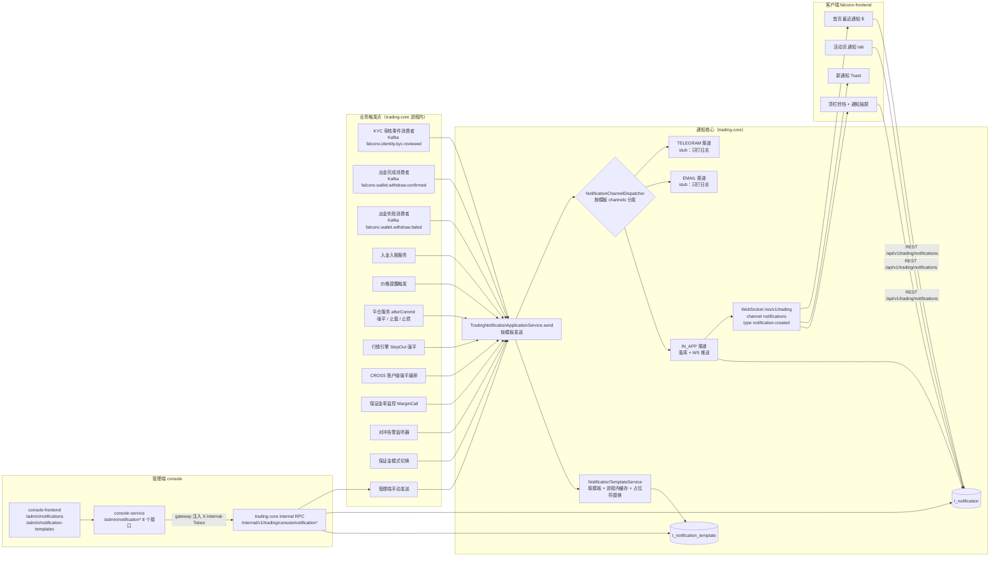

# FalconX 功能地图 · 通知与消息

- 版本：v1（2026-10-07）
- 变更历史：v1（2026-10-07）首次创建
- 依据：fxsystem main `da65af9`；对照代码逐项核实（未运行构建和测试）
- 范围：站内信（`t_notification`）的存储、列表、已读和 WebSocket 推送；通知模板（`t_notification_template`）、内置模板、模板渲染和缓存；发送渠道 SPI（站内信、邮件、Telegram）；全部业务触发点（触发代码位置、模板、幂等键）；管理端通知列表、模板管理、手动发送、权限和审计；客户端通知入口、列表、Toast；错误码 `30060-30065`、`90880-90887`。
  不覆盖：各触发点所在业务本身的逻辑（KYC 审核、出入金、价格提醒、平仓和强平、保证金率监控、对冲告警、保证金模式切换等），见对应业务分册；本册只写“业务事件发生后通知怎么发出去”。

## 一图看懂



这张图想让读者看懂：所有通知都在 trading-core 内由一个 `send(templateCode, …)` 入口发出，只有站内信（IN_APP）真正落库并推送，邮件和 Telegram 只打日志；管理端不直接访问数据库，而是经 console-service 调 trading-core 的 internal RPC。

## 功能清单

| 编号 | 功能 | 使用者 | 状态 |
| --- | --- | --- | --- |
| N-01 | 站内信数据模型（`t_notification`） | 系统 | 已实现 |
| N-02 | 用户通知列表与未读数接口 | 客户 | 已实现 |
| N-03 | 单条已读 / 全部已读 | 客户 | 已实现 |
| N-04 | WebSocket 实时推送 `notification.created` | 客户 | 已实现 |
| N-05 | 通知模板数据模型与 14 个内置模板 | 系统 / 运营 | 已实现 |
| N-06 | 模板读取、缓存和占位符替换 | 系统 | 已实现（多实例缓存不一致，见正文） |
| N-07 | 模板化发送 `send()` 与渠道分发 SPI | 系统 | 已实现 |
| N-08 | IN_APP 渠道（落库 + 推送） | 系统 | 已实现 |
| N-09 | EMAIL 渠道 | 系统 | stub/骨架 |
| N-10 | TELEGRAM 渠道 | 系统 | stub/骨架 |
| N-11 | 旧路径 `create()`（producer 自拼文案） | 系统 | 已实现（当前无任何调用方，遗留代码） |
| N-12 | 触发点：KYC 通过 / 驳回 | 客户 | 已实现 |
| N-13 | 触发点：出金完成 | 客户 | 已实现 |
| N-14 | 触发点：出金失败 | 客户 | 已实现 |
| N-15 | 触发点：入金到账 | 客户 | 已实现 |
| N-16 | 触发点：价格提醒触发 | 客户 | 已实现 |
| N-17 | 触发点：逐仓强平 `POSITION_LIQUIDATED` | 客户 | 已实现（落库可靠性未验证） |
| N-18 | 触发点：止盈 `POSITION_TP_HIT` | 客户 | 已实现（落库可靠性未验证） |
| N-19 | 触发点：止损 `POSITION_SL_HIT` | 客户 | 已实现（落库可靠性未验证） |
| N-20 | 触发点：StopOut 保证金强平 `STOP_OUT_TRIGGERED` | 客户 | 已实现 |
| N-21 | 触发点：CROSS 账户级强平 `CROSS_STOP_OUT_TRIGGERED` | 客户 | 已实现 |
| N-22 | 触发点：追保预警 `MARGIN_CALL_TRIGGERED` | 客户 | 已实现 |
| N-23 | 触发点：风控告警 `RISK_ACTION_TRIGGERED`（对冲敞口告警） | 客户 | 已实现 |
| N-24 | 触发点：保证金模式切换 `ACCOUNT_MODE_CHANGED` | 客户 | 已实现 |
| N-25 | 管理端：用户通知列表 / 详情 | 运营 | 部分实现 |
| N-26 | 管理端：模板管理（增删改查、启停） | 运营 | 部分实现 |
| N-27 | 管理端：手动发送（单个用户） | 运营 | 部分实现 |
| N-28 | 管理端：权限码、高危登记与审计 | 运营 / 审计 | 已实现 |
| N-29 | 客户端：顶栏铃铛 + 通知抽屉 | 客户 | 已实现（列表条数有缺陷） |
| N-30 | 客户端：活动页“通知”tab | 客户 | 部分实现 |
| N-31 | 客户端：首页“最近通知”卡 | 客户 | 已实现（条数有缺陷） |
| N-32 | 客户端：新通知 Toast | 客户 | 已实现 |
| N-33 | 客户端：通知偏好设置 | 客户 | 占位 |
| N-34 | 错误码 `30060-30065` / `90880-90887` | 系统 / 运营 | 部分实现 |
| N-35 | 群发通知（批量用户） | 运营 | 不做 |

---

## N-01 站内信数据模型（`t_notification`）

- **状态**：已实现。V19 建表，V22 加 `template_code` 列；MyBatis 映射完整。
- **使用者与入口**：无直接入口；由 IN_APP 渠道（N-08）写入，由 N-02、N-03、N-25 读取和更新。
- **业务逻辑**：
  1. 主键 `id` 为雪花 ID（`IdGenerator.nextId()`），在 `send()` 中生成；接口对外一律序列化成字符串（防 JS 精度丢失）。
  2. `title` / `body` 存最终渲染后的文案（不是模板），即模板以后被修改也不会影响历史通知。
  3. `type` 默认等于 `templateCode`（所有现有触发点都显式传入与模板码相同的 type）。
  4. `payload_json`：所有现有触发点和手动发送都传 `null`，该列在当前代码中始终为空。
  5. `related_key` + `related_id`：用于幂等查重（只有 KYC、出金两类触发点真正使用，见 N-12～N-14）和前端深链；**表上没有唯一约束**，幂等靠“先查后插”，并发下可能重复（见各触发点）。
  6. 时间：`created_at` 由应用以 UTC `LocalDateTime` 写入；读出时按 UTC 转 `OffsetDateTime`。
  7. 无任何归档或清理任务（未发现针对 `t_notification` 的 `@Scheduled` 或 SQL 清理），表会无限增长。
- **字段**：
  - 涉及的数据表（本域 owner，`falconx_trading` schema）：

    | 表.字段 | 类型 | 含义 | 约束/取值 |
    | --- | --- | --- | --- |
    | `t_notification.id` | BIGINT | 雪花主键 | PK |
    | `t_notification.user_id` | BIGINT | 接收用户 | NOT NULL |
    | `t_notification.type` | VARCHAR(64) | 业务类型码 | NOT NULL；当前取值 = 模板码 |
    | `t_notification.template_code` | VARCHAR(64) | 发送所用模板码 | 可空（V22 新增，NULL 表示旧路径 `create()` 写入）；索引 `idx_template_code` |
    | `t_notification.level` | TINYINT | 级别 | NOT NULL DEFAULT 1；1=INFO，2=WARN，3=CRITICAL |
    | `t_notification.title` | VARCHAR(255) | 标题（已渲染） | NOT NULL |
    | `t_notification.body` | VARCHAR(1024) | 正文（已渲染） | NOT NULL；注意模板正文上限 2048，渲染后超过 1024 会写库失败（未验证实际报错表现） |
    | `t_notification.related_key` | VARCHAR(64) | 关联业务类型 | 可空；取值见各触发点 |
    | `t_notification.related_id` | BIGINT | 关联业务实体 ID | 可空 |
    | `t_notification.payload_json` | TEXT | 附加结构化数据 | 可空；当前始终为 NULL |
    | `t_notification.status` | TINYINT | 已读状态 | NOT NULL DEFAULT 0；0=UNREAD，1=READ |
    | `t_notification.read_at` | DATETIME(3) | 已读时间 | 可空 |
    | `t_notification.created_at` | DATETIME(3) | 创建时间 | NOT NULL DEFAULT CURRENT_TIMESTAMP(3) |

    索引：`idx_user_created (user_id, created_at DESC)`、`idx_user_unread (user_id, status, created_at DESC)`、`idx_related (related_key, related_id)`、`idx_template_code (template_code)`。
  - 枚举取值：
    - `TradingNotificationLevel`：`INFO(1)` 普通通知；`WARN(2)` 警告；`CRITICAL(3)` 重要（客户端 Toast 居中、红色）。未知数值读出时回落 `INFO`。
    - `TradingNotificationStatus`：`UNREAD(0)`、`READ(1)`。未知数值回落 `UNREAD`。
- **状态机**：

  ```mermaid
  stateDiagram-v2
      [*] --> UNREAD: send() 经 IN_APP 渠道落库
      UNREAD --> READ: POST /{id}/read 或 POST /read-all（CAS：WHERE status=0）
      READ --> [*]
  ```

  没有 READ → UNREAD 的回退，也没有删除。
- **错误码**：无（模型本身）。
- **相关事件和定时任务**：无定时任务。
- **证据**：`falconx-trading-core-service/src/main/resources/db/migration/V19__notification.sql`、`V22__notification_template.sql`；`falconx-trading-core-service/src/main/java/com/falconx/trading/entity/TradingNotification.java`、`TradingNotificationLevel.java`、`TradingNotificationStatus.java`；`falconx-trading-core-service/src/main/resources/mapper/trading/TradingNotificationMapper.xml`；`repository/MybatisTradingNotificationRepository.java`。

## N-02 用户通知列表与未读数接口

- **状态**：已实现。
- **使用者与入口**：客户端 N-29 / N-30 / N-31 调用。
  - `GET /api/v1/trading/notifications`（trading-core，经 gateway `trading-route`；gateway 鉴权后注入 `X-User-Id`，controller 从该请求头取用户）。
  - `GET /api/v1/trading/notifications/unread-count`（同上）。
- **业务逻辑**：
  1. 只能查自己的通知：SQL 条件 `WHERE user_id = #{userId}`，userId 来自 `X-User-Id` 头。
  2. 排序：`ORDER BY created_at DESC, id DESC`。
  3. 分页：`page` 小于 1 时按 1；`size` 限制在 1～100，默认 20；`offset = (page-1)*size`。
  4. 每次列表请求同时做 3 条 SQL：分页查询、`COUNT(1)` 总数、未读数（`status = 0`）。
  5. 参数名是 `size`。客户端传的是 `pageSize`，后端不识别，总按默认 20 返回（见 N-29～N-31 的缺陷）。
  6. 无筛选条件（不能按类型、级别、已读状态筛）。
- **字段**：
  - 请求字段（列表）：

    | 字段 | 类型 | 必填 | 含义 | 约束/取值 |
    | --- | --- | --- | --- | --- |
    | `X-User-Id`（header） | long | 是 | 当前用户 | gateway 注入 |
    | `page` | int | 否 | 页码 | 默认 1，<1 按 1 |
    | `size` | int | 否 | 每页条数 | 默认 20，范围 1～100 |

  - 响应字段（列表 `data`，`NotificationListResponse`）：

    | 字段 | 类型 | 含义 |
    | --- | --- | --- |
    | `page` | int | 实际页码 |
    | `pageSize` | int | 实际每页条数 |
    | `total` | long | 该用户通知总数 |
    | `unread` | int | 该用户未读数 |
    | `items[]` | array | 通知项，结构如下 |
    | `items[].id` | string | 通知 ID |
    | `items[].type` | string | 业务类型 |
    | `items[].level` | string | `INFO` / `WARN` / `CRITICAL` |
    | `items[].title` | string | 标题 |
    | `items[].body` | string | 正文 |
    | `items[].relatedKey` | string\|null | 关联业务类型 |
    | `items[].relatedId` | string\|null | 关联实体 ID |
    | `items[].payloadJson` | string\|null | 附加数据（当前恒为 null） |
    | `items[].status` | string | `UNREAD` / `READ` |
    | `items[].readAt` | datetime\|null | 已读时间 |
    | `items[].createdAt` | datetime | 创建时间 |

    注意：用户侧响应**不含** `templateCode`（管理端响应才有）。
  - 响应字段（未读数 `data`）：`unread`（int）。
  - 涉及的数据表：见 N-01。
- **错误码**：缺 `X-User-Id` 头 → 400 `99004`（`TradingGlobalExceptionHandler` 处理 `ServletRequestBindingException`）。
- **相关事件和定时任务**：无。
- **证据**：`falconx-trading-core-service/src/main/java/com/falconx/trading/controller/TradingNotificationController.java`；`application/TradingNotificationApplicationService.java`（`list` / `count` / `countUnread`）；`falconx-gateway/src/main/java/com/falconx/gateway/config/GatewayConfiguration.java`（`/api/v1/trading/**` 路由）。

## N-03 单条已读 / 全部已读

- **状态**：已实现。
- **使用者与入口**：
  - `POST /api/v1/trading/notifications/{id}/read`（trading-core，`X-User-Id`）
  - `POST /api/v1/trading/notifications/read-all`（trading-core，`X-User-Id`）
- **业务逻辑**：
  1. 单条已读：`UPDATE … SET status=1, read_at=now(UTC) WHERE id=? AND user_id=? AND status=0`。条件同时校验归属和当前状态，天然幂等；改不到行（不存在、不是自己的、已读）不报错，返回 `updated=false`。
  2. 全部已读：`UPDATE … WHERE user_id=? AND status=0`，返回更新条数。
  3. 两个接口都在更新后再查一次未读数一起返回。
  4. 已读不推送 WebSocket；客户端靠 react-query 失效重新拉取。
- **字段**：
  - 请求字段：`id`（path，long，单条已读必填）；`X-User-Id`（header）。客户端会带空 JSON 体 `{}`，后端不读。
  - 响应字段：

    | 字段 | 类型 | 含义 |
    | --- | --- | --- |
    | `updated` | boolean（单条）/ int（全部） | 是否更新 / 更新条数 |
    | `unread` | int | 更新后的未读数 |

- **状态机**：见 N-01。
- **错误码**：无业务错误码；路径参数非数字 → 400 `99004`（未验证具体映射，按 Spring 默认推断）。
- **相关事件和定时任务**：无。
- **证据**：`TradingNotificationController.java`（`markRead` / `markAllRead`）；`TradingNotificationMapper.xml`（`markRead` / `markAllRead`）。

## N-04 WebSocket 实时推送 `notification.created`

- **状态**：已实现。
- **使用者与入口**：客户端连 `/ws/v1/trading`（gateway 握手鉴权后代理到 trading-core 同路径），发送 `subscribe` 订阅 channel `notifications`。客户端 `useTradingSocket` 默认订阅列表里包含 `notifications`。
- **业务逻辑**：
  1. IN_APP 渠道落库后立刻调用 `TradingUserRealtimePushService.publishNotificationCreated`，按 `userId` + channel `notifications` 广播到该用户所有已订阅会话。
  2. 推送失败（RuntimeException）只记 warn 日志，不影响落库；客户端下次拉列表可补。
  3. 推送发生在 `send()` 的事务提交**之前**（落库和推送在同一个方法里顺序执行）：若外层事务随后回滚（例如出金消费者、保证金模式切换），客户端可能已收到一条数据库里并不存在的通知（代码推断，未运行验证）。
  4. 推送失败、离线用户都不补发（没有离线消息队列），依赖客户端重新拉列表。
- **字段**：
  - 推送信封（`TradingUserWebSocketEnvelope`）：

    | 字段 | 类型 | 含义 |
    | --- | --- | --- |
    | `type` | string | 固定 `notification.created` |
    | `channel` | string | 固定 `notifications` |
    | `requestId` | string\|null | 推送时为 null |
    | `data` | object | 见下表 |
    | `ts` | datetime | 推送时间 |

  - `data` 字段：

    | 字段 | 类型 | 含义 |
    | --- | --- | --- |
    | `id` | string | 通知 ID |
    | `type` | string | 业务类型 |
    | `level` | string | `INFO` / `WARN` / `CRITICAL` |
    | `title` | string | 标题 |
    | `body` | string | 正文 |
    | `relatedKey` | string\|null | 关联业务类型 |
    | `relatedId` | string\|null | 关联实体 ID |
    | `status` | string | 恒为 `UNREAD` |
    | `createdAt` | datetime | 创建时间 |

    推送里不含 `payloadJson`、`templateCode`、`readAt`。
- **错误码**：无。
- **相关事件和定时任务**：WebSocket 推送 `notification.created`（channel `notifications`）。
- **证据**：`falconx-trading-core-service/src/main/java/com/falconx/trading/websocket/TradingUserRealtimePushService.java`（`publishNotificationCreated`）；`websocket/TradingUserWebSocketSessionRegistry.java`（`CHANNEL_NOTIFICATIONS`、`SUPPORTED_USER_CHANNELS`）；`websocket/TradingUserWebSocketEnvelope.java`；`falconx-frontend/src/features/trading/useTradingSocket.ts`。

## N-05 通知模板数据模型与 14 个内置模板

- **状态**：已实现。V22 建表并 seed 10 个，V31 补 2 个，V34 补 1 个，V36 补 1 个，共 14 个。
- **使用者与入口**：运营经 N-26 维护；系统经 N-06 读取。
- **业务逻辑**：
  1. `code` 是主键，也是 producer 调 `send()` 时传的模板码。
  2. `channels` 以 CSV 存储（如 `IN_APP,EMAIL`）；读出时逐项 `trim + toUpperCase` 解析，不认识的值丢弃；结果为空或列为空时回落 `[IN_APP]`。写入时 channels 为空也写 `IN_APP`。
  3. `enabled=0` 时，producer 调 `send()` 会抛 `30060`（视同不存在）。
  4. 14 个 seed 模板的 `channels` 全部只有 `IN_APP`，`enabled` 全部为 1。
- **字段**：
  - 涉及的数据表（本域 owner）：

    | 表.字段 | 类型 | 含义 | 约束/取值 |
    | --- | --- | --- | --- |
    | `t_notification_template.code` | VARCHAR(64) | 模板码 | PK；管理端新建时须匹配 `^[A-Z][A-Z0-9_]{2,63}$` |
    | `t_notification_template.title_template` | VARCHAR(255) | 标题模板，含 `${var}` | NOT NULL |
    | `t_notification_template.body_template` | VARCHAR(2048) | 正文模板，含 `${var}` | NOT NULL |
    | `t_notification_template.level` | TINYINT | 级别 | NOT NULL DEFAULT 1；1/2/3 同 N-01 |
    | `t_notification_template.channels` | VARCHAR(128) | 投递渠道 CSV | NOT NULL DEFAULT `'IN_APP'`；元素 `IN_APP` / `EMAIL` / `TELEGRAM` |
    | `t_notification_template.description` | VARCHAR(512) | 运营备注 | 可空 |
    | `t_notification_template.enabled` | TINYINT | 是否启用 | NOT NULL DEFAULT 1；0=禁用（软删除也是置 0） |
    | `t_notification_template.created_at` | DATETIME(3) | 创建时间 | NOT NULL DEFAULT CURRENT_TIMESTAMP(3) |
    | `t_notification_template.updated_at` | DATETIME(3) | 更新时间 | NOT NULL，ON UPDATE CURRENT_TIMESTAMP(3) |

    索引：`idx_enabled (enabled)`。
  - 枚举取值：`NotificationChannel`：`IN_APP`（站内信，真实落库 + 推送）、`EMAIL`（stub）、`TELEGRAM`（stub）。
  - 内置模板（以迁移脚本为准，共 14 个）：

    | # | `code` | 来源 | level | 标题模板 | 正文模板 | 占位符 | 触发场景（见） |
    | --- | --- | --- | --- | --- | --- | --- | --- |
    | 1 | `PRICE_ALERT_TRIGGERED` | V22 | INFO | `价格告警：${symbol} ${direction} ${targetPrice}` | `${symbol} ${direction} ${targetPrice} → 现价 ${markPrice}${exhaustSuffix}${noteSuffix}` | symbol, direction, targetPrice, markPrice, exhaustSuffix, noteSuffix | 价格提醒触发（N-16） |
    | 2 | `POSITION_LIQUIDATED` | V22 | CRITICAL | `⚠️ ${symbol} ${side} 被强平` | `${symbol} ${side} 在 ${closePrice} 被强平，实现盈亏 ${pnl}` | symbol, side, closePrice, pnl | 逐仓强平（N-17） |
    | 3 | `POSITION_TP_HIT` | V22 | INFO | `${symbol} ${side} 止盈触发` | `${symbol} ${side} 止盈触发，平仓价 ${closePrice}，实现盈亏 ${pnl}` | 同上 | 止盈（N-18） |
    | 4 | `POSITION_SL_HIT` | V22 | WARN | `${symbol} ${side} 止损触发` | `${symbol} ${side} 止损触发，平仓价 ${closePrice}，实现盈亏 ${pnl}` | 同上 | 止损（N-19） |
    | 5 | `KYC_APPROVED` | V22 | INFO | `KYC 已通过` | `您的 KYC 认证已通过审核，现在可以正常使用全部功能。` | 无 | KYC 通过（N-12） |
    | 6 | `KYC_REJECTED` | V22 | WARN | `KYC 未通过` | `您的 KYC 认证未通过：${rejectReason}` | rejectReason | KYC 驳回（N-12） |
    | 7 | `WITHDRAW_COMPLETED` | V22 | INFO | `出金已完成` | `您的出金 ${amount} ${currency} 已链上确认。` | amount, currency | 出金完成（N-13） |
    | 8 | `WITHDRAW_FAILED` | V22 | WARN | `出金失败` | `您的出金 ${amount} ${currency} 处理失败：${failureReason}。已退回冻结资金。` | amount, currency, failureReason | 出金失败（N-14） |
    | 9 | `DEPOSIT_CREDITED` | V22 | INFO | `入金到账` | `${amount} ${currency} 已入账（${chain} ${txHash}）` | amount, currency, chain, txHash | 入金到账（N-15） |
    | 10 | `RISK_ACTION_TRIGGERED` | V22 | WARN | `风控告警：${actionType}` | `${reason}` | actionType, reason | 对冲敞口告警（N-23） |
    | 11 | `MARGIN_CALL_TRIGGERED` | V31 | WARN | `保证金预警` | `您的账户保证金率 ${marginLevel}% 已低于预警线，请及时补充保证金或减仓` | marginLevel | 追保预警（N-22） |
    | 12 | `STOP_OUT_TRIGGERED` | V31 | CRITICAL | `强制平仓` | `您的账户保证金率 ${marginLevel}% 触发强平线，已强平仓位 ${symbol}` | marginLevel, symbol | StopOut 强平（N-20） |
    | 13 | `ACCOUNT_MODE_CHANGED` | V34 | INFO | `保证金模式已切换` | `您的保证金模式已从 ${oldMode} 切换为 ${newMode}` | oldMode, newMode | 保证金模式切换（N-24） |
    | 14 | `CROSS_STOP_OUT_TRIGGERED` | V36 | CRITICAL | `账户强制平仓` | `您的账户保证金率 ${marginLevel}% 触发强平线，已强平 ${count} 个仓位：${symbols}` | marginLevel, count, symbols | CROSS 账户级强平（N-21） |

    “内置保护”（禁止删除）只按前缀判断：`PRICE_ALERT_`、`POSITION_`、`KYC_`、`WITHDRAW_`、`DEPOSIT_`、`RISK_`。第 11～14 个模板（`MARGIN_CALL_`、`STOP_OUT_`、`ACCOUNT_`、`CROSS_` 开头）**不在保护范围内，可以被管理端软删除**；而 14 个模板全部可以被“编辑”成 `enabled=false`（见 N-26）。
- **错误码**：见 N-26、N-34。
- **相关事件和定时任务**：无。
- **证据**：`falconx-trading-core-service/src/main/resources/db/migration/V22__notification_template.sql`、`V31__risk_config_thresholds_fx_pause_behavior.sql`、`V34__seed_account_mode_changed_notification.sql`、`V36__seed_cross_stop_out_notification.sql`；`entity/TradingNotificationTemplate.java`、`entity/NotificationChannel.java`；`repository/MybatisTradingNotificationTemplateRepository.java`；`mapper/trading/TradingNotificationTemplateMapper.xml`；`application/AdminTradingNotificationApplicationService.java`（`BUILT_IN_PREFIXES`）。

## N-06 模板读取、缓存和占位符替换

- **状态**：已实现；缓存为进程内无 TTL，多实例下会不一致。
- **使用者与入口**：`NotificationTemplateService`，被 `send()`（N-07）和管理端模板接口（N-26）调用。
- **业务逻辑**：
  1. 缓存：`ConcurrentHashMap<code, template>`，**无 TTL**，首次读库后 `putIfAbsent`。禁用的模板也会被缓存。
  2. 失效：只有本实例的管理端新建、编辑、软删除会调 `evict(code)`；`evictAll()` 存在但没有调用方。多实例部署时，A 实例修改模板后，B 实例要等重启才会读到新内容（代码注释也承认，计划“后续切 Redis”）。直接改数据库也不会生效，需重启。
  3. `getRequiredEnabled(code)`：缓存命中且 enabled → 返回；命中但 disabled → 抛 `30060`；未命中则读库，不存在 → `30060`，存在但 disabled → 缓存后抛 `30060`。代码中从未抛 `30065`。
  4. 渲染 `render(template, params)`：
     - 规则：对 params 中每个键值对做 `String.replace("${key}", value)`，键或值为 null 的跳过。纯字符串替换，无转义、无格式化、无表达式、无 HTML 处理。
     - 未提供的占位符**原样保留**（如 `${symbol}` 直接显示给用户），并对每个残留 `${…}` 记 warn 日志 `trading.notification.template.render.missing-param`。
     - params 为 null 或空时直接返回原模板（同样记 warn）。
     - 替换值里如果本身含 `${x}` 且 x 也在 params 中，结果取决于 Map 遍历顺序（理论风险，未验证）。
  5. 数字格式化由各 producer 自己做（如 `toPlainString()`、2 位 HALF_UP），模板不管。
- **字段**：无对外字段。
- **错误码**：`30060`（模板不存在或已禁用）。
- **相关事件和定时任务**：无。
- **证据**：`falconx-trading-core-service/src/main/java/com/falconx/trading/application/NotificationTemplateService.java`。

## N-07 模板化发送 `send()` 与渠道分发 SPI

- **状态**：已实现。
- **使用者与入口**：进程内 API：`TradingNotificationApplicationService.send(templateCode, userId, type, params, relatedKey, relatedId, payloadJson)`；另有简化重载 `send(templateCode, userId, params)`（type=templateCode，无关联字段）。全部 12 类业务触发点和管理端手动发送都走这里。
- **业务逻辑**：
  1. 方法加 `@Transactional`（默认传播 REQUIRED）：调用方已有事务时加入调用方事务。
  2. 取模板 `getRequiredEnabled`；不存在或禁用直接抛 `TradingBusinessException(30060)`，**异常会向调用方传播**——各触发点是否捕获见 N-12～N-24。
  3. 渲染 title、body（N-06）。
  4. 构造通知：`id` 新雪花 ID，`type` 为空时取 templateCode，`level` 取模板级别，`status=UNREAD`，`createdAt=now(UTC)`。
  5. 遍历模板 `channels`，对每个渠道在 Spring 注入的 `List<NotificationChannelDispatcher>` 中找第一个 `supports(channel)=true` 的实现调用 `dispatch`；找不到记 warn 继续。
  6. 渠道之间没有隔离：某个 dispatcher 抛异常会中断后续渠道，并让 `send()` 抛出（IN_APP 写库失败就是这种情况）。
  7. 返回值是第 4 步构造的对象。**如果模板 channels 不含 IN_APP，通知不会落库，但仍返回一个带 ID 的对象**（管理端手动发送时会显示一个查不到的通知 ID）。
  8. 不做用户存在性校验，不做频率限制（只有追保预警在调用方做了 5 分钟节流，见 N-22），不做去重（去重由调用方用 `existsByRelated` 自己做）。
- **字段**：

  | 参数 | 类型 | 必填 | 含义 | 约束/取值 |
  | --- | --- | --- | --- | --- |
  | `templateCode` | String | 是 | 模板码 | 须存在且启用 |
  | `userId` | long | 是 | 接收用户 | 不校验存在性 |
  | `type` | String | 否 | 业务类型 | null 时 = templateCode |
  | `params` | Map<String,String> | 否 | 占位符取值 | 见 N-06 |
  | `relatedKey` | String | 否 | 关联业务类型 | 各触发点取值见下 |
  | `relatedId` | Long | 否 | 关联实体 ID | |
  | `payloadJson` | String | 否 | 附加数据 | 当前全部调用方传 null |

- **错误码**：`30060`。
- **相关事件和定时任务**：经 IN_APP 渠道推送 WebSocket（N-04）。
- **证据**：`application/TradingNotificationApplicationService.java`（`send`）；`notification/NotificationChannelDispatcher.java`。

## N-08 IN_APP 渠道（落库 + 推送）

- **状态**：已实现。
- **使用者与入口**：`InAppNotificationDispatcher`（`@Component`，`supports(IN_APP)`）。
- **业务逻辑**：
  1. `repository.insert(notification)` 写 `t_notification`；失败直接抛出（属于业务关键路径）。
  2. 写库后调 `publishNotificationCreated` 推 WebSocket；推送异常只记 warn。
  3. 日志：`trading.notification.in_app.persisted`、`trading.notification.in_app.push-failed`。
- **字段**：见 N-01、N-04。
- **错误码**：无。
- **相关事件和定时任务**：WebSocket `notification.created`。
- **证据**：`falconx-trading-core-service/src/main/java/com/falconx/trading/notification/InAppNotificationDispatcher.java`。

## N-09 EMAIL 渠道

- **状态**：stub/骨架。`StubEmailNotificationDispatcher.dispatch` 只打一行 info 日志 `trading.notification.email.stub userId=… type=… templateCode=… title='…' (not actually sent)`，不发邮件、不落库、不记录投递状态。
- **使用者与入口**：模板 `channels` 含 `EMAIL` 时被调用。14 个内置模板都不含 EMAIL；运营可在模板管理里勾选 EMAIL，但不会有任何效果。
- **业务逻辑**：无 SMTP/SES 等配置项（`application.yml` 中未发现邮件发送相关配置）；没有用户邮箱查询（trading-core 不持有用户邮箱）。
- **字段**：无。
- **错误码**：无。
- **相关事件和定时任务**：无。
- **证据**：`notification/StubEmailNotificationDispatcher.java`；`entity/NotificationChannel.java` 注释“EMAIL / TELEGRAM 为 stub，仅 log”。

## N-10 TELEGRAM 渠道

- **状态**：stub/骨架。`StubTelegramNotificationDispatcher.dispatch` 只打 info 日志 `trading.notification.telegram.stub … (not actually sent)`。
- **使用者与入口**：模板 `channels` 含 `TELEGRAM` 时被调用；内置模板都不含。
- **业务逻辑**：无 Bot Token 配置、无用户 Telegram 账号绑定表、无发送代码。
- **字段**：无。
- **错误码**：无。
- **相关事件和定时任务**：无。
- **证据**：`notification/StubTelegramNotificationDispatcher.java`。

## N-11 旧路径 `create()`（producer 自拼文案）

- **状态**：代码存在且可用（已实现），但**当前没有任何调用方**（全仓库检索 `notificationService.create(` 无结果，所有触发点已迁到 `send()`）。属于遗留代码。
- **使用者与入口**：`TradingNotificationApplicationService.create(userId, type, level, title, body, relatedKey, relatedId, payloadJson)`。
- **业务逻辑**：不经模板，直接落库（`template_code=NULL`）并推 WebSocket，推送失败只记 warn；level 为 null 时按 INFO。不经过渠道 SPI（只有站内信）。
- **字段**：见 N-01。
- **错误码**：无。
- **相关事件和定时任务**：WebSocket `notification.created`。
- **证据**：`application/TradingNotificationApplicationService.java`（`create`）。

---

> 下面 N-12～N-24 是业务触发点。每条只写“何时、调用哪个模板、传什么参数、幂等键是什么、失败怎么处理”；业务本身见其他分册。

### 触发点汇总

| 编号 | 模板 / type | 触发代码位置 | relatedKey | relatedId | 去重方式 | send 失败的影响 |
| --- | --- | --- | --- | --- | --- | --- |
| N-12 | `KYC_APPROVED` / `KYC_REJECTED` | `consumer/KycReviewedEventConsumer.java` `consume`（约第 67 行） | `kyc.reviewed` | `submissionId` | `existsByRelated` 先查后插 | 异常抛出，交上层 Kafka listener（DLQ） |
| N-13 | `WITHDRAW_COMPLETED` | `consumer/WalletWithdrawConfirmedEventConsumer.java` `consume`（约第 91 行） | `withdraw.confirmed` | `withdrawId` | `existsByRelated` + 出金单 CAS | 未捕获，**整个出金结算事务回滚** |
| N-14 | `WITHDRAW_FAILED` | `consumer/WalletWithdrawFailedEventConsumer.java` `consume`（约第 90 行） | `withdraw.failed` | `withdrawId` | `existsByRelated` + 出金单 CAS | 未捕获，**整个退冻事务回滚** |
| N-15 | `DEPOSIT_CREDITED` | `application/TradingDepositCreditApplicationService.java` `creditConfirmedDeposit`（约第 192 行） | `DEPOSIT` | `depositId` | 依赖入金本身的幂等（inbox / walletTxId，见入金分册） | try/catch 记 warn；但同事务内，见正文 |
| N-16 | `PRICE_ALERT_TRIGGERED` | `application/TradingPriceAlertApplicationService.java` `trigger`（约第 213 行） | `PRICE_ALERT` | `alertId` | 价格提醒 `trigger_count` CAS；每次触发一条，最多 3 条 | 未捕获，触发事务回滚，引擎捕获后记 error |
| N-17 | `POSITION_LIQUIDATED` | `application/TradingPositionCloseApplicationService.java` `publishPositionNotification`（约第 712 行，平仓事务 afterCommit 回调） | `POSITION` | `positionId` | 无（平仓本身只成功一次） | try/catch 记 warn |
| N-18 | `POSITION_TP_HIT` | 同上 | `POSITION` | `positionId` | 同上 | 同上 |
| N-19 | `POSITION_SL_HIT` | 同上 | `POSITION` | `positionId` | 同上 | 同上 |
| N-20 | `STOP_OUT_TRIGGERED` | `engine/QuoteDrivenEngine.java` `sendStopOutNotification`（约第 457 行，调用点约第 256 行） | `RISK` | `positionId` | 无（平仓成功才发） | try/catch 记 warn |
| N-21 | `CROSS_STOP_OUT_TRIGGERED` | `application/CrossLiquidationOrchestrator.java` `sendCrossStopOutNotification`（约第 258 行） | `ACCOUNT` | `accountId` | 无（每次账户级强平且平掉 ≥1 仓发一条） | try/catch 记 warn |
| N-22 | `MARGIN_CALL_TRIGGERED` | `service/impl/DefaultMarginLevelMonitor.java` `maybeSendMarginCall`（约第 119 行） | `RISK` | null | 进程内 5 分钟/用户节流 | **未捕获**，向调用方传播 |
| N-23 | `RISK_ACTION_TRIGGERED` | `consumer/TradingHedgeAlertEventListener.java` `onHedgeAlert`（约第 53 行） | `RISK` | `hedgeLogId` | 无 | try/catch 记 warn（逐用户） |
| N-24 | `ACCOUNT_MODE_CHANGED` | `application/MarginModeSwitchApplicationService.java`（约第 192 行） | `ACCOUNT` | `accountId` | 无（切换本身有冷静期） | 未捕获，切换事务回滚，用户收到 `30060` |
| N-27 | 运营选的任意模板 | `application/AdminTradingNotificationApplicationService.java` `sendManual` | `ADMIN_MANUAL` | null | 无 | 异常经 RPC 返回给管理端 |

一个关键风险（代码推断，未运行验证）：模板可以被管理端编辑成 `enabled=false`（包括 KYC、出金等受“删除保护”的模板，保护只拦删除不拦禁用）。禁用后 `send()` 抛 `30060`，按上表“send 失败的影响”一列，会导致出金结算回滚并反复重试、保证金模式切换失败、行情 tick 处理中断（N-22）等业务故障，而不仅仅是“少发一条通知”。

## N-12 触发点：KYC 通过 / 驳回

- **状态**：已实现。
- **使用者与入口**：identity-service 审核完成后经 Kafka 发布 `falconx.identity.kyc.reviewed`；trading-core 消费组 `falconx.trading-core-service.kyc-reviewed-consumer-group` 消费后调 `KycReviewedEventConsumer.consume`。
- **业务逻辑**：
  1. payload 缺 `submissionId` / `userId` / `result` → 抛 `IllegalArgumentException`（由上层 listener 处理，注释说进 DLQ；未验证）。
  2. 幂等：`existsByRelated("kyc.reviewed", submissionId)` 为真则跳过。先查后插，无唯一约束，同一事件并发投递时理论上可能重复。
  3. `result=APPROVED` → `KYC_APPROVED`，params 为空 Map；`result=REJECTED` → `KYC_REJECTED`，`rejectReason` 为空或空白时用默认文案“审核未通过，请重新提交。”；其他 result → 抛 `IllegalArgumentException`。
  4. `consume` 方法本身没有 `@Transactional`，`send()` 自带事务。
- **字段**：params 见 N-05 第 5、6 行。
- **错误码**：模板禁用时 `30060` 抛出。
- **相关事件和定时任务**：消费 Kafka `falconx.identity.kyc.reviewed`；WebSocket `notification.created`。
- **证据**：`falconx-trading-core-service/src/main/java/com/falconx/trading/consumer/KycReviewedEventConsumer.java`；`falconx-identity-contract/src/main/java/com/falconx/identity/contract/event/KycReviewedEventPayload.java`；`falconx-trading-core-service/src/main/resources/application.yml`（`kyc-reviewed-topic`）。

## N-13 触发点：出金完成

- **状态**：已实现。
- **使用者与入口**：消费 Kafka `falconx.wallet.withdraw.confirmed`（消费组 `falconx.trading-core-service.wallet-withdraw-confirmed-consumer-group`）。
- **业务逻辑**：
  1. 方法 `@Transactional`。先 `existsByRelated("withdraw.confirmed", withdrawId)` 去重；再校验出金单存在且为 `PROCESSING`，CAS 改 `COMPLETED`，结算账户（扣 balance 和 frozen），然后 `send("WITHDRAW_COMPLETED")`。
  2. params：`amount = order.amount().toPlainString()`、`currency = order.currency()`。
  3. `send()` 在同一事务中且未捕获：模板被禁用时整笔结算回滚（推断）。
  4. 通知之后再 best-effort 推送管理端 `admin.withdraws`（不属于本域）。
- **字段**：params 见 N-05 第 7 行。
- **错误码**：`30060`（未捕获）。
- **相关事件和定时任务**：消费 Kafka `falconx.wallet.withdraw.confirmed`；WebSocket `notification.created`。
- **证据**：`consumer/WalletWithdrawConfirmedEventConsumer.java`。

## N-14 触发点：出金失败

- **状态**：已实现。
- **使用者与入口**：消费 Kafka `falconx.wallet.withdraw.failed`（消费组 `falconx.trading-core-service.wallet-withdraw-failed-consumer-group`）。
- **业务逻辑**：
  1. `@Transactional`。`existsByRelated("withdraw.failed", withdrawId)` 去重；出金单已是 `FAILED/COMPLETED/CANCELED/REJECTED` 终态跳过；CAS 改 `FAILED`，退回冻结资金，然后 `send("WITHDRAW_FAILED")`。
  2. params：`amount`、`currency`、`failureReason`（payload 为 null 时用 `wallet chain failure`，这是英文技术文案，会直接显示给用户）。
  3. `send()` 未捕获，同 N-13。
- **字段**：params 见 N-05 第 8 行。
- **错误码**：`30060`（未捕获）。
- **相关事件和定时任务**：消费 Kafka `falconx.wallet.withdraw.failed`；WebSocket `notification.created`。
- **证据**：`consumer/WalletWithdrawFailedEventConsumer.java`。
- **补充**：管理端驳回出金（`REJECTED`）、用户取消出金不发站内信（检索代码未发现对应 `send` 调用；业务见出金分册）。

## N-15 触发点：入金到账

- **状态**：已实现。
- **使用者与入口**：`TradingDepositCreditApplicationService.creditConfirmedDeposit`（消费钱包 `falconx.wallet.deposit.confirmed` 后调用）。
- **业务逻辑**：
  1. 在入金入账事务内、写完入金记录、账户、outbox、inbox 之后调用 `send("DEPOSIT_CREDITED")`。
  2. params：`amount`（`toPlainString`）、`currency`（= token）、`chain`（链枚举名）、`txHash`。
  3. `send()` 被 try/catch 包住，异常只记 warn `trading.deposit.notification.send.failed`。
  4. 风险（推断，未验证）：`send()` 是带 `@Transactional` 的另一个 bean 方法，加入了外层事务；它抛出的 RuntimeException 会把外层事务标记为 rollback-only，即使被 catch，外层提交时也可能抛 `UnexpectedRollbackException` 导致整笔入账回滚。注释“通知失败不阻塞入金事实落库”的意图可能达不到。
  5. 幂等：通知本身不去重，依赖入账流程的幂等（见入金分册）。
- **字段**：params 见 N-05 第 9 行。
- **错误码**：`30060`（被捕获）。
- **相关事件和定时任务**：WebSocket `notification.created`。
- **证据**：`application/TradingDepositCreditApplicationService.java`。
- **补充**：入金冲正（`falconx.wallet.deposit.reversed`）不发站内信（未发现调用）。

## N-16 触发点：价格提醒触发

- **状态**：已实现。
- **使用者与入口**：行情 tick → `QuoteDrivenEngine.triggerPriceAlerts` → `TradingPriceAlertApplicationService.trigger(alertId, markPrice)`。
- **业务逻辑**：
  1. `trigger` 为 `@Transactional`；`trigger_count` CAS 成功后，先推 WebSocket `price.alert.triggered`（channel `price-alerts`，不属于本域），再 `send("PRICE_ALERT_TRIGGERED")`。
  2. params：
     - `symbol`；
     - `direction`：`ABOVE` → “向上穿透”，否则 “向下穿透”；
     - `targetPrice`、`markPrice`（`toPlainString`）；
     - `exhaustSuffix`：用完 3 次时“（已用完 3 次）”，否则“（剩余 N 次）”（`MAX_TRIGGER_COUNT = 3`）；
     - `noteSuffix`：备注为空时为空字符串，否则“：备注”。
  3. 每条提醒最多触发 3 次，每次一条站内信。
  4. `send()` 未捕获：失败时整次触发回滚（trigger_count 不增加），引擎捕获异常记 error，下一 tick 会再次尝试。
  5. 客户端同时收到 `price.alert.triggered` 和 `notification.created` 两个推送；Toast 只有一个槽位，后到的覆盖先到的（见 N-32）。
- **字段**：params 见 N-05 第 1 行。
- **错误码**：`30060`（未捕获）。
- **相关事件和定时任务**：WebSocket `notification.created`。
- **证据**：`application/TradingPriceAlertApplicationService.java`；`engine/QuoteDrivenEngine.java`（`triggerPriceAlerts`）。

## N-17 触发点：逐仓强平 `POSITION_LIQUIDATED`

- **状态**：已实现（代码已接通）；**落库能否可靠提交未验证**，见第 4 条。
- **使用者与入口**：平仓服务在平仓事务中注册 `TransactionSynchronization.afterCommit`，回调里调 `publishPositionNotification`。
- **业务逻辑**：
  1. 按持仓 `closeReason` 选模板：`LIQUIDATION` → `POSITION_LIQUIDATED`；`TAKE_PROFIT` → `POSITION_TP_HIT`；`STOP_LOSS` → `POSITION_SL_HIT`；`CROSS_STOP_OUT` → 不发（由 N-21 汇总）；`MANUAL` → 不发（注释：手动平仓由前端 Toast 提示）。
  2. params：`symbol`；`side`：BUY → “多”，否则“空”；`closePrice`：成交价 `toPlainString`，null 时“—”；`pnl`：`realizedPnl`，≥0 前加“+”，null 时“—”。
  3. send 被 try/catch，失败记 warn `trading.position.notification.send.failed`。
  4. 风险（推断，未验证）：Spring 在 afterCommit 回调里，原事务的连接仍绑定在线程上；`send()` 使用默认 REQUIRED 传播，可能“加入”已提交的事务而不再单独提交，导致这条 INSERT 最终不落库。代码中没有用 `REQUIRES_NEW`。仓库内没有测试断言 `POSITION_LIQUIDATED/TP/SL` 通知确实落库（CROSS 强平测试只断言“没有” `POSITION_LIQUIDATED`）。需要实测确认。
  5. StopOut 引起的逐仓强平（closeReason 也是 `LIQUIDATION`）会同时收到本条和 N-20 两条通知。
  6. 管理端手动强平走哪个 closeReason、是否发本通知，未验证（见交易分册）。
- **字段**：params 见 N-05 第 2 行。
- **错误码**：`30060`（被捕获）。
- **相关事件和定时任务**：WebSocket `notification.created`（另有 `position` 相关推送不属于本域）。
- **证据**：`application/TradingPositionCloseApplicationService.java`（`registerSnapshotRemoval`、`publishPositionNotification`）；`entity/TradingPositionCloseReason.java`。

## N-18 触发点：止盈 `POSITION_TP_HIT`

- **状态**：已实现（落库可靠性未验证，同 N-17 第 4 条）。
- **使用者与入口**：同 N-17，closeReason = `TAKE_PROFIT`。
- **业务逻辑**：同 N-17。
- **字段**：params 见 N-05 第 3 行。
- **错误码**：同 N-17。
- **相关事件和定时任务**：同 N-17。
- **证据**：同 N-17。

## N-19 触发点：止损 `POSITION_SL_HIT`

- **状态**：已实现（落库可靠性未验证，同 N-17 第 4 条）。
- **使用者与入口**：同 N-17，closeReason = `STOP_LOSS`。
- **业务逻辑**：同 N-17。
- **字段**：params 见 N-05 第 4 行。
- **错误码**：同 N-17。
- **相关事件和定时任务**：同 N-17。
- **证据**：同 N-17。

## N-20 触发点：StopOut 保证金强平 `STOP_OUT_TRIGGERED`

- **状态**：已实现（有集成测试 `TradingMarginLevelStopOutIntegrationTests` 断言该类型通知计数）。
- **使用者与入口**：`QuoteDrivenEngine` 处理 ISOLATED 持仓时，`AccountMarginEvaluator.stopOutMarginLevel` 返回非 null（触发 StopOut）且 `closePositionByTrigger` 成功后调用 `sendStopOutNotification`。
- **业务逻辑**：
  1. 只有 StopOut 路径发；纯强平价（liqPrice）命中不发本通知。
  2. params：`marginLevel`（百分比，2 位 HALF_UP，如 `25.34`），`symbol`；`marginLevel` 为 null 时只传 `symbol`（模板里 `${marginLevel}` 原样残留）。
  3. try/catch 记 warn。引擎方法本身无 `@Transactional`。
- **字段**：params 见 N-05 第 12 行。
- **错误码**：`30060`（被捕获）。
- **相关事件和定时任务**：行情 tick 驱动；WebSocket `notification.created`。
- **证据**：`engine/QuoteDrivenEngine.java`（约第 205、256、457 行）；`engine/AccountMarginEvaluator.java`。

## N-21 触发点：CROSS 账户级强平 `CROSS_STOP_OUT_TRIGGERED`

- **状态**：已实现（`CrossLiquidationIntegrationTests` 断言计数 + 不发逐仓通知）。
- **使用者与入口**：`CrossLiquidationOrchestrator` 对 CROSS 账户逐仓强平结束后，若平掉的仓位数 > 0 调 `sendCrossStopOutNotification`。
- **业务逻辑**：
  1. params：`marginLevel`（触发时账户保证金率，2 位 HALF_UP；null 时“—”）、`count`（本次平掉的仓数）、`symbols`（去重品种，以“, ”连接）。
  2. 一次账户级强平只发一条；逐仓平仓（closeReason `CROSS_STOP_OUT`）不再发 `POSITION_LIQUIDATED`。
  3. try/catch 记 warn。
- **字段**：params 见 N-05 第 14 行。
- **错误码**：`30060`（被捕获）。
- **相关事件和定时任务**：行情 tick 驱动；WebSocket `notification.created`。
- **证据**：`application/CrossLiquidationOrchestrator.java`；`application/TradingPositionCloseApplicationService.java`（`CROSS_STOP_OUT` 分支）。

## N-22 触发点：追保预警 `MARGIN_CALL_TRIGGERED`

- **状态**：已实现（`DefaultMarginLevelMonitorTests` 覆盖）。
- **使用者与入口**：`DefaultMarginLevelMonitor.evaluate` 判定 `stopOutLevel < 保证金率 ≤ marginCallLevel` 时调用 `maybeSendMarginCall`。`evaluate` 的调用方有两个：
  - 行情引擎逐仓评估（`AccountMarginEvaluator.stopOutMarginLevel`）；
  - 账户响应组装 `TradingAccountSnapshotApplicationService.toResponse`（REST 查账户、WS 账户快照、`account.update` 推送共用）。也就是说**用户查看账户也可能触发追保站内信**。
- **业务逻辑**：
  1. 阈值来自 `t_risk_config` 平台行 `stop_out_level` / `margin_call_level`（默认 0.30 / 1.00，本地缓存 30 秒），见风控分册。
  2. 节流：进程内 `ConcurrentHashMap<userId, 上次发送时间>`，同一用户 5 分钟内只发一次。多实例各自节流；重启后清零；**先写节流时间再发送**，发送失败也会进入 5 分钟静默。
  3. params：`marginLevel`（百分比数值 `toPlainString`，未统一小数位）。
  4. `send()` **未捕获**：失败会向上抛。在行情引擎中，该调用位于逐仓 try 块之外，异常会中断本 tick 后续持仓的处理（推断，未验证）；在账户查询中会让接口报错（推断）。
  5. relatedId 为 null，无法关联到具体账户或仓位。
- **字段**：params 见 N-05 第 11 行。
- **错误码**：`30060`（未捕获）。
- **相关事件和定时任务**：行情 tick 和账户查询驱动；WebSocket `notification.created`。
- **证据**：`service/impl/DefaultMarginLevelMonitor.java`；`engine/AccountMarginEvaluator.java`；`application/TradingAccountSnapshotApplicationService.java`（`toResponse`）。

## N-23 触发点：风控告警 `RISK_ACTION_TRIGGERED`（对冲敞口告警）

- **状态**：已实现。
- **使用者与入口**：`DefaultTradingRiskObservabilityService` 判定某品种平台净敞口超过对冲阈值、写对冲日志且状态为 `ALERT_ONLY` 时，事务提交后发布进程内事件 `TradingHedgeAlertEvent`；`TradingHedgeAlertEventListener.onHedgeAlert`（`@EventListener`）处理。
- **业务逻辑**：
  1. 查出该品种**所有持有未平仓头寸的用户**，逐个：推 WS `risk.warning`（channel `positions`，不属于本域），再 `send("RISK_ACTION_TRIGGERED")`。
  2. params：`actionType` = 事件 `triggerSource` 枚举名（`OPEN_POSITION` / `MANUAL_CLOSE` / `TAKE_PROFIT` / `STOP_LOSS` / `LIQUIDATION` / `PRICE_TICK`；null 时 `HEDGE_ALERT`）；`reason` = “{symbol} 净敞口 {netExposureUsd} USD 超过阈值 {hedgeThresholdUsd} USD”。
  3. 结果：客户看到的标题类似“风控告警：OPEN_POSITION”，正文包含**平台对该品种的净敞口金额和对冲阈值**。这是 B-Book 平台内部风控数据，直接发给了客户（代码事实，是否符合产品意图需 Amos 判断）。
  4. 每个用户的 send 单独 try/catch；整体再 try/catch 记 error。
  5. 发送频率取决于对冲日志的写入判定（是否每个 tick 都会重复告警，未验证，见风控分册）。没有去重或节流。
  6. 模板描述写“GLOBAL_PAUSE / EXPOSURE_LIMIT 等”，但代码里只有对冲告警这一个调用点；全局暂停、风控动作激活（`REJECT_OPEN` 等）本身不发站内信。
- **字段**：params 见 N-05 第 10 行。
- **错误码**：`30060`（被捕获）。
- **相关事件和定时任务**：Spring 进程内事件 `TradingHedgeAlertEvent`（afterCommit 发布）；WebSocket `notification.created`。
- **证据**：`consumer/TradingHedgeAlertEventListener.java`；`service/impl/DefaultTradingRiskObservabilityService.java`（约第 227 行）；`entity/TradingHedgeTriggerSource.java`。

## N-24 触发点：保证金模式切换 `ACCOUNT_MODE_CHANGED`

- **状态**：已实现（`MarginModeSwitchKafkaNotificationIntegrationTests` 覆盖通知渲染）。
- **使用者与入口**：用户切换 ISOLATED / CROSS 成功时，`MarginModeSwitchApplicationService`（`@Transactional`）在写库、写 outbox 后调用。
- **业务逻辑**：
  1. params：`oldMode`、`newMode`（枚举名 `ISOLATED` / `CROSS`，未翻译成中文）。
  2. 同一事务、未捕获：模板被禁用时切换失败，用户收到 `30060`（推断）。
- **字段**：params 见 N-05 第 13 行。
- **错误码**：`30060`（未捕获）。
- **相关事件和定时任务**：同事务 outbox `falconx.trading.account.mode.changed`（不属于本域）；WebSocket `notification.created`。
- **证据**：`application/MarginModeSwitchApplicationService.java`（`NOTIFICATION_TEMPLATE_CODE`、`NOTIFICATION_RELATED_KEY`）。

---

## N-25 管理端：用户通知列表 / 详情

- **状态**：部分实现。后端和页面已接通；缺：① console 迁移脚本未 seed `/admin/notifications` 菜单，侧边栏菜单来自 `GET /admin/me/menus`（`t_admin_menu`），因此页面只能直接输入 URL 进入（是否已在环境中手工加菜单，未验证）；② 页面没有创建时间范围筛选（接口支持）；③ 详情抽屉直接用列表行数据，未调用详情接口（`notificationApi.detail` 定义了但没用）。
- **使用者与入口**：
  - 管理端页面：`/admin/notifications`（`NotificationListPage`）。
  - `GET /admin/notifications`（console-service，管理员登录态，权限 `notification:view`）
  - `GET /admin/notifications/{id}`（console-service，权限 `notification:view`）
  - 下游：`GET /internal/v1/trading/console/notifications`、`GET /internal/v1/trading/console/notifications/{id}`（trading-core，经 gateway `internal-trading-route`，gateway 注入 `X-Internal-Token`，console 透传 `X-Admin-User-Id`）。
- **业务逻辑**：
  1. 跨用户查询，筛选条件全部可选，动态 SQL 拼 `AND`；时间范围为 `created_at >= from AND created_at < to`（左闭右开），from/to 按 ISO8601 `OffsetDateTime` 解析后转 UTC。
  2. 分页同 N-02（size 1～100）；排序 `created_at DESC, id DESC`。
  3. console 拿到结果后用 `AdminUserInfoEnricher` 跨 schema 补用户 `uid`、邮箱、姓名（详情接口不补）。
  4. console 把查询参数直接拼进 URL，未做 URL 编码（`type` 等含特殊字符时可能出错，未验证）。
- **字段**：
  - 请求字段（列表）：

    | 字段 | 类型 | 必填 | 含义 | 约束/取值 |
    | --- | --- | --- | --- | --- |
    | `userId` | Long | 否 | 用户 | |
    | `type` | String | 否 | 业务类型 | 精确匹配 |
    | `templateCode` | String | 否 | 模板码 | 精确匹配 |
    | `level` | Integer | 否 | 级别 | 1/2/3 |
    | `status` | Integer | 否 | 已读状态 | 0=UNREAD，1=READ |
    | `fromCreatedAt` | String | 否 | 起始时间 | ISO8601，含 |
    | `toCreatedAt` | String | 否 | 截止时间 | ISO8601，不含 |
    | `page` | int | 否 | 页码 | 默认 1 |
    | `size` | int | 否 | 每页 | 默认 20，最大 100 |

  - 响应字段（`AdminNotificationListResponse`）：`page`、`pageSize`、`total`、`items[]`。`items[]`（`AdminNotificationItem`）：

    | 字段 | 类型 | 含义 |
    | --- | --- | --- |
    | `id` | string | 通知 ID |
    | `userId` | string | 用户 ID |
    | `type` | string | 业务类型 |
    | `templateCode` | string\|null | 模板码 |
    | `level` | string | `INFO` / `WARN` / `CRITICAL` |
    | `title` / `body` | string | 文案 |
    | `relatedKey` / `relatedId` | string\|null | 关联 |
    | `payloadJson` | string\|null | 附加数据 |
    | `status` | string | `UNREAD` / `READ` |
    | `readAt` / `createdAt` | datetime | 时间 |
    | `userUid` / `userEmail` / `userFullName` | string\|null | console enrich 的用户信息（仅列表） |

  - 页面筛选项：User ID、类型、模板码、等级、状态；列：ID、用户、类型、模板码、等级、标题、状态、创建于、操作（详情）。
- **错误码**：详情不存在 `30064` → console `90886`（HTTP 404）。
- **相关事件和定时任务**：无。
- **证据**：`falconx-console-service/src/main/java/com/falconx/console/controller/AdminNotificationController.java`；`console/notification/AdminNotificationApplicationService.java`；`console/api/AdminNotificationItem.java`、`AdminNotificationListResponse.java`；`falconx-trading-core-service/.../controller/AdminInternalTradingNotificationController.java`；`application/AdminTradingNotificationApplicationService.java`；`falconx-console-frontend/src/features/notification/NotificationListPage.tsx`、`notificationApi.ts`、`types.ts`；`falconx-console-frontend/src/App.tsx`（路由）；`falconx-console-service/src/main/resources/db/migration/`（无通知菜单 seed）。

## N-26 管理端：模板管理（增删改查、启停）

- **状态**：部分实现。增删改查和启停后端、页面均已接通；缺：① 同 N-25 无菜单 seed；② 删除保护只覆盖 6 个前缀，14 个内置模板中 4 个可被删除，且全部可被禁用；③ 页面新建、编辑、删除按钮不按权限隐藏或禁用（只靠后端 403）；④ 修改只在本实例清缓存，多实例不生效（N-06）。
- **使用者与入口**：
  - 管理端页面：`/admin/notification-templates`（`NotificationTemplateListPage`，含新建/编辑抽屉）。
  - `GET /admin/notification-templates`（权限 `notification:template:view`）
  - `GET /admin/notification-templates/{code}`（权限 `notification:template:view`；页面未使用）
  - `POST /admin/notification-templates`（权限 `notification:template:manage`，高危）
  - `PUT /admin/notification-templates/{code}`（权限 `notification:template:manage`，高危）
  - `DELETE /admin/notification-templates/{code}`（权限 `notification:template:manage`，高危）
  - 下游：`/internal/v1/trading/console/notification-templates` 同名 5 个接口（trading-core）。
- **业务逻辑**：
  1. 列表：可按 `enabled`（0/1）、`level`（1/2/3）筛选；排序 `created_at DESC, code ASC`；size 1～100。
  2. 新建：
     - console Bean Validation：`code` 匹配 `^[A-Z][A-Z0-9_]{2,63}$`（注意 console 未加 `@NotNull`，code 为 null 时由 trading-core 兜底）、`titleTemplate` 非空 ≤255、`bodyTemplate` 非空 ≤2048、`level` 必须 `INFO|WARN|CRITICAL`、`channels` 非空数组（**元素值不校验**）、`description` ≤512、`enabled` 必填。失败统一返回 400 `99004`。
     - trading-core：再校验 code 正则（失败抛 `30060`，即“格式不对”也报“模板不存在”）；channels 中不认识的值被静默丢弃，全部不认识时回落 `[IN_APP]`；level 解析失败回落 `INFO`。
     - 插入遇主键冲突（`DuplicateKeyException`）→ `30061`。
     - 插入后 `evict(code)`。
  3. 编辑：模板必须存在，否则 `30060`；整行覆盖 `title_template / body_template / level / channels / description / enabled / updated_at`，`code` 和 `created_at` 不变；body 里的 `code` 被忽略，以 path 为准。**启停就是通过编辑 `enabled` 实现的**（没有单独的启用/停用接口），内置模板也可以被停用。trading-core 层对 `enabled` 为 null 按 true 处理（console 已要求必填）。
  4. 删除（软删除）：code 以 6 个保护前缀开头 → `30062`；不存在 → `30060`；否则 `UPDATE … SET enabled=0 WHERE code=? AND enabled=1`，已禁用再删幂等成功；随后 `evict`。删除后在页面上仍可通过“编辑”勾选“启用”恢复。
  5. 页面：列表列为 Code、标题模板、等级、Channels、启用、描述、操作；按前端同一套 6 个前缀把删除按钮置灰；编辑时 Code 输入框禁用；抽屉里实时提取并展示 `${var}` 占位符（正则 `\$\{([a-zA-Z_][a-zA-Z0-9_]*)\}`），并提示“未提供的占位符将保留原样”。
  6. 不校验模板里的占位符和 producer 实际传的 params 是否对得上；运营改错占位符名，用户就会看到 `${xxx}` 原文。
- **字段**：
  - 请求字段（新建/编辑，`AdminNotificationTemplateUpsertRequest`）：

    | 字段 | 类型 | 必填 | 含义 | 约束/取值 |
    | --- | --- | --- | --- | --- |
    | `code` | string | 新建必填（实际未加 NotNull） | 模板码 | `^[A-Z][A-Z0-9_]{2,63}$`；编辑时忽略 |
    | `titleTemplate` | string | 是 | 标题模板 | ≤255 |
    | `bodyTemplate` | string | 是 | 正文模板 | ≤2048 |
    | `level` | string | 是 | 级别 | `INFO` / `WARN` / `CRITICAL` |
    | `channels` | string[] | 是 | 渠道 | 非空；元素 `IN_APP` / `EMAIL` / `TELEGRAM`（不校验） |
    | `description` | string | 否 | 备注 | ≤512 |
    | `enabled` | boolean | 是 | 是否启用 | |

  - 列表查询字段：`enabled`（0/1）、`level`（1/2/3）、`page`、`size`。
  - 响应字段（`AdminNotificationTemplateItem`）：`code`、`titleTemplate`、`bodyTemplate`、`level`（字符串）、`channels`（字符串数组）、`description`、`enabled`（boolean）、`createdAt`、`updatedAt`；列表外层 `page`、`pageSize`、`total`、`items`。
  - 涉及的数据表：见 N-05。
- **状态机**：

  ```mermaid
  stateDiagram-v2
      [*] --> 启用: 迁移 seed 或 POST 新建（enabled=true）
      [*] --> 禁用: POST 新建（enabled=false）
      启用 --> 禁用: PUT enabled=false（任何模板）/ DELETE（非保护前缀）
      禁用 --> 启用: PUT enabled=true
  ```

  禁用状态下 producer 调 `send()` 抛 `30060`。
- **错误码**：

  | 错误码 | 含义 | 触发条件 |
  | --- | --- | --- |
  | `30060` → `90880` | 模板不存在 | 详情/编辑/删除的 code 不存在；新建时 code 格式不合法（trading 层） |
  | `30061` → `90881` | 模板码重复 | 新建主键冲突 |
  | `30062` → `90882` | 内置模板不可删除 | 删除 6 个保护前缀开头的模板 |
  | `99004` | 请求体校验失败 | console Bean Validation 失败（含 code 格式、level、空 channels） |

- **相关事件和定时任务**：无（不发事件通知其他实例刷新缓存）。
- **证据**：`AdminNotificationController.java`；`console/api/AdminNotificationTemplateUpsertRequest.java`、`AdminNotificationTemplateItem.java`、`AdminNotificationTemplateListResponse.java`；`AdminInternalTradingNotificationController.java`（`parseLevel`、`parseChannels`）；`AdminTradingNotificationApplicationService.java`（`createTemplate` / `updateTemplate` / `softDeleteTemplate`）；`TradingNotificationTemplateMapper.xml`；`falconx-console-frontend/src/features/notification/NotificationTemplateListPage.tsx`、`types.ts`（`extractPlaceholders`）。

## N-27 管理端：手动发送（单个用户）

- **状态**：部分实现。单用户发送已接通；缺：① 同 N-25 无菜单 seed；② 不校验用户是否存在；③ 发送弹窗需要额外的 `notification:template:view` 权限才能加载模板下拉（只授予 `notification:send` 的角色下拉为空）。群发见 N-35。
- **使用者与入口**：
  - 管理端页面：`/admin/notifications` 右上角“+ 手动发送通知”（`SendNotificationModal`）；无 `notification:send` 权限且非超管时按钮置灰。
  - `POST /admin/notifications/send`（console-service，权限 `notification:send`，高危）
  - 下游：`POST /internal/v1/trading/console/notifications/send`（trading-core）。
- **业务逻辑**：
  1. 前端校验：User ID 必须是纯数字；必须选模板；Reason 去空格后 ≥10 字符；必须勾选“我确认此操作将向目标用户发送 IN_APP 通知（且不可撤回）”。
  2. 前端模板下拉只列启用中的模板（`enabled=1`，最多 100 个），选中后按模板 title/body 提取占位符，逐个生成输入框。从未输入过的占位符不会出现在 params 中，渲染时原样保留 `${var}`；输入后又清空的会以空串传入，渲染为空。前端不强制所有占位符必填。
  3. console 校验：`userId` 非空且 `^\d+$`；`templateCode` 非空且匹配模板码正则；`reason` 非空，长度 1～512。失败 → 400 `99004`（不是文档写的 `90887`）。
  4. console 把 `userId` 用 `Long.parseLong` 转换，超出 long 范围的数字串会抛 `NumberFormatException` → 500（推断）。
  5. trading-core：`userId <= 0` → `30063`；**不校验用户是否存在**（注释：trading-core 不持有 `t_user`，由运营保证）；随后调用 `send(templateCode, userId, templateCode, params, "ADMIN_MANUAL", null, null)`，模板不存在或禁用 → `30060`。
  6. `reason` 只出现在 trading-core 的 info 日志和 console 审计日志的 `after_value` JSON 里（见 N-28），没有单独的数据库列；`t_notification` 也不记录是谁手动发的（`related_key=ADMIN_MANUAL`，`related_id` 为空）。
  7. 选的模板若不含 IN_APP 渠道，返回的通知 ID 在库里查不到（N-07 第 7 条）。
  8. 成功后页面提示“已发送，通知 ID #…”，并刷新列表。
- **字段**：
  - 请求字段（`AdminNotificationSendRequest`）：

    | 字段 | 类型 | 必填 | 含义 | 约束/取值 |
    | --- | --- | --- | --- | --- |
    | `userId` | string | 是 | 目标用户 ID | `^\d+$`；后端仅拦 ≤0 |
    | `templateCode` | string | 是 | 模板码 | `^[A-Z][A-Z0-9_]{2,63}$`；须存在且启用 |
    | `params` | map<string,string> | 否 | 占位符值 | null 按空 Map |
    | `reason` | string | 是 | 操作原因（审计） | 1～512 字符（前端要求 ≥10） |

  - 响应字段：同 N-25 单个 `AdminNotificationItem`（不含 enrich 字段，均为 null）。
- **错误码**：

  | 错误码 | 含义 | 触发条件 |
  | --- | --- | --- |
  | `30063` → `90883` | 用户不存在 | 仅 `userId <= 0` |
  | `30060` → `90880` | 模板不存在 | 模板码不存在或已禁用 |
  | `99004` | 请求体校验失败 | userId / templateCode 格式不对、reason 为空或超长 |

- **相关事件和定时任务**：WebSocket `notification.created`（推给目标用户）。
- **证据**：`AdminNotificationController.java`（`sendManual`）；`console/api/AdminNotificationSendRequest.java`；`console/notification/AdminNotificationApplicationService.java`（`sendManual`）；`AdminTradingNotificationApplicationService.java`（`sendManual`）；`NotificationListPage.tsx`（`SendNotificationModal`）。

## N-28 管理端：权限码、高危登记与审计

- **状态**：已实现。
- **使用者与入口**：`@RequiresPermission` 注解在 `AdminNotificationController` 8 个方法上；`PermissionGuardAspect` 鉴权；`OperationAuditAspect` 审计。
- **业务逻辑**：
  1. 权限码（4 个）：

     | 权限码 | 用途 | 高危 |
     | --- | --- | --- |
     | `notification:view` | 通知列表、详情 | 否 |
     | `notification:template:view` | 模板列表、详情 | 否 |
     | `notification:template:manage` | 模板新建、编辑、删除 | 是（`HighRiskPermissionRegistry` 已登记） |
     | `notification:send` | 手动发送 | 是（已登记） |

  2. 权限码入库：不是迁移脚本 seed，而是 console 启动时 `AdminPermissionDictionaryInitializer` 扫描所有 `@RequiresPermission` 注解，`INSERT IGNORE` 写入 `t_admin_permission`；module 取冒号前（`notification`），action 取冒号后整段（如 `template:manage`）。
  3. 角色授权：迁移脚本中没有把这 4 个权限授予任何角色；除超管外需在角色管理里手工授权。
  4. 审计：`OperationAuditAspect` 在**每个**带 `@RequiresPermission` 的方法成功返回后写 `t_admin_operation_log`（包括只读查询），字段 `permission_code`、`target_type=notification`、`target_id`（第一个 `@PathVariable`，手动发送没有 path 参数所以为空）、`risk_level`（高危码为 `HIGH_RISK`，其余 `LOW`）、IP、UA；`after_value` 在业务未主动设置快照时用请求体 JSON 兜底，所以 `reason` 会出现在 `after_value` 中。`before_value` 为空（通知域没调用 `AuditSnapshotHolder.set`）。审计写失败只记 error，不影响业务。
- **字段**：涉及 `t_admin_permission`、`t_admin_operation_log`（console 域，字段见管理端/权限分册）。
- **错误码**：无权限 → console 通用权限错误码（见权限分册，本册未展开）。
- **相关事件和定时任务**：启动时 `ApplicationRunner` 扫描权限。
- **证据**：`falconx-console-service/src/main/java/com/falconx/console/security/HighRiskPermissionRegistry.java`、`AdminPermissionDictionaryInitializer.java`、`OperationAuditAspect.java`、`PermissionGuardAspect.java`；`falconx-console-service/src/main/resources/db/migration/V1__init_console_schema.sql`（`t_admin_operation_log` 无 `reason` 列）。

## N-29 客户端：顶栏铃铛 + 通知抽屉

- **状态**：已实现；缺陷：抽屉只能看到最近 20 条，没有分页。
- **使用者与入口**：交易终端顶栏 `TerminalTopbar` 中的 `NotificationCenter`（铃铛按钮）；终端各视图共用顶栏。
- **业务逻辑**：
  1. 未读数：`GET /api/v1/trading/notifications/unread-count`，react-query key `["trading","notifications","unread"]`，`staleTime` 30 秒；>99 显示“99+”。
  2. 点铃铛打开抽屉（Portal 到 `document.body`），此时才拉列表 `listNotifications(token, 1, 50)`。客户端发的参数是 `pageSize=50`，后端只认 `size`，**实际返回 20 条**；抽屉里没有“加载更多”。
  3. 点击未读条目 → `POST /{id}/read`；“全部已读”按钮（有未读时显示）→ `POST /read-all`；成功后失效 `["trading","notifications"]` 前缀所有查询。
  4. 收到 `notification.created`（经 `window` 事件 `falconx:notification:created`）→ 失效并重拉未读数和列表。
  5. 级别显示：INFO“通知”、WARN“警告”、CRITICAL“重要”；时间按 `zh-CN` 本地化。
  6. 不使用 `relatedKey/relatedId` 做跳转（没有深链），点击只做已读。
  7. ESC 或点击遮罩关闭。
- **字段**：见 N-02 响应。
- **错误码**：无专门处理（请求失败时列表为空）。
- **相关事件和定时任务**：消费 WebSocket `notification.created`。
- **证据**：`falconx-frontend/src/features/trading/NotificationCenter.tsx`；`features/trading/tradingApi.ts`（`listNotifications` 等 4 个函数）；`features/trading/tradingTypes.ts`；`features/terminal/TerminalTopbar.tsx`。

## N-30 客户端：活动页“通知”tab

- **状态**：部分实现。列表、已读、全部已读可用；分页有缺陷：前端按每页 30 条计算总页数并请求 `pageSize=30`，后端实际每页返回 20 条，导致总数超过 20 条时一部分通知翻页翻不到（例如共 45 条：前端算 2 页，后端第 1、2 页只覆盖前 40 条，后 5 条看不到）。
- **使用者与入口**：交易终端“活动”视图（`ActivityPage`）第 06 个 tab “通知 / 站内消息”。
- **业务逻辑**：
  1. tab 角标：调用 `listNotifications(token, 1, 1)` 取响应里的 `unread`（实际仍返回 20 条数据），`staleTime` 10 秒。
  2. 列表：表格列为时间、级别、标题、内容、状态（未读/已读）、操作（“标记已读”）；头部显示“共 N 条 · 未读 M”和“全部标记已读”。
  3. 已读后用 `refetchType: "all"` 同时刷新活动页和铃铛的查询。
  4. 无筛选、无深链。
- **字段**：见 N-02。
- **错误码**：无专门处理。
- **相关事件和定时任务**：未直接订阅 WS；依赖 react-query 失效（`["activity", …]` 前缀不在 `handleNotificationCreated` 失效范围内，新通知到达时活动页不会自动刷新，需切换或等 `staleTime`）。
- **证据**：`falconx-frontend/src/features/activity/ActivityPage.tsx`（`NotificationsList`）；`features/terminal/TradingTerminal.tsx`（`handleNotificationCreated`）。

## N-31 客户端：首页“最近通知”卡

- **状态**：已实现；缺陷：意图显示 5 条（`listNotifications(token, 1, 5)`），因参数名不匹配实际拿到并渲染 20 条（组件未截断）。
- **使用者与入口**：首页 `DashboardPage` 的“最近通知”卡片，显示未读数徽标。
- **业务逻辑**：只读展示级别、时间、标题、正文；不能在此标记已读；收到 `notification.created` 时由终端失效 `["dashboard","notifications"]` 刷新。
- **字段**：见 N-02。
- **错误码**：无。
- **相关事件和定时任务**：间接依赖 WebSocket `notification.created`。
- **证据**：`falconx-frontend/src/features/dashboard/DashboardPage.tsx`；`features/terminal/TradingTerminal.tsx`。

## N-32 客户端：新通知 Toast

- **状态**：已实现。
- **使用者与入口**：`TradingTerminal` 中 `useTradingSocket` 的 `onNotificationCreated` 回调。
- **业务逻辑**：
  1. 收到 `notification.created`：派发 `falconx:notification:created`，失效首页和铃铛的通知查询，然后弹 Toast，文本只用 `title`。
  2. `level=CRITICAL` → 红色（`err`）并居中显示（`fx-floating-toast--center`）；其他级别 → 绿色（`ok`），默认位置。
  3. Toast 是单槽位：新 Toast 覆盖旧的；4 秒后自动消失。同一事件若业务侧还另有 Toast（如价格提醒 `price.alert.triggered`、强平 `position` 推送），后到的会覆盖先到的。
  4. 只在交易终端挂载 WebSocket 时有效（`useTradingSocket` 只在 `TradingTerminal` 中使用）。
- **字段**：使用推送 `data` 的 `level`、`title`（见 N-04）。
- **错误码**：无。
- **相关事件和定时任务**：消费 WebSocket `notification.created`。
- **证据**：`falconx-frontend/src/features/terminal/TradingTerminal.tsx`（`handleNotificationCreated`、`dispatchToast`、toast 渲染）；`features/trading/useTradingSocket.ts`。

## N-33 客户端：通知偏好设置

- **状态**：占位。设置页“通知偏好 / notification preferences”一行，按钮禁用，文字“即将推出”。后端没有任何用户通知偏好（订阅类型、渠道选择、免打扰）的表或接口。
- **使用者与入口**：客户端设置页 `SettingsPage`。
- **业务逻辑**：无。
- **字段**：无。
- **错误码**：无。
- **相关事件和定时任务**：无。
- **证据**：`falconx-frontend/src/features/settings/SettingsPage.tsx`。

## N-34 错误码 `30060-30065` / `90880-90887`

- **状态**：部分实现。14 个码都已定义，但 `30065`、`90884`、`90885`、`90887` 在代码中从未被抛出。
- **使用者与入口**：trading-core `TradingErrorCode`；console `AdminErrorCode` + `AdminGlobalExceptionHandler`（HTTP 状态映射）+ `AdminNotificationApplicationService.translateError`（翻译）。
- **业务逻辑**：
  1. trading-core 业务异常统一 HTTP 200 + 响应体 `code`；console 通过 `InternalRpcException.getDownstreamCode()` 取下游码翻译成 console 码，再按 `AdminGlobalExceptionHandler` 映射 HTTP 状态。
  2. 翻译表外的下游错误原样透传（`default` 分支）。
  3. Bean Validation 失败统一 `99004`（400），不会出现文档写的 `90884/90885/90887`。
- **错误码**：

  | 错误码 | 含义 | 触发条件（以代码为准） |
  | --- | --- | --- |
  | `30060` `NOTIFICATION_TEMPLATE_NOT_FOUND` | 模板不存在/禁用 | `send()` 模板不存在或禁用；管理端详情、编辑、删除 code 不存在；新建 code 格式不合法；新建/编辑 channels 为空（trading 层，实际不可达） |
  | `30061` `NOTIFICATION_TEMPLATE_CODE_DUPLICATE` | 模板码重复 | 新建时主键冲突 |
  | `30062` `NOTIFICATION_TEMPLATE_IN_USE` | 内置模板不可删 | 删除 6 个保护前缀模板 |
  | `30063` `NOTIFICATION_USER_NOT_FOUND` | 用户不存在 | 手动发送 `userId <= 0` |
  | `30064` `NOTIFICATION_NOT_FOUND` | 通知不存在 | 管理端按 id 查详情不存在 |
  | `30065` `NOTIFICATION_TEMPLATE_DISABLED` | 模板已禁用 | **从不抛出**（禁用一律报 30060） |
  | `90880` `ADMIN_NOTIFICATION_TEMPLATE_NOT_FOUND` | 404 | 由 30060 / 30065 翻译 |
  | `90881` `ADMIN_NOTIFICATION_TEMPLATE_CODE_DUPLICATE` | 409 | 由 30061 翻译 |
  | `90882` `ADMIN_NOTIFICATION_TEMPLATE_IN_USE` | 409 | 由 30062 翻译 |
  | `90883` `ADMIN_NOTIFICATION_USER_NOT_FOUND` | 404 | 由 30063 翻译 |
  | `90884` `ADMIN_NOTIFICATION_TEMPLATE_CODE_INVALID_FORMAT` | 400 | **从不抛出**（console 校验走 99004，trading 走 30060） |
  | `90885` `ADMIN_NOTIFICATION_TEMPLATE_CHANNEL_INVALID` | 400 | **从不抛出**（channels 元素不校验，非法值被丢弃） |
  | `90886` `ADMIN_NOTIFICATION_NOT_FOUND` | 404 | 由 30064 翻译 |
  | `90887` `ADMIN_NOTIFICATION_REASON_REQUIRED` | 400 | **从不抛出**（reason 为空走 99004） |

- **相关事件和定时任务**：无。
- **证据**：`falconx-trading-core-service/src/main/java/com/falconx/trading/error/TradingErrorCode.java`；`falconx-trading-core-service/.../config/TradingGlobalExceptionHandler.java`；`falconx-console-service/src/main/java/com/falconx/console/error/AdminErrorCode.java`；`console/config/AdminGlobalExceptionHandler.java`；`console/notification/AdminNotificationApplicationService.java`（`translateError`）。

## N-35 群发通知（批量用户）

- **状态**：不做。代码和接口规范中都没有群发接口、按用户组/条件选人、发送任务表或批量限速；手动发送只接受单个 `userId`。如需给多个用户发，只能逐个调用 N-27。系统触发的“多人通知”只有 N-23（对持有某品种的全部用户逐个发送）。
- **使用者与入口**：无。
- **业务逻辑**：无。
- **字段**：无。
- **错误码**：无。
- **相关事件和定时任务**：无。
- **证据**：`AdminNotificationSendRequest.java`（`userId` 单值）；`docs/api/管理端接口规范.md` §12.8、§12.11（“手动发送通知给指定用户”）。

## 文档与代码不一致

| 文档位置 | 文档写法 | 代码实际 | 代码位置 |
| --- | --- | --- | --- |
| `docs/api/管理端接口规范.md` §12.1 响应示例 | `PRICE_ALERT_TRIGGERED` 级别 `WARN`，标题“价格告警: ${symbol}”，正文占位 `${triggeredPrice}` | seed 级别 INFO，标题 `价格告警：${symbol} ${direction} ${targetPrice}`，正文占位 `targetPrice / markPrice / exhaustSuffix / noteSuffix` | `V22__notification_template.sql` |
| 同上 §12.3 校验 | `enabled` 选填，默认 true | console `@NotNull Boolean enabled`，必填 | `AdminNotificationTemplateUpsertRequest.java` |
| 同上 §12.3 / §12.4 / §12.10 失败码 | code 格式错 → `90884`；channels 非法 → `90885` | code 格式错在 console 返回 `99004`（Bean Validation），到 trading 层返回 `30060`；channels 元素不校验，非法值静默丢弃，全部非法回落 `IN_APP`；`90884/90885` 从不抛出 | `AdminGlobalExceptionHandler.java`、`AdminInternalTradingNotificationController.java`（`parseChannels`）、`AdminTradingNotificationApplicationService.java`（`validateCode`） |
| 同上 §12.5 | “系统内置 10 个模板不可删除” | seed 共 14 个；按前缀保护只覆盖其中 10 个，`MARGIN_CALL_TRIGGERED`、`STOP_OUT_TRIGGERED`、`ACCOUNT_MODE_CHANGED`、`CROSS_STOP_OUT_TRIGGERED` 可删除；所有模板都可被编辑为禁用 | `AdminTradingNotificationApplicationService.java`（`BUILT_IN_PREFIXES`）；V31 / V34 / V36 |
| 同上 §12.6 查询参数 | `status(optional, UNREAD/READ)` | `status` 为 Integer，取 0/1；传 `UNREAD` 会参数绑定失败 | `AdminNotificationController.java`、`AdminInternalTradingNotificationController.java` |
| 同上 §12.6 响应示例 | `payloadJson` 有 symbol / direction / triggeredPrice 内容 | 所有触发点和手动发送都传 `payloadJson=null`，该字段恒为 null | 各触发点 `send(…, null)` 调用 |
| 同上 §12.8 校验 / 失败 | userId “trading-core 端验证用户存在性”，不存在 → `90883` | 不校验存在性，只在 `userId <= 0` 时抛 `30063` | `AdminTradingNotificationApplicationService.java`（`sendManual`） |
| 同上 §12.8 失败 | reason 为空 → `90887`（console 前置校验） | 返回 `99004`（`@NotBlank` Bean Validation），`90887` 从不抛出 | `AdminNotificationSendRequest.java`、`AdminGlobalExceptionHandler.java` |
| 同上 §12.9 翻译表、§12.12 第 1 步 | 模板禁用 → `30065`（或 30060/30065） | 禁用一律抛 `30060`；`30065` 从不抛出 | `NotificationTemplateService.java`（`getRequiredEnabled`） |
| 同上 §12.12 第 4 步 | “IN_APP dispatcher 落库后返回 `TradingNotification`” | 无论是否含 IN_APP 都返回构造好的对象；模板不含 IN_APP 时返回的通知未落库 | `TradingNotificationApplicationService.java`（`send`） |
| 同上 §12.11 RBAC 表 | `notification:template:view` 的 action 为 `view`，`notification:template:manage` 的 action 为 `manage` | 字典初始化按第一个冒号切分，action 为 `template:view` / `template:manage` | `AdminPermissionDictionaryInitializer.java`（`registerPermission`） |
| `AdminNotificationSendRequest` 注释、console-frontend 发送弹窗提示 | reason “写入 `t_admin_operation_log.reason`” | `t_admin_operation_log` 无 `reason` 列；reason 只随请求体 JSON 进入 `after_value` | `V1__init_console_schema.sql`、`OperationAuditAspect.java` |
| `V22__notification_template.sql` 中 `RISK_ACTION_TRIGGERED` 的 description | “风控动作触发（GLOBAL_PAUSE / EXPOSURE_LIMIT 等）” | 唯一调用点是对冲敞口告警，`actionType` 取 `TradingHedgeTriggerSource` 枚举名（`OPEN_POSITION` 等）；全局暂停、风控动作激活不发通知 | `TradingHedgeAlertEventListener.java` |
| `docs/setup/当前开发计划.md` STAGE-6-KYC 条目；`KycReviewedEventConsumer` 类注释；`TradingNotificationApplicationService.create` 注释 | KYC 消费者调用 `create` 写站内信；“现有 5 个调用点”使用 `create` | 所有触发点都已改用 `send()`；`create()` 没有任何调用方 | `KycReviewedEventConsumer.java`、`TradingNotificationApplicationService.java` |
| `docs/setup/当前开发计划.md` STAGE-8 条目、`AdminNotificationApplicationService` 类注释 | “6 个 trading 错误码翻译为 console 8 个错误码（90880-90887）” | 只翻译 5 个下游码（30060/30065 → 90880、30061、30062、30063、30064）；90884/90885/90887 无来源 | `AdminNotificationApplicationService.java`（`translateError`） |

## 未验证事项

1. 平仓 afterCommit 回调中调用 `send()`（REQUIRED 传播）时，`POSITION_LIQUIDATED / POSITION_TP_HIT / POSITION_SL_HIT` 是否真正提交落库（N-17 第 4 条）；仓库内没有测试断言这三类通知被持久化。
2. 入金入账事务内 `send()` 抛异常被 catch 后，外层事务是否因 rollback-only 抛 `UnexpectedRollbackException` 导致整笔入账回滚（N-15 第 4 条）。
3. 模板被禁用后对业务的实际影响：出金结算回滚并重试、行情 tick 中断、账户查询报错、保证金模式切换失败（触发点汇总表）；以上均为读代码推断，未运行。
4. `send()` 先推送 WebSocket、后提交事务，在外层回滚时客户端是否会看到“幽灵通知”（N-04 第 3 条）。
5. 部署环境中 `t_admin_menu` 是否已手工添加 `/admin/notifications`、`/admin/notification-templates` 菜单；4 个通知权限码是否已授予非超管角色。
6. 对冲告警（N-23）实际触发频率，是否会对同一批用户重复发送大量 `RISK_ACTION_TRIGGERED`。
7. KYC 消费者抛异常后的 Kafka 重试 / DLQ 行为（由 `TradingKafkaEventListener` 处理，本册未展开）。
8. 管理端手动强平使用的 closeReason，以及是否会产生 `POSITION_LIQUIDATED` 通知。
9. gateway 对 `/api/v1/trading/**` REST 请求注入 `X-User-Id` 的具体实现（本册只核实了 WebSocket 握手注入和路由存在）。
10. 渲染后正文超过 `t_notification.body` 的 1024 字符上限时的报错表现。
11. 移动端（`MobileShell`）下顶栏铃铛是否可见（`TerminalTopbar` 在移动端也渲染，但 CSS 是否隐藏未核实）。
12. 多实例部署时模板缓存和追保节流各自独立的实际影响程度。
13. 通知域专属的后端测试：未发现针对 `NotificationTemplateService`、`send()` 分发、管理端模板/发送接口（trading-core 和 console）的测试类；R7 报告也记录“后端 47 个 IT/UT 未落地”。
