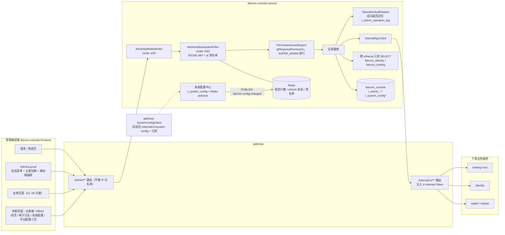

# FalconX 功能地图 · 管理后台：权限、审计与平台配置

- 版本：v1（2026-10-07）
- 变更历史：v1（2026-10-07）首次创建
- 依据：fxsystem main `da65af9`；对照代码逐项核实（未运行构建和测试）
- 范围：`falconx-console-service` 与 `falconx-console-frontend` 的"系统"部分，包括管理端全部菜单和路由总表、管理员认证与会话、IP 白名单、RBAC（管理员、角色、菜单、权限点）、`@RequiresPermission` 鉴权与字典自动注册、高危权限码清单、操作审计与审计查询、仪表盘、系统配置中心（`t_system_config`）、平台配置（冷静期、StopOut/MarginCall 阈值、FX 暂停行为）的管理端链路、console 调用下游的方式（`InternalRpcClient`、跨 schema 只读 SELECT）、深浅主题和移动端布局。
  不覆盖各业务页面的业务逻辑：客户和 KYC 见 01 账户；行情品种、加点、跑马灯、FX 汇率见 02 行情；订单、持仓、挂单、价格告警见 03 交易；风控动作、风控配置、净敞口、杠杆档位见 04 风控；入金、出金、对账、地址预分配 DLQ 见 05 资金；通知和模板见 06 通知。平台配置三页只写管理端透传链路，下游如何使用这些值见 04 风控 / 03 交易。

## 一图看懂

这张图想说明：管理端所有请求都从 gateway 的 `/admin/**` 进入 console-service，依次经过 IP 白名单、JWT 鉴权、权限切面和审计切面；console 只写自己的 `falconx_console` 库，读业务数据靠跨 schema SELECT，改业务数据一律经 gateway 调下游的 `/internal/v1/**`；系统配置中心改完值后通过 Redis 广播，目前只有 gateway 在读。

## 功能清单

| 编号 | 功能 | 使用者 | 状态 |
| --- | --- | --- | --- |
| C-01 | 管理端菜单与路由总表（DB 动态菜单） | 全部管理员 | 部分实现 |
| C-02 | 管理员登录与失败锁定 | 管理员 | 已实现 |
| C-03 | Token 与会话（签发、刷新、登出、前端存储） | 管理员 | 已实现 |
| C-04 | 修改密码与首次登录强制改密 | 管理员 | 部分实现 |
| C-05 | 超级管理员自举（DefaultSuperAdminInitializer） | 系统启动 | 已实现 |
| C-06 | 管理端 IP 白名单 | 系统 | 部分实现 |
| C-07 | 当前管理员信息与权限集（`/admin/me*`） | 管理员 | 已实现 |
| C-08 | 接口级鉴权 `@RequiresPermission`、SUPER_ADMIN 放行、字典自动注册、按钮级控制 | 系统 / 管理员 | 已实现 |
| C-09 | 高危权限码注册表（HighRiskPermissionRegistry） | 系统 | 部分实现 |
| C-10 | 管理员管理（admin-users） | 有 `admin-user:*` 权限的管理员 | 部分实现 |
| C-11 | 角色管理与权限分配（admin-roles） | 有 `admin-role:*` 权限的管理员 | 已实现 |
| C-12 | 菜单管理（admin-menus） | 有 `admin-menu:*` 权限的管理员 | 部分实现 |
| C-13 | 权限点字典查询（admin-permissions） | 有 `admin-permission:view` 的管理员 | 已实现 |
| C-14 | 操作审计写入（OperationAuditAspect） | 系统 | 部分实现 |
| C-15 | 审计日志查询页 | 有 `audit-log:view` 的管理员 | 已实现 |
| C-16 | 平台运营仪表盘 | 管理员 | 已实现 |
| C-17 | 系统配置中心（`t_system_config`） | 有 `system-config:*` 的管理员 / gateway | 部分实现 |
| C-18 | 平台配置：冷静期与 StopOut/MarginCall 阈值 | 风控运营 | 已实现 |
| C-19 | 平台配置：FX 暂停行为（按类目） | 风控运营 | 已实现 |
| C-20 | 调用下游：InternalRpcClient 与内部 Token | 系统 | 已实现 |
| C-21 | 跨 schema 只读 SELECT 与用户信息补全 | 系统 | 已实现 |
| C-22 | 深浅主题切换 | 管理员 | 已实现 |
| C-23 | 移动端布局 | 管理员 | 已实现 |

状态合计：已实现 15，部分实现 8，占位 0，stub/骨架 0，不做 0。

---

## C-01 管理端菜单与路由总表

- **状态**：部分实现。侧边栏菜单完全来自数据库（`GET /admin/me/menus`），种子由 15 个 Flyway 迁移写入，共 33 行。缺口：
  1. KYC 审核、出金审核、地址预分配 DLQ、用户通知、通知模板 5 个页面在 `App.tsx` 有路由、后端有接口，但**没有任何菜单种子**，侧边栏不显示，只能手输 URL 进入。
  2. V9 回填的 26 个菜单 `permission_code` 全部为 `NULL`，所以任何登录管理员都能在侧边栏看到这些菜单；点进去后接口按 `@RequiresPermission` 校验，无权限的会得到 `90004`。只有 V8、V12、V13、V14 种的 6 个菜单带权限码。
- **使用者与入口**：
  - 管理端页面：所有 `/admin/*` 路由（`falconx-console-frontend/src/App.tsx`），外层是 `AdminLayout`。
  - 接口：`GET /admin/me/menus`（console-service，Bearer admin JWT，无权限码要求），见 C-07。
- **业务逻辑**：
  1. 菜单树过滤（`AdminMeApplicationService.loadCurrentMenus`）：
     - `is_visible != 1` 的节点不返回。
     - 节点 `permission_code` 为空，或当前管理员拥有该权限码，才算"本节点有权限"。SUPER_ADMIN 的权限集是字典全集。
     - 本节点无权限且没有可见子节点时不返回；本节点无权限但有可见子节点时**仍返回**（子节点把父节点"带出来"）。
     - "纯分组节点"（`path` 为空且 `permission_code` 为空）没有可见子节点时不返回，避免空目录。
     - 同级按 `sort_order` 升序（SQL `findAllOrdered`）。
  2. 前端渲染（`AdminLayout.buildMenuItems`）：有子节点的渲染为子菜单；叶子节点有 `path` 时点击 `navigate(path)`；无子节点且无 `path` 的节点跳过。图标按 `ICON_MAP` 把 Ant Design 组件名映射为组件（24 个），没匹配上的用 `AppstoreOutlined` 兜底。
  3. 菜单和权限在 `AdminLayout` 挂载后并行拉一次（`mePermissions` + `meMenus`），登录态不变不重拉；失败时弹"加载菜单失败"。
  4. 未知路由 `*` 重定向到 `/admin`。所有业务页面用 `React.lazy` 按需加载。
  5. 冷启动自检脚本 `tools/cold-start-check.sh` 要求 `t_admin_menu` 不少于 32 行（实际种子 33 行）。
- **菜单总表**（菜单行来自迁移脚本；"接口权限码"是该页面主查询接口要求的权限码，取自 controller 的 `@RequiresPermission`）：

  | 菜单 code | 菜单名 | 父级 | 路由 | 菜单 `permission_code` | 页面主接口权限码 | sort | 种子 | 所属分册 |
  | --- | --- | --- | --- | --- | --- | --- | --- | --- |
  | `dashboard` | 仪表盘 | 顶级 | `/admin` | NULL | `trading-monitor:position:view` | 100 | V9 | 本册 C-16 |
  | `customers` | 客户管理 | 顶级 | `/admin/customers` | NULL | `customer:view` | 200 | V9 | 01 账户 |
  | `deposits` | 入金记录 | 顶级 | `/admin/deposits` | NULL | `deposit:view` | 300 | V9 | 05 资金 |
  | `symbols` | 行情品种（分组） | 顶级 | 无 | NULL | — | 400 | V9 | 02 行情 |
  | `symbols-list` | 品种管理 | `symbols` | `/admin/symbols` | NULL | `symbol:view` | 100 | V9 | 02 行情 |
  | `symbols-group-markup` | 用户组加点 | `symbols` | `/admin/symbols/group-markup` | NULL | `symbol:view` | 200 | V9 | 02 行情 |
  | `symbols-featured` | 跑马灯热门产品 | `symbols` | `/admin/symbols/featured` | NULL | `symbol:view` | 250 | V15 | 02 行情 |
  | `trading` | 交易监控（分组） | 顶级 | 无 | NULL | — | 500 | V9 | 03 交易 |
  | `trading-orders` | 订单监控 | `trading` | `/admin/trading/orders` | NULL | `trading-monitor:order:view` | 100 | V9 | 03 交易 |
  | `trading-positions` | 持仓监控 | `trading` | `/admin/trading/positions` | NULL | `trading-monitor:position:view` | 200 | V9 | 03 交易 |
  | `trading-pending-orders` | 挂单监控 | `trading` | `/admin/trading/pending-orders` | NULL | `trading-monitor:order:view` | 300 | V9 | 03 交易 |
  | `trading-price-alerts` | 价格告警监控 | `trading` | `/admin/trading/price-alerts` | NULL | `trading-monitor:order:view` | 400 | V9 | 03 交易 |
  | `trading-exposures` | 净敞口看板 | `trading` | `/admin/trading/exposures` | NULL | `trading-monitor:exposure:view` | 500 | V9 | 04 风控 |
  | `trading-risk-switches` | 风控开关 | `trading` | `/admin/trading/risk-switches` | NULL | `trading-monitor:exposure:view` | 600 | V9 | 04 风控 |
  | `trading-tier-configs` | 杠杆档位配置 | `trading` | `/admin/trading/tier-configs` | `tier:view` | `tier:view` | 700 | V12 | 04 风控 |
  | `trading-margin-mode-config` | 冷静期配置 | `trading` | `/admin/trading/margin-mode-config` | `margin-mode-config:view` | `margin-mode-config:view` | 800 | V13 | 本册 C-18（语义见 04） |
  | `trading-risk-threshold` | StopOut 阈值配置 | `trading` | `/admin/trading/risk-thresholds` | `risk-threshold:view` | `risk-threshold:view` | 900 | V13 | 本册 C-18（语义见 04） |
  | `trading-fx-pause-behavior` | FX 暂停行为配置 | `trading` | `/admin/trading/fx-pause-behavior` | `fx:pause-behavior:view` | `fx:pause-behavior:view` | 1000 | V13 | 本册 C-19（语义见 03/04） |
  | `market-fx-rates` | FX 汇率监控 | `trading` | `/admin/market/fx-rates` | `fx:view` | `fx:view` | 1100 | V14 | 02 行情 |
  | `risk-admin` | 风控管理（分组） | 顶级 | 无 | NULL | — | 600 | V9 | 04 风控 |
  | `risk-actions` | 风控动作 | `risk-admin` | `/admin/risk/actions` | NULL | `risk-action:view` | 100 | V9 | 04 风控 |
  | `risk-configs` | 风控配置 | `risk-admin` | `/admin/risk/configs` | NULL | `risk-config:view` | 200 | V9 | 04 风控 |
  | `risk-market-configs` | 市场集中度 | `risk-admin` | `/admin/risk/market-configs` | NULL | `risk-config:view` | 300 | V9 | 04 风控 |
  | `risk-platform` | 平台总敞口 | `risk-admin` | `/admin/risk/platform` | NULL | 页面只有写接口 `risk-config:update` | 400 | V9 | 04 风控 |
  | `risk-user-thresholds` | 用户级阈值 | `risk-admin` | `/admin/risk/user-thresholds` | NULL | `risk-config:view` | 500 | V9 | 04 风控 |
  | `rbac` | RBAC 自管（分组） | 顶级 | 无 | NULL | — | 700 | V9 | 本册 |
  | `users` | 管理员 | `rbac` | `/admin/users` | NULL | `admin-user:view` | 100 | V9 | 本册 C-10 |
  | `roles` | 角色 | `rbac` | `/admin/roles` | NULL | `admin-role:view` | 200 | V9 | 本册 C-11 |
  | `menus` | 菜单 | `rbac` | `/admin/menus` | NULL | `admin-menu:view` | 300 | V9 | 本册 C-12 |
  | `permissions` | 权限点 | `rbac` | `/admin/permissions` | NULL | `admin-permission:view` | 400 | V9 | 本册 C-13 |
  | `audit-logs` | 审计日志 | 顶级 | `/admin/audit-logs` | NULL | `audit-log:view` | 800 | V9 | 本册 C-15 |
  | `reconciliation-deposits` | 入金对账 | 顶级 | `/admin/reconciliation/deposits` | NULL | `reconciliation:view` | 850 | V9 | 05 资金 |
  | `system-config` | 系统配置 | 顶级 | `/admin/system-config` | `system-config:view` | `system-config:view` | 9000 | V8（V10 改图标） | 本册 C-17 |

- **有路由但没有菜单的页面**：

  | 路由 | 页面 | 页面主接口权限码 | 所属分册 |
  | --- | --- | --- | --- |
  | `/admin/login` | 登录页（无布局） | 公开 | 本册 C-02 |
  | `/admin/change-password` | 修改密码页（无布局，用户下拉菜单"修改密码"可进） | 登录即可 | 本册 C-04 |
  | `/admin/customers/:userId` | 客户详情 | `customer:view` | 01 账户 |
  | `/admin/kyc` | KYC 审核列表 | `kyc:view` | 01 账户 |
  | `/admin/withdraws` | 出金审核列表 | `withdraw:view` | 05 资金 |
  | `/admin/withdraws/:id` | 出金详情 | `withdraw:view` | 05 资金 |
  | `/admin/wallet/provision-dlq` | 地址预分配死信队列 | `wallet-provision:view` | 05 资金 |
  | `/admin/notifications` | 用户通知列表 | `notification:view` | 06 通知 |
  | `/admin/notification-templates` | 通知模板 | `notification:template:view` | 06 通知 |

- **字段**：
  - 响应字段（`AdminMeMenusResponse.MenuNode`，递归）：

    | 字段 | 类型 | 含义 |
    | --- | --- | --- |
    | `menus[].code` | string | 菜单 code |
    | `menus[].name` | string | 显示名 |
    | `menus[].icon` | string | Ant Design 图标组件名 |
    | `menus[].path` | string | 前端路由，分组节点为空 |
    | `menus[].permissionCode` | string | 关联权限码，可空 |
    | `menus[].children` | MenuNode[] | 已过滤的子节点，叶子为空数组 |
  - 涉及的数据表：`t_admin_menu` 全部字段见 C-12。
- **错误码**：`90003`（未登录）。
- **相关事件和定时任务**：无。
- **证据**：`falconx-console-service/src/main/resources/db/migration/V8__seed_system_config_menu.sql`、`V9__seed_admin_menus_backfill.sql`、`V10__fix_system_config_menu_icon.sql`、`V12__seed_tier_permissions_and_menu.sql`、`V13__seed_platform_config_permissions_and_menu.sql`、`V14__seed_fx_monitor_permissions_and_menu.sql`、`V15__seed_featured_ticker_permission_and_menu.sql`；`falconx-console-service/src/main/java/com/falconx/console/application/AdminMeApplicationService.java`；`falconx-console-frontend/src/App.tsx`；`falconx-console-frontend/src/features/layout/AdminLayout.tsx`；`tools/cold-start-check.sh`。

---

## C-02 管理员登录与失败锁定

- **状态**：已实现（前后端接通；`AdminAuthApplicationService.login` + `AdminLoginPage`）。
- **使用者与入口**：
  - 管理端页面：`/admin/login`（`AdminLoginPage`）。
  - 接口：`POST /admin/auth/login`（console-service，公开端点，不需要 token；仍受 C-06 IP 白名单约束）。
- **业务逻辑**：
  1. 先查锁定：Redis 存在 `falconx:admin:login-locked:{username}` 时直接返回 `90006`（HTTP 423），不再校验密码。
  2. 按 `username` 查 `t_admin_user`。用户不存在或 BCrypt 校验失败时：失败计数 `INCR falconx:admin:login-failure:{username}`；计数为 1 时给该 key 设 TTL = 锁定时长（固定窗口，从第一次失败起算，不是滑动窗口）；计数 ≥ `login-failure-limit` 时写锁定 key（TTL = 锁定时长）、删除计数 key，并返回 `90006`；否则返回 `90001`。用户不存在和密码错误返回同一个错误码。
  3. 默认阈值：`falconx.console.security.login-failure-limit = 5`、`login-lock-duration = 15m`（`application.yml`）。`ConsoleServiceProperties` 的代码默认值是 30 分钟，但被 yml 覆盖为 15 分钟。`t_system_config` 里的 `console.security.login-failure-limit` / `login-lock-duration-minutes` **不被读取**（见 C-17）。
  4. 密码校验通过后再判断状态：`status = 2`（DISABLED）返回 `90008`。注意：被禁用账号输入正确密码不会累加失败计数。
  5. 成功：清空失败计数，更新 `last_login_at`（UTC）和 `last_login_ip`，签发 access + refresh（见 C-03）。
  6. 客户端 IP：`X-Forwarded-For` 第一段，没有时用 `RemoteAddr`。
  7. 锁定按 username 计，攻击者可以对任意已知用户名（包括 `superadmin`）连续输错 5 次让其锁定 15 分钟；`/admin/auth/login` 没有 IP 级限流（gateway 限流只覆盖 `/api/v1/**`）。
  8. 前端：用户名 3–32 字符、密码必填；`90001` 显示"用户名或密码错误"；`90006` 整卡替换为"账号已锁定，请 30 分钟后重试"（文案写死 30 分钟，与后端 15 分钟不一致，没有倒计时）；`90008` 显示"账号已禁用"；`90005` 显示"IP 不在白名单内"；登录成功后若 `mustChangePassword = true` 跳 `/admin/change-password`（state `forced: true`），否则跳 `/admin`。页面没有"记住我"。
- **字段**：
  - 请求字段（`AdminLoginRequest`）：

    | 字段 | 类型 | 必填 | 含义 | 约束/取值 |
    | --- | --- | --- | --- | --- |
    | `username` | string | 是 | 登录用户名 | `@NotBlank`，长度 3–32 |
    | `password` | string | 是 | 明文密码 | `@NotBlank` |
  - 响应字段（`AdminAuthTokenResponse`，登录和刷新共用）：

    | 字段 | 类型 | 含义 |
    | --- | --- | --- |
    | `adminUserId` | long | 管理员 ID |
    | `username` | string | 用户名 |
    | `realName` | string | 真实姓名，可空 |
    | `roles` | string[] | 角色 code 列表 |
    | `mustChangePassword` | boolean | 是否必须先改密 |
    | `accessToken` | string | access JWT |
    | `refreshToken` | string | refresh JWT |
    | `accessTokenExpiresIn` | long | access 有效期（秒），默认 1800 |
    | `refreshTokenExpiresIn` | long | refresh 有效期（秒），默认 28800 |
  - 涉及的数据表：`t_admin_user`（全部字段见 C-10）；Redis key `falconx:admin:login-failure:{username}`、`falconx:admin:login-locked:{username}`。
- **错误码**：

  | 错误码 | 含义 | 触发条件 |
  | --- | --- | --- |
  | `90001` | `ADMIN_AUTH_FAILED`（HTTP 401） | 用户不存在或密码错误且未达阈值 |
  | `90006` | `ADMIN_LOGIN_LOCKED`（HTTP 423） | 已锁定，或本次失败达到阈值 |
  | `90008` | `ADMIN_USER_DISABLED`（HTTP 403） | 密码正确但账号已禁用 |
  | `90005` | `ADMIN_IP_NOT_WHITELISTED`（HTTP 403） | IP 白名单拦截（C-06） |
  | `99004` | `INVALID_REQUEST_PAYLOAD`（HTTP 400） | 字段校验失败 |
- **相关事件和定时任务**：无。
- **证据**：`falconx-console-service/src/main/java/com/falconx/console/controller/AdminAuthController.java`、`application/AdminAuthApplicationService.java`、`security/RedisAdminLoginAttemptService.java`、`config/ConsoleServiceProperties.java`、`src/main/resources/application.yml`；`falconx-console-frontend/src/features/auth/AdminLoginPage.tsx`。

---

## C-03 Token 与会话

- **状态**：已实现。
- **使用者与入口**：
  - 接口：`POST /admin/auth/refresh`（公开端点）；`POST /admin/auth/logout`（需要 Bearer access token，无权限码）。
  - 前端：`lib/api/apiClient.ts`（自动刷新）、`lib/auth/adminTokenStorage.ts`、`lib/auth/useAuthGuard.ts`、`AdminLayout` 用户下拉"登出"。
- **业务逻辑**：
  1. 签发（`RsaAdminTokenSupport`）：自实现 RS256 JWT，header `{"alg":"RS256","typ":"JWT"}`。密钥是 console 独立的 RSA 密钥对，与 C 端 identity 隔离，来自环境变量 `FALCONX_CONSOLE_PRIVATE_KEY_PEM` / `FALCONX_CONSOLE_PUBLIC_KEY_PEM`；`application-dev.yml` 内置一对本地开发密钥（不在此列出）。
  2. access claims：`iss`（`falconx-console-service`）、`typ=access`、`sub`（管理员 ID 字符串）、`username`、`roles`（角色 code 数组）、`mustChangePassword`、`jti`（UUID 去横线）、`iat`、`exp`。refresh claims：`iss`、`typ=refresh`、`sub`、`jti`、`iat`、`exp`。
  3. TTL：access 30 分钟、refresh 8 小时（`falconx.console.token.*`）。`t_system_config` 中的 `console.token.*` 不被读取（C-17）。
  4. 校验：三段式、签名、`iss` 相等、`typ` 匹配，`exp` ≤ 当前时间返回 `90002`，其他问题返回 `90003`。
  5. 鉴权过滤器（`AdminAuthenticationFilter`，order 200，URL `/admin/*`）：放行 `/admin/auth/login`、`/admin/auth/refresh`；其他请求要求 `Authorization: Bearer`，校验 token，并查 Redis 黑名单 `falconx:admin:token:blacklist:{jti}`，命中返回 `90003`；把 `AdminPrincipal` 放进 ThreadLocal（`AdminSecurityContextHolder`），finally 清理。过滤器**不查数据库**，所以账号被禁用后，已签发的 access token 在剩余有效期内（最长 30 分钟）仍然可用；禁用只吊销 refresh。
  6. refresh 一次性轮换：校验 refresh JWT → Redis `falconx:admin:refresh-token:active:{jti}` 必须存在（否则 `90003`）→ 查用户（不存在 `90003`，禁用 `90008`）→ 删除旧 jti（`consume`）→ 签发新的一对。签发时登记 `active:{jti}`（TTL = refresh 剩余时长）并把 jti 加入集合 `falconx:admin:refresh-token:user:{adminUserId}`。
  7. 登出：当前 access jti 进黑名单（TTL = access 剩余时长）；吊销该用户**全部** refresh（遍历用户集合删除 active key），即所有设备都无法再刷新。其他设备已有的 access token 不受影响，直到过期。
  8. 前端存储：`sessionStorage`，key 为 `falconx_admin_access_token`、`falconx_admin_refresh_token`、`falconx_admin_access_expires_at`、`falconx_admin_user`；关闭浏览器即失效；代码注释禁止写 localStorage / IndexedDB。
  9. 前端自动刷新：任一请求 HTTP 401 且带了 access token 时，单飞（全局一个 promise）调用 `/admin/auth/refresh`，成功后重试原请求一次；失败则清空 token 并 `window.location.href = "/admin/login"`。`useAuthGuard` 只判断"有没有 token"，不判断过期时间（access 过期交给 401→refresh 处理）。
  10. 浏览器不主动发送 `X-Trace-Id`，由 gateway 注入。
- **字段**：
  - 请求字段（`AdminRefreshRequest`）：

    | 字段 | 类型 | 必填 | 含义 | 约束/取值 |
    | --- | --- | --- | --- | --- |
    | `refreshToken` | string | 是 | refresh JWT | `@NotBlank` |
  - 响应字段：刷新同 C-02 的 `AdminAuthTokenResponse`；登出 `data = null`。
  - 涉及的数据表：无数据库表；Redis key 见上。
- **错误码**：

  | 错误码 | 含义 | 触发条件 |
  | --- | --- | --- |
  | `90002` | `ADMIN_TOKEN_EXPIRED`（401） | token `exp` 已过 |
  | `90003` | `ADMIN_TOKEN_INVALID`（401） | 缺 header、签名/issuer/typ 不对、jti 在黑名单、refresh 已失效或已用过 |
  | `90008` | `ADMIN_USER_DISABLED`（403） | 刷新时账号已禁用 |
- **相关事件和定时任务**：无。
- **证据**：`falconx-console-service/src/main/java/com/falconx/console/security/RsaAdminTokenSupport.java`、`AdminAuthenticationFilter.java`、`RedisAdminRefreshTokenStore.java`、`RedisAdminTokenBlacklistService.java`、`AdminPrincipal.java`、`config/AdminTokenConfiguration.java`；`falconx-console-frontend/src/lib/api/apiClient.ts`、`lib/auth/adminTokenStorage.ts`、`lib/auth/adminAuthStore.ts`、`lib/auth/useAuthGuard.ts`。

---

## C-04 修改密码与首次登录强制改密

- **状态**：部分实现。改密接口和密码策略已接通；但"首次登录强制改密"只在前端登录成功后跳转一次。后端定义了 `90007 ADMIN_PASSWORD_MUST_CHANGE`，但没有任何代码抛出它；`AdminPrincipal` 带了 `mustChangePassword`，过滤器和切面都不检查。`AdminLayout` 也不检查 `mustChangePassword`。因此 `must_change_password = 1` 的管理员登录后直接访问 `/admin` 或调用任意接口都不会被拦截。
- **使用者与入口**：
  - 管理端页面：`/admin/change-password`（`ChangePasswordPage`），首登被动跳转，或从右上角用户菜单"修改密码"进入。
  - 接口：`POST /admin/auth/change-password`（Bearer access token，无权限码）。
- **业务逻辑**：
  1. 校验旧密码，不对返回 `90001`。
  2. 新密码策略（`AdminPasswordPolicyValidator`）：长度 ≥ 12；至少 1 个大写、1 个小写、1 个数字、1 个特殊字符（集合 `!@#$%^&*()_+-=[]{};:'"\|,.<>/?` 和反引号、`~`）；不得等于旧密码；不得等于用户名。不符合时**复用 `90001`**（代码注释说专用码待分配，但 `90100 ADMIN_PASSWORD_POLICY_VIOLATION` 实际已存在，只在管理员管理里使用）。
  3. 成功：`password_hash` 更新为新 BCrypt（strength 12），`must_change_password = 0`；当前 access jti 进黑名单；吊销该用户全部 refresh。
  4. 前端：新密码实时校验同一套规则（再加"两次输入一致"）；首登时顶部显示警告"您是首次登录系统，请先修改默认密码后再继续"；成功后清空本地会话并跳登录页。
- **字段**：
  - 请求字段（`AdminChangePasswordRequest`）：

    | 字段 | 类型 | 必填 | 含义 | 约束/取值 |
    | --- | --- | --- | --- | --- |
    | `oldPassword` | string | 是 | 旧密码明文 | `@NotBlank` |
    | `newPassword` | string | 是 | 新密码明文 | `@NotBlank`，后端按上述策略校验 |
  - 响应：`data = null`。
  - 涉及的数据表：`t_admin_user.password_hash`、`must_change_password`（见 C-10）。
- **错误码**：

  | 错误码 | 含义 | 触发条件 |
  | --- | --- | --- |
  | `90001` | 旧密码错误或新密码不符合策略 | 见上 |
  | `90003` | 未登录 | 无有效 access token |
- **相关事件和定时任务**：无。改密不经过 `@RequiresPermission`，所以**不写审计日志**。
- **证据**：`falconx-console-service/src/main/java/com/falconx/console/application/AdminAuthApplicationService.java`、`security/AdminPasswordPolicyValidator.java`、`error/AdminErrorCode.java`、`resources/mapper/AdminUserMapper.xml`（`updatePassword`）；`falconx-console-frontend/src/features/auth/ChangePasswordPage.tsx`。

---

## C-05 超级管理员自举

- **状态**：已实现（`DefaultSuperAdminInitializer implements ApplicationRunner`）。
- **使用者与入口**：console-service 每次启动自动执行；无页面、无接口。
- **业务逻辑**：
  1. V1 迁移只插入角色 `t_admin_role (id=1, code=SUPER_ADMIN, name=超级管理员, is_system=1)`，不插入用户。
  2. 启动时查 `t_admin_user` 是否已有 `username = falconx.console.initial-super-admin.username`（默认 `superadmin`），有则跳过（幂等）。
  3. 没有则：雪花 ID、用 `falconx.console.initial-super-admin.default-password` 做 BCrypt、`real_name` 取 `initial-super-admin.real-name`（默认"系统超级管理员"），插入 `status = 1`、`must_change_password = 1`，再插入 `t_admin_user_role (user_id, role_id = 1)`。初始密码有代码默认值（本文不写出），生产应通过配置覆盖。
  4. 多实例并发：`username` 唯一索引保证只成功一次，失败实例捕获 `DataIntegrityViolationException` 后只记日志。
  5. 判断条件是"该用户名是否存在"，不是"是否存在任何 SUPER_ADMIN"；如果超管被改名，下次启动会再建一个 `superadmin`。
  6. 除 SUPER_ADMIN 外，迁移没有种子任何其他角色；V11–V15 里"把新权限补给已持有 X 权限的角色"的 SQL 在全新库里不会影响任何行。
- **字段**：涉及 `t_admin_user`（见 C-10）、`t_admin_user_role`、`t_admin_role`（见 C-11）。
- **错误码**：无。
- **相关事件和定时任务**：启动时执行一次。
- **证据**：`falconx-console-service/src/main/java/com/falconx/console/bootstrap/DefaultSuperAdminInitializer.java`、`config/ConsoleServiceProperties.java`（`InitialSuperAdmin`）、`db/migration/V1__init_console_schema.sql`。

---

## C-06 管理端 IP 白名单

- **状态**：部分实现。只有 console-service 应用级一层（`AdminIpWhitelistFilter`，order 100，URL `/admin/*`）。缺口：
  1. gateway 没有 `/admin/**` IP 白名单（`GatewayConfiguration` 注释明确写"IP 白名单单独由 console-service 应用层校验"），与文档"双层"不符。
  2. 白名单只能在 `application.yml` / 环境变量配置，系统配置中心里的 `console.security.ip-whitelist-enabled` 和 `console.security.ip-whitelist` 改了**不生效**。
  3. 客户端 IP 取 `X-Forwarded-For` 第一段。`deploy/docker/nginx-edge.conf` 用 `$proxy_add_x_forwarded_for` 追加，客户端自带的 `X-Forwarded-For` 会保留在第一段，**可能被伪造绕过白名单**（静态推断，未实测）。
- **使用者与入口**：所有 `/admin/*` 请求（含登录）；不覆盖 `/internal/v1/system-config`。
- **业务逻辑**：
  1. 在哪里配置：`falconx.console.security.ip-whitelist-enabled`（环境变量 `FALCONX_CONSOLE_IP_WHITELIST_ENABLED`，默认 true）和 `falconx.console.security.ip-whitelist`（环境变量 `FALCONX_CONSOLE_IP_WHITELIST`，逗号分隔）。yml 默认值是本机回环地址和两个私网 CIDR 段（172.16.0.0/12、10.0.0.0/8）。`application-dev.yml` 设为 `false`（全放行）。
  2. 只支持 IPv4 和 IPv4 CIDR；客户端 IP 解析失败（含 IPv6 回环）视为不在白名单；白名单为空时全部拒绝。
  3. 拒绝时直接写 JSON `90005`、HTTP 403，不进入后续过滤器。
- **字段**：无请求体。
- **错误码**：`90005 ADMIN_IP_NOT_WHITELISTED`（403）。
- **相关事件和定时任务**：无。
- **证据**：`falconx-console-service/src/main/java/com/falconx/console/security/AdminIpWhitelistFilter.java`、`config/AdminIpWhitelistConfiguration.java`、`src/main/resources/application.yml`、`application-dev.yml`；`falconx-gateway/src/main/java/com/falconx/gateway/config/GatewayConfiguration.java`；`deploy/docker/nginx-edge.conf`。

---

## C-07 当前管理员信息与权限集

- **状态**：已实现。
- **使用者与入口**：
  - 接口（console-service，Bearer access token，无权限码）：`GET /admin/me`、`GET /admin/me/permissions`、`GET /admin/me/menus`（菜单见 C-01）。
  - 前端：`AdminLayout` 启动时拉 `permissions` + `menus`；`adminAuthStore.setPermissions` 存入内存（不持久化）。
- **业务逻辑**：
  1. `/admin/me` 读数据库返回基本信息和角色（code + name）。
  2. `/admin/me/permissions`：`principal.isSuperAdmin()`（token 里 `roles` 含 `SUPER_ADMIN`）时返回 `t_admin_permission` 全集和 `isSuperAdmin = true`；否则返回 `t_admin_user_role ⋈ t_admin_role_permission` 的去重权限码，按 code 升序。
  3. SUPER_ADMIN 判断来自 token 里的 `roles` claim，签发时固定；普通权限每次查库，角色权限调整立即生效。
- **字段**：
  - `/admin/me` 响应（`AdminMeResponse`）：

    | 字段 | 类型 | 含义 |
    | --- | --- | --- |
    | `adminUserId` | long | 管理员 ID |
    | `username` | string | 用户名 |
    | `realName` | string | 真实姓名 |
    | `roles[].code` / `roles[].name` | string | 角色 code 与名称 |
    | `mustChangePassword` | boolean | 是否须改密 |
    | `lastLoginAt` | datetime | 最后登录时间 |
    | `lastLoginIp` | string | 最后登录 IP |
  - `/admin/me/permissions` 响应（`AdminMePermissionsResponse`）：

    | 字段 | 类型 | 含义 |
    | --- | --- | --- |
    | `permissions` | string[] | 权限码列表 |
    | `isSuperAdmin` | boolean | 是否超管 |
- **错误码**：`90003`（未登录或用户已不存在）。
- **相关事件和定时任务**：无。
- **证据**：`falconx-console-service/src/main/java/com/falconx/console/controller/AdminMeController.java`、`application/AdminMeApplicationService.java`、`resources/mapper/AdminPermissionMapper.xml`（`selectPermissionCodesByUserId`）。

---

## C-08 接口级鉴权、SUPER_ADMIN 放行、权限字典自动注册、按钮级控制

- **状态**：已实现。限制：注解声明支持 `ElementType.TYPE`，但切面只拦截方法上的注解（`@annotation(...)`），写在类上不会生效；目前代码里没有类级用法。
- **使用者与入口**：所有带 `@RequiresPermission` 的 controller 方法（共 68 个不同权限码）；前端 `components/RequiresPermission.tsx` 和 `lib/auth/usePermission.ts`。
- **业务逻辑**：
  1. 鉴权（`PermissionGuardAspect` `@Before` → `PermissionGuardService.requirePermission`）：principal 为空返回 `90003`；SUPER_ADMIN 直接放行，不查库；否则每次查 `t_admin_role_permission` 并集（无缓存），不含目标码返回 `90004`（HTTP 403）。
  2. 字典自动注册（`AdminPermissionDictionaryInitializer implements ApplicationRunner`）：启动时遍历所有 `@Controller` / `@RestController` bean 的方法，读 `@RequiresPermission`；`module` = 第一个冒号前的部分，`action` = 第一个冒号后的全部（如 `customer:balance:adjust` → `customer` / `balance:adjust`）；用雪花 ID `INSERT IGNORE` 写入 `t_admin_permission`（`code` 唯一索引保证并发和重复启动幂等）。只增不删、不更新已有描述；没有冒号的码记 warn 跳过。
  3. 部分权限码（`trading-monitor:*`、`risk-*`、`deposit:view`、`system-config:*`、`tier:*`、`margin-mode-config:*`、`risk-threshold:*`、`fx:*`、`symbol:featured:update`）还在迁移里用固定 ID 段（9100001+、9200001+、9300001、9400001+、9600001+、9700001+、9800001+）显式种入，与自动注册共存。
  4. 废弃码 `symbol:update`：V2 迁移把持有它的角色补上 `symbol:source:update`，并在描述后追加 `[DEPRECATED@V2...]`，记录保留。
  5. 前端按钮级：`useHasPermission()` 对 SUPER_ADMIN 任意码返回 true，否则看内存权限集；`<RequiresPermission code>` 无权限时**完全隐藏**（不是禁用）。
  6. 全部 68 个权限码：`admin-menu:create/delete/update/view`、`admin-permission:view`、`admin-role:create/delete/permission:assign/update/view`、`admin-user:create/delete/disable/reset-password/update/view`、`audit-log:view`、`customer:balance:adjust/edit/freeze/unfreeze/view`、`deposit:view`、`fx:pause-behavior:edit/view`、`fx:view`、`kyc:review/view`、`margin-mode-config:edit/view`、`notification:send/template:manage/template:view/view`、`reconciliation:resolve/view`、`risk-action:activate/view`、`risk-config:update/view`、`risk-market-config:update`、`risk-threshold:edit/view`、`symbol:featured:update/group-markup:update/group-visibility:update/holiday:update/quote-mapping:update/source:create/source:update/suspend/swap-rate:update/trading-hours:update/view`、`system-config:view/write`、`tier:edit/view`、`trading-monitor:auto-liquidate:pause/exposure:view/manual-liquidate/order:view/position:view`、`wallet-provision:retry/view`、`withdraw:emergency-cancel/review/view`。
- **字段**：`t_admin_permission`、`t_admin_role_permission` 全部字段见 C-13、C-11。
- **错误码**：

  | 错误码 | 含义 | 触发条件 |
  | --- | --- | --- |
  | `90003` | 未登录 | principal 为空 |
  | `90004` | `ADMIN_PERMISSION_DENIED`（403） | 非超管且无该权限码 |
- **相关事件和定时任务**：启动时字典扫描一次。
- **证据**：`falconx-console-service/src/main/java/com/falconx/console/security/RequiresPermission.java`、`PermissionGuardAspect.java`、`PermissionGuardService.java`、`AdminPermissionDictionaryInitializer.java`、`repository/MybatisAdminPermissionRepository.java`、`db/migration/V2__*.sql`～`V15__*.sql`；`falconx-console-frontend/src/components/RequiresPermission.tsx`、`src/lib/auth/usePermission.ts`。

---

## C-09 高危权限码注册表

- **状态**：部分实现。静态集合已生效，决定审计 `risk_level` 和权限点页的 `isHighRisk`。缺口：多个在代码描述或迁移里自称"高危/高风险"的码**没有收录**，审计时记为 `LOW`：`system-config:write`（V7 写明高危）、`symbol:featured:update`（V15 写明高风险写）、`customer:unfreeze`、`kyc:review`、`wallet-provision:retry`、`admin-user:disable`、`admin-user:reset-password`、`admin-user:delete`、`admin-role:permission:assign`。另有 `symbol:update` 已废弃但仍在集合里。
- **使用者与入口**：`OperationAuditAspect`（C-14）、`AdminPermissionApplicationService`（C-13，`highRiskOnly` 筛选和 `isHighRisk` 字段）。前端二次确认弹窗**不读**这份注册表，按页面各自实现（真源文档 `docs/design/admin高危操作风控档位.md` 列 8 项三重门操作）。
- **业务逻辑**：`resolveRiskLevel(code)`：在集合内返回 `HIGH_RISK`，否则 `LOW`。代码里不会产生 `MEDIUM`（表注释和前端筛选里有这个值）。全部 27 个码：

  | # | 权限码 | 说明（来自代码注释 / 注解描述） |
  | --- | --- | --- |
  | 1 | `customer:balance:adjust` | 调整客户余额 |
  | 2 | `customer:edit` | 编辑客户详情 |
  | 3 | `customer:freeze` | 冻结客户 |
  | 4 | `withdraw:review` | 出金通过 / 拒绝 |
  | 5 | `withdraw:emergency-cancel` | 出金紧急取消 |
  | 6 | `risk-action:activate` | 激活 / 停用风控动作 |
  | 7 | `risk-config:update` | risk_config 增改删、平台敞口、方向集中度、用户级阈值 |
  | 8 | `risk-market-config:update` | 编辑市场集中度 |
  | 9 | `trading-monitor:manual-liquidate` | 手动强平；也用于强制撤挂单、强制删价格告警 |
  | 10 | `trading-monitor:auto-liquidate:pause` | 暂停/恢复自动强平 |
  | 11 | `symbol:update` | 已废弃（V2 迁移替换为 `symbol:source:update`） |
  | 12 | `symbol:source:create` | 新建 LP 源 symbol |
  | 13 | `symbol:source:update` | 编辑 LP 源 symbol |
  | 14 | `symbol:suspend` | 暂停 / 恢复 symbol |
  | 15 | `symbol:swap-rate:update` | 更新隔夜费率 |
  | 16 | `symbol:trading-hours:update` | 交易时段 / 特殊交易日 |
  | 17 | `symbol:holiday:update` | 市场节假日 |
  | 18 | `symbol:quote-mapping:update` | 报价映射 |
  | 19 | `symbol:group-visibility:update` | 用户组可见性 |
  | 20 | `symbol:group-markup:update` | 用户组加点 |
  | 21 | `notification:template:manage` | 通知模板增改删 |
  | 22 | `notification:send` | 手动发送通知 |
  | 23 | `reconciliation:resolve` | 入金对账标记已解决 |
  | 24 | `tier:edit` | 杠杆 / MM 档位增改删 |
  | 25 | `margin-mode-config:edit` | 冷静期配置 |
  | 26 | `risk-threshold:edit` | StopOut / MarginCall 阈值 |
  | 27 | `fx:pause-behavior:edit` | FX 暂停行为 |
- **字段**：无独立表（代码常量）。
- **错误码**：无。
- **相关事件和定时任务**：无。
- **证据**：`falconx-console-service/src/main/java/com/falconx/console/security/HighRiskPermissionRegistry.java`、`src/test/java/com/falconx/console/security/HighRiskPermissionRegistryTests.java`。

---

## C-10 管理员管理（admin-users）

- **状态**：部分实现。增删改查、禁用/启用、重置密码均已接通。问题：
  1. **编辑接口可以授予 SUPER_ADMIN**：`updateUser` 只阻止"移除超管的 SUPER_ADMIN 角色"，不阻止给普通管理员加上 `role_id = 1`。持有 `admin-user:update` 的非超管可以把自己或他人升为超管（新建接口会拦截 `90213`，编辑不拦）。前端角色下拉提示"不可选 SUPER_ADMIN"，但后端不校验。
  2. **详情接口只在前 100 个管理员里找**：`getUserDetail` 调 `findUsersForList(..., 0, 100)` 再按 id 过滤，管理员超过 100 人时后面的人查详情会返回 `90211`；另外还多做了一次无用的 `listUsers` 查询。
  3. 删除弹窗收集的"操作原因"**没有发送**到后端（`DELETE` 无 body、无 header），后端也不读。
  4. 禁用按钮是 Popconfirm，前端把 reason 写死为 `运营禁用 {username} (R7 浏览器 QA 验证)` 发给后端，而后端要求 reason 10–500 字符，所以能通过，但原因不是运营填的。
  5. 显式传入的初始密码 / 重置密码会被审计切面原样写进 `t_admin_operation_log.after_value`（见 C-14）。
- **使用者与入口**：
  - 管理端页面：`/admin/users`（`AdminUsersPage`）。
  - 接口（console-service，Bearer）：

    | 方法 路径 | 权限码 | 说明 |
    | --- | --- | --- |
    | `GET /admin/admin-users` | `admin-user:view` | 列表 |
    | `GET /admin/admin-users/{id}` | `admin-user:view` | 详情 |
    | `POST /admin/admin-users` | `admin-user:create` | 新建 |
    | `PUT /admin/admin-users/{id}` | `admin-user:update` | 改姓名和角色 |
    | `POST /admin/admin-users/{id}/disable` | `admin-user:disable` | 禁用 |
    | `POST /admin/admin-users/{id}/enable` | `admin-user:disable` | 启用（共用码） |
    | `POST /admin/admin-users/{id}/reset-password` | `admin-user:reset-password` | 重置密码 |
    | `DELETE /admin/admin-users/{id}` | `admin-user:delete` | 物理删除 |
- **业务逻辑**：
  1. 列表：`page` 从 0 开始（默认 0），`size` 默认 20、上限 100；`username`、`realName` 模糊；`status` 传 `ACTIVE`/`DISABLED`，其他值忽略；`roleCode`；`from`/`to` 按创建时间（ISO 日期时间）。角色按用户批量查回填。
  2. 新建：用户名重复 `90210`；`roleIds` 为 null 或含 1 返回 `90213`；密码留空时生成 16 位随机密码（字符集去掉易混淆的 1/l/0/O，含 `!@#$%^&*`），只在本次响应 `generatedPassword` 返回一次；显式密码按 C-04 策略校验（不等于用户名），不符合 `90100`；`mustChangePassword` 缺省 true；状态 ACTIVE；替换用户角色。
  3. 编辑：用户不存在 `90211`；目标是超管且新 `roleIds` 不含 1 返回 `90214`；更新 `real_name` 并整体替换角色（先删后插）。
  4. 禁用：不能禁用自己（`90215`）；`status = 2`；吊销其全部 refresh。启用：`status = 1`，不校验原状态。
  5. 重置密码：留空则随机生成；显式密码按策略校验（此处传入的用户名为空串，所以"不等于用户名"这条不生效）；`forceChangePassword` 缺省 true；吊销全部 refresh。
  6. 删除：不能删自己（`90217`）；超管不可删（`90216`）；先删 `t_admin_user_role` 再物理删除 `t_admin_user`；吊销 refresh。历史审计保留（`admin_user_id` 不再能关联到用户名）。
- **字段**：
  - 新建请求（`AdminUserCreateRequest`）：

    | 字段 | 类型 | 必填 | 含义 | 约束/取值 |
    | --- | --- | --- | --- | --- |
    | `username` | string | 是 | 登录名 | 正则 `^[a-zA-Z0-9_]{3,32}$` |
    | `realName` | string | 否 | 真实姓名 | ≤ 64 |
    | `roleIds` | long[] | 是 | 角色 ID | `@NotEmpty`；不可含 1 |
    | `password` | string | 否 | 初始密码 | 空则自动生成 |
    | `mustChangePassword` | boolean | 否 | 首登强制改密 | 默认 true |
  - 编辑请求（`AdminUserUpdateRequest`）：`realName`（≤ 64）、`roleIds`（`@NotEmpty`）。
  - 禁用请求（`AdminUserDisableRequest`）：`reason`（必填，10–500）。
  - 重置密码请求（`AdminUserResetPasswordRequest`）：`password`（可空）、`forceChangePassword`（默认 true）、`reason`（必填，10–500，仅校验不落库）。
  - 新建响应（`AdminUserCreateResponse`）：`id`（字符串）、`username`、`generatedPassword`（仅自动生成时有值）。重置响应：`id`、`generatedPassword`。
  - 列表响应（`AdminUserListResponse`）：`items[]`、`total`、`page`、`size`；`items[]` 字段：

    | 字段 | 类型 | 含义 |
    | --- | --- | --- |
    | `id` | string | 管理员 ID |
    | `username` | string | 用户名 |
    | `realName` | string | 姓名 |
    | `status` | string | `ACTIVE` / `DISABLED` |
    | `mustChangePassword` | boolean | 是否须改密 |
    | `lastLoginAt` | datetime | 最后登录 |
    | `lastLoginIp` | string | 最后登录 IP |
    | `createdAt` | datetime | 创建时间 |
    | `roles[]` | {`id`,`code`,`name`} | 角色 |
  - 涉及的数据表（本域 owner）：

    | 表.字段 | 类型 | 含义 | 约束/取值 |
    | --- | --- | --- | --- |
    | `t_admin_user.id` | BIGINT | 主键（雪花） | PK |
    | `t_admin_user.username` | VARCHAR(64) | 登录名 | NOT NULL，UNIQUE |
    | `t_admin_user.password_hash` | VARCHAR(255) | BCrypt 哈希 | NOT NULL，strength 12 |
    | `t_admin_user.real_name` | VARCHAR(64) | 真实姓名 | 可空 |
    | `t_admin_user.status` | TINYINT | 状态 | 默认 1；1=ACTIVE，2=DISABLED |
    | `t_admin_user.must_change_password` | TINYINT | 是否须改密 | 默认 0；1=须改密 |
    | `t_admin_user.last_login_at` | DATETIME(3) | 最后登录时间 | 可空 |
    | `t_admin_user.last_login_ip` | VARCHAR(64) | 最后登录 IP | 可空 |
    | `t_admin_user.created_at` | DATETIME(3) | 创建时间 | 默认当前时间 |
    | `t_admin_user.updated_at` | DATETIME(3) | 更新时间 | ON UPDATE 当前时间 |
    | `t_admin_user_role.user_id` | BIGINT | 管理员 ID | PK(user_id, role_id) |
    | `t_admin_user_role.role_id` | BIGINT | 角色 ID | 同上 |
    | `t_admin_user_role.created_at` | DATETIME(3) | 创建时间 | 默认当前时间 |
  - 枚举：`status` 1=ACTIVE（可登录），2=DISABLED（登录返回 `90008`，refresh 被吊销）。
- **错误码**：

  | 错误码 | 含义 | 触发条件 |
  | --- | --- | --- |
  | `90100` | `ADMIN_PASSWORD_POLICY_VIOLATION`（400） | 显式密码不符合策略 |
  | `90210` | 用户名重复（409） | 新建 |
  | `90211` | 管理员不存在（404） | 详情/编辑/禁用/启用/重置/删除；详情还会因"前 100 人"限制误报 |
  | `90212` | 用户名格式不符 | 已定义，代码未使用（格式由 `@Pattern` 返回 `99004`） |
  | `90213` | 新建时指派 SUPER_ADMIN（400） | `roleIds` 为空或含 1 |
  | `90214` | 移除超管角色（403） | 编辑超管时 `roleIds` 不含 1 |
  | `90215` | 禁用自己（403） | — |
  | `90216` | 删除超管（403） | — |
  | `90217` | 删除自己（403） | — |
  | `99004` | 参数校验失败（400） | Bean Validation |
- **相关事件和定时任务**：无。所有接口成功后由 C-14 写审计。
- **证据**：`falconx-console-service/src/main/java/com/falconx/console/controller/AdminUsersController.java`、`user/AdminUserApplicationService.java`、`repository/MybatisAdminUserRepository.java`、`resources/mapper/AdminUserMapper.xml`、`api/AdminUser*.java`、`db/migration/V1__init_console_schema.sql`；`falconx-console-frontend/src/features/admin/AdminUsersPage.tsx`、`adminUsersApi.ts`。

---

## C-11 角色管理与权限分配（admin-roles）

- **状态**：已实现。
- **使用者与入口**：
  - 管理端页面：`/admin/roles`（`AdminRolesPage`，权限分配用按 module 分组的可勾选 Tree，并要求填 ≥ 10 字符原因）。
  - 接口（Bearer）：

    | 方法 路径 | 权限码 |
    | --- | --- |
    | `GET /admin/admin-roles` | `admin-role:view` |
    | `POST /admin/admin-roles` | `admin-role:create` |
    | `PUT /admin/admin-roles/{id}` | `admin-role:update` |
    | `DELETE /admin/admin-roles/{id}` | `admin-role:delete` |
    | `GET /admin/admin-roles/{id}/permissions` | `admin-role:view` |
    | `PUT /admin/admin-roles/{id}/permissions` | `admin-role:permission:assign` |
- **业务逻辑**：
  1. 列表：`code`、`name`、`isSystem` 筛选；`page` 从 0 开始，`size` 默认 20、上限 100；返回成员数和权限数。
  2. 新建：`code` 重复 `90220`；新角色 `is_system = 0`。编辑：只能改 `name`、`description`；`is_system = 1` 的角色返回 `90222`。
  3. 删除：系统角色 `90222`；有成员 `90223`；先清空该角色的权限关系，再物理删除。
  4. 权限分配：`roleId = 1`（SUPER_ADMIN）返回 `90224`；角色不存在 `90221`；传入码去重后必须全部在 `t_admin_permission` 中，否则 `90225`；**全量替换**（先删后插）。空列表表示清空。`reason` 必填 10–500，只做校验，不单独落库（经审计 fallback 进入 `after_value`，见 C-14）。
  5. SUPER_ADMIN 不在 `t_admin_role_permission` 中枚举，靠代码通配放行（C-08）。
- **字段**：
  - 新建请求（`AdminRoleCreateRequest`）：`code`（必填，`^[A-Z0-9_]{2,32}$`）、`name`（必填，≤ 64）、`description`（≤ 255）。
  - 编辑请求（`AdminRoleUpdateRequest`）：`name`（必填，≤ 64）、`description`（≤ 255）。
  - 分配请求（`AdminRoleAssignPermissionsRequest`）：`permissionCodes`（`@NotNull` string[]）、`reason`（`@NotNull`，10–500）。
  - 列表响应项：`id`（字符串）、`code`、`name`、`description`、`isSystem`、`memberCount`、`permissionCount`、`createdAt`；外层 `items`、`total`、`page`、`size`。
  - 详情/CUD 响应（`AdminRoleDetailResponse`）：`id`、`code`、`name`、`description`、`isSystem`、`createdAt`。权限响应：`permissionCodes`。
  - 涉及的数据表（本域 owner）：

    | 表.字段 | 类型 | 含义 | 约束/取值 |
    | --- | --- | --- | --- |
    | `t_admin_role.id` | BIGINT | 主键（雪花；SUPER_ADMIN 固定为 1） | PK |
    | `t_admin_role.code` | VARCHAR(64) | 角色 code | NOT NULL，UNIQUE |
    | `t_admin_role.name` | VARCHAR(64) | 显示名 | NOT NULL |
    | `t_admin_role.description` | TEXT | 描述 | 可空（接口限制 ≤ 255） |
    | `t_admin_role.is_system` | TINYINT | 是否内置 | 默认 0；1=不可改不可删 |
    | `t_admin_role.created_at` | DATETIME(3) | 创建时间 | — |
    | `t_admin_role.updated_at` | DATETIME(3) | 更新时间 | ON UPDATE |
    | `t_admin_role_permission.role_id` | BIGINT | 角色 ID | PK(role_id, permission_code) |
    | `t_admin_role_permission.permission_code` | VARCHAR(128) | 权限码 | 同上 |
    | `t_admin_role_permission.created_at` | DATETIME(3) | 创建时间 | — |
- **错误码**：`90220`（409）、`90221`（404）、`90222`（403）、`90223`（409）、`90224`（403）、`90225`（400）、`99004`。
- **相关事件和定时任务**：无。
- **证据**：`falconx-console-service/src/main/java/com/falconx/console/controller/AdminRolesController.java`、`role/AdminRoleApplicationService.java`、`resources/mapper/AdminRoleMapper.xml`、`api/AdminRole*.java`；`falconx-console-frontend/src/features/admin/AdminRolesPage.tsx`、`adminRolesApi.ts`。

---

## C-12 菜单管理（admin-menus）

- **状态**：部分实现。增删改查和上下移已接通。问题：
  1. 新建时 `code` 正则是 `^[A-Z0-9_]{2,64}$`，而全部种子菜单 code 是小写加短横线（如 `risk-actions`），新建的菜单无法沿用同一命名风格。
  2. 新建和编辑都要求 `permissionCode` 非空且在字典里，而 V9 种的 26 个菜单 `permission_code` 是 NULL：在页面上编辑这些菜单时必须给它们补一个权限码，无法保持"无权限要求"。
  3. `parentId` 不校验存在性，也不防环。
- **使用者与入口**：
  - 管理端页面：`/admin/menus`（`AdminMenusPage`，表格 + 上移/下移按钮 + 父级 TreeSelect）。
  - 接口（Bearer）：`GET /admin/admin-menus?tree=true|false`（`admin-menu:view`）、`POST /admin/admin-menus`（`admin-menu:create`）、`PUT /admin/admin-menus/{id}`（`admin-menu:update`）、`PATCH /admin/admin-menus/{id}/sort`（`admin-menu:update`）、`DELETE /admin/admin-menus/{id}`（`admin-menu:delete`）。
- **业务逻辑**：
  1. 列表：`tree` 默认 true，返回树；false 返回扁平列表。管理页看到的是全部菜单（含隐藏的），不按当前管理员权限过滤。
  2. 新建：code 重复 `90230`；`permissionCode` 不在字典 `90233`。
  3. 编辑：code 不可改；不存在 `90231`；权限码校验同上。
  4. 排序：`direction` = `up`/`down`，找同父级相邻节点交换 `sort_order`；已在边界 `90234`。
  5. 删除：有子菜单 `90232`；物理删除。
  6. 菜单只控制侧边栏可见性，不控制接口权限；`is_visible = 0` 的菜单不显示，但路由仍可访问。
- **字段**：
  - 新建请求（`AdminMenuCreateRequest`）：

    | 字段 | 类型 | 必填 | 含义 | 约束/取值 |
    | --- | --- | --- | --- | --- |
    | `parentId` | long | 否 | 父菜单 | 空为顶级 |
    | `code` | string | 是 | 菜单 code | `^[A-Z0-9_]{2,64}$` |
    | `name` | string | 是 | 显示名 | ≤ 64 |
    | `icon` | string | 否 | 图标组件名 | ≤ 128 |
    | `path` | string | 否 | 前端路由 | ≤ 255 |
    | `permissionCode` | string | 是 | 权限码 | ≤ 128，须在字典中 |
    | `sortOrder` | int | 是 | 同级排序 | — |
    | `isVisible` | boolean | 是 | 是否显示 | — |
  - 编辑请求（`AdminMenuUpdateRequest`）：同上去掉 `code`。排序请求：`direction`（`up`/`down`）。
  - 响应（`AdminMenuListResponse.Item` / `AdminMenuDetailResponse`）：`id`、`parentId`（字符串）、`code`、`name`、`icon`、`path`、`permissionCode`、`sortOrder`、`isVisible`、`children`（仅树形）。
  - 涉及的数据表（本域 owner）：

    | 表.字段 | 类型 | 含义 | 约束/取值 |
    | --- | --- | --- | --- |
    | `t_admin_menu.id` | BIGINT | 主键 | PK；种子用固定 ID 段 |
    | `t_admin_menu.parent_id` | BIGINT | 父菜单 | NULL=顶级 |
    | `t_admin_menu.code` | VARCHAR(64) | 菜单 code | NOT NULL，UNIQUE |
    | `t_admin_menu.name` | VARCHAR(64) | 显示名 | NOT NULL |
    | `t_admin_menu.icon` | VARCHAR(128) | 图标名 | 可空 |
    | `t_admin_menu.path` | VARCHAR(255) | 前端路由 | 可空（分组节点） |
    | `t_admin_menu.permission_code` | VARCHAR(128) | 所需权限码 | 可空=不限 |
    | `t_admin_menu.sort_order` | INT | 同级排序（小在前） | 默认 0；索引 `idx_parent_sort(parent_id, sort_order)` |
    | `t_admin_menu.is_visible` | TINYINT | 是否显示 | 默认 1 |
    | `t_admin_menu.created_at` | DATETIME(3) | 创建时间 | — |
    | `t_admin_menu.updated_at` | DATETIME(3) | 更新时间 | ON UPDATE |
- **错误码**：`90230`（409）、`90231`（404）、`90232`（409）、`90233`（400）、`90234`（400）、`99004`。
- **相关事件和定时任务**：无。
- **证据**：`falconx-console-service/src/main/java/com/falconx/console/controller/AdminMenusController.java`、`menu/AdminMenuApplicationService.java`、`resources/mapper/AdminMenuMapper.xml`、`api/AdminMenu*.java`；`falconx-console-frontend/src/features/admin/AdminMenusPage.tsx`。

---

## C-13 权限点字典查询（admin-permissions）

- **状态**：已实现（只读；权限点没有增删改接口，只能由 C-08 自动注册或迁移种入）。
- **使用者与入口**：
  - 管理端页面：`/admin/permissions`（`AdminPermissionsPage`，筛选模块、动作、仅高风险，可展开查看关联角色）。
  - 接口（Bearer）：`GET /admin/admin-permissions`、`GET /admin/admin-permissions/{code}/roles`，均为 `admin-permission:view`。
- **业务逻辑**：
  1. 列表：`module`、`action` 精确匹配；`highRiskOnly = true` 时限定在注册表（C-09）内；`page` 从 0 开始，`size` 默认 20、上限 100；按 `module, action` 升序；`roleCount` 为 `t_admin_role_permission` 中的引用数；`isHighRisk` 由注册表计算，不存库。
  2. 关联角色：按 `permission_code` 联 `t_admin_role`，按角色 code 升序。SUPER_ADMIN 不会出现（它不在关系表里）。
- **字段**：
  - 列表响应项：`code`、`module`、`action`、`description`、`isHighRisk`、`roleCount`、`createdAt`；外层 `items`、`total`、`page`、`size`。
  - 关联角色响应项：`roleId`（字符串）、`roleCode`、`roleName`。
  - 涉及的数据表（本域 owner）：

    | 表.字段 | 类型 | 含义 | 约束/取值 |
    | --- | --- | --- | --- |
    | `t_admin_permission.id` | BIGINT | 主键（雪花或种子固定段） | PK |
    | `t_admin_permission.code` | VARCHAR(128) | 权限码 | NOT NULL，UNIQUE |
    | `t_admin_permission.module` | VARCHAR(64) | 模块（首个冒号前） | NOT NULL |
    | `t_admin_permission.action` | VARCHAR(64) | 动作（首个冒号后全部） | NOT NULL |
    | `t_admin_permission.description` | TEXT | 描述 | 可空 |
    | `t_admin_permission.created_at` | DATETIME(3) | 创建时间 | — |
- **错误码**：`90004`。
- **相关事件和定时任务**：无。
- **证据**：`falconx-console-service/src/main/java/com/falconx/console/controller/AdminPermissionsController.java`、`permission/AdminPermissionApplicationService.java`、`resources/mapper/AdminPermissionMapper.xml`；`falconx-console-frontend/src/features/admin/AdminPermissionsPage.tsx`。

---

## C-14 操作审计写入（OperationAuditAspect）

- **状态**：部分实现。切面对所有 `@RequiresPermission` 方法生效，但有以下问题：
  1. **明文密码进审计**：业务方法没有设置快照时，切面把 controller 的 `@RequestBody` 整体序列化写入 `after_value`。新建管理员和重置密码请求里的 `password` 字段会以明文落库。
  2. **只读接口也写审计**：所有 GET（列表、详情、仪表盘）成功返回后都会写一条 `LOW` 记录，表增长很快。
  3. **失败操作不写**：只在 `@AfterReturning` 执行，抛异常的操作（包括被拒的高危操作）没有审计记录。
  4. **原因可能丢失**：业务方法显式设置了快照时（平台配置、风控、交易监控、客户、KYC、出金、tier 共 8 个服务、19 处），不再用请求体兜底；例如平台配置三类写操作的快照不含 `reason`，原因既不进下游也不进审计。
  5. 快照 ThreadLocal 只在 `@AfterReturning` 的 finally 里清理；方法抛异常时不清理（运行在虚拟线程上，影响有限，未验证）。
  6. `target_type` 实际写的是权限码的 module（如 `admin-user`），不是业务对象类型；`target_id` 是第一个 `@PathVariable`，没有路径参数的操作为空。
  7. 不会产生 `MEDIUM` 等级。
- **使用者与入口**：系统自动执行；查询见 C-15。入金对账的"已解决"判断也读这张表（`ResolvedAuditQuery`，见 05 资金）。
- **业务逻辑**：
  1. 触发：`@AfterReturning("@annotation(RequiresPermission)")`；principal 为空时跳过。
  2. 字段来源：`admin_user_id` ← principal；`permission_code` ← 注解 value；`target_type` ← 权限码 module；`target_id` ← 第一个 `@PathVariable` 的 `toString()`；`risk_level` ← 注册表（C-09）；`ip` ← `X-Forwarded-For` 第一段或 `RemoteAddr`；`user_agent` ← `User-Agent`（不截断）；`before_value`/`after_value` ← `AuditSnapshotHolder` 快照（Jackson 序列化），无 after 时用 `@RequestBody`；`occurred_at` ← UTC 当前时间；`id` ← 雪花。
  3. 写入失败只记 error 日志，不影响业务返回。
  4. 审计表没有修改和删除接口；没有分区、没有归档或清理任务。
- **字段**：涉及的数据表（本域 owner）：

  | 表.字段 | 类型 | 含义 | 约束/取值 |
  | --- | --- | --- | --- |
  | `t_admin_operation_log.id` | BIGINT | 主键（雪花） | PK |
  | `t_admin_operation_log.admin_user_id` | BIGINT | 操作管理员 | NOT NULL；索引 `idx_admin_occurred(admin_user_id, occurred_at)` |
  | `t_admin_operation_log.permission_code` | VARCHAR(128) | 触发的权限码 | NOT NULL |
  | `t_admin_operation_log.target_type` | VARCHAR(64) | 目标类型（实际为 module） | 可空；索引 `idx_target(target_type, target_id)` |
  | `t_admin_operation_log.target_id` | VARCHAR(128) | 目标 ID | 可空 |
  | `t_admin_operation_log.before_value` | JSON | 操作前快照 | 可空 |
  | `t_admin_operation_log.after_value` | JSON | 操作后快照或请求体 | 可空 |
  | `t_admin_operation_log.risk_level` | VARCHAR(16) | 风险等级 | 默认 `LOW`；代码只写 `LOW` / `HIGH_RISK`；索引 `idx_risk_occurred(risk_level, occurred_at)` |
  | `t_admin_operation_log.ip` | VARCHAR(64) | 来源 IP | 可空 |
  | `t_admin_operation_log.user_agent` | TEXT | User-Agent | 可空 |
  | `t_admin_operation_log.occurred_at` | DATETIME(3) | 发生时间 | 默认当前时间 |

  枚举 `risk_level`：`LOW`（普通，含全部只读操作）、`MEDIUM`（表注释和前端有，代码不产生）、`HIGH_RISK`（注册表内的码）。
- **错误码**：无（写入失败不抛出）。
- **相关事件和定时任务**：无。
- **证据**：`falconx-console-service/src/main/java/com/falconx/console/security/OperationAuditAspect.java`、`AuditSnapshotHolder.java`、`repository/MybatisAdminOperationLogRepository.java`、`resources/mapper/AdminOperationLogMapper.xml`、`reconciliation/ResolvedAuditQuery.java`、`db/migration/V1__init_console_schema.sql`。

---

## C-15 审计日志查询页

- **状态**：已实现。
- **使用者与入口**：
  - 管理端页面：`/admin/audit-logs`（`AuditLogListPage`）。
  - 接口（Bearer，`audit-log:view`）：`GET /admin/audit-logs`、`GET /admin/audit-logs/{id}`。
- **业务逻辑**：
  1. 筛选条件（全部可选、全部精确匹配）：`adminUserId`、`permissionCode`、`targetType`、`targetId`、`riskLevel`、`fromOccurredAt`（含）、`toOccurredAt`（不含，ISO8601 带时区）。
  2. 分页：`page` 从 1 开始（与 RBAC 列表从 0 开始不同），`size` 默认 20、上限 100；排序 `occurred_at DESC, id DESC`。
  3. 页面：表格列 ID、Admin（只显示管理员 ID，不显示用户名）、权限码、目标（`targetType / targetId`）、风险标签、IP、发生时间；筛选表单 7 项（时间是手填 ISO8601 文本框，不是日期选择器）；分页可选 20/50/100。
  4. 详情抽屉：基本信息 + Before / After 两栏，JSON 能解析就格式化缩进显示，否则原样显示，空显示"—"。详情直接用列表行数据，不调用详情接口。
- **字段**：
  - 请求字段：见上。
  - 响应字段（`AdminAuditLogListResponse`）：`page`、`pageSize`、`total`、`items[]`。`items[]`（`AdminAuditLogItem`）：

    | 字段 | 类型 | 含义 |
    | --- | --- | --- |
    | `id` | string | 日志 ID |
    | `adminUserId` | string | 管理员 ID |
    | `permissionCode` | string | 权限码 |
    | `targetType` | string | 目标类型 |
    | `targetId` | string | 目标 ID |
    | `beforeValue` | string（JSON 文本） | 操作前 |
    | `afterValue` | string（JSON 文本） | 操作后 |
    | `riskLevel` | string | `LOW`/`MEDIUM`/`HIGH_RISK` |
    | `ip` | string | IP |
    | `userAgent` | string | UA |
    | `occurredAt` | datetime（UTC） | 发生时间 |
- **错误码**：`90900 ADMIN_AUDIT_LOG_NOT_FOUND`（404）、`90004`。
- **相关事件和定时任务**：无。
- **证据**：`falconx-console-service/src/main/java/com/falconx/console/controller/AdminAuditLogController.java`、`audit/AdminAuditLogApplicationService.java`、`resources/mapper/AdminOperationLogMapper.xml`；`falconx-console-frontend/src/features/audit/AuditLogListPage.tsx`、`auditLogApi.ts`、`types.ts`。

---

## C-16 平台运营仪表盘

- **状态**：已实现。
- **使用者与入口**：
  - 管理端页面：`/admin`（`DashboardPage`，登录后默认落地页）。菜单不限权限，但接口要求 `trading-monitor:position:view`，无此权限的管理员看到"加载平台指标失败"。
  - 接口：`GET /admin/trading/platform/metrics-overview`（console，`trading-monitor:position:view`）→ `GET /internal/v1/trading/console/platform/metrics-overview`（trading-core）。
  - WebSocket：`{wsBaseUrl}/ws/v1/trading?token=<admin access token>`，消费 `admin.position.summary`。
- **业务逻辑**：
  1. REST 拉一次全量（React Query，`staleTime` 60 秒，不随窗口聚焦刷新），右上角"刷新"按钮手动重拉；页头显示 `computedAt`。
  2. 五个区块和数据来源（trading-core `TradingPlatformMetricsApplicationService` + `PlatformMetricsMapper.xml`，全部实时 SQL，无缓存）：

     | 区块 | 指标 | 来源 |
     | --- | --- | --- |
     | §01 实时持仓 | OPEN 持仓数（含多/空拆分）、累计成交订单（含今日）、平台总未实现盈亏、多空环形图 | `t_position` 按 `status`(1 OPEN/2 CLOSED/3 LIQUIDATED)、`side`(1 多/2 空) 计数；`t_order.status = 2` 计数，今日按 `created_at >= CURRENT_DATE()`；**未实现盈亏只来自 WebSocket**，没收到推送前显示"—" |
     | §02 平台收入 | 总手续费（lifetime + 近 30 天）、Swap 净收入（= SWAP_CHARGE − SWAP_INCOME）、平台费用净收入（= 手续费 + Swap 净）、已成交订单 | `t_ledger` 按 `biz_type` 求和：4=ORDER_FEE、6=SWAP_CHARGE、7=SWAP_INCOME；30 天窗口按 `created_at >= now(UTC) − 30 天` |
     | §03 用户盈亏分布 | 盈利/亏损/持平用户数、单笔最大盈利、单笔最大亏损（用户 ID、品种、金额）、用户总已实现盈亏 | `t_position` 中 `status IN (2,3)` 且 `realized_pnl` 非空，按用户汇总分桶；最大盈亏按 `realized_pnl` 排序取 1 |
     | §04 资金流入流出 | 总入金、总出金（lifetime + 30 天）、净流入 = 入金 − 出金 | `t_ledger`：1=DEPOSIT_CREDIT、17=WITHDRAW_SETTLE |
     | §05 持仓生命周期 | 当前持仓中、累计已平仓、累计已强平 | `t_position` 计数 |
  3. 用户 ID 在页面上缩写显示，悬停显示完整值。
- **字段**：响应（`AdminPlatformMetricsResponse`，与 trading-core `TradingPlatformMetricsResponse` 一一对应）：

  | 字段 | 类型 | 含义 |
  | --- | --- | --- |
  | `positions.openCount` / `longCount` / `shortCount` | long | OPEN 持仓数及多空拆分 |
  | `positions.closedCount` / `liquidatedCount` | long | 已平仓 / 已强平数 |
  | `positions.totalUserRealizedPnl` | decimal | 已平仓 + 已强平的 `realized_pnl` 合计 |
  | `revenue.feeIncomeAllTime` / `feeIncome30d` | decimal | 手续费 |
  | `revenue.swapChargeAllTime` / `swapIncomeAllTime` / `swapNetForPlatformAllTime` | decimal | Swap 收取 / 支付 / 净 |
  | `revenue.swapCharge30d` / `swapIncome30d` / `swapNetForPlatform30d` | decimal | 近 30 天 Swap |
  | `revenue.platformFeeRevenueAllTime` / `platformFeeRevenue30d` | decimal | 手续费 + Swap 净 |
  | `userPnl.winningUsers` / `losingUsers` / `evenUsers` | long | 分桶用户数 |
  | `userPnl.biggestWinner` / `biggestLoser` | {`userId`,`symbol`,`amount`} | 单笔最大盈 / 亏 |
  | `flows.totalDepositAllTime` / `totalDeposit30d` | decimal | 入金 |
  | `flows.totalWithdrawAllTime` / `totalWithdraw30d` | decimal | 出金 |
  | `flows.netFlowAllTime` / `netFlow30d` | decimal | 净流入 |
  | `orders.totalFilledOrders` / `filledOrdersToday` | long | 成交订单数 |
  | `computedAt` | datetime | 计算时间（UTC） |
- **错误码**：`90004`；下游失败按 `AdminTradingMonitorApplicationService.translateTradingError` 翻译（见 03 交易），未翻译的返回 `99001`。
- **相关事件和定时任务**：WebSocket `admin.position.summary`（500ms 节流，见 03 交易）。
- **证据**：`falconx-console-frontend/src/features/dashboard/DashboardPage.tsx`、`src/features/trading/useAdminTradingSocket.ts`；`falconx-console-service/src/main/java/com/falconx/console/controller/AdminTradingMonitorController.java`、`trading/AdminTradingMonitorApplicationService.java`、`api/AdminPlatformMetricsResponse.java`；`falconx-trading-core-service/src/main/java/com/falconx/trading/application/TradingPlatformMetricsApplicationService.java`、`src/main/resources/mapper/trading/PlatformMetricsMapper.xml`。

---

## C-17 系统配置中心（`t_system_config`）

- **状态**：部分实现。查看、修改、重置、变更历史、Redis 广播、gateway 启动拉取和订阅都已接通；但 16 个配置项里只有 4 个有代码读取，其余 12 个在页面上可以改、页面也提示"秒级生效"，实际**没有任何服务读取，改了不生效**。没有新建和删除配置项的接口（审计动作枚举里的 `CREATE` / `DELETE` 未使用）。
- **使用者与入口**：
  - 管理端页面：`/admin/system-config`（`SystemConfigPage`，按 5 个分类 Tab 展示；每行有"编辑 / 历史 / 重置"按钮，按钮不按 `system-config:write` 隐藏，无权限时点击后由接口返回 `90004`）。
  - 接口（console-service）：

    | 方法 路径 | 认证 / 权限码 | 说明 |
    | --- | --- | --- |
    | `GET /admin/system-config?category=` | Bearer，`system-config:view` | 列表，可按分类 |
    | `GET /admin/system-config/{configKey}` | Bearer，`system-config:view` | 单条 |
    | `PUT /admin/system-config/{configKey}` | Bearer，`system-config:write` | 改值 |
    | `POST /admin/system-config/{configKey}/reset` | Bearer，`system-config:write` | 重置为默认值 |
    | `GET /admin/system-config/{configKey}/history?limit=50` | Bearer，`system-config:view` | 变更历史 |
    | `GET /internal/v1/system-config` | 请求头 `X-Internal-Token` 等于 `falconx.console.internal-api.token`（环境变量 `FALCONX_INTERNAL_API_TOKEN`）；不经过 admin 过滤器 | 供各服务全量拉取 |
- **业务逻辑**：
  1. 修改：key 不存在抛 `IllegalArgumentException`；新值与旧值相同直接返回（不写审计、不广播）；有 `validation_regex` 时整串匹配，不匹配抛 `IllegalArgumentException`；同一事务内 UPDATE 值（`updated_by`、`updated_at`）并插入 `t_system_config_audit`（`action = UPDATE`）；随后发布 Redis 消息。不校验 `value_type`（例如 JSON 类型不校验是否合法 JSON）。
  2. 重置：没有 `default_value` 抛 `IllegalStateException`；已是默认值直接返回；否则写入默认值（跳过正则），审计 `action = RESET`、`reason = "Reset to default"`。
  3. 上述 `IllegalArgumentException` / `IllegalStateException` 以及非法 `category` 参数都没有专门处理，统一返回 HTTP 500 `99001`。
  4. 广播：`PUBLISH falconx:config:changed`，消息体 `{"configKey","newValue","action"}`；在方法内、事务提交前发送（代码 TODO 写明应改为提交后），Redis 不可用只记日志。
  5. 订阅端（`falconx-infrastructure` 的 `DefaultSystemConfigClient`，`falconx.system-config.enabled` 缺省 true）：启动时 HTTP GET console `/internal/v1/system-config`（超时 3 秒）全量装入本地 ConcurrentHashMap，并订阅上述频道，收到消息直接覆盖本地值；拉取失败时所有 getter 返回调用方给的默认值（`ready = false` 时连后续推送到的值也不使用）。
  6. 敏感项：`is_sensitive = 1` 时列表和 internal 接口都返回 `***`（internal 接口也被掩码，下游拿不到真值），但历史接口返回明文新旧值。目前 16 项均非敏感。
  7. 审计表的 `operator_email` 实际写入的是管理员 `username`。
  8. 修改和重置同时也会经 C-14 写入 `t_admin_operation_log`，等级为 `LOW`（`system-config:write` 不在注册表）。
  9. 全部配置项（V6 种入）、读取方和生效情况：

     | config_key | 类型 | 分类 | 默认值 | 校验正则 | 谁读取 | 生效方式 |
     | --- | --- | --- | --- | --- | --- | --- |
     | `gateway.ratelimit.auth-per-minute` | INT | RATE_LIMIT | 20 | `^[1-9][0-9]{0,3}$` | gateway `GatewayRateLimitFilter`（登录/注册路径，每 IP 每分钟） | Redis 推送，下个请求生效 |
     | `gateway.ratelimit.trading-per-second` | INT | RATE_LIMIT | 10 | `^[1-9][0-9]{0,2}$` | gateway `GatewayRateLimitFilter`（`/api/v1/trading/**`，代码按 `X-User-Id` 计数，不是描述里写的"每 IP"） | 同上 |
     | `gateway.ratelimit.global-per-minute` | INT | RATE_LIMIT | 200 | `^[1-9][0-9]{0,4}$` | gateway `GatewayGlobalRateLimitFilter`（`/api/v1/**`，每 IP） | 同上 |
     | `gateway.ratelimit.market-ws-connection-limit` | INT | RATE_LIMIT | 5 | `^[1-9][0-9]?$` | 无 | 不生效 |
     | `gateway.security.trusted-proxy-ips` | JSON | SECURITY | 种子值为回环 + 4 个 docker bridge 网关地址；`default_value` 只有回环 | 无 | gateway 两个限流过滤器（决定是否信任 `X-Client-Ip`） | 同上 |
     | `gateway.security.headers-enabled` | BOOL | SECURITY | true | 无 | 无 | 不生效 |
     | `console.security.ip-whitelist-enabled` | BOOL | SECURITY | true | 无 | 无（console 读 yml，见 C-06） | 不生效 |
     | `console.security.ip-whitelist` | JSON | SECURITY | 种子值回环 + 两个私网段；`default_value` 只有回环 | 无 | 无 | 不生效 |
     | `identity.token.access-token-ttl-minutes` | INT | TOKEN | 60 | `^[1-9][0-9]{0,3}$` | 无 | 不生效 |
     | `identity.token.refresh-token-ttl-hours` | INT | TOKEN | 24 | `^[1-9][0-9]{0,2}$` | 无 | 不生效 |
     | `console.token.access-token-ttl-minutes` | INT | TOKEN | 30 | `^[1-9][0-9]{0,2}$` | 无 | 不生效 |
     | `console.token.refresh-token-ttl-hours` | INT | TOKEN | 8 | `^[1-9][0-9]{0,2}$` | 无 | 不生效 |
     | `identity.password.bcrypt-strength` | INT | AUTH | 10 | `^([4-9]|1[0-5])$` | 无 | 不生效 |
     | `console.password.bcrypt-strength` | INT | AUTH | 12 | `^(1[0-5])$` | 无 | 不生效 |
     | `console.security.login-failure-limit` | INT | AUTH | 5 | `^[1-9][0-9]?$` | 无 | 不生效 |
     | `console.security.login-lock-duration-minutes` | INT | AUTH | 15 | `^[1-9][0-9]{0,3}$` | 无 | 不生效 |

     所有项 `scope` 均为 `GLOBAL`，分类枚举中的 `HEADER` 没有配置项。
- **字段**：
  - 修改请求（`AdminSystemConfigUpdateRequest`）：`newValue`（必填，`@NotBlank`）、`reason`（可选，≤ 255）。
  - 列表/单条响应项（`AdminSystemConfigListResponse.Item`）：`id`、`configKey`、`configValue`（敏感项为 `***`）、`valueType`、`category`、`scope`、`description`、`defaultValue`、`validationRegex`、`isSensitive`、`updatedBy`、`updatedAt`。
  - 历史响应项（`AdminSystemConfigAuditResponse.Item`）：`id`、`configKey`、`oldValue`、`newValue`、`action`、`operatorId`、`operatorEmail`、`clientIp`、`reason`、`createdAt`；`limit` 夹在 1–200，按 `created_at DESC`。
  - 涉及的数据表（本域 owner）：

    | 表.字段 | 类型 | 含义 | 约束/取值 |
    | --- | --- | --- | --- |
    | `t_system_config.id` | BIGINT | 主键 | AUTO_INCREMENT |
    | `t_system_config.config_key` | VARCHAR(96) | 配置 key | NOT NULL，UNIQUE `uk_config_key` |
    | `t_system_config.config_value` | TEXT | 当前值 | NOT NULL |
    | `t_system_config.value_type` | VARCHAR(16) | 值类型 | `STRING`/`INT`/`LONG`/`DECIMAL`/`BOOL`/`DURATION`/`JSON` |
    | `t_system_config.category` | VARCHAR(32) | 分类 | `RATE_LIMIT`/`SECURITY`/`TOKEN`/`AUTH`/`HEADER`；索引 |
    | `t_system_config.scope` | VARCHAR(32) | 作用域 | 默认 `GLOBAL`，或 `SERVICE:<name>`；索引 |
    | `t_system_config.description` | VARCHAR(255) | 描述 | 可空 |
    | `t_system_config.default_value` | TEXT | 默认值（重置用） | 可空 |
    | `t_system_config.validation_regex` | VARCHAR(255) | 校验正则 | 可空 |
    | `t_system_config.is_sensitive` | TINYINT(1) | 是否敏感 | 默认 0 |
    | `t_system_config.updated_by` | BIGINT | 最后修改的管理员 ID | 可空 |
    | `t_system_config.updated_at` | DATETIME(3) | 更新时间 | ON UPDATE |
    | `t_system_config.created_at` | DATETIME(3) | 创建时间 | — |
    | `t_system_config_audit.id` | BIGINT | 主键 | AUTO_INCREMENT |
    | `t_system_config_audit.config_key` | VARCHAR(96) | 配置 key | NOT NULL；索引 `(config_key, created_at)` |
    | `t_system_config_audit.old_value` | TEXT | 旧值 | 可空 |
    | `t_system_config_audit.new_value` | TEXT | 新值 | 可空 |
    | `t_system_config_audit.action` | VARCHAR(16) | 动作 | `CREATE`/`UPDATE`/`DELETE`/`RESET`（代码只写 UPDATE、RESET） |
    | `t_system_config_audit.operator_id` | BIGINT | 操作管理员 ID | NOT NULL；索引 `(operator_id, created_at)` |
    | `t_system_config_audit.operator_email` | VARCHAR(128) | 操作人快照（实际写 username） | 可空 |
    | `t_system_config_audit.client_ip` | VARCHAR(64) | 来源 IP（XFF 第一段） | 可空 |
    | `t_system_config_audit.reason` | VARCHAR(255) | 变更原因 | 可空 |
    | `t_system_config_audit.created_at` | DATETIME(3) | 时间 | — |
- **错误码**：

  | 错误码 | 含义 | 触发条件 |
  | --- | --- | --- |
  | `99001`（500） | 内部错误 | 未知 key、正则不匹配、无默认值、非法 category |
  | `99004`（400） | 参数校验失败 | `newValue` 为空等 |
  | `10001`（401） | internal 接口未授权 | `X-Internal-Token` 不匹配或未配置 |
  | `90004` | 无权限 | — |
- **相关事件和定时任务**：Redis pub/sub 频道 `falconx:config:changed`（console 发布，gateway 订阅）。
- **证据**：`falconx-console-service/src/main/resources/db/migration/V6__create_system_config.sql`、`V7__seed_system_config_permissions.sql`、`src/main/java/com/falconx/console/controller/AdminSystemConfigController.java`、`InternalSystemConfigController.java`、`systemconfig/SystemConfigApplicationService.java`、`SystemConfigBroadcaster.java`、`SystemConfigChangedEvent.java`、`resources/mapper/SystemConfigMapper.xml`；`falconx-infrastructure/src/main/java/com/falconx/infrastructure/config/DefaultSystemConfigClient.java`、`SystemConfigClientAutoConfiguration.java`、`SystemConfigClientProperties.java`；`falconx-gateway/src/main/java/com/falconx/gateway/filter/GatewayRateLimitFilter.java`、`GatewayGlobalRateLimitFilter.java`、`src/main/resources/application.yml`；`falconx-console-frontend/src/features/system-config/SystemConfigPage.tsx`。

---

## C-18 平台配置：冷静期与 StopOut/MarginCall 阈值

- **状态**：已实现（console 透传 trading-core，前后端接通；业务含义见 04 风控）。
- **使用者与入口**：
  - 管理端页面：`/admin/trading/margin-mode-config`（`MarginModeConfigPage`）、`/admin/trading/risk-thresholds`（`RiskThresholdConfigPage`）。保存按钮被 `<RequiresPermission>` 包裹；点击后弹二次确认 Modal（必填原因 + 确认勾选）。
  - 接口（console，Bearer）：

    | 方法 路径 | 权限码 | 下游 |
    | --- | --- | --- |
    | `GET /admin/trading/margin-mode-config` | `margin-mode-config:view` | `GET /internal/v1/trading/console/config/platform-risk` |
    | `PUT /admin/trading/margin-mode-config` | `margin-mode-config:edit` | `PUT /internal/v1/trading/console/config/cooling-period` |
    | `GET /admin/trading/risk-thresholds` | `risk-threshold:view` | `GET .../config/platform-risk` |
    | `PUT /admin/trading/risk-thresholds` | `risk-threshold:edit` | `PUT .../config/risk-thresholds` |
- **业务逻辑**：
  1. 两个 GET 共用 trading-core 的 `platform-risk`，分别取 `coolingPeriodSeconds` 和 `stopOutLevel` / `marginCallLevel`。
  2. PUT：`reason` 为空返回 `90656`；设置审计快照（after 只含新值，**不含 reason**，before 为空）；请求体只透传数值，`reason` 不进下游；下游返回 `99004` 时翻译为 `90950`（冷静期）或 `90952`（阈值），其他下游错误以 `InternalRpcException` 抛出，统一变成 `99001`。
  3. 取值范围由 trading-core 命令 Bean Validation 校验：冷静期 60–604800 秒；StopOut 0.05–0.95；MarginCall 0.50–2.00。不校验 StopOut 与 MarginCall 的相对大小（未在 console 侧发现）。前端 InputNumber 有对应 min/max。
  4. 存储：trading-core `t_risk_config` 平台行（`symbol IS NULL`）；行缺失时读取回退默认冷静期 300 秒、StopOut 0.30、MarginCall 1.00。
  5. 生效：冷静期在保证金模式切换时每次直接查库（`MarginModeSwitchApplicationService`）；阈值由 `DefaultMarginLevelMonitor` 读取，本地缓存 TTL 30 秒，改后最长 30 秒生效。
- **字段**：
  - 请求（`UpdateCoolingPeriodRequest`）：`coolingPeriodSeconds`（Integer，`@NotNull`）、`reason`（必填，非空白）。
  - 请求（`UpdateRiskThresholdRequest`）：`stopOutLevel`（decimal，`@NotNull`）、`marginCallLevel`（decimal，`@NotNull`）、`reason`（必填）。
  - 响应：`MarginModeConfigView{coolingPeriodSeconds:int}`、`RiskThresholdView{stopOutLevel:decimal, marginCallLevel:decimal}`；PUT 返回 `data = null`。
  - 涉及的数据表：trading-core `t_risk_config` 平台行（owner 为 trading-core，字段见 04 风控）。
- **错误码**：`90656 ADMIN_TRADING_REASON_REQUIRED`（400）、`90950 ADMIN_MARGIN_MODE_CONFIG_INVALID`（400）、`90952 ADMIN_RISK_THRESHOLD_INVALID`（400）、`99001`、`90004`。
- **相关事件和定时任务**：无事件；阈值本地缓存 30 秒。
- **证据**：`falconx-console-service/src/main/java/com/falconx/console/controller/AdminPlatformConfigController.java`、`platformconfig/AdminPlatformConfigApplicationService.java`、`api/UpdateCoolingPeriodRequest.java`、`api/UpdateRiskThresholdRequest.java`；`falconx-trading-core-service/src/main/java/com/falconx/trading/controller/AdminInternalTradingConfigController.java`、`application/TradingPlatformConfigApplicationService.java`、`command/UpdateCoolingPeriodCommand.java`、`command/UpdateRiskThresholdsCommand.java`、`service/impl/DefaultMarginLevelMonitor.java`；`falconx-console-frontend/src/features/platform-config/*`。

---

## C-19 平台配置：FX 暂停行为（按类目）

- **状态**：已实现（console 透传 trading-core；在 FX_PAUSED 期间怎么使用见 03 交易 / 04 风控）。
- **使用者与入口**：
  - 管理端页面：`/admin/trading/fx-pause-behavior`（`FxPauseBehaviorConfigPage`）。
  - 接口（console，Bearer）：`GET /admin/trading/fx-pause-behavior`（`fx:pause-behavior:view`）、`PUT /admin/trading/fx-pause-behavior/{category}`（`fx:pause-behavior:edit`）→ trading-core `GET|PUT /internal/v1/trading/console/fx-pause-behavior[/{category}]`。
- **业务逻辑**：
  1. GET 返回 8 个商品类目各一行。
  2. PUT：`reason` 空返回 `90656`；审计快照 after 为 `{category, allowOpen, allowClose, allowLiquidation}`（不含 reason）；下游 `99004`（category 不在 1–8 或字段为空）翻译为 `90951`。
  3. trading-core 按类目整行覆盖写，并写 `updated_by_admin_id`（来自 `X-Admin-User-Id`）；仓库层整表本地缓存，写后立即失效，否则按 `falconx.trading.fx-pause.cache-refresh-seconds`（默认 60 秒）过期。接口规范记载 `allow_close` 业务上恒为 1，但 console 不强制（未在 console 侧发现校验）。
- **字段**：
  - 请求（`UpdateFxPauseBehaviorRequest`）：`allowOpen`、`allowClose`、`allowLiquidation`（均 Boolean `@NotNull`）、`reason`（必填）。路径参数 `category`（int）。
  - 响应项（`FxPauseBehaviorView`）：`category`（int，1–8）、`categoryName`（string，可空）、`allowOpen`、`allowClose`、`allowLiquidation`（boolean）。
  - 涉及的数据表：trading-core `t_fx_pause_behavior`（owner 为 trading-core，见 03/04 分册）。
- **错误码**：`90656`、`90951 ADMIN_FX_PAUSE_BEHAVIOR_INVALID`（400）、`99001`、`90004`。
- **相关事件和定时任务**：无事件；trading-core 本地缓存默认 60 秒（写后即时失效）。
- **证据**：`falconx-console-service/src/main/java/com/falconx/console/controller/AdminFxPauseBehaviorController.java`、`platformconfig/AdminFxPauseBehaviorApplicationService.java`、`api/FxPauseBehaviorView.java`、`api/UpdateFxPauseBehaviorRequest.java`；`falconx-trading-core-service/src/main/java/com/falconx/trading/repository/MybatisFxPauseBehaviorRepository.java`、`application/TradingPlatformConfigApplicationService.java`；`falconx-console-frontend/src/features/fx-pause/FxPauseBehaviorConfigPage.tsx`。

---

## C-20 调用下游：InternalRpcClient 与内部 Token

- **状态**：已实现。
- **使用者与入口**：console 各应用服务（平台配置、交易监控、风控、tier、客户、KYC、出金、通知、对账、品种、钱包 DLQ、FX 等）调用下游时统一使用；无页面。
- **业务逻辑**：
  1. 链路：console → gateway（`falconx.console.internal-rpc.gateway-base-url`，环境变量 `FALCONX_GATEWAY_BASE_URL`）→ gateway 的 `internal-identity-route` / `internal-market-route` / `internal-trading-route` / `internal-wallet-route`（路径 `/internal/v1/{identity|market|trading|wallet}/**`）→ 下游服务。
  2. 内部 Token：由 **gateway** 注入请求头 `X-Internal-Token`，值来自 `falconx.gateway.security.internal-api-token`（环境变量 `FALCONX_INTERNAL_API_TOKEN`）。console 自己不带这个头。console 自身的 `/internal/v1/system-config` 用同一个环境变量校验（`falconx.console.internal-api.token`）。两处在 yml 里都有开发默认值（不在此列出），生产需用环境变量覆盖。
  3. console 注入的请求头：`X-Admin-User-Id`（当前管理员 ID；未登录时直接抛 `90003`，不发请求）、`X-Trace-Id`（MDC，没有则空串）、`Content-Type: application/json`。
  4. 方法：`get`、`post`、`put`、`patch`、`delete`、`deleteWithBody`。底层是 JDK HttpClient（为支持 PATCH），连接超时 2 秒，读超时 5 秒。**没有重试**。
  5. 错误处理：非 2xx → `InternalRpcException(HTTP 状态, 响应体)`；2xx 但 `code != "0"` → `InternalRpcException(200, 下游 code, message)`；空响应 → 500；网络等其他异常 → `InternalRpcException(0, "internal-rpc-exception:<类名>")`。各应用服务按需要把下游码翻译成 9xxxx，未翻译的由全局异常处理器返回 HTTP 500 `99001`。
  6. 指标（有 MeterRegistry 时）：`falconx.console.internal.rpc.duration`（Timer，tag `outcome` = success/error，`target` = trading/market/identity/wallet/system-config/other）和 `falconx.console.internal.rpc.failures.total`（Counter）。
- **字段**：无独立请求/响应结构（透传各业务 DTO，统一包在 `ApiResponse{code,message,data,timestamp,traceId}` 里）。
- **错误码**：`90003`（未登录调用）；其他由调用方翻译。
- **相关事件和定时任务**：无。
- **证据**：`falconx-console-service/src/main/java/com/falconx/console/internal/InternalRpcClient.java`、`internal/InternalRpcException.java`、`config/ConsoleServiceProperties.java`（`InternalRpc`）、`src/main/resources/application.yml`；`falconx-gateway/src/main/java/com/falconx/gateway/config/GatewayConfiguration.java`、`src/main/resources/application.yml`。

---

## C-21 跨 schema 只读 SELECT 与用户信息补全

- **状态**：已实现。
- **使用者与入口**：console 列表和详情接口在展示用户信息时使用；无独立页面。
- **业务逻辑**：
  1. console 的 MyBatis Mapper 里**写操作（INSERT/UPDATE/DELETE）只针对本库**（`t_admin_*`、`t_system_config*`）；业务库只做 SELECT，且显式带库名前缀。
  2. 跨库读的 Mapper：
     - `AdminUserInfoEnrichmentMapper.selectByUserIds`：`falconx_identity.t_user`（`id`、`uid`、`email`）LEFT JOIN `falconx_identity.t_user_profile`（`first_name`、`last_name`），`WHERE u.id IN (...)` 一次批量查。
     - `AdminCustomerMapper`：`falconx_identity.t_user`、`falconx_identity.t_user_profile`、`falconx_trading.t_account`（客户列表和详情，见 01 账户）。
     - `AdminDepositCreditEnrichmentMapper`：`falconx_trading.t_deposit`（见 05 资金）。
     - `AdminWithdrawEnrichmentMapper`：`falconx_identity.t_user` + `falconx_trading.t_withdraw_order`（见 05 资金）。
  3. `AdminUserInfoEnricher`：通用批量补全工具，`enrich(items, idOf, applier)` 收集 userId → 一次查询 → 逐条装配；`resolveOne(userId)` 用于详情。**best-effort**：查询异常时返回原列表 / null，不阻断页面。使用方：通知、风控、对账、交易监控、KYC、出金、入金 7 个应用服务。
  4. 只读权限需要 console 数据库账号对业务库有 SELECT 授权（`FALCONX_CONSOLE_DB_USERNAME` / `FALCONX_CONSOLE_DB_PASSWORD`），授权脚本未在本册核实。
- **字段**：`AdminUserInfoRecord`：`userId`、`uid`、`email`、`firstName`、`lastName`。
- **错误码**：无（失败降级）。
- **相关事件和定时任务**：无。
- **证据**：`falconx-console-service/src/main/java/com/falconx/console/internal/AdminUserInfoEnricher.java`、`repository/MybatisAdminUserInfoEnrichmentRepository.java`、`src/main/resources/mapper/AdminUserInfoEnrichmentMapper.xml`、`AdminCustomerMapper.xml`、`AdminDepositCreditEnrichmentMapper.xml`、`AdminWithdrawEnrichmentMapper.xml`。

---

## C-22 深浅主题切换

- **状态**：已实现。
- **使用者与入口**：`AdminLayout` 顶栏和登录页、改密页右上角的 `ThemeSwitch`（Segmented "浅色 / 深色"）。
- **业务逻辑**：
  1. Zustand store 持久化到 `localStorage`，key `falconx-console-theme`（与客户端 `falconx-theme` 分开）；默认 `light`。
  2. 切换时在 `<html>` 写 `data-theme`，并派发 `falconx:theme:changed` 事件；`console-tokens.css` 用 `:root[data-theme="light"]` 覆盖调色板；`ConsoleAntdProvider` 切换 AntD `darkAlgorithm` / `defaultAlgorithm` 和主色（深色 `#54e6ff`，浅色 `#0891b2`）。侧边栏 Menu 同步 `dark`/`light`。
  3. `index.html` 内联脚本在首帧前同步 `data-theme`，避免闪烁；store rehydrate 时再兜底一次（内联脚本未逐行核实）。
  4. 不跟随系统 `prefers-color-scheme`。
- **字段**：无。
- **错误码**：无。
- **相关事件和定时任务**：浏览器事件 `falconx:theme:changed`。
- **证据**：`falconx-console-frontend/src/lib/theme/themeStore.ts`、`src/features/settings/ThemeSwitch.tsx`、`src/providers/ConsoleAntdProvider.tsx`、`src/styles/console-tokens.css`。

---

## C-23 移动端布局

- **状态**：已实现。
- **使用者与入口**：`AdminLayout`、全局样式。
- **业务逻辑**：
  1. Sider 宽 240，断点 `lg`；进入移动端时 `collapsedWidth = 0` 并默认收起，侧边栏改为 `position: fixed` 的抽屉；顶栏左侧出现汉堡按钮开合；展开时显示半透明遮罩，点遮罩或点菜单项收起。桌面端收起宽度 80。
  2. `global.css` 在 `max-width: 767px` 下：Layout 加 safe-area 内边距；输入框最小高 40px、字号 16px（防 iOS 缩放）；表格横向滚动、单元格 8px 内边距；Modal 最大宽 `100vw − 16px`、内容最高 70vh 可滚动；Drawer 全宽。
- **字段**：无。
- **错误码**：无。
- **相关事件和定时任务**：无。
- **证据**：`falconx-console-frontend/src/features/layout/AdminLayout.tsx`、`src/styles/global.css`。

---

## 文档与代码不一致

| 文档位置 | 文档写法 | 代码实际 | 代码位置 |
| --- | --- | --- | --- |
| `docs/architecture/管理端架构.md` §1.2、§3.2；`docs/api/管理端接口规范.md` §1.3 | IP 白名单双层：gateway 路由级（`falconx.gateway.security.admin-ip-whitelist`）+ console 应用级 | gateway 没有 admin IP 白名单，只有 console 一层 | `falconx-gateway/.../config/GatewayConfiguration.java`、`falconx-console-service/.../security/AdminIpWhitelistFilter.java` |
| `docs/architecture/管理端架构.md` §2.1 | `t_admin_operation_log` 按月分区，保留 7 年 | 普通表，无分区，无归档/清理 | `V1__init_console_schema.sql` |
| `docs/architecture/管理端架构.md` §2.1 | `t_admin_menu.sort`；`t_admin_user` 无 `must_change_password` | 列名 `sort_order`；有 `must_change_password` | `V1__init_console_schema.sql` |
| `docs/architecture/管理端架构.md` §2.3、§2.4 | 管理端路径 `/api/v1/admin/...`、`GET /api/v1/admin/me/permissions` | 实际 `/admin/...` | 各 `controller/Admin*Controller.java` |
| `docs/architecture/管理端架构.md` §2.2 | 权限码 `withdraw:approve/reject/urgent-cancel`、`kyc:approve/reject`、`system-config:update`、`audit:operation-log:view`、`risk-action:deactivate` 等 | 实际 `withdraw:review`、`withdraw:emergency-cancel`、`kyc:review`、`system-config:write`、`audit-log:view`，停用风控动作复用 `risk-action:activate` | 见 C-08 清单 |
| `docs/architecture/管理端架构.md` §4.1 | internal 调用 401 时调用方有限重试 3 次 + 指数退避 | `InternalRpcClient` 没有任何重试 | `internal/InternalRpcClient.java` |
| `docs/architecture/管理端架构.md` §4.2 | console 调 internal API 后写审计 | 审计在所有 `@RequiresPermission` 方法成功返回后写，含只读 GET；失败操作不写 | `security/OperationAuditAspect.java` |
| `docs/architecture/管理端架构.md` §4.4（及 `AdminErrorCode` 注释） | 调余额单次 ≤ $5000、单日 ≤ $20000 | `application.yml` 配置单次 100000、单日 1000000（业务细节见 01 账户） | `src/main/resources/application.yml`、`config/ConsoleServiceProperties.java` |
| `docs/api/管理端接口规范.md` §2.3 | 登出把当前 access jti 加入黑名单 | 另外还吊销该用户全部 refresh token（所有设备） | `application/AdminAuthApplicationService.java` |
| `docs/api/管理端接口规范.md` §2.4 | 改密后旧 access/refresh 全部失效 | 只拉黑当前 access jti，其他设备的 access 在过期前仍有效；refresh 全部吊销 | 同上 |
| `docs/api/管理端接口规范.md` §1.5、`AdminPrincipal` 注释 | `90007` 必须先修改密码时拦截其他接口 | 没有代码抛出 `90007`，后端不拦截 | `error/AdminErrorCode.java`、`security/AdminAuthenticationFilter.java` |
| `docs/api/管理端接口规范.md` §2.7 | 菜单示例 code 大写（`DASHBOARD`）、`permissionCode = dashboard:view` | 种子 code 小写短横线；V9 菜单 `permission_code` 全为 NULL；不存在 `dashboard:view` 权限 | `V9__seed_admin_menus_backfill.sql` |
| `docs/api/管理端接口规范.md` §5.1、§5.6 | 禁用管理员审计 `risk_level = HIGH_RISK`；`admin-user:reset-password/delete`、`admin-role:permission:assign` 为高风险 | 这些码不在 `HighRiskPermissionRegistry`，审计记 `LOW` | `security/HighRiskPermissionRegistry.java` |
| `docs/api/管理端接口规范.md` §5.1.7、§5.2.2、§5.3.2 | 删除管理员/角色/菜单需请求头 `X-Operation-Reason`（≥ 10） | 后端不读取该头；前端删除管理员时也不发送原因 | `controller/AdminUsersController.java`、`AdminRolesController.java`、`AdminMenusController.java`；`features/admin/adminUsersApi.ts` |
| `docs/api/管理端接口规范.md` §13.1 | `userAgent` 截断到 512 字符；快照"在切点前/后捕获" | 不截断（TEXT）；只在成功返回后读取业务方法设置的快照，没有切点前捕获 | `security/OperationAuditAspect.java` |
| `docs/design/falconx-console-pages-V1.md` P1（第 37、109 行） | 锁定提示"30 分钟"并显示倒计时 | 后端锁定 15 分钟（yml）；前端文案写死 30 分钟，无倒计时 | `application.yml`、`features/auth/AdminLoginPage.tsx` |
| `docs/design/falconx-console-pages-V1.md` 第 821 行 | `useAuthGuard` 校验 token 和过期时间，过期跳登录 | 只校验 token 是否存在；过期交给 401→refresh | `lib/auth/useAuthGuard.ts` |
| `docs/design/admin高危操作风控档位.md` §4 | 审计记录 admin、target、reason、before-after | 显式设置快照的服务（如平台配置三类写操作）快照里没有 reason；before 多为空 | `platformconfig/*ApplicationService.java`、`security/OperationAuditAspect.java` |
| `V6__create_system_config.sql` 头注释；系统配置页 Alert | 所有 service 启动时读 `t_system_config`，改动"秒级生效" | 只有 gateway 读取 4 个 key，其余 12 个无人读取 | 见 C-17 |
| `V6__create_system_config.sql` 种子描述 | `gateway.ratelimit.trading-per-second` 为"每 IP 每秒" | 代码按 `X-User-Id` 每秒计数 | `falconx-gateway/.../filter/GatewayRateLimitFilter.java` |
| console `application.yml` 注释（`initial-super-admin`） | "实际超管由 SQL 直接 INSERT" | 由 `DefaultSuperAdminInitializer` 启动时程序化创建，SQL 只建角色 | `bootstrap/DefaultSuperAdminInitializer.java` |
| `AdminLoginAttemptService` 接口注释 | 失败计数为滑动窗口 | 固定窗口：首次失败时设置 TTL，之后不续期 | `security/RedisAdminLoginAttemptService.java` |

共 22 条。

## 未验证事项

1. 未运行服务和测试：`AdminPermissionDictionaryInitializer` 对 AOP 代理后的 controller 能否扫到全部注解、首启后 `t_admin_permission` 实际行数，均未实测。
2. 生产环境 IP 白名单的实际配置值，以及 nginx → gateway → console 链路上 `X-Forwarded-For` 是否真能被客户端伪造（C-06 第 3 点为静态推断）。
3. `t_ledger.amount` 的正负号约定（手续费、出金是正数还是负数）未核实，影响仪表盘"手续费收入""总出金""净流入"显示是否为正值。
4. 下游服务（identity、trading-core、wallet、market）对 `X-Internal-Token` 的校验过滤器，以及 gateway 是否阻止外部直接访问 `/internal/v1/**`，未在本册核实。
5. 生产环境未设置 `FALCONX_INTERNAL_API_TOKEN` 时是否 fail-closed：console 和 gateway 的 yml 都带开发默认值，是否有额外的启动检查未核实。
6. 除 gateway 外，其他服务是否也装配了 `SystemConfigClient`（`enabled` 缺省 true），以及装配后是否有副作用，未逐一核实。
7. console 数据库账号对 `falconx_identity`、`falconx_trading` 的 SELECT 授权脚本未核实。
8. `index.html` 防闪烁内联脚本内容未逐行核实。
9. 菜单管理页编辑 V9 菜单（`permission_code` 为 NULL）时的实际交互，未在浏览器中验证。
10. 审计快照 ThreadLocal 在方法抛异常时未清理，在虚拟线程模型下是否会串到后续请求，未验证。
