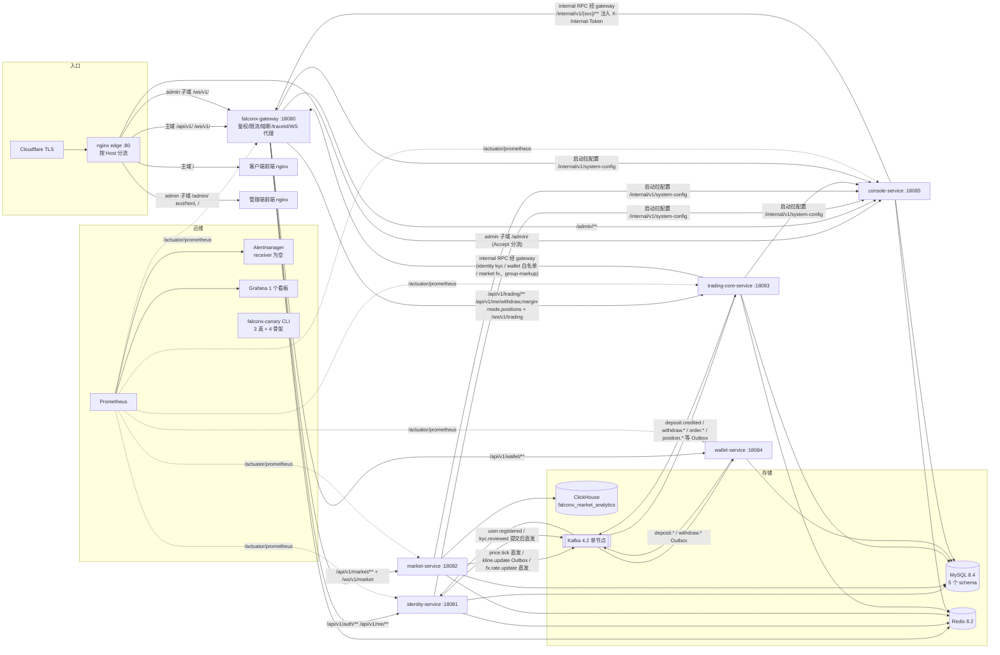
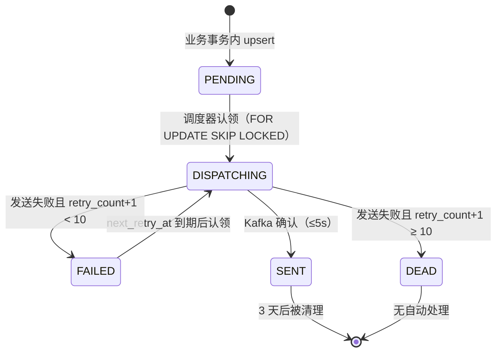

# FalconX 功能地图 · 平台基础：网关、事件与运维

- 版本：v1（2026-10-07）
- 变更历史：v1（2026-10-07）首次创建
- 依据：fxsystem main `da65af9`；对照代码逐项核实（未运行构建和测试）
- 范围：系统架构（服务、端口、存储、同步调用、异步事件）、`falconx-gateway` 全部能力、Kafka 主题总表与 Outbox/Inbox、全部 `@Scheduled` 任务、统一约定（`ApiResponse`、错误码、雪花 ID、traceId、Jackson 3、Flyway）、可观测（Actuator、HealthIndicator、Micrometer、Prometheus/Alertmanager/Grafana、`falconx-canary`）、部署与运行（compose、nginx、Dockerfile、脚本）、测试资产概况、环境变量总表。
  - 不覆盖：各业务域的接口、表结构和业务规则（身份、行情、交易、钱包、管理端分册各自负责）。本分册提到业务事件时只列"平台视角"的主题、payload 字段和投递方式，业务含义见对应分册。
  - 本分册不写任何服务器 IP、密钥值；涉及到仓库里出现了密钥的位置只写"位置 + 变量名"。

## 一图看懂

这张图想让读者看懂：所有外部流量经 nginx edge 进入，客户端走 gateway、管理端 API 直连 console；服务之间默认走 Kafka，但 console 和 trading-core 也会经 gateway 的 `/internal/v1/**` 做同步调用；可观测和巡检工具链已经搭起来，但告警通道和一半的 canary 还是空壳。

## 功能清单

| 编号 | 功能 | 使用者 | 状态 |
| --- | --- | --- | --- |
| P-01 | 服务清单、端口与存储拓扑 | 研发/运维 | 已实现 |
| P-02 | 服务间同步调用（internal RPC） | console-service、trading-core-service | 已实现 |
| P-03 | 网关 HTTP 路由表 | 客户端、管理端、内部服务 | 已实现 |
| P-04 | 网关 JWT 认证、白名单与身份头透传 | 客户端 | 已实现 |
| P-05 | 网关限流（全局 IP / 认证入口 / 交易） | 客户端 | 已实现 |
| P-06 | 网关熔断、超时与 fallback | 客户端 | 部分实现 |
| P-07 | traceId 生成与全链路透传、日志格式、安全响应头 | 全系统 | 部分实现 |
| P-08 | 网关 WebSocket 代理（`/ws/v1/market`、`/ws/v1/trading`）及指标 | 客户端、管理端 | 已实现 |
| P-09 | 动态系统配置客户端（SystemConfigClient） | gateway（唯一实际读取方） | 部分实现 |
| P-10 | Kafka 主题总表 | 各服务 | 部分实现 |
| P-11 | Outbox 发件箱与重试策略 | market、trading-core、wallet | 部分实现 |
| P-12 | Inbox 与消费端幂等、重试、死信 | identity、trading-core、wallet | 部分实现 |
| P-13 | 定时任务总表 | 各服务 | 已实现 |
| P-14 | 统一响应 `ApiResponse` 与错误码分段 | 全系统 | 已实现 |
| P-15 | 雪花 ID 与对外编号 | 全系统 | 部分实现 |
| P-16 | Jackson 3 序列化约定 | 全系统 | 已实现 |
| P-17 | Flyway 共享迁移与 ClickHouse 迁移 | 各 owner 服务 | 已实现 |
| P-18 | Actuator 端点与 HealthIndicator | 运维 | 已实现 |
| P-19 | 自定义 Micrometer 指标 | 运维 | 已实现 |
| P-20 | Prometheus 告警规则、Alertmanager、Grafana 看板 | 运维 | 部分实现 |
| P-21 | falconx-canary 巡检 CLI（7 个命令） | 运维 | 部分实现 |
| P-22 | 本地基础设施 `docker-compose.yml` | 研发 | 已实现 |
| P-23 | 演示档 `docker-compose.prod.yml`（资源限制） | 运维 | 已实现 |
| P-24 | nginx edge（按 Host 分流）与前端 nginx | 运维 | 已实现 |
| P-25 | Dockerfile 与容器入口脚本 | 运维 | 已实现 |
| P-26 | `scripts/` 与 `tools/` 运维脚本 | 研发/运维 | 已实现 |
| P-27 | 测试资产概况 | 研发/测试 | 已实现 |
| P-28 | 环境变量总表 | 研发/运维 | 已实现 |

---

## P-01 服务清单、端口与存储拓扑

- **状态**：已实现。根 `pom.xml` 声明 14 个模块；6 个可部署后端 + 1 个 CLI。
- **使用者与入口**：研发/运维；无业务接口。
- **业务逻辑**：
  1. 技术基线（根 `pom.xml`）：Spring Boot `4.0.5`、Java `25`、Spring Cloud `2025.1.0`、Spring Cloud Gateway `5.0.1`、MyBatis-Plus `3.5.15`、Redisson `4.3.0`、clickhouse-jdbc `0.9.7`、web3j `5.0.0`、socket.io-client `2.1.0`。
  2. 除 gateway（Reactive/Netty）和 canary（`web-application-type: none`）外，所有后端都打开 `spring.threads.virtual.enabled=true`（虚拟线程）。
  3. 共享库：`falconx-common`（`ApiResponse`、错误码接口）、`falconx-domain`（`DomainEvent`、`ChainType`、`UserStatus`）、`falconx-infrastructure`（雪花 ID、Kafka 头、Outbox 退避、traceId、Flyway、SystemConfigClient、RSA PEM 解析）、4 个 `*-contract`（跨服务 DTO 和事件 payload record）。
  4. 每个服务只连自己的 MySQL schema（`createDatabaseIfNotExist=true`），另由 `deploy/mysql/init/00-create-schemas.sql` 预建 5 个库（utf8mb4_unicode_ci）。
  5. HikariCP 统一：`minimum-idle=5`、`maximum-pool-size=20`、`idle-timeout=600000`、`max-lifetime=1800000`、`connection-timeout=30000`、`keepalive-time=300000`。
- **服务清单**：

| 服务 | 端口 | MySQL schema | ClickHouse | Redis | Kafka | 主要外部依赖 |
| --- | --- | --- | --- | --- | --- | --- |
| `falconx-gateway` | 18080 | 无 | 无 | 是（reactive，限流计数、token 黑名单） | 无 | 下游 5 服务 |
| `falconx-identity-service` | 18081 | `falconx_identity` | 无 | 是 | 生产 + 消费 | 无 |
| `falconx-market-service` | 18082 | `falconx_market` | `falconx_market_analytics`（`quote_tick`、`kline`） | 是（+ Redisson） | 生产 | LP Socket.IO 行情源 |
| `falconx-trading-core-service` | 18083 | `falconx_trading` | 无 | 是（+ Redisson） | 生产 + 消费 | 经 gateway 调 identity/wallet/market |
| `falconx-wallet-service` | 18084 | `falconx_wallet` | 无 | 无（模块未引入 redis 依赖） | 生产 + 消费 | ETH（Alchemy Sepolia）/TRON/BSC/SOL RPC |
| `falconx-console-service` | 18085 | `falconx_console` | 无 | 是（配置变更 pub/sub、admin token 黑名单、登录锁定） | 无（yml 未配置 kafka） | 经 gateway 调 4 个业务服务 |
| `falconx-canary` | 无（CLI） | 无 | 无 | 无 | 无 | 直连 6 服务 HTTP |
| 客户端前端 `falconx-frontend` | 本地 5200（vite dev） | — | — | — | — | gateway |
| 管理端前端 `falconx-console-frontend` | 本地 5300（vite dev） | — | — | — | — | console |

- **Redis key 前缀与归属**（代码中的字面量）：

| 前缀 | 写入方 | 读取方 | 用途 |
| --- | --- | --- | --- |
| `falconx:gateway:rate:global:{ip}:{minute}` | gateway | gateway | 全局 IP 限流计数，TTL 2 分钟 |
| `falconx:gateway:rate:auth:{path}:{ip}:{minute}` | gateway | gateway | 登录/注册限流，TTL 2 分钟 |
| `falconx:gateway:rate:trading:{userId}:{second}` | gateway | gateway | 交易限流，TTL 2 秒 |
| `falconx:auth:token:blacklist:{jti}` | identity | gateway | C 端 access token 吊销 |
| `falconx:admin:token:blacklist:{jti}` | console | gateway | admin token 吊销 |
| `falconx:auth:login:fail:`、`falconx:auth:register:limit:` | identity | identity | 登录失败/注册频控 |
| `falconx:admin:login-failure:`、`falconx:admin:login-locked:`、`falconx:admin:refresh-token:*`、`falconx:admin:balance-adjust:daily:` | console | console | 管理端安全与调账日限额 |
| `falconx:config:changed`（pub/sub 频道） | console | gateway/identity/market/trading | 系统配置热更新，见 P-09 |
| `falconx:market:price:{symbol}` | market | market | 最新报价 |
| `falconx:market:last-valid-price:` | market | market | 参考价 |
| `falconx:market:symbol-spec:`、`falconx:market:trading:schedule:`、`falconx:market:swap-rate:` | market | market + trading-core（共享读取） | 品种规格、交易时间快照（TTL 25h）、隔夜利息快照 |
| `falconx:fx:rate:` | market | market | FX 汇率（TTL 5s） |
| `falconx:trading:quote:snapshot:{symbol}` | trading-core | trading-core | 交易侧报价快照 |
| `falconx:trading:risk:` | trading-core | trading-core | 风控开关缓存 |

- **证据**：`pom.xml`、各服务 `src/main/resources/application.yml`、各模块 `pom.xml`、`deploy/mysql/init/00-create-schemas.sql`。

## P-02 服务间同步调用（internal RPC）

- **状态**：已实现。
- **使用者与入口**：
  - console-service：`InternalRpcClient`（`falconx-console-service/.../internal/InternalRpcClient.java`），基址 `falconx.console.internal-rpc.gateway-base-url`（默认 `http://localhost:18080`），connect 2s / read 5s，`JdkClientHttpRequestFactory`（为支持 PATCH）。
  - trading-core：`TradingExternalRpcClient`，基址 `falconx.trading.external-rpc.gateway-base-url`，connect 2s / read 5s，`service-caller-id=0`。
  - 各服务启动时的 `DefaultSystemConfigClient` 直连 console（不经 gateway），见 P-09。
- **业务逻辑**：
  1. 调用方一律打 gateway 的 `/internal/v1/{identity|market|trading|wallet}/**`；gateway 路由（P-03）用 `setRequestHeader` 注入 `X-Internal-Token`（值来自 `FALCONX_INTERNAL_API_TOKEN`，dev 默认值写在 yml 里）。
  2. 被调方各有 `*InternalApiTokenFilter`（identity/market/trading/wallet 四个），只拦截本服务前缀 `/internal/v1/{svc}/`：缺 token → HTTP 401 `90702`；token 不等 → 401 `90701`；缺 `X-Admin-User-Id` → 400 `90703`（以 identity 实现为准，其余三个未逐行核对）。
  3. console 调用时附带 `X-Admin-User-Id`（当前登录管理员）和 `X-Trace-Id`（取 MDC，console 本身没有 trace 过滤器，常为空串，见 P-07）。
  4. gateway 没有 `/internal/v1/console/**` 路由；console 的 `/internal/v1/system-config` 由各服务直连。
- **调用矩阵**（按代码中的路径字面量统计）：

| 调用方 → 被调方 | 路径 | 用途 |
| --- | --- | --- |
| trading-core → identity | `GET /internal/v1/identity/users/{userId}/kyc-status` | 出金 KYC 等级校验（`HttpWithdrawKycLevelQueryClient`） |
| trading-core → wallet | `GET /internal/v1/wallet/withdraw/whitelists[/{id}]` 等 4 处 | 出金白名单查询（`HttpWithdrawWhitelistQueryClient`） |
| trading-core → wallet | `GET /internal/v1/wallet/console/deposits/from-addresses?userId=&chain=` | 出金陌生地址判定（`HttpWithdrawDepositAddressQueryClient`） |
| trading-core → market | `GET /internal/v1/market/fx/rates` | 启动全量拉 FX 汇率（`DefaultFxRateService`） |
| trading-core → market | `GET /internal/v1/market/symbols/group-markup/all-enabled`、`.../changes` | 用户组加点全量/增量（`MarketGroupMarkupClient`） |
| console → identity | `/internal/v1/identity/users/**`、`/internal/v1/identity/kyc/**` | 客户管理、KYC 审核 |
| console → market | `/internal/v1/market/symbols/**`（含 `group-markup`、`group-visibility`、`market-holidays`、`quote-mappings`、`featured`）、`/internal/v1/market/fx` | 品种与行情配置 |
| console → trading-core | `/internal/v1/trading/console/**`（订单、持仓、挂单、风控配置、tier、通知模板、价格提醒、出入金、平台指标等 30 余条）、`/internal/v1/trading/accounts/**`、`/internal/v1/trading/withdraws` | 交易监控与风控运营 |
| console → wallet | `/internal/v1/wallet/console/deposits/**`、`/internal/v1/wallet/console/provision-dlq/**`、`/internal/v1/wallet/withdraw/**` | 入金记录、地址预分配 DLQ、出金白名单 |
| identity/market/trading-core/gateway → console | `GET /internal/v1/system-config` | 启动拉全量系统配置 |

- **错误码**：

| 错误码 | 含义 | 触发条件 |
| --- | --- | --- |
| `90701` | Internal Token Invalid | `X-Internal-Token` 与配置不一致 |
| `90702` | Internal Token Missing | 缺 `X-Internal-Token` |
| `90703` | Internal Admin User Id Missing | 缺 `X-Admin-User-Id` |

- **相关指标**：`falconx.console.internal.rpc.duration{outcome,target}`、`falconx.console.internal.rpc.failures.total{outcome,target}`（见 P-19）。
- **证据**：`falconx-console-service/src/main/java/com/falconx/console/internal/InternalRpcClient.java`、`falconx-trading-core-service/src/main/java/com/falconx/trading/client/*.java`、`falconx-identity-service/src/main/java/com/falconx/identity/security/IdentityInternalApiTokenFilter.java`、`falconx-gateway/src/main/java/com/falconx/gateway/config/GatewayConfiguration.java`。

## P-03 网关 HTTP 路由表

- **状态**：已实现。
- **使用者与入口**：所有经 gateway 的 HTTP 请求；路由在 `GatewayConfiguration.falconxRouteLocator` 用 Java DSL 定义，按声明顺序先匹配先生效；不做 StripPrefix，路径原样转发。
- **业务逻辑**：
  1. 下游基址来自 `falconx.gateway.routes.*-base-url`（`GatewayRouteProperties` 默认 `http://localhost:1808x`，compose 用 `FALCONX_GATEWAY_ROUTES_*_BASE_URL` 覆盖为容器名）。
  2. 每条路由都挂 `circuitBreaker` 过滤器和 `CONNECT_TIMEOUT_ATTR` / `RESPONSE_TIMEOUT_ATTR` 元数据（见 P-06）。
  3. `/api/v1/me/withdraw/**`、`/api/v1/me/margin-mode/**`、`/api/v1/me/positions/**` 必须排在通用 `/api/v1/me/**` 之前，否则会被转到 identity（代码注释记录过 STAGE-7 与 STAGE-14D1 两次漏配导致 500）。
- **路由表**（按匹配顺序）：

| 顺序 | routeId | 路径前缀 | 目标服务 | fallback 路径 | 额外过滤 |
| --- | --- | --- | --- | --- | --- |
| 1 | `identity-route` | `/api/v1/auth/**` | identity :18081 | `/internal/gateway/fallback/identity-route` | — |
| 2 | `trading-me-withdraw-route` | `/api/v1/me/withdraw/**` | trading-core :18083 | `.../trading-route` | — |
| 3 | `trading-me-margin-mode-route` | `/api/v1/me/margin-mode/**` | trading-core | `.../trading-route` | — |
| 4 | `trading-me-positions-route` | `/api/v1/me/positions/**` | trading-core | `.../trading-route` | — |
| 5 | `identity-me-route` | `/api/v1/me/**` | identity | `.../identity-route` | — |
| 6 | `market-route` | `/api/v1/market/**` | market :18082 | `.../market-route` | — |
| 7 | `trading-route` | `/api/v1/trading/**` | trading-core | `.../trading-route` | — |
| 8 | `wallet-route` | `/api/v1/wallet/**` | wallet :18084 | `.../wallet-route` | — |
| 9 | `console-route` | `/admin/**` | console :18085 | `.../console-route` | 不做 gateway 鉴权（console 自鉴权 + IP 白名单） |
| 10 | `internal-identity-route` | `/internal/v1/identity/**` | identity | `.../identity-route` | 注入 `X-Internal-Token` |
| 11 | `internal-market-route` | `/internal/v1/market/**` | market | `.../market-route` | 注入 `X-Internal-Token` |
| 12 | `internal-trading-route` | `/internal/v1/trading/**` | trading-core | `.../trading-route` | 注入 `X-Internal-Token` |
| 13 | `internal-wallet-route` | `/internal/v1/wallet/**` | wallet | `.../wallet-route` | 注入 `X-Internal-Token` |
| — | WebSocket | `/ws/v1/market`、`/ws/v1/trading` | market / trading-core | — | 走 `SimpleUrlHandlerMapping`（order=-1），见 P-08 |

- **风险提示（代码事实）**：
  1. `/internal/v1/**` 路由在 gateway 上不做任何调用方鉴权，任何能访问 gateway 18080 端口的请求都会被注入合法 `X-Internal-Token`，只需再带任意 `X-Admin-User-Id`。nginx edge 只把 `/api/v1/`、`/ws/v1/` 转给 gateway，所以公网经 edge 打不到；但 `docker-compose.prod.yml` 把 18080 映射到宿主机，是否被安全组挡住取决于云上配置（未验证）。
  2. 演示档 edge 的 admin 子域把 `/admin/` 直接转给 console-service，不经 gateway，因此 `console-route` 在演示档里实际不走（仅本地 vite 代理或直连 18080 时使用，未验证前端代理配置）。
- **证据**：`falconx-gateway/src/main/java/com/falconx/gateway/config/GatewayConfiguration.java`、`GatewayRouteProperties.java`、`deploy/docker/nginx-edge.conf`。

## P-04 网关 JWT 认证、白名单与身份头透传

- **状态**：已实现。
- **使用者与入口**：客户端所有 `/api/v1/**` 请求；`GatewayAuthenticationFilter`（GlobalFilter，order = `HIGHEST_PRECEDENCE + 10`）。
- **业务逻辑**：
  1. 放行条件（任一满足即不鉴权）：路径不以 `/api/v1/` 开头（即 `/admin/**`、`/internal/**`、`/actuator/**`、`/internal/gateway/fallback/**` 全部不鉴权）；路径**精确等于**白名单之一；HTTP 方法为 `OPTIONS`。
  2. 白名单 `PUBLIC_PATHS`：`/api/v1/auth/register`、`/api/v1/auth/login`、`/api/v1/auth/refresh`。其余 `/api/v1/**`（包括 `/api/v1/market/**` 行情接口、`/api/v1/auth/logout`）都要 token。
  3. 取 `Authorization: Bearer <token>`，缺失或前缀不对 → 401 `10001`。
  4. `GatewayJwtVerifier.verifyAccessToken`：JWT 必须 3 段；`SHA256withRSA` 用 identity 公钥（`falconx.gateway.security.public-key-pem`）验签；payload `typ` 必须为 `access`；`exp` 必须大于当前 UTC 秒；`sub`、`uid`、`status`、`jti` 都必须非空；`groupCode` 缺省 `default`；再查 Redis `falconx:auth:token:blacklist:{jti}`，存在则拒绝。任何失败 → 401 `10001`。
  5. 状态限制：`status=BANNED` → 403 `10002`；`status=FROZEN` 且方法为 `POST/PUT/PATCH/DELETE` → 403 `10007`（因此冻结用户也无法调用 `POST /api/v1/auth/logout`）。
  6. 通过后向下游设置头：`X-User-Id`(=`sub`)、`X-User-Uid`、`X-User-Status`、`X-User-Group-Code`、`X-User-Jti`（覆盖客户端同名头）。
  7. admin token（console 签发）只在 `/ws/v1/trading` 握手时验证：`iss` 必须为 `falconx-console-service`、`typ=access`、未过期、`sub` 非空；有 `jti` 时查 `falconx:admin:token:blacklist:{jti}`，无 `jti` 的旧 token 直接放行（兼容逻辑）。console 公钥未配置时 admin WS 一律失败。
- **请求字段**：

| 字段 | 类型 | 必填 | 含义 | 约束/取值 |
| --- | --- | --- | --- | --- |
| `Authorization` 头 | string | 白名单外必填 | `Bearer <accessToken>` | RS256 JWT，`typ=access` |

- **JWT claims（gateway 读取）**：

| claim | 含义 |
| --- | --- |
| `sub` | 用户 ID（→ `X-User-Id`） |
| `uid` | 对外 UID（→ `X-User-Uid`） |
| `status` | 用户状态（`BANNED`/`FROZEN`/其他） |
| `groupCode` | 用户组，空则 `default` |
| `jti` | token ID，用于黑名单 |
| `typ` | 必须 `access` |
| `exp` | 过期时间（epoch 秒） |
| `iss` | 仅 admin token 校验，`falconx-console-service` |

- **错误码**：

| 错误码 | 含义 | 触发条件 |
| --- | --- | --- |
| `10001` | Unauthorized | 缺头、验签失败、过期、claim 缺失、命中黑名单 |
| `10002` | User Banned | `status=BANNED` |
| `10007` | User Frozen | `status=FROZEN` 且写请求 |

- **证据**：`falconx-gateway/src/main/java/com/falconx/gateway/filter/GatewayAuthenticationFilter.java`、`security/GatewayJwtVerifier.java`、`config/GatewaySecurityProperties.java`。

## P-05 网关限流（全局 IP / 认证入口 / 交易）

- **状态**：已实现。
- **使用者与入口**：`GatewayGlobalRateLimitFilter`（order `HIGHEST_PRECEDENCE + 5`，在鉴权前）、`GatewayRateLimitFilter`（order `HIGHEST_PRECEDENCE + 15`，在鉴权后）。
- **业务逻辑**：
  1. 计数方式：Redis `INCR` + `EXPIRE`，固定窗口（分钟桶 = epochSecond/60，秒桶 = epochSecond）。
  2. 三类限流：

| 类型 | 适用路径 | 维度 | 默认阈值 | 动态配置 key（P-09） | 超限响应 |
| --- | --- | --- | --- | --- | --- |
| 全局兜底 | 所有 `/api/v1/**` | 客户端 IP / 分钟 | 200（`global-request-rate-limit-per-minute`） | `gateway.ratelimit.global-per-minute` | 429 `10013` |
| 认证入口 | 精确 `/api/v1/auth/login`、`/api/v1/auth/register` | 路径 + IP / 分钟 | 20（`auth-request-rate-limit-per-minute`） | `gateway.ratelimit.auth-per-minute` | 429 `10003`（login）/ `10004`（register） |
| 交易 | `/api/v1/trading/**` | `X-User-Id` / 秒 | 10（`trading-request-rate-limit-per-second`） | `gateway.ratelimit.trading-per-second` | 429 `10012` |

  3. 判断 `currentCount > limit` 才拒绝（第 limit+1 次被拒）。
  4. 客户端 IP 解析：只有当 TCP 对端地址在可信代理列表时，才采用 `X-Client-Ip` 头，否则用对端地址。可信代理默认 `127.0.0.1`、`::1`、`0:0:0:0:0:0:0:1` 和 4 个 docker bridge 网关地址（`GatewaySecurityProperties.trustedProxyIps`），可用动态 key `gateway.security.trusted-proxy-ips`（JSON 数组）覆盖。
  5. 注意：`GatewayTraceContextFilter`（最先执行）会把 `X-Client-Ip` 改写为 `X-Forwarded-For` 第一段或对端地址，限流过滤器读到的是改写后的值；nginx edge 把 `CF-Connecting-IP` 写入 `X-Client-Ip` 但 XFF 由 `$proxy_add_x_forwarded_for` 生成，两者口径可能不同（未运行验证实际取值）。
  6. `/api/v1/trading/**` 之外的交易相关路径（`/api/v1/me/withdraw/**`、`/api/v1/me/positions/**`、`/api/v1/me/margin-mode/**`）不受交易限流，只受全局限流。WebSocket 握手不走这三类限流。
- **错误码**：

| 错误码 | 含义 | 触发条件 |
| --- | --- | --- |
| `10003` | Login Rate Limited | 同 IP 每分钟登录 > 20 |
| `10004` | Register Rate Limited | 同 IP 每分钟注册 > 20 |
| `10012` | Trading Rate Limited | 同用户每秒 `/api/v1/trading/**` > 10 |
| `10013` | Global IP Rate Limited | 同 IP 每分钟 `/api/v1/**` > 200 |

- **证据**：`falconx-gateway/src/main/java/com/falconx/gateway/filter/GatewayGlobalRateLimitFilter.java`、`GatewayRateLimitFilter.java`、`error/GatewayErrorCode.java`、`falconx-gateway/src/main/resources/application.yml`。

## P-06 网关熔断、超时与 fallback

- **状态**：部分实现。5 个 resilience4j 实例有显式配置；另外 8 条路由的熔断实例与全部路由的 TimeLimiter 在非 dev profile 下没有显式配置，走库默认值（推断，未运行验证）。
- **使用者与入口**：每条路由的 `circuitBreaker` 过滤器（依赖 `spring-cloud-starter-circuitbreaker-reactor-resilience4j`）；`GatewayFallbackController`（`@RequestMapping("/internal/gateway/fallback/{routeId}")`）。
- **业务逻辑**：
  1. resilience4j CircuitBreaker 实例（`application.yml`），公共参数：`COUNT_BASED` 滑窗 20、最少调用 10、失败率阈值 50%、慢调用率阈值 50%、半开放行 5 次、打开后等待 10s。

| 实例 | 慢调用阈值 | 说明 |
| --- | --- | --- |
| `identity-route` | 1s | 登录注册 |
| `market-route` | 2s | 2026-06-08 从 500ms 调到 2s：K 线历史查 ClickHouse 合法耗时 0.2~0.65s，启动请求风暴时慢调用率破 50% 导致整段 market 504 |
| `trading-route` | 2s | 下单/平仓 |
| `wallet-route` | 5s | 链上 RPC |
| `console-route` | 3s | 管理端 |

  2. Spring Cloud Gateway 的熔断过滤器在未调用 `setName` 时以 routeId 作为熔断实例 ID（框架行为，推断）。因此 `trading-me-withdraw-route`、`trading-me-margin-mode-route`、`trading-me-positions-route`、`identity-me-route`、4 条 `internal-*-route` 共 8 个实例没有命中上表配置，使用 resilience4j 默认参数；它们只是 fallback URI 借用了上表的 routeId 名字。
  3. 连接/响应超时（路由元数据）：默认 `connect-timeout-millis=1000`、`response-timeout-millis=5000`；dev profile 改为 5000 / 15000。
  4. TimeLimiter：只在 `application-dev.yml` 配置 `identity-route` 10s、`market-route` 30s（注释：dev 下 `/api/v1/market/symbols` 单次 1571 行 / 626KB，DB+ClickHouse 9~12s）、`trading-route` 10s、`wallet-route` 10s；`console-route` 和其余路由未配置，走默认值（resilience4j 默认 1s，推断）。演示档容器镜像 `SPRING_PROFILES_ACTIVE=dev`，所以演示档实际用的是 dev 值。
  5. fallback：熔断打开、超时或下游异常时 forward 到 `/internal/gateway/fallback/{routeId}`，返回 HTTP 504，body 为 `ApiResponse`，`code=99002`、`message=dependency timeout`，`traceId` 取请求头 `X-Trace-Id`；记录 `gateway.route.fallback routeId=...` error 日志。
- **响应字段**：见 P-14 `ApiResponse`。
- **错误码**：

| 错误码 | 含义 | 触发条件 |
| --- | --- | --- |
| `99002` | dependency timeout | 下游超时、熔断打开、连接失败 |

- **证据**：`falconx-gateway/src/main/resources/application.yml`、`application-dev.yml`、`controller/GatewayFallbackController.java`、`config/GatewayConfiguration.java`。

## P-07 traceId 生成与全链路透传、日志格式、安全响应头

- **状态**：部分实现。gateway 和 identity/market/trading-core/wallet 已接通；console-service 没有 trace 过滤器，管理端请求在 console 内无 traceId。
- **使用者与入口**：`GatewayTraceContextFilter`（order `HIGHEST_PRECEDENCE`）、各服务 `*TraceContextFilter`、`KafkaEventMessageSupport`、`GatewaySecurityHeadersFilter`（order `LOWEST_PRECEDENCE - 100`）。
- **业务逻辑**：
  1. traceId 格式：`UUID.randomUUID()` 去掉横线，32 位小写十六进制；校验正则 `^[0-9a-f]{32}$`（`TraceIdSupport`）。
  2. gateway 对每个外部 HTTP 请求**忽略**客户端传入的 `X-Trace-Id`，生成新值，写入下游请求头 `X-Trace-Id`、响应头 `X-Trace-Id`、exchange 属性和 MDC；同时写 `X-Client-Ip`。日志事件 `gateway.request.received` / `completed` / `failed`。
  3. WebSocket 握手过滤器各自生成新 traceId 并透传。
  4. 下游服务（identity/market/trading-core/wallet）的 `*TraceContextFilter` 用 `TraceIdSupport.reuseOrCreate`：合法则沿用，否则新生成；放入 MDC `traceId` 并回写响应头。
  5. Kafka：生产时 `buildJsonMessage` 从 MDC 取 traceId（没有就新生成）写入头 `X-Trace-Id`；消费时 `bindTraceId` 写 MDC、结束后 `clearTraceId`。`identity.user.registered` 用普通 `send(topic,key,json)`，不带任何头（见 P-10）。
  6. 定时任务（如出金冷静期、平台敞口守卫、Swap 结算）在每次运行时自行生成 traceId 放入 MDC。
  7. 日志格式：所有服务 `logging.pattern.console` 统一为 `%d{yyyy-MM-dd'T'HH:mm:ss.SSSXXX} %-5level --- [%15.15t] [traceId=%X{traceId:-}] %logger{39} : %msg%n%ex`；只有 gateway 有 `logback-spring.xml`（引用同一 pattern）。
  8. console-service 代码里没有 `MDC.put`，`InternalRpcClient` 从 MDC 取 traceId，取不到就发空串；gateway 收到后仍会重新生成，所以 console → 业务服务的链路在 console 侧断开。
  9. 安全响应头：gateway 在所有响应上仅当不存在时追加 `X-Content-Type-Options: nosniff`、`X-Frame-Options: DENY`、`Referrer-Policy: strict-origin-when-cross-origin`、`Permissions-Policy: camera=(), microphone=(), geolocation=(), payment=()`。CSP/HSTS 有意不在 gateway 加（注释说由 nginx edge 处理，但 `nginx-edge.conf` 里没有配置 CSP/HSTS）。
- **字段**：

| 头/字段 | 方向 | 含义 |
| --- | --- | --- |
| `X-Trace-Id` | gateway → 下游、响应头、Kafka 头 | 32 位 hex traceId |
| `X-Client-Ip` | gateway → 下游 | 解析出的客户端 IP |
| MDC `traceId` | 进程内 | 日志自动输出 |

- **证据**：`falconx-infrastructure/src/main/java/com/falconx/infrastructure/trace/TraceIdSupport.java`、`TraceIdConstants.java`、`falconx-infrastructure/.../kafka/KafkaEventMessageSupport.java`、`falconx-gateway/.../filter/GatewayTraceContextFilter.java`、`GatewaySecurityHeadersFilter.java`、`falconx-*/src/main/java/.../config/*TraceContextFilter.java`、`falconx-gateway/src/main/resources/logback-spring.xml`。

## P-08 网关 WebSocket 代理（`/ws/v1/market`、`/ws/v1/trading`）及指标

- **状态**：已实现。
- **使用者与入口**：客户端行情与用户实时推送；管理端实时推送（仅 trading 端点）。`ws(s)://{host}/ws/v1/market?token=<accessToken>`、`ws(s)://{host}/ws/v1/trading?token=<accessToken 或 admin accessToken>`。
- **业务逻辑**：
  1. 握手过滤器（`WebFilter`）仅在路径精确匹配且 `Upgrade: websocket` 时生效；token 从 query 参数 `token` 取，缺失 → HTTP 401。
  2. market 端点：只接受 C 端 token（P-04 规则）；`BANNED` → 403；**不**检查 `FROZEN`。
  3. trading 端点：先按 payload 的 `iss` 判断是否 admin token（不验签），是则走 admin 校验，成功后只设 `X-Admin-User-Id`，不占连接配额；否则按 C 端规则。
  4. 连接上限：同一用户默认 5 个（`marketWebSocketConnectionLimit`，yml 未暴露，只能改代码默认值），market 和 trading 两个端点**共用**同一个 `GatewayMarketWebSocketSessionRegistry` 计数；超限 → HTTP 429。计数是单实例内存（`ConcurrentHashMap` + CAS），多实例 gateway 时不共享。
  5. 代理：用 `WebSocketClient` 连下游 `ws://{base}/ws/v1/market` 或 `/ws/v1/trading`（https 基址则 wss），去掉 query，复制 `X-User-*`、`X-Admin-User-Id`、`X-Trace-Id`（trading 还复制 `X-Client-Ip`）；双向转发 TEXT，PING/PONG 以空负载重建转发，其他类型（BINARY 等）丢弃；任一方向结束即关闭另一端；下游连接失败 → 客户端以 `SERVER_ERROR` 关闭；结束时释放连接配额。
  6. 客户端 IP 解析不一致：market 握手只在对端为可信代理时信任 `X-Client-Ip`/`X-Forwarded-For`；trading 握手无条件信任这两个头（仅用于日志与透传）。
  7. 指标（`GatewayWebSocketProxyMetrics`）：

| 指标 | 类型 | 标签 | 含义 |
| --- | --- | --- | --- |
| `falconx.gateway.websocket.proxy.sessions.active` | Gauge | `upstream`=`market`/`trading` | 当前活跃 bridge 数（订阅时 +1，结束时 -1，不低于 0） |
| `falconx.gateway.websocket.proxy.messages.total` | Counter | `upstream`、`direction`=`client_to_upstream`/`upstream_to_client` | 成功转发帧数（TEXT/PING/PONG） |

- **错误码**：握手失败只返回 HTTP 状态（401/403/429），不返回业务码。
- **证据**：`falconx-gateway/src/main/java/com/falconx/gateway/config/GatewayWebSocketConfiguration.java`、`websocket/*.java`、`falconx-gateway/src/test/java/com/falconx/gateway/GatewayMarketWebSocketIntegrationTests.java`、`websocket/GatewayWebSocketProxyMetricsTests.java`。

## P-09 动态系统配置客户端（SystemConfigClient）

- **状态**：部分实现。客户端在 gateway/identity/market/trading-core 自动装配，但只有 gateway 实际读取了 4 个 key；启动拉取失败后不会自愈。系统配置的管理端 CRUD 见管理端分册。
- **使用者与入口**：`falconx-infrastructure` 自动配置 `SystemConfigClientAutoConfiguration`（条件：classpath 有 `ReactiveRedisConnectionFactory` 和 Jackson 3 `ObjectMapper`，且 `falconx.system-config.enabled` 不为 false）。wallet 没有 redis 依赖，不装配；console 在 compose 中 `FALCONX_SYSTEM_CONFIG_ENABLED=false`。
- **业务逻辑**：
  1. `@PostConstruct init()`：`GET {console-base-url}/internal/v1/system-config`（头 `X-Internal-Token`，HTTP connect 5s，请求超时 `fetch-timeout-millis` 默认 3000ms）；响应 `data.items[]` 或 `data[]` 中每项取 `configKey`/`configValue` 放入内存 `ConcurrentHashMap`。
  2. 拉取成功后订阅 Redis 频道 `falconx:config:changed`，消息体 `SystemConfigChangedEvent{configKey,newValue,action}`，收到即覆盖缓存（`newValue` 为 null 时存空串）。
  3. 任一步异常：记录 `system-config.client.bootstrap-failed` 后 `ready=false`，之后所有 `getXxx` 返回调用方给的默认值；代码**不会**重试，也不会订阅频道（与代码注释"下次 redis 推送时再 cache"不符）。
  4. 类型解析：`getBoolean` 认 `true/1/yes/on`；`getDuration` 支持 `1h/30m/10s` 简写和 ISO-8601；`getStringList` 解析 JSON 数组；解析失败返回默认值并告警。
  5. 实际读取方（全部在 gateway）：`gateway.ratelimit.global-per-minute`、`gateway.ratelimit.auth-per-minute`、`gateway.ratelimit.trading-per-second`、`gateway.security.trusted-proxy-ips`。
- **配置项**：

| 配置 | 默认 | 含义 |
| --- | --- | --- |
| `falconx.system-config.enabled` | true | 开关 |
| `falconx.system-config.console-base-url` | `http://localhost:18085` | console 基址（gateway yml 用 `FALCONX_CONSOLE_BASE_URL`） |
| `falconx.system-config.internal-token` | 无 | `X-Internal-Token` |
| `falconx.system-config.fetch-timeout-millis` | 3000 | 拉取超时 |

- **证据**：`falconx-infrastructure/src/main/java/com/falconx/infrastructure/config/*.java`、`META-INF/spring/org.springframework.boot.autoconfigure.AutoConfiguration.imports`。

## P-10 Kafka 主题总表

- **状态**：部分实现。21 个主题都有生产代码；其中 8 个主题在仓库内没有任何消费者（只发不收）；文档要求的 DLQ 主题没有实现（见 P-12）。
- **使用者与入口**：各服务 `producer/`、`consumer/` 包；`@KafkaListener` 共 14 处。
- **业务逻辑（通用）**：
  1. 消息体只放业务 payload JSON；元数据放 Kafka 头 `X-Event-Id`、`X-Event-Type`、`X-Event-Source`、`X-Trace-Id`（`KafkaEventHeaderConstants`）；Kafka key 即分区键。例外：`identity.user.registered` 不带头，`eventId/eventType` 放在 payload 内。
  2. 序列化：key/value 都是 `StringSerializer`；生产端 `acks=all`、`batch-size=16384`、`linger.ms=10`、`compression.type=lz4`；identity 额外 `retries=5`、`enable.idempotence=true`。
  3. 消费端：`auto-offset-reset=earliest`，`listener.missing-topics-fatal=false`。
  4. 主题由 broker 自动创建（仓库内没有 `NewTopic`/建主题脚本），分区数取 broker 默认值；compose 未设 `KAFKA_NUM_PARTITIONS`，按 Kafka 默认推断为 1 个分区（未验证）。因此 trading 对 `price.tick` 配置的 4 个并发消费者实际可能只有 1 个在工作。
  5. 同步直发的 `send(...).get(5, SECONDS)`：market（price.tick/kline Outbox 投递/fx）、trading Outbox 投递、wallet Outbox 投递。identity 是异步 `whenComplete` 只打日志。
- **主题总表**：

| # | 主题 | 生产者（类） | 投递方式 | 分区键 | eventId 规则 | 消费者（类） | consumer group | 消费端幂等 |
| --- | --- | --- | --- | --- | --- | --- | --- | --- |
| 1 | `falconx.market.price.tick` | market `KafkaMarketEventPublisher` | 直发（高频） | `symbol` | `evt-{雪花}` | trading `MarketPriceTickEventConsumer` | `falconx-trading-core-service`（容器工厂 `marketPriceTickKafkaListenerContainerFactory`，并发 4） | 无 Inbox；失败 FixedBackOff 1s×2 后记日志丢弃 |
| 2 | `falconx.market.kline.update` | market `OutboxAwareMarketEventPublisher` → `MarketOutboxDispatcher` | Outbox | `symbol:interval` | `market-kline:{UUIDv3(symbol:interval:closeTime)}` | trading `MarketKlineUpdateEventConsumer` | `falconx-trading-core-service` | trading `t_inbox`（仅审计留痕，无业务动作） |
| 3 | `falconx.market.fx.rate.update` | market `FxRateKafkaPublisher`（`@Scheduled` 每 1000ms 发全部汇率快照） | 直发 | `{base}:{quote}` | `evt-{雪花}` | trading `TradingKafkaEventListener.onMarketFxRateUpdate` → `FxRateUpdateEventConsumer` | `falconx-trading-fx-rate` | 无（覆盖式更新） |
| 4 | `falconx.identity.user.registered` | identity `IdentityKafkaEventPublisher.publishUserRegistered` | 注册事务 `afterCommit` 直发，**无 Kafka 头** | `userId` | payload 内 `user-registered-{userId}` | wallet `IdentityUserRegisteredEventConsumer` | `falconx.wallet-service.user-registered-consumer` | `t_wallet_address` 唯一约束；地址分配失败落 `t_wallet_address_provision_dlq` |
| 5 | `falconx.identity.kyc.reviewed` | identity `publishKycReviewed` | 审核事务 `afterCommit` 直发 | `userId` | `kyc-reviewed-{submissionId}` | trading `KycReviewedEventConsumer` | `falconx.trading-core-service.kyc-reviewed-consumer-group` | `t_notification` 按 `relatedKey=kyc.reviewed`+`submissionId` 查重 |
| 6 | `falconx.wallet.deposit.detected` | wallet `OutboxBackedWalletEventPublisher` | Outbox | `chain:txHash` | `wallet-detected:{UUIDv3(walletTxId)}` | **无** | — | — |
| 7 | `falconx.wallet.deposit.confirmed` | 同上 | Outbox | `chain:txHash` | `wallet-confirmed:{UUIDv3(walletTxId)}` | trading `WalletDepositConfirmedEventConsumer` | `falconx-trading-core-service` | trading `t_inbox`（`INSERT IGNORE`） |
| 8 | `falconx.wallet.deposit.reversed` | 同上 | Outbox | `chain:txHash` | `wallet-reversed:{UUIDv3(walletTxId)}` | trading `WalletDepositReversedEventConsumer` | `falconx-trading-core-service` | trading `t_inbox` |
| 9 | `falconx.wallet.withdraw.broadcast` | 同上 | Outbox | `userId` | `wallet-withdraw-broadcast:{UUIDv3(withdrawId)}` | trading `WalletWithdrawBroadcastEventConsumer` | `falconx.trading-core-service.wallet-withdraw-broadcast-consumer-group` | 出金单 CAS `WHERE status=2` |
| 10 | `falconx.wallet.withdraw.confirmed` | 同上 | Outbox | `userId` | `wallet-withdraw-confirmed:{UUIDv3(withdrawId)}` | trading `WalletWithdrawConfirmedEventConsumer` | `falconx.trading-core-service.wallet-withdraw-confirmed-consumer-group` | `t_notification` 查重 + 出金单 CAS |
| 11 | `falconx.wallet.withdraw.failed` | 同上 | Outbox | `userId` | `wallet-withdraw-failed:{UUIDv3(withdrawId)}` | trading `WalletWithdrawFailedEventConsumer` | `falconx.trading-core-service.wallet-withdraw-failed-consumer-group` | `t_notification` 查重 + 出金单 CAS |
| 12 | `falconx.trading.deposit.credited` | trading `TradingDepositCreditApplicationService` | Outbox | `userId` | `deposit-credited:{walletTxId}` | identity `DepositCreditedEventConsumer` | `falconx.identity-service.deposit-credited-consumer-group` | identity `t_inbox` |
| 13 | `falconx.trading.withdraw.requested` | trading `WithdrawSubmitApplicationService` | Outbox | `userId` | `withdraw-requested:{withdrawId}` | **无** | — | — |
| 14 | `falconx.trading.withdraw.reviewed` | trading `WithdrawAdminApplicationService` | Outbox | `userId` | `withdraw-reviewed:{withdrawId}:{result}` | wallet `TradingWithdrawReviewedEventConsumer` | `falconx.wallet-service.trading-withdraw-reviewed-consumer` | `t_withdraw_tx` 唯一约束 |
| 15 | `falconx.trading.order.created` | trading `TradingOrderPlacementApplicationService` | Outbox | `userId` | `order-created:{orderNo}` | **无** | — | — |
| 16 | `falconx.trading.order.filled` | 同上 | Outbox | `userId` | `order-filled:{orderNo}` | **无** | — | — |
| 17 | `falconx.trading.position.closed` | trading `TradingPositionCloseApplicationService` | Outbox | `userId` | `position-closed:{positionId}` | **无** | — | — |
| 18 | `falconx.trading.liquidation.executed` | 同上 | Outbox | `userId` | `liquidation-executed:{positionId}` | **无** | — | — |
| 19 | `falconx.trading.swap.settled` | trading `TradingSwapSettlementApplicationService` | Outbox | `userId` | `swap-settled:{ledgerId}` | **无** | — | — |
| 20 | `falconx.trading.account.mode.changed` | trading `MarginModeSwitchApplicationService` | Outbox | `userId` | `account-mode-changed:{userId}:{changedAtMillis}` | **无** | — | — |
| 21 | `falconx.trading.position.close.post-process` | trading `TradingPositionCloseApplicationService`（仅 `position-close.async-post-process.enabled=true`，默认 true） | Outbox（服务自发自收） | `userId` | `trade-write:{positionId}:{tradeId}` / `liquidation-log-write:{positionId}` / `pending-order-cascade-cancel:{positionId}` | trading `TradingPositionClosePostProcessConsumer` | `falconx.trading-core-service.position-close-post-process-consumer-group` | 无 Inbox；`TRADE_WRITE` 靠显式 tradeId 主键，`LIQUIDATION_LOG_WRITE` 无幂等保护（推断重复投递会重复写日志，未验证） |

- **Payload 字段**（消息体 JSON，字段名即代码 record/Map 的 key）：

| 主题 | 字段 |
| --- | --- |
| `market.price.tick` | `symbol`, `bid`, `ask`, `mid`, `mark`, `ts`（epoch 秒小数，如 `1776676530.123`）, `source`, `stale`(bool), `quoteStatus`, `qualityReason` |
| `market.kline.update` | `symbol`, `interval`, `open`, `high`, `low`, `close`, `volume`, `openTime`, `closeTime`, `isFinal` |
| `market.fx.rate.update` | `baseCurrency`, `quoteCurrency`, `rate`, `eventTimeMillis`, `sourceLpCode`, `sourceSymbol` |
| `identity.user.registered` | `eventId`, `eventType`=`identity.user.registered`, `userId`, `uid`, `email`, `registeredAt` |
| `identity.kyc.reviewed` | `submissionId`, `userId`, `result`, `kycLevel`, `reviewerId`, `reviewAt`, `rejectReason` |
| `wallet.deposit.detected` | `walletTxId`, `userId`, `chain`, `token`, `txHash`, `fromAddress`, `toAddress`, `amount`, `confirmations`, `requiredConfirmations`, `detectedAt` |
| `wallet.deposit.confirmed` | 同上，时间字段为 `confirmedAt` |
| `wallet.deposit.reversed` | 同上，时间字段为 `reversedAt` |
| `wallet.withdraw.broadcast` | `withdrawId`, `userId`, `network`, `txHash`, `nonce`, `gasFeeUsd`, `broadcastAt` |
| `wallet.withdraw.confirmed` | `withdrawId`, `userId`, `network`, `txHash`, `blockNumber`, `confirmations`, `confirmedAt` |
| `wallet.withdraw.failed` | `withdrawId`, `userId`, `network`, `txHash`, `failureCode`, `failureReason`, `failedAt` |
| `trading.deposit.credited` | `depositId`, `userId`, `accountId`, `chain`, `token`, `txHash`, `amount`, `creditedAt` |
| `trading.withdraw.requested` | `withdrawId`, `userId`, `amount`, `currency`, `network`, `targetAddress`, `whitelistId`, `coolingUntil`, `createdAt` |
| `trading.withdraw.reviewed` | `withdrawId`, `userId`, `result`, `reviewerId`, `reviewAt`, `rejectReason`, `delayedUntil`, `amount`, `currency`, `network`, `targetAddress` |
| `trading.order.created` | `orderNo`, `userId`, `symbol`, `status` |
| `trading.order.filled` | `orderNo`, `positionId`, `tradeId`, `filledPrice`, `quantity` |
| `trading.position.closed` | `positionId`, `userId`, `symbol`, `side`, `tradeId`, `closePrice`, `closeReason`, `realizedPnl`, `closedAt` |
| `trading.liquidation.executed` | `positionId`, `userId`, `symbol`, `side`, `tradeId`, `liquidationLogId`（同步路径才有）, `closePrice`, `closeReason`, `realizedPnl`, `appliedPnl`, `platformCoveredLoss`, `closedAt` |
| `trading.swap.settled` | `ledgerId`, `userId`, `positionId`, `symbol`, `side`, `settlementType`, `amount`（账户币口径）, `rate`, `effectivePrice`, `rolloverAt`, `quoteTs`, `settledAt` |
| `trading.account.mode.changed` | `userId`, `oldMode`, `newMode`, `changedAtMillis`, `coolingUntilMillis` |
| `trading.position.close.post-process` | 公共 `eventType` ∈ `TRADE_WRITE` / `LIQUIDATION_LOG_WRITE` / `PENDING_ORDER_CASCADE_CANCEL`。`TRADE_WRITE`：`tradeId`,`orderId`,`positionId`,`userId`,`symbol`,`side`,`tradeType`,`quantity`,`price`,`fee`,`realizedPnl`,`tradedAt`；`LIQUIDATION_LOG_WRITE`：`userId`,`positionId`,`symbol`,`side`,`marginMode`,`quantity`,`entryPrice`,`liquidationPrice`(CROSS 为 null),`closePrice`,`quoteTs`,`quoteSource`,`netLossAfterMargin`,`liquidationFee`(恒 0),`marginReleased`,`platformCoveredLoss`,`occurredAt`；`PENDING_ORDER_CASCADE_CANCEL`：`positionId`,`closeReason` |

- **Outbox topic 解析规则**：trading 的 `resolveTopic`：`trading.deposit.credited` 取配置项，其他一律 `"falconx." + eventType`；wallet 用 switch 白名单（6 种），未知类型抛异常；market 只认 `market.kline.update` 和 `market.price.tick`。
- **证据**：`falconx-*/src/main/java/**/producer/*.java`、`**/consumer/*.java`、`falconx-trading-core-service/.../consumer/TradingKafkaEventListener.java`、各 `*-contract/src/main/java/**/event/*.java`、`falconx-infrastructure/.../kafka/*.java`。

## P-11 Outbox 发件箱与重试策略

- **状态**：部分实现。投递、退避、死信状态、清理都已实现；但缺少"卡在 DISPATCHING 的消息回收"和 DEAD 消息的告警/重放入口（仓库内未发现）。
- **使用者与入口**：market、trading-core、wallet 三个服务各自的 `t_outbox` 表与 `*OutboxDispatcher`（`@Scheduled(initialDelay=1000, fixedDelay=1000)`）、`*OutboxCleanupScheduler`（每 1 小时）。
- **业务逻辑**：
  1. 业务事务内 `upsert` 一行 `status=0(PENDING)`（`ON DUPLICATE KEY UPDATE`，`event_id` 唯一，重复入队覆盖同一行）。
  2. 每秒一次：`claimDispatchableBatch` 在一个事务里 `SELECT ... WHERE status IN (0,3) AND (next_retry_at IS NULL OR next_retry_at <= now) ORDER BY created_at, id LIMIT 200 FOR UPDATE SKIP LOCKED`，逐行改为 `status=1(DISPATCHING)` 后返回（多实例可并行认领）。
  3. 逐条同步发送（等待 broker 确认最多 5s）；成功 → `status=2(SENT)`、`sent_at=now`。
  4. 失败 → `retry_count+1`；若 `retry_count+1 >= 10`（`MAX_RETRY_COUNT=10`）→ `status=4(DEAD)`、`next_retry_at=NULL`；否则 `status=3(FAILED)`、`next_retry_at=now+退避`；`last_error` 记录异常消息。
  5. 退避（`OutboxRetryDelayPolicy`）：第 1 次 5s、第 2 次 30s、第 3 次 120s、第 4 次及以后 1800s，每档叠加 ±20% 随机抖动，最小 1s。按 10 次上限，一条消息从首次失败到 DEAD 约需 5s+30s+120s+6×1800s ≈ 3 小时。
  6. 清理：每小时删除 `status=2` 且早于 3 天的行，每批 5000，单次最多 100 批。
  7. 未覆盖：进程在认领后、发送前崩溃，行会停在 `status=1`，认领 SQL 不再选中它，仓库内未发现回收逻辑；`DEAD` 行没有自动重放。
- **涉及的数据表**（三个服务的 `t_outbox` 结构相同，market/trading/wallet 各自 owner）：

| 表.字段 | 类型 | 含义 | 约束/取值 |
| --- | --- | --- | --- |
| `t_outbox.id` | BIGINT | 主键 | 雪花 ID |
| `t_outbox.event_id` | VARCHAR(64) | 事件唯一 ID | NOT NULL UNIQUE |
| `t_outbox.event_type` | VARCHAR(128) | 事件类型 | 如 `trading.deposit.credited` |
| `t_outbox.topic` | VARCHAR(128) | 目标主题 | NOT NULL |
| `t_outbox.partition_key` | VARCHAR(128) | 分区键 | 可空 |
| `t_outbox.payload` | JSON | 事件 payload | NOT NULL |
| `t_outbox.status` | TINYINT | 状态 | 0=pending,1=dispatching,2=sent,3=failed,4=dead，默认 0 |
| `t_outbox.retry_count` | INT | 已重试次数 | 默认 0 |
| `t_outbox.next_retry_at` | DATETIME(3) | 下次重试时间 | 可空 |
| `t_outbox.last_error` | VARCHAR(512) | 最近失败原因 | 可空 |
| `t_outbox.created_at` | DATETIME(3) | 创建时间 | 默认 CURRENT_TIMESTAMP(3) |
| `t_outbox.sent_at` | DATETIME(3) | 发送成功时间 | 可空 |
| `t_outbox.updated_at` | DATETIME(3) | 更新时间 | ON UPDATE |
| 索引 `idx_status_retry` | (status, next_retry_at, created_at) | 认领查询 | — |

- **状态机**：

- **相关定时任务**：`MarketOutboxDispatcher`、`TradingOutboxDispatcher`、`WalletOutboxDispatcher`（每 1s）；`MarketOutboxCleanupScheduler`、`TradingOutboxCleanupScheduler`、`WalletOutboxCleanupScheduler`（每 1h）。
- **证据**：`falconx-infrastructure/src/main/java/com/falconx/infrastructure/outbox/OutboxRetryDelayPolicy.java`、`falconx-{market,trading-core,wallet}-service/src/main/resources/db/migration/V1__init_*_schema.sql`、`.../mapper/**/*OutboxMapper.xml`、`.../producer/*Outbox*.java`、`.../repository/Mybatis*OutboxRepository.java`。

## P-12 Inbox 与消费端幂等、重试、死信

- **状态**：部分实现。Inbox 表和查重已实现；规范要求的 DLQ 主题（`*.dlq` / `*-dlt`）在代码中不存在。
- **使用者与入口**：identity 与 trading-core 的 `t_inbox`；其余消费者用业务唯一键或 CAS 幂等（见 P-10 表最后一列）。
- **业务逻辑**：
  1. trading `markProcessedIfAbsent`：`INSERT IGNORE INTO t_inbox`，直接写 `status=1`，`source="wallet-or-market"`，`payload="{}"`（不保存原文）；插入成功才执行业务。用于 `wallet.deposit.confirmed`、`wallet.deposit.reversed`、`market.kline.update`。
  2. identity：先 `existsProcessed(eventId)`（`status=1`），已处理则跳过，否则业务处理后 `saveProcessed`。用于 `trading.deposit.credited`。
  3. 清理：`IdentityInboxCleanupScheduler`、`TradingInboxCleanupScheduler` 每小时删除 `status=1` 且早于 3 天的行，每批 5000、最多 100 批。注意 consumer `auto-offset-reset=earliest`，若某消费组 offset 丢失且主题保留期长于 3 天，旧消息会被重新处理并越过已清理的 Inbox（推断）。
  4. 重试：只有 `price.tick` 的容器工厂显式配 `DefaultErrorHandler(FixedBackOff(1000ms, 2 次))`，最终失败只记 `trading.kafka.consume.dead` 日志。其余监听器使用各服务注册的默认容器工厂，没有自定义错误处理器，按 Spring Kafka 默认行为（推断为有限次立即重试后记录日志跳过，未验证）。
  5. wallet `user.registered` 消费：`WALLET_ADDRESS_ALLOCATION_FAILED` 写入 MySQL 表 `t_wallet_address_provision_dlq` 后吞掉异常；其他业务异常重新抛出；payload 解析失败直接放弃。
- **涉及的数据表**（identity、trading-core 各一张，结构相同）：

| 表.字段 | 类型 | 含义 | 约束/取值 |
| --- | --- | --- | --- |
| `t_inbox.id` | BIGINT | 主键 | 雪花 ID |
| `t_inbox.event_id` | VARCHAR(64) | 事件唯一 ID | NOT NULL UNIQUE |
| `t_inbox.event_type` | VARCHAR(128) | 事件类型 | NOT NULL |
| `t_inbox.source` | VARCHAR(128) | 来源服务 | NOT NULL |
| `t_inbox.payload` | JSON | payload | NOT NULL（trading 写 `{}`） |
| `t_inbox.status` | TINYINT | 状态 | 0=processing,1=done,2=failed，默认 0 |
| `t_inbox.last_error` | VARCHAR(512) | 最近失败原因 | 可空 |
| `t_inbox.consumed_at` | DATETIME(3) | 消费完成时间 | 可空 |
| `t_inbox.created_at` | DATETIME(3) | 创建时间 | 默认 CURRENT_TIMESTAMP(3) |
| `t_inbox.updated_at` | DATETIME(3) | 更新时间 | ON UPDATE |
| 索引 `idx_status_created` | (status, created_at) | 清理 | — |

- **证据**：`falconx-identity-service/src/main/resources/db/migration/V1__init_identity_schema.sql`、`falconx-trading-core-service/src/main/resources/db/migration/V1__init_trading_schema.sql`、`.../mapper/**/*InboxMapper.xml`、`falconx-trading-core-service/.../config/TradingCoreServiceConfiguration.java`、`falconx-wallet-service/.../consumer/IdentityUserRegisteredEventConsumer.java`。

## P-13 定时任务总表

- **状态**：已实现。`@EnableScheduling` 在 identity、market、trading-core、wallet 四个启动类；gateway 与 console 没有任何 `@Scheduled`。
- **业务逻辑**：`@Scheduled` 共 25 处，另有 4 处自建线程池调度。表中"可关"指类上有 `@ConditionalOnProperty(... enabled, matchIfMissing=true)`。

| 服务 | 类.方法 | 频率（默认） | 做什么 |
| --- | --- | --- | --- |
| identity | `IdentityInboxCleanupScheduler` | fixedDelay 1h | 删除 3 天前已处理 Inbox |
| market | `MarketOutboxDispatcher.scheduledDispatchPendingMessages` | 首次 1s，fixedDelay 1s | 投递 Outbox（批 200） |
| market | `MarketOutboxCleanupScheduler.cleanupSentOutbox` | fixedDelay 1h | 删 3 天前已发送 Outbox |
| market | `FxRateKafkaPublisher.publish` | fixedRate `falconx.market.fx.kafka-throttle-interval-ms`=1000ms | 全量 FX 汇率发 Kafka |
| market | `FxRateStaleDetector.scan` | fixedDelay `falconx.market.fx.stale-check-interval-ms`=10000ms | 汇率过期检测，默认只打 warn 日志 `[60011]` |
| market | `MarketFeedBootstrapRunner.refreshQuoteSymbolWhitelist` | cron `0 */1 * * * *` UTC（每分钟） | 刷新 LP 订阅白名单；DB 失败保留旧白名单 |
| market | `DefaultMarketTradingScheduleWarmupService.refreshAllOnSchedule` | cron `0 0 0 * * *` UTC | 刷新 Redis 交易时间快照 |
| market | `DefaultMarketSwapRateWarmupService.refreshAllOnSchedule` | cron `falconx.market.redis.swap-rate-refresh-cron`=`0 0 0 * * *` UTC | 刷新 Redis 隔夜利息快照 |
| market | `DefaultMarketGroupMarkupService.scheduledRefresh` | fixedDelay `falconx.market.group-markup.refresh-interval-ms`=30000 | 用户组加点增量刷新（未初始化时跳过） |
| market | `DefaultMarketQuoteQualityGuardService.cleanupStaleSymbols` | fixedDelay 1h | 清理长期不更新 symbol 的质量状态 |
| market | `MarketWebSocketPushService.scanAndPublishStaleQuotes` | fixedDelay `falconx.market.web-socket.stale-scan-interval`=1s | 批量读 Redis，推送 stale 报价 |
| market | `MybatisClickHouseMarketAnalyticsWriter.flushQuoteTicksOnSchedule` | fixedDelay `quote-flush-interval`=10000ms | 报价 tick 批量写 ClickHouse（批 200） |
| market | `MybatisClickHouseMarketAnalyticsWriter.flushKlinesOnSchedule` | fixedDelay `kline-flush-interval`=1000ms | 已收盘 K 线写 ClickHouse |
| trading | `TradingOutboxDispatcher` | 首次 1s，fixedDelay 1s | 投递 Outbox |
| trading | `TradingOutboxCleanupScheduler` | fixedDelay 1h | 删 3 天前已发送 Outbox |
| trading | `TradingInboxCleanupScheduler` | fixedDelay 1h | 删 3 天前已处理 Inbox |
| trading | `TradingSwapSettlementScheduler.settleDuePositionsOnSchedule`（可关 `falconx.trading.swap.enabled`） | cron `*/10 * * * * *` UTC（yml；代码缺省 `0 * * * * *`） | 隔夜利息结算扫描 |
| trading | `WithdrawCoolingScheduler.run`（可关） | fixedDelay 30000ms | 出金冷静期到期推进（批 200）并推送管理端 |
| trading | `WithdrawDelayedScheduler.run`（可关） | fixedDelay 60000ms | 延迟出金到期推进（批 200） |
| trading | `PlatformExposureGuardScheduler.run`（可关） | fixedDelay 5000ms | 平台敞口超阈值检测与风控动作 |
| trading | `DefaultTradingGroupMarkupService.scheduledRefresh` | fixedDelay 30000ms | 用户组加点刷新；启动失败时由它重试全量 |
| wallet | `WalletOutboxDispatcher` | 首次 1s，fixedDelay 1s | 投递 Outbox |
| wallet | `WalletOutboxCleanupScheduler` | fixedDelay 1h | 删 3 天前已发送 Outbox |
| wallet | `WalletWithdrawWhitelistCoolingScheduler.run`（可关） | fixedDelay 60000ms | 白名单 24h 冷静期到期激活（批 200） |
| wallet | `WalletWithdrawConfirmationScheduler` | fixedDelay `falconx.wallet.withdraw.eth.confirmation-scheduler-interval`=30s | 扫 BROADCAST 出金交易回执（批 50），≥12 确认发 confirmed，回执失败发 failed |
| market（线程池） | `MarketWebSocketSessionRegistry` 心跳 | `scheduleAtFixedRate`，2 线程 | WS ping 与 watchdog |
| wallet（线程池） | `Web3jChainDepositListener`、`TronApiChainDepositListener` | `scheduleWithFixedDelay`，间隔 `scan-interval`（默认 5m） | 链上扫块发现入金 |

- **证据**：上表各类文件（`falconx-*/src/main/java/**`），`falconx-*/src/main/resources/application.yml`。

## P-14 统一响应 `ApiResponse` 与错误码分段

- **状态**：已实现。
- **业务逻辑**：
  1. 所有 HTTP 接口（含 gateway 自身的错误、fallback、internal filter 拒绝）返回 `ApiResponse<T>` record。成功 `code="0"`、`message="success"`。
  2. HTTP 状态与业务码并存（如 429 + `10012`）。
  3. 全局异常处理：identity、market、console 有 `@RestControllerAdvice`（`IdentityGlobalExceptionHandler`、`MarketGlobalExceptionHandler`、`AdminGlobalExceptionHandler`）；trading、wallet 未逐一核对（未验证）。
- **响应字段**：

| 字段 | 类型 | 含义 |
| --- | --- | --- |
| `code` | string | 业务码，`"0"` 为成功 |
| `message` | string | 文本说明 |
| `data` | T | 业务数据，失败时一般为 null |
| `timestamp` | OffsetDateTime | 响应时间 |
| `traceId` | string | 链路 ID（可能为 null） |

- **错误码分段（按代码实际枚举统计）**：

| 号段 | 归属 | 枚举类 | 数量 | 实际范围 |
| --- | --- | --- | --- | --- |
| `1xxxx` | identity + gateway 鉴权/限流 | `IdentityErrorCode`、`GatewayErrorCode` | 28 + 2 | `10001`–`10046`；gateway 只有 `10012`、`10013`（`10001-10004`、`10007` 由 gateway 以字符串直接写出） |
| `2xxxx` | wallet | `WalletErrorCode` | 8（另有 3 个 `908xx`） | 起于 `20004` |
| `3xxxx` | trading-core（含部分行情类码 `30001`–`30003`） | `TradingErrorCode` | 51（另有 5 个 `4xxxx`、19 个 `906xx/908xx/909xx`，合计 75） | `30002`–`30088` |
| `4xxxx` | trading-core 遗留交易码 | `TradingErrorCode` | 5 | `40001`、`40004`、`40007`、`40008`、`40010` |
| `600xx` | market FX | `MarketFxErrorCode` | 2 | `60010`、`60011` |
| `90001`–`90952` | 管理端（console 自身 + 业务服务 admin 接口 + internal filter） | `AdminErrorCode`(111)、trading/wallet/market 中的 `ADMIN_*` | — | console `90001`–`90952`；market 使用 `90600`–`90619`；internal filter `90701`–`90703` |
| `99001`–`99004` | 系统通用 | `CommonErrorCode` | 4 | `99001` internal error、`99002` dependency timeout、`99003` event publish failed、`99004` invalid request payload |

- **证据**：`falconx-common/src/main/java/com/falconx/common/api/ApiResponse.java`、`error/CommonErrorCode.java`、`falconx-*/src/main/java/**/error/*ErrorCode.java`。

## P-15 雪花 ID 与对外编号

- **状态**：部分实现。生成器可用，但所有服务都用无参构造（`workerId=1`、`datacenterId=1`），同一服务多实例部署时 ID 可能冲突（推断）。
- **业务逻辑**：
  1. `SnowflakeIdGenerator`（`@Component`，`synchronized nextId()`）：41 位时间戳（纪元 `2026-01-01T00:00:00Z`）+ 5 位 datacenter + 5 位 worker + 12 位序列。
  2. 时钟回拨：≤200ms 忙等追上；>200ms 抛 `IllegalStateException`。
  3. 同毫秒序列用尽（4096）时等下一毫秒。
  4. 仓库内没有任何代码调用带参构造 `SnowflakeIdGenerator(workerId, datacenterId)`。
  5. `PublicIdentifierFormatter`：用户 UID = `"U"` + 无符号 base36 大写；订单号 = `"O"` + 无符号 base36 大写。
  6. 事件 ID 另有规则（`evt-{雪花}` 或 `{前缀}:{UUIDv3}`），见 P-10。
- **证据**：`falconx-infrastructure/src/main/java/com/falconx/infrastructure/id/SnowflakeIdGenerator.java`、`PublicIdentifierFormatter.java`、`IdGenerator.java`。

## P-16 Jackson 3 序列化约定

- **状态**：已实现。
- **业务逻辑**：
  1. 全部 main 代码使用 Jackson 3（`tools.jackson.*`，74 个文件），没有 `com.fasterxml.jackson.databind` 导入；注解仍用 `com.fasterxml.jackson.annotation`（25 个文件，Jackson 3 保留的注解包）。
  2. 各服务显式声明 `ObjectMapper` Bean：`JsonMapper.builder()...build()`（identity/market/trading/console 带 `findAndAddModules()` 等，gateway 为最简 builder）。
  3. `MarketPriceTickEventPayload.ts` 用 `@JsonFormat(shape = NUMBER_FLOAT)` 输出 epoch 秒小数；`KafkaMarketEventPublisher` 另行转成 `BigDecimal` 秒值。
  4. 契约 record 普遍 `@JsonIgnoreProperties(ignoreUnknown = true)`（以 `KycReviewedEventPayload` 为例核实）。
  5. 日期在 HTTP 响应中的具体格式（ISO 字符串或时间戳）未逐一核实（未验证）。
- **证据**：`falconx-*/src/main/java/**/config/*Configuration.java`、`falconx-market-contract/.../event/MarketPriceTickEventPayload.java`。

## P-17 Flyway 共享迁移与 ClickHouse 迁移

- **状态**：已实现。
- **业务逻辑**：
  1. `SharedFlywayMigrationConfiguration`：`@ConditionalOnProperty(spring.flyway.enabled, matchIfMissing=true)` 且容器里没有 `Flyway` Bean 时，自建 Flyway 并 `initMethod="migrate"`，启动即迁移。
  2. `locations` 默认 `classpath:db/migration`；`baseline-on-migrate` 默认 false；`placeholder-replacement` 默认 **false**（为兼容通知模板 SQL 中的 `${variable}`）。
  3. 迁移脚本数量：console 15、identity 6、market 20、trading-core 36、wallet 6。
  4. ClickHouse：market 启动时 `MarketPersistenceConfiguration` 按版本顺序执行 `classpath:db/clickhouse/CH_V*.sql`：`CH_V1` 建 `quote_tick`、`kline`；`CH_V2` 把 `quote_tick` TTL 改为 `event_time + 7 DAY`；`CH_V3` 移除 `kline` TTL。
  5. 运维修复：`scripts/db-repair/V28V29-flyway-history-repair.sql` 为被误写库的 trading 库补写 `flyway_schema_history` 的 V28/V29 成功行（守卫式、幂等），配套 `docs/operations/Flyway-V28V29-schema修复-runbook.md`。
- **证据**：`falconx-infrastructure/src/main/java/com/falconx/infrastructure/flyway/SharedFlywayMigrationConfiguration.java`、`falconx-*/src/main/resources/db/migration/`、`falconx-market-service/src/main/resources/db/clickhouse/`。

## P-18 Actuator 端点与 HealthIndicator

- **状态**：已实现。安全方面需注意：仓库没有引入 Spring Security（identity、console 只用 `spring-security-crypto`），Actuator 端点无鉴权。
- **使用者与入口**：6 个后端服务 `/actuator/**`。
- **业务逻辑**：
  1. 6 个服务 `management.endpoints.web.exposure.include` 相同：`health,info,metrics,loggers,prometheus,threaddump,heapdump`；`health.show-details=when-authorized`；`probes.enabled=true`（liveness/readiness）；`info.git.mode=simple`、`info.build.enabled=true`。
  2. `heapdump`、`threaddump`、`loggers`（可在线改日志级别）均对外暴露。演示档把 18080–18085 映射到宿主机；nginx edge 不转发 `/actuator`。是否被云安全组挡住未验证。
  3. 自定义 HealthIndicator：

| 名称（Bean） | 服务 | 判定 | 细节字段 |
| --- | --- | --- | --- |
| `clickHouse` | market | 从 `marketClickHouseDataSource` 取连接，`isValid(3s)` 后执行 `SELECT 1` | `database` |
| `lpSocketIo` | market | LP 未连接 → DOWN(`disconnected`)；从未收到报价或最后报价超过 60s → DOWN(`no-recent-quote`)；否则 UP | `connected`、`lastQuoteAgeMillis` |
| `ethRpc` | wallet | 出金 Web3j `net_version`；有错误或异常 → DOWN | `chainId`、`netVersion` |

  4. 其余为 Spring Boot 自带（db、redis、diskSpace 等，依引入的 starter 自动装配，未逐一核实）。
  5. 演示档后端容器没有 Docker `healthcheck`，`server-start.sh` 通过日志 `Started.*Application` 计数判断启动。
- **证据**：各服务 `application.yml` 的 `management` 段、`falconx-market-service/src/main/java/com/falconx/market/health/*.java`、`falconx-wallet-service/src/main/java/com/falconx/wallet/health/EthRpcHealthIndicator.java`、各模块 `pom.xml`。

## P-19 自定义 Micrometer 指标

- **状态**：已实现。
- **业务逻辑**：Prometheus 暴露名为把 `.` 换成 `_`，Timer 加 `_seconds`，Counter 加 `_total`。只有 `falconx.market.kafka.publish.duration` 开了 `percentiles-histogram`（1ms–2s），其余 Timer 只有 `_max/_sum/_count`。
- **指标清单**：

| 服务 | 指标 | 类型 | 标签 | 含义 |
| --- | --- | --- | --- | --- |
| gateway | `falconx.gateway.websocket.proxy.sessions.active` | Gauge | `upstream` | 活跃 WS bridge 数 |
| gateway | `falconx.gateway.websocket.proxy.messages.total` | Counter | `upstream`,`direction` | WS 转发帧数 |
| identity | `falconx.identity.login.total` | Counter | `outcome` | 登录次数 |
| identity | `falconx.identity.login.duration` | Timer | `outcome` | 登录耗时 |
| market | `falconx.market.kafka.publish.duration` | Timer（histogram） | `topic`,`eventType`,`outcome` | Kafka 发布耗时 |
| market | `falconx.market.kafka.publish.failures` | Counter | `topic`,`eventType` | Kafka 发布失败 |
| market | `falconx.market.quote.pending.size` | Gauge | — | 待写 ClickHouse 报价数 |
| market | `falconx.market.quote.dropped.total` | Gauge（名带 total） | — | 累计丢弃报价数 |
| market | `falconx.market.quote.queue.max` | Gauge | — | 报价缓冲上限 |
| market | `falconx.market.kline.pending.size` | Gauge | — | 待写 K 线数 |
| market | `falconx.market.kline.dropped.total` | Gauge | — | 累计丢弃 K 线数 |
| market | `market.ingestion.dispatcher.queue.size` | Gauge | `partition` | 下游异步分发各分区队列水位（16 分区） |
| market | `falconx.market.websocket.sessions.active` | Gauge | — | 行情 WS 会话数 |
| market | `falconx.market.websocket.subscriptions.indexed` | Gauge | — | 订阅索引数 |
| market | `falconx.market.websocket.buffer.bytes` | Gauge | — | 待发送 buffer 字节 |
| trading | `falconx.trading.tick.consumer.received` | Counter | `symbol` | 收到 tick |
| trading | `falconx.trading.tick.consumer.completed` | Counter | `symbol`,`outcome` | 处理完成 |
| trading | `falconx.trading.tick.consumer.duration` | Timer | `symbol` | 消费总耗时 |
| trading | `falconx.trading.tick.queue.delay` | Timer | `symbol` | 排队延迟 |
| trading | `falconx.trading.tick.engine.duration` | Timer | `symbol`,`outcome` | 报价驱动引擎耗时 |
| trading | `falconx.trading.tick.triggered.actions` | Counter | `symbol` | 触发的动作数（止盈止损/强平等） |
| trading | `falconx.trading.tick.consumer.failures` | Counter | `symbol`,`reason` | 消费失败 |
| trading | `falconx.trading.tick.worker.queue.total` | Gauge | — | 全部 worker 排队总数 |
| trading | `falconx.trading.tick.worker.queue.size` | Gauge | `worker` | 单 worker 排队数 |
| trading | `falconx.trading.websocket.sessions.active` | Gauge | — | 交易 WS 会话数 |
| trading | `falconx.trading.websocket.user.subscriptions.indexed` | Gauge | — | 用户订阅数 |
| trading | `falconx.trading.websocket.admin.subscriptions.indexed` | Gauge | — | 管理端订阅数 |
| trading | `falconx.trading.websocket.push.queue.size` | Gauge | — | 推送队列 |
| trading | `falconx.trading.websocket.buffer.bytes` | Gauge | — | 待发送 buffer 字节 |
| wallet | `falconx.wallet.chain.scan.duration` | Timer | `chain` | 单次扫块耗时 |
| wallet | `falconx.wallet.deposit.detected.total` | Counter | `chain` | 发现入金次数 |
| console | `falconx.console.internal.rpc.duration` | Timer | `outcome`,`target` | internal RPC 耗时 |
| console | `falconx.console.internal.rpc.failures.total` | Counter | `outcome`,`target` | internal RPC 失败 |

- **证据**：`falconx-gateway/.../websocket/GatewayWebSocketProxyMetrics.java`、`falconx-identity-service/.../application/IdentityAuthenticationApplicationService.java`、`falconx-market-service/.../producer/KafkaMarketEventPublisher.java`、`.../analytics/MybatisClickHouseMarketAnalyticsWriter.java`、`.../application/MarketQuoteDownstreamDispatcher.java`、`.../websocket/MarketWebSocketSessionRegistry.java`、`falconx-trading-core-service/.../consumer/MarketPriceTickEventConsumer.java`、`.../application/TradingPriceTickExecutionConfiguration.java`、`.../websocket/TradingUserWebSocketSessionRegistry.java`、`falconx-wallet-service/.../listener/*ChainDepositListener.java`、`falconx-console-service/.../internal/InternalRpcClient.java`。

## P-20 Prometheus 告警规则、Alertmanager、Grafana 看板

- **状态**：部分实现。19 条规则和 1 个看板已落地并有 promtool 单测文件；但 Alertmanager 4 个 receiver 都是空的（不会发出任何通知），抓取目标写死为本地 `host.docker.internal:1808x`，演示档 compose 没有接入监控栈。
- **使用者与入口**：`docker compose -f docker-compose.monitoring.yml up -d`；Prometheus :9090、Alertmanager :9093、Grafana :3000、kafka-exporter :9308。
- **业务逻辑**：
  1. Prometheus：`scrape_interval=15s`、`evaluation_interval=15s`；job `falconx-gateway/identity/market/trading-core/wallet/console`（`/actuator/prometheus`）、`kafka-exporter`、`prometheus` 自监控；规则文件 `/etc/prometheus/rules/*.rules.yml`。
  2. 告警规则（`deploy/monitoring/prometheus/rules/`，另有 4 个 `*_test.yml` promtool 单测）：

| 文件 | 告警 | 表达式要点 | 持续 | 级别 |
| --- | --- | --- | --- | --- |
| kafka | `FalconxKafkaPriceTickLagHigh` | `price.tick` lag > 50000 | 1m | P0 |
| kafka | `FalconxKafkaPriceTickLagGrowing` | 3 分钟内 lag 增量 > 0 | 0m | P1 |
| kafka | `FalconxKafkaKlineLagHigh` | `kline.update` lag > 1000 | 1m | P1 |
| kafka | `FalconxKafkaLowFreqLagHigh` | `falconx.wallet.*`、`falconx.trading.withdraw.*`、`*kyc*` lag > 100 | 1m | P2 |
| market | `FalconxMarketQuotePendingHigh` | `quote_pending_size / quote_queue_max >= 0.8` | 30s | P0 |
| market | `FalconxMarketQuoteDropped` | `delta(quote_dropped_total[5m]) > 0` | 0m | P0 |
| market | `FalconxMarketKafkaPublishSlow` | 发布耗时 p95（histogram_quantile）> 0.5s | 5m | P1 |
| market | `FalconxMarketKafkaPublishFailures` | 5 分钟内失败数增加 | 0m | P1 |
| market | `FalconxMarketWebSocketBufferHigh` | buffer 字节 > 会话数 × 419430 | 3m | P1 |
| platform | `FalconxServiceDown` | `up{job=~"falconx-.*"} == 0`（抓取不到，不是 health DOWN） | 1m | P0 |
| platform | `FalconxJvmHeapHigh` | 堆使用率 ≥ 90% | 5m | P1 |
| trading | `FalconxTradingTickQueueTotalHigh` | worker 总排队 > 1000 | 30s | P0 |
| trading | `FalconxTradingTickWorkerQueueHigh` | 单 worker 排队 > 500 | 30s | P2 |
| trading | `FalconxTradingTickQueueDelaySlow` | 排队延迟 max > 0.2s | 5m | P1 |
| trading | `FalconxTradingTickEngineSlow` | 引擎耗时 max > 0.3s | 5m | P1 |
| trading | `FalconxTradingTickConsumerSlow` | 消费耗时 max > 0.5s | 5m | P1 |
| trading | `FalconxTradingTickConsumerFailures` | 5 分钟内失败数增加 | 0m | P1 |
| trading | `FalconxTradingWebSocketPushQueueHigh` | 推送队列 > 1000 | 30s | P1 |
| trading | `FalconxTradingWebSocketBufferHigh` | buffer 字节 > 会话数 × 419430 | 3m | P1 |

  3. Alertmanager：按 `alertname, job` 分组，`group_wait=30s`、`group_interval=5m`、`repeat_interval=4h`；P0 → `p0-critical`（group_wait 0s，30m 重复），P1 → `p1-major`（1h），P2 → `p2-warning`（6h）；抑制规则：同 job 有 P0 时抑制 P1/P2。**receiver `default`、`p0-critical`、`p1-major`、`p2-warning` 都没有配置任何通知方式**（stub）。
  4. Grafana：provisioning 自动加载 Prometheus 数据源和看板 `FalconX 生产观测总览`（uid `falconx-overview`），8 个面板：服务可用性（up）、market quote 待 flush/上限、quote 丢弃累计、market Kafka 发布尾延迟 max、trading tick worker 总排队、tick 引擎/消费耗时 max、WebSocket 推送队列/buffer、Kafka consumer lag（按 topic）。
  5. 运维手册里列出的"钱包 RPC health DOWN""LP 10 秒无报价""recon unmatched 接近阈值"没有对应 Prometheus 规则。
- **证据**：`docker-compose.monitoring.yml`、`deploy/monitoring/prometheus/prometheus.yml`、`deploy/monitoring/prometheus/rules/*.yml`、`deploy/monitoring/alertmanager/alertmanager.yml`、`deploy/monitoring/grafana/**`。

## P-21 falconx-canary 巡检 CLI（7 个命令）

- **状态**：部分实现。3 个命令是真实实现，4 个是骨架（固定返回 FAIL + `details.status=STUB`）。
- **使用者与入口**：`java -jar falconx-canary.jar <command>`；非 Web 应用；JSON 报告打印到 stdout；退出码 0=PASS、1=FAIL、2=PARTIAL_TIMEOUT（目前没有命令会返回 2）。无参数或命令名不存在 → 打印用法，退出码 1。
- **命令清单**：

| 命令 | 状态 | 逻辑 |
| --- | --- | --- |
| `health-all` | 已实现 | 并发 GET 6 个服务 `{base}/actuator/health`；任一非 `UP` 或不可达 → FAIL，details 列出每个服务状态 |
| `login` | 已实现 | `POST {identity}/api/v1/auth/login`，body `{email,password}`（取 `canary.user.*`）；`data.accessToken` 和 `refreshToken` 都非空 → PASS。直连 identity，不经 gateway |
| `recon` | 已实现 | `POST {console}/admin/auth/login` 取 admin token → `GET {console}/admin/reconciliation/deposits/unmatched?page=1&size=1`；`data.total >= canary.recon.max-unmatched`（默认 100）→ FAIL |
| `trade` | stub/骨架 | 直接返回 FAIL "trade canary 骨架占位" |
| `deposit-listen` | stub/骨架 | 同上 |
| `withdraw` | stub/骨架 | 同上 |
| `price-alert` | stub/骨架 | 同上 |

- **响应字段**（`CanaryReport`，`@JsonInclude(NON_NULL)`）：

| 字段 | 类型 | 含义 |
| --- | --- | --- |
| `command` | string | 命令名 |
| `status` | string | `PASS` / `FAIL` / `PARTIAL_TIMEOUT` |
| `exitCode` | int | 0 / 1 / 2 |
| `startedAt` / `finishedAt` | Instant | 起止时间 |
| `durationMillis` | long | 耗时 |
| `message` | string | 失败原因 |
| `details` | map | 细节 |

- **配置**：`canary.base-url.{gateway,identity,market,trading-core,wallet,console}`、`canary.admin.username`（默认 `superadmin`）/`password`、`canary.user.username`/`password`、`canary.recon.max-unmatched`、`canary.timeout.default-seconds=30`、`deposit-listen-seconds=60`、`withdraw-seconds=120`（后三项仅声明，骨架命令未使用）。
- **证据**：`falconx-canary/src/main/java/com/falconx/canary/**`、`falconx-canary/src/main/resources/application.yml`、`falconx-canary/src/test/java/com/falconx/canary/CanaryReportTests.java`。

## P-22 本地基础设施 `docker-compose.yml`

- **状态**：已实现。
- **业务逻辑**：只起 4 个基础设施容器，后端 jar 由 `local-start.sh` 在宿主机运行。

| 容器 | 镜像 | 宿主端口 | 关键配置 | healthcheck |
| --- | --- | --- | --- | --- |
| `falconx-mysql` | `mysql:8.4` | 3306 | utf8mb4、时区 +00:00、慢查询日志阈值 1s、记录未用索引查询 | `mysqladmin ping`，30s |
| `falconx-clickhouse` | `clickhouse:25.8` | 8123、9000 | 库 `falconx_market_analytics`，挂载 `deploy/clickhouse/users.d/default-user.xml` | `SELECT 1`，30s |
| `falconx-redis` | `redis:8.2` | 6380→6379 | `appendonly yes` | `redis-cli ping`，30s |
| `falconx-kafka` | `apache/kafka:4.2.0` | 9092 | KRaft 单节点（broker+controller），advertised `localhost:9092`，副本因子 1 | `kafka-topics.sh --list`，45s |

- 没有资源限制。数据卷：`falconx-mysql-data`、`falconx-clickhouse-data`、`falconx-redis-data`。
- **证据**：`docker-compose.yml`。

## P-23 演示档 `docker-compose.prod.yml`（资源限制）

- **状态**：已实现（AWS 单机演示档）。
- **业务逻辑**：
  1. 共 13 个容器，全部在网络 `falconx`；日志驱动 `json-file`，单容器 `max-size=100m × 5`。
  2. 后端统一：`restart: unless-stopped`，挂载 `./jvm-logs:/var/log/falconx`，`SPRING_PROFILES_ACTIVE=dev`（意味着使用 yml 内 dev 默认密钥和 dev 超时，console dev profile 关闭 IP 白名单），5 个库都用同一个 root 账号。
  3. 资源与依赖：

| 服务 | mem_limit | cpus | JVM 堆 | 宿主端口 | depends_on |
| --- | --- | --- | --- | --- | --- |
| mysql | 2g | 1.5 | — | 3306 | — |
| redis | 768m | 1.0 | `maxmemory 512mb` + `allkeys-lru` | 6380 | — |
| kafka | 2g | 1.5 | — | 9092 | — |
| clickhouse | 4g | 4 | — | 8123、9000 | — |
| identity-service | 1500m | 1.0 | `-Xmx1g` G1 | 18081 | mysql/redis/kafka healthy、console started |
| gateway | 1500m | 1.0 | `-Xmx1g` | 18080 | identity、console started，redis healthy |
| trading-core-service | 3g | 1.5 | `-Xmx2g`，另设 `quote-ttl=1d`、`stale.max-age=1d` | 18083 | mysql/redis/kafka healthy、console started |
| market-service | 3g | 1.5 | `-Xmx2g`，ClickHouse flush 10000ms | 18082 | mysql/redis/kafka/clickhouse healthy、trading started |
| wallet-service | 1500m | 1.0 | `-Xmx1g`，4 条链扫块 5m | 18084 | mysql/redis/kafka healthy、console started |
| console-service | 1500m | 1.0 | `-Xmx1g`，`FALCONX_SYSTEM_CONFIG_ENABLED=false` | 18085 | mysql/redis/kafka healthy |
| client-frontend | 256m | 0.5 | — | 不映射 | — |
| admin-frontend | 256m | 0.5 | — | 不映射 | — |
| edge | 128m | 0.5 | — | 80 | 前端 ×2、gateway、console |

  4. 注释称总分配约 24GB（宿主 30GB）。
  5. 风险（代码事实）：Redis `allkeys-lru` 会在内存满时淘汰任意 key，包括 token 黑名单、限流计数、交易时间快照等业务关键 key（推断其影响，未验证）。trading 用 `quote-ttl=1d`、`stale.max-age=1d` 运行，放宽了报价过期判断（业务影响见交易分册）。
  6. **密钥治理问题**：本文件以明文内联了 LP 行情源凭证、Alchemy RPC URL（含 API key）、ERC20 热钱包私钥与地址、ETH/TRON xpub、数据库 root 口令、内部 RPC token（变量名见 P-28），本分册不复述其值。
- **证据**：`docker-compose.prod.yml`。

## P-24 nginx edge（按 Host 分流）与前端 nginx

- **状态**：已实现。
- **业务逻辑**：
  1. TLS 由 Cloudflare 终结，origin 只监听 80。
  2. `map $http_cf_connecting_ip`：有 `CF-Connecting-IP` 用它，否则 `$remote_addr`，写入请求头 `X-Client-Ip`。
  3. 客户端主域（`app-falconx.*`）：`/api/v1/` → gateway（读超时 60s）；`/ws/v1/` → gateway（HTTP/1.1 Upgrade，读超时 86400s）；`/` → 客户端前端。`client_max_body_size 10m`。
  4. 管理端子域（`admin-falconx.*`）：`/admin/` 按 `Accept` 分流——含 `text/html` → 管理端前端（SPA），其他 → console-service:18085（不经 gateway）；`/ws/v1/` → gateway；`/` → 管理端前端。
  5. `default_server`（直连 IP 或未知域名）→ 客户端前端。
  6. 没有配置 CSP、HSTS（gateway 注释说由 edge 处理，实际未配）。
  7. 前端 nginx（`nginx-frontend.conf`）：gzip；静态资源（js/css/字体/图片）缓存 7 天 `immutable`；`index.html` 和 SPA 回退路径 `no-store`；`try_files $uri $uri/ /index.html`。
- **证据**：`deploy/docker/nginx-edge.conf`、`deploy/docker/nginx-frontend.conf`。

## P-25 Dockerfile 与容器入口脚本

- **状态**：已实现。注意 `Dockerfile.backend` 需要 `tools/wallet-truststore.p12`，该文件被 `.gitignore` 忽略、当前检出中不存在，干净检出直接构建会失败（推断，未运行构建）。
- **业务逻辑**：
  1. `Dockerfile.backend`（6 个后端共用）：基础镜像 `eclipse-temurin:25-jre`；`ARG JAR_PATH` 复制 jar；复制 `tools/lp-truststore.p12`、`tools/wallet-truststore.p12`；默认 `JAVA_OPTS="-XX:+UseG1GC -Xmx512m"`、`SPRING_PROFILES_ACTIVE=dev`；入口 `backend-entrypoint.sh`。镜像内不跑 mvn，jar 需在宿主先打好。
  2. `backend-entrypoint.sh`：按容器 hostname 建 `/var/log/falconx/heap/<host>`、`/var/log/falconx/gc/<host>`；追加 `-XX:+HeapDumpOnOutOfMemoryError`、`-XX:OnOutOfMemoryError="kill -9 %p"`（OOM 后强杀，由 compose 重启）、GC 日志（5 个文件×20M）、`-XX:NativeMemoryTracking=summary`。
  3. `Dockerfile.frontend`（两个前端共用）：`node:24-alpine` 中 `npm install`（非 `ci`）+ `npm run build`，产物拷入 `nginx:1.27-alpine`。
  4. `Dockerfile.edge`：`nginx:1.27-alpine` + `nginx-edge.conf`。
- **证据**：`deploy/docker/Dockerfile.backend`、`backend-entrypoint.sh`、`Dockerfile.frontend`、`Dockerfile.edge`、`.gitignore`。

## P-26 `scripts/` 与 `tools/` 运维脚本

- **状态**：已实现。
- **业务逻辑**：

| 脚本 | 在哪跑 | 作用 |
| --- | --- | --- |
| `scripts/local-start.sh` | 本地 WSL/macOS | `docker compose up -d` 起 4 个基础设施并等 healthy（最多 60s）；用 `screen` 依次起 identity（512m 堆）、gateway（1g）、trading-core（2g，**先于 market**以便先注册消费者）、market（2g，`source .env` + LP truststore）、wallet（1g，`source .env` + wallet truststore + 内联 xpub）、console（1g）、客户端 vite 5200、管理端 vite 5300；每个 JVM 带 `HeapDumpOnOutOfMemoryError` + `ExitOnOutOfMemoryError`；用 `ss -tln` 轮询端口 |
| `scripts/local-stop.sh` | 本地 | 默认停 screen 进程；`--all` 再停容器；`--purge` 删除数据卷（二次确认） |
| `scripts/server-start.sh` | 服务器 | `docker compose -f docker-compose.prod.yml up -d --no-build`；等 4 个基础设施 healthy（最多 90s）；按日志等 6 个后端 `Started`；重启 edge 刷新 DNS；对 edge 做 5 个烟雾请求（主域首页、主域登录期望 400、admin 首页、admin 登录期望 400 等） |
| `scripts/server-stop.sh` | 服务器 | 默认 stop；`--down` 删容器；`--purge` 删容器和数据卷 |
| `scripts/deploy-to-server.sh` | 本地 | 一键部署：检查 ssh 和两个 truststore → `mvn clean package -Dmaven.test.skip=true`（取真实退出码，失败中止）→ `docker compose build`（默认平台 `linux/amd64`）→ `docker save` → `scp` → 远端 `docker load` + `up -d --force-recreate` + 重启 edge → 公网烟雾。参数 `-s` 指定服务、`--skip-mvn`、`--skip-build`；服务器地址取 `SERVER_HOST`（脚本内有默认值） |
| `scripts/prod-ops-evidence.sh` | 任意 | 只读采集部署/运行证据（git 状态、各服务 `/actuator`、日志、canary），生成 Markdown |
| `scripts/phase4-e2e-api.sh` | 本地 | STAGE-7 出金管理端 5 个场景的 curl + DB 程序化 E2E |
| `scripts/phase4-e2e-browser.mjs` | 本地 | 用 chromium-headless-shell 跑同样 5 个场景并截图 |
| `scripts/s5-load-test.sh` | 本地 | 连续 5 分钟采集 market dispatcher 各分区队列分布 |
| `scripts/s6-sanity-check.sh` | 本地 | 手动平仓后 5s 检查 `t_trade` 落盘（验证异步 post-process） |
| `scripts/db-repair/V28V29-flyway-history-repair.sql` | 目标库 | 见 P-17 |
| `tools/cold-start-check.sh` | 部署机 | 新环境冷启动自检：进入 mysql/clickhouse/redis 容器检查各服务关键 seed 行数（阈值取 2026-06-03 基线，用 ≥），并校验"mapping 杠杆不高于 tier1 上限"和"tier 全量 lev×mm ≤ 0.5"；退出码 0=全部通过 |
| `tools/tier-seed/generate_tier_seed.py` | 本地 | 生成杠杆/MM 档位 seed（细节见交易分册，未逐行核对） |

- **证据**：`scripts/*`、`scripts/README.md`、`tools/cold-start-check.sh`。

## P-27 测试资产概况

- **状态**：已实现（资产统计，未运行任何测试）。
- **业务逻辑**（统计口径：`src/test` 下文件名以 `Tests.java` 或 `Test.java` 结尾；"集成/E2E"为其中文件名含 `IntegrationTests`、`IT`、`E2ETests` 的子集）：

| 模块 | 测试类 | 其中集成/E2E |
| --- | --- | --- |
| `falconx-trading-core-service` | 106 | 41 |
| `falconx-market-service` | 46 | 12 |
| `falconx-wallet-service` | 29 | 15 |
| `falconx-console-service` | 15 | 8 |
| `falconx-identity-service` | 12 | 8 |
| `falconx-gateway` | 12 | 9（含 6 个 `Gateway*E2ETests`：最小主线、止损、止盈、手动平仓、强平、追加保证金） |
| `falconx-canary` | 1 | 0 |
| `falconx-common` / `domain` / `infrastructure` / 4 个 contract | 0 | 0 |
| 合计 | 221 | 93 |

  - 前端（vitest，`*.test.ts(x)` / `*.spec.ts(x)`）：`falconx-frontend` 43 个，`falconx-console-frontend` 21 个；两个前端都没有 Playwright 配置或 `e2e` 目录。
  - e2e 脚本：`scripts/phase4-e2e-api.sh`、`scripts/phase4-e2e-browser.mjs`；截图证据目录 `docs/test/e2e-2026-05-19/`（l1-smoke 19 张、l2-customer 1 张）、`docs/test/redesign-2026-05-19/`。
  - `docs/test` 下 Markdown 共 52 个：顶层 34 个（`*-test-cases.md` 18 个、`*-R7-verification-report.md` 14 个、`CFD全面测试用例规范.md`、`falconx-console-frontend-test-skeleton.md`），`archive/` 16 个，其他子目录 2 个。
  - 监控规则单测：`deploy/monitoring/prometheus/rules/*_test.yml` 4 个。
- **证据**：`falconx-*/src/test/**`、`falconx-frontend/src/**`、`falconx-console-frontend/src/**`、`docs/test/**`。

## P-28 环境变量总表

- **状态**：已实现（只写名字和用途，不写值）。
- **业务逻辑**：

| 变量 | 使用方 | 用途 |
| --- | --- | --- |
| `FALCONX_INTERNAL_API_TOKEN` | 6 个后端 | internal RPC token（yml 有 dev 默认值） |
| `FALCONX_REDIS_HOST` / `FALCONX_REDIS_PORT` | gateway、identity、market、trading、console | Redis 地址（默认 localhost:6380） |
| `FALCONX_IDENTITY_DB_USERNAME` / `_PASSWORD` | identity | 数据库账号 |
| `FALCONX_MARKET_DB_USERNAME` / `_PASSWORD` | market | 数据库账号 |
| `FALCONX_TRADING_DB_HOST` / `_PORT` / `_USERNAME` / `_PASSWORD` | trading | 数据库地址与账号（main yml 带默认值） |
| `FALCONX_WALLET_DB_USERNAME` / `_PASSWORD` | wallet | 数据库账号 |
| `FALCONX_CONSOLE_DB_USERNAME` / `_PASSWORD` | console | 数据库账号 |
| `FALCONX_IDENTITY_PRIVATE_KEY_PEM` / `_PUBLIC_KEY_PEM` | identity | C 端 JWT 签名密钥对 |
| `FALCONX_GATEWAY_PUBLIC_KEY_PEM` | gateway | 验 C 端 JWT 的公钥 |
| `FALCONX_GATEWAY_CONSOLE_PUBLIC_KEY_PEM` | gateway | 验 admin JWT 的公钥（admin WS） |
| `FALCONX_CONSOLE_PRIVATE_KEY_PEM` / `_PUBLIC_KEY_PEM` | console | admin JWT 密钥对 |
| `FALCONX_CONSOLE_IP_WHITELIST_ENABLED` | console | 管理端 IP 白名单开关（默认 true；dev profile 关闭） |
| `FALCONX_CONSOLE_BASE_URL` | gateway | 系统配置拉取地址 |
| `FALCONX_GATEWAY_BASE_URL` | console、trading | internal RPC 经 gateway 的基址 |
| `FALCONX_CLICKHOUSE_HOST` / `_PORT` / `_USERNAME` / `_PASSWORD` | market | ClickHouse 连接 |
| `FALCONX_MARKET_LP_CODE` / `_DOMAIN` / `_APP_ID` / `_TOKEN` / `_SECRET_KEY` / `_SERVER_ID` / `_META_TRADE_VERSION` / `_META_TRADER_ID` | market | LP 行情源接入参数（另回退读取 `domain`、`APP-ID`、`token`、`secretKey`、`metaTradeVersion`、`metaTraderId`、`serverId` 这些旧键名） |
| `Alchemy_Ethereum_Sepolia_HTTPS` | wallet | ETH 扫块与出金 RPC |
| `ALCHEMY_ETHEREUM_NILETEST_HTTPS` | wallet | TRON RPC（优先于 `FALCONX_WALLET_TRC20_RPC_URL`/`_SOLIDITY_RPC_URL`） |
| `FALCONX_WALLET_TRC20_RPC_URL` / `_SOLIDITY_RPC_URL` | wallet | TRON RPC 备选 |
| `FALCONX_WALLET_ETH_ACCOUNT_XPUB` / `FALCONX_WALLET_TRON_ACCOUNT_XPUB` | wallet | 入金地址派生 xpub |
| `FALCONX_WALLET_ERC20_PRIVATE_KEY_PEM` / `_FROM_ADDRESS` / `_CHAIN_ID` | wallet | ERC20 出金签名私钥、出金地址、链 ID（默认 11155111） |
| `FALCONX_WALLET_ERC20_USDT_CONTRACT` / `_USDT_DECIMALS` / `_USDC_CONTRACT` / `_USDC_DECIMALS` | wallet | ERC20 代币合约与精度 |
| `FALCONX_WALLET_TRC20_PRIVATE_KEY_PEM` / `_FROM_ADDRESS` / `_USDT_CONTRACT` / `_USDT_DECIMALS` | wallet | TRC20 出金参数 |
| `FALCONX_WALLET_ETH_SCAN_INTERVAL` / `_BSC_` / `_TRC20_` / `_SOL_SCAN_INTERVAL` | wallet | 各链扫块间隔（默认 5m） |
| `CANARY_BASE_URL_*`（6 个）、`CANARY_ADMIN_USERNAME` / `_PASSWORD`、`CANARY_USER_USERNAME` / `_PASSWORD`、`CANARY_RECON_MAX_UNMATCHED` | canary | 巡检目标与账号 |
| 仅 compose 使用（Spring 宽松绑定）：`SPRING_PROFILES_ACTIVE`、`SPRING_DATASOURCE_URL`、`SPRING_DATA_REDIS_HOST/PORT`、`SPRING_KAFKA_BOOTSTRAP_SERVERS`、`FALCONX_SYSTEM_CONFIG_CONSOLE_BASE_URL`、`FALCONX_SYSTEM_CONFIG_INTERNAL_TOKEN`、`FALCONX_SYSTEM_CONFIG_ENABLED`、`FALCONX_GATEWAY_ROUTES_{IDENTITY,MARKET,TRADING,WALLET,CONSOLE}_BASE_URL`、`FALCONX_MARKET_ANALYTICS_JDBC_URL`、`JAVA_OPTS` | compose | 容器内覆盖配置 |
| 声明了但代码未引用：`FALCONX_MARKET_LP_URI`、`FALCONX_MARKET_LP_EIO`、`FALCONX_MARKET_LP_AUTHORIZATION`、`FALCONX_WALLET_TRC20_MNEMONIC_WORDS`（`.env.example`）；`Alchemy_Ethereum_Sepolia_WSS`、`Alchemy_Ethereum_Mainnet_HTTPS/WSS`、`Alchemy_Ethereum_Hoodi_HTTPS/WSS`（compose） | — | 无效变量（LP socket 路径对应的属性是 `falconx.market.lp.socket-path`） |
| `SERVER_HOST`、`SERVER_DIR`、`TARGET_PLATFORM` | `deploy-to-server.sh` | 部署目标 |
| `MYSQL_CONTAINER` 等 | `tools/cold-start-check.sh` | 容器名覆盖 |

- 仓库中出现密钥值的位置（只列位置）：`falconx-identity-service/src/main/resources/application-dev.yml`、`falconx-console-service/src/main/resources/application-dev.yml`（RSA 私钥）、`falconx-gateway/src/main/resources/application-dev.yml`（公钥）、`docker-compose.prod.yml`（见 P-23）、`scripts/local-start.sh`（xpub）、`deploy/clickhouse/users.d/default-user.xml` 与 market `application.yml` 默认值（ClickHouse 口令）、`docker-compose.monitoring.yml`（Grafana 管理员口令）。
- **证据**：各 `application*.yml`、`.env.example`、`docker-compose*.yml`、`scripts/*.sh`。

## 文档与代码不一致

| 文档位置 | 文档写法 | 代码实际 | 代码位置 |
| --- | --- | --- | --- |
| `docs/architecture/falconx一期网关-服务-数据库架构方案.md` §3 | 一期固定 5 个可独立启动程序 | 6 个后端（多了 `falconx-console-service`）+ 1 个 CLI `falconx-canary` | `pom.xml` |
| 同上 §9 | 4 个 MySQL 逻辑 schema | 5 个（多 `falconx_console`） | `deploy/mysql/init/00-create-schemas.sql` |
| 同上 §6.2/§6.3 | 不设计常规服务间同步互调，跨域协作走 Kafka + Redis | trading-core 经 gateway 同步调用 identity/wallet/market，console 同步调用 4 个业务服务 | `falconx-trading-core-service/.../client/*`、`falconx-console-service/.../internal/InternalRpcClient.java` |
| `docs/api/REST接口规范.md` §7 | `3xxxx` 市场数据、`4xxxx` 交易、`5xxxx` 风险 | `3xxxx` 主要是交易（出金、挂单、通知等），`5xxxx` 未使用，market FX 用 `600xx` | `TradingErrorCode.java`、`MarketFxErrorCode.java` |
| 同上 §7.1 `9xxxx` 系统 | `90001` Internal Error、`90002` Dependency Timeout、`90003`、`90004` | 系统码为 `99001`–`99004`；`900xx` 已归管理端 | `CommonErrorCode.java` |
| `falconx-gateway/README.md` | fallback 统一返回 `90002` | 返回 `99002` | `GatewayFallbackController.java` |
| `falconx-gateway/README.md` | 只实现 market WebSocket，用户侧实时推送端点尚未冻结 | 已实现 `/ws/v1/trading` 代理（含 admin token 分流） | `GatewayWebSocketConfiguration.java`、`GatewayTradingWebSocket*.java` |
| `falconx-gateway/README.md` | 4 条路由补了熔断 | 13 条 HTTP 路由都挂熔断，但只有 5 个实例有显式配置 | `GatewayConfiguration.java`、`application.yml` |
| `docs/event/Kafka事件规范.md` §7、§12.7/12.9–12.13 | 消费失败达阈值进入 DLQ（`*.dlq`、`falconx.identity.user.registered-dlt`） | 没有任何 DLQ/DLT 发布；只有 price.tick 配了 FixedBackOff，最终只打日志 | `TradingCoreServiceConfiguration.java` 等 |
| 同上 §10 | 每个消费逻辑独立消费组，如 `falconx.trading-core-service.price-tick-consumer-group` | price.tick、kline.update、deposit.confirmed、deposit.reversed 共用组 `falconx-trading-core-service`；fx 组为 `falconx-trading-fx-rate` | `falconx-trading-core-service/src/main/resources/application.yml` |
| 同上 §12.9 | wallet 消费组 `falconx.wallet-service.withdraw-reviewed-consumer-group`，payload 含 `reviewNote` | 组名 `falconx.wallet-service.trading-withdraw-reviewed-consumer`；payload 无 `reviewNote` | wallet `application.yml`、`TradingWithdrawReviewedEventPayload.java` |
| 同上 §12.10–12.12 | trading 消费组 `falconx.trading-core-service.withdraw-{broadcast,confirmed,failed}-consumer-group` | 组名为 `falconx.trading-core-service.wallet-withdraw-{...}-consumer-group` | trading `application.yml` |
| 同上 §12.8 | `withdraw.requested` payload 含 `requireDelayed`、`kycLevel`、`requestedAt` | 实际字段为 `whitelistId`、`coolingUntil`、`createdAt`，无 `requireDelayed`、`kycLevel` | `TradingWithdrawRequestedEventPayload.java` |
| 同上 §12.14 | FX Kafka key 为 `USD/JPY` | key 为 `USD:JPY` | `FxRateKafkaPublisher.java` |
| 同上 §4 | 元数据统一放 Kafka 头 | `identity.user.registered` 不带头，eventId 放在 payload | `IdentityKafkaEventPublisher.java` |
| 同上 §6 | 涉及关键状态变更必须使用 Outbox | identity 的 `user.registered`、`kyc.reviewed` 用事务提交后直发，进程崩溃或 Kafka 失败会丢事件 | `IdentityRegistrationApplicationService.java`、`IdentityKycApplicationService.java` |
| 同上 §4 示例 | `X-Trace-Id: 9fbcf7c6f0d1467b`（16 位） | traceId 为 32 位 hex，下游会把 16 位视为非法并重新生成 | `TraceIdSupport.java` |
| `docs/operations/生产观测与回滚手册.md` §3 | P1 含"LP 10 秒无报价""钱包 RPC health DOWN"；P0 含"健康检查 DOWN" | LP 健康判定阈值 60s；没有针对 health DOWN 的 Prometheus 规则（只有 `up==0`） | `LpSocketIoHealthIndicator.java`、`deploy/monitoring/prometheus/rules/*` |
| 同上 §3 注 | Alertmanager receiver 改为真实集成即可 | 4 个 receiver 均为空 | `deploy/monitoring/alertmanager/alertmanager.yml` |
| `.env.example` 头注释 | 私有仓库已提交真实 `.env` 和 `tools/*-truststore.p12` | 当前检出中没有 `.env`、没有 `tools/wallet-truststore.p12`（`.gitignore` 忽略） | 仓库根目录、`.gitignore` |
| `DefaultSystemConfigClient` 代码注释 | 拉取失败后"下次 redis 推送时再 cache" | 拉取失败时不订阅频道，`ready` 永远为 false | `DefaultSystemConfigClient.java` |
| `GatewaySecurityHeadersFilter` 注释 | CSP/HSTS 由 nginx-edge 处理 | `nginx-edge.conf` 未配置 | `deploy/docker/nginx-edge.conf` |

## 未验证事项

1. Kafka 主题实际分区数和保留期（仓库没有建主题配置，按 broker 默认推断为 1 分区、7 天）。
2. Spring Cloud Gateway 熔断过滤器以 routeId 作为实例名、未配置实例和 TimeLimiter 走 resilience4j 默认值（默认 1s 超时）的推断，未运行验证；console-route 与 `/api/v1/me/**` 等路由在演示档的实际超时行为未验证。
3. 非 price.tick 监听器在 Spring Kafka 默认错误处理下的重试次数和跳过行为。
4. `TradingPositionClosePostProcessConsumer` 重复投递时 `LIQUIDATION_LOG_WRITE` 是否重复写入；其方法上的 `@Transactional` 是自调用，可能不生效。
5. 演示档 18080–18085、3306、6380、9092、8123 等端口是否被云安全组屏蔽（决定 `/internal/v1/**` 和 Actuator `heapdump` 是否可被外部访问）。
6. trading、wallet 的全局异常处理器是否把所有异常统一为 `ApiResponse`；market/trading/wallet 的 internal token 过滤器是否与 identity 完全一致。
7. HTTP 响应中日期的序列化格式（Jackson 3 默认值）。
8. Spring Boot 自带 HealthIndicator（db、redis、kafka 等）在各服务的实际组成。
9. 雪花 ID 在多实例部署下的冲突风险（代码固定 worker/datacenter=1）未做压测验证。
10. 前端 vite dev 代理是否把 `/admin/**` 发给 gateway 还是直连 console；前端测试是否全部可通过（未运行）。
11. `tools/tier-seed/generate_tier_seed.py` 与 `cold-start-check.sh` 的具体阈值未逐行核对。
12. Redis `allkeys-lru` 淘汰对 token 黑名单等关键 key 的实际影响。
